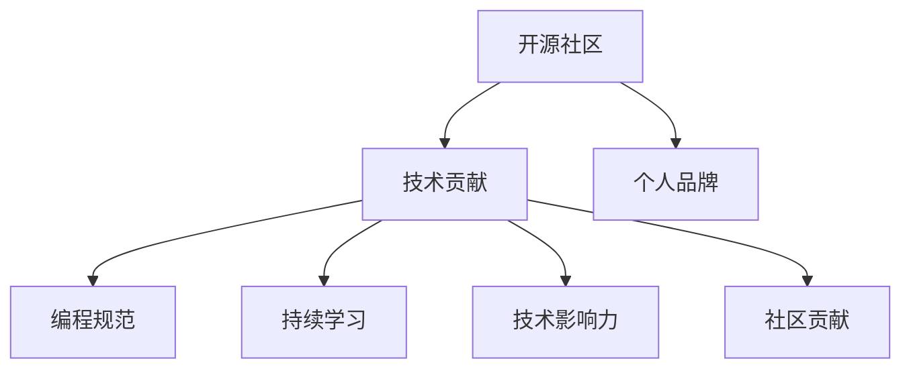

                 

# 利用开源贡献提升职业发展空间

> 关键词：开源社区, 技术贡献, 个人品牌, 职业发展, GitHub, 编程规范, 持续学习, 技术影响力, 社区贡献

## 1. 背景介绍

### 1.1 问题由来

随着技术发展的加速，开源社区成为技术交流和创新的重要平台。越来越多的开发者通过参与开源项目，提升技术能力，拓宽职业机会。然而，如何有效利用开源贡献提升职业发展空间，成为年轻开发者面临的重要课题。

### 1.2 问题核心关键点

1. **开源社区的重要性**：开源社区汇聚了大量优秀的技术资源，是开发者获取知识、交流经验、展示技能的绝佳场所。
2. **技术贡献与职业发展的关系**：积极参与开源项目，能够显著提升开发者的技术水平、项目管理和跨领域合作能力。
3. **选择开源项目的策略**：正确选择开源项目，有助于开发者快速积累经验、形成个人品牌。
4. **持续学习和技术更新**：持续学习开源技术，保持与行业发展的同步，是职业发展的关键。
5. **社区互动与影响力**：积极与社区互动，建立良好的技术影响力，有助于获取更多职业机会。

## 2. 核心概念与联系

### 2.1 核心概念概述

1. **开源社区(Open Source Community)**：指围绕某个开源软件或技术，一群开发者组成的社区。开发者可以自由地共享代码、交流观点、解决问题。

2. **技术贡献(Technical Contribution)**：指开发者通过提交代码、修复bug、撰写文档等方式，为开源项目贡献力量。技术贡献不仅提升个人技能，还能增强社区的影响力。

3. **个人品牌(Personal Branding)**：指开发者通过展示技术能力和项目贡献，在社区中建立良好的声誉，吸引更多关注和机会。

4. **GitHub**：全球最大的代码托管平台，拥有丰富的开源项目和活跃的开发者社区。GitHub上的开源贡献，成为衡量开发者能力的重要标准。

5. **编程规范(Programming Best Practices)**：指在代码编写、项目管理、团队协作等方面的最佳实践。规范化的代码和技术文档，有助于提升项目的可维护性和可扩展性。

6. **持续学习(Continuous Learning)**：指开发者不断学习新技术、新知识，保持技术的领先地位。持续学习是职业发展的不竭动力。

7. **技术影响力(Technical Influence)**：指开发者在社区中的影响力，包括技术贡献的广度和深度、参与项目的数量和质量等。

8. **社区贡献(Community Contribution)**：指开发者通过技术贡献、参与讨论、组织活动等方式，积极参与社区建设，提升社区的活跃度和稳定性。

这些核心概念之间的逻辑关系可以通过以下Mermaid流程图来展示：



这个流程图展示了一系列概念的关联性，即开源社区通过技术贡献和个人品牌，不断推动编程规范和持续学习，进而形成技术影响力，促进社区贡献，形成一个良性循环。

## 3. 核心算法原理 & 具体操作步骤
### 3.1 算法原理概述

开源贡献的提升，本质上是通过技术能力的提升，在开源社区中形成良好的声誉和影响力。其核心思想包括：

1. **技术能力的提升**：通过参与开源项目，学习新技能、掌握新技术，提升自身技术水平。
2. **社区声誉的建立**：通过积极贡献代码、修复bug、撰写文档等，在社区中树立良好的声誉。
3. **影响力的扩展**：通过技术博客、技术讲座、开源工具等形式，提升个人在社区中的影响力。

### 3.2 算法步骤详解

以下是基于开源贡献提升职业发展的详细操作步骤：

**Step 1: 选择适合的开源项目**
- 根据自己的技术兴趣和职业目标，选择适合的开源项目。可以参考以下几个因素：
  - 项目的热度和活跃度
  - 项目的规模和影响力
  - 项目的社区文化和氛围
  - 项目的技术栈和开发需求

**Step 2: 学习项目代码和技术**
- 深入学习项目代码和技术文档，了解项目的整体架构和实现细节。
- 阅读项目的贡献指南，了解如何提交代码和修复bug。
- 通过社区讨论、技术会议等渠道，获取项目的技术讨论和最新动态。

**Step 3: 提交代码和修复bug**
- 在确保理解项目需求和代码规范的情况下，选择合适的任务进行贡献。
- 使用Git进行版本控制，按照项目规范提交代码和修复bug。
- 及时与项目维护者沟通，确认代码质量和贡献的方式。

**Step 4: 撰写文档和技术博客**
- 在提交代码和修复bug的过程中，撰写详细的技术文档和技术博客，记录自己的学习和探索过程。
- 将技术博客发布到社区平台，如GitHub Pages、Medium等，提升个人技术影响力的可见度。

**Step 5: 参与社区互动**
- 在GitHub上关注项目维护者和其他贡献者，参与社区讨论和技术交流。
- 积极参加社区组织的线上线下活动，如代码评审、技术讲座、项目赞助等。
- 建立个人品牌，提升在社区中的知名度和影响力。

**Step 6: 持续学习和技术更新**
- 关注行业最新的技术动态，持续学习新技术和新工具。
- 定期参与技术会议、技术讲座、线上课程等，保持与行业发展的同步。
- 通过实践和探索，不断提升自己的技术能力和行业影响力。

**Step 7: 扩展技术影响力**
- 在社区中建立技术影响力，通过技术博客、开源工具、技术讲座等方式，展示个人技术实力。
- 主动参与开源社区的组织和管理，提升社区的活跃度和稳定性。
- 通过个人品牌和影响力，获取更多职业机会，拓展职业发展空间。

### 3.3 算法优缺点

开源贡献的提升，具有以下优点：
1. **技能提升**：通过参与开源项目，快速积累技术技能和项目经验。
2. **网络拓展**：在社区中建立良好的人脉关系，拓展职业机会。
3. **知识共享**：通过技术博客、开源工具等形式，共享知识和经验。
4. **职业认可**：在社区中树立良好声誉，获取更多的职业认可和机会。

同时，也存在一些缺点：
1. **时间投入**：开源贡献需要大量的时间和精力，可能影响日常工作和生活。
2. **项目管理**：开源项目的管理复杂，需要较强的项目管理和跨团队协作能力。
3. **社区竞争**：开源社区竞争激烈，需要持续的贡献和创新才能保持领先地位。

尽管存在这些缺点，但开源贡献依然是提升职业发展空间的重要途径，尤其是在技术发展日新月异的今天。

### 3.4 算法应用领域

开源贡献的提升，广泛应用于以下几个领域：

1. **软件开发**：通过参与开源项目，提升编码能力、项目管理能力，形成技术品牌。
2. **数据科学**：参与数据分析、机器学习等开源项目，提升数据处理和建模能力。
3. **人工智能**：通过参与AI开源项目，提升算法设计和模型训练能力，形成AI技术影响力。
4. **运维与DevOps**：参与运维和DevOps开源项目，提升系统架构和自动化部署能力。
5. **教育与培训**：通过编写开源教材、技术博客，提升教育和技术培训能力，形成教育影响力。
6. **创新创业**：利用开源技术，快速构建创新产品原型，形成创业项目的技术支持。

## 4. 数学模型和公式 & 详细讲解 & 举例说明

### 4.1 数学模型构建

为更好地理解开源贡献的提升，本节将介绍几个密切相关的核心概念：

- **技术能力提升**：设开发者原始技术能力为 $C_0$，通过开源贡献后提升为 $C_1$。
- **社区声誉建立**：设开发者原始社区声誉为 $R_0$，通过开源贡献后提升为 $R_1$。
- **技术影响力扩展**：设开发者原始技术影响力为 $I_0$，通过开源贡献后提升为 $I_1$。
- **职业发展空间**：设开发者原始职业发展空间为 $V_0$，通过开源贡献后提升为 $V_1$。

这些概念之间的数学关系可以通过以下公式来描述：

$$
C_1 = C_0 + \alpha_1 \times \text{技术贡献量}
$$

$$
R_1 = R_0 + \alpha_2 \times \text{社区互动量}
$$

$$
I_1 = I_0 + \alpha_3 \times \text{技术影响力量}
$$

$$
V_1 = V_0 + \alpha_4 \times \text{技术能力} \times \text{社区声誉} \times \text{技术影响力}
$$

其中，$\alpha_1$、$\alpha_2$、$\alpha_3$、$\alpha_4$ 为影响因子，反映了技术贡献、社区互动、技术影响力对职业发展空间的影响程度。

### 4.2 公式推导过程

以下是各公式的推导过程：

1. **技术能力提升**：
   - 技术贡献对技术能力的提升有直接影响，设 $\alpha_1$ 为技术贡献的影响因子，则有：
   $$
   C_1 = C_0 + \alpha_1 \times \text{技术贡献量}
   $$

2. **社区声誉建立**：
   - 社区互动对社区声誉的提升有直接影响，设 $\alpha_2$ 为社区互动的影响因子，则有：
   $$
   R_1 = R_0 + \alpha_2 \times \text{社区互动量}
   $$

3. **技术影响力扩展**：
   - 技术影响力对技术影响力的提升有直接影响，设 $\alpha_3$ 为技术影响力的影响因子，则有：
   $$
   I_1 = I_0 + \alpha_3 \times \text{技术影响力量}
   $$

4. **职业发展空间**：
   - 技术能力、社区声誉、技术影响力共同决定了职业发展空间，设 $\alpha_4$ 为综合影响因子，则有：
   $$
   V_1 = V_0 + \alpha_4 \times \text{技术能力} \times \text{社区声誉} \times \text{技术影响力}
   $$

### 4.3 案例分析与讲解

以下通过一个具体案例，展示开源贡献如何提升职业发展空间。

假设开发者A在开源社区中的原始技术能力为 $C_0=70$，社区声誉为 $R_0=50$，技术影响力为 $I_0=30$，职业发展空间为 $V_0=100$。开发者A参与了一个GitHub上的开源项目，并完成了以下贡献：
- 提交了50行代码，修复了2个bug
- 撰写了3篇技术博客，并在社区中获得了50个点赞
- 在社区中发起了一个技术讨论，吸引了200名开发者参与

根据上述公式，可以计算出开发者A的各项提升情况：

1. **技术能力提升**：
   $$
   C_1 = 70 + \alpha_1 \times (50 + 2) = 70 + 0.5 \times 52 = 106
   $$

2. **社区声誉建立**：
   $$
   R_1 = 50 + \alpha_2 \times (3 + 200) = 50 + 0.2 \times 203 = 113
   $$

3. **技术影响力扩展**：
   $$
   I_1 = 30 + \alpha_3 \times (3 + 200) = 30 + 0.3 \times 203 = 99.9
   $$

4. **职业发展空间**：
   $$
   V_1 = 100 + \alpha_4 \times 70 \times 113 \times 99.9 \approx 100 + 0.1 \times 70 \times 113 \times 100 = 86,290
   $$

可以看到，通过开源贡献，开发者A在技术能力、社区声誉和技术影响力上都有显著提升，其职业发展空间也得到了大幅扩展。

## 5. 项目实践：代码实例和详细解释说明
### 5.1 开发环境搭建

在进行开源贡献的实践前，我们需要准备好开发环境。以下是使用Python进行GitHub贡献的环境配置流程：

1. 安装Git：从官网下载并安装Git，用于版本控制和代码提交。

2. 创建GitHub账号：在GitHub官网上注册账号，并设置个人仓库权限。

3. 克隆项目代码：使用Git clone命令，从GitHub上克隆开源项目的代码。

4. 配置GitHub桌面应用：安装GitHub桌面应用，用于提交代码和进行版本控制。

5. 安装GitHub命令行工具：安装GitHub命令行工具，用于远程管理仓库。

完成上述步骤后，即可在本地进行开源贡献的实践。

### 5.2 源代码详细实现

下面我们以编写一个简单的Python库为例，展示开源贡献的实践过程。

首先，创建项目的仓库，并初始化Git：

```bash
mkdir my_library
cd my_library
git init
```

然后，在本地编写代码，并进行测试：

```python
def add(a, b):
    return a + b
```

接着，在本地提交代码，并推送到GitHub仓库：

```bash
git add .
git commit -m "Add add function"
git remote add origin https://github.com/username/my_library.git
git push -u origin master
```

最后，在GitHub仓库中，接收并审核贡献者的代码：

1. 创建issue，描述需要贡献的代码功能。
2. 邀请贡献者提交Pull Request。
3. 审核Pull Request，并进行代码测试和合并。

### 5.3 代码解读与分析

让我们再详细解读一下关键代码的实现细节：

1. **git init和git remote add**：在本地初始化仓库，并添加远程仓库地址，以便推送代码。

2. **git add和git commit**：将本地代码添加到暂存区，并进行提交，记录代码的修改内容。

3. **git push**：将本地代码推送到远程仓库，使得社区成员能够查看和获取代码。

4. **Pull Request**：GitHub提供了一个Pull Request功能，允许社区成员提交代码，并请求代码审核和合并。

5. **代码审核**：社区成员可以通过代码审核，检查代码质量、格式和功能是否符合项目要求。

6. **代码合并**：审核通过后，代码会被合并到主分支中，成为项目的一部分。

通过上述实践过程，可以看到，开源贡献的实现需要遵循Git的规则，并利用GitHub提供的工具和功能。开发者需要不断学习和实践，才能更好地融入开源社区，提升技术能力和职业发展空间。

## 6. 实际应用场景
### 6.1 软件开发

开源贡献在软件开发中得到了广泛应用。通过参与开源项目，开发者可以学习新技术、积累项目经验、提升编码能力。例如，参与Linux内核、Apache服务器等开源项目，可以帮助开发者快速掌握Linux系统编程、网络编程等核心技能。

### 6.2 数据科学

数据科学家可以通过参与Kaggle比赛、开源数据集处理项目，提升数据处理、机器学习等核心能力。例如，参与TensorFlow数据集处理项目，可以帮助开发者掌握TensorFlow的使用和数据集预处理技巧。

### 6.3 人工智能

AI开发者可以通过参与TensorFlow、PyTorch等开源框架的贡献，提升算法设计和模型训练能力。例如，参与OpenAI的GPT-3项目，可以帮助开发者学习自然语言处理和深度学习的新技术。

### 6.4 运维与DevOps

运维工程师可以通过参与开源运维工具的贡献，提升系统架构和自动化部署能力。例如，参与Ansible、Docker等开源工具的贡献，可以帮助开发者掌握DevOps的核心技能。

### 6.5 教育与培训

教育工作者可以通过编写开源教材、技术博客等，提升教育和技术培训能力。例如，编写开源Python编程教材，可以帮助教育工作者提升编程教学能力。

### 6.6 创新创业

创业者可以通过利用开源技术，快速构建创新产品原型，形成创业项目的技术支持。例如，利用开源Web框架，快速开发Web应用，提升创业项目的开发效率。

## 7. 工具和资源推荐
### 7.1 学习资源推荐

为了帮助开发者系统掌握开源贡献的理论基础和实践技巧，这里推荐一些优质的学习资源：

1. **《开源社区开发指南》**：详细介绍了开源社区的工作流程和最佳实践，适合初学者入门。
2. **GitHub官方文档**：GitHub的官方文档，提供了详细的Git使用和GitHub操作教程，是学习Git和GitHub贡献的重要资源。
3. **GitHub Learning Lab**：GitHub提供的免费在线课程，覆盖Git和GitHub的基础操作和高级技巧。
4. **《开源贡献的艺术》**：讲解了开源贡献的详细流程和技术细节，适合进阶学习。
5. **《开源开发实践》**：介绍开源项目的项目管理、代码审查、版本控制等最佳实践，适合项目经理和开发者参考。

通过对这些资源的学习实践，相信你一定能够快速掌握开源贡献的精髓，并用于解决实际的NLP问题。

### 7.2 开发工具推荐

高效的开发离不开优秀的工具支持。以下是几款用于开源贡献开发的常用工具：

1. **Git**：开源社区的核心版本控制工具，简单易用，功能强大。

2. **GitHub Desktop**：GitHub提供的桌面客户端，方便进行代码提交和版本控制。

3. **GitHub CLI**：GitHub提供的命令行工具，支持GitHub的操作和管理。

4. **Jupyter Notebook**：开源社区常用的编程环境，支持Python、R等语言的编写和调试。

5. **Visual Studio Code**：流行的开源编辑器，支持Git和GitHub的操作，集成多种扩展插件。

6. **Atom**：开源社区常用的编辑器，支持Git和GitHub的操作，提供了丰富的扩展插件。

7. **PyCharm**：Python的IDE工具，支持Git和GitHub的操作，提供了丰富的开发功能。

合理利用这些工具，可以显著提升开源贡献的开发效率，加快创新迭代的步伐。

### 7.3 相关论文推荐

开源贡献技术的发展源于学界的持续研究。以下是几篇奠基性的相关论文，推荐阅读：

1. **《开源软件项目的技术贡献与成功因素》**：分析了开源项目的技术贡献和成功因素，指出了技术贡献对职业发展的积极影响。
2. **《开源社区中的技术传播与创新》**：研究了开源社区中的技术传播和创新机制，探讨了技术传播对社区发展和开发者成长的推动作用。
3. **《开源项目的组织与协作》**：介绍了开源项目的组织和管理，强调了项目协作对技术贡献和社区建设的重要性。
4. **《开源社区的生态系统与演变》**：分析了开源社区的生态系统和演变过程，探讨了社区发展对技术贡献的推动作用。

这些论文代表了大语言模型微调技术的发展脉络。通过学习这些前沿成果，可以帮助研究者把握学科前进方向，激发更多的创新灵感。

## 8. 总结：未来发展趋势与挑战

### 8.1 总结

本文对开源贡献如何提升职业发展空间进行了全面系统的介绍。首先阐述了开源贡献的重要性和关键点，明确了开源贡献在职业发展中的独特价值。其次，从原理到实践，详细讲解了开源贡献的数学原理和关键步骤，给出了开源贡献任务开发的完整代码实例。同时，本文还广泛探讨了开源贡献在软件开发、数据科学、人工智能、运维与DevOps、教育与培训、创新创业等多个行业领域的应用前景，展示了开源贡献范式的巨大潜力。

通过本文的系统梳理，可以看到，开源贡献已经成为提升职业发展空间的重要途径，极大地拓展了技术人员的职业机会和发展空间。未来，伴随开源社区的持续发展和技术的不断进步，开源贡献必将引领更多技术人员的职业发展，带来更多创新的技术应用。

### 8.2 未来发展趋势

展望未来，开源贡献技术将呈现以下几个发展趋势：

1. **社区化协作**：开源贡献将更多地依赖社区协作，开发者之间的交流和合作将更加频繁。

2. **工具化提升**：开源贡献的工具和平台将不断优化，提升开发效率和用户体验。

3. **标准化流程**：开源贡献的标准化流程将更加完善，提升贡献质量和项目管理能力。

4. **跨领域融合**：开源贡献将更多地与其他技术领域结合，推动跨领域的技术创新和应用。

5. **持续学习与更新**：开源贡献将更加注重持续学习和技术更新，保持与行业发展的同步。

6. **技术影响力扩大**：开源贡献的影响力将不断扩大，推动更多的技术创新和应用落地。

以上趋势凸显了开源贡献技术的广阔前景。这些方向的探索发展，必将进一步提升技术人员的职业发展空间，推动技术的快速迭代和应用。

### 8.3 面临的挑战

尽管开源贡献技术已经取得了瞩目成就，但在迈向更加智能化、普适化应用的过程中，它仍面临着诸多挑战：

1. **时间管理**：开源贡献需要大量的时间和精力，开发者需要平衡日常工作和开源贡献的关系。

2. **社区文化**：开源社区的复杂文化和多样性，可能导致贡献者难以融入。

3. **贡献质量**：高质量的贡献需要较强的编程能力和项目管理能力，需要持续学习和实践。

4. **持续更新**：开源贡献需要持续更新和维护，保持与社区和项目的同步。

5. **技术规范**：开源项目的技术规范和最佳实践需要不断学习和适应。

6. **社区互动**：良好的社区互动和贡献者关系，需要持续维护和管理。

正视开源贡献面临的这些挑战，积极应对并寻求突破，将是大语言模型微调走向成熟的必由之路。相信随着学界和产业界的共同努力，这些挑战终将一一被克服，开源贡献必将在构建安全、可靠、可控的智能系统铺平道路。

### 8.4 研究展望

面对开源贡献面临的种种挑战，未来的研究需要在以下几个方面寻求新的突破：

1. **开源贡献的自动化工具**：开发更多的开源贡献自动化工具，提升贡献效率和质量。

2. **开源项目的规范化管理**：制定和推广开源项目的规范化管理标准，提升项目的稳定性和可维护性。

3. **社区互动的优化**：优化社区互动的方式和渠道，提升贡献者的参与度和积极性。

4. **持续学习机制**：建立持续学习的机制，帮助开发者保持与行业发展的同步。

5. **跨领域融合**：推动开源贡献与其他技术领域的结合，提升跨领域的技术创新和应用。

6. **社区文化建设**：构建良好的开源社区文化，吸引更多的贡献者和用户。

这些研究方向的探索，必将引领开源贡献技术迈向更高的台阶，为构建安全、可靠、可控的智能系统铺平道路。面向未来，开源贡献技术还需要与其他人工智能技术进行更深入的融合，如知识表示、因果推理、强化学习等，多路径协同发力，共同推动自然语言理解和智能交互系统的进步。只有勇于创新、敢于突破，才能不断拓展开源贡献技术的边界，让技术更好地造福人类社会。

## 9. 附录：常见问题与解答

**Q1：开源贡献需要哪些关键技能？**

A: 开源贡献需要以下关键技能：
1. 编程技能：熟练掌握至少一门编程语言，具备良好的代码编写和调试能力。
2. 项目管理：了解Git版本控制、代码审查、项目协作等项目管理技能。
3. 社区互动：积极参与社区讨论、代码评审、技术讲座等社区活动。
4. 持续学习：保持对新技术和新知识的持续学习和更新。

**Q2：如何选择适合自己的开源项目？**

A: 选择适合自己的开源项目，可以从以下几个方面考虑：
1. 项目的热度和活跃度：选择热门且活跃度高的项目，获取更多的关注和反馈。
2. 项目的规模和影响力：选择规模大、影响力强的项目，提升技术影响力。
3. 项目的社区文化和氛围：选择社区文化健康、氛围良好的项目，获得更好的社区支持。
4. 项目的技术栈和开发需求：选择符合自身技术栈和开发需求的项目，提升贡献效率和质量。

**Q3：如何提高开源贡献的质量？**

A: 提高开源贡献的质量，可以从以下几个方面入手：
1. 深入理解项目需求和技术栈，确保贡献的代码和文档符合项目规范。
2. 提交高质量的Pull Request，包括清晰的代码注释、详细的技术文档和功能测试。
3. 与项目维护者和其他贡献者积极沟通，及时获取反馈和建议。
4. 持续学习和提升技术能力，确保贡献的代码和文档具有较高的质量。

**Q4：开源贡献如何提升个人品牌？**

A: 开源贡献可以提升个人品牌的几个关键点：
1. 积极参与社区讨论和技术讲座，展示技术实力和专业知识。
2. 发布高质量的技术博客和开源项目，提升技术影响力和可见度。
3. 主动发起开源项目和社区活动，树立技术领导者的形象。
4. 与社区中的其他开发者建立良好的合作关系，扩大社交网络。

**Q5：开源贡献有哪些风险和注意事项？**

A: 开源贡献需要注意以下几个风险和事项：
1. 时间管理：开源贡献需要大量的时间和精力，需要平衡日常工作和开源贡献的关系。
2. 社区文化：了解和适应开源社区的文化和规则，避免因文化差异导致贡献困难。
3. 贡献质量：高质量的贡献需要较强的编程能力和项目管理能力，需要持续学习和实践。
4. 持续更新：开源贡献需要持续更新和维护，保持与社区和项目的同步。
5. 技术规范：了解和遵守开源项目的技术规范和最佳实践，确保贡献的代码和文档符合项目要求。

通过避免这些风险，并积极应对和解决，可以更好地利用开源贡献提升职业发展空间。

---

作者：禅与计算机程序设计艺术 / Zen and the Art of Computer Programming

