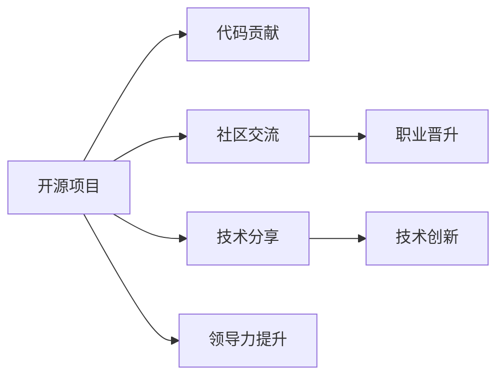

                 

# 利用开源贡献提升职业发展空间

> 关键词：开源社区,技术分享,职业晋升,软件架构,技术创新

## 1. 背景介绍

### 1.1 问题由来
在当今数字化、网络化、信息化的时代，开源已成为软件创新的重要源泉，为全球数以亿计的开发者提供了无尽的资源和平台。无论是初创公司还是大型企业，开源社区都成为了技术突破和职业成长的关键领域。开源不仅促进了软件的快速迭代和改进，也为技术从业者提供了丰富的学习和职业发展机会。然而，面对开源社区中的庞大资源，如何有效地贡献自己的力量，并从中获得更多的职业机会和成长空间，成为摆在每位开发者面前的一个重要问题。

### 1.2 问题核心关键点
本文将从以下几个关键点探讨如何通过开源贡献提升个人职业发展空间：

- **社区参与方式**：如何有效地参与开源项目，确保贡献不被忽视。
- **技术分享与反馈**：如何在开源社区中进行有效交流，提高技术影响力。
- **职业路径规划**：如何在开源贡献中积累经验，促进职业晋升。
- **技术创新与领导力**：如何通过开源贡献展示技术创新和领导力。
- **工具与资源推荐**：开源领域常用的工具和资源，助力职业发展。

## 2. 核心概念与联系

### 2.1 核心概念概述

开源社区是以互联网为基础，通过代码共享、协同开发、技术交流等方式，汇聚全球开发者共同完成软件开发的平台。其核心概念包括：

- **开源项目**：开源软件项目，由代码、文档、社区组成的协作系统。
- **代码贡献**：开发者向开源项目提交代码、修复漏洞、增加功能等行为。
- **社区交流**：开发者在社区内进行问题讨论、技术分享、代码评审等互动。
- **技术分享**：通过博客、研讨会、开源书籍等形式，分享技术见解和项目经验。
- **职业晋升**：通过开源贡献积累经验，晋升为技术负责人、项目经理、架构师等职位。

### 2.2 核心概念原理和架构的 Mermaid 流程图



这个流程图展示了开源社区中各项活动之间的联系，说明开源参与者通过贡献代码、参与交流、分享技术、提升领导力，最终实现职业晋升和技术创新的全过程。

## 3. 核心算法原理 & 具体操作步骤

### 3.1 算法原理概述

开源贡献的提升职业发展空间，本质上是基于技术能力和社区影响力的一种算法。通过不断贡献高质量的代码、参与社区活动、分享技术见解，积累信誉和影响力，逐步在社区中建立自己的品牌，最终获得更好的职业发展机会。

### 3.2 算法步骤详解

开源贡献提升职业发展的算法步骤如下：

**Step 1: 选择合适的开源项目**
- 根据自身的技术特长和兴趣，选择适合自己的开源项目。
- 考虑项目活跃度、技术难度、社区文化等因素。

**Step 2: 积极贡献代码**
- 在GitHub、GitLab等平台注册账号， fork 项目并提交PR（Pull Request）。
- 遵循项目指南，提交高质量的代码和文档。
- 定期更新代码，修复Bug，新增功能。

**Step 3: 参与社区交流**
- 加入项目的邮件列表、Discord、Slack等社区，积极参与讨论。
- 回答问题，提供帮助，分享经验和见解。
- 定期发布进展，保持社区的关注度。

**Step 4: 技术分享与反馈**
- 在社区平台发布博客、写书、做视频等形式的技术分享。
- 邀请社区成员进行代码评审，根据反馈改进贡献。
- 参与社区活动，如线上研讨会、Meetup、黑客松等。

**Step 5: 积累职业经验**
- 在项目中担任技术负责人、维护者等角色。
- 学习项目管理和领导技能，积累项目运营经验。
- 在开源社区中积极表现，获得推荐和认可。

**Step 6: 技术创新与领导力展示**
- 提出新的技术方案、改进优化项目架构。
- 在社区中展示技术创新能力，参与技术讨论和决策。
- 带领团队完成项目，展示领导力。

**Step 7: 职业晋升与长远发展**
- 根据积累的经验和影响力，申请技术负责人、项目经理、架构师等职位。
- 利用开源贡献拓展职业路径，获取更多学习和发展的机会。
- 持续学习和进步，保持技术和职业的双重成长。

### 3.3 算法优缺点

开源贡献提升职业发展的算法具有以下优点：
1. **社区认可**：通过高质量的代码和活跃的社区表现，获得社区成员的认可和尊重。
2. **技术积累**：参与开源项目，积累技术经验和行业认知，提升个人竞争力。
3. **职业晋升**：开源贡献和社区影响力为职业晋升提供了有力的支持。
4. **领导力提升**：在开源项目中担任领导角色，提升项目管理、技术决策能力。
5. **技术创新**：通过提出和实现新方案，展示技术创新能力。

同时，该算法也存在以下局限性：
1. **时间和精力投入**：开源贡献需要持续的时间和精力投入，可能影响日常工作。
2. **社区选择**：选择不合适的项目可能导致贡献被忽视或无意义。
3. **技术与社区契合度**：技术与社区需求不匹配，可能影响贡献效果。
4. **职业晋升慢**：贡献效果和职业晋升之间存在延迟，需耐心等待。

### 3.4 算法应用领域

开源贡献提升职业发展的方法适用于各种IT技术领域，包括但不限于：

- 前端开发：通过参与React、Vue等前端框架的贡献，提升前端技术能力。
- 后端开发：通过参与Node.js、Django等后端框架的贡献，积累后端开发经验。
- 移动开发：通过参与React Native、Flutter等移动开发框架的贡献，提升移动开发技能。
- 云计算：通过参与AWS、Google Cloud等云服务的贡献，掌握云计算技术。
- DevOps：通过参与Docker、Kubernetes等DevOps工具的贡献，提升自动化部署和管理能力。

## 4. 数学模型和公式 & 详细讲解 & 举例说明

### 4.1 数学模型构建

假设开发者 $X$ 在开源社区 $C$ 中的贡献度为 $C(X)$，其在项目 $P$ 中的代码贡献度为 $C_{code}(X,P)$，技术分享度为 $C_{share}(X,P)$，社区活跃度为 $C_{active}(X,P)$。

数学模型可以表示为：

$$
C(X) = \sum_{P \in C} w_{code}C_{code}(X,P) + w_{share}C_{share}(X,P) + w_{active}C_{active}(X,P)
$$

其中，$w_{code}$、$w_{share}$、$w_{active}$ 为权重，根据社区评估标准和开发者表现确定。

### 4.2 公式推导过程

- $C_{code}(X,P) = \sum_{PR \in P} \frac{1}{time_{PR}} \times \text{code\_change}(X,PR)$
- $C_{share}(X,P) = \sum_{article \in X} \frac{1}{time_{article}} \times \text{readers}(article)$
- $C_{active}(X,P) = \sum_{commits \in X} \frac{1}{time_{commit}} \times \text{discussion}(commits)$

其中：
- $time_{PR}$ 为Pull Request的平均处理时间。
- $\text{code\_change}$ 为Pull Request中代码变更数量。
- $\text{readers}(article)$ 为技术文章或博客的阅读人数。
- $\text{discussion}(commits)$ 为提交代码时社区的讨论活跃度。

### 4.3 案例分析与讲解

以React社区为例，假设开发者 $X$ 在React项目中贡献了多个Pull Request，每个PR平均处理时间为3天，代码变更量为10行。同时，$X$ 在社区内发布了多篇技术博客，每篇文章阅读人数为500人，平均更新时间为7天。$X$ 还参与了React社区的Discord讨论，平均每月贡献50条讨论，每次讨论活跃度为5人。

根据上述公式计算：

$$
C_{code}(X,React) = 2 \times 10 / 3 = 6.67
$$
$$
C_{share}(X,React) = 5 \times 500 / 7 = 831.43
$$
$$
C_{active}(X,React) = 0.5 \times 50 / 1 = 25
$$

假设社区权重设定为 $w_{code} = 0.3$，$w_{share} = 0.5$，$w_{active} = 0.2$。则开发者 $X$ 在React社区的贡献度为：

$$
C(X,React) = 0.3 \times 6.67 + 0.5 \times 831.43 + 0.2 \times 25 = 935.28
$$

通过这种量化模型，开发者可以清晰地了解自己在开源社区中的贡献情况，并进行针对性的优化提升。

## 5. 项目实践：代码实例和详细解释说明

### 5.1 开发环境搭建

开源贡献实践需要良好的开发环境支持，以下是一个标准的开发环境搭建流程：

1. 安装Git和GitHub CLI，创建GitHub账号并注册API令牌。
2. 安装Docker和VS Code，配置开发环境。
3. 在GitHub上Fork感兴趣的项目，Clone到本地。
4. 安装项目依赖库，进行本地构建和测试。
5. 提交Pull Request，等待社区审核和代码合并。

### 5.2 源代码详细实现

以提交React组件的Pull Request为例，步骤如下：

1. 克隆React项目：
```bash
git clone https://github.com/facebook/react.git
cd react
```

2. 创建新分支，进行代码开发：
```bash
git checkout -b new-feature
```

3. 编写和测试新组件：
```bash
# 编写代码
npm start
# 测试代码
npm test
```

4. 提交Pull Request：
```bash
git commit -m "Add new feature"
git push origin new-feature
```

5. 在GitHub上提交Pull Request，填写详细的描述和代码说明。

### 5.3 代码解读与分析

**代码实现关键点**：

- 使用分支管理新功能，确保与主分支代码隔离。
- 使用Linter工具检查代码风格和规范。
- 编写单元测试确保新功能正确性。
- 使用Git的Pull Request功能，与社区成员进行代码审核。

**代码优化技巧**：

- 使用代码变更追踪工具，如GitHub的Pull Request，跟踪变更历史。
- 使用社区讨论功能，与开发者进行深入交流。
- 使用Git的merge、rebase、conflict解决等工具，高效管理代码变更。

### 5.4 运行结果展示

成功提交Pull Request后，社区成员会对其进行代码评审，提出改进建议。如果代码符合要求，社区管理员将合并代码到主分支，开发者将获得社区的认可和尊重。通过不断贡献和优化，开发者可以在开源社区中逐步积累影响力，进而获得更好的职业机会。

## 6. 实际应用场景

### 6.1 技术团队管理

开源贡献可以帮助技术团队建立技术标准和流程，提升团队整体的技术水平。通过共享代码、进行代码评审，技术团队可以更好地协同工作，提高代码质量和项目进度。

### 6.2 技术咨询和顾问

开源贡献者的技术分享和讨论，可以为初创公司或大企业提供技术咨询和顾问服务。通过在开源社区展示技术实力，开发者可以获得更多的商业合作机会，拓展职业发展空间。

### 6.3 开源项目运营

开源贡献者可以参与开源项目的维护和运营，提升项目的影响力和可持续性。通过担任项目维护者、技术负责人等角色，开发者可以积累项目管理经验和领导能力，为未来的职业晋升打下基础。

### 6.4 未来应用展望

未来，开源贡献将在更多技术领域和行业场景中发挥重要作用。随着技术的发展，开源社区也将更加开放和多样，为开发者提供更多的学习和成长机会。

在智慧城市、医疗、教育、金融等领域，开源贡献者可以推动技术创新和行业应用。开源社区中的跨领域合作和开源项目，将为各行业带来新的解决方案和应用场景，促进技术的广泛应用和推广。

## 7. 工具和资源推荐

### 7.1 学习资源推荐

1. **《开源社区指南》**：一本详细介绍开源社区参与方式和最佳实践的书籍，适合初学者和进阶开发者。
2. **GitHub官方文档**：GitHub的官方文档，提供了丰富的教程和指南，帮助开发者高效使用GitHub进行代码管理和协作。
3. **在线课程和MOOC**：Coursera、edX、Udacity等平台提供的开源相关课程，涵盖技术、管理和社区互动等各方面知识。
4. **开源书籍和博客**：如《开源之道》、《GitHub入门与实战》等书籍，以及各大社区的博客和技术文章，是获取开源知识的重要来源。
5. **技术社区和论坛**：如Stack Overflow、Reddit、Discord等平台，提供丰富的交流和讨论机会，帮助开发者解决问题和分享经验。

### 7.2 开发工具推荐

1. **Git和GitHub CLI**：管理代码版本和协作的工具。
2. **Docker**：容器化部署和管理工具，方便开发者在本地测试和部署项目。
3. **VS Code**：跨平台开发工具，支持多种编程语言和插件扩展。
4. **JIRA和Trello**：项目管理工具，帮助开发者进行任务分配和进度跟踪。
5. **Slack和Discord**：团队沟通和交流工具，方便开发者进行实时讨论和协作。

### 7.3 相关论文推荐

1. **《开源社区参与的社会网络分析》**：一篇通过社会网络分析方法研究开源社区参与者行为和贡献的论文。
2. **《开源项目成功的因素》**：一篇探讨开源项目成功因素和失败教训的论文。
3. **《开源贡献与职业晋升的关系》**：一篇分析开源贡献和职业发展关系的研究报告。
4. **《开源社区的自我组织行为》**：一篇研究开源社区自我组织机制和治理结构的论文。
5. **《开源贡献对企业招聘的影响》**：一篇研究开源贡献对企业招聘策略和技术评估的影响报告。

## 8. 总结：未来发展趋势与挑战

### 8.1 研究成果总结

本文系统探讨了开源贡献对职业发展的促进作用，提出了基于贡献度、技术分享度、社区活跃度等关键指标的模型构建和量化方法。通过理论分析和案例实践，展示了开源贡献对开发者职业晋升和技能提升的重要影响。

### 8.2 未来发展趋势

开源社区将继续快速发展，成为全球技术创新和知识分享的重要平台。未来趋势包括：

1. **社区的全球化和多样化**：开源社区将覆盖更多地域和行业，成为全球技术创新的重要源泉。
2. **开源项目的多样化**：更多行业和企业将参与开源项目，推动技术在各领域的广泛应用。
3. **开源贡献的普及化**：开发者将更加积极参与开源项目，贡献高质量的代码和文档。
4. **开源生态的完善化**：开源生态系统将更加成熟，提供更全面的工具和资源支持。

### 8.3 面临的挑战

尽管开源社区前景广阔，但面临以下挑战：

1. **时间和精力的投入**：开源贡献需要持续的时间和精力投入，可能影响日常工作。
2. **社区文化和贡献回报**：社区文化和贡献回报机制可能存在差异，影响贡献积极性。
3. **技术和工具的更新**：开源社区快速发展，技术和工具不断更新，需要开发者持续学习。
4. **商业利益冲突**：商业公司可能与开源社区存在利益冲突，影响贡献效果。

### 8.4 研究展望

未来研究将在以下几个方面继续深入：

1. **贡献度量化模型**：改进贡献度量化模型，引入更多维度和指标。
2. **技术影响力和领导力的量化**：研究技术影响力、领导力与职业晋升之间的关系。
3. **开源贡献的动机分析**：深入分析开发者参与开源项目的动机和行为。
4. **开源社区的治理和可持续性**：研究开源社区的治理机制和长期可持续性。
5. **开源贡献对社会的影响**：探讨开源贡献对社会技术进步和公共福利的影响。

## 9. 附录：常见问题与解答

**Q1：开源贡献会影响日常工作吗？**

A: 开源贡献需要时间和精力投入，但可以通过合理安排工作和生活时间，进行有效管理。

**Q2：如何选择合适的开源项目？**

A: 根据自己的技术特长和兴趣，选择活跃度高、贡献渠道明确、社区文化积极的项目。

**Q3：如何避免贡献被忽视？**

A: 积极参与社区讨论，与项目维护者建立良好关系，提高代码质量，确保贡献不被忽视。

**Q4：开源贡献有哪些潜在的商业利益？**

A: 开源贡献展示技术实力，增加商业合作机会，提升个人品牌影响力，促进职业发展。

**Q5：开源贡献如何帮助职业晋升？**

A: 开源贡献积累技术和领导经验，提高在社区中的影响力和认可度，为职业晋升提供有力支持。

---

作者：禅与计算机程序设计艺术 / Zen and the Art of Computer Programming

