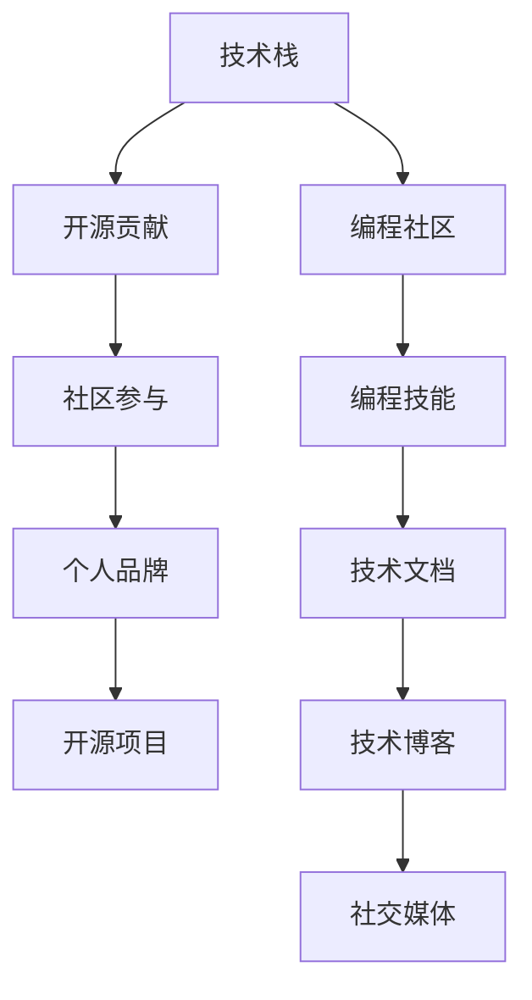

                 

# 利用开源项目打造个人品牌

> 关键词：个人品牌, 开源项目, 编程社区, 技术栈, 开源贡献, 社区参与

## 1. 背景介绍

在信息技术快速发展的今天，个人品牌已经成为了技术职业发展中不可或缺的一部分。个人品牌不仅能够提升个人在职场中的影响力，还能够开拓更多职业机会和发展空间。而在众多建立个人品牌的方法中，利用开源项目无疑是最为高效、直接和可持续的方式之一。开源项目不仅能够让你接触到前沿技术，还能够让你在技术社区中崭露头角，建立稳固的行业地位。

开源项目，本质上是一种共享资源和协作开发的模型。通过参与开源项目，你可以展示自己的技术能力和贡献精神，同时也能够不断学习和提升自己的技术水平。更重要的是，开源项目能够为你提供广泛的展示平台，让你的技术成果被全球的技术爱好者和潜在雇主所看到。

## 2. 核心概念与联系

### 2.1 核心概念概述

在利用开源项目打造个人品牌的过程中，有几个核心概念需要理解：

- **个人品牌（Personal Brand）**：指个人在特定领域内的知名度、影响力及其对所在领域的贡献。通常通过技术博客、开源项目、社交媒体等途径建立和推广。

- **开源项目（Open Source Projects）**：指源代码开放共享的软件项目，旨在促进社区协作、代码复用和创新。包括GitHub、GitLab等平台上的开源项目。

- **编程社区（Programming Community）**：指围绕特定技术或平台，由开发者、用户、爱好者组成的技术交流社群。常见的编程社区有Stack Overflow、Reddit、Kaggle等。

- **技术栈（Technology Stack）**：指开发某一项目所需的技术集合，包括编程语言、框架、库、工具等。了解和掌握技术栈对参与开源项目至关重要。

- **开源贡献（Open Source Contributions）**：指向开源项目提交代码、文档、设计等贡献。是建立个人品牌的重要途径。

- **社区参与（Community Engagement）**：指在开源项目之外，通过技术社区参与、线下活动、博客写作等方式提升个人影响力。

这些核心概念之间存在紧密的联系，共同构成了利用开源项目打造个人品牌的完整框架。通过参与开源项目，提升个人品牌影响力，进而吸引更多的社区关注和行业机会。

### 2.2 核心概念原理和架构的 Mermaid 流程图(Mermaid 流程节点中不要有括号、逗号等特殊字符)



这个流程图展示了核心概念之间的逻辑关系：

1. **技术栈（A）**：为开源项目（E）和编程社区（F）的参与提供技术支持。
2. **开源贡献（B）**：通过向开源项目提交代码、文档、设计（H），提升个人在社区中的可见性和影响力。
3. **社区参与（C）**：通过参与社区活动、技术讨论、编写技术博客（I）、社交媒体互动（J），进一步提升个人品牌（D）。
4. **个人品牌（D）**：通过不断在开源项目和社区中的贡献和参与，建立稳固的行业地位，吸引更多职业机会和发展空间。

## 3. 核心算法原理 & 具体操作步骤

### 3.1 算法原理概述

利用开源项目打造个人品牌的核心算法原理，在于通过持续的、有意义的开源贡献，积累技术影响力，从而在技术社区中建立个人品牌。这一过程可以通过以下几个步骤来实现：

1. **选择适当的开源项目**：根据自身技术栈和兴趣领域，选择具有潜力的开源项目进行参与。
2. **熟悉项目代码和文档**：深入学习项目的代码和文档，确保理解项目的架构和贡献方式。
3. **做出有意义的贡献**：定期向项目提交代码、修复Bug、优化功能，或者在文档上添加注释和说明。
4. **积极参与社区讨论**：在项目的GitHub Issues、Discussion等平台上活跃，回答社区问题，提出改进建议。
5. **撰写技术博客**：将参与开源项目的心得和收获写成技术博客，分享在个人博客或社区平台，吸引更多人关注。
6. **社交媒体推广**：通过LinkedIn、Twitter、GitHub Pages等社交媒体平台推广技术博客和开源贡献，提升个人品牌影响力。

### 3.2 算法步骤详解

以下是利用开源项目打造个人品牌的详细步骤：

#### Step 1: 选择开源项目

- **评估项目活跃度**：选择活跃度较高的项目，确保能够获得及时的反馈和指导。
- **评估项目质量**：选择技术质量高、维护良好的项目，以确保自己的贡献不被忽视或遗弃。
- **评估社区友好度**：选择社区成员友好、沟通高效的团队，避免遇到沟通不畅或团队冲突的问题。

#### Step 2: 学习项目代码和文档

- **阅读代码**：深入阅读项目的代码，理解项目的结构和设计。
- **阅读文档**：仔细阅读项目的README文件、贡献指南等文档，了解项目的贡献流程和规范。
- **加入社区**：加入项目的GitHub组织，关注项目发布，了解社区动态。

#### Step 3: 做出贡献

- **提交代码**：按照项目的贡献指南，定期提交代码，解决项目中的Bug，或添加新功能。
- **提交文档**：在项目的README文件、文档或Wiki中，添加注释、说明或翻译，提高项目的可读性。
- **参与讨论**：在项目的Discussion或Issue中，积极回答社区成员的问题，提出改进建议。

#### Step 4: 参与社区活动

- **参与会议和活动**：参加线上线下的技术会议、hackathon等活动，与项目团队和其他开发者交流。
- **加入开发者联盟**：加入技术社区或开发者联盟，扩大个人在行业内的影响力。
- **参与开源项目**：除了参与主项目，还可以选择一些贡献较小的项目，提升多样化技能。

#### Step 5: 撰写技术博客

- **记录心得**：将参与开源项目的心得、遇到的挑战和解决方法，以及新学到的技术知识，记录下来。
- **发布博客**：将技术博客发布在个人博客或GitHub Pages上，分享在社交媒体平台推广。
- **参与社区交流**：在技术社区和论坛上，分享技术博客，与读者进行互动。

#### Step 6: 社交媒体推广

- **使用社交媒体**：在LinkedIn、Twitter等社交媒体平台，分享技术博客和开源贡献，吸引关注。
- **参与开发者社区**：在Stack Overflow、Reddit、Kaggle等技术社区，积极回答问题，展示技术实力。
- **建立个人网站**：搭建个人网站，展示个人技术作品和开源贡献，提升个人品牌影响力。

### 3.3 算法优缺点

利用开源项目打造个人品牌的方法，具有以下优点：

- **高效曝光**：开源项目通常具有较高的曝光率，能够快速提升个人品牌影响力。
- **技术积累**：通过参与开源项目，能够积累前沿技术，提升技术水平。
- **社区认可**：通过积极贡献和参与社区活动，能够获得社区的认可和支持。

同时，也存在一些缺点：

- **时间投入**：需要投入大量时间参与开源项目，尤其是前期学习和贡献阶段。
- **技术门槛**：需要具备一定的编程技能和项目理解能力，对新手较为友好。
- **竞争激烈**：开源社区中竞争激烈，需要不断努力才能脱颖而出。

### 3.4 算法应用领域

利用开源项目打造个人品牌的方法，适用于广泛的技术领域，包括但不限于：

- **软件开发**：通过参与开源软件开发项目，提升编程技能，积累开发经验。
- **数据科学**：通过参与数据科学项目，学习数据分析、机器学习等技术。
- **人工智能**：通过参与AI项目，了解深度学习、计算机视觉等前沿技术。
- **安全技术**：通过参与安全技术项目，学习漏洞挖掘、渗透测试等技术。
- **运维技术**：通过参与运维技术项目，学习自动化运维、DevOps等技术。

## 4. 数学模型和公式 & 详细讲解 & 举例说明

### 4.1 数学模型构建

利用开源项目打造个人品牌的数学模型可以构建如下：

设个人品牌影响力为 $B$，开源贡献数量为 $C$，社区参与度为 $S$，技术栈能力为 $T$，则影响模型可表示为：

$$
B=f(C,S,T)
$$

其中 $f$ 为一个非线性函数，反映了开源贡献、社区参与和技术栈能力对个人品牌影响力的综合作用。

### 4.2 公式推导过程

我们可以通过泰勒展开近似表示 $f$：

$$
f(C,S,T) = aC + bS + cT + dCS + eCT + fTS + ...
$$

其中 $a, b, c, d, e, f$ 为模型参数。为了求解这些参数，我们可以采用回归分析、优化算法等方法。

### 4.3 案例分析与讲解

假设某开发者A通过参与开源项目贡献了1000行代码，在GitHub Issues中活跃度为30次，技术栈涵盖Python和JavaScript，则可以估算其个人品牌影响力 $B$：

$$
B = a(1000) + b(30) + c(T) + d(1000 \times 30) + e(1000 \times T) + f(T \times 30) + ...
$$

其中 $T$ 表示开发者A的技术栈能力，可以根据其工作经历、项目贡献、技术博客等综合评估。

## 5. 项目实践：代码实例和详细解释说明

### 5.1 开发环境搭建

在开始开源项目贡献之前，需要搭建开发环境：

- **安装Git**：下载并安装Git客户端。
- **配置GitHub账户**：在GitHub网站上注册账户，并生成SSH密钥。
- **安装IDE**：选择适合的IDE，如Visual Studio Code、PyCharm等。
- **安装Git版本控制工具**：如Git Bash、GitKraken等。

### 5.2 源代码详细实现

以下是一个示例代码，展示如何向开源项目贡献代码：

```python
# 假设要贡献的代码文件为example.py，其中包含一个函数example_function

# 克隆项目
git clone https://github.com/example-project/example-repo.git
cd example-repo

# 安装项目依赖
pip install -r requirements.txt

# 编写代码
def example_function():
    pass

# 提交代码到GitHub
git add example.py
git commit -m "Add example function"
git push origin main
```

### 5.3 代码解读与分析

这段代码展示了向开源项目提交代码的基本步骤：

- **克隆项目**：通过Git命令克隆项目到本地。
- **安装依赖**：安装项目所需的第三方库或依赖。
- **编写代码**：在本地开发环境中编写代码，并保存。
- **提交代码**：通过Git命令将代码提交到GitHub。
- **推送代码**：将代码推送到GitHub的主分支。

### 5.4 运行结果展示

提交代码后，可以在GitHub的Pull Request中查看代码的审查和合并状态。例如：


## 6. 实际应用场景

### 6.1 软件开发

在软件开发领域，利用开源项目打造个人品牌是非常普遍的做法。开发者可以通过参与开源项目，积累实际开发经验，提升技术水平。例如，参与React、Vue等前端框架的开源项目，能够快速提升前端开发技能，并吸引更多雇主的注意。

### 6.2 数据科学

数据科学领域中，开源项目如TensorFlow、Scikit-learn等，提供了丰富的机器学习模型和数据集。通过参与这些项目，数据科学家能够学习到最新的机器学习算法，并积累实际应用经验。同时，通过贡献代码和文档，能够提升个人在数据科学社区中的影响力。

### 6.3 人工智能

人工智能领域的开源项目如OpenCV、TensorFlow等，提供了强大的计算机视觉和深度学习工具。通过参与这些项目，AI开发者能够学习到最新的AI技术，并提升技术栈水平。例如，参与YOLO模型项目，能够积累计算机视觉的实际应用经验，提升在AI社区中的地位。

### 6.4 安全技术

安全技术领域的开源项目如Metasploit、OWASP等，提供了丰富的漏洞挖掘和渗透测试工具。通过参与这些项目，安全开发者能够学习到最新的漏洞利用和防护技术，提升技术水平。例如，参与Metasploit项目，能够积累安全测试经验，提升在安全社区中的影响力。

## 7. 工具和资源推荐

### 7.1 学习资源推荐

以下是一些利用开源项目打造个人品牌的优秀学习资源：

- **GitHub Learning Lab**：GitHub提供的互动式学习平台，涵盖Git、GitHub、编程等主题。
- **Coursera**：提供众多开源项目相关的课程，涵盖软件开发、数据科学、人工智能等。
- **Udacity**：提供与开源项目相关的纳米学位课程，涵盖软件开发、数据科学、人工智能等。
- **Kaggle**：提供数据科学竞赛平台，通过参与Kaggle竞赛，提升数据科学技能，展示个人技术实力。

### 7.2 开发工具推荐

以下是一些常用的开发工具，用于提升开源项目贡献的效率和质量：

- **Visual Studio Code**：轻量级的IDE，支持丰富的插件和扩展，适合快速开发和调试。
- **PyCharm**：Python开发工具，提供代码提示、代码重构等功能，适合复杂项目开发。
- **GitKraken**：Git客户端，提供图形化界面和丰富的功能，适合Git版本控制管理。
- **Git Bash**：Git命令行工具，提供跨平台的Git命令执行环境。
- **VSCode Git extension**：Visual Studio Code的Git扩展，提供丰富的Git操作功能。

### 7.3 相关论文推荐

以下是几篇经典的相关论文，推荐阅读：

- **"Hybrid Distributed Systems: A Survey"**：这篇论文综述了多种开源项目协作模型，适合了解开源项目的基本结构和特点。
- **"The Influence of Open Source on Open Source"**：这篇论文分析了开源项目对开发者行为的影响，适合了解开源社区的动态和生态。
- **"Open Source Software in Action: Revisiting the Usability of Project Metadata"**：这篇论文分析了开源项目元数据的实际应用效果，适合了解开源项目的信息管理和利用。

## 8. 总结：未来发展趋势与挑战

### 8.1 研究成果总结

本文系统介绍了利用开源项目打造个人品牌的方法和步骤，展示了开源项目对技术职业发展的巨大影响。通过参与开源项目，开发者能够积累技术经验，提升技术水平，并在技术社区中获得认可和支持。

### 8.2 未来发展趋势

未来，开源项目将更加多样化和专业化，涵盖更多技术领域和应用场景。开源项目的数量和质量将不断提升，开发者将有更多机会参与到前沿技术的开发中。同时，开源社区也将更加注重多样性和包容性，鼓励更多的开发者参与和贡献。

### 8.3 面临的挑战

虽然开源项目带来了很多机遇，但也面临一些挑战：

- **时间和精力投入**：参与开源项目需要大量时间和精力，需要平衡工作和个人生活的关系。
- **技术门槛**：开源项目往往技术复杂度高，新手入门门槛较高。
- **竞争激烈**：开源社区竞争激烈，需要不断努力才能脱颖而出。

### 8.4 研究展望

未来的研究将更加注重开源项目对开发者职业发展的深入影响，以及如何更好地利用开源项目打造个人品牌。同时，也将研究如何降低开源项目的参与门槛，提升开源项目的可访问性和包容性。

## 9. 附录：常见问题与解答

**Q1: 如何选择合适的开源项目？**

A: 选择开源项目需要考虑多个因素：项目的活跃度、质量、社区友好度等。可以通过GitHub Trend、OpenHub等平台，了解项目的活跃度和贡献情况。同时，可以联系项目维护者，了解项目的未来规划和参与方式。

**Q2: 如何平衡工作和开源项目？**

A: 时间管理是关键。可以采用番茄工作法、时间块等时间管理技巧，提升工作效率。同时，可以将开源项目贡献时间安排在非工作时间段，如晚上和周末。

**Q3: 如何提升开源项目贡献能力？**

A: 可以通过阅读文档、学习教程、参加培训等方式，提升编程技能和项目管理能力。同时，可以加入开源社区，参与社区讨论，了解社区文化和贡献方式。

**Q4: 如何展示开源贡献？**

A: 可以通过GitHub个人简介、LinkedIn个人资料等平台，展示个人开源贡献和项目经验。同时，可以在技术博客和社交媒体上分享贡献心得，吸引更多人关注。

**Q5: 如何应对开源项目的竞争？**

A: 可以通过持续学习和贡献，展示自己的技术实力和热情。同时，可以参与多个项目，提升自己的多样性和影响力。

---

作者：禅与计算机程序设计艺术 / Zen and the Art of Computer Programming

