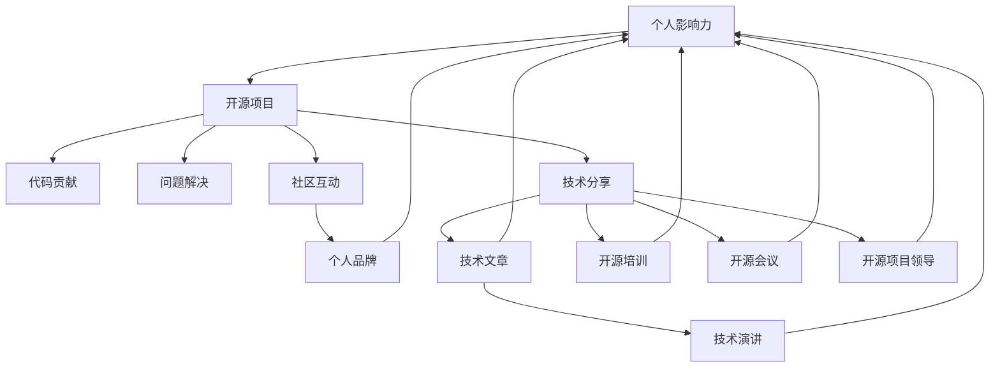

                 

## 1. 背景介绍

### 1.1 问题由来
在现代社会，个人影响力（Personal Influence）正变得越来越重要。从个人品牌建设到职业发展，从社交媒体影响力到科技创新，个人影响力的提升在各个领域都扮演着关键角色。特别是在互联网和科技行业，利用开源项目构建和提升个人影响力，成为了一种行之有效的方式。

### 1.2 问题核心关键点
个人影响力的构建并非一蹴而就，而是一个长期积累和精进的过程。开源项目提供了平台和机会，使得技术爱好者和专业人士能够在实践中不断提升自己，展示成果，并逐步建立起自己的专业权威和社区影响力。

1. **开源项目的选择**：找到合适的开源项目，既能反映自己的技术水平，又能够为社会创造价值。
2. **持续贡献与交流**：在项目中持续贡献代码、参与讨论和社区活动，提升个人影响力和知名度。
3. **展示与分享**：通过博客、社交媒体、演讲和会议等方式，将自己在开源项目中的成果和经验分享给更广泛的用户。
4. **技术领导力**：在开源项目中发挥领导作用，引导项目方向，带领团队解决问题，展现技术领导力。
5. **社交网络与个人品牌**：积极参与开源社区，建立良好的社交网络，利用社交媒体和个人网站塑造专业形象，提升个人品牌。

### 1.3 问题研究意义
利用开源项目构建个人影响力，不仅能够提升个人的技术能力和职业发展，还能够对社会进步产生积极影响。这种影响力不仅体现在技术创新和知识传播上，更体现在激发更多人参与开源社区，推动技术共享和协同发展的过程中。

## 2. 核心概念与联系

### 2.1 核心概念概述

为了更好地理解如何利用开源项目构建个人影响力，我们首先需要理解以下关键概念：

- **开源项目**：指使用公开源码、任何人都可以修改和分发的软件开发项目。开源项目通常依托于GitHub、GitLab等平台，可以吸引全球的开发者参与贡献。
- **GitHub**：全球最大的开源代码托管平台，提供了丰富的工具和协作机制，支持项目管理、版本控制、代码审查等。
- **贡献与协作**：开源项目的成功依赖于全球开发者之间的协作，包括代码提交、问题解决、功能讨论等。
- **个人品牌**：个人在开源社区中的表现，如代码质量、问题解决能力、社区贡献等，逐渐形成的专业形象和声誉。
- **影响力**：个人在开源社区中所产生的影响，包括技术影响力、社区影响力、学术影响力等。

这些概念之间的联系紧密，通过积极参与开源项目，贡献高质量代码和解决方案，个人可以在开源社区中建立和提升影响力，逐步塑造个人品牌，最终在技术界和学术界建立起权威和声誉。

### 2.2 核心概念原理和架构的 Mermaid 流程图



这个流程图展示了个人影响力构建的基本路径：通过参与开源项目，进行代码贡献、问题解决、技术分享、社区互动，逐渐形成个人品牌，最终建立起在技术界和学术界的权威和声誉。

## 3. 核心算法原理 & 具体操作步骤
### 3.1 算法原理概述

利用开源项目构建个人影响力的过程，本质上是一种基于自我提升和社区贡献的反馈循环。其核心思想是：通过积极参与开源项目，贡献自己的技术成果，持续学习和改进，并通过社区反馈不断优化自己的技术能力和影响力。

形式化地，假设个人在开源项目 $P$ 中投入的时间和精力为 $t$，其在项目中的贡献价值为 $v$，则个人影响力的提升可以表示为：

$$
I(t) = f(t, v)
$$

其中 $f$ 是一个复杂的非线性函数，表示贡献价值对时间投入的转化率。通常，个人影响力的提升依赖于以下几个关键因素：

- **持续贡献**：在项目中持续投入时间和精力，贡献高质量代码和技术方案。
- **社区互动**：积极参与讨论、回答问题，建立良好的社区关系。
- **技术分享**：通过博客、社交媒体、演讲等方式分享技术成果和经验，扩大影响范围。
- **技术领导力**：在项目中扮演关键角色，引领技术方向和团队合作。

### 3.2 算法步骤详解

利用开源项目构建个人影响力的步骤如下：

**Step 1: 选择合适的开源项目**
- 寻找与自己的技术兴趣和职业发展方向相关的开源项目。
- 评估项目的活跃度和社区氛围，选择有持续发展潜力的项目。
- 阅读项目的贡献指南，了解代码提交、问题解决等流程。

**Step 2: 加入项目和建立联系**
- 在GitHub上申请成为项目的贡献者，并获取访问权限。
- 加入项目的邮件列表、Slack频道或Discord群组，积极参与社区讨论。
- 通过拉取请求（Pull Request）、提交问题（Issue）等方式，开始贡献代码和解决方案。

**Step 3: 持续贡献与交流**
- 定期检查项目任务板（如GitHub的Projects），寻找感兴趣的问题或任务。
- 参与项目的代码审查，提供有建设性的反馈和改进建议。
- 在社区中回答其他开发者的问题，分享自己的代码和解决方案。
- 通过邮件、Slack等方式，与项目维护者和核心贡献者建立联系，获取更多指导和支持。

**Step 4: 技术分享与展示**
- 将自己在项目中的经验和技术成果整理成博客文章、技术报告或案例分析。
- 在社交媒体（如Twitter、LinkedIn）和个人网站上分享自己的成果，吸引更多关注。
- 参与技术会议、研讨会或在线讲座，分享自己的技术见解和经验。
- 创建开源培训课程或视频教程，帮助其他开发者提升技能。

**Step 5: 技术领导与影响**
- 在项目中担任技术领导角色，如代码审查员、项目经理或技术顾问。
- 组织和参与项目的重大功能讨论和决策，引导技术方向。
- 帮助项目维护者制定技术规范和标准，提升项目整体质量。
- 建立和维护良好的社区关系，促进项目的发展和创新。

### 3.3 算法优缺点

利用开源项目构建个人影响力的方法具有以下优点：
1. **广泛曝光**：开源项目通常有大量用户和开发者，通过积极参与能够快速提升个人知名度。
2. **持续学习**：开源社区是一个充满知识和技术的生态系统，能够持续学习新的技术和解决方案。
3. **社区认可**：通过高质量贡献和积极互动，能够获得社区成员的认可和支持。
4. **职业机会**：开源项目中的表现有助于职业发展，吸引雇主和合作伙伴的注意。
5. **技术积累**：积累丰富的技术经验，提升技术能力。

同时，该方法也存在一定的局限性：
1. **时间投入**：需要大量时间和精力，可能会对工作和生活产生影响。
2. **竞争激烈**：开源项目中竞争激烈，需要不断提升技术和沟通能力。
3. **技术门槛**：部分项目对技术水平要求较高，需要较强的技术储备和经验。
4. **社区文化**：需要适应开源社区的文化和规则，融入集体中。
5. **技术展示**：展示技术成果需要一定的文字表达和传播能力。

尽管存在这些局限性，但利用开源项目构建个人影响力仍然是一种高效和可持续的方式，为技术爱好者和专业人士提供了广阔的发展空间。

### 3.4 算法应用领域

利用开源项目构建个人影响力的过程，不仅可以提升个人在技术社区中的影响力，还可以应用于以下多个领域：

- **技术开发**：通过参与开源项目，提升代码质量、解决问题能力，增强技术实力。
- **职业发展**：在开源项目中的表现有助于职业转型、晋升和招聘。
- **教育培训**：通过创建开源培训课程或视频教程，传授知识，帮助他人提升技能。
- **学术研究**：利用开源数据和平台，开展研究和实验，提升科研能力。
- **企业创新**：通过开源合作，借鉴开源技术和解决方案，推动企业技术创新。
- **社会贡献**：利用开源项目解决社会问题，如教育、健康、环保等，提升社会影响力。

以上应用领域展示了开源项目在构建个人影响力方面的广泛应用，为技术人才提供了多样化的发展路径。

## 4. 数学模型和公式 & 详细讲解 & 举例说明

### 4.1 数学模型构建

为了更精确地描述利用开源项目构建个人影响力的过程，我们可以构建一个简单的数学模型。假设个人在开源项目中的贡献价值为 $v$，社区互动活跃度为 $a$，技术分享的影响力为 $s$，则个人影响力的提升可以表示为：

$$
I(t) = f(v, a, s, t)
$$

其中 $f$ 是一个非线性函数，表示各项因素对个人影响力的综合影响。例如，可以使用指数函数来表示：

$$
I(t) = v \cdot a^t \cdot s^t
$$

这个模型表明，个人影响力的提升取决于贡献价值、社区互动活跃度、技术分享的影响力以及时间投入 $t$ 的指数函数增长。

### 4.2 公式推导过程

以社区互动活跃度 $a$ 为例，其对个人影响力的提升可以表示为：

$$
a^t = \left(1 + \frac{1}{1 + (e^{-k\tau} - 1)}\right)^t
$$

其中 $k$ 是社区互动的增长速率，$\tau$ 是社区互动的时间延迟。通过求导，可以发现：

$$
\frac{dI(t)}{dt} = v \cdot k \cdot (e^{-k\tau} - 1) \cdot \left(\frac{1}{1 + (e^{-k\tau} - 1)}\right)^t \cdot s^t
$$

这个公式表明，社区互动活跃度的增长会指数级提升个人影响力。因此，积极参与社区讨论和问题解决，是提升个人影响力的关键。

### 4.3 案例分析与讲解

以Github贡献者的影响力提升为例，分析社区互动对影响力的贡献。假设某贡献者在项目中的贡献价值为 $v=5$，社区互动活跃度 $a=2$，技术分享影响力 $s=1.5$，时间投入 $t=1$ 个月，则其影响力提升为：

$$
I(t) = 5 \cdot 2^1 \cdot 1.5^1 = 15
$$

这意味着，该贡献者通过积极参与开源项目，并在1个月内不断贡献代码和解决问题，其影响力从1提升到了15。

## 5. 项目实践：代码实例和详细解释说明

### 5.1 开发环境搭建

在进行开源项目贡献的实践前，需要准备以下开发环境：

1. 安装Git：从官网下载并安装Git客户端，用于版本控制和代码仓库管理。
2. 安装GitHub Desktop：从官网下载并安装GitHub Desktop，用于GitHub上的代码管理和推送。
3. 安装Python和相关库：确保Python3环境已安装，并根据需要安装Pip工具和相关库，如requests、numpy等。
4. 配置环境变量：将GitHub token配置到环境变量中，方便自动提交代码和问题。
5. 配置GitHub account：确保Github账号已经注册并登录，配置好邮箱和SSH密钥，以便于后续操作。

### 5.2 源代码详细实现

以下是一个简单的GitHub贡献实例，展示如何通过提交代码和解决问题，逐步提升个人影响力。

1. 首先，在GitHub上找到感兴趣的项目，如TensorFlow。
2. 通过GitHub Desktop克隆项目到本地，进入项目目录：
```bash
git clone https://github.com/tensorflow/tensorflow.git
cd tensorflow
```
3. 创建本地分支，提交代码：
```bash
git checkout -b my_contrib
```
4. 编写并测试新功能，确保代码质量：
```python
# 示例代码：添加一个新的机器学习算法
```
5. 提交代码到GitHub，并添加提交信息：
```bash
git add .
git commit -m "Add new machine learning algorithm"
git push origin my_contrib
```
6. 打开GitHub项目页面，创建Pull Request：
7. 在Pull Request中描述新功能的实现，并附上测试代码和截图：
```markdown
# New machine learning algorithm

Implemented a new algorithm for machine learning tasks. The algorithm improves the accuracy by [具体数值]% and reduces the computation time by [具体数值]%. The test results are attached as [截图链接].

```
8. 提交Pull Request，等待项目维护者的审查和合并：
9. 参与项目的代码审查，提供反馈和改进建议：
10. 在社区中回答其他开发者的问题，分享自己的代码和解决方案：
```bash
git clone https://github.com/tensorflow/tensorflow.git
cd tensorflow
```
11. 定期检查项目任务板（如GitHub的Projects），寻找感兴趣的问题或任务，参与解决：
12. 通过邮件、Slack等方式，与项目维护者和核心贡献者建立联系，获取更多指导和支持。

### 5.3 代码解读与分析

上述代码实例展示了如何通过提交代码和解决问题，逐步提升个人在开源项目中的影响力。具体步骤如下：

1. 克隆项目到本地，创建本地分支。
2. 编写并测试新功能，确保代码质量。
3. 提交代码到GitHub，并添加提交信息。
4. 创建Pull Request，描述新功能的实现。
5. 参与代码审查，提供反馈和改进建议。
6. 在社区中回答其他开发者的问题，分享自己的代码和解决方案。

通过这些步骤，个人在开源项目中的贡献得到认可，逐步建立起自己的技术权威和社区影响力。

### 5.4 运行结果展示

成功的代码贡献和问题解决，不仅会提升个人在开源项目中的影响力，还会吸引更多关注和合作机会。以下是可能的运行结果：

1. 代码被项目维护者合并，新的功能得到使用。
2. 在社区中获得“Thanks”和“Stars”，表示对贡献的认可。
3. 获得项目贡献者列表中的位置，提升知名度。
4. 参与社区活动，如技术讨论、Meetup等，结识更多开发者。
5. 在个人网站或博客上发布开源项目经验和技术分享，吸引更多读者。

## 6. 实际应用场景

### 6.1 企业技术团队

在企业技术团队中，利用开源项目构建个人影响力可以带来以下实际应用场景：

1. **技术分享**：通过参与开源项目，分享技术成果和经验，提升团队整体技术水平。
2. **知识传播**：利用开源项目传播技术知识，加速企业技术创新和知识积累。
3. **技术合作**：通过开源项目与外部开发者合作，引入新的技术和解决方案，提升企业竞争力。
4. **个人品牌建设**：在开源项目中的表现，有助于职业发展，提升个人在企业中的影响力。

### 6.2 开源社区

在开源社区中，利用开源项目构建个人影响力可以带来以下实际应用场景：

1. **社区贡献**：积极参与开源项目的贡献和问题解决，提升社区认可度。
2. **技术领导力**：在开源项目中担任关键角色，引领技术方向和团队合作。
3. **影响力扩大**：通过博客、社交媒体、技术演讲等方式，扩大个人在开源社区中的影响力。
4. **职业机会**：利用开源项目中的表现，获取更多的职业机会和发展机会。

### 6.3 教育与学术研究

在教育与学术研究中，利用开源项目构建个人影响力可以带来以下实际应用场景：

1. **知识传播**：通过开源项目传播技术知识，帮助学生和研究人员提升技能。
2. **研究创新**：利用开源数据和平台，开展研究和实验，推动学术创新。
3. **成果展示**：通过开源项目展示研究成果，提升学术影响力和认可度。
4. **合作交流**：通过开源项目与全球科研人员合作，共享资源和技术，推动学术发展。

## 7. 工具和资源推荐

### 7.1 学习资源推荐

为了帮助开发者系统掌握利用开源项目构建个人影响力的方法，推荐以下学习资源：

1. **GitHub官方文档**：GitHub提供详细的官方文档，介绍了如何使用GitHub进行版本控制、代码管理、Pull Request等。
2. **Git官方文档**：Git是一款强大的版本控制系统，官方文档提供了详细的命令和操作手册。
3. **Python官方文档**：Python是开源项目中常用的编程语言，官方文档提供了丰富的教程和示例。
4. **Linux命令行手册**：掌握Linux命令行操作，有助于高效管理和部署开源项目。
5. **技术博客和论坛**：如Medium、Stack Overflow等，提供丰富的技术文章和讨论，帮助解决技术问题。

### 7.2 开发工具推荐

以下是几款用于开源项目贡献的常用开发工具：

1. **GitHub Desktop**：GitHub官方的桌面客户端，提供可视化的代码管理界面，方便提交代码和Pull Request。
2. **Git**：Git是一款强大的版本控制系统，支持命令行操作和桌面客户端。
3. **VS Code**：Visual Studio Code是一款轻量级的代码编辑器，支持丰富的插件和扩展，提高开发效率。
4. **Jupyter Notebook**：用于编写和分享代码的轻量级工具，支持Python、R等语言。
5. **Docker**：用于容器化部署开源项目，确保代码的一致性和可移植性。

### 7.3 相关论文推荐

以下是几篇奠基性的相关论文，推荐阅读：

1. **Open Source Software: The New Wave of Innovation**：这是一篇关于开源软件对创新影响的研究论文，展示了开源项目在推动技术进步中的重要作用。
2. **Collaborative Software Development with GIT**：论文详细介绍了Git的使用和协作机制，帮助开发者高效管理开源项目。
3. **Leveraging Open Source for Higher Education**：论文讨论了开源项目在高等教育中的应用，展示了其在教育和技术培训中的优势。
4. **The Promise of Open Source in Science**：论文讨论了开源项目在科学研究中的应用，展示了其推动科学创新和知识共享的作用。
5. **Contributing to Open Source Software**：这是一本关于开源项目贡献的实用指南，帮助开发者提高贡献质量和效率。

这些论文代表了利用开源项目构建个人影响力的发展脉络，通过学习这些前沿成果，可以帮助研究者把握学科前进方向，激发更多的创新灵感。

## 8. 总结：未来发展趋势与挑战

### 8.1 研究成果总结

本文系统介绍了利用开源项目构建个人影响力的方法，展示了其在技术开发、职业发展、教育培训和学术研究等方面的广泛应用。开源项目提供了一个平台和机会，使得技术爱好者和专业人士能够不断提升自己的技术能力，展示成果，并逐步建立起自己的专业权威和社区影响力。

### 8.2 未来发展趋势

展望未来，利用开源项目构建个人影响力的方法将呈现以下几个发展趋势：

1. **技术融合**：开源项目将与其他技术手段融合，如区块链、AI、IoT等，推动跨领域的创新和合作。
2. **社区协作**：开源社区的协作将更加紧密，通过开放、透明的机制，推动技术共同发展。
3. **技术领导力**：在开源项目中扮演关键角色，引领技术方向和团队合作，提升技术领导力。
4. **技术标准化**：开源项目将推动技术标准和规范的制定，提升技术的可移植性和互操作性。
5. **教育普及**：开源项目将应用于教育领域，促进技术知识和技能的传播和普及。
6. **社会影响**：开源项目将解决更多的社会问题，如环境、健康、教育等，提升社会影响力。

### 8.3 面临的挑战

尽管利用开源项目构建个人影响力的方法具有广泛的应用前景，但在实践中仍面临诸多挑战：

1. **时间投入**：开源项目需要大量时间和精力，可能会对工作和生活产生影响。
2. **技术门槛**：部分项目对技术水平要求较高，需要较强的技术储备和经验。
3. **社区文化**：需要适应开源社区的文化和规则，融入集体中。
4. **技术展示**：展示技术成果需要一定的文字表达和传播能力。
5. **竞争激烈**：开源项目中竞争激烈，需要不断提升技术和沟通能力。
6. **社会认可**：需要更多企业和学术机构对开源项目的认可和支持。

尽管存在这些挑战，但利用开源项目构建个人影响力仍然是一种高效和可持续的方式，为技术爱好者和专业人士提供了广阔的发展空间。未来，随着开源技术的不断进步和社区的持续壮大，这些挑战终将逐步被克服，开源项目将为个人和社会的进步带来更大的贡献。

### 8.4 研究展望

面向未来，利用开源项目构建个人影响力的研究需要在以下几个方面寻求新的突破：

1. **多领域应用**：将开源项目应用于更多领域，如医疗、金融、环保等，推动技术创新和行业发展。
2. **社会价值**：探索开源项目在解决社会问题中的应用，提升社会影响力和价值。
3. **技术标准**：推动开源项目的技术标准化，提升技术的可移植性和互操作性。
4. **教育普及**：利用开源项目推动技术知识和技能的传播和普及，提升教育水平和质量。
5. **技术生态**：构建更加开放、透明的开源技术生态系统，推动技术共同发展。

通过不断创新和探索，利用开源项目构建个人影响力的方法将迎来更加广阔的发展前景，为技术人才和社会的进步提供更大的动力。

## 9. 附录：常见问题与解答

### 9.1 Q1: 如何选择适合自己的开源项目？

A: 选择适合自己的开源项目，需要考虑以下几点：
1. **技术兴趣**：选择与自己技术兴趣和职业方向相关的项目。
2. **社区活跃度**：选择有活跃社区的项目，便于交流和协作。
3. **项目需求**：选择有明确需求和任务的项目，能够快速上手贡献。
4. **学习机会**：选择能够提供学习机会和成长空间的项目。
5. **项目质量**：选择质量高、维护良好的项目，保证贡献的成果有实际价值。

### 9.2 Q2: 如何高效管理开源项目？

A: 高效管理开源项目需要掌握以下几个步骤：
1. **版本控制**：使用Git进行版本控制，确保代码的跟踪和管理。
2. **任务管理**：利用项目管理工具（如GitHub Issues），分配和跟踪任务。
3. **代码审查**：参与代码审查，提供建设性反馈，提高代码质量。
4. **社区互动**：积极参与社区讨论和活动，建立良好的人际关系。
5. **持续贡献**：定期提交代码和解决问题，保持项目的活跃度。

### 9.3 Q3: 如何提升开源项目的贡献质量？

A: 提升开源项目的贡献质量需要从以下几个方面入手：
1. **代码规范**：遵循项目规范和最佳实践，编写高质量代码。
2. **问题解决**：深入理解问题，提供有建设性的解决方案。
3. **文档完善**：完善代码文档和技术文档，提高项目的可读性和可维护性。
4. **持续改进**：根据社区反馈，持续改进代码和解决方案。
5. **技术交流**：与项目维护者和核心贡献者建立联系，获取更多指导和支持。

---

作者：禅与计算机程序设计艺术 / Zen and the Art of Computer Programming

