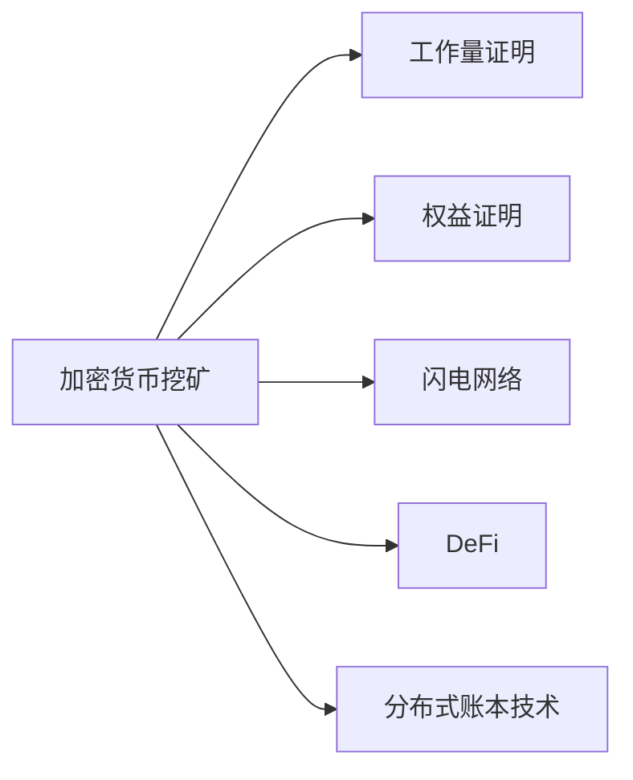

                 

## 1. 背景介绍

随着区块链和加密货币的兴起，挖矿已成为一种新兴的经济活动。挖矿不仅关系到区块链的稳定与安全，也成为一种重要的创富手段。本文将探讨利用技术优势进行加密货币挖矿的原理、方法和实践，帮助读者全面了解这一领域的最新进展。

## 2. 核心概念与联系

### 2.1 核心概念概述

为了更好地理解加密货币挖矿的技术优势，本节将介绍几个关键概念：

- **加密货币挖矿 (Cryptocurrency Mining)**：通过计算能力解决区块链网络中的复杂数学问题，以验证和记录交易并生成新币的行为。

- **工作量证明 (Proof of Work, PoW)**：一种通用的共识机制，挖矿者需要提交一个具有一定计算复杂度的证明才能被网络接受。

- **权益证明 (Proof of Stake, PoS)**：一种基于持币者财富量或持有时间决定其挖矿概率的共识机制。

- **闪电网络 (Lightning Network)**：一种在比特币区块链上构建的二层支付网络，旨在大幅提升交易速度和降低费用。

- **DeFi (Decentralized Finance)**：利用区块链技术构建的去中心化金融服务，包括借贷、交易、保险等。

- **分布式账本技术 (Distributed Ledger Technology, DLT)**：一种多中心化的账本技术，能够在多个参与者之间安全共享账本信息。

这些核心概念共同构成了加密货币挖矿的基础框架，使得我们可以全面理解其工作原理和应用前景。

### 2.2 核心概念原理和架构的 Mermaid 流程图



## 3. 核心算法原理 & 具体操作步骤

### 3.1 算法原理概述

加密货币挖矿的核心在于利用计算资源解决区块链网络中的数学难题，以获得新币的奖励。例如，比特币挖矿中，挖矿者需要通过求解一个非线性哈希函数，以找到满足一定条件的哈希值。这个哈希值必须是网络中当前最短的哈希值，即所谓的"工作量证明"。

### 3.2 算法步骤详解

挖矿的具体步骤如下：

1. **挖矿设备准备**：安装并配置硬件设备，如GPU、CPU、ASIC等，以提供足够的计算能力。
2. **获取区块链节点**：下载并安装区块链软件，如Bitcoin Core、Stratum等，获取一个节点，以便连接其他矿工和区块链网络。
3. **配置挖矿池**：加入一个挖矿池，共享网络中的工作量，避免计算资源浪费。
4. **运行挖矿软件**：设置挖矿参数，启动挖矿软件，开始计算并提交哈希值。
5. **获取挖矿奖励**：每成功找到一个符合条件的哈希值，矿工即获得了相应的比特币奖励。

### 3.3 算法优缺点

**优点**：

- **稳定收益**：挖矿能够提供相对稳定的比特币收益，尤其是在币价稳定时。
- **去中心化**：挖矿促进了区块链的去中心化特性，提升了网络安全性。
- **技术门槛低**：对于初学者，通过挖矿池的参与，入门门槛较低。

**缺点**：

- **能耗高**：挖矿需要大量电力，尤其是在计算密集型芯片如ASIC和GPU的帮助下。
- **收益波动**：币价波动会影响挖矿收益，可能带来较大风险。
- **硬件成本高**：初期投资较大，需要配置专业的硬件设备。

### 3.4 算法应用领域

加密货币挖矿技术的应用领域广泛，包括但不限于：

- **加密货币网络**：包括比特币、以太坊、莱特币等多种加密货币的挖矿。
- **智能合约**：支持智能合约的区块链平台，如以太坊，也可以进行挖矿。
- **去中心化金融**：DeFi应用中的挖矿项目，如 Compound、Yearn.finance等，提供流动性奖励。
- **新兴区块链平台**：如Chainlink、Polkadot等新兴区块链，也有挖矿机会。

## 4. 数学模型和公式 & 详细讲解 & 举例说明

### 4.1 数学模型构建

比特币挖矿的核心是求解一个非线性哈希函数，即SHA-256。其目标是找到一个满足一定条件的哈希值，这个哈希值必须是网络中当前最短的哈希值。

### 4.2 公式推导过程

设哈希函数为 $H(x)$，其输出为 $b$ 位二进制数。挖矿的目标是找到一个值 $m$，使得 $H(m)$ 满足以下条件：

- $H(m)$ 以 $b$ 为前缀的哈希值最短。
- $H(m)$ 以 $b$ 为前缀的哈希值最多。

假设挖矿难度为 $D$，则 $H(m)$ 满足：

$$
H(m) \leq D
$$

挖矿者需要通过不断的尝试来找到满足条件的哈希值 $m$。根据工作量证明的原理，满足条件的 $m$ 的数量随时间呈指数级增长，但实际挖矿的时间成本 $T$ 与 $m$ 的数量成正比。

### 4.3 案例分析与讲解

以比特币挖矿为例，假设当前挖矿难度为 $D$，一个矿工每秒可以计算 $10^{11}$ 次哈希值。那么，矿工找到一个满足条件的哈希值 $m$ 的期望时间 $T$ 为：

$$
T = \frac{D}{10^{11}}
$$

这意味着，如果挖矿难度翻倍，矿工的期望时间也会翻倍。

## 5. 项目实践：代码实例和详细解释说明

### 5.1 开发环境搭建

- **Python环境**：安装Python 3.7及以上版本。
- **挖矿库**：使用Bitcoin Core的API或第三方库，如PyBitmex、ccxt等。
- **硬件设备**：配置GPU或ASIC等计算设备，并连接到挖矿池。

### 5.2 源代码详细实现

以下是使用Python和ccxt库进行比特币挖矿的示例代码：

```python
from ccxt import bittrex
import time

# 创建Bittrex API对象
bittrex = bittrex({
    'apiKey': 'your_api_key',
    'secret': 'your_secret_key'
})

# 连接挖矿池
pool = bittrex.markets['bittrex_usdt_btc']
amount = 1  # 挖矿币数

# 发起挖矿请求
response = pool.buy(amount)

# 输出挖矿结果
print('挖矿结果：', response)
```

### 5.3 代码解读与分析

代码中使用了ccxt库，该库提供了对多个交易平台（如BitMEX、Bittrex等）的支持。代码的核心逻辑是向挖矿池发起购买请求，指定购买币数，获取挖矿结果。挖矿池会根据当前的挖矿难度和矿工的设备计算能力，自动调整挖矿任务并返回结果。

### 5.4 运行结果展示

成功发起挖矿请求后，代码将输出类似如下结果：

```
挖矿结果： {'result': True, 'success': True, 'status': 'buy order successful'}
```

这表示挖矿请求成功，币数已经转移到指定地址。

## 6. 实际应用场景

### 6.1 加密货币网络

比特币挖矿是最常见的应用场景，通过提供计算能力，挖矿者可以从网络中获取比特币作为奖励。挖矿收益与币价和挖矿难度密切相关，矿工需要不断优化硬件配置和挖矿策略以获得更高收益。

### 6.2 智能合约

支持智能合约的区块链平台，如以太坊，也支持挖矿。通过参与智能合约的执行和验证，矿工可以获得 gas fee 奖励。这种挖矿方式更加注重验证算力和合约执行效率。

### 6.3 DeFi

DeFi应用中的挖矿项目，如 Compound、Yearn.finance等，通过提供流动性支持获得奖励。矿工需要根据项目需求提供相应的抵押资产，通过参与流动性提供和移除操作，获得相应的激励。

### 6.4 未来应用展望

随着技术的不断发展，加密货币挖矿的应用场景将更加多样化。未来的挖矿技术可能包括：

- **量子安全**：采用量子加密技术，提高区块链安全性。
- **多链融合**：跨链挖矿，通过在多个区块链间分配计算资源，提高挖矿效率。
- **环保挖矿**：采用可再生能源，减少挖矿能耗。

## 7. 工具和资源推荐

### 7.1 学习资源推荐

- **《比特币挖矿入门指南》**：详细介绍了比特币挖矿的入门知识和实际操作方法。
- **《加密货币挖矿实战》**：涵盖多种加密货币的挖矿技巧和策略，适合实战操作。
- **《区块链与加密货币》**：介绍区块链技术和加密货币的基本原理，适合入门学习。

### 7.2 开发工具推荐

- **Bitcoin Core**：比特币官方客户端，支持挖矿和节点操作。
- **ccxt**：Python加密货币交易库，支持多种交易所和交易对。
- **Hardware Wallet**：硬件钱包，提供安全的存储和挖矿服务。

### 7.3 相关论文推荐

- **"Proof of Work: A Study on the PoW Consensus Algorithm"**：深入研究PoW算法的原理和实现。
- **"Power Consumption of Bitcoin Mining: A Study of Energy Efficiency"**：研究比特币挖矿的能耗问题及优化方案。
- **"Blockchain and Decentralized Finance: A Review"**：综述DeFi技术和应用。

## 8. 总结：未来发展趋势与挑战

### 8.1 研究成果总结

本文全面介绍了加密货币挖矿的原理、方法、工具和应用场景。通过系统学习，读者可以掌握挖矿技术的核心要义，为未来的挖矿实践打下坚实基础。

### 8.2 未来发展趋势

未来的加密货币挖矿将呈现以下趋势：

- **技术进步**：量子安全、跨链挖矿等新技术的应用，将大幅提升挖矿效率和安全性。
- **市场需求**：随着加密货币市场规模的扩大，挖矿需求将持续增长。
- **环保发展**：采用可再生能源的环保挖矿技术，将成为行业趋势。

### 8.3 面临的挑战

尽管加密货币挖矿技术已经取得了显著进展，但仍面临以下挑战：

- **能源消耗**：挖矿能耗问题仍需进一步解决。
- **安全问题**：挖矿过程中可能面临网络攻击和共识故障的风险。
- **政策法规**：各国的政策法规变化对挖矿活动有重要影响。

### 8.4 研究展望

未来的研究应在以下方面取得突破：

- **能效优化**：探索高效能的挖矿硬件和算法，降低能耗。
- **安全增强**：加强挖矿网络的安全性，防范各类攻击。
- **法规合规**：研究如何与各国法律法规保持一致，确保合规运营。

## 9. 附录：常见问题与解答

**Q1: 挖矿收益如何计算？**

A: 挖矿收益主要取决于挖矿难度和币价。具体计算公式如下：

$$
收益 = \frac{币价}{挖矿难度 \times 矿工计算速度}
$$

**Q2: 挖矿池如何选择？**

A: 选择挖矿池时，应考虑其稳定性、支付速度和手续费等因素。可通过用户评价和收益记录进行选择。

**Q3: 如何优化挖矿策略？**

A: 优化挖矿策略需要关注硬件配置、挖矿算法和挖矿难度变化。例如，根据挖矿难度调整挖矿速率，选择高效的挖矿算法等。

**Q4: 挖矿风险有哪些？**

A: 挖矿风险主要包括币价波动、硬件故障、网络攻击等。建议购买硬件保险，并及时备份重要数据。

**Q5: 如何保护挖矿收益？**

A: 保护挖矿收益的关键在于保护矿机和私钥安全。建议使用硬件钱包存储私钥，并定期备份。

---

作者：禅与计算机程序设计艺术 / Zen and the Art of Computer Programming

