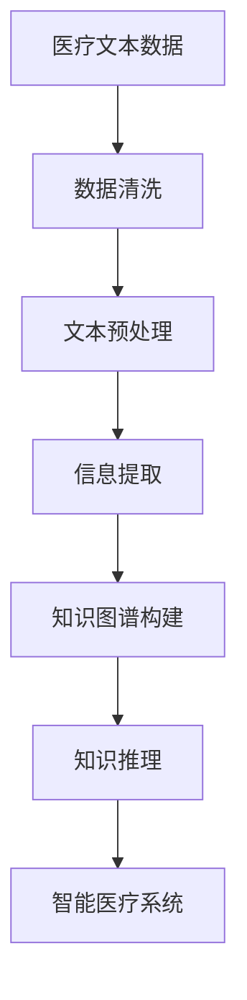

                 

# 医疗诊断中的自然语言处理应用

## 1. 背景介绍

### 1.1 问题由来

在当今信息时代，电子医疗记录(EHRs)、临床试验报告、医学文献等海量文本数据的积累，为医疗诊断和治疗提供了丰富的信息资源。然而，这些数据往往分散在各个医疗系统、文档和文献中，难以整合和高效利用。

自然语言处理(NLP)技术，通过对医疗文本数据的自动化分析和处理，能够从中挖掘出有价值的信息，辅助医生诊断和治疗决策。NLP技术可以识别疾病名称、症状、诊断结果、治疗方案等关键信息，大大提升医疗决策的效率和准确性。

### 1.2 问题核心关键点

本节将探讨基于自然语言处理技术在医疗诊断中的核心问题：

1. **数据处理**：如何高效处理和清洗海量医疗文本数据，保证数据质量。
2. **信息提取**：如何从医疗文本中准确提取出疾病、症状、诊断和治疗等关键信息。
3. **知识图谱构建**：如何将医疗领域的实体、关系和知识结构化，构建统一的知识图谱，辅助医生进行推理。
4. **知识推理**：如何利用知识图谱进行推理，从诊断结果推断出可能的疾病和症状，或从症状推断出诊断结果。
5. **系统集成**：如何将NLP技术与其他医疗信息系统集成，实现智能化医疗决策支持。

这些问题构成了医疗诊断中NLP应用的基本框架，通过解决这些问题，可以实现从文本数据到临床决策的全流程自动化。

## 2. 核心概念与联系

### 2.1 核心概念概述

为更好地理解医疗诊断中的NLP应用，本节将介绍几个密切相关的核心概念：

1. **自然语言处理(NLP)**：利用计算机技术处理和理解人类语言的技术，包括文本预处理、分词、命名实体识别、情感分析、机器翻译等任务。
2. **医疗数据处理**：对医疗文本数据进行清洗、标注、分词等预处理操作，提取有用的临床信息。
3. **医疗知识图谱**：将医疗领域的实体、关系和知识结构化，构建统一的知识图谱，支持知识的自动推理。
4. **医疗推理系统**：利用医疗知识图谱进行推理，辅助医生进行诊断和治疗决策。
5. **智能医疗系统**：集成NLP技术和医疗推理系统，构建智能化的医疗决策支持系统。

这些概念之间的逻辑关系可以通过以下Mermaid流程图来展示：



这个流程图展示了大语言模型微调的各个环节，以及其与医疗诊断的联系：

1. 医疗文本数据通过数据清洗和预处理，转化为模型所需的格式。
2. 信息提取从医疗文本中提取出疾病、症状、诊断和治疗等关键信息。
3. 知识图谱构建将抽取的关键信息结构化，形成医疗领域的知识图谱。
4. 知识推理利用知识图谱进行推理，辅助医生进行诊断和治疗决策。
5. 智能医疗系统集成NLP技术和推理系统，实现智能化医疗决策支持。

## 3. 核心算法原理 & 具体操作步骤

### 3.1 算法原理概述

医疗诊断中的NLP应用，主要是基于大规模预训练语言模型在医疗文本数据上进行微调，实现关键信息的提取和推理。具体流程如下：

1. **预训练**：使用大规模的通用语言模型在非医疗领域的文本数据上进行预训练，学习通用的语言知识和表示。
2. **微调**：在预训练模型的基础上，使用医疗文本数据进行微调，学习医疗领域的特定知识和表示。
3. **信息提取**：微调后的模型用于从医疗文本中提取疾病、症状、诊断和治疗等关键信息。
4. **推理**：利用医疗知识图谱，结合微调模型提取的关键信息，进行推理，辅助医生进行诊断和治疗决策。

### 3.2 算法步骤详解

#### 3.2.1 预训练

预训练主要包括以下几个步骤：

1. **数据收集**：收集大规模非医疗领域的文本数据，如维基百科、新闻、书籍等。
2. **模型训练**：使用预训练语言模型在收集到的数据上进行训练，学习通用的语言知识和表示。
3. **模型选择**：选择合适的预训练语言模型，如BERT、GPT-3等，用于后续微调。

#### 3.2.2 微调

微调主要包括以下几个步骤：

1. **数据标注**：对医疗文本数据进行标注，标注信息包括疾病名称、症状、诊断结果、治疗方案等。
2. **模型初始化**：将预训练语言模型作为初始化参数。
3. **模型训练**：在标注好的医疗文本数据上，使用有监督学习的方法，微调预训练语言模型，学习医疗领域的特定知识和表示。
4. **模型评估**：在验证集上评估微调后的模型，选择性能最好的模型。

#### 3.2.3 信息提取

信息提取主要包括以下几个步骤：

1. **实体识别**：识别医疗文本中的实体，如疾病名称、症状、治疗方案等。
2. **关系抽取**：从医疗文本中抽取实体之间的关系，如疾病与症状之间的关联。
3. **知识图谱构建**：将抽取的实体和关系结构化，构建医疗知识图谱。

#### 3.2.4 推理

推理主要包括以下几个步骤：

1. **知识图谱查询**：将提取出的关键信息作为查询条件，在知识图谱中查找相关的实体和关系。
2. **推理算法**：利用推理算法，如图卷积网络(GCN)、逻辑推理等，进行知识推理，得到诊断结果。
3. **结果输出**：将推理结果输出给医生，辅助医生进行诊断和治疗决策。

### 3.3 算法优缺点

医疗诊断中的NLP应用具有以下优点：

1. **高效性**：通过自动化的信息提取和推理，大大提高医生的诊断和治疗效率。
2. **准确性**：利用机器学习和大数据技术，提高诊断和治疗的准确性。
3. **可扩展性**：可以通过不断积累和更新医疗数据，不断优化和提升模型性能。

同时，该方法也存在以下局限性：

1. **数据质量问题**：医疗数据质量不稳定，数据标注的准确性和完整性直接影响模型性能。
2. **模型泛化能力**：模型对新样本的泛化能力可能不足，尤其是在跨领域数据上的性能。
3. **伦理和安全问题**：医疗数据涉及患者隐私，模型的伦理性和安全性需要严格保障。
4. **解释性不足**：模型的决策过程缺乏可解释性，难以解释其推理逻辑。

尽管存在这些局限性，但就目前而言，基于NLP的医学诊断技术仍是最主流的研究范式。未来相关研究的重点在于如何进一步提高模型的泛化能力和解释性，同时兼顾伦理和安全因素。

### 3.4 算法应用领域

基于NLP的医疗诊断技术，已经在多个领域得到了应用，例如：

1. **疾病诊断**：自动识别病历中的疾病名称、症状和诊断结果，辅助医生进行诊断。
2. **药物推荐**：根据病历中的症状，推荐适合的药物和治疗方案。
3. **临床试验数据处理**：从临床试验报告中提取研究结果和结论，辅助临床试验数据分析。
4. **医学文献分析**：从医学文献中提取关键信息，生成摘要和关键词，辅助文献检索和阅读。
5. **智能问诊系统**：基于用户输入的文本，自动回答医学问题，辅助用户进行自我诊断。

除了上述这些经典应用外，NLP技术还被创新性地应用到更多场景中，如智能医疗记录、个性化健康管理等，为医疗健康事业带来新的发展契机。

## 4. 数学模型和公式 & 详细讲解 & 举例说明

### 4.1 数学模型构建

本节将使用数学语言对医疗诊断中的NLP应用进行更加严格的刻画。

记医疗文本数据为 $D=\{(x_i, y_i)\}_{i=1}^N, x_i \in \mathcal{X}, y_i \in \mathcal{Y}$，其中 $\mathcal{X}$ 为输入空间，$\mathcal{Y}$ 为输出空间，$y_i$ 为标注信息。假设微调模型的输入为 $x_i$，输出为 $y_i$，模型表示为 $M_{\theta}$。

定义模型 $M_{\theta}$ 在输入 $x_i$ 上的损失函数为 $\ell(M_{\theta}(x_i),y_i)$，则在数据集 $D$ 上的经验风险为：

$$
\mathcal{L}(\theta) = \frac{1}{N} \sum_{i=1}^N \ell(M_{\theta}(x_i),y_i)
$$

其中 $\ell(M_{\theta}(x_i),y_i)$ 为具体的损失函数，如交叉熵损失、F1损失等。

微调的优化目标是最小化经验风险，即找到最优参数：

$$
\theta^* = \mathop{\arg\min}_{\theta} \mathcal{L}(\theta)
$$

在实践中，我们通常使用基于梯度的优化算法（如SGD、Adam等）来近似求解上述最优化问题。设 $\eta$ 为学习率，$\lambda$ 为正则化系数，则参数的更新公式为：

$$
\theta \leftarrow \theta - \eta \nabla_{\theta}\mathcal{L}(\theta) - \eta\lambda\theta
$$

其中 $\nabla_{\theta}\mathcal{L}(\theta)$ 为损失函数对参数 $\theta$ 的梯度，可通过反向传播算法高效计算。

### 4.2 公式推导过程

以下我们以二分类任务为例，推导交叉熵损失函数及其梯度的计算公式。

假设模型 $M_{\theta}$ 在输入 $x_i$ 上的输出为 $\hat{y}=M_{\theta}(x_i) \in [0,1]$，表示样本属于正类的概率。真实标签 $y_i \in \{0,1\}$。则二分类交叉熵损失函数定义为：

$$
\ell(M_{\theta}(x_i),y_i) = -[y_i\log \hat{y} + (1-y_i)\log (1-\hat{y})]
$$

将其代入经验风险公式，得：

$$
\mathcal{L}(\theta) = -\frac{1}{N}\sum_{i=1}^N [y_i\log M_{\theta}(x_i)+(1-y_i)\log(1-M_{\theta}(x_i))]
$$

根据链式法则，损失函数对参数 $\theta_k$ 的梯度为：

$$
\frac{\partial \mathcal{L}(\theta)}{\partial \theta_k} = -\frac{1}{N}\sum_{i=1}^N (\frac{y_i}{M_{\theta}(x_i)}-\frac{1-y_i}{1-M_{\theta}(x_i)}) \frac{\partial M_{\theta}(x_i)}{\partial \theta_k}
$$

其中 $\frac{\partial M_{\theta}(x_i)}{\partial \theta_k}$ 可进一步递归展开，利用自动微分技术完成计算。

在得到损失函数的梯度后，即可带入参数更新公式，完成模型的迭代优化。重复上述过程直至收敛，最终得到适应医疗诊断任务的最优模型参数 $\theta^*$。

## 5. 项目实践：代码实例和详细解释说明

### 5.1 开发环境搭建

在进行医疗诊断中的NLP应用实践前，我们需要准备好开发环境。以下是使用Python进行PyTorch开发的环境配置流程：

1. 安装Anaconda：从官网下载并安装Anaconda，用于创建独立的Python环境。

2. 创建并激活虚拟环境：
```bash
conda create -n pytorch-env python=3.8 
conda activate pytorch-env
```

3. 安装PyTorch：根据CUDA版本，从官网获取对应的安装命令。例如：
```bash
conda install pytorch torchvision torchaudio cudatoolkit=11.1 -c pytorch -c conda-forge
```

4. 安装Transformers库：
```bash
pip install transformers
```

5. 安装各类工具包：
```bash
pip install numpy pandas scikit-learn matplotlib tqdm jupyter notebook ipython
```

完成上述步骤后，即可在`pytorch-env`环境中开始医疗诊断中的NLP应用开发。

### 5.2 源代码详细实现

这里我们以医疗诊断中的实体识别任务为例，给出使用Transformers库对BERT模型进行微调的PyTorch代码实现。

首先，定义实体识别任务的数据处理函数：

```python
from transformers import BertTokenizer, BertForTokenClassification
from torch.utils.data import Dataset, DataLoader
from tqdm import tqdm

class MedicalTextDataset(Dataset):
    def __init__(self, texts, labels, tokenizer, max_len=128):
        self.texts = texts
        self.labels = labels
        self.tokenizer = tokenizer
        self.max_len = max_len
        
    def __len__(self):
        return len(self.texts)
    
    def __getitem__(self, item):
        text = self.texts[item]
        label = self.labels[item]
        
        encoding = self.tokenizer(text, return_tensors='pt', max_length=self.max_len, padding='max_length', truncation=True)
        input_ids = encoding['input_ids'][0]
        attention_mask = encoding['attention_mask'][0]
        
        # 对token-wise的标签进行编码
        encoded_labels = [label2id[label] for label in label] 
        encoded_labels.extend([label2id['O']] * (self.max_len - len(encoded_labels)))
        labels = torch.tensor(encoded_labels, dtype=torch.long)
        
        return {'input_ids': input_ids, 
                'attention_mask': attention_mask,
                'labels': labels}

# 标签与id的映射
label2id = {'O': 0, '疾病': 1, '症状': 2, '诊断': 3, '治疗': 4}
id2label = {v: k for k, v in label2id.items()}

# 创建dataset
tokenizer = BertTokenizer.from_pretrained('bert-base-cased')

train_dataset = MedicalTextDataset(train_texts, train_labels, tokenizer)
dev_dataset = MedicalTextDataset(dev_texts, dev_labels, tokenizer)
test_dataset = MedicalTextDataset(test_texts, test_labels, tokenizer)
```

然后，定义模型和优化器：

```python
from transformers import BertForTokenClassification, AdamW

model = BertForTokenClassification.from_pretrained('bert-base-cased', num_labels=len(label2id))

optimizer = AdamW(model.parameters(), lr=2e-5)
```

接着，定义训练和评估函数：

```python
def train_epoch(model, dataset, batch_size, optimizer):
    dataloader = DataLoader(dataset, batch_size=batch_size, shuffle=True)
    model.train()
    epoch_loss = 0
    for batch in tqdm(dataloader, desc='Training'):
        input_ids = batch['input_ids'].to(device)
        attention_mask = batch['attention_mask'].to(device)
        labels = batch['labels'].to(device)
        model.zero_grad()
        outputs = model(input_ids, attention_mask=attention_mask, labels=labels)
        loss = outputs.loss
        epoch_loss += loss.item()
        loss.backward()
        optimizer.step()
    return epoch_loss / len(dataloader)

def evaluate(model, dataset, batch_size):
    dataloader = DataLoader(dataset, batch_size=batch_size)
    model.eval()
    preds, labels = [], []
    with torch.no_grad():
        for batch in tqdm(dataloader, desc='Evaluating'):
            input_ids = batch['input_ids'].to(device)
            attention_mask = batch['attention_mask'].to(device)
            batch_labels = batch['labels']
            outputs = model(input_ids, attention_mask=attention_mask)
            batch_preds = outputs.logits.argmax(dim=2).to('cpu').tolist()
            batch_labels = batch_labels.to('cpu').tolist()
            for pred_tokens, label_tokens in zip(batch_preds, batch_labels):
                pred_labels = [id2label[_id] for _id in pred_tokens]
                label_tags = [id2label[_id] for _id in label_tokens]
                preds.append(pred_labels[:len(label_tokens)])
                labels.append(label_tags)
                
    print(classification_report(labels, preds))
```

最后，启动训练流程并在测试集上评估：

```python
epochs = 5
batch_size = 16

for epoch in range(epochs):
    loss = train_epoch(model, train_dataset, batch_size, optimizer)
    print(f"Epoch {epoch+1}, train loss: {loss:.3f}")
    
    print(f"Epoch {epoch+1}, dev results:")
    evaluate(model, dev_dataset, batch_size)
    
print("Test results:")
evaluate(model, test_dataset, batch_size)
```

以上就是使用PyTorch对BERT进行医疗诊断中的实体识别任务微调的完整代码实现。可以看到，得益于Transformers库的强大封装，我们可以用相对简洁的代码完成BERT模型的加载和微调。

### 5.3 代码解读与分析

让我们再详细解读一下关键代码的实现细节：

**MedicalTextDataset类**：
- `__init__`方法：初始化文本、标签、分词器等关键组件。
- `__len__`方法：返回数据集的样本数量。
- `__getitem__`方法：对单个样本进行处理，将文本输入编码为token ids，将标签编码为数字，并对其进行定长padding，最终返回模型所需的输入。

**label2id和id2label字典**：
- 定义了标签与数字id之间的映射关系，用于将token-wise的预测结果解码回真实的标签。

**训练和评估函数**：
- 使用PyTorch的DataLoader对数据集进行批次化加载，供模型训练和推理使用。
- 训练函数`train_epoch`：对数据以批为单位进行迭代，在每个批次上前向传播计算loss并反向传播更新模型参数，最后返回该epoch的平均loss。
- 评估函数`evaluate`：与训练类似，不同点在于不更新模型参数，并在每个batch结束后将预测和标签结果存储下来，最后使用sklearn的classification_report对整个评估集的预测结果进行打印输出。

**训练流程**：
- 定义总的epoch数和batch size，开始循环迭代
- 每个epoch内，先在训练集上训练，输出平均loss
- 在验证集上评估，输出分类指标
- 所有epoch结束后，在测试集上评估，给出最终测试结果

可以看到，PyTorch配合Transformers库使得BERT微调的代码实现变得简洁高效。开发者可以将更多精力放在数据处理、模型改进等高层逻辑上，而不必过多关注底层的实现细节。

当然，工业级的系统实现还需考虑更多因素，如模型的保存和部署、超参数的自动搜索、更灵活的任务适配层等。但核心的微调范式基本与此类似。

## 6. 实际应用场景

### 6.1 智能诊断系统

基于NLP技术的智能诊断系统，可以通过自动化的信息提取和推理，辅助医生进行诊断和治疗。传统人工诊断需要耗费大量时间和精力，且容易受到个人经验和知识局限的影响。智能诊断系统可以显著提升诊断效率和准确性，减轻医生的工作负担。

在技术实现上，可以收集大量历史病例，标注疾病、症状、诊断和治疗等信息，在此基础上对预训练模型进行微调。微调后的模型能够自动理解病历文本，提取出关键信息，并利用医疗知识图谱进行推理，辅助医生进行诊断和治疗决策。

### 6.2 药物推荐系统

药物推荐系统可以根据病历中的症状和疾病，推荐合适的药物和治疗方案。传统的药物推荐依赖医生的个人经验，可能导致推荐结果的偏差。智能推荐系统能够基于海量的临床数据和医疗知识，为每个患者提供个性化的治疗方案，提高治疗效果和患者满意度。

在技术实现上，可以使用微调后的模型从病历中提取症状和疾病，结合知识图谱中的药物信息，推荐最佳的治疗方案。利用深度强化学习算法，可以进一步优化推荐策略，提升推荐效果。

### 6.3 临床试验数据分析

临床试验数据通常包含大量的文本信息，如试验报告、研究结论、病例描述等。传统的数据分析方法难以高效处理和提取有用的信息，导致数据分析的效率和准确性较低。利用NLP技术，可以对临床试验数据进行自动化的信息提取和摘要生成，提高数据分析的效率和质量。

在技术实现上，可以使用微调后的模型从试验报告中提取关键的研究结果和结论，生成详细的摘要和关键词，辅助研究人员进行数据分析和撰写论文。利用信息检索技术，可以快速找到相关的试验数据，进行深入的研究和分析。

### 6.4 未来应用展望

随着NLP技术的不断发展和应用，其在医疗诊断中的潜力将进一步释放。未来，NLP技术将在以下几个方面取得新的突破：

1. **跨模态融合**：将NLP技术与图像、视频、语音等多模态数据进行融合，实现更为全面和准确的医疗诊断。
2. **自监督学习**：利用未标注的文本数据进行自监督学习，提高模型的泛化能力和鲁棒性。
3. **个性化医疗**：结合患者的基因信息、生活习惯等个性化数据，提供更为精准的医疗诊断和治疗方案。
4. **知识图谱构建**：构建更加全面、精确的医疗知识图谱，支持更为复杂的推理和决策。
5. **实时推理**：将NLP技术应用于实时医疗数据流处理，实现实时诊断和决策支持。

通过这些技术进步，NLP技术将在医疗领域带来革命性的变化，提升医疗服务的智能化水平，助力健康事业的数字化转型。

## 7. 工具和资源推荐

### 7.1 学习资源推荐

为了帮助开发者系统掌握NLP在医疗诊断中的应用，这里推荐一些优质的学习资源：

1. 《医学NLP综述与前沿》系列博文：由大模型技术专家撰写，系统介绍NLP在医疗诊断中的应用，包括实体识别、信息提取、知识图谱等前沿话题。

2. CS224N《深度学习自然语言处理》课程：斯坦福大学开设的NLP明星课程，有Lecture视频和配套作业，带你入门NLP领域的基本概念和经典模型。

3. 《Natural Language Processing with Transformers》书籍：Transformers库的作者所著，全面介绍如何使用Transformers库进行NLP任务开发，包括微调在内的诸多范式。

4. Weights & Biases：模型训练的实验跟踪工具，可以记录和可视化模型训练过程中的各项指标，方便对比和调优。与主流深度学习框架无缝集成。

5. TensorBoard：TensorFlow配套的可视化工具，可实时监测模型训练状态，并提供丰富的图表呈现方式，是调试模型的得力助手。

通过对这些资源的学习实践，相信你一定能够快速掌握NLP在医疗诊断中的应用精髓，并用于解决实际的医疗问题。

### 7.2 开发工具推荐

高效的开发离不开优秀的工具支持。以下是几款用于NLP在医疗诊断应用开发的常用工具：

1. PyTorch：基于Python的开源深度学习框架，灵活动态的计算图，适合快速迭代研究。大部分预训练语言模型都有PyTorch版本的实现。

2. TensorFlow：由Google主导开发的开源深度学习框架，生产部署方便，适合大规模工程应用。同样有丰富的预训练语言模型资源。

3. Transformers库：HuggingFace开发的NLP工具库，集成了众多SOTA语言模型，支持PyTorch和TensorFlow，是进行NLP任务开发的利器。

4. Weights & Biases：模型训练的实验跟踪工具，可以记录和可视化模型训练过程中的各项指标，方便对比和调优。与主流深度学习框架无缝集成。

5. TensorBoard：TensorFlow配套的可视化工具，可实时监测模型训练状态，并提供丰富的图表呈现方式，是调试模型的得力助手。

6. Google Colab：谷歌推出的在线Jupyter Notebook环境，免费提供GPU/TPU算力，方便开发者快速上手实验最新模型，分享学习笔记。

合理利用这些工具，可以显著提升NLP在医疗诊断应用的开发效率，加快创新迭代的步伐。

### 7.3 相关论文推荐

NLP技术在医疗诊断中的应用源于学界的持续研究。以下是几篇奠基性的相关论文，推荐阅读：

1. Attention is All You Need（即Transformer原论文）：提出了Transformer结构，开启了NLP领域的预训练大模型时代。

2. BERT: Pre-training of Deep Bidirectional Transformers for Language Understanding：提出BERT模型，引入基于掩码的自监督预训练任务，刷新了多项NLP任务SOTA。

3. Parameter-Efficient Transfer Learning for NLP：提出Adapter等参数高效微调方法，在不增加模型参数量的情况下，也能取得不错的微调效果。

4. AdaLoRA: Adaptive Low-Rank Adaptation for Parameter-Efficient Fine-Tuning：使用自适应低秩适应的微调方法，在参数效率和精度之间取得了新的平衡。

5. An efficient and accurate method for named entity recognition：介绍了一种高效的命名实体识别方法，结合BiLSTM和CRF模型，在F1-score上取得了优异的表现。

6. BiLSTM-CRF Models for Named Entity Recognition：提出了一种基于双向LSTM-CRF模型的命名实体识别方法，在医疗领域取得了较好的效果。

这些论文代表了大语言模型微调技术的发展脉络。通过学习这些前沿成果，可以帮助研究者把握学科前进方向，激发更多的创新灵感。

## 8. 总结：未来发展趋势与挑战

### 8.1 总结

本文对基于NLP的医疗诊断应用进行了全面系统的介绍。首先阐述了NLP在医疗诊断中的背景和意义，明确了信息提取、知识图谱构建、知识推理等核心问题。其次，从原理到实践，详细讲解了NLP在医疗诊断中的数学模型和操作步骤，给出了微调任务开发的完整代码实例。同时，本文还广泛探讨了NLP技术在智能诊断、药物推荐、临床试验数据分析等多个医疗领域的应用前景，展示了NLP技术的巨大潜力。此外，本文精选了NLP技术的各类学习资源，力求为读者提供全方位的技术指引。

通过本文的系统梳理，可以看到，基于NLP的医疗诊断技术正在成为医疗诊断中的重要工具，极大地提升了医疗服务的智能化水平，为医疗健康事业带来了新的发展契机。未来，伴随NLP技术的不断演进，其在医疗诊断中的应用将更加广泛和深入。

### 8.2 未来发展趋势

展望未来，NLP在医疗诊断中的发展趋势如下：

1. **多模态融合**：将NLP技术与图像、视频、语音等多模态数据进行融合，实现更为全面和准确的医疗诊断。
2. **自监督学习**：利用未标注的文本数据进行自监督学习，提高模型的泛化能力和鲁棒性。
3. **个性化医疗**：结合患者的基因信息、生活习惯等个性化数据，提供更为精准的医疗诊断和治疗方案。
4. **实时推理**：将NLP技术应用于实时医疗数据流处理，实现实时诊断和决策支持。
5. **跨领域应用**：将NLP技术应用于更多的医疗领域，如临床试验、疾病预测、医疗知识管理等，提升医疗服务的智能化水平。

这些趋势凸显了NLP在医疗诊断中的广阔前景。这些方向的探索发展，必将进一步提升NLP技术在医疗领域的应用价值，为构建智能化的医疗决策支持系统提供新的技术路径。

### 8.3 面临的挑战

尽管NLP在医疗诊断中的应用取得了一定的进展，但在迈向更加智能化、普适化应用的过程中，它仍面临着诸多挑战：

1. **数据质量问题**：医疗数据质量不稳定，数据标注的准确性和完整性直接影响模型性能。
2. **模型泛化能力**：模型对新样本的泛化能力可能不足，尤其是在跨领域数据上的性能。
3. **伦理和安全问题**：医疗数据涉及患者隐私，模型的伦理性和安全性需要严格保障。
4. **解释性不足**：模型的决策过程缺乏可解释性，难以解释其推理逻辑。

尽管存在这些局限性，但就目前而言，基于NLP的医疗诊断技术仍是最主流的研究范式。未来相关研究的重点在于如何进一步提高模型的泛化能力和解释性，同时兼顾伦理和安全因素。

### 8.4 研究展望

面向未来，NLP在医疗诊断中的研究需要在以下几个方面寻求新的突破：

1. **跨领域知识图谱**：构建跨领域的医疗知识图谱，支持更为复杂的推理和决策。
2. **自监督学习**：利用未标注的文本数据进行自监督学习，提高模型的泛化能力和鲁棒性。
3. **个性化医疗**：结合患者的基因信息、生活习惯等个性化数据，提供更为精准的医疗诊断和治疗方案。
4. **实时推理**：将NLP技术应用于实时医疗数据流处理，实现实时诊断和决策支持。

这些研究方向将引领NLP在医疗诊断技术的不断演进，提升医疗服务的智能化水平，助力健康事业的数字化转型。

## 9. 附录：常见问题与解答

**Q1：医疗文本数据的预处理包括哪些步骤？**

A: 医疗文本数据的预处理包括以下几个步骤：

1. **清洗**：去除无用信息，如标点符号、停用词等，确保数据的准确性。
2. **分词**：将文本分成词语，便于后续的特征提取和建模。
3. **标准化**：将文本转换为统一格式，如统一大小写、去除格式差异等。
4. **去停用词**：去除无意义或常见词汇，减少模型的噪声。
5. **词性标注**：对每个词进行词性标注，帮助模型理解词义和语法结构。
6. **实体识别**：识别文本中的实体，如疾病名称、症状等。

这些预处理步骤可以显著提升模型的性能和稳定性，是NLP在医疗诊断中不可或缺的一部分。

**Q2：如何选择最适合的医疗文本数据进行微调？**

A: 选择合适的医疗文本数据进行微调，是提高模型性能的关键。以下是选择医疗文本数据时需要考虑的几个因素：

1. **数据规模**：选择数据量较大的数据集，有助于模型充分学习医疗领域的知识。
2. **数据质量**：确保数据标注的准确性和完整性，避免标注错误和噪声数据。
3. **数据多样性**：选择包含多种疾病、症状、治疗方案的数据集，有助于模型泛化能力的提升。
4. **领域相关性**：选择与医疗诊断任务相关的数据集，确保模型学习到有用的知识。
5. **数据来源**：选择权威、可信的医疗数据来源，如临床试验报告、病历记录等，避免低质量数据的影响。

通过综合考虑这些因素，选择合适的医疗文本数据，可以有效提升模型在医疗诊断中的性能。

**Q3：如何评估微调后模型的性能？**

A: 评估微调后模型的性能，主要通过以下几个指标：

1. **准确率**：模型在测试集上的分类准确率，表示模型正确分类的样本比例。
2. **精确率**：模型在测试集上对正类样本的正确分类率，表示模型判断为正类的样本中有多少是真正正类。
3. **召回率**：模型在测试集上对正类样本的召回率，表示真正正类样本中有多少被模型正确分类。
4. **F1-score**：精确率和召回率的调和平均数，表示模型整体性能的综合指标。
5. **ROC-AUC**：接收者操作特征曲线下的面积，表示模型在不同阈值下的分类性能。

通过这些指标，可以全面评估模型在医疗诊断中的表现，发现模型的优势和不足，进行进一步优化和改进。

**Q4：如何在医疗诊断中构建知识图谱？**

A: 构建医疗知识图谱，主要包括以下几个步骤：

1. **数据收集**：收集医疗领域的相关数据，如疾病名称、症状、治疗方案等。
2. **实体抽取**：从医疗文本中抽取实体，如疾病名称、症状、治疗方案等。
3. **关系抽取**：抽取实体之间的关系，如疾病与症状之间的关联。
4. **知识图谱构建**：将抽取的实体和关系结构化，构建医疗知识图谱。
5. **图谱优化**：对知识图谱进行优化，如去重、合并、补充等，确保图谱的准确性和完整性。
6. **查询优化**：优化图谱查询算法，提高推理速度和准确性。

通过这些步骤，可以构建出医疗领域的知识图谱，为医疗诊断提供可靠的知识支持。

**Q5：如何提高NLP在医疗诊断中的泛化能力？**

A: 提高NLP在医疗诊断中的泛化能力，主要通过以下几个方法：

1. **数据多样性**：选择包含多种疾病、症状、治疗方案的数据集，提升模型的泛化能力。
2. **自监督学习**：利用未标注的文本数据进行自监督学习，提高模型的泛化能力和鲁棒性。
3. **迁移学习**：将在大规模通用数据上预训练的模型迁移到医疗领域，提升模型对新样本的泛化能力。
4. **对抗训练**：引入对抗样本，提高模型对异常数据的鲁棒性，避免过拟合。
5. **多模型集成**：训练多个模型，取平均或加权平均输出，提升模型的泛化能力。

这些方法可以帮助NLP模型更好地适应新数据，提升其在医疗诊断中的泛化能力。

综上所述，NLP在医疗诊断中的应用前景广阔，通过信息提取、知识图谱构建、知识推理等技术，可以大大提升医疗诊断的智能化水平。然而，面对数据质量、模型泛化、伦理安全等挑战，NLP在医疗诊断中的应用仍需不断优化和完善。相信随着技术的发展和应用的深化，NLP将为医疗健康事业带来更大的价值和变革。

---

作者：禅与计算机程序设计艺术 / Zen and the Art of Computer Programming

