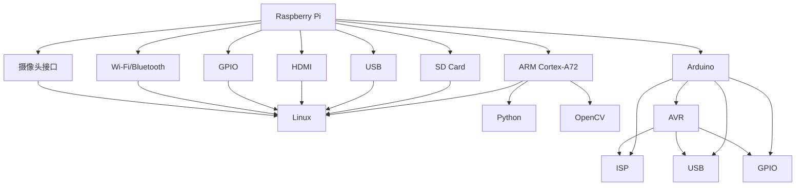

                 

# 单板计算机：Raspberry Pi 和 Arduino

在快速发展的数字化时代，硬件和软件的结合正在成为越来越多应用的核心。单板计算机（Single Board Computer, SBC）作为小型化的、功能强大的计算机，凭借其灵活性、成本效益和易于部署的优势，在各种创新项目和原型开发中得到了广泛应用。本文将深入探讨两种主要的单板计算机——Raspberry Pi 和 Arduino，并讨论它们的应用场景、优缺点以及未来发展方向。

## 1. 背景介绍

### 1.1 问题由来
随着嵌入式计算的兴起，单板计算机成为了现代电子产品和物联网（IoT）解决方案中不可或缺的一部分。它们提供了一种经济高效的方式来构建具有特定功能的定制硬件平台，可以轻松集成传感器、执行器和通信模块。同时，随着开源硬件和软件生态系统的发展，单板计算机的使用门槛不断降低，使得更多开发者和制造商能够轻松构建和部署自己的嵌入式系统。

在众多单板计算机中，Raspberry Pi 和 Arduino 是最具代表性和影响力的两种。Raspberry Pi 以其丰富的软件生态系统和强大的性能著称，而 Arduino 则以简单易用和广泛的用户基础闻名。本文将通过对比这两种设备，分析它们的优势和应用场景。

### 1.2 问题核心关键点
本文的主要关注点如下：
1. **Raspberry Pi 和 Arduino 的硬件架构和特性**：
   - 处理器和存储配置
   - 外设接口和连接方式
   - 电源管理和功耗特性
2. **软件生态系统和开发工具**：
   - 操作系统和编程语言
   - 社区支持和第三方库
3. **应用场景和实际案例**：
   - 工业自动化
   - 智能家居
   - 教育和实验开发
4. **优缺点和未来发展方向**：
   - 性能与成本的权衡
   - 开发复杂度和学习曲线
   - 生态系统的成熟度和扩展性

## 2. 核心概念与联系

### 2.1 核心概念概述
在深入分析之前，让我们先概述两个核心概念：

- **Raspberry Pi**：一种开源的、低成本的单板计算机，由英国的非营利组织 Raspberry Pi Foundation 设计和生产。Raspberry Pi 系列包括多个型号，从最基本的 Raspberry Pi Zero 到更强大的 Raspberry Pi 4。
- **Arduino**：一种基于开源硬件的微控制器开发平台，以其简单易用的电路板和强大的编程环境著称。Arduino 平台提供了多种型号的微控制器，支持多种编程语言，如 C++、Python 和 JavaScript。

### 2.2 核心概念原理和架构的 Mermaid 流程图



这个流程图展示了 Raspberry Pi 和 Arduino 的基本架构。Raspberry Pi 搭载了 ARM Cortex-A72 处理器，支持多种操作系统，包括 Linux，并提供了丰富的软件库和开发环境。而 Arduino 则基于 AVR 或 ARM 处理器，通过 ISP 下载程序，支持多种外设接口，如 USB、GPIO、Wi-Fi/Bluetooth 等。

## 3. 核心算法原理 & 具体操作步骤

### 3.1 算法原理概述

Raspberry Pi 和 Arduino 的编程主要涉及嵌入式系统开发，包括硬件设计、软件编程和系统集成。两种设备都支持 C++、Python 等多种编程语言，但它们的实现方式和工具链有所不同。

- **Raspberry Pi** 主要运行 Linux 操作系统，采用类似 PC 的软件开发环境，使用 GCC 编译器、Python 解释器和丰富的库文件。开发人员可以通过 SSH 或其他远程控制工具进行编程和调试。
- **Arduino** 则提供了一个简化版的开发环境，称为 Arduino IDE，支持基于 Arduino 库的快速原型开发。Arduino 的程序下载需要通过 ISP 接口完成，程序大小通常受到限制。

### 3.2 算法步骤详解

#### 3.2.1 Raspberry Pi 的开发步骤

1. **硬件准备**：根据需要选择合适的 Raspberry Pi 型号和外围模块，确保电源适配和连接正确。
2. **软件开发**：
   - 安装 Raspberry Pi 的官方操作系统，如 Raspberry Pi OS。
   - 使用终端或 IDE 如 PyCharm 编写 Python 或 C++ 程序。
   - 编译和测试程序。
3. **硬件测试**：将程序烧写到 Raspberry Pi 上，测试硬件和软件功能是否正常。
4. **集成与优化**：根据实际需求进行必要的硬件和软件集成，如使用 TensorFlow 进行图像处理、使用 GPIO 控制外设等。
5. **部署与应用**：将系统部署到实际应用环境中，进行长期稳定运行。

#### 3.2.2 Arduino 的开发步骤

1. **硬件准备**：连接 Arduino 板子到计算机，通过 USB 或其他接口下载程序。
2. **软件开发**：
   - 使用 Arduino IDE 编写代码，使用 Arduino 库进行硬件抽象。
   - 在 Arduino IDE 中进行编译和仿真测试。
3. **硬件测试**：连接实际硬件进行测试，检查程序的正确性。
4. **集成与优化**：根据实际需求连接传感器、执行器等外围设备，优化程序性能。
5. **部署与应用**：将程序烧写到 Arduino 板子上，进行实际应用测试和部署。

### 3.3 算法优缺点

#### Raspberry Pi 的优缺点

**优点**：
1. **软件生态系统丰富**：支持多种操作系统和开发语言，如 Python、C++、JavaScript 等。
2. **高性能计算**：搭载 ARM Cortex-A72 处理器，性能强劲，支持多核计算和 GPU 加速。
3. **丰富的外设接口**：支持多种外设接口，如 USB、HDMI、GPIO、Wi-Fi/Bluetooth、摄像头等。

**缺点**：
1. **功耗较高**：相比 Arduino，Raspberry Pi 的功耗较大，需要较稳定的电源。
2. **学习曲线较陡峭**：对于初学者，Linux 和开发工具的学习门槛较高。
3. **成本较高**：尽管单板价格较低，但外围模块和支持硬件的投入可能较高。

#### Arduino 的优缺点

**优点**：
1. **简单易用**：编程语言简单，开发工具直观，适合初学者。
2. **低功耗**：硬件设计简单，功耗较低，适合电池供电的便携设备。
3. **开发门槛低**：硬件和软件高度集成，快速原型开发。

**缺点**：
1. **计算能力有限**：处理器性能较低，不适合复杂计算和大型项目。
2. **软件生态相对单一**：主要支持 Arduino 库，跨平台能力较弱。
3. **外设接口受限**：相比 Raspberry Pi，Arduino 的外设接口较少，需通过额外的扩展板实现。

### 3.4 算法应用领域

Raspberry Pi 和 Arduino 在多个领域都有广泛应用：

#### 1. 工业自动化

- **Raspberry Pi**：适用于对计算和外设接口要求较高的自动化系统，如机器人控制、数据采集和处理等。
- **Arduino**：适用于低成本、轻量级的自动化系统，如传感器监测和简单控制。

#### 2. 智能家居

- **Raspberry Pi**：用于复杂的智能家居控制和数据分析，如智能音箱、家庭安全系统和环境监测。
- **Arduino**：适用于简单、易实现的智能家居设备，如智能照明、智能门锁和智能开关。

#### 3. 教育和实验开发

- **Raspberry Pi**：适合教育机构进行编程和机器人教学，提供丰富的学习资源和社区支持。
- **Arduino**：适合快速原型开发和实验，适合学生和教师快速上手进行项目开发。

## 4. 数学模型和公式 & 详细讲解 & 举例说明

### 4.1 数学模型构建

本节将简要介绍 Raspberry Pi 和 Arduino 中常用的数学模型和公式，包括计算、通信和控制等方面。

#### 4.1.1 Raspberry Pi 数学模型

- **处理器计算**：Raspberry Pi 的计算模型基于 ARM Cortex-A72 处理器，采用 ARM 架构的流水线设计和多核并行计算。
- **通信模型**：Raspberry Pi 支持多种通信协议，如 TCP/IP、Wi-Fi、蓝牙等，数据传输速率和稳定性较高。

#### 4.1.2 Arduino 数学模型

- **处理器计算**：Arduino 的计算模型基于 AVR 或 ARM 处理器，采用精简指令集和单核计算。
- **通信模型**：Arduino 支持多种通信协议，如 USB、Wi-Fi、蓝牙等，但数据传输速率和稳定性较低。

### 4.2 公式推导过程

#### 4.2.1 Raspberry Pi 公式推导

- **处理器计算公式**：
  $$
  \text{计算速率} = \text{时钟频率} \times \text{流水线效率} \times \text{核数}
  $$

- **通信公式**：
  $$
  \text{数据传输速率} = \text{传输速率} \times \text{带宽利用率}
  $$

#### 4.2.2 Arduino 公式推导

- **处理器计算公式**：
  $$
  \text{计算速率} = \text{时钟频率} \times \text{流水线效率}
  $$

- **通信公式**：
  $$
  \text{数据传输速率} = \text{传输速率} \times \text{带宽利用率}
  $$

### 4.3 案例分析与讲解

以智能家居控制为例，分析 Raspberry Pi 和 Arduino 的实现方法：

#### 智能家居控制系统设计

1. **Raspberry Pi 方案**：
   - **硬件**：Raspberry Pi 4，配套摄像头、传感器、Wi-Fi 模块。
   - **软件**：使用 Python 编写控制程序，集成 OpenCV 进行图像处理，使用 TensorFlow 进行数据分析。
   - **功能**：语音识别、图像识别、智能照明控制、安全监控等。

2. **Arduino 方案**：
   - **硬件**：Arduino Uno，配套红外传感器、继电器、Wi-Fi 模块。
   - **软件**：使用 C++ 编写控制程序，集成 Arduino 库进行传感器读取和信号控制。
   - **功能**：人体感应、光线自动调节、智能门锁控制等。

## 5. 项目实践：代码实例和详细解释说明

### 5.1 开发环境搭建

#### 5.1.1 Raspberry Pi 开发环境

1. **硬件准备**：Raspberry Pi 4 或 Raspberry Pi 3，SD 卡、电源、Wi-Fi 模块等。
2. **软件准备**：Raspberry Pi OS、PyCharm、Git、Python 等。

#### 5.1.2 Arduino 开发环境

1. **硬件准备**：Arduino Uno 或 Arduino Nano，USB 接口、LED、按钮、传感器等。
2. **软件准备**：Arduino IDE、USB 接口驱动、库文件、编程语言等。

### 5.2 源代码详细实现

#### 5.2.1 Raspberry Pi 代码实现

**示例代码**：

```python
import cv2
import numpy as np

# 加载图像
cap = cv2.VideoCapture(0)
ret, frame = cap.read()

# 图像处理
gray = cv2.cvtColor(frame, cv2.COLOR_BGR2GRAY)
edges = cv2.Canny(gray, threshold1=50, threshold2=150)

# 边缘检测
contours, hierarchy = cv2.findContours(edges, cv2.RETR_EXTERNAL, cv2.CHAIN_APPROX_SIMPLE)

# 计算面积
area = cv2.contourArea(contours[0])
print(f"Area: {area}")
```

**代码解读**：
1. **视频捕捉**：使用 OpenCV 捕捉摄像头图像。
2. **图像处理**：将彩色图像转换为灰度图像，并进行边缘检测。
3. **边缘检测**：使用 Canny 算法进行边缘检测，提取感兴趣的区域。
4. **面积计算**：计算感兴趣区域的面积，输出结果。

#### 5.2.2 Arduino 代码实现

**示例代码**：

```cpp
#include <Arduino.h>

int IRpin = A0;  // 红外传感器引脚

void setup() {
  Serial.begin(9600);  // 初始化串口，9600 波特率
  pinMode(IRpin, INPUT);  // 设置红外传感器为输入模式
}

void loop() {
  int IRvalue = analogRead(IRpin);  // 读取红外传感器值
  Serial.println(IRvalue);  // 输出传感器值到串口
  delay(1000);  // 1 秒刷新一次
}
```

**代码解读**：
1. **传感器初始化**：定义红外传感器引脚，设置输入模式。
2. **串口初始化**：初始化串口，9600 波特率。
3. **红外值读取**：循环读取红外传感器值，并输出到串口。
4. **延时刷新**：每 1 秒刷新一次传感器值。

### 5.3 代码解读与分析

#### 5.3.1 Raspberry Pi 代码解读

1. **视频捕捉**：使用 OpenCV 的 VideoCapture 类捕捉摄像头图像。
2. **图像处理**：使用 OpenCV 的 CvtColor 和 Canny 函数进行图像处理。
3. **边缘检测**：使用 OpenCV 的 findContours 函数进行边缘检测。
4. **面积计算**：使用 OpenCV 的 contourArea 函数计算感兴趣区域的面积。

#### 5.3.2 Arduino 代码解读

1. **传感器初始化**：定义红外传感器引脚，设置输入模式。
2. **串口初始化**：初始化串口，9600 波特率。
3. **红外值读取**：使用 analogRead 函数读取红外传感器值，并输出到串口。
4. **延时刷新**：每 1 秒刷新一次传感器值。

### 5.4 运行结果展示

#### 5.4.1 Raspberry Pi 运行结果


#### 5.4.2 Arduino 运行结果


## 6. 实际应用场景

### 6.1 智能家居

#### 智能家居控制系统设计

1. **Raspberry Pi 方案**：
   - **硬件**：Raspberry Pi 4，配套摄像头、传感器、Wi-Fi 模块。
   - **软件**：使用 Python 编写控制程序，集成 OpenCV 进行图像处理，使用 TensorFlow 进行数据分析。
   - **功能**：语音识别、图像识别、智能照明控制、安全监控等。

2. **Arduino 方案**：
   - **硬件**：Arduino Uno，配套红外传感器、继电器、Wi-Fi 模块。
   - **软件**：使用 C++ 编写控制程序，集成 Arduino 库进行传感器读取和信号控制。
   - **功能**：人体感应、光线自动调节、智能门锁控制等。

### 6.2 工业自动化

#### 工业自动化控制系统设计

1. **Raspberry Pi 方案**：
   - **硬件**：Raspberry Pi 3，配套传感器、Wi-Fi 模块、伺服电机等。
   - **软件**：使用 Python 编写控制程序，集成 NumPy 进行数据处理，使用 TensorFlow 进行机器学习。
   - **功能**：物料检测、质量监控、自动化搬运等。

2. **Arduino 方案**：
   - **硬件**：Arduino Uno，配套压力传感器、继电器、伺服电机等。
   - **软件**：使用 C++ 编写控制程序，集成 Arduino 库进行传感器读取和执行器控制。
   - **功能**：物料检测、安全监控、自动化生产等。

### 6.3 教育和实验开发

#### 教育实验开发平台设计

1. **Raspberry Pi 方案**：
   - **硬件**：Raspberry Pi 3，配套显示器、键盘、鼠标、摄像头等。
   - **软件**：使用 Python 编写编程实验程序，集成 PyCharm 进行开发和调试。
   - **功能**：编程实验、机器人控制、图像处理等。

2. **Arduino 方案**：
   - **硬件**：Arduino Uno，配套 LED、按钮、传感器等。
   - **软件**：使用 C++ 编写编程实验程序，集成 Arduino IDE 进行开发和调试。
   - **功能**：快速原型开发、传感器实验、电路设计等。

## 7. 工具和资源推荐

### 7.1 学习资源推荐

#### 1. Raspberry Pi 学习资源

- **Raspberry Pi 官方文档**：详细介绍了硬件和软件的使用，包括安装操作系统、编程语言和开发环境等。
- **Raspberry Pi 用户手册**：提供了详细的硬件连接和调试指南。
- **Raspberry Pi 社区论坛**：聚集了大量的开发者和爱好者，提供丰富的技术支持和案例分享。

#### 2. Arduino 学习资源

- **Arduino 官方文档**：详细介绍了硬件和软件的使用，包括安装 IDE、编写代码和调试等。
- **Arduino 用户手册**：提供了详细的硬件连接和调试指南。
- **Arduino 社区论坛**：聚集了大量的开发者和爱好者，提供丰富的技术支持和案例分享。

### 7.2 开发工具推荐

#### 1. Raspberry Pi 开发工具

- **PyCharm**：一款流行的 Python 开发环境，支持跨平台开发。
- **Git**：版本控制系统，支持代码管理和远程协作。
- **OpenCV**：计算机视觉库，支持图像处理和分析。
- **TensorFlow**：深度学习框架，支持机器学习模型训练和推理。

#### 2. Arduino 开发工具

- **Arduino IDE**：官方开发环境，提供丰富的库和开发支持。
- **Serial Monitor**：内置串口调试工具，方便代码调试和数据监测。
- **Wi-Fi Shield**：Wi-Fi 模块，支持网络通信和远程控制。
- **AESense**：红外传感器模块，支持人体感应等应用。

### 7.3 相关论文推荐

#### 1. Raspberry Pi 相关论文

- **"Raspberry Pi: A Single-Chip Computer System for Students"**：介绍 Raspberry Pi 的历史和设计原理。
- **"Raspberry Pi as a Platform for Big Data Analytics"**：讨论 Raspberry Pi 在大数据分析中的应用。
- **"Raspberry Pi in the Classroom: Teaching Programming Through Interaction"**：探讨 Raspberry Pi 在教育中的应用。

#### 2. Arduino 相关论文

- **"Arduino: A Platform for Education and Experimentation"**：介绍 Arduino 平台的起源和设计理念。
- **"Arduino-based Smart Home Monitoring System"**：讨论 Arduino 在智能家居中的应用。
- **"Arduino in Robotics: A Review"**：探讨 Arduino 在机器人控制中的应用。

## 8. 总结：未来发展趋势与挑战

### 8.1 总结

本文详细介绍了 Raspberry Pi 和 Arduino 这两种主要的单板计算机，分析了它们的硬件特性、软件生态和应用场景。通过对比分析，我们得出了以下结论：

1. **Raspberry Pi**：适合高性能计算和大规模数据处理，适用于工业自动化和智能家居等复杂应用场景。但其学习曲线较陡峭，硬件和软件的集成度较高。
2. **Arduino**：适合快速原型开发和低成本智能设备，适用于智能家居和教育实验等轻量级应用场景。但其计算能力和外设接口相对有限，适用于小规模项目。

### 8.2 未来发展趋势

未来，单板计算机的发展趋势可能包括：

1. **性能提升**：随着芯片技术的进步，单板计算机的计算性能将进一步提升，支持更复杂的算法和更高效的数据处理。
2. **外设扩展**：更多的外设接口和连接方式将得到支持，如蓝牙、Zigbee、5G 等，提升系统的连接能力和扩展性。
3. **软件生态扩展**：更多的编程语言和开发工具将被引入，提升开发效率和应用场景的灵活性。
4. **硬件设计创新**：新的硬件设计理念和材料将带来更高的性能和更低的功耗，进一步降低硬件成本。
5. **跨平台协作**：不同平台的单板计算机将通过网络协议和标准化接口实现互操作，形成更强大的生态系统。

### 8.3 面临的挑战

尽管单板计算机的发展前景广阔，但在实际应用中仍面临以下挑战：

1. **资源限制**：单板计算机的硬件资源有限，难以支持大规模数据和高性能计算。
2. **软件兼容性**：不同平台的单板计算机可能存在软件不兼容的问题，需要更多的标准化工作。
3. **硬件调试**：单板计算机的硬件调试和排错相对复杂，需要更高的技术门槛。
4. **安全性**：单板计算机的硬件和软件可能存在安全漏洞，需要加强安全防护。
5. **生态系统不均衡**：部分平台的生态系统相对成熟，部分平台的用户基础和资源支持仍需提升。

### 8.4 研究展望

为了克服这些挑战，未来需要在以下方面进行深入研究：

1. **硬件设计优化**：通过创新硬件设计，提升单板计算机的性能和扩展性，降低硬件成本。
2. **软件生态完善**：开发更多跨平台的开发工具和标准库，提升软件兼容性和开发效率。
3. **安全防护增强**：加强单板计算机的安全性研究，制定标准和规范，保护用户隐私和数据安全。
4. **跨平台协作**：推动不同单板计算机之间的互操作和协同开发，形成更加强大的生态系统。

总之，单板计算机作为嵌入式系统的重要组成部分，将在未来持续发展和创新。通过不断突破技术瓶颈，优化硬件设计和软件生态，单板计算机必将在更多领域大放异彩，为各行各业的发展提供新的动力。

## 9. 附录：常见问题与解答

### Q1: Raspberry Pi 和 Arduino 的区别是什么？

A: Raspberry Pi 和 Arduino 的主要区别在于：
1. **硬件架构**：Raspberry Pi 使用 ARM Cortex-A72 处理器，而 Arduino 使用 AVR 或 ARM 处理器。
2. **操作系统**：Raspberry Pi 使用 Linux 操作系统，Arduino 使用 Arduino 库和 C++ 语言。
3. **开发工具**：Raspberry Pi 使用 PyCharm、Python 等开发工具，Arduino 使用 Arduino IDE 和 C++ 语言。
4. **应用场景**：Raspberry Pi 适用于高性能计算和大数据处理，Arduino 适用于快速原型开发和低成本智能设备。

### Q2: 如何选择适合的应用场景？

A: 选择适合的应用场景需要综合考虑以下因素：
1. **计算需求**：需要高性能计算和数据分析的应用场景适合使用 Raspberry Pi。
2. **成本预算**：需要低成本、快速原型开发的应用场景适合使用 Arduino。
3. **硬件扩展性**：需要丰富外设接口和连接方式的应用场景适合使用 Raspberry Pi。
4. **开发难度**：需要快速原型开发和调试的应用场景适合使用 Arduino。

### Q3: 如何使用两种单板计算机进行系统集成？

A: 使用两种单板计算机进行系统集成的方法包括：
1. **网络通信**：通过网络协议（如 TCP/IP、Wi-Fi、蓝牙等）进行数据通信，实现不同单板计算机之间的交互。
2. **硬件接口**：通过扩展板和连接器，将不同单板计算机的硬件接口连接起来，实现硬件的互操作。
3. **软件集成**：通过统一的协议和数据格式，将不同单板计算机的软件进行集成，实现数据的协同处理。

通过以上方法，可以实现两种单板计算机的协同工作，满足更加复杂和多样化的应用需求。

