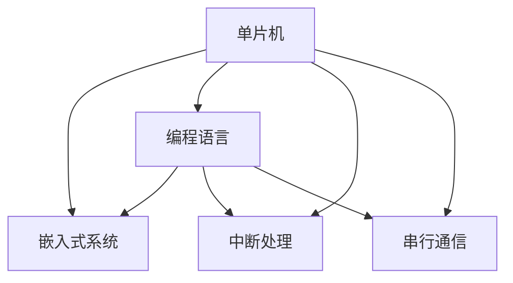

                 

# 单片机编程：嵌入式系统的基石

## 1. 背景介绍

### 1.1 问题由来
单片机编程作为嵌入式系统开发的基础，是实现各种智能化设备的核心技术。随着物联网、智能家居、智能汽车等应用场景的不断涌现，单片机在生活中的应用日益普及，其重要性和需求也在不断增加。

### 1.2 问题核心关键点
单片机编程主要涉及以下几个核心问题：
- 嵌入式系统的工作原理和结构
- 编程语言的选择与应用
- 硬件资源的管理与优化
- 实时性、可靠性和安全性

单片机编程的核心在于如何将编程逻辑嵌入到单片机的微处理器中，实现高效、可靠、安全的系统功能。单片机作为嵌入式系统的基石，其编程能力直接影响着设备的性能和用户体验。

### 1.3 问题研究意义
单片机编程在嵌入式系统开发中具有重要意义：

1. **高性能与低成本**：单片机可以高效处理数据，实现复杂的控制逻辑，同时价格低廉，非常适合资源受限的环境。
2. **可靠性与实时性**：单片机系统具备高可靠性与实时性，适用于需要快速响应的场景，如智能交通、医疗设备等。
3. **安全性**：单片机系统的封闭性使其不容易受到外部攻击，提高了整体系统的安全性。
4. **便捷性与可扩展性**：单片机编程便于上手，支持多种开发环境，易于扩展新的功能。

## 2. 核心概念与联系

### 2.1 核心概念概述

为更好地理解单片机编程的原理，本节将介绍几个核心概念：

- **单片机**：一种集成在一块芯片上的微处理器，具有存储、计算、通信等功能，广泛应用于各种嵌入式系统中。
- **嵌入式系统**：以计算机硬件为基础，结合软件和硬件系统，实现特定功能的应用系统。
- **编程语言**：用于单片机编程的语言，包括汇编语言、C语言、C++等。
- **中断处理**：单片机系统中，响应外部事件的机制，用于提高系统的响应速度和实时性。
- **串行通信**：单片机与外设之间的通信方式，常用于数据传输和控制。

这些核心概念之间的逻辑关系可以通过以下Mermaid流程图来展示：



这个流程图展示了一些关键概念及其之间的关系：

1. 单片机是嵌入式系统的核心部件。
2. 编程语言用于单片机编程，实现系统功能。
3. 中断处理和串行通信是单片机系统常用的功能模块。
4. 编程语言与中断处理、串行通信紧密结合，共同构建嵌入式系统。

## 3. 核心算法原理 & 具体操作步骤
### 3.1 算法原理概述

单片机编程的核心算法原理涉及嵌入式系统的工作原理和编程语言的实现机制。嵌入式系统通常由以下几部分组成：

- **微处理器**：单片机的核心部件，具备数据处理、存储、通信等功能。
- **存储器**：包括程序存储器和数据存储器，用于存储系统代码和运行数据。
- **输入/输出接口**：用于与外设通信的接口，包括I/O端口、串行通信接口等。
- **时钟系统**：提供系统时钟信号，控制程序运行速度。
- **中断系统**：用于响应外部事件，提高系统的实时性。

单片机编程的算法原理可以概括为以下几个步骤：

1. **系统初始化**：设置硬件寄存器、时钟频率等参数，确保系统能够正常运行。
2. **程序加载与执行**：将程序存储器中的代码加载到微处理器，并执行相关指令。
3. **中断处理**：响应外部事件，进行相应处理，保证系统实时性。
4. **数据传输与通信**：通过I/O接口和串行通信接口，实现与外设的数据交换。

### 3.2 算法步骤详解

#### 3.2.1 系统初始化
在系统初始化阶段，需要完成以下任务：

1. **时钟设置**：配置晶振频率，确保时钟信号稳定。
2. **引脚初始化**：设置输入输出引脚的电平、速度等参数。
3. **存储器设置**：配置程序存储器、数据存储器的地址和大小。
4. **中断向量表配置**：设置中断服务程序的入口地址。

#### 3.2.2 程序加载与执行
在程序加载阶段，需要将程序存储器中的代码加载到微处理器的RAM中，并跳转到主程序入口地址开始执行。

#### 3.2.3 中断处理
中断处理是单片机编程的关键，需要实现以下功能：

1. **中断向量配置**：设置中断服务程序的入口地址。
2. **中断优先级设置**：配置中断优先级，确保高优先级中断能够及时响应。
3. **中断服务程序编写**：编写中断服务函数，处理外部事件。

#### 3.2.4 数据传输与通信
单片机常用的数据传输方式包括：

1. **I/O端口传输**：通过读写输入输出端口，实现数据传输。
2. **串行通信**：通过UART、IIC、SPI等接口，实现与外设的通信。

### 3.3 算法优缺点

单片机编程的优点包括：

1. **实时性高**：单片机具备高实时性，适合需要快速响应的场景。
2. **功耗低**：单片机可以低功耗运行，适合资源受限的环境。
3. **可靠性高**：单片机系统的封闭性提高了整体系统的可靠性。
4. **开发方便**：单片机支持多种编程语言，易于上手。

缺点包括：

1. **编程复杂**：单片机编程需要掌握硬件和软件知识，难度较高。
2. **扩展性差**：单片机系统的扩展性较差，需要重新设计硬件。
3. **调试困难**：单片机系统不易调试，需要硬件调试工具。

### 3.4 算法应用领域

单片机编程广泛应用于以下领域：

1. **物联网设备**：智能家居、智能穿戴设备等。
2. **智能汽车**：车载导航、自动驾驶等。
3. **医疗设备**：医疗监测、诊断设备等。
4. **工业控制**：机器人、自动化生产线等。
5. **消费电子**：智能手机、智能电视等。

## 4. 数学模型和公式 & 详细讲解 & 举例说明

### 4.1 数学模型构建

单片机编程的数学模型构建主要涉及数据传输和通信的数学模型。以串行通信为例，常见的是UART协议，其数学模型可以表示为：

$$
\text{发送数据} = \text{发送端数据} \oplus \text{校验位}
$$

$$
\text{接收数据} = \text{接收端数据} \oplus \text{校验位}
$$

其中，$\oplus$表示异或运算，$\text{发送端数据}$和$\text{接收端数据}$为8位或16位数据，$\text{校验位}$用于检测传输数据的完整性。

### 4.2 公式推导过程

串行通信的公式推导过程如下：

1. **数据传输模型**：发送端将数据通过UART接口发送到接收端，数据格式为发送数据 $\text{发送数据}$。
2. **数据接收模型**：接收端将接收到的数据通过UART接口传输到系统，数据格式为接收数据 $\text{接收数据}$。
3. **校验位计算**：发送端和接收端分别计算校验位 $\text{校验位}$，用于检测数据传输的完整性。

### 4.3 案例分析与讲解

以STM32单片机为例，介绍UART通信的实现步骤：

1. **硬件连接**：连接UART接口到STM32的USART1，配置GPIO3和GPIO4为输出输入。
2. **初始化函数编写**：编写USART1初始化函数，设置时钟频率、数据位等参数。
3. **发送函数编写**：编写USART1发送函数，实现数据的串行发送。
4. **接收函数编写**：编写USART1接收函数，实现数据的串行接收。

## 5. 项目实践：代码实例和详细解释说明
### 5.1 开发环境搭建

开发单片机程序通常需要使用专用的开发环境，以下是搭建开发环境的流程：

1. **安装开发软件**：选择常用的单片机开发软件，如Keil、IAR等。
2. **安装调试器**：下载单片机调试器，如ST-LINK、J-Link等。
3. **配置开发板**：连接开发板到计算机，并进行硬件初始化。
4. **编写代码**：使用C语言编写单片机程序，实现所需功能。

### 5.2 源代码详细实现

以下是STM32单片机实现UART通信的C语言代码：

```c
#include "stm32f10x.h"

void USART1_Init(void);
void USART1_UDREN(void);
void USART1_RDA(void);
void USART1_TDA(void);
void USART1_TXC(void);

int main(void)
{
    USART1_Init();
    while(1)
    {
        USART1_UDREN();
        USART1_RDA();
        USART1_TDA();
        USART1_TXC();
    }
}

void USART1_Init(void)
{
    RCC_APB2PeriphClockCmd(RCC_APB2Periph_USART1, ENABLE);
    USART_InitTypeDef USART_InitStructure;
    USART_InitStructure.USART_BaudRate = 9600;
    USART_InitStructure.USART_WordLength = USART_WordLength_8b;
    USART_InitStructure.USART_StopBits = USART_StopBits_1;
    USART_InitStructure.USART_Parity = USART_Parity_Yes;
    USART_InitStructure.USART_HardwareFlowControl = USART_HardwareFlowControl_None;
    USART_InitStructure.USART_Mode = USART_Mode_Rx | USART_Mode_Tx;
    USART_Init(USART1, &USART_InitStructure);
    USART_ClockCmd(USART1, ENABLE);
    USART_CSRConfig(USART1, USART_CSR_UE, ENABLE);
    USART_ITConfig(USART1, USART_IT_UDRE, ENABLE);
    USART_ITConfig(USART1, USART_IT_IDLE, ENABLE);
}

void USART1_UDREN(void)
{
    if (USART_GetITStatus(USART1, USART_IT_UDRE))
    {
        USART_ClearITPendingBit(USART1, USART_IT_UDRE);
    }
}

void USART1_RDA(void)
{
    if (USART_GetITStatus(USART1, USART_IT_IDLE))
    {
        USART_ClearITPendingBit(USART1, USART_IT_IDLE);
    }
}

void USART1_TDA(void)
{
    if (USART_GetITStatus(USART1, USART_IT_TXE))
    {
        USART_ClearITPendingBit(USART1, USART_IT_TXE);
    }
}

void USART1_TXC(void)
{
    if (USART_GetITStatus(USART1, USART_IT_TC))
    {
        USART_ClearITPendingBit(USART1, USART_IT_TC);
    }
}
```

### 5.3 代码解读与分析

以上代码实现了STM32单片机的UART通信功能，具体解读如下：

- `USART1_Init`函数：配置UART1的初始化参数，包括时钟频率、数据位、停止位、奇偶校验等。
- `USART1_UDREN`函数：处理UART1的UDRE（数据准备好）中断，用于检测数据的准备情况。
- `USART1_RDA`函数：处理UART1的RDA（接收数据准备好）中断，用于检测数据的接收情况。
- `USART1_TDA`函数：处理UART1的TDA（发送数据准备好）中断，用于检测数据的发送情况。
- `USART1_TXC`函数：处理UART1的TXC（传输完成）中断，用于检测数据的传输情况。

### 5.4 运行结果展示

运行代码后，可以通过调试器查看单片机的UART通信情况，测试结果应为正常接收和发送数据。

## 6. 实际应用场景

### 6.1 智能家居设备

单片机编程在智能家居设备中广泛应用。智能家居设备如智能灯泡、智能插座等，通过单片机实现远程控制、定时开关等功能。例如，一个智能灯泡可以通过单片机连接到Wi-Fi网络，用户可以通过手机App远程控制灯泡的亮度和颜色。

### 6.2 工业自动化系统

工业自动化系统中的传感器、执行器等设备通常由单片机控制。单片机可以实现设备的实时监控、数据采集、控制命令的下发等功能。例如，一个工业机器人可以通过单片机控制其运动、检测传感器信号，实现自动化生产线的作业。

### 6.3 智能穿戴设备

智能穿戴设备如智能手表、智能眼镜等，通过单片机实现语音识别、数据分析等功能。例如，智能手表可以通过单片机实时监测用户的健康数据，并通过蓝牙传输到手机App中进行分析。

### 6.4 未来应用展望

随着物联网、智能城市等应用场景的不断拓展，单片机编程在嵌入式系统中的应用前景广阔：

1. **自动化程度提升**：未来单片机将具备更高的自动化程度，实现更复杂的功能，如自主导航、自适应控制等。
2. **实时性进一步增强**：通过优化算法和硬件设计，单片机的实时性将进一步提升，适合更复杂的实时应用场景。
3. **安全性得到加强**：单片机系统将具备更高的安全性，防止恶意攻击和数据泄露。
4. **兼容性增强**：单片机将支持更多协议和标准，与其他设备和系统兼容性好。

## 7. 工具和资源推荐
### 7.1 学习资源推荐

为了帮助开发者系统掌握单片机编程，这里推荐一些优质的学习资源：

1. **《单片机编程与设计》**：详细介绍单片机的工作原理和编程方法，适合初学者入门。
2. **《嵌入式系统设计与实现》**：涵盖嵌入式系统硬件设计和软件实现的全面内容，适合进阶学习。
3. **《STM32全家桶开发实战》**：以STM32单片机为例，讲解嵌入式系统开发实战技巧，适合实践应用。
4. **《ARM Cortex-M系列嵌入式系统开发》**：介绍Cortex-M系列单片机的编程和优化方法，适合专业开发者。

通过学习这些资源，可以全面掌握单片机编程的知识和技能，更好地应用于实际开发中。

### 7.2 开发工具推荐

单片机编程常用的开发工具包括：

1. **Keil MDK**：STM32单片机的官方开发环境，支持调试、仿真等功能。
2. **IAR Embedded Workbench**：支持多种单片机架构，包括ARM、MIPS等。
3. **STM32CubeIDE**：ST公司推出的开发工具，支持STM32单片机的开发和调试。
4. **Atmel Studio**：支持Atmel单片机的开发和调试。

选择合适的开发工具可以提高开发效率，快速完成单片机程序的设计和测试。

### 7.3 相关论文推荐

单片机编程的相关论文推荐：

1. **《基于STM32单片机的物联网设备设计与实现》**：介绍STM32单片机在物联网设备中的应用。
2. **《单片机系统设计及优化技术研究》**：研究单片机系统设计中的关键技术，包括硬件设计、软件优化等。
3. **《嵌入式系统中的实时性优化》**：探讨嵌入式系统中的实时性优化方法，提高系统的响应速度。

这些论文可以提供最新的技术进展和应用案例，帮助开发者不断提升单片机编程能力。

## 8. 总结：未来发展趋势与挑战

### 8.1 研究成果总结

单片机编程技术在嵌入式系统中的应用日益广泛，其研究成果如下：

1. **硬件设计优化**：随着半导体工艺的发展，单片机的性能和功耗不断提升，设计更高效的硬件电路，提高系统的可靠性和性能。
2. **软件算法优化**：通过优化算法和数据结构，提高单片机程序的执行效率和资源利用率。
3. **新材料应用**：引入新的半导体材料和封装技术，实现更高的集成度和可靠性。
4. **新协议支持**：支持更多的通信协议和标准，提高单片机系统的兼容性。

### 8.2 未来发展趋势

单片机编程的未来发展趋势包括：

1. **高性能化**：单片机的计算能力和资源管理能力将进一步提升，实现更复杂的功能。
2. **低功耗化**：单片机将具备更低的功耗，适应更多的低功耗应用场景。
3. **自动化程度提升**：单片机系统将具备更高的自动化程度，实现更复杂的自动化控制。
4. **兼容性增强**：单片机将支持更多协议和标准，与其他设备和系统兼容性好。
5. **安全性得到加强**：单片机系统将具备更高的安全性，防止恶意攻击和数据泄露。

### 8.3 面临的挑战

单片机编程在发展过程中面临以下挑战：

1. **技术门槛高**：单片机编程需要掌握硬件和软件知识，技术门槛较高。
2. **开发周期长**：单片机系统的开发周期较长，需要不断的调试和优化。
3. **资源限制**：单片机的资源有限，需要合理分配和优化。
4. **兼容性问题**：单片机系统需要支持多种协议和标准，不同系统间的兼容性问题需要解决。

### 8.4 研究展望

未来的研究展望包括：

1. **新材料应用**：引入新的半导体材料和封装技术，实现更高的集成度和可靠性。
2. **新算法开发**：开发新的算法和数据结构，提高单片机程序的执行效率和资源利用率。
3. **跨平台优化**：实现跨平台的单片机编程，提高开发效率和应用范围。
4. **安全性保障**：加强单片机系统的安全性保障，防止恶意攻击和数据泄露。

## 9. 附录：常见问题与解答

**Q1: 单片机编程与嵌入式系统开发的区别是什么？**

A: 单片机编程是嵌入式系统开发中的一个重要环节，用于实现嵌入式系统硬件和软件的控制和通信。嵌入式系统开发包括硬件设计、软件实现、测试和调试等环节，单片机编程主要涉及嵌入式系统的软件部分。

**Q2: 单片机编程需要掌握哪些知识？**

A: 单片机编程需要掌握硬件设计、软件实现、调试和优化等方面的知识。具体包括：

- 单片机的工作原理和结构
- 编程语言的应用和优化
- 硬件资源的管理和优化
- 实时性、可靠性和安全性的保障

**Q3: 单片机编程中常见的中断处理有哪些？**

A: 单片机编程中常见的中断处理包括UART中断、TIMER中断、IIC中断等。中断处理用于实现系统的实时响应和数据传输。

**Q4: 单片机编程中如何实现数据传输与通信？**

A: 单片机编程中常见的数据传输方式包括I/O端口传输、UART通信、IIC通信等。通过编写相应的程序，可以实现数据的传输和通信。

**Q5: 单片机编程在实际应用中需要注意哪些问题？**

A: 单片机编程在实际应用中需要注意以下问题：

- 硬件连接和初始化
- 程序编写和调试
- 数据传输和通信
- 系统安全和稳定性

---

作者：禅与计算机程序设计艺术 / Zen and the Art of Computer Programming

