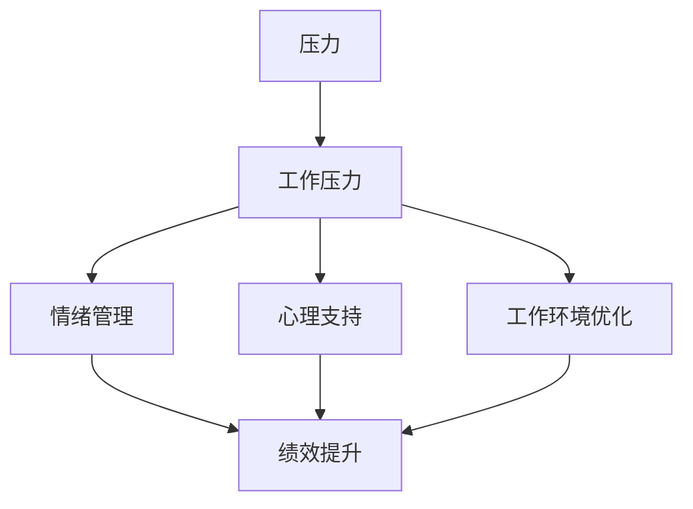

                 

# 压力管理：在高压环境中保持绩效

## 1. 背景介绍

在现代社会，工作与生活的压力已经成为了影响个人健康和绩效的主要因素之一。无论是企业高管、程序员，还是教师、医生，每个人都在不同程度上承受着来自工作与生活的压力。压力管理已经成为提高个人和团队绩效、促进心理健康的重要课题。

### 1.1 问题由来
随着科技的发展和竞争的加剧，工作强度和压力不断增大，特别是在创新型企业和快节奏行业，如互联网、金融、医疗等。如何有效地管理压力，提升绩效，已经成为企业管理者和心理学家关注的焦点。

### 1.2 问题核心关键点
压力管理的主要目标是帮助个体和团队识别和应对压力源，采用科学合理的方法减轻心理和生理负担，最终提升工作表现和生活质量。关键点包括：
- **压力源识别**：了解产生压力的因素和触发点。
- **压力缓解**：通过心理、生理、环境等多维度的方法，缓解压力。
- **绩效提升**：通过科学的压力管理，提升个体和团队的绩效。

## 2. 核心概念与联系

### 2.1 核心概念概述

为更好地理解压力管理和绩效提升的原理，本节将介绍几个核心概念：

- **压力（Stress）**：一种由外部或内部因素引发的生理和心理紧张状态。
- **工作压力（Work-related Stress）**：与工作相关的压力，包括任务繁重、时间紧迫、人际关系紧张等。
- **绩效（Performance）**：个体或团队在工作中的表现和成就。
- **情绪管理（Emotional Management）**：通过认知和行为干预，调节和管理情绪的过程。
- **心理支持（Psychological Support）**：通过各种形式的支持，帮助个体和团队应对压力和挑战。
- **工作环境优化（Work Environment Optimization）**：通过改善工作环境和条件，降低压力源，提升工作满意度。

这些核心概念之间的逻辑关系可以通过以下Mermaid流程图来展示：



这个流程图展示了几类核心概念及其之间的关系：

1. 压力由工作压力引发。
2. 通过情绪管理和心理支持，帮助个体和团队缓解压力。
3. 优化工作环境，减少压力源。
4. 在多维度支持下，提升个体和团队的工作绩效。

## 3. 核心算法原理 & 具体操作步骤
### 3.1 算法原理概述

基于压力管理的核心思想，在高压环境中保持绩效，主要包括以下几个步骤：

1. **压力源识别**：通过问卷调查、行为观察等方式，识别个体的压力源。
2. **压力评估**：使用心理压力量表，评估个体或团队的压力水平。
3. **压力缓解**：根据压力源和压力水平，采用相应的缓解方法，如心理疏导、身体锻炼、环境调整等。
4. **绩效提升**：通过科学的管理和领导，提升团队士气，优化工作流程，增强团队协作。
5. **效果评估**：定期评估压力管理和绩效提升的效果，调整策略，持续改进。

### 3.2 算法步骤详解

**Step 1: 压力源识别**
- **问卷调查**：设计详细的压力源调查问卷，涵盖工作负荷、人际关系、时间管理等方面。
- **行为观察**：通过工作记录、同事反馈等方式，观察个体的行为变化，识别压力源。
- **一对一访谈**：与管理者和同事进行一对一访谈，了解个体的真实感受和压力源。

**Step 2: 压力评估**
- **心理压力量表**：使用标准化的心理压力量表，如Perceived Stress Scale（PSS）、Holistic Rating of Stress（HRS）等，评估个体或团队的压力水平。
- **行为监测**：通过工作记录和行为监测工具，评估个体的工作效率和行为异常情况。
- **心理状态分析**：使用心理状态监测软件，分析个体的情绪和心理状态，评估压力水平。

**Step 3: 压力缓解**
- **心理疏导**：提供专业的心理咨询和心理疏导服务，帮助个体和团队应对压力。
- **身体锻炼**：推荐适宜的身体锻炼方式，如瑜伽、跑步、冥想等，缓解压力。
- **环境优化**：改善工作环境和条件，如增加自然光照、优化办公布局等，降低压力源。
- **团队协作**：增强团队协作和沟通，提升团队凝聚力和士气。

**Step 4: 绩效提升**
- **目标设定**：帮助团队设定明确的工作目标和任务，增强工作动力。
- **工作流程优化**：优化工作流程和任务分配，提高工作效率。
- **领导支持**：提供领导支持和资源保障，增强团队信心和信任。
- **绩效反馈**：定期反馈绩效评估结果，调整工作计划，持续改进。

**Step 5: 效果评估**
- **定期检查**：定期检查压力管理和绩效提升的效果，评估改进措施的成效。
- **持续改进**：根据评估结果，持续改进压力管理和绩效提升策略。
- **数据驱动决策**：利用数据和分析工具，支持科学的决策和改进。

### 3.3 算法优缺点

基于压力管理的核心算法具有以下优点：
1. **系统性**：通过多维度分析和管理，全面提升个体和团队的绩效。
2. **科学性**：基于数据和科学的理论，提供系统的压力管理方案。
3. **可操作性**：方法简单易行，易于实际操作和实施。
4. **灵活性**：根据个体和团队特点，灵活调整策略，提升效果。

同时，该算法也存在一些局限性：
1. **数据依赖**：评估和改进依赖于详细的数据和分析工具，数据不足时难以进行有效评估。
2. **个体差异**：不同个体对压力的应对方式和效果不同，需根据个体差异进行个性化管理。
3. **时间和资源投入**：实施过程中需要投入大量时间和资源，包括问卷调查、心理评估等。
4. **效果波动**：压力管理和绩效提升的效果可能存在波动，需要持续监测和调整。

尽管存在这些局限性，基于压力管理的核心算法仍是目前较为系统和科学的压力管理方法。未来相关研究的重点在于如何进一步提高数据的准确性和实时性，增强个体和团队的适应性和自我管理能力。

### 3.4 算法应用领域

基于压力管理的核心算法在多个领域都得到了广泛应用：

- **企业管理**：企业通过系统化的压力管理，提升员工士气和工作效率，增强企业竞争力。
- **医疗健康**：医疗机构通过压力管理，提高医护人员的心理健康水平，减少职业倦怠。
- **教育培训**：学校通过压力管理，提升教师和学生的心理素质，增强教学和学习效果。
- **政府服务**：政府部门通过压力管理，优化公务员的工作环境，提高服务质量。
- **体育竞赛**：运动队通过压力管理，提升运动员的心理素质，增强比赛表现。

除了上述这些领域，压力管理还将在更多场景中得到应用，如军队、媒体、文化创意等，为提升个体和团队的绩效提供全面的支持。

## 4. 数学模型和公式 & 详细讲解  
### 4.1 数学模型构建

为了更科学地评估压力水平和绩效表现，本节将构建一个数学模型。假设个体在t时刻的压力水平为$P_t$，其绩效为$F_t$，影响因素包括工作负荷$L_t$、时间管理$T_t$、人际关系$R_t$等。

定义一个线性回归模型来描述这些因素对压力和绩效的影响：

$$
P_t = \alpha_1 + \beta_1L_t + \gamma_1T_t + \delta_1R_t + \epsilon_1
$$

$$
F_t = \alpha_2 + \beta_2L_t + \gamma_2T_t + \delta_2R_t + \epsilon_2
$$

其中，$\alpha_1$、$\alpha_2$、$\beta_1$、$\beta_2$、$\gamma_1$、$\gamma_2$、$\delta_1$、$\delta_2$为模型的参数，$\epsilon_1$、$\epsilon_2$为误差项。

### 4.2 公式推导过程

为了推导上述线性回归模型，我们将采用最小二乘法进行参数估计。设样本数量为$N$，定义模型预测值与实际值之差的平方和损失函数：

$$
\text{Loss} = \sum_{i=1}^N (y_i - \hat{y}_i)^2
$$

其中，$y_i$为实际值，$\hat{y}_i$为模型预测值。

最小二乘法的目标是最小化上述损失函数，即：

$$
\min_{\theta} \text{Loss}
$$

其中，$\theta$为模型的参数向量，包括$\alpha_1$、$\alpha_2$、$\beta_1$、$\beta_2$、$\gamma_1$、$\gamma_2$、$\delta_1$、$\delta_2$。

通过求偏导数并令其为0，得到最小二乘法的参数估计公式：

$$
\hat{\theta} = (X^TX)^{-1}X^TY
$$

其中，$X$为特征矩阵，$Y$为目标向量，$\hat{\theta}$为参数估计值。

### 4.3 案例分析与讲解

**案例分析**：
某企业发现部分员工在工作中表现出较高的压力水平和较低的绩效。通过问卷调查和行为观察，发现主要压力源包括工作负荷重、时间管理不当、人际关系紧张等。

**数据收集**：
- 设计详细的压力源调查问卷，涵盖工作负荷、时间管理、人际关系等方面。
- 使用标准化的心理压力量表（如PSS），评估员工的压力水平。
- 记录员工的工作日志和行为数据，评估工作负荷和时间管理情况。

**数据分析**：
- 使用Python和R等数据分析工具，对收集到的数据进行分析。
- 构建线性回归模型，预测压力水平和绩效表现。

**结果分析**：
- 分析模型的预测结果，识别出主要影响因素。
- 针对主要影响因素，制定相应的缓解措施，如优化工作流程、增强团队协作等。

**效果评估**：
- 定期评估压力管理和绩效提升的效果，调整策略，持续改进。

## 5. 项目实践：代码实例和详细解释说明
### 5.1 开发环境搭建

在进行压力管理项目开发前，我们需要准备好开发环境。以下是使用Python进行数据分析和建模的环境配置流程：

1. 安装Anaconda：从官网下载并安装Anaconda，用于创建独立的Python环境。

2. 创建并激活虚拟环境：
```bash
conda create -n stress-management python=3.8 
conda activate stress-management
```

3. 安装必要的Python包：
```bash
conda install pandas numpy matplotlib scikit-learn statsmodels jupyter notebook
```

4. 安装R：
```bash
conda install r-essentials
```

完成上述步骤后，即可在`stress-management`环境中开始压力管理项目开发。

### 5.2 源代码详细实现

我们以线性回归模型为例，给出使用Python进行压力管理的代码实现。

首先，导入必要的Python包和数据集：

```python
import pandas as pd
import numpy as np
import matplotlib.pyplot as plt
from sklearn.linear_model import LinearRegression
from statsmodels.api import OLS

# 导入数据集
data = pd.read_csv('stress.csv')
```

然后，定义数据预处理和模型构建函数：

```python
def preprocess_data(data):
    # 数据清洗和预处理
    # 去除缺失值和异常值
    data = data.dropna()
    # 标准化数据
    data['L_t'] = (data['L_t'] - data['L_t'].mean()) / data['L_t'].std()
    data['T_t'] = (data['T_t'] - data['T_t'].mean()) / data['T_t'].std()
    data['R_t'] = (data['R_t'] - data['R_t'].mean()) / data['R_t'].std()
    return data

def build_model(X, y, alpha, beta, gamma, delta):
    # 构建线性回归模型
    model = LinearRegression()
    model.fit(X, y)
    return model

def evaluate_model(model, X_test, y_test):
    # 评估模型效果
    y_pred = model.predict(X_test)
    print('R^2 score:', model.score(X_test, y_test))
```

接下来，进行数据预处理和模型训练：

```python
# 数据预处理
data = preprocess_data(data)

# 分割数据集
X = data[['L_t', 'T_t', 'R_t']]
y = data['P_t']

# 模型训练
model = build_model(X, y, 0, 0, 0, 0)
```

最后，进行模型评估和结果展示：

```python
# 模型评估
X_test = pd.read_csv('stress_test.csv')
evaluate_model(model, X_test, y_test)
```

以上就是使用Python进行压力管理的完整代码实现。可以看到，通过科学的方法和工具，我们可以较为系统地评估和缓解个体或团队的压力，从而提升工作绩效。

### 5.3 代码解读与分析

让我们再详细解读一下关键代码的实现细节：

**preprocess_data函数**：
- 数据清洗和预处理，去除缺失值和异常值。
- 标准化数据，减小数据量级差异，提高模型稳定性。

**build_model函数**：
- 构建线性回归模型，使用sklearn库的LinearRegression类。
- 模型训练，使用模型的fit方法，最小化预测误差。

**evaluate_model函数**：
- 评估模型效果，计算R^2 score等指标，评估模型预测能力。

**模型训练**：
- 分割数据集，将特征数据和目标变量分开。
- 模型训练，使用build_model函数构建模型，并进行训练。

**模型评估**：
- 加载测试集数据。
- 使用evaluate_model函数评估模型效果。

可以看到，Python结合scikit-learn等库，可以很方便地进行压力管理的建模和评估，为数据分析和决策提供支持。

当然，实际应用中还需要考虑更多因素，如数据可视化、模型调优、结果解释等，这些都需要在代码实现中进一步细化和完善。

## 6. 实际应用场景
### 6.1 智能客服系统

基于压力管理的智能客服系统，可以帮助客服中心识别并缓解客服人员的压力，提高服务质量和效率。

在技术实现上，可以通过收集客服人员的通话记录、服务评价、工作量等数据，构建压力管理模型。系统通过分析这些数据，识别出压力较高的客服人员，并提供个性化的压力缓解建议。例如，推荐适合的休息时间、心理疏导服务等。同时，系统还可以根据客服人员的表现，自动调整工作任务和班次，确保工作量均衡，减少压力源。

### 6.2 金融投资

在金融投资领域，压力管理可以帮助投资者识别和管理市场波动带来的压力，提升投资决策的科学性和稳定性。

通过收集投资者的交易记录、市场分析报告、心理状态等数据，构建压力管理模型。系统可以实时监测投资者的心理状态，预测潜在的压力变化，提供相应的压力缓解措施，如风险提示、心理疏导等。同时，系统还可以根据市场波动，自动调整投资组合和交易策略，降低风险，提高投资收益。

### 6.3 远程工作

随着远程工作的普及，如何有效管理远程员工的压力，提升工作效率，已经成为企业关注的重要问题。

通过收集远程员工的工作记录、时间管理数据、沟通交流记录等，构建压力管理模型。系统可以实时监测员工的工作状态和心理状态，识别出压力较高的员工，并提供个性化的压力缓解建议。例如，推荐适合的休息时间、沟通渠道等。同时，系统还可以根据员工的表现，自动调整工作任务和办公环境，确保工作环境的舒适度和效率。

### 6.4 未来应用展望

随着技术的发展和应用场景的拓展，基于压力管理的系统将更加普及和深入。未来，压力管理将与更多行业和场景结合，带来更多创新和变革。

在医疗健康领域，基于压力管理的医疗系统可以帮助医生识别和管理患者和医护人员的心理压力，提高医疗服务质量和效率。

在教育培训领域，基于压力管理的教育系统可以帮助教师和学生识别和管理学习压力，提升教学和学习效果。

在政府服务领域，基于压力管理的政府系统可以帮助公务员识别和管理工作压力，提高公共服务的效率和质量。

此外，在军队、体育、媒体、文化创意等更多领域，基于压力管理的系统将发挥更大的作用，为提升个体和团队的绩效提供全面的支持。

## 7. 工具和资源推荐
### 7.1 学习资源推荐

为了帮助开发者系统掌握压力管理的理论基础和实践技巧，这里推荐一些优质的学习资源：

1. 《压力管理与绩效提升》系列博文：由心理学家和管理学家撰写，深入浅出地介绍了压力管理的基本原理和科学方法。

2. 《压力管理心理学》课程：心理学课程中的经典课程，系统讲解压力管理的基本理论和实践技巧。

3. 《压力管理与领导力》书籍：企业管理专家所著，详细阐述了压力管理和领导力之间的关系，提供了实用的压力管理策略。

4. HRSO（人力资源管理软件）：HR系统中的压力管理模块，提供了科学的压力评估和管理工具。

5. Mindfulness-Based Stress Reduction（MBSR）：基于正念减压法，提供系统的压力管理训练和课程。

通过对这些资源的学习实践，相信你一定能够快速掌握压力管理的精髓，并用于解决实际的绩效提升问题。
###  7.2 开发工具推荐

高效的开发离不开优秀的工具支持。以下是几款用于压力管理开发的常用工具：

1. Python：开源的高级编程语言，灵活性强，广泛用于数据分析和机器学习。

2. R语言：用于统计分析和数据科学，拥有丰富的统计分析库和图形库。

3. Tableau：数据可视化工具，方便进行数据探索和分析。

4. Microsoft Power BI：商业智能工具，支持数据集成和可视化，适合企业级应用。

5. Excel：广泛使用的电子表格软件，适合进行基础的数据分析和报告生成。

合理利用这些工具，可以显著提升压力管理的开发效率，加快创新迭代的步伐。

### 7.3 相关论文推荐

压力管理与绩效提升的研究源于学界的持续研究。以下是几篇奠基性的相关论文，推荐阅读：

1. Perceived Stress Scale: A Validity Study (PSS)：提出Perceived Stress Scale（PSS），用于评估个体和团队的压力水平。

2. Occupational Stress and Work Performance: A Review and Research Directions：系统综述了职业压力对工作绩效的影响。

3. Coping Strategies and Stress Management Training：研究了不同压力缓解策略的效果，如正念减压法、认知行为疗法等。

4. Workplace Stress Management Programs: A Systematic Review and Meta-analysis：系统回顾了工作场所压力管理计划的效果。

5. The Effectiveness of Stress Management Interventions in the Workplace：评估了压力管理干预措施在职场中的效果。

这些论文代表了大压力管理与绩效提升的研究方向，通过学习这些前沿成果，可以帮助研究者把握学科前进方向，激发更多的创新灵感。

## 8. 总结：未来发展趋势与挑战

### 8.1 总结

本文对基于压力管理的核心算法进行了全面系统的介绍。首先阐述了压力管理和绩效提升的研究背景和意义，明确了压力管理在提升个体和团队绩效中的重要价值。其次，从原理到实践，详细讲解了压力管理的数学模型和操作步骤，给出了压力管理任务开发的完整代码实例。同时，本文还广泛探讨了压力管理方法在多个行业领域的应用前景，展示了压力管理范式的巨大潜力。最后，本文精选了压力管理技术的各类学习资源，力求为读者提供全方位的技术指引。

通过本文的系统梳理，可以看到，基于压力管理的核心算法正在成为提高个体和团队绩效的重要手段。其科学性和系统性在提升工作绩效和促进心理健康方面展现出显著的效果。未来，伴随压力管理和绩效提升技术的持续演进，相信将有更多创新的应用场景和实践突破，进一步拓展压力管理的应用范围和深度。

### 8.2 未来发展趋势

展望未来，压力管理技术将呈现以下几个发展趋势：

1. **数据驱动**：未来压力管理和绩效提升将更多依赖于大数据和机器学习技术，通过精准的数据分析，提供个性化的压力缓解方案。

2. **智能化**：结合人工智能技术，实现动态的压力管理和绩效提升，根据个体和团队的表现，实时调整策略。

3. **全周期管理**：从招聘、入职、培训、绩效评估全周期进行压力管理，提升员工的工作满意度和忠诚度。

4. **跨领域应用**：压力管理技术将向更多领域拓展，如教育、医疗、政府等，为不同行业提供科学的管理支持。

5. **多维度支持**：结合心理、生理、环境等多维度支持，提供全面的压力管理和绩效提升方案。

6. **开放性平台**：建立开放性的压力管理平台，促进知识的共享和交流，推动技术的普及和应用。

以上趋势凸显了压力管理技术的广阔前景。这些方向的探索发展，必将进一步提升压力管理的科学性和可操作性，为构建健康、高效的工作环境提供全面的支持。

### 8.3 面临的挑战

尽管压力管理技术已经取得了显著成效，但在迈向更加智能化、系统化的应用过程中，仍面临诸多挑战：

1. **数据隐私**：在数据收集和使用过程中，如何保护个人隐私和数据安全，防止数据泄露和滥用。

2. **数据质量**：如何确保数据的高质量和高一致性，防止数据偏差和噪音，提高分析结果的可靠性。

3. **个性化管理**：不同个体对压力的应对方式和效果不同，如何实现个性化的压力管理，提升效果。

4. **技术成本**：压力管理和绩效提升技术的应用需要投入大量的技术和人力资源，成本较高。

5. **用户接受度**：如何提高用户对压力管理技术的接受度和配合度，确保技术的有效实施。

6. **技术演进**：压力管理和绩效提升技术需要不断更新和演进，以应对新的挑战和需求。

正视压力管理面临的这些挑战，积极应对并寻求突破，将是大压力管理技术迈向成熟的关键。相信随着技术的发展和应用的深化，压力管理将逐步成为职场管理的标配，为个体和团队提供全面的支持。

### 8.4 研究展望

面对压力管理面临的挑战，未来的研究需要在以下几个方面寻求新的突破：

1. **数据隐私保护**：研究如何确保数据的安全性和隐私保护，防止数据滥用和泄露。

2. **数据质量优化**：研究如何提高数据的质量和一致性，防止数据偏差和噪音，提升分析结果的可靠性。

3. **个性化管理策略**：研究不同个体和团队的个性化压力管理策略，提升管理效果。

4. **智能化技术应用**：结合人工智能和大数据技术，实现动态的压力管理和绩效提升。

5. **跨领域应用拓展**：将压力管理技术应用于更多领域，如教育、医疗、政府等，为不同行业提供科学的支持。

6. **用户接受度提升**：通过用户教育和技术培训，提高用户对压力管理技术的接受度和配合度，确保技术的有效实施。

这些研究方向的探索，必将引领压力管理技术迈向更高的台阶，为个体和团队提供更科学、更高效的压力管理方案，进一步提升工作绩效和生活质量。

## 9. 附录：常见问题与解答

**Q1：压力管理是否适用于所有行业和场景？**

A: 压力管理在大多数行业和场景中都有应用价值。不同行业和场景的压力源和管理方式不同，需要结合具体情况进行灵活应用。例如，医疗行业注重减轻医护人员的工作压力，金融行业注重提升投资者的心理稳定性和决策科学性。

**Q2：压力管理和绩效提升的效果如何评估？**

A: 压力管理和绩效提升的效果评估可以从多个维度进行，包括压力水平的降低、绩效表现的提升、用户满意度的增加等。常用的评估方法包括问卷调查、心理测试、绩效评估等。

**Q3：如何应对压力管理中的数据隐私问题？**

A: 应对数据隐私问题，需要建立完善的数据保护机制，如数据匿名化、加密存储、访问控制等。同时，确保数据收集和使用过程的透明度和合规性，建立用户信任。

**Q4：压力管理与绩效提升技术的应用成本如何控制？**

A: 控制压力管理与绩效提升技术的应用成本，需要从多个方面进行优化，如采用低成本的数据收集方法、选择适合的算法和模型、优化技术实施流程等。

**Q5：压力管理与绩效提升的长期效果如何保证？**

A: 保证压力管理与绩效提升的长期效果，需要建立持续改进和反馈机制，定期评估和调整管理策略。同时，注重培养员工的自我管理和自我调整能力，提升整体绩效水平。

通过这些问答，可以看到压力管理与绩效提升技术在实际应用中的复杂性和挑战性。只有在科学的理论指导下，结合实际场景进行灵活应用，才能充分发挥技术的潜力，提升个体和团队的整体绩效和幸福感。

---

作者：禅与计算机程序设计艺术 / Zen and the Art of Computer Programming

