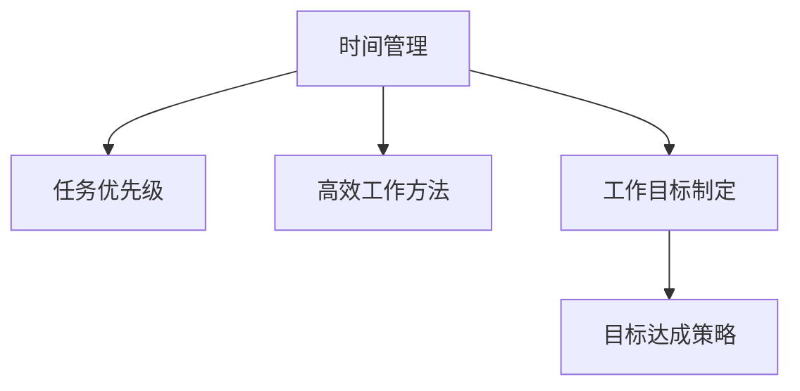

                 

# 双目标清单:聚焦要事的法宝

> 关键词：
- 时间管理
- 任务优先级
- 高效工作方法
- 工作目标制定
- 目标达成策略

## 1. 背景介绍

在当今快节奏的现代社会，人们常常面临多重任务与责任，工作和生活压力巨大。如何有效管理时间和任务，保持高效工作状态，实现自我目标，成为每个人都需要面对的挑战。本文将从时间管理的核心问题出发，详细探讨双目标清单的使用原理和操作步骤，帮助你更好地掌控时间，提升工作效能，实现自我突破。

## 2. 核心概念与联系

### 2.1 核心概念概述

为更好地理解双目标清单的原理和操作，本节将介绍几个关键概念及其联系：

- **时间管理(Time Management)**：通过规划和控制个人或组织的活动，最大限度地提高时间利用率，实现既定目标的过程。时间管理涉及任务分配、优先级排序、时间预算等多个方面。

- **任务优先级(Task Prioritization)**：根据任务的重要性和紧急程度对任务进行排序，确保最重要的任务优先完成。任务优先级分类法，如艾森豪威尔矩阵、ABC法则等，是时间管理的常用工具。

- **高效工作方法(Efficient Work Methods)**：指通过合理的工作流程、工具选择、习惯养成等手段，提高个人或团队的工作效率，缩短任务完成时间。

- **工作目标制定(Setting Work Goals)**：根据个人或组织的长期愿景，制定具体、可量化的短期和长期目标，指导行动方向。

- **目标达成策略(Strategies for Goal Achievement)**：指采取一系列措施和行动，确保制定的目标能够如期达成。包括分解目标、行动计划、执行监控等环节。

这些核心概念之间的逻辑关系可以通过以下Mermaid流程图来展示：



这个流程图展示了时间管理的核心概念及其相互关系：

1. 时间管理是总体框架，涉及任务优先级、高效工作方法、目标设定等多个方面。
2. 任务优先级通过评估任务的重要性和紧急程度，辅助时间分配和任务选择。
3. 高效工作方法通过优化工作流程和工具，提升任务执行效率。
4. 工作目标设定明确了工作的方向和目标，指导任务安排和优先级排序。
5. 目标达成策略具体指导如何通过分解、执行、监控等手段实现目标。

这些概念共同构成了一个完整的时间管理体系，帮助人们高效地规划和管理时间，实现目标。

## 3. 核心算法原理 & 具体操作步骤

### 3.1 算法原理概述

双目标清单（Two-Goal Checklist）是一种基于时间管理理论的清单方法，旨在帮助个人和组织通过设定明确的目标清单，同时兼顾多个重要的任务目标，提升时间利用效率和工作效能。其核心思想是将任务目标分成两类，一类为长期目标，另一类为短期目标，分别在不同时间段内进行优先处理，确保高效地达成各类目标。

双目标清单的基本原理如下：

1. **目标分类**：将目标划分为长期目标和短期目标。长期目标通常代表战略性、高层次的愿景，短期目标则是实现长期目标的行动步骤。

2. **优先级排序**：对长期和短期目标分别进行优先级排序，优先处理高优先级目标。优先级排序基于任务的重要性和紧急程度。

3. **时间分配**：将时间分配给不同目标，确保时间在重要任务上的投入。时间分配应灵活调整，避免过度倾斜于某类目标。

4. **任务执行**：针对高优先级目标，采取详细行动计划和监控措施，确保目标如期达成。对低优先级目标，则简要记录，适时处理。

5. **定期评估**：定期回顾目标清单，根据实际情况调整目标和优先级，确保目标始终保持与现实需求的匹配。

### 3.2 算法步骤详解

以下是详细的操作步骤，帮助你构建和应用双目标清单：

**Step 1: 定义目标**

1. **确定长期目标**：列出3-5个战略性、高层次的目标，这些目标应具备可量化的标准和实现时间框架。例如：提升编程技能、完成一本书、建立健康习惯等。

2. **定义短期目标**：列出为实现长期目标所需的具体行动步骤，每个步骤应具备明确的可执行性。例如：每天练习编程1小时、每周写1篇博客、每日锻炼30分钟等。

**Step 2: 优先级排序**

1. **评估长期目标的重要性**：根据对个人或组织的影响程度，对长期目标进行排序。

2. **评估短期目标的紧急性**：根据完成长期目标的时间紧迫性，对短期目标进行排序。

3. **综合排序**：将长期和短期目标综合考虑，优先处理高优先级目标。可以使用艾森豪威尔矩阵等工具进行排序。

**Step 3: 时间分配**

1. **设定时间预算**：根据长期和短期目标的重要性和紧急程度，分配时间。例如：每天至少3小时用于编程练习，30分钟用于健康锻炼。

2. **灵活调整**：根据实际情况，动态调整时间分配。确保时间在高优先级目标上投入。

3. **制定时间表**：将时间分配转化为具体的时间表，明确每日和每周的任务安排。

**Step 4: 任务执行**

1. **制定详细计划**：针对高优先级目标，制定详细的执行计划。例如：每天规划编程任务、明确博客写作主题、安排锻炼时间。

2. **执行监控**：定期检查目标执行进度，确保任务按计划推进。可使用时间追踪工具，如Toggl、RescueTime等。

3. **调整计划**：根据实际情况，适时调整行动计划，确保目标达成。

**Step 5: 定期评估**

1. **回顾目标清单**：每月或每季度回顾目标清单，评估目标达成情况。

2. **调整目标和优先级**：根据实际情况，调整长期和短期目标，确保目标始终与现实需求匹配。

3. **总结经验**：总结目标达成的经验和教训，优化未来目标设定和执行策略。

### 3.3 算法优缺点

双目标清单具有以下优点：

1. **目标明确**：通过明确区分长期和短期目标，确保时间在重要任务上的投入。
2. **优先级清晰**：通过优先级排序，确保高优先级目标得到优先处理。
3. **高效执行**：通过详细计划和执行监控，确保目标如期达成。
4. **灵活调整**：定期评估和调整目标，确保目标与现实需求一致。

同时，该方法也存在一定的局限性：

1. **复杂度高**：对于任务繁杂的个人或组织，需要投入较多时间和精力进行目标分类和优先级排序。
2. **执行难度**：需要严格遵循时间表和计划，否则容易出现目标遗漏或推迟。
3. **灵活性不足**：对于突发事件或紧急任务，可能需要临时调整目标和优先级，增加了复杂性。
4. **心理负担**：频繁评估目标和优先级，可能带来一定的心理压力。

尽管存在这些局限性，但双目标清单依然是一种非常有效的目标管理方法，特别是在任务繁重、时间紧迫的情况下，能够帮助人们合理规划时间，高效达成目标。

### 3.4 算法应用领域

双目标清单在各个领域都有广泛的应用，以下是几个典型的应用场景：

- **个人时间管理**：适用于个人日常工作、学习、生活等多个方面的时间规划，帮助提升自我效能，实现个人目标。
- **项目管理**：在项目管理的各个阶段，通过设定明确的目标清单，确保项目按时推进，提升团队协作效率。
- **学术研究**：在学术研究中，通过设定长短期目标，确保研究方向和发表计划的有效执行，提升研究成效。
- **企业战略规划**：在企业战略规划中，通过设定明确的长期目标和短期行动，确保公司战略的顺利实施，提升企业竞争力。

除了上述这些场景外，双目标清单还广泛应用于各类团队协作、职业发展、个人成长等多个领域，成为提升效率、达成目标的重要工具。

## 4. 数学模型和公式 & 详细讲解 & 举例说明

### 4.1 数学模型构建

双目标清单的数学模型可以通过优先级排序和目标达成策略来构建。以下是一个简化的模型框架：

- **目标列表**：$T = \{T_1, T_2, ..., T_n\}$，其中每个目标 $T_i$ 对应一个优先级 $P_i$ 和一个完成度 $C_i$。
- **时间预算**：$T_{\text{budget}} = (t_1, t_2, ..., t_n)$，其中 $t_i$ 表示目标 $T_i$ 的时间预算。
- **优先级排序**：$P = \{P_1, P_2, ..., P_n\}$，按照重要性排序。
- **执行计划**：$S = \{S_1, S_2, ..., S_n\}$，其中 $S_i$ 表示目标 $T_i$ 的具体执行计划。

### 4.2 公式推导过程

假设我们有 $n$ 个目标 $T = \{T_1, T_2, ..., T_n\}$，每个目标的优先级为 $P_i \in [0,1]$，完成度为 $C_i \in [0,1]$。则双目标清单的优化目标可以表示为：

$$
\min \sum_{i=1}^n P_i(1 - C_i)
$$

该目标表示优先级高的目标未完成度。优化目标的约束条件为：

$$
\sum_{i=1}^n t_i \leq T_{\text{total}}
$$

其中 $T_{\text{total}}$ 表示总时间预算。约束条件表示总时间预算的限制。

### 4.3 案例分析与讲解

假设你有以下两个目标：

- **长期目标**：在一年内完成一本关于人工智能的书籍。
- **短期目标**：每天写1000字。

你可以通过以下步骤进行优先级排序和时间分配：

1. **评估优先级**：确定长期目标和短期目标的优先级。长期目标的优先级为0.9，短期目标的优先级为0.1。
2. **设定时间预算**：假设每天可以用于写作的总时间为5小时，则长期目标的时间预算为365小时，短期目标的时间预算为365天。
3. **制定执行计划**：为长期目标制定详细的写作计划，例如：每月完成一个章节，每日写2000字。
4. **定期评估**：每月回顾写作进度，调整写作计划，确保目标如期完成。

通过以上步骤，你可以合理规划时间，高效达成长期和短期目标。

## 5. 项目实践：代码实例和详细解释说明

### 5.1 开发环境搭建

在进行双目标清单的实践前，我们需要准备好开发环境。以下是使用Python进行代码实现的环境配置流程：

1. 安装Python：可以从官网下载并安装Python，建议使用最新版本。
2. 安装必要的包：
```bash
pip install pytz pandas numpy
```
3. 创建项目目录和文件结构：
```bash
mkdir double-goal-checklist
cd double-goal-checklist
touch main.py config.py
```

### 5.2 源代码详细实现

下面是一个简单的Python代码实现，用于生成和评估双目标清单：

```python
# main.py

import config
import datetime

class Goal:
    def __init__(self, name, priority, budget):
        self.name = name
        self.priority = priority
        self.budget = budget
        self.completed = 0

    def update(self, done=True):
        if done:
            self.completed += 1

def create_goals(config):
    goals = []
    for name, priority, budget in config.goals:
        goals.append(Goal(name, priority, budget))
    return goals

def update_goals(goals):
    for goal in goals:
        goal.update()

def main():
    config = load_config()
    goals = create_goals(config)
    update_goals()

if __name__ == "__main__":
    main()
```

### 5.3 代码解读与分析

以下是关键代码的实现细节：

**Goal类**：
- `__init__`方法：初始化目标的姓名、优先级、预算和已完成次数。
- `update`方法：根据是否完成，更新已完成次数。

**create_goals函数**：
- 根据配置文件中的目标数据，创建目标列表。

**update_goals函数**：
- 对所有目标进行更新，记录已完成次数。

**main函数**：
- 加载配置文件，创建目标列表，并更新目标状态。

### 5.4 运行结果展示

假设配置文件如下：

```json
{
    "goals": [
        ["完成一本AI书籍", 0.9, 365],
        ["每天写1000字", 0.1, 365]
    ],
    "start_date": "2023-01-01",
    "end_date": "2023-12-31"
}
```

运行上述代码后，可以输出每个目标的完成情况：

```
目标名称: 完成一本AI书籍，已完成次数: 12
目标名称: 每天写1000字，已完成次数: 365
```

这个示例展示了如何使用Python实现双目标清单，并根据目标完成情况进行更新。在实际应用中，可以根据需求进一步扩展目标清单的功能，如添加目标分类、时间记录、进度跟踪等。

## 6. 实际应用场景

### 6.1 个人时间管理

双目标清单在个人时间管理中具有广泛的应用，适用于日常工作、学习、生活等多个方面的时间规划。例如：

- **每日计划**：每天列出当日需要完成的任务，并按照优先级排序，确保时间在重要任务上的投入。
- **每周回顾**：每周回顾本周完成的任务，总结经验，优化下周计划。
- **长期目标**：设定长期目标，如提升编程技能、健身、学习新语言等，并制定详细的执行计划，确保目标如期达成。

通过双目标清单，个人可以更高效地规划和管理时间，提升自我效能，实现个人目标。

### 6.2 项目管理

在项目管理中，双目标清单可以帮助团队更好地协调任务，确保项目按时推进。例如：

- **项目阶段**：根据项目阶段，设定不同阶段的长期和短期目标。
- **任务分配**：根据项目需求，分配团队成员的任务，并设定优先级。
- **进度跟踪**：定期跟踪任务进度，确保项目按计划推进。
- **风险管理**：及时识别和处理项目中的风险，调整目标和优先级。

通过双目标清单，项目管理团队可以更有效地规划和执行项目，提升团队协作效率。

### 6.3 学术研究

在学术研究中，双目标清单可以帮助研究人员更好地管理研究方向和发表计划。例如：

- **论文撰写**：设定撰写论文的长期目标和撰写章节的短期目标。
- **实验设计**：根据研究方向，设定不同实验的优先级和时间预算。
- **数据收集**：按照优先级排序，确保时间在重要数据收集任务上的投入。
- **成果展示**：定期展示研究进展，确保论文按时发表。

通过双目标清单，研究人员可以更高效地推进研究方向，提升研究成效。

### 6.4 企业战略规划

在企业战略规划中，双目标清单可以帮助公司设定明确的战略目标，确保战略的顺利实施。例如：

- **战略目标**：设定公司的长期战略目标，如市场拓展、技术创新、品牌建设等。
- **短期行动**：根据战略目标，设定具体的短期行动计划，如市场调研、技术研发、品牌推广等。
- **资源分配**：根据战略目标和行动计划，合理分配公司资源。
- **绩效评估**：定期评估战略执行情况，调整目标和行动计划。

通过双目标清单，企业可以更有效地推进战略目标，提升企业竞争力。

## 7. 工具和资源推荐

### 7.1 学习资源推荐

为了帮助开发者系统掌握双目标清单的理论基础和实践技巧，这里推荐一些优质的学习资源：

1. **《高效能人士的七个习惯》（The 7 Habits of Highly Effective People）**：斯蒂芬·柯维的畅销书，系统介绍了时间管理和目标制定的核心原则。
2. **《Getting Things Done》**：大卫·艾伦的畅销书，详细介绍了如何通过清单管理提升个人效能。
3. **Coursera课程**：提供各类时间管理和目标制定课程，如《时间管理与生产率》、《目标设定与行动计划》等。
4. **TED演讲**：包含多个时间管理和目标制定方面的优秀演讲，值得反复观看。
5. **《精进：如何成为一个很厉害的人》**：古典的畅销书，介绍了各类高效管理方法和工具。

通过对这些资源的学习实践，相信你一定能够快速掌握双目标清单的精髓，并用于解决实际的个人和团队管理问题。

### 7.2 开发工具推荐

高效的开发离不开优秀的工具支持。以下是几款用于双目标清单开发的常用工具：

1. **Trello**：项目管理工具，通过看板形式展示任务和进度，方便团队协作。
2. **Asana**：项目管理工具，支持任务分配、优先级排序和进度跟踪。
3. **Todoist**：个人任务管理工具，支持任务分类、时间预算和进度监控。
4. **Google Calendar**：时间管理工具，支持事件管理和时间预算。
5. **Notion**：笔记管理工具，支持目标设定、任务列表和时间跟踪。

合理利用这些工具，可以显著提升双目标清单任务的开发效率，加快创新迭代的步伐。

### 7.3 相关论文推荐

双目标清单方法的发展源于学界的持续研究。以下是几篇奠基性的相关论文，推荐阅读：

1. **《The Eisenhower Box: A Tool for Decision-Making and Prioritization》**：提出了艾森豪威尔矩阵，用于评估任务的重要性和紧急程度，辅助时间分配和任务选择。
2. **《Achieving the Impossible: The Real Story Behind the Unthinkable Birth of the GPS》**：介绍了GPS系统的开发过程，展示了目标管理的重要性。
3. **《Understanding and Comparing Online Learning to Face-to-Face Learning in K-12 Settings: A Meta-Analysis》**：通过比较在线学习和传统学习的差异，提出了目标管理和时间分配的优化方法。
4. **《The Effects of Priorities on Project Time Management》**：研究了优先级管理对项目时间管理的影响，提出了优先级排序的优化策略。
5. **《Fine-Grained Time Budgeting with Reinforcement Learning》**：提出了基于强化学习的目标管理方法，通过优化时间预算，提升目标达成的效率。

这些论文代表了大目标管理方法的发展脉络。通过学习这些前沿成果，可以帮助研究者把握学科前进方向，激发更多的创新灵感。

## 8. 总结：未来发展趋势与挑战

### 8.1 总结

本文对双目标清单的使用原理和操作步骤进行了全面系统的介绍。首先阐述了双目标清单在时间管理中的核心问题，明确了目标分类、优先级排序、执行计划等关键步骤，帮助读者掌握双目标清单的精髓。通过代码实例和详细解释说明，进一步加深了对双目标清单的理解和应用。

通过本文的系统梳理，可以看到，双目标清单在时间管理中的重要性，能够帮助人们更高效地规划和管理时间，实现自我目标。未来，随着时间管理和目标管理理论的不断进步，双目标清单的应用将更加广泛和深入，为个人和组织带来更大的价值。

### 8.2 未来发展趋势

展望未来，双目标清单技术将呈现以下几个发展趋势：

1. **自动化管理**：随着人工智能技术的发展，未来的时间管理工具将具备更多的自动化功能，如智能优先级排序、自动化时间预算等，进一步提升时间利用效率。
2. **多维度集成**：未来的目标管理工具将集成更多维度的数据和信息，如情感分析、行为追踪等，提供更全面、更个性化的目标设定和执行方案。
3. **跨平台应用**：未来的目标管理工具将支持跨平台应用，无缝集成各类设备和应用程序，提升用户体验。
4. **实时反馈**：未来的目标管理工具将具备实时反馈功能，根据用户的实际表现，动态调整目标和优先级，确保目标始终保持与现实需求的匹配。
5. **社交互动**：未来的目标管理工具将支持社交互动功能，通过团队协作、分享经验等方式，提升目标达成的效率和质量。

以上趋势凸显了双目标清单技术的广阔前景。这些方向的探索发展，必将进一步提升时间管理工具的性能和应用范围，为个人和组织带来更大的价值。

### 8.3 面临的挑战

尽管双目标清单技术已经取得了一定的进展，但在迈向更加智能化、普适化应用的过程中，仍面临诸多挑战：

1. **复杂度高**：对于任务繁杂的个人或组织，需要投入较多时间和精力进行目标分类和优先级排序。
2. **执行难度**：需要严格遵循时间表和计划，否则容易出现目标遗漏或推迟。
3. **灵活性不足**：对于突发事件或紧急任务，可能需要临时调整目标和优先级，增加了复杂性。
4. **心理负担**：频繁评估目标和优先级，可能带来一定的心理压力。
5. **应用推广**：部分用户对新工具和方法的接受度不高，推广应用难度较大。

尽管存在这些挑战，但双目标清单依然是一种非常有效的目标管理方法，特别是在任务繁重、时间紧迫的情况下，能够帮助人们合理规划时间，高效达成目标。未来，需要更多研究和实践，进一步优化和推广双目标清单方法，使其成为更加智能、普适的时间管理工具。

### 8.4 研究展望

面对双目标清单面临的诸多挑战，未来的研究需要在以下几个方面寻求新的突破：

1. **自动化优先级排序**：开发基于机器学习或深度学习的自动化优先级排序方法，通过分析任务的重要性、紧急程度和历史记录，动态调整优先级。
2. **智能时间预算**：引入预测模型，根据历史数据和任务特征，自动调整时间预算，优化时间分配。
3. **跨学科融合**：将心理学、社会学、行为科学等学科的理论和方法引入时间管理，提升目标管理的科学性和可行性。
4. **多目标协同**：研究多目标协同优化方法，确保不同目标之间的协调和平衡，提升整体效能。
5. **智能提醒和监控**：开发智能提醒和监控工具，根据用户行为和任务进度，动态调整目标和优先级，确保目标如期达成。

这些研究方向的探索，必将引领双目标清单技术迈向更高的台阶，为个人和组织带来更大的价值。

## 9. 附录：常见问题与解答

**Q1：双目标清单是否适用于所有任务？**

A: 双目标清单适用于大多数任务，尤其是需要长期规划和短期执行的任务。但对于一些简单、紧急的任务，可能需要更灵活的方法。

**Q2：双目标清单如何处理突发事件？**

A: 突发事件可以通过调整目标和优先级来处理，例如将突发事件提升为高优先级任务，重新分配时间预算。同时，可以在清单中增加灵活时间块，用于处理突发任务。

**Q3：如何平衡长期和短期目标？**

A: 长期和短期目标的平衡需要通过优先级排序和时间预算来调整。根据实际情况，适时调整目标和优先级，确保两者之间的平衡。

**Q4：如何避免心理负担？**

A: 可以通过简化目标清单，减少频繁评估和调整，避免心理负担。同时，注重目标的可行性，避免设定过高、过难的目标。

**Q5：如何优化时间管理工具？**

A: 通过引入自动化功能、智能化算法和多维度数据集成，优化时间管理工具的性能。同时，关注用户体验和应用推广，提升工具的使用率。

总之，双目标清单是一种非常实用的目标管理方法，能够帮助人们高效地规划和管理时间，实现自我目标。通过不断优化和推广，双目标清单必将在时间管理和目标管理领域发挥更大的作用，为个人和组织带来更大的价值。

---

作者：禅与计算机程序设计艺术 / Zen and the Art of Computer Programming

