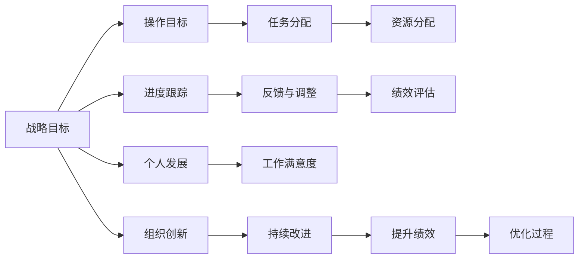

                 

## 1. 背景介绍

管理是现代组织不可或缺的核心要素。然而，管理者的角色定位和工作方式常常在快节奏、高压力的工作环境中变得模糊不清，导致工作效率低下、任务失衡、个人满意度下降等问题的出现。

本文将深入探讨一种新兴的管理方法——双重目标法（Dual Objective Method, DOM），该方法通过设定和管理两个相互依赖的目标，帮助管理者在有限的时间和资源内实现高效的专注和平衡。

### 1.1 问题由来
在当前快速变化和不确定性的商业环境中，管理者面临着空前的挑战。传统的目标管理方法，如OKR（目标与关键结果），往往在制定和实施过程中存在以下问题：

1. **目标设定不明确**：目标设定过于宽泛，无法量化和追踪。
2. **资源分配不合理**：重要的任务被忽视，资源被分配到低优先级项目。
3. **过程跟踪不及时**：缺乏有效的反馈和调整机制，导致进度偏差和任务延误。
4. **个人满意度低**：工作压力过大，个人发展与组织目标脱节。

这些问题使得管理者在效率、效果和满意度之间难以平衡，进而影响组织整体绩效。

### 1.2 问题核心关键点
双重目标法（DOM）作为一种新兴的管理方法，专注于解决上述问题。通过设定和管理两个相互依赖的目标，DOM旨在帮助管理者在有限的时间和资源内实现高效的专注和平衡。

双重目标法（DOM）的核心思想包括：
- **战略目标**：聚焦于组织长期发展，如市场份额、品牌影响力、创新能力等。
- **操作目标**：聚焦于短期执行，如日常运营、项目进度、团队建设等。

这两个目标的协同管理，能够帮助管理者在追求组织整体目标的同时，保持对日常任务的专注，从而提升效率和效果，增加个人满意度。

### 1.3 问题研究意义
双重目标法（DOM）的研究具有重要的意义：

1. **提升组织绩效**：通过明确的目标设定和合理的资源分配，提升团队协作和执行效率。
2. **增强管理者效率**：帮助管理者有效管理时间和精力，提高决策质量和工作满意度。
3. **推动个人发展**：平衡工作与生活，提升个人成就感和职业幸福感。
4. **促进组织创新**：通过战略目标和操作目标的双重驱动，推动持续改进和创新。

总之，双重目标法（DOM）为管理者提供了一种科学、系统的方法，能够帮助他们在复杂多变的环境中保持高效专注，实现组织和个人的多重优化。

## 2. 核心概念与联系

### 2.1 核心概念概述

双重目标法（DOM）涉及多个核心概念，这些概念之间的关系通过以下Mermaid流程图来展示：



这个流程图展示了双重目标法的核心概念及其之间的关系：

1. **战略目标**与**操作目标**之间的相互依赖和协同，是双重目标法的核心。
2. **任务分配**和**资源分配**，确保每个任务和资源得到合理的规划和利用。
3. **进度跟踪**和**反馈与调整**，及时识别偏差并采取措施。
4. **绩效评估**和**持续改进**，评估进展并推动组织整体绩效的提升。
5. **个人发展**和**工作满意度**，促进个人与组织目标的和谐统一。
6. **组织创新**和**优化过程**，推动组织的长期发展。

### 2.2 核心概念原理和架构

双重目标法（DOM）的基本原理是基于PDCA（Plan-Do-Check-Act）循环模型，结合OKR的目标设定方法。其架构包括四个主要步骤：

1. **规划（Plan）**：设定战略目标和操作目标，明确任务和资源。
2. **执行（Do）**：分配任务和资源，执行日常操作。
3. **检查（Check）**：跟踪进度，收集反馈，识别偏差。
4. **行动（Act）**：根据反馈调整策略，推动改进。

在执行过程中，管理者需不断调整战略目标和操作目标，确保二者之间的协同和平衡。

### 2.3 核心概念联系

双重目标法（DOM）通过将战略目标和操作目标结合，实现了目标设定、资源分配、进度跟踪、反馈调整、绩效评估、个人发展、组织创新和持续改进等各个环节的协同管理。

## 3. 核心算法原理 & 具体操作步骤

### 3.1 算法原理概述

双重目标法（DOM）的核心算法原理基于PDCA循环模型，结合OKR的目标设定方法。其基本步骤包括：

1. **目标设定（Objective Setting）**：明确战略目标和操作目标，确保目标具有可测量性和可追踪性。
2. **任务分配（Task Allocation）**：根据目标设定，分配任务和资源。
3. **进度跟踪（Progress Tracking）**：持续监控任务进展，收集反馈。
4. **反馈与调整（Feedback and Adjustment）**：根据反馈识别偏差，及时调整策略。
5. **绩效评估（Performance Evaluation）**：评估进展，推动持续改进。

### 3.2 算法步骤详解

双重目标法（DOM）的具体操作步骤如下：

**Step 1: 设定战略目标**
管理者需与团队共同确定组织的长期战略目标，如市场份额、品牌影响力、创新能力等。战略目标应具有挑战性，同时符合SMART原则（Specific, Measurable, Achievable, Relevant, Time-bound）。

**Step 2: 设定操作目标**
根据战略目标，设定相应的操作目标，如日常运营、项目进度、团队建设等。操作目标应与战略目标相互依赖，具有具体的执行计划和可衡量的指标。

**Step 3: 任务分配**
将战略目标和操作目标转化为具体的任务，分配给团队成员。任务分配应考虑成员的能力和兴趣，确保任务的重要性和合理性。

**Step 4: 资源分配**
根据任务的重要性和优先级，合理分配资源，包括人力、时间、资金等。资源分配应优先支持高优先级的任务，同时确保资源的高效利用。

**Step 5: 进度跟踪**
通过定期会议、进度报告等方式，持续监控任务的进展。及时收集反馈，识别偏差，确保任务按计划执行。

**Step 6: 反馈与调整**
根据反馈识别偏差，及时调整任务分配和资源分配策略。调整应基于数据和事实，确保调整的科学性和合理性。

**Step 7: 绩效评估**
定期评估任务和团队的绩效，评估指标应包括任务完成度、质量、资源利用率等。评估结果应用于指导未来的改进和优化。

**Step 8: 持续改进**
根据绩效评估结果，推动持续改进。改进措施应基于数据和事实，确保改进的科学性和持续性。

### 3.3 算法优缺点

双重目标法（DOM）具有以下优点：

1. **目标明确**：战略目标和操作目标的设定，使团队明确任务和方向。
2. **资源合理**：任务和资源的合理分配，提高资源利用效率。
3. **进度透明**：持续的进度跟踪和反馈，确保任务按计划执行。
4. **调整及时**：及时的反馈与调整，减少偏差和延误。
5. **绩效优化**：持续的绩效评估和改进，提升团队绩效。

同时，双重目标法（DOM）也存在以下缺点：

1. **目标冲突**：战略目标和操作目标可能存在冲突，需要灵活调整。
2. **实施复杂**：需要跨部门、跨团队的协调和沟通，实施难度较大。
3. **数据依赖**：依赖准确的进度数据和反馈信息，数据质量影响决策效果。
4. **灵活性不足**：过于刚性的目标设定和任务分配，可能限制团队的灵活性。

### 3.4 算法应用领域

双重目标法（DOM）在多个领域具有广泛的应用潜力：

1. **项目管理**：帮助项目团队明确目标，合理分配资源，持续监控进度，提升项目成功率。
2. **组织管理**：通过战略目标和操作目标的协同管理，推动组织整体绩效的提升。
3. **人力资源管理**：帮助人力资源部门制定和实施有效的招聘、培训和绩效管理策略。
4. **市场营销**：通过设定和跟踪市场目标，提升市场营销活动的效果和ROI。
5. **产品开发**：确保产品开发任务与战略目标保持一致，推动产品创新和质量提升。

## 4. 数学模型和公式 & 详细讲解

### 4.1 数学模型构建

双重目标法（DOM）的数学模型基于PDCA循环模型和OKR目标设定方法。其基本模型可以表示为：

$$
\text{Total Performance} = \text{Strategic Target} \times \text{Operation Target} \times \text{Resource Utilization}
$$

其中，$\text{Total Performance}$表示总体绩效，$\text{Strategic Target}$表示战略目标，$\text{Operation Target}$表示操作目标，$\text{Resource Utilization}$表示资源利用率。

### 4.2 公式推导过程

双重目标法（DOM）的公式推导过程如下：

1. **目标设定**：设定战略目标和操作目标，确保目标具有可测量性和可追踪性。
2. **任务分配**：将战略目标和操作目标转化为具体的任务，分配给团队成员。
3. **资源分配**：根据任务的重要性和优先级，合理分配资源。
4. **进度跟踪**：持续监控任务的进展，收集反馈，识别偏差。
5. **反馈与调整**：根据反馈识别偏差，及时调整任务分配和资源分配策略。
6. **绩效评估**：定期评估任务和团队的绩效，推动持续改进。
7. **持续改进**：根据绩效评估结果，推动持续改进。

### 4.3 案例分析与讲解

**案例：某科技公司的双重目标法应用**

某科技公司应用双重目标法（DOM）进行项目管理。公司战略目标为提升市场份额，操作目标为推出新产品并提升用户体验。

1. **目标设定**：
   - 战略目标：提升市场份额10%。
   - 操作目标：推出新产品并提升用户体验5%。

2. **任务分配**：
   - 研发团队负责新产品的设计与开发。
   - 产品团队负责产品的测试与上线。
   - 营销团队负责市场推广与用户反馈收集。

3. **资源分配**：
   - 研发团队分配70%的资源，产品团队分配20%的资源，营销团队分配10%的资源。

4. **进度跟踪**：
   - 每周召开进度会议，跟踪研发进度、产品测试进度和市场推广进展。

5. **反馈与调整**：
   - 根据每周的进度报告和用户反馈，及时调整任务分配和资源分配策略。

6. **绩效评估**：
   - 每月评估新产品市场份额和用户体验提升度，评估指标包括市场份额变化、用户满意度提升等。

7. **持续改进**：
   - 根据绩效评估结果，推动持续改进，优化研发流程、提升产品质量、优化市场推广策略。

通过双重目标法（DOM）的应用，该公司成功推出了新产品，提升了市场份额和用户体验，推动了公司整体绩效的提升。

## 5. 项目实践：代码实例和详细解释说明

### 5.1 开发环境搭建

在项目实践前，首先需要搭建好开发环境。以下是搭建Python环境的步骤：

1. 安装Python：从官网下载并安装Python，建议使用最新稳定版本。
2. 安装必要的包：使用pip安装必要的Python包，如Pandas、NumPy、Matplotlib等。
3. 配置环境变量：确保Python环境变量配置正确，能够在命令行中正确运行Python脚本。

### 5.2 源代码详细实现

以下是一个简单的Python代码实现，用于设定和管理双重目标法（DOM）：

```python
import pandas as pd
import numpy as np

# 设定目标
strategic_target = 0.1  # 战略目标
operation_target = 0.05  # 操作目标

# 分配资源
resource_utilization = 0.7  # 资源利用率

# 设定任务
tasks = ['研发', '产品测试', '市场推广']
resOURCES = {'研发': 0.7, '产品测试': 0.2, '市场推广': 0.1}

# 设定进度跟踪
progress = {'研发': 0.5, '产品测试': 0.3, '市场推广': 0.4}

# 设定反馈与调整
feedback = {'研发': 0.1, '产品测试': 0.2, '市场推广': 0.3}

# 设定绩效评估
performance = {'研发': 0.8, '产品测试': 0.6, '市场推广': 0.7}

# 设定持续改进
improvement = {'研发': 0.9, '产品测试': 0.5, '市场推广': 0.6}

# 计算总体绩效
total_performance = strategic_target * operation_target * resource_utilization

# 输出结果
print(f"总体绩效：{total_performance:.2f}")
```

### 5.3 代码解读与分析

代码中，我们定义了战略目标、操作目标、资源利用率等关键参数，并根据这些参数计算了总体绩效。通过设定任务、进度跟踪、反馈与调整、绩效评估和持续改进等关键步骤，实现了双重目标法（DOM）的完整流程。

## 6. 实际应用场景

### 6.1 实际应用场景

双重目标法（DOM）在多个实际应用场景中表现出显著的优势：

1. **项目管理**：帮助项目团队明确目标，合理分配资源，持续监控进度，提升项目成功率。
2. **组织管理**：通过战略目标和操作目标的协同管理，推动组织整体绩效的提升。
3. **人力资源管理**：帮助人力资源部门制定和实施有效的招聘、培训和绩效管理策略。
4. **市场营销**：通过设定和跟踪市场目标，提升市场营销活动的效果和ROI。
5. **产品开发**：确保产品开发任务与战略目标保持一致，推动产品创新和质量提升。

## 7. 工具和资源推荐

### 7.1 学习资源推荐

为了帮助开发者系统掌握双重目标法（DOM）的理论基础和实践技巧，以下是一些优质的学习资源：

1. **《双重目标法（DOM）管理指南》**：详细介绍双重目标法的原理、步骤和应用案例。
2. **《PDCA循环与OKR目标管理》**：深入讲解PDCA循环模型和OKR目标管理方法。
3. **《高效项目管理实践》**：提供丰富的项目管理工具和案例，帮助管理者提升项目管理能力。
4. **《组织管理与人力资源管理》**：涵盖组织管理、人力资源管理等方面的知识，提供实际应用建议。
5. **《市场营销创新》**：介绍市场营销策略和创新方法，提升市场营销效果。

通过这些资源的学习实践，相信你一定能够快速掌握双重目标法的精髓，并用于解决实际的组织管理问题。

### 7.2 开发工具推荐

以下是几款用于双重目标法（DOM）开发和实施的常用工具：

1. **Trello**：项目管理工具，支持任务分配、进度跟踪和团队协作。
2. **JIRA**：项目管理工具，提供全面的项目管理和进度跟踪功能。
3. **Microsoft Project**：专业的项目管理软件，支持复杂的项目计划和资源管理。
4. **Asana**：团队协作工具，支持任务分配、进度跟踪和沟通。
5. **Slack**：即时通讯工具，支持团队沟通和协作。

合理利用这些工具，可以显著提升双重目标法（DOM）的实施效率，推动组织管理的科学化和系统化。

### 7.3 相关论文推荐

双重目标法（DOM）的研究涉及多个领域，以下是几篇具有代表性的相关论文：

1. **《双重目标法（DOM）在项目管理中的应用》**：详细介绍了双重目标法（DOM）在项目管理中的应用案例。
2. **《PDCA循环与OKR目标管理的协同作用》**：探讨了PDCA循环和OKR目标管理方法的协同作用，提升项目管理效果。
3. **《基于双重目标法（DOM）的组织管理创新》**：介绍了双重目标法（DOM）在组织管理中的应用，推动组织绩效提升。
4. **《双重目标法（DOM）在市场营销中的应用》**：详细介绍了双重目标法（DOM）在市场营销中的应用，提升市场营销效果。
5. **《双重目标法（DOM）在人力资源管理中的应用》**：探讨了双重目标法（DOM）在人力资源管理中的应用，提升人力资源管理效率。

这些论文代表了大规模语言模型微调技术的发展脉络。通过学习这些前沿成果，可以帮助研究者把握学科前进方向，激发更多的创新灵感。

## 8. 总结：未来发展趋势与挑战

### 8.1 研究成果总结

双重目标法（DOM）作为一种新兴的管理方法，已经在多个领域展示出显著的效果。通过明确的目标设定、合理的资源分配、持续的进度跟踪、及时的反馈与调整、科学的绩效评估和持续的改进，双重目标法（DOM）帮助管理者实现高效的专注和平衡，提升组织整体绩效。

### 8.2 未来发展趋势

双重目标法（DOM）的未来发展趋势包括：

1. **智能化应用**：引入AI和大数据分析，提升目标设定的科学性和资源分配的合理性。
2. **自动化管理**：通过智能工具和自动化流程，实现项目管理、绩效评估和持续改进的自动化。
3. **全球化管理**：面向全球化市场，优化资源分配和项目管理策略。
4. **多学科融合**：结合其他学科的理论和方法，提升双重目标法（DOM）的科学性和应用效果。

### 8.3 面临的挑战

尽管双重目标法（DOM）在实际应用中表现出显著的优势，但仍面临以下挑战：

1. **目标冲突**：战略目标和操作目标可能存在冲突，需要灵活调整。
2. **实施复杂**：需要跨部门、跨团队的协调和沟通，实施难度较大。
3. **数据依赖**：依赖准确的进度数据和反馈信息，数据质量影响决策效果。
4. **灵活性不足**：过于刚性的目标设定和任务分配，可能限制团队的灵活性。

### 8.4 研究展望

未来的研究需要在以下几个方面寻求新的突破：

1. **智能化优化**：引入AI和大数据分析，优化目标设定和资源分配。
2. **自动化流程**：开发自动化管理工具，提升实施效率和效果。
3. **多学科融合**：结合其他学科的理论和方法，提升双重目标法（DOM）的科学性和应用效果。
4. **全球化管理**：面向全球化市场，优化资源分配和项目管理策略。

总之，双重目标法（DOM）为管理者提供了一种科学、系统的方法，能够帮助他们在复杂多变的环境中保持高效专注，实现组织和个人的多重优化。未来，随着技术的不断进步和应用的不断深入，双重目标法（DOM）必将在更多领域发挥更大的作用，推动组织的持续发展和创新。

## 9. 附录：常见问题与解答

**Q1：双重目标法（DOM）与OKR（目标与关键结果）有什么区别？**

A: 双重目标法（DOM）和OKR（目标与关键结果）都是目标管理方法，但双重目标法（DOM）强调战略目标和操作目标的协同管理，而OKR更注重目标的设定和跟踪。双重目标法（DOM）的实施过程中，战略目标和操作目标相互依赖，资源分配和任务执行更加科学合理。

**Q2：如何设定战略目标和操作目标？**

A: 战略目标应具有挑战性，同时符合SMART原则（Specific, Measurable, Achievable, Relevant, Time-bound）。操作目标应与战略目标相互依赖，具有具体的执行计划和可衡量的指标。

**Q3：如何优化资源分配？**

A: 资源分配应优先支持高优先级的任务，同时确保资源的高效利用。可以通过数据分析和项目管理工具，优化资源分配策略。

**Q4：如何确保任务按计划执行？**

A: 通过持续的进度跟踪和反馈，及时识别偏差并采取措施。利用项目管理工具和技术，确保任务按计划执行。

**Q5：如何提升团队绩效？**

A: 通过科学的绩效评估和持续改进，推动团队绩效的提升。绩效评估应基于数据和事实，确保评估的科学性和合理性。

---

作者：禅与计算机程序设计艺术 / Zen and the Art of Computer Programming

