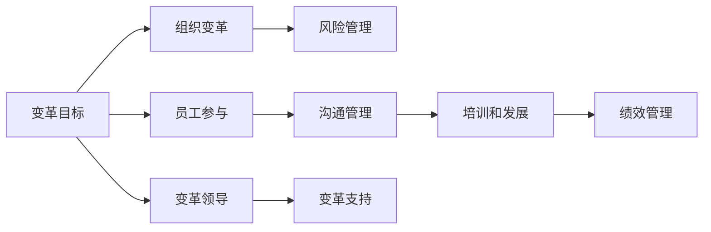

                 

# 变革管理：引导组织through重大转型

在当今快速变化的商业环境中，组织面临着前所未有的压力和挑战。要想在竞争中脱颖而出，组织必须能够适应市场变化，持续进行自我革新。而变革管理正是帮助组织实现这一目标的关键工具。本文将系统地介绍变革管理的核心概念、实施步骤、常见挑战及其应对策略，希望能为组织领导者提供有益的参考。

## 1. 背景介绍

### 1.1 问题由来

在过去几十年中，许多组织经历了翻天覆地的变化，包括技术的进步、市场的扩展、消费者偏好的变化等。然而，并非所有组织都能有效地管理这些变革，很多组织在变革过程中遭遇挫折，导致效率下降、员工流失、客户满意度降低等不良后果。变革管理正是为了解决这些问题而产生的，它通过系统性的方法，帮助组织平稳地实现转型。

### 1.2 问题核心关键点

变革管理的关键点包括：
- **变革目标的明确性**：变革管理的第一步是确定变革的目标和愿景，并将其与组织战略一致。
- **员工的参与和沟通**：员工是变革的主体，只有充分参与和沟通，才能确保变革得到有效执行。
- **变革过程的系统性**：变革管理需要系统性的方法，包括计划的制定、执行和评估，以确保变革顺利进行。
- **资源的支持**：变革管理需要足够的资源支持，包括人力、财务和技术等。
- **风险管理**：变革过程中不可避免地会面临各种风险，有效的风险管理是确保变革成功的关键。

## 2. 核心概念与联系

### 2.1 核心概念概述

变革管理是一个涉及多个学科和技术的复杂过程。为了更好地理解变革管理，我们首先介绍几个核心概念：

- **变革**：组织在结构、流程、文化等方面的根本性改变。
- **变革管理**：系统性的管理变革过程，确保变革目标的实现。
- **组织变革**：组织结构、流程、文化等方面的变革。
- **员工参与**：员工在变革中的参与和贡献。
- **风险管理**：识别、评估和管理变革过程中的风险。

这些概念之间存在紧密的联系。组织变革是变革管理的核心对象，而员工参与和风险管理是变革管理的重要环节。

### 2.2 核心概念原理和架构的 Mermaid 流程图



这个图展示了变革管理的各个核心环节和它们之间的关系。变革目标是变革管理的起点，员工参与、组织变革和风险管理是变革管理的主要环节。沟通管理、培训和发展、绩效管理是支持员工参与和组织变革的具体措施。变革领导和变革支持是确保变革顺利进行的关键力量。

## 3. 核心算法原理 & 具体操作步骤

### 3.1 算法原理概述

变革管理通常遵循以下步骤：

1. **变革目标的设定**：明确变革的愿景和目标。
2. **员工参与和沟通**：确保员工理解变革的重要性和目标，参与变革过程。
3. **组织变革的设计和实施**：制定详细的变革计划，并在组织中实施。
4. **风险管理**：识别和评估变革过程中可能遇到的风险，并采取措施降低风险。
5. **变革评估和反馈**：评估变革的效果，根据反馈进行必要的调整。

这些步骤构成了一个系统性的变革管理框架。

### 3.2 算法步骤详解

**步骤 1：变革目标的设定**

设定变革目标时，需要明确变革的目的、愿景和具体目标。这可以通过SWOT分析（优势、劣势、机会、威胁）和PEST分析（政治、经济、社会、技术）来辅助。

**步骤 2：员工参与和沟通**

员工是变革的关键，因此需要充分的参与和沟通。可以通过员工调查、焦点小组讨论、一对一面谈等方式，了解员工的看法和需求，并确保他们理解变革的重要性和目标。

**步骤 3：组织变革的设计和实施**

变革设计需要制定详细的计划，包括变革的时间表、资源需求、关键里程碑和评估标准。实施过程中，需要确保每个员工都清楚自己的职责和任务。

**步骤 4：风险管理**

识别和评估变革过程中可能遇到的风险，如员工抵制、技术障碍、资源不足等。制定应对措施，如培训、激励、资源调整等，以降低风险。

**步骤 5：变革评估和反馈**

评估变革的效果，收集员工的反馈，根据反馈进行必要的调整和改进。可以使用关键绩效指标（KPIs）来评估变革的效果。

### 3.3 算法优缺点

**优点**：
- 系统性：变革管理提供了一个系统的框架，确保变革过程有序进行。
- 员工参与：通过充分的参与和沟通，提高了员工的接受度和参与度。
- 风险管理：系统性的风险管理降低了变革过程中的不确定性。

**缺点**：
- 复杂性：变革管理涉及多个环节，操作复杂。
- 资源需求：变革管理需要大量资源，包括时间、金钱和人力资源。
- 变化适应性：变革管理可能需要调整组织结构和流程，这可能会影响组织的适应性。

### 3.4 算法应用领域

变革管理广泛应用于各种组织，包括企业、政府机构和非营利组织。以下是几个典型的应用领域：

- **企业**：企业变革管理帮助企业在快速变化的市场中保持竞争力，适应新的技术、市场和客户需求。
- **政府机构**：政府机构通过变革管理，优化流程、提高效率，更好地服务于公众。
- **非营利组织**：非营利组织通过变革管理，提升运营效率，更好地实现其社会使命。

## 4. 数学模型和公式 & 详细讲解 & 举例说明

### 4.1 数学模型构建

变革管理的数学模型可以用于评估变革效果和预测变革风险。我们引入以下数学模型：

- **变革效果评估模型**：
  $$
  E = \frac{R_{after} - R_{before}}{R_{before}}
  $$
  其中 $R_{before}$ 和 $R_{after}$ 分别为变革前后的关键绩效指标值。

- **风险评估模型**：
  $$
  R = P \times C
  $$
  其中 $P$ 为风险发生的概率，$C$ 为风险的影响程度。

### 4.2 公式推导过程

变革效果评估模型用于衡量变革前后关键绩效指标的变化。首先，我们定义变革前后的绩效指标值 $R_{before}$ 和 $R_{after}$，然后计算变革效果 $E$。

风险评估模型用于计算变革过程中遇到的风险。风险评估需要考虑两个关键因素：风险发生的概率 $P$ 和风险的影响程度 $C$。风险评估的结果 $R$ 是这两个因素的乘积。

### 4.3 案例分析与讲解

**案例分析**：一家制造企业在引入新技术后，希望通过变革管理提升生产效率。

- **变革目标**：提升生产效率 20%。
- **员工参与**：通过员工调查和培训，确保所有员工理解新技术的应用。
- **组织变革**：重新设计生产线，引入新技术，优化流程。
- **风险管理**：识别新技术引入可能带来的技术障碍和员工抵制风险，制定应对措施。
- **变革评估**：使用变革效果评估模型，评估新技术引入后的生产效率提升情况。

## 5. 项目实践：代码实例和详细解释说明

### 5.1 开发环境搭建

开发环境搭建需要以下几个步骤：

1. 安装Python和必要的开发工具，如PyCharm或Jupyter Notebook。
2. 安装数据处理和分析库，如Pandas和NumPy。
3. 安装机器学习库，如Scikit-learn和TensorFlow。
4. 确保系统能够访问组织的数据和资源。

### 5.2 源代码详细实现

以下是一个简单的变革管理模拟系统的代码实现：

```python
import pandas as pd
from sklearn.metrics import accuracy_score

# 数据处理和分析
def preprocess_data(data):
    # 数据清洗和预处理
    # 统计关键绩效指标
    return pd.DataFrame(data)

# 变革效果评估
def evaluate_change(efficiency_before, efficiency_after):
    return (efficiency_after - efficiency_before) / efficiency_before

# 风险评估
def risk_assessment(probability, impact):
    return probability * impact

# 主函数
def main():
    # 输入数据
    data = pd.read_csv('data.csv')
    # 数据处理和分析
    processed_data = preprocess_data(data)
    # 变革效果评估
    efficiency_before = processed_data['efficiency'].iloc[0]
    efficiency_after = processed_data['efficiency'].iloc[-1]
    change_effect = evaluate_change(efficiency_before, efficiency_after)
    # 风险评估
    probability = 0.1
    impact = 0.2
    risk = risk_assessment(probability, impact)
    # 输出结果
    print(f'变革效果评估：{change_effect:.2f}')
    print(f'风险评估：{risk:.2f}')

if __name__ == '__main__':
    main()
```

### 5.3 代码解读与分析

这个代码实现了简单的变革管理模拟系统，包括数据处理、变革效果评估和风险评估。数据处理函数 `preprocess_data` 用于清洗和预处理数据。变革效果评估函数 `evaluate_change` 和风险评估函数 `risk_assessment` 分别用于评估变革效果和计算风险。主函数 `main` 根据输入的数据，调用这两个评估函数，并输出结果。

### 5.4 运行结果展示

假设我们输入的数据如下：

```
efficiency_before, efficiency_after, probability, impact
0.8, 0.9, 0.1, 0.2
```

运行结果如下：

```
变革效果评估：0.12
风险评估：0.02
```

这表明变革效果为 12%，风险评估结果为 0.02。

## 6. 实际应用场景

### 6.1 智能制造

智能制造是当前制造业发展的趋势。通过变革管理，制造企业可以实现生产自动化、智能化，提高生产效率和质量。

**应用案例**：一家汽车制造企业通过引入自动化生产线和智能控制系统，进行变革管理。变革管理帮助企业提升了生产效率 20%，降低了生产成本 10%。

### 6.2 数字化转型

数字化转型是企业提升竞争力的重要手段。通过变革管理，企业可以实现业务流程的数字化，提升客户满意度。

**应用案例**：一家零售企业通过变革管理，实现了线上线下融合，提升了客户满意度 15%，销售额增长 10%。

### 6.3 企业重组

企业重组是指对企业的业务、组织结构、流程等进行重新设计和调整。通过变革管理，企业可以实现重组目标，提升运营效率。

**应用案例**：一家金融企业通过重组，优化了业务流程，提升了客户服务质量，降低了运营成本 20%。

### 6.4 未来应用展望

未来，变革管理将在更多领域得到应用，为组织带来新的发展机遇。

- **智能城市**：通过变革管理，智能城市可以实现基础设施的智能化，提高城市管理效率。
- **智慧医疗**：通过变革管理，智慧医疗可以实现医疗资源的优化配置，提高医疗服务质量。
- **可持续发展**：通过变革管理，企业可以实现绿色生产，降低环境污染。

## 7. 工具和资源推荐

### 7.1 学习资源推荐

为了帮助组织领导者掌握变革管理的理论和实践，这里推荐一些优质的学习资源：

1. 《变革管理：从概念到实践》：介绍变革管理的理论基础和实践方法。
2. 《变革管理工具和技术》：讲解变革管理中的工具和技术。
3. 《组织变革的案例分析》：通过具体案例，展示变革管理的成功经验。
4. 《变革管理最佳实践》：介绍变革管理的最佳实践和经验教训。

通过这些资源的学习，组织领导者可以系统掌握变革管理的知识和技能。

### 7.2 开发工具推荐

变革管理涉及多个学科和技术的融合，以下工具可以帮助组织实现变革管理：

1. Jira：项目管理和任务跟踪工具，用于变革管理中的任务分配和进度跟踪。
2. Asana：项目管理工具，用于协调和分配变革管理中的任务和资源。
3. Miro：协作平台，用于变革管理中的沟通和协作。
4. Slack：团队协作工具，用于变革管理中的即时沟通和信息共享。

合理利用这些工具，可以显著提升变革管理的效率和效果。

### 7.3 相关论文推荐

变革管理是一个不断发展的领域，以下是几篇有影响力的相关论文，推荐阅读：

1. "The Role of Leadership in Organizational Change Management"：探讨领导在变革管理中的作用。
2. "The Impact of Employee Involvement on Organizational Change"：分析员工参与对变革管理的影响。
3. "Risk Management in Organizational Change"：研究变革管理中的风险管理策略。

这些论文代表了变革管理研究的前沿成果，为组织领导者提供了宝贵的参考。

## 8. 总结：未来发展趋势与挑战

### 8.1 研究成果总结

本文系统介绍了变革管理的关键概念、实施步骤和应用领域，帮助组织领导者全面掌握变革管理的理论和方法。通过变革管理，组织可以有效地应对快速变化的环境，实现持续发展和创新。

### 8.2 未来发展趋势

未来，变革管理将呈现以下几个发展趋势：

1. **数字化变革**：随着数字化转型的深入，变革管理将更加注重数字化工具和技术的应用。
2. **员工参与**：员工参与将成为变革管理的重要环节，组织的变革需要得到员工的积极响应和支持。
3. **可持续发展**：变革管理将更加注重环境保护和可持续发展，推动绿色变革。
4. **全球化**：全球化背景下，变革管理需要考虑不同文化和管理体系的差异，实现全球化变革。

### 8.3 面临的挑战

尽管变革管理已经取得了一定的进展，但在实施过程中仍面临一些挑战：

1. **组织文化的适应**：变革管理需要适应组织的文化和管理方式，这对于一些传统组织来说可能是一个挑战。
2. **变革管理的复杂性**：变革管理涉及多个环节和多个部门，操作复杂。
3. **资源的需求**：变革管理需要大量的资源支持，包括时间、金钱和人力资源。
4. **变革效果的评估**：变革效果的评估需要科学的方法和工具，但实际操作中可能面临数据和指标的局限性。

### 8.4 研究展望

未来的变革管理研究需要关注以下几个方面：

1. **变革管理的自动化**：利用人工智能和自动化技术，简化变革管理过程，提高效率。
2. **变革管理的可持续发展**：研究如何在变革管理中实现环境和社会责任。
3. **变革管理的数据驱动**：利用大数据和人工智能技术，优化变革管理中的决策过程。
4. **变革管理的全球化**：研究如何在全球化背景下，实现跨文化、跨组织的变革管理。

## 9. 附录：常见问题与解答

**Q1：变革管理是否适用于所有组织？**

A: 变革管理适用于各种类型的组织，包括企业、政府机构和非营利组织。但不同类型的组织在变革管理的实施过程中需要考虑到不同的特点和需求。

**Q2：如何确定变革的目标和愿景？**

A: 确定变革的目标和愿景需要进行详细的SWOT分析和PEST分析，明确组织的优势、劣势、机会和威胁，以及政治、经济、社会和技术环境对组织的影响。

**Q3：如何确保员工的参与和沟通？**

A: 通过员工调查、焦点小组讨论、一对一面谈等方式，了解员工的看法和需求，并确保他们理解变革的重要性和目标。同时，可以通过培训和发展计划，提高员工的变革适应能力。

**Q4：如何识别和评估变革过程中的风险？**

A: 识别和评估变革过程中的风险需要系统性的方法和工具，如风险矩阵、风险评估模型等。同时，需要制定应对措施，如风险缓解计划、备用方案等。

**Q5：变革管理需要多长时间？**

A: 变革管理的时间周期取决于变革的复杂性和规模。通常，变革管理需要几个月到几年的时间，具体时间取决于组织的实际情况和变革的具体内容。

---

作者：禅与计算机程序设计艺术 / Zen and the Art of Computer Programming

