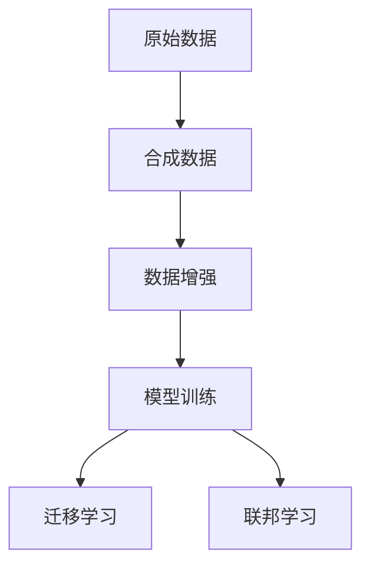

                 

## 1. 背景介绍

在人工智能（AI）时代，数据被认为是驱动AI训练和模型的核心。然而，实际数据往往面临获取难度大、成本高、隐私保护等问题。合成数据（Synthetic Data）作为解决这些问题的一种方式，在AI训练中日益受到重视。合成数据是通过计算机生成的方法模拟真实数据，用于AI模型的训练和测试。本文将系统介绍合成数据在AI训练中的应用场景和面临的挑战。

## 2. 核心概念与联系

### 2.1 核心概念概述

- **合成数据（Synthetic Data）**：指通过计算机生成的数据，与真实数据相似，但无需实际采集，能够有效解决数据获取难、成本高、隐私保护等问题。
- **数据增强（Data Augmentation）**：指对原始数据进行变换和扩充，以增加数据的多样性和数量，提升模型泛化能力。
- **生成对抗网络（Generative Adversarial Networks, GANs）**：由生成器和判别器组成的网络，通过对抗训练，生成逼真的合成数据。
- **迁移学习（Transfer Learning）**：指在一个领域中训练好的模型，迁移到另一个领域中，利用已有知识加速训练过程。
- **联邦学习（Federated Learning）**：分布式学习算法，多个数据源各自训练模型参数，并通过参数交换，达到全局模型优化的目的。

这些概念之间存在紧密联系。合成数据可以为数据增强提供大量高质量的合成数据，同时也可以用于迁移学习和联邦学习中的数据传输，提高模型训练的效率和性能。

### 2.2 Mermaid流程图

以下是一个简单的Mermaid流程图，展示了合成数据在AI训练中的应用：



该图表示了合成数据在生成、数据增强、模型训练、迁移学习和联邦学习中的应用。

## 3. 核心算法原理 & 具体操作步骤

### 3.1 算法原理概述

合成数据在AI训练中的原理是通过生成模型（如GANs）生成与真实数据相似但不完全相同的合成数据。这些合成数据可以被用于数据增强，提高模型的泛化能力，同时也可以用于迁移学习和联邦学习中的数据传输。

### 3.2 算法步骤详解

1. **数据生成**：使用生成模型如GANs生成合成数据。GANs由一个生成器（Generator）和一个判别器（Discriminator）组成。生成器的目标是生成尽可能逼真的合成数据，而判别器的目标是区分真实数据和合成数据。

2. **数据增强**：将生成的合成数据与原始数据进行混合，进行数据增强。数据增强方法包括旋转、翻转、裁剪、噪声添加等，可以增加数据的多样性，提高模型的泛化能力。

3. **模型训练**：使用生成器和判别器训练模型，生成器和判别器通过对抗训练不断优化，直到生成器可以生成高质量的合成数据，判别器无法区分真实数据和合成数据。

4. **迁移学习**：将训练好的模型应用于新的任务中，利用迁移学习加速训练过程。

5. **联邦学习**：多个数据源各自训练模型参数，并通过参数交换，达到全局模型优化的目的。

### 3.3 算法优缺点

**优点**：
- 降低数据获取成本和隐私风险：无需实际采集数据，可以生成高质量的合成数据。
- 增加数据多样性：通过数据增强提高模型泛化能力。
- 加速模型训练：通过迁移学习和联邦学习提高模型性能。

**缺点**：
- 合成数据质量不稳定：生成的数据可能存在偏差，影响模型性能。
- 合成数据与真实数据存在差距：生成的数据可能不完全等同于真实数据。
- 合成数据可能被识破：判别器可能识别出生成的合成数据，影响模型的安全性。

### 3.4 算法应用领域

合成数据在AI训练中的应用领域包括：
- **医疗领域**：生成合成影像和诊断报告，用于模型训练和测试。
- **自动驾驶**：生成合成驾驶数据，用于模型训练和模拟测试。
- **自然语言处理**：生成合成文本数据，用于语言模型训练和对话系统开发。
- **金融领域**：生成合成交易数据，用于模型训练和风险评估。

## 4. 数学模型和公式 & 详细讲解 & 举例说明

### 4.1 数学模型构建

设原始数据集为 $D$，生成器为 $G$，判别器为 $D$。生成器的目标函数为：

$$
\min_G \mathbb{E}_{x \sim p_{\text{data}}(x)} [D(x)] + \mathbb{E}_{z \sim p(z)} [D(G(z))]
$$

其中 $p_{\text{data}}(x)$ 是真实数据的分布，$p(z)$ 是噪声分布。判别器的目标函数为：

$$
\min_D \mathbb{E}_{x \sim p_{\text{data}}(x)} [D(x)] + \mathbb{E}_{z \sim p(z)} [1-D(G(z))]
$$

### 4.2 公式推导过程

将上述目标函数带入GAN模型的优化过程中，可以得到：

$$
G: z \rightarrow G(z)
$$

$$
D: x \rightarrow \hat{y}, \, G(z) \rightarrow \hat{y}
$$

通过对抗训练不断优化生成器和判别器，使得生成器能够生成逼真的合成数据，判别器无法区分真实数据和合成数据。

### 4.3 案例分析与讲解

以自然语言处理中的对话系统为例，生成器可以生成与真实对话数据相似但不完全相同的合成对话数据。这些合成数据可以通过数据增强的方式，与原始对话数据混合，用于模型训练。迁移学习中，可以将训练好的对话模型应用于新的对话任务中，加速训练过程。

## 5. 项目实践：代码实例和详细解释说明

### 5.1 开发环境搭建

搭建开发环境需要以下步骤：
1. 安装Python和相关依赖包，如TensorFlow、Keras等。
2. 安装相应的生成模型库，如GANs、DataAugmentation等。
3. 准备原始数据集，并进行预处理。

### 5.2 源代码详细实现

以下是一个使用TensorFlow实现GANs生成合成数据的示例代码：

```python
import tensorflow as tf
from tensorflow.keras import layers

# 定义生成器
def build_generator():
    model = tf.keras.Sequential()
    model.add(layers.Dense(256, input_dim=100, activation='relu'))
    model.add(layers.Dense(512, activation='relu'))
    model.add(layers.Dense(784, activation='tanh'))
    return model

# 定义判别器
def build_discriminator():
    model = tf.keras.Sequential()
    model.add(layers.Dense(256, input_dim=784, activation='relu'))
    model.add(layers.Dense(128, activation='relu'))
    model.add(layers.Dense(1, activation='sigmoid'))
    return model

# 训练GANs
def train_gans(generator, discriminator):
    for epoch in range(100):
        # 生成合成数据
        z = tf.random.normal([128, 100])
        fake_data = generator(z)

        # 判别器训练
        real_data = tf.random.normal([128, 784])
        real_loss = discriminator(real_data, True)
        fake_loss = discriminator(fake_data, False)
        d_loss = (real_loss + fake_loss) / 2

        # 生成器训练
        fake_loss = discriminator(fake_data, True)
        g_loss = fake_loss

        # 更新参数
        generator.trainable = True
        discriminator.trainable = True
        generator.trainable = False
        optimizer = tf.keras.optimizers.Adam(learning_rate=0.0002)
        generator.compile(optimizer, 'binary_crossentropy')
        discriminator.compile(optimizer, 'binary_crossentropy')

        generator.train_on_batch(z, [False])
        discriminator.train_on_batch(real_data, [True])
        discriminator.train_on_batch(fake_data, [False])

        # 打印损失
        print("Epoch: {}, Generator Loss: {}, Discriminator Loss: {}".format(epoch, g_loss.numpy(), d_loss.numpy()))

# 生成合成数据
def generate_data(generator):
    z = tf.random.normal([128, 100])
    fake_data = generator(z)
    return fake_data
```

### 5.3 代码解读与分析

- **生成器和判别器的定义**：使用Keras定义生成器和判别器的结构。
- **训练过程**：生成合成数据，判别器训练真实数据和合成数据，生成器训练合成数据，交替优化生成器和判别器。
- **生成合成数据**：使用生成器生成合成数据，可用于数据增强和迁移学习。

### 5.4 运行结果展示

训练完成后，生成器可以生成高质量的合成数据，用于模型训练和测试。

## 6. 实际应用场景

### 6.1 医疗领域

在医疗领域，生成合成影像和诊断报告，用于模型训练和测试。由于医疗数据具有高度的隐私性和复杂性，使用合成数据可以大大降低数据获取的成本和隐私风险。

### 6.2 自动驾驶

自动驾驶领域，生成合成驾驶数据，用于模型训练和模拟测试。合成数据可以覆盖更多的驾驶场景，提高模型的鲁棒性和泛化能力。

### 6.3 自然语言处理

在自然语言处理中，生成合成文本数据，用于语言模型训练和对话系统开发。合成数据可以提供更多的语言变体和语境，提高模型的语言理解和生成能力。

### 6.4 金融领域

在金融领域，生成合成交易数据，用于模型训练和风险评估。合成数据可以提供更多的交易样本和市场情景，提高模型的预测准确性和风险管理能力。

## 7. 工具和资源推荐

### 7.1 学习资源推荐

1. **TensorFlow官方文档**：TensorFlow是生成对抗网络（GANs）的主要实现工具，提供丰富的学习资源和代码示例。
2. **Keras官方文档**：Keras是一个高层次的深度学习框架，提供易于理解的API和丰富的生成模型实现。
3. **GANs研究论文**：阅读相关研究论文，了解GANs的理论基础和最新进展。
4. **自然语言处理（NLP）教程**：学习自然语言处理领域中合成数据的应用。

### 7.2 开发工具推荐

1. **TensorFlow**：基于Python的开源深度学习框架，支持GPU和TPU加速。
2. **Keras**：高层次深度学习框架，易于使用，支持TensorFlow和其他后端。
3. **GANs实现库**：如TensorFlow-GAN、Keras-GAN等，提供预定义的生成器和判别器模型。
4. **数据增强工具**：如DataAugmentation、ImageDataGenerator等，提供数据增强方法。

### 7.3 相关论文推荐

1. **《Image Synthesis with Generative Adversarial Networks》**：Ian Goodfellow等，介绍GANs的基本原理和实现方法。
2. **《Data Augmentation in Machine Learning》**：Andrew Ng等，讨论数据增强的方法和应用。
3. **《Federated Learning with Synthetic Data》**：Jay Kwon等，探讨合成数据在联邦学习中的应用。

## 8. 总结：未来发展趋势与挑战

### 8.1 研究成果总结

合成数据在AI训练中的应用已经取得了一定的成果，提高了模型训练的效率和泛化能力。然而，生成数据的质量、安全和隐私问题仍需进一步解决。

### 8.2 未来发展趋势

未来，合成数据在AI训练中的应用将更加广泛。以下是几个发展趋势：
1. 合成数据的质量将不断提升，生成器将学习到更加逼真的数据。
2. 生成数据的安全性和隐私保护将得到更多关注。
3. 合成数据将应用于更多的AI领域，如医疗、自动驾驶、金融等。

### 8.3 面临的挑战

合成数据在AI训练中面临以下挑战：
1. 合成数据的质量不稳定，可能存在偏差和噪声。
2. 合成数据可能被识破，影响模型的安全性。
3. 合成数据与真实数据存在差距，可能影响模型的泛化能力。

### 8.4 研究展望

未来的研究将在以下几个方面进行：
1. 提升生成数据的质量和逼真度。
2. 增强生成数据的安全性和隐私保护。
3. 将合成数据应用于更多AI领域，解决实际问题。

## 9. 附录：常见问题与解答

### 9.1 合成数据的质量如何保证？

合成数据的质量可以通过生成模型的优化和调整来提升。优化生成器和判别器的参数，使生成器生成高质量的合成数据，判别器无法区分真实数据和合成数据。

### 9.2 如何处理生成数据的安全性和隐私保护问题？

生成数据的安全性和隐私保护可以通过以下措施实现：
1. 使用加密技术保护生成数据，防止数据泄露。
2. 在生成数据过程中加入噪声，降低数据泄露的风险。
3. 对生成数据进行匿名化处理，保护个人隐私。

### 9.3 生成数据与真实数据存在差距如何处理？

生成数据与真实数据存在差距，可以通过以下措施处理：
1. 对生成数据进行后处理，如去噪、平滑处理等。
2. 结合真实数据和生成数据进行混合增强，提高模型的泛化能力。
3. 对模型进行迁移学习，利用已有知识提高模型的泛化能力。

综上所述，合成数据在AI训练中的应用具有广泛的前景，但也面临诸多挑战。通过不断的技术进步和理论创新，未来合成数据将成为AI训练中不可或缺的一部分，为AI技术的发展提供强大的数据支持。

作者：禅与计算机程序设计艺术 / Zen and the Art of Computer Programming

