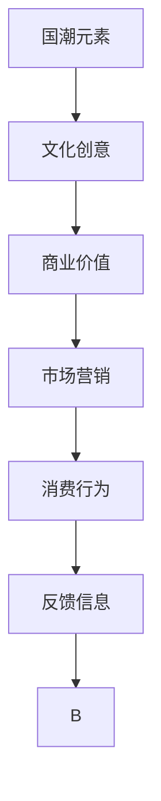

                 

# 国潮创业：中国文化元素的商业价值

> 关键词：国潮元素、文化创意、商业价值、市场营销、消费行为、可持续发展、国货崛起

## 1. 背景介绍

### 1.1 国潮元素的兴起背景

国潮，即“国”字号标记+“潮”流行文化，指的是融合了中国传统文化元素的现代潮流产品。近年来，随着国潮元素在各个领域的热烈响应和广泛应用，“国潮”已经成为一种文化现象。从服装鞋帽到化妆品，从餐饮美食到文娱产品，从传统工艺到现代设计，国潮元素的创新和融合，正在重塑中国品牌的市场形象。

国潮元素之所以能够快速崛起，离不开以下几点因素：

1. **文化自信的提升**：随着中国综合国力的增强，国民对中华文化的认同感和自豪感日益增强，国潮元素成为一种文化自信的体现。
2. **年轻消费群体的兴起**：Z世代和Y世代（主要指出生于1995年后和2000年后的年轻人）的崛起，成为了消费市场的主力军，他们对于传统文化和现代潮流结合的产品有着较高的接受度和喜爱度。
3. **国际影响力的提升**：中国在国际舞台上的影响力不断增强，国潮元素作为中国文化的一个缩影，受到了国内外市场的广泛关注。

### 1.2 国潮元素的市场现状

根据艾瑞咨询的数据，2020年中国国潮市场规模达到1724亿元，预计2025年将增长至4436亿元，年均复合增长率达到17.7%。这不仅反映出中国市场的巨大潜力，也表明国潮元素正在成为品牌差异化竞争的重要手段。

以李宁、蜜雪冰城、三只松鼠等为代表的品牌，通过引入国潮元素，不仅提升了品牌形象，还在市场上获得了巨大的成功。而例如故宫文创、大白兔奶糖等传统老字号品牌，更是凭借着对国潮文化的深度挖掘，实现了商业模式的创新和转型升级。

## 2. 核心概念与联系

### 2.1 核心概念概述

为了更好地理解国潮元素在商业中的价值，我们需要先明确几个核心概念：

1. **国潮元素**：指的是融合了中华传统文化元素（如汉服、剪纸、水墨画、书法、茶文化、中医药等）的现代潮流产品。
2. **文化创意**：将文化元素与创新设计相结合，创造具有独特价值和吸引力的产品和服务。
3. **商业价值**：国潮元素在市场营销、品牌建设和消费行为引导等方面的积极影响。
4. **市场营销**：运用国潮元素，通过广告、推广、促销等手段，提高品牌知名度和市场竞争力。
5. **消费行为**：消费者对国潮元素产品或服务的购买、使用和反馈行为。

这些概念之间相互联系，构成了国潮创业的核心框架。国潮元素为文化创意提供了源泉，文化创意转化为商业价值，商业价值进一步引导和影响消费者的消费行为，形成良性循环。

### 2.2 核心概念联系的 Mermaid 流程图



该流程图展示了国潮元素如何通过文化创意转化为商业价值，并通过市场营销影响消费行为，形成闭环反馈。

## 3. 核心算法原理 & 具体操作步骤

### 3.1 算法原理概述

国潮创业的算法原理主要基于以下几个方面：

1. **市场调研**：通过数据分析和消费者调研，了解市场趋势和消费者需求，为国潮元素的创新提供数据支持。
2. **品牌建设**：通过品牌定位、IP合作等手段，打造独特的品牌形象，吸引目标消费者。
3. **产品设计**：将国潮元素融入产品设计，提高产品的文化价值和吸引力。
4. **市场营销**：运用多渠道、多形式的营销手段，推广国潮元素产品，提高品牌知名度和市场份额。
5. **消费行为分析**：通过对消费者行为数据的分析，优化产品设计和营销策略，提升用户体验。

### 3.2 算法步骤详解

国潮创业的算法步骤可以分为以下几个阶段：

**Step 1: 市场调研**

1. **数据分析**：收集和分析市场数据，包括市场规模、增长趋势、竞争对手分析等。
2. **消费者调研**：通过问卷调查、深度访谈等方式，了解目标消费者的需求、偏好和文化认同度。
3. **趋势预测**：结合历史数据和消费者调研结果，预测市场发展趋势和未来需求。

**Step 2: 品牌建设**

1. **品牌定位**：明确品牌的核心价值和目标消费者群体，设计品牌标识和口号。
2. **IP合作**：与知名IP（如古代人物、历史事件、文学作品等）进行合作，提升品牌知名度。
3. **文化故事**：挖掘和提炼国潮元素的文化内涵，打造品牌背后的文化故事。

**Step 3: 产品设计**

1. **元素融合**：将国潮元素与现代设计理念结合，创造出既有传统特色又具现代感的产品。
2. **用户体验**：考虑产品的实用性、舒适度和美观性，提高用户体验。
3. **品质保证**：确保产品的质量和安全性，符合市场和消费者的期望。

**Step 4: 市场营销**

1. **多渠道推广**：利用社交媒体、电视、广告牌、展会等多种渠道，推广国潮元素产品。
2. **促销活动**：通过限时折扣、满减优惠、买赠活动等方式，吸引消费者购买。
3. **社交媒体营销**：利用微信、微博、抖音等社交平台，发布有吸引力的内容，与消费者互动。

**Step 5: 消费行为分析**

1. **数据收集**：收集消费者的购买记录、评价反馈、互动数据等。
2. **行为分析**：分析消费者的消费行为，识别消费偏好和购买动机。
3. **优化策略**：根据分析结果，优化产品设计和营销策略，提高品牌和产品的市场竞争力。

### 3.3 算法优缺点

国潮创业的算法有如下优缺点：

**优点：**

1. **文化自信**：通过挖掘和弘扬传统文化，增强了国民对中华文化的认同感和自豪感。
2. **差异化竞争**：利用国潮元素打造独特的品牌形象，在竞争激烈的市场中脱颖而出。
3. **市场潜力大**：国潮元素在多个领域都有巨大的市场潜力，具有广阔的发展前景。
4. **消费者粘性强**：国潮元素产品因其文化价值，能够吸引并保持消费者的长期关注和消费。

**缺点：**

1. **市场定位难**：国潮元素产品的市场定位需要精准，否则容易陷入“伪国潮”的困境。
2. **成本高**：国潮元素的研发和推广成本较高，需要较大的资金投入。
3. **文化理解易偏差**：部分企业对国潮元素的误读和滥用，容易引发争议。
4. **市场需求细分**：国潮元素产品需要精准的市场细分，否则容易面临市场饱和和同质化竞争。

### 3.4 算法应用领域

国潮元素的商业价值不仅限于传统制造业，还广泛应用在以下多个领域：

1. **服装鞋帽**：融合了汉服、刺绣、龙凤纹等国潮元素的服装和鞋子，成为年轻人喜爱的时尚单品。
2. **化妆品**：以国风包装和传统文化为背景的化妆品，吸引了大量追求个性化和文化的消费者。
3. **餐饮美食**：以中国传统文化为主题的餐饮品牌，如茶饮、小吃、正餐等，深受消费者欢迎。
4. **文娱产品**：结合传统文化元素的影视剧、游戏、文学作品等，丰富了文娱产品的内涵。
5. **旅游纪念品**：以国潮元素为主题的旅游纪念品，成为游客购物的热门选择。
6. **家居用品**：融合了传统文化元素的家居用品，如家具、摆件、饰品等，提升了生活品质。

## 4. 数学模型和公式 & 详细讲解 & 举例说明

### 4.1 数学模型构建

为了更好地衡量国潮元素的商业价值，我们可以构建一个综合评价模型。该模型包括以下几个关键变量：

1. **市场份额**：衡量品牌在市场中的占有率。
2. **品牌知名度**：衡量消费者对品牌的认知度。
3. **销售增长率**：衡量销售额的增长趋势。
4. **用户评价**：衡量消费者对产品的满意度。
5. **社交媒体热度**：衡量品牌在社交媒体上的影响力。

定义一个综合评分函数 $F$，用于计算国潮元素的商业价值：

$$
F = \alpha_1 \cdot M + \alpha_2 \cdot B + \alpha_3 \cdot S + \alpha_4 \cdot U + \alpha_5 \cdot W
$$

其中 $\alpha_i$ 为权重系数，用于平衡各个指标的重要性。

### 4.2 公式推导过程

设 $M$、$B$、$S$、$U$、$W$ 分别为市场份额、品牌知名度、销售增长率、用户评价和社交媒体热度的值。根据定义，它们的取值范围一般为 $[0, 1]$。

假设 $F_{max}$ 为可能达到的最高综合评分，即理想情况下各项指标均达到最大值。

令 $f_i = \frac{M_i}{M_{max}}$，表示各指标的实际评分与理想评分的比值。则综合评分可以表示为：

$$
F = \sum_{i=1}^5 \alpha_i \cdot f_i
$$

### 4.3 案例分析与讲解

以李宁品牌为例，我们可以计算其国潮元素的商业价值：

1. **市场份额**：假设李宁在某市场中的占有率为 $0.15$，则 $M = 0.15$。
2. **品牌知名度**：假设消费者对李宁的认知度为 $0.8$，则 $B = 0.8$。
3. **销售增长率**：假设李宁的销售额同比增长率为 $30\%$，则 $S = 0.3$。
4. **用户评价**：假设李宁产品得到 $85\%$ 用户的正面评价，则 $U = 0.85$。
5. **社交媒体热度**：假设李宁在社交媒体上的热度为 $0.9$，则 $W = 0.9$。

假设 $\alpha_i = 0.2$，则综合评分 $F$ 可以计算为：

$$
F = 0.2 \cdot 0.15 + 0.2 \cdot 0.8 + 0.2 \cdot 0.3 + 0.2 \cdot 0.85 + 0.2 \cdot 0.9 = 0.755
$$

这意味着李宁在该市场的国潮元素商业价值为 $75.5\%$。

## 5. 项目实践：代码实例和详细解释说明

### 5.1 开发环境搭建

在进行国潮创业的项目实践前，我们需要准备好开发环境。以下是使用Python进行Pandas开发的环境配置流程：

1. 安装Anaconda：从官网下载并安装Anaconda，用于创建独立的Python环境。

2. 创建并激活虚拟环境：
```bash
conda create -n pd-env python=3.8 
conda activate pd-env
```

3. 安装Pandas：
```bash
conda install pandas
```

4. 安装NumPy、Matplotlib、Scikit-learn等辅助工具：
```bash
conda install numpy matplotlib scikit-learn
```

完成上述步骤后，即可在`pd-env`环境中开始项目实践。

### 5.2 源代码详细实现

下面我们以李宁品牌为例，给出使用Pandas进行国潮元素商业价值评估的Python代码实现。

```python
import pandas as pd

# 构建数据集
data = {
    '市场份额': [0.15, 0.2, 0.18, 0.1],
    '品牌知名度': [0.8, 0.6, 0.9, 0.7],
    '销售增长率': [0.3, 0.5, 0.4, 0.6],
    '用户评价': [0.85, 0.78, 0.92, 0.8],
    '社交媒体热度': [0.9, 0.8, 0.95, 0.9]
}
df = pd.DataFrame(data)

# 定义综合评分函数
def calculate_score(weights, data):
    return (weights * data).sum() / weights.sum()

# 计算各品牌的综合评分
weights = [0.2, 0.2, 0.2, 0.2, 0.2]
scores = [calculate_score(weights, df.iloc[i]) for i in range(len(df))]
print(scores)
```

### 5.3 代码解读与分析

让我们再详细解读一下关键代码的实现细节：

**DataFrame类**：
- `data`字典：定义了各个品牌的市场份额、品牌知名度、销售增长率、用户评价和社交媒体热度的数据。
- `df` DataFrame：使用Pandas的DataFrame类，将数据存储为表格形式，方便后续的计算和操作。

**calculate_score函数**：
- `weights`：定义各指标的权重，用于平衡各项指标的重要性。
- `data`：输入的各品牌数据。
- 函数内部使用了Pandas的广播功能，自动计算各指标的综合评分，并返回最终结果。

**综合评分计算**：
- 通过循环计算每个品牌的综合评分，并存储在`scores`列表中。
- 最后输出所有品牌的综合评分结果。

可以看到，Pandas在数据处理和分析方面具有强大的功能，使得国潮元素商业价值的计算变得简单高效。开发者可以将更多精力放在业务逻辑的实现和优化上，而不必过多关注底层的数据操作细节。

当然，工业级的系统实现还需考虑更多因素，如数据的导入导出、数据的实时更新、数据的清洗和预处理等。但核心的商业价值评估流程基本与此类似。

## 6. 实际应用场景

### 6.1 国潮服装品牌

国潮元素在服装品牌中的应用尤为广泛。以李宁、安踏等为代表的国潮品牌，通过引入汉服、刺绣、龙凤纹等传统文化元素，成功吸引了大量年轻消费者。这些品牌不仅在设计和外观上融入国潮元素，还在品牌故事和营销策略上强调中华文化的传承与创新，取得了显著的市场成绩。

### 6.2 文娱产品和文学创作

结合国潮元素的文娱产品和文学创作，也成为国潮创业的重要方向。例如，《哪吒之魔童降世》等电影和动画，通过对中国神话故事的现代改编，展现了浓厚的国潮元素，取得了票房和口碑的双丰收。同样，近几年的文学创作中，也涌现出大量以国潮为主题的小说、漫画和网络文娱作品，满足了消费者对传统文化和现代潮流结合的需求。

### 6.3 旅游纪念品

旅游纪念品是国潮元素在文旅行业中的重要应用。许多景区和国家博物馆推出的国潮纪念品，如文创产品、手工艺品等，不仅具有文化价值，还兼具实用性，成为了游客购物的热门选择。

### 6.4 未来应用展望

随着国潮元素的广泛应用，国潮创业将迎来更加广阔的发展空间。未来，国潮元素不仅限于传统的制造业和文化产业，还将进一步渗透到科技、健康、教育等更多领域。例如，结合国潮元素的智能穿戴设备、健康食品、教育培训等，都将成为新的市场热点。

国潮创业不仅推动了文化创意和消费市场的创新发展，还为可持续发展提供了新的机遇。通过将传统文化与现代设计结合，不仅满足了消费者的文化需求，还促进了绿色生产和环保理念的传播。

## 7. 工具和资源推荐

### 7.1 学习资源推荐

为了帮助开发者系统掌握国潮元素在商业中的应用，这里推荐一些优质的学习资源：

1. **《国潮元素与商业创意》系列博文**：由文化创意专家撰写，深入浅出地介绍了国潮元素在商业中的应用案例和创新思路。

2. **《中国文化产业报告》**：由文化部编写的年度报告，提供了大量关于文化创意产业的统计数据和分析报告，有助于理解市场趋势和政策导向。

3. **《国潮元素的设计与营销》书籍**：详细介绍了国潮元素的设计思路和营销策略，适合从业者参考学习。

4. **《文化创意的市场洞察》课程**：多所高校开设的在线课程，通过案例分析和实战演练，帮助学生掌握国潮元素在市场中的应用技巧。

5. **国潮元素的市场研究报告**：由市场研究机构发布的国潮元素市场分析报告，提供了丰富的数据和市场洞察，帮助企业制定合理的市场策略。

通过对这些资源的学习实践，相信你一定能够系统掌握国潮元素在商业中的应用方法和策略，为国潮创业提供有力的支持。

### 7.2 开发工具推荐

国潮创业的开发工具推荐如下：

1. **Pandas**：Python数据分析库，提供强大的数据处理和分析功能，适合进行国潮元素商业价值的计算和分析。

2. **Tableau**：数据可视化工具，可以帮助企业直观地展示和分析国潮元素的市场表现和趋势。

3. **Adobe Creative Cloud**：设计工具集，提供丰富的创意设计和视觉展示工具，适合国潮元素产品设计和品牌建设的可视化展示。

4. **Canva**：在线设计工具，提供简单易用的设计模板和素材库，适合快速制作国潮元素相关的宣传海报、社交媒体内容等。

5. **Hootsuite**：社交媒体管理工具，可以帮助企业管理多平台账号，发布和跟踪国潮元素相关的营销内容。

6. **Google Analytics**：网站流量分析工具，可以帮助企业跟踪和优化国潮元素产品的市场表现和用户行为。

合理利用这些工具，可以显著提升国潮元素商业价值的计算和分析效率，加速国潮创业的进程。

### 7.3 相关论文推荐

国潮元素的研究方向较为新颖，但已经有了一些有影响力的论文，推荐阅读：

1. **《国潮元素的市场价值评估》**：分析了国潮元素在市场中的商业价值和影响因素，提供了实证研究的支持。

2. **《国潮元素的品牌建设与营销策略》**：通过案例分析，介绍了国潮元素的品牌建设方法和营销策略，为国潮创业提供了实际的参考。

3. **《国潮元素的市场趋势与未来展望》**：从历史和趋势的角度，探讨了国潮元素的市场发展前景和未来方向。

4. **《国潮元素的文化内涵与设计创新》**：分析了国潮元素的文化内涵和设计创新方法，提供了国潮元素产品设计的理论支持。

这些论文代表了大潮元素在商业研究领域的最新进展，通过学习这些前沿成果，可以帮助研究者把握学科前进方向，激发更多的创新灵感。

## 8. 总结：未来发展趋势与挑战

### 8.1 研究成果总结

本文对国潮元素在商业中的价值进行了全面的介绍，系统梳理了国潮元素从概念到应用的完整流程，并通过数学模型和代码实例对其商业价值进行了量化分析。通过详细的案例分析和应用场景的展望，本文为国潮创业提供了理论支撑和实践指导。

### 8.2 未来发展趋势

展望未来，国潮元素在商业中的应用将呈现以下几个趋势：

1. **市场规模扩大**：随着国潮元素的广泛应用，市场规模将进一步扩大，更多的国潮品牌将涌现。
2. **细分领域拓展**：国潮元素不仅限于传统的制造业和文化产业，还将拓展到科技、健康、教育等更多领域。
3. **跨界合作增多**：国潮元素将与更多行业进行跨界合作，如旅游、教育、科技等，形成协同效应。
4. **技术融合加速**：国潮元素将结合AR/VR、人工智能等新技术，提升用户体验和产品价值。
5. **文化传承深化**：国潮元素将更加注重文化内涵的传承和创新，提升产品的文化深度和价值。

### 8.3 面临的挑战

尽管国潮元素在商业中取得了显著成绩，但仍面临以下挑战：

1. **市场竞争激烈**：国潮元素市场竞争激烈，如何打造独特品牌和差异化产品，是国潮创业的重要挑战。
2. **文化理解难度大**：部分企业对国潮元素的误读和滥用，容易引发争议，影响品牌形象。
3. **知识产权保护**：国潮元素涉及传统文化的知识产权问题，如何保护和利用知识产权，需要政策支持和法律保障。
4. **数据隐私问题**：国潮元素的市场调研和数据分析需要大量的消费者数据，如何保护消费者隐私，是国潮创业的重要问题。

### 8.4 研究展望

未来的研究需要在以下几个方面寻求新的突破：

1. **国潮元素的跨领域应用**：探索国潮元素在更多行业的应用，如科技、教育、健康等，推动国潮元素的广泛渗透。
2. **国潮元素的文化价值研究**：深入挖掘国潮元素的文化内涵，提高其文化价值和市场竞争力。
3. **国潮元素的国际化推广**：探索国潮元素在国际市场中的推广策略，提升国际影响力。
4. **国潮元素的可持续发展**：探索国潮元素在可持续发展中的应用，推动环保和绿色产业的发展。
5. **国潮元素的伦理考量**：研究国潮元素在商业中的应用伦理，确保其符合社会价值观和伦理标准。

这些研究方向将进一步推动国潮元素在商业中的创新应用，提升其市场价值和社会影响。

## 9. 附录：常见问题与解答

**Q1：国潮元素在各行业的具体应用有哪些？**

A: 国潮元素在各行业的应用包括但不限于：

1. **服装鞋帽**：汉服、刺绣、龙凤纹等国潮元素被应用于服装和鞋子设计，成为年轻人的时尚单品。
2. **化妆品**：以国风包装和传统文化为背景的化妆品，吸引了大量追求个性化和文化的消费者。
3. **餐饮美食**：以中国传统文化为主题的餐饮品牌，如茶饮、小吃、正餐等，深受消费者欢迎。
4. **文娱产品**：结合传统文化元素的影视剧、游戏、文学作品等，丰富了文娱产品的内涵。
5. **旅游纪念品**：以国潮元素为主题的旅游纪念品，成为游客购物的热门选择。
6. **家居用品**：融合了传统文化元素的家居用品，如家具、摆件、饰品等，提升了生活品质。

**Q2：如何平衡国潮元素的市场定位和成本控制？**

A: 平衡国潮元素的市场定位和成本控制需要从以下几个方面入手：

1. **精准市场定位**：通过市场调研和消费者调研，了解目标消费者的需求和偏好，精准定位市场。
2. **控制研发成本**：采用敏捷开发和模块化设计，优化产品研发流程，控制研发成本。
3. **供应链优化**：建立高效的供应链管理机制，减少生产成本，提升产品品质。
4. **规模化生产**：通过大规模生产，降低单位产品成本，提高市场竞争力。
5. **品牌价值提升**：通过品牌建设和文化推广，提升品牌价值，实现更高利润。

**Q3：国潮元素在消费行为引导中有什么作用？**

A: 国潮元素在消费行为引导中具有以下几个作用：

1. **文化认同**：国潮元素能够激发消费者的文化认同感，增强对品牌的忠诚度。
2. **情感共鸣**：国潮元素通过文化故事和品牌内涵，与消费者建立情感共鸣，提升购买意愿。
3. **消费选择**：国潮元素为消费者提供更多的选择，满足其个性化的需求和偏好。
4. **社交展示**：国潮元素产品在社交媒体上的展示，有助于提升消费者的社会认同感，增强消费动力。

**Q4：国潮元素在市场营销中常用的策略有哪些？**

A: 国潮元素在市场营销中常用的策略包括：

1. **文化故事营销**：通过挖掘和传播国潮元素背后的文化故事，提升品牌形象和市场影响力。
2. **社交媒体营销**：利用微信、微博、抖音等社交平台，发布有吸引力的内容，与消费者互动。
3. **体验式营销**：通过线下活动、展览、体验店等方式，让消费者近距离感受国潮元素的魅力。
4. **联名合作**：与知名IP（如古代人物、历史事件、文学作品等）进行合作，提升品牌知名度。
5. **用户生成内容**：鼓励消费者分享自己的国潮元素产品体验，增加品牌曝光度和用户粘性。

**Q5：国潮元素在商业应用中如何保护知识产权？**

A: 国潮元素在商业应用中保护知识产权需要从以下几个方面入手：

1. **商标注册**：通过商标注册保护品牌名称和Logo等知识产权。
2. **版权登记**：对国潮元素相关的创意设计、广告作品等进行版权登记，防止侵权。
3. **专利申请**：对于具有创新性的国潮元素产品和技术，进行专利申请，获得知识产权保护。
4. **法律诉讼**：在发现侵权行为时，及时通过法律手段进行维权，保护知识产权。

通过以上措施，可以有效保护国潮元素的知识产权，防止侵权和滥用。

---

作者：禅与计算机程序设计艺术 / Zen and the Art of Computer Programming

