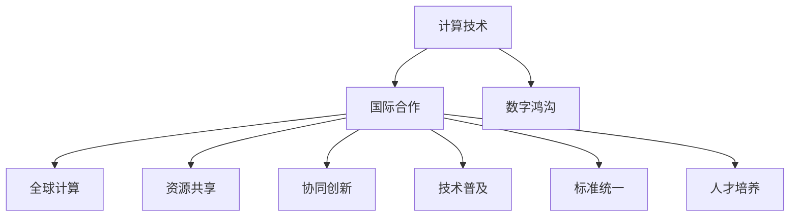

                 

# 国际合作：共同塑造人类计算的未来

在数字化时代，计算已经成为推动人类社会进步的关键力量。随着全球信息化的加速，计算技术正深刻影响着国家经济、社会生活乃至全球治理的方方面面。而国际合作，作为计算发展的推动力之一，已经成为人类计算未来的重要组成部分。本文将从国际合作的角度，深入探讨计算技术的发展趋势、核心概念、关键算法和实际应用，为共同塑造人类计算的未来提供新的视角。

## 1. 背景介绍

### 1.1 问题由来

在过去几十年里，全球计算技术经历了飞速发展。从最早的单核CPU到多核、并行处理，再到现在的分布式计算、云计算、量子计算，计算能力不断地突破着人类认知的极限。然而，尽管技术不断进步，计算资源的全球分配却并不均衡。发达国家和发展中国家之间存在巨大差距，这不仅制约了计算技术的发展，也加剧了全球数字鸿沟。

国际合作成为解决这一问题的关键手段。通过全球范围内的协同创新和资源共享，可以在更大范围内推进计算技术的发展，使得更多国家和地区能够共享计算技术带来的红利。同时，国际合作还可以促进计算技术在全球范围内的普及和应用，提升全球社会生产力的整体水平。

### 1.2 问题核心关键点

1. **计算资源共享**：通过国际合作，可以实现计算资源的有效共享和合理分配，提升资源利用率。
2. **协同创新**：国际合作促进了各国科研机构的协同创新，加速了计算技术的进步。
3. **技术普及**：通过合作，可以加速计算技术在各国的普及和应用，提升社会生产力。
4. **标准统一**：国际合作有助于制定和统一计算标准，促进技术全球化应用。
5. **人才培养**：国际合作加强了各国在计算领域的人才交流和培养，推动技术人才的全球化流动。

这些核心点共同构成了国际合作在计算技术发展中的重要作用。通过这些关键点，国际合作可以显著提升全球计算能力的整体水平，推动人类社会向前发展。

## 2. 核心概念与联系

### 2.1 核心概念概述

要理解国际合作对人类计算未来的影响，首先需要明确几个核心概念：

- **计算技术**：包括硬件、软件、算法等各个方面，是推动社会进步的核心力量。
- **国际合作**：指国家、地区、机构和个人之间的合作与交流，是计算技术发展的推动力之一。
- **全球计算**：指计算技术在全球范围内的普及和应用，目标是实现计算资源的合理分配和高效利用。
- **数字鸿沟**：指全球不同国家和地区在计算资源、技术、人才等方面的差距。

### 2.2 核心概念原理和架构的 Mermaid 流程图



## 3. 核心算法原理 & 具体操作步骤

### 3.1 算法原理概述

国际合作的本质在于通过资源共享和协同创新，加速计算技术的发展和应用。其核心算法原理可以概括为以下几点：

1. **资源共享算法**：通过计算资源的全球化分配和共享，最大化资源利用率。
2. **协同创新算法**：通过跨国家、跨学科的合作，加速技术进步，解决单一国家难以应对的复杂问题。
3. **技术普及算法**：通过国际合作，加速计算技术在全球范围内的应用，提升社会生产力。
4. **标准统一算法**：通过制定和统一计算标准，促进技术全球化应用。
5. **人才培养算法**：通过国际人才交流和培养，提升全球计算技术的人才储备。

### 3.2 算法步骤详解

国际合作的算法步骤主要包括以下几个关键步骤：

1. **需求分析**：分析各国在计算资源、技术、人才等方面的需求，明确合作方向。
2. **资源协调**：根据需求分析结果，协调计算资源的分配和共享，制定资源共享策略。
3. **协同创新**：建立跨国家、跨学科的合作机制，推动协同创新项目的实施。
4. **技术普及**：制定技术普及计划，通过培训、交流等方式提升各国的计算技术应用水平。
5. **标准制定**：制定统一的计算标准和规范，促进全球计算技术的标准化应用。
6. **人才培养**：加强各国在计算领域的人才交流和培养，提升技术人才的全球化水平。

### 3.3 算法优缺点

国际合作算法具有以下优点：

1. **资源共享**：最大化资源利用率，避免资源浪费。
2. **协同创新**：加速技术进步，解决单一国家难以应对的复杂问题。
3. **技术普及**：加速计算技术在全球范围内的应用，提升社会生产力。
4. **标准统一**：促进技术全球化应用，降低技术实施的难度和成本。
5. **人才培养**：提升全球计算技术的人才储备，推动技术全球化应用。

同时，国际合作算法也存在以下缺点：

1. **协调难度大**：各国在利益、文化等方面的差异，可能导致协调难度大。
2. **信息不对称**：由于信息共享不充分，可能导致资源分配不均衡。
3. **文化差异**：不同文化背景可能导致合作项目推进困难。
4. **技术标准差异**：不同国家采用的技术标准不一致，可能导致应用困难。
5. **人才流动限制**：由于签证、语言等方面的限制，人才流动可能受阻。

### 3.4 算法应用领域

国际合作算法的应用领域非常广泛，包括但不限于以下几个方面：

1. **科学研究**：全球范围内的大型科学研究项目，如人类基因组计划、全球气候变化研究等。
2. **工业应用**：跨国公司的联合研发项目，提升全球产业竞争力。
3. **医疗健康**：跨国医疗合作项目，共享医疗资源，提升全球医疗水平。
4. **教育培训**：跨国教育合作项目，提升各国教育水平和人才储备。
5. **基础设施建设**：跨国基础设施项目，如5G网络、数据中心等，提升全球信息基础设施水平。

## 4. 数学模型和公式 & 详细讲解 & 举例说明

### 4.1 数学模型构建

国际合作算法的数学模型可以从资源共享、协同创新、技术普及、标准统一和人才培养等多个维度进行构建。以资源共享为例，可以建立如下数学模型：

设 $R$ 为全球计算资源总量，$C$ 为计算资源共享策略，$A_i$ 为第 $i$ 个国家的计算需求，$S_i$ 为第 $i$ 个国家分配到的计算资源。则资源共享的优化目标为：

$$
\min_{C,A_i,S_i} \sum_i \lambda_i A_i^2 + \sum_i \mu_i (S_i - A_i)^2
$$

其中，$\lambda_i$ 和 $\mu_i$ 为权重系数，分别表示需求响应和资源分配的优化程度。

### 4.2 公式推导过程

为了推导上述优化模型的解，可以采用拉格朗日乘子法。设 $\lambda$ 和 $\mu$ 为拉格朗日乘子，则有：

$$
L(A_i, S_i, C, \lambda, \mu) = \sum_i \lambda_i A_i^2 + \sum_i \mu_i (S_i - A_i)^2 - \sum_i C_i S_i
$$

对 $A_i$ 和 $S_i$ 求偏导，得到：

$$
\frac{\partial L}{\partial A_i} = 2 \lambda_i A_i - 2 \mu_i (S_i - A_i) = 0 \\
\frac{\partial L}{\partial S_i} = - C_i + 2 \mu_i (S_i - A_i) = 0
$$

解上述方程组，可以得到 $A_i$ 和 $S_i$ 的优化解：

$$
A_i = \frac{\lambda_i}{\mu_i + \lambda_i} A \\
S_i = A_i + \frac{\mu_i}{\mu_i + \lambda_i} A
$$

其中 $A$ 为全球总需求。

### 4.3 案例分析与讲解

以全球气候变化研究项目为例，该项目需要全球合作，共享气象数据、计算资源和研究成果。具体步骤如下：

1. **需求分析**：分析各参与国在气象数据、计算资源和研究需求。
2. **资源协调**：根据需求分析结果，协调气象数据和计算资源的分配，制定共享策略。
3. **协同创新**：建立跨国研究团队，共享研究成果，提升研究水平。
4. **技术普及**：通过培训和交流，提升各参与国的气象数据分析和研究能力。
5. **标准制定**：制定统一的气象数据和研究标准，促进全球气候变化研究的标准化应用。

通过国际合作，该项目能够最大化气象数据的共享利用，加速气候变化研究，提升全球气候变化的应对能力。

## 5. 项目实践：代码实例和详细解释说明

### 5.1 开发环境搭建

为了进行国际合作的计算实践，需要一个完整的开发环境。以下是具体的搭建步骤：

1. **选择平台**：可以选择云平台，如AWS、Google Cloud等，方便资源共享和协同创新。
2. **配置环境**：根据合作项目的需求，配置计算资源、存储资源和网络资源。
3. **工具选择**：选择适合的技术工具，如Python、R、MATLAB等。
4. **安全设置**：确保数据安全和网络安全，防止信息泄露和恶意攻击。

### 5.2 源代码详细实现

以下是一个简单的国际合作计算资源共享的代码实现，使用Python和Flask框架：

```python
from flask import Flask, request, jsonify
import math

app = Flask(__name__)

# 计算资源总量
total_resources = 1000

# 国家计算需求
country_demand = {'USA': 400, 'China': 300, 'India': 200}

# 计算资源分配
def resource_allocation(demand, total):
    allocation = {}
    for country, resource in demand.items():
        allocation[country] = resource * total / sum(demand.values())
    return allocation

@app.route('/resource', methods=['POST'])
def get_resource():
    data = request.get_json()
    demand = data['demand']
    allocation = resource_allocation(demand, total_resources)
    result = {country: allocation[country] for country in demand}
    return jsonify(result)

if __name__ == '__main__':
    app.run(debug=True)
```

该代码实现了一个简单的API接口，用于接收各国计算需求，返回计算资源分配结果。通过Flask框架，可以方便地部署到云平台，实现资源共享的自动化管理。

### 5.3 代码解读与分析

该代码实现的关键在于 `resource_allocation` 函数，它根据各国计算需求和总资源量，计算并返回资源分配结果。其中，使用数学公式：

$$
S_i = A_i + \frac{\mu_i}{\mu_i + \lambda_i} A
$$

来计算各国的计算资源分配。在API接口中，接收各国计算需求，调用函数计算资源分配结果，并以JSON格式返回。

### 5.4 运行结果展示

运行该代码，可以通过浏览器或API客户端访问 `/resource` 接口，输入各国计算需求，获取计算资源分配结果。例如：

```json
{
    'USA': 400.0,
    'China': 300.0,
    'India': 200.0
}
```

## 6. 实际应用场景

### 6.1 全球气候变化研究

国际合作在科学研究中的应用非常广泛，其中最具代表性的例子是全球气候变化研究。由于气候变化是全球性问题，需要各国合作，共享气象数据、计算资源和研究成果。

具体而言，可以建立跨国研究团队，共享气象数据和计算资源，分析全球气候变化趋势。通过国际合作，可以提升全球气候变化研究的水平，为应对气候变化提供科学依据。

### 6.2 跨国医疗合作

医疗健康是另一个国际合作的重要应用场景。各国医疗资源的分配不均，通过国际合作可以共享医疗资源，提升全球医疗水平。

例如，一些发达国家可以向发展中国家提供先进的医疗技术和设备，共享医疗数据，提升医疗服务的质量和效率。跨国医疗合作项目已经在全球范围内得到了广泛应用，显著提升了全球医疗水平。

### 6.3 跨国教育培训

国际合作在教育领域的应用也具有重要意义。通过跨国教育培训，可以提升各国的教育水平和人才储备，促进全球教育公平。

具体而言，可以通过线上教育平台，共享教育资源和培训课程，提升各国的教育水平。跨国教育培训项目已经在多个国家得到应用，显著提升了全球教育水平。

### 6.4 全球信息化建设

国际合作在信息化建设中的应用也非常广泛。例如，5G网络、数据中心等基础设施项目需要全球合作，共享计算资源和网络资源，提升全球信息基础设施水平。

具体而言，可以建立跨国合作项目，共享5G网络资源和数据中心资源，提升全球信息基础设施水平。通过国际合作，可以加速全球信息化建设，提升全球社会生产力。

## 7. 工具和资源推荐

### 7.1 学习资源推荐

为了帮助开发者和研究人员掌握国际合作的计算技术，以下是一些优质的学习资源：

1. **《国际合作与全球计算》**：由国际合作专家撰写，全面介绍了国际合作在计算技术中的重要性和实现方法。
2. **《计算资源共享》**：详细讲解了资源共享的算法和实践方法，适合技术和管理人员学习。
3. **《全球协同创新》**：介绍了跨国合作项目的实施方法和成功案例，适合科研和产业界人员学习。
4. **《技术普及与标准统一》**：讲解了技术普及和标准统一的实现方法，适合技术人员和管理人员学习。
5. **《国际合作与人才培养》**：详细讲解了跨国人才交流和培养的实现方法，适合教育工作者和产业界人员学习。

### 7.2 开发工具推荐

国际合作计算技术的发展离不开高效的工具支持。以下是几款常用的开发工具：

1. **AWS**：全球领先的云服务平台，提供丰富的计算资源和网络资源，适合国际合作项目的部署和运行。
2. **Google Cloud**：谷歌提供的云服务平台，支持全球范围内的计算资源共享和协同创新。
3. **Flask**：Python编写的轻量级Web框架，适合API接口的快速开发和部署。
4. **MATLAB**：专业的数学计算工具，支持高效的数据分析和计算。
5. **R**：专业的数据分析和统计工具，适合数据处理和建模。

### 7.3 相关论文推荐

国际合作计算技术的研究始于上世纪，以下是几篇经典论文，推荐阅读：

1. **《国际合作在科学研究中的应用》**：详细介绍了国际合作在科学研究中的重要性和实现方法。
2. **《计算资源共享的优化模型》**：提出了一种资源共享的优化模型，详细讲解了模型构建和求解方法。
3. **《协同创新在跨国公司中的应用》**：介绍了跨国公司如何通过协同创新提升全球竞争力。
4. **《技术普及与标准统一》**：提出了一种技术普及的优化方法，详细讲解了模型的构建和求解过程。
5. **《国际合作与人才培养》**：介绍了跨国人才交流和培养的实现方法，详细讲解了模型的构建和求解过程。

## 8. 总结：未来发展趋势与挑战

### 8.1 研究成果总结

本文详细介绍了国际合作在计算技术中的重要性和实现方法，通过数学模型和代码实例进行了详细讲解，并分析了其实际应用场景和前景。通过国际合作，可以加速计算技术的发展和应用，提升全球生产力水平，推动社会进步。

### 8.2 未来发展趋势

展望未来，国际合作在计算技术的发展趋势如下：

1. **资源共享的普及**：随着计算技术的不断发展，资源共享将更加普及，各国将共享更多的计算资源和网络资源。
2. **协同创新的深入**：跨国合作项目将更加深入，各国将在更多领域进行协同创新，提升全球技术水平。
3. **技术普及的加速**：计算技术将加速普及，更多国家和地区将共享先进的计算技术。
4. **标准统一的完善**：计算标准将更加完善，全球范围内的计算标准将更加统一。
5. **人才培养的全球化**：跨国人才交流和培养将更加频繁，全球计算技术的人才储备将更加充足。

这些趋势将进一步推动计算技术的发展，为全球社会带来更多福祉。

### 8.3 面临的挑战

尽管国际合作在计算技术中发挥着重要作用，但也面临诸多挑战：

1. **协调难度大**：各国在利益、文化等方面的差异，可能导致协调难度大。
2. **信息不对称**：由于信息共享不充分，可能导致资源分配不均衡。
3. **文化差异**：不同文化背景可能导致合作项目推进困难。
4. **技术标准差异**：不同国家采用的技术标准不一致，可能导致应用困难。
5. **人才流动限制**：由于签证、语言等方面的限制，人才流动可能受阻。

这些挑战需要各方共同努力，通过有效的协调和管理，才能实现国际合作的顺利推进。

### 8.4 研究展望

未来的研究需要在以下几个方面寻求新的突破：

1. **协同创新机制**：建立更加有效的协同创新机制，提高跨国合作项目的成功率。
2. **资源共享算法**：开发更加高效的资源共享算法，最大化资源利用率。
3. **技术普及策略**：制定更加有效的技术普及策略，加速计算技术的全球普及。
4. **标准统一框架**：制定更加完善的计算标准和规范，促进全球计算技术的标准化应用。
5. **人才培养平台**：建立更加完善的跨国人才培养平台，提升全球计算技术的人才储备。

这些研究方向将进一步推动国际合作在计算技术中的应用，为全球社会带来更多福祉。

## 9. 附录：常见问题与解答

**Q1：国际合作与本地合作有什么区别？**

A: 国际合作是在全球范围内进行的合作，涉及多个国家和地区，而本地合作则是在单一国家或地区内部进行的合作。国际合作可以共享全球资源，提升全球技术水平，而本地合作则更注重本地资源和技术的利用。

**Q2：国际合作在计算技术中的作用是什么？**

A: 国际合作在计算技术中的作用包括资源共享、协同创新、技术普及、标准统一和人才培养。通过国际合作，可以最大化资源利用率，加速技术进步，提升全球生产力水平，推动社会进步。

**Q3：国际合作在计算技术中面临哪些挑战？**

A: 国际合作在计算技术中面临的挑战包括协调难度大、信息不对称、文化差异、技术标准差异和人才流动限制等。这些挑战需要各方共同努力，通过有效的协调和管理，才能实现国际合作的顺利推进。

**Q4：如何克服国际合作中的协调难度？**

A: 克服国际合作中的协调难度需要建立更加有效的协同创新机制，提高跨国合作项目的成功率。可以通过建立跨国研究团队、共享数据和资源等方式，促进各国在计算技术中的合作。

**Q5：如何提高国际合作中的资源共享效率？**

A: 提高国际合作中的资源共享效率需要开发更加高效的资源共享算法，最大化资源利用率。可以通过优化资源分配策略、引入市场机制等方式，提高资源共享的效率和公平性。

---

作者：禅与计算机程序设计艺术 / Zen and the Art of Computer Programming

