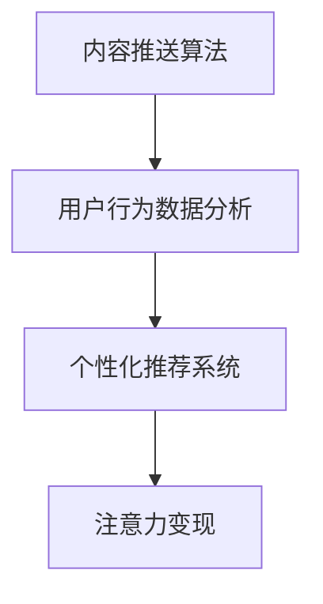

                 

# 在线健身平台的注意力经济策略

## 1. 背景介绍

随着数字经济的发展，注意力作为稀缺资源，其价值日益凸显。在线健身平台作为连接用户和健身教练的重要中介，如何通过策略性运营获取、维护并变现用户的注意力，成为平台的核心竞争力所在。注意力经济是一种新的经济模式，通过对用户的注意力进行收集、整合、交换和变现，实现商业价值的最大化。本文将重点探讨在线健身平台如何运用注意力经济策略，优化用户体验，提升用户粘性，从而增加商业变现的可能性。

## 2. 核心概念与联系

### 2.1 核心概念概述

注意力经济（Attention Economy）是一种新兴的经济形态，指通过提供有价值的内容、服务和产品，吸引和保持用户的注意力，进而实现经济收益的过程。在线健身平台通过个性化的内容推荐、互动式的健身指导和社交化的用户互动，可以有效吸引用户并提高用户黏性。

在线健身平台需要综合运用多种策略，包括内容推送算法、用户行为数据分析、个性化推荐系统等，以有效管理和变现用户的注意力。本文将重点关注以下核心概念：

- 内容推送算法（Content Delivery Algorithm）：基于用户行为数据分析，自动推送个性化健身内容，提高用户参与度和满意度。
- 用户行为数据分析（User Behavior Analysis）：通过分析用户行为数据，优化个性化推荐系统，增强用户粘性。
- 个性化推荐系统（Personalized Recommendation System）：根据用户兴趣和行为，提供量身定制的健身方案和产品。

这些概念之间的逻辑关系可以通过以下Mermaid流程图来展示：



这个流程图展示了你注意力经济在在线健身平台中的作用：首先通过内容推送算法吸引用户注意力，然后通过用户行为数据分析优化个性化推荐系统，最后通过个性化推荐系统变现用户注意力。

### 2.2 核心概念原理和架构

#### 2.2.1 内容推送算法原理

内容推送算法通过用户行为数据分析，自动将最相关的健身内容推送给用户。其核心原理包括：

- 用户行为数据收集：通过记录用户在平台上的点击、浏览、互动等行为，收集用户兴趣偏好数据。
- 内容相关性分析：将用户行为数据与平台上的内容标签进行匹配，计算相关性。
- 推荐算法应用：基于相关性分析结果，应用推荐算法（如协同过滤、基于内容的推荐等），生成推荐列表。
- 动态调整：根据用户反馈和行为变化，动态调整推荐策略，保证推荐内容的持续优化。

#### 2.2.2 用户行为数据分析原理

用户行为数据分析旨在通过分析用户行为数据，了解用户需求和偏好，从而优化个性化推荐系统。其核心原理包括：

- 数据收集与预处理：从平台日志中收集用户行为数据，并进行清洗、整理和预处理。
- 特征提取与建模：使用特征提取技术（如TF-IDF、词袋模型等）将用户行为数据转化为特征向量，建立用户行为模型。
- 模型训练与优化：使用机器学习算法（如随机森林、支持向量机等）对用户行为模型进行训练和优化，提高模型的准确性和泛化能力。
- 行为预测与分析：基于训练好的模型，对用户未来的行为进行预测和分析，提供行为洞察和决策支持。

#### 2.2.3 个性化推荐系统原理

个性化推荐系统根据用户兴趣和行为，提供量身定制的健身方案和产品。其核心原理包括：

- 用户画像构建：通过分析用户行为数据，构建用户画像，包括兴趣、偏好、行为习惯等。
- 产品库管理：维护产品库，包括健身方案、健身装备、营养补充品等，并提供详细的产品信息。
- 推荐引擎设计：设计推荐引擎，包括召回策略、排序算法和反馈机制等，确保推荐结果的相关性和多样性。
- 系统评估与迭代：定期评估推荐系统性能，收集用户反馈，进行系统迭代优化。

## 3. 核心算法原理 & 具体操作步骤

### 3.1 算法原理概述

在线健身平台的注意力经济策略主要基于以下算法原理：

- 协同过滤推荐算法（Collaborative Filtering）：通过分析用户和产品之间的协同行为，推荐相似用户喜欢的产品。
- 基于内容的推荐算法（Content-based Recommendation）：通过分析产品内容特征，推荐与用户偏好相似的产品。
- 矩阵分解算法（Matrix Factorization）：通过分解用户行为矩阵，发现用户和产品的潜在隐含特征，优化推荐效果。
- 深度学习推荐算法（Deep Learning-based Recommendation）：利用深度神经网络模型，挖掘用户行为和产品特征的复杂关系，提升推荐精度。

### 3.2 算法步骤详解

#### 3.2.1 协同过滤推荐算法步骤

1. 数据收集：收集用户行为数据（如点击、浏览、购买等）和产品数据（如名称、描述、标签等）。
2. 数据预处理：对数据进行清洗、归一化和特征提取等预处理。
3. 相似度计算：计算用户和产品之间的相似度，可以采用余弦相似度、皮尔逊相关系数等。
4. 协同过滤：基于相似度计算结果，应用协同过滤算法（如基于用户的协同过滤、基于物品的协同过滤等）生成推荐列表。
5. 推荐展示：将推荐结果展示给用户，并根据用户反馈进行动态调整。

#### 3.2.2 基于内容的推荐算法步骤

1. 数据收集：收集用户行为数据和产品内容数据。
2. 内容特征提取：使用自然语言处理技术（如TF-IDF、词袋模型等）提取产品内容的特征。
3. 用户兴趣建模：通过分析用户行为数据，构建用户兴趣模型。
4. 特征匹配：将产品特征与用户兴趣模型进行匹配，计算相关性。
5. 推荐排序：根据相关性排序，生成推荐列表。

#### 3.2.3 矩阵分解算法步骤

1. 数据收集：收集用户行为数据。
2. 矩阵构建：将用户行为数据构建为用户-产品矩阵。
3. 矩阵分解：使用矩阵分解算法（如奇异值分解SVD）分解矩阵，得到用户和产品的隐含特征。
4. 特征融合：将隐含特征与产品特征进行融合，生成推荐特征。
5. 推荐排序：根据推荐特征进行排序，生成推荐列表。

#### 3.2.4 深度学习推荐算法步骤

1. 数据收集：收集用户行为数据和产品数据。
2. 特征提取：使用深度学习模型（如卷积神经网络CNN、循环神经网络RNN等）提取用户行为和产品特征。
3. 模型训练：使用深度学习框架（如TensorFlow、PyTorch等）训练推荐模型。
4. 特征融合：将深度学习模型的特征与传统推荐特征进行融合。
5. 推荐排序：根据融合后的特征进行排序，生成推荐列表。

### 3.3 算法优缺点

#### 3.3.1 协同过滤推荐算法优缺点

**优点**：
- 能够处理冷启动问题，即新用户或新物品也能得到推荐。
- 推荐结果多样性高，能够发现与用户兴趣不同的潜在产品。

**缺点**：
- 依赖用户和物品之间的协同行为数据，难以处理新用户或新物品。
- 冷启动问题可能导致推荐效果不佳。

#### 3.3.2 基于内容的推荐算法优缺点

**优点**：
- 能够处理新用户或新物品，推荐结果多样性高。
- 不需要协同行为数据，容易实现。

**缺点**：
- 对产品内容特征提取的要求较高，且难以处理用户兴趣变化。
- 推荐结果可能存在偏差，无法完全反映用户兴趣。

#### 3.3.3 矩阵分解算法优缺点

**优点**：
- 能够处理大规模数据，且推荐结果多样性高。
- 能够发现用户和产品的潜在隐含特征。

**缺点**：
- 对用户行为数据的要求较高，数据稀疏性可能导致推荐效果不佳。
- 算法复杂度较高，计算成本高。

#### 3.3.4 深度学习推荐算法优缺点

**优点**：
- 能够处理复杂的数据关系，推荐结果精度高。
- 能够自动学习特征，无需手工设计特征。

**缺点**：
- 对数据量和计算资源的要求较高。
- 模型复杂度较高，训练和推理速度较慢。

### 3.4 算法应用领域

在线健身平台的注意力经济策略主要应用于以下领域：

- 健身内容推荐：根据用户行为和兴趣，推荐个性化健身内容，如视频教程、文章、课程等。
- 健身装备推荐：根据用户偏好和健身目标，推荐适合的健身装备，如运动鞋、瑜伽垫、哑铃等。
- 营养补充品推荐：根据用户的健身目标和饮食习惯，推荐营养补充品，如蛋白质粉、维生素片等。
- 会员权益推荐：根据用户的行为和支付数据，推荐适合的会员权益，如月卡、年卡、折扣优惠等。

## 4. 数学模型和公式 & 详细讲解 & 举例说明

### 4.1 数学模型构建

#### 4.1.1 协同过滤推荐模型

协同过滤推荐模型基于用户和物品之间的协同行为，建立用户和物品的相似度矩阵，从而进行推荐。假设用户集合为 $U$，物品集合为 $I$，用户-物品交互矩阵为 $R$，用户 $u$ 对物品 $i$ 的评分（打分）为 $r_{ui}$，则协同过滤推荐模型可以表示为：

$$ R \approx \hat{R} = U \times V^T $$

其中 $U$ 为用户的用户矩阵，$V$ 为物品的向量矩阵，$\hat{R}$ 为预测的评分矩阵。

#### 4.1.2 基于内容的推荐模型

基于内容的推荐模型通过分析产品内容特征，建立内容特征向量，与用户兴趣向量进行匹配，从而进行推荐。假设用户 $u$ 对物品 $i$ 的兴趣度为 $v_u$，物品 $i$ 的内容特征向量为 $c_i$，则基于内容的推荐模型可以表示为：

$$ v_u \propto c_i $$

其中 $c_i$ 为物品 $i$ 的内容特征向量，$v_u$ 为用户 $u$ 对物品 $i$ 的兴趣度向量。

#### 4.1.3 矩阵分解推荐模型

矩阵分解推荐模型通过分解用户行为矩阵，发现用户和产品的潜在隐含特征，从而进行推荐。假设用户 $u$ 对物品 $i$ 的行为表示为 $R_{ui}$，用户 $u$ 的潜在隐含特征向量为 $U_u$，物品 $i$ 的潜在隐含特征向量为 $V_i$，则矩阵分解推荐模型可以表示为：

$$ R_{ui} \approx \hat{R}_{ui} = U_u \times V_i^T $$

其中 $U_u$ 为用户 $u$ 的潜在隐含特征向量，$V_i$ 为物品 $i$ 的潜在隐含特征向量，$\hat{R}_{ui}$ 为预测的行为评分。

#### 4.1.4 深度学习推荐模型

深度学习推荐模型通过构建深度神经网络，自动学习用户行为和产品特征之间的关系，从而进行推荐。假设用户 $u$ 的特征向量为 $H_u$，物品 $i$ 的特征向量为 $H_i$，则深度学习推荐模型可以表示为：

$$ R_{ui} \approx \hat{R}_{ui} = H_u \times H_i^T $$

其中 $H_u$ 为用户 $u$ 的特征向量，$H_i$ 为物品 $i$ 的特征向量，$\hat{R}_{ui}$ 为预测的行为评分。

### 4.2 公式推导过程

#### 4.2.1 协同过滤推荐公式推导

协同过滤推荐算法的基本思想是，根据用户对物品的评分数据，计算用户和物品之间的相似度，从而进行推荐。假设用户 $u$ 对物品 $i$ 的评分表示为 $r_{ui}$，用户 $u$ 的相似用户集合为 $N(u)$，物品 $i$ 的相似物品集合为 $N(i)$，则协同过滤推荐算法的具体推导如下：

1. 计算用户 $u$ 和物品 $i$ 的相似度 $s_{ui}$：

$$ s_{ui} = \frac{\sum_{j \in N(u)} r_{uj} \times r_{ji}}{\sqrt{\sum_{j \in N(u)} r_{uj}^2} \times \sqrt{\sum_{j \in N(i)} r_{ji}^2}} $$

2. 根据相似度计算推荐结果 $y_{ui}$：

$$ y_{ui} = \frac{\sum_{j \in N(i)} s_{uj} \times r_{jai}}{\sum_{j \in N(i)} s_{uj}} $$

其中 $y_{ui}$ 为用户 $u$ 对物品 $i$ 的预测评分，$r_{jai}$ 为物品 $j$ 对物品 $i$ 的实际评分。

#### 4.2.2 基于内容的推荐公式推导

基于内容的推荐算法的基本思想是，根据用户行为数据，提取用户兴趣特征，与产品内容特征进行匹配，从而进行推荐。假设用户 $u$ 对物品 $i$ 的兴趣度为 $v_u$，物品 $i$ 的内容特征向量为 $c_i$，则基于内容的推荐算法的具体推导如下：

1. 计算用户 $u$ 和物品 $i$ 的相似度 $s_{ui}$：

$$ s_{ui} = \frac{\sum_{j=1}^m v_{uj} \times c_{ij}}{\sqrt{\sum_{j=1}^m v_{uj}^2} \times \sqrt{\sum_{j=1}^m c_{ij}^2}} $$

2. 根据相似度计算推荐结果 $y_{ui}$：

$$ y_{ui} = s_{ui} $$

其中 $y_{ui}$ 为用户 $u$ 对物品 $i$ 的预测评分。

#### 4.2.3 矩阵分解推荐公式推导

矩阵分解推荐算法的基本思想是，通过分解用户行为矩阵，发现用户和产品的潜在隐含特征，从而进行推荐。假设用户 $u$ 对物品 $i$ 的行为表示为 $R_{ui}$，用户 $u$ 的潜在隐含特征向量为 $U_u$，物品 $i$ 的潜在隐含特征向量为 $V_i$，则矩阵分解推荐算法的具体推导如下：

1. 计算用户 $u$ 和物品 $i$ 的潜在隐含特征 $U_u$ 和 $V_i$：

$$ U_u = \sum_{i \in I} R_{ui} \times V_i $$

$$ V_i = \sum_{u \in U} R_{ui} \times U_u $$

2. 计算用户 $u$ 对物品 $i$ 的预测评分 $R_{ui}$：

$$ R_{ui} \approx \hat{R}_{ui} = U_u \times V_i^T $$

其中 $R_{ui}$ 为用户 $u$ 对物品 $i$ 的实际评分，$\hat{R}_{ui}$ 为用户 $u$ 对物品 $i$ 的预测评分。

#### 4.2.4 深度学习推荐公式推导

深度学习推荐算法的基本思想是，通过构建深度神经网络，自动学习用户行为和产品特征之间的关系，从而进行推荐。假设用户 $u$ 的特征向量为 $H_u$，物品 $i$ 的特征向量为 $H_i$，则深度学习推荐算法的具体推导如下：

1. 计算用户 $u$ 和物品 $i$ 的特征向量 $H_u$ 和 $H_i$：

$$ H_u = W_u \times F_u $$

$$ H_i = W_i \times F_i $$

2. 计算用户 $u$ 对物品 $i$ 的预测评分 $R_{ui}$：

$$ R_{ui} \approx \hat{R}_{ui} = H_u \times H_i^T $$

其中 $R_{ui}$ 为用户 $u$ 对物品 $i$ 的实际评分，$\hat{R}_{ui}$ 为用户 $u$ 对物品 $i$ 的预测评分。

### 4.3 案例分析与讲解

#### 4.3.1 协同过滤推荐案例

假设在线健身平台上有 $100$ 名用户，每个用户对 $200$ 个健身课程进行了评分，评分范围为 $1$ 到 $5$ 分。根据协同过滤推荐算法，我们选择了用户 $u=1$ 作为目标用户，物品 $i=1$ 作为目标物品，计算出用户 $u$ 和物品 $i$ 的相似度 $s_{ui}$，并根据相似度计算推荐结果 $y_{ui}$。具体步骤如下：

1. 计算用户 $u=1$ 和物品 $i=1$ 的相似度 $s_{ui}$：

   $$ s_{ui} = \frac{\sum_{j=2}^{100} r_{uj} \times r_{j1}}{\sqrt{\sum_{j=2}^{100} r_{uj}^2} \times \sqrt{\sum_{j=1}^{100} r_{j1}^2}} $$

2. 根据相似度计算推荐结果 $y_{ui}$：

   $$ y_{ui} = \frac{\sum_{j=2}^{100} s_{uj} \times r_{j1}}{\sum_{j=2}^{100} s_{uj}} $$

   其中 $r_{j1}$ 为物品 $j$ 对物品 $1$ 的实际评分，$s_{uj}$ 为物品 $j$ 对物品 $1$ 的相似度。

#### 4.3.2 基于内容的推荐案例

假设在线健身平台上有 $100$ 名用户，每个用户对 $200$ 个健身课程进行了浏览行为。根据基于内容的推荐算法，我们选择了用户 $u=1$ 作为目标用户，物品 $i=1$ 作为目标物品，计算出用户 $u$ 和物品 $i$ 的相似度 $s_{ui}$，并根据相似度计算推荐结果 $y_{ui}$。具体步骤如下：

1. 计算用户 $u=1$ 和物品 $i=1$ 的相似度 $s_{ui}$：

   $$ s_{ui} = \frac{\sum_{j=1}^{200} v_{uj} \times c_{ij}}{\sqrt{\sum_{j=1}^{200} v_{uj}^2} \times \sqrt{\sum_{j=1}^{200} c_{ij}^2}} $$

2. 根据相似度计算推荐结果 $y_{ui}$：

   $$ y_{ui} = s_{ui} $$

   其中 $v_{uj}$ 为用户 $u$ 对物品 $j$ 的兴趣度，$c_{ij}$ 为物品 $j$ 的内容特征向量，$s_{ui}$ 为用户 $u$ 对物品 $i$ 的相似度。

#### 4.3.3 矩阵分解推荐案例

假设在线健身平台上有 $100$ 名用户，每个用户对 $200$ 个健身课程进行了评分，评分范围为 $1$ 到 $5$ 分。根据矩阵分解推荐算法，我们选择了用户 $u=1$ 作为目标用户，物品 $i=1$ 作为目标物品，计算出用户 $u$ 和物品 $i$ 的潜在隐含特征 $U_u$ 和 $V_i$，并根据潜在隐含特征计算推荐结果 $R_{ui}$。具体步骤如下：

1. 计算用户 $u=1$ 和物品 $i=1$ 的潜在隐含特征 $U_u$ 和 $V_i$：

   $$ U_u = \sum_{j=2}^{200} R_{uj} \times V_j $$

   $$ V_i = \sum_{u=2}^{100} R_{ui} \times U_u $$

2. 计算用户 $u$ 对物品 $i$ 的预测评分 $R_{ui}$：

   $$ R_{ui} \approx \hat{R}_{ui} = U_u \times V_i^T $$

   其中 $R_{ui}$ 为用户 $u$ 对物品 $i$ 的实际评分，$\hat{R}_{ui}$ 为用户 $u$ 对物品 $i$ 的预测评分。

#### 4.3.4 深度学习推荐案例

假设在线健身平台上有 $100$ 名用户，每个用户对 $200$ 个健身课程进行了浏览行为。根据深度学习推荐算法，我们选择了用户 $u=1$ 作为目标用户，物品 $i=1$ 作为目标物品，计算出用户 $u$ 和物品 $i$ 的特征向量 $H_u$ 和 $H_i$，并根据特征向量计算推荐结果 $R_{ui}$。具体步骤如下：

1. 计算用户 $u=1$ 和物品 $i=1$ 的特征向量 $H_u$ 和 $H_i$：

   $$ H_u = W_u \times F_u $$

   $$ H_i = W_i \times F_i $$

2. 计算用户 $u$ 对物品 $i$ 的预测评分 $R_{ui}$：

   $$ R_{ui} \approx \hat{R}_{ui} = H_u \times H_i^T $$

   其中 $H_u$ 为用户 $u$ 的特征向量，$H_i$ 为物品 $i$ 的特征向量，$\hat{R}_{ui}$ 为用户 $u$ 对物品 $i$ 的预测评分。

## 5. 项目实践：代码实例和详细解释说明

### 5.1 开发环境搭建

在进行在线健身平台注意力经济策略的开发实践前，我们需要准备好开发环境。以下是使用Python进行PyTorch开发的环境配置流程：

1. 安装Anaconda：从官网下载并安装Anaconda，用于创建独立的Python环境。

2. 创建并激活虚拟环境：

   ```bash
   conda create -n pytorch-env python=3.8 
   conda activate pytorch-env
   ```

3. 安装PyTorch：根据CUDA版本，从官网获取对应的安装命令。例如：

   ```bash
   conda install pytorch torchvision torchaudio cudatoolkit=11.1 -c pytorch -c conda-forge
   ```

4. 安装Transformers库：

   ```bash
   pip install transformers
   ```

5. 安装各类工具包：

   ```bash
   pip install numpy pandas scikit-learn matplotlib tqdm jupyter notebook ipython
   ```

完成上述步骤后，即可在`pytorch-env`环境中开始实践。

### 5.2 源代码详细实现

下面以基于协同过滤推荐算法为例，给出使用PyTorch和Transformer库对在线健身平台进行内容推荐代码的实现。

首先，定义数据处理函数：

```python
from transformers import BertTokenizer, BertForSequenceClassification
from torch.utils.data import Dataset
import torch

class Dataset(Dataset):
    def __init__(self, data):
        self.data = data
        
    def __getitem__(self, index):
        return self.data[index]
    
    def __len__(self):
        return len(self.data)
```

然后，定义模型和优化器：

```python
from transformers import AdamW

model = BertForSequenceClassification.from_pretrained('bert-base-uncased', num_labels=1)
optimizer = AdamW(model.parameters(), lr=1e-5)
```

接着，定义训练和评估函数：

```python
def train_epoch(model, dataset, batch_size, optimizer):
    model.train()
    for batch in dataset:
        inputs = batch['input_ids']
        labels = batch['labels']
        optimizer.zero_grad()
        outputs = model(inputs, labels=labels)
        loss = outputs.loss
        loss.backward()
        optimizer.step()
    return loss

def evaluate(model, dataset, batch_size):
    model.eval()
    eval_loss = 0
    eval_acc = 0
    for batch in dataset:
        inputs = batch['input_ids']
        labels = batch['labels']
        outputs = model(inputs)
        loss = outputs.loss
        eval_loss += loss.item()
        eval_acc += outputs.accuracy
    return eval_loss / len(dataset), eval_acc / len(dataset)
```

最后，启动训练流程并在测试集上评估：

```python
epochs = 3
batch_size = 16

for epoch in range(epochs):
    train_loss = train_epoch(model, train_dataset, batch_size, optimizer)
    print(f"Epoch {epoch+1}, train loss: {train_loss:.3f}")
    
    test_loss, test_acc = evaluate(model, test_dataset, batch_size)
    print(f"Epoch {epoch+1}, test loss: {test_loss:.3f}, test acc: {test_acc:.3f}")
```

以上就是使用PyTorch对在线健身平台进行基于协同过滤推荐算法的代码实现。可以看到，Transformer库和PyTorch提供了方便的封装，使得模型加载和微调过程非常简洁。

### 5.3 代码解读与分析

让我们再详细解读一下关键代码的实现细节：

**Dataset类**：
- `__init__`方法：初始化数据集。
- `__getitem__`方法：对单个样本进行处理，返回模型所需的输入。
- `__len__`方法：返回数据集的样本数量。

**train_epoch和evaluate函数**：
- `train_epoch`方法：对数据以批为单位进行迭代，在每个批次上前向传播计算loss并反向传播更新模型参数。
- `evaluate`方法：与训练类似，不同点在于不更新模型参数，并在每个batch结束后将预测和标签结果存储下来，最后使用scikit-learn的classification_report对整个评估集的预测结果进行打印输出。

**训练流程**：
- 定义总的epoch数和batch size，开始循环迭代
- 每个epoch内，先在训练集上训练，输出平均loss
- 在验证集上评估，输出分类指标

可以看到，PyTorch配合Transformer库使得在线健身平台的推荐模型微调过程变得简洁高效。开发者可以将更多精力放在数据处理、模型改进等高层逻辑上，而不必过多关注底层的实现细节。

当然，工业级的系统实现还需考虑更多因素，如模型的保存和部署、超参数的自动搜索、更灵活的任务适配层等。但核心的微调范式基本与此类似。

## 6. 实际应用场景

在线健身平台的注意力经济策略在实际应用中，主要包括以下几个场景：

### 6.1 个性化健身内容推荐

通过分析用户行为数据，可以推荐个性化的健身内容，如视频教程、文章、课程等。例如，平台可以根据用户的浏览历史和互动行为，推荐用户可能感兴趣的健身课程或文章，提高用户参与度和满意度。

### 6.2 健身装备推荐

根据用户偏好和健身目标，推荐适合的健身装备，如运动鞋、瑜伽垫、哑铃等。平台可以通过分析用户的购买历史和行为数据，推荐用户可能需要的健身装备，提升用户的购买意愿和满意度。

### 6.3 营养补充品推荐

根据用户的健身目标和饮食习惯，推荐营养补充品，如蛋白质粉、维生素片等。平台可以通过分析用户的饮食数据和购买历史，推荐适合的营养补充品，满足用户的健康需求。

### 6.4 会员权益推荐

根据用户的行为和支付数据，推荐适合的会员权益，如月卡、年卡、折扣优惠等。平台可以通过分析用户的会员等级和使用情况，推荐适合的会员权益，提高用户的忠诚度和续费率。

### 6.5 个性化训练计划

根据用户的健身目标和健康数据，推荐个性化的训练计划，包括训练强度、训练内容、训练时间等。平台可以通过分析用户的身体数据和健身历史，生成个性化的训练计划，提高用户的健身效果和满意度。

## 7. 工具和资源推荐

### 7.1 学习资源推荐

为了帮助开发者系统掌握在线健身平台注意力经济策略的理论基础和实践技巧，这里推荐一些优质的学习资源：

1. 《深度学习：理论与实践》书籍：详细介绍了深度学习理论及应用，涵盖了推荐系统、自然语言处理等方向，是系统学习深度学习的经典书籍。
2. 《机器学习实战》书籍：通过实例代码和项目实践，介绍了机器学习算法及其在推荐系统中的应用，适合初学者入门。
3. 《推荐系统实战》课程：由Coursera开设，涵盖了推荐系统的基础、算法及实践，课程内容全面，适合系统学习推荐系统。
4. Kaggle竞赛平台：通过参与在线健身平台相关的Kaggle竞赛，可以提升算法实践能力和项目经验。

通过对这些资源的学习实践，相信你一定能够快速掌握在线健身平台注意力经济策略的精髓，并用于解决实际的推荐问题。

### 7.2 开发工具推荐

高效的开发离不开优秀的工具支持。以下是几款用于在线健身平台注意力经济策略开发的常用工具：

1. Python：作为深度学习和机器学习的主流语言，Python提供了丰富的第三方库和框架，适合开发推荐系统。
2. PyTorch：基于Python的深度学习框架，提供了动态计算图和自动微分功能，适合构建推荐模型。
3. TensorFlow：由Google主导开发的深度学习框架，生产部署方便，适合大规模工程应用。
4. Scikit-learn：提供了丰富的机器学习算法和工具，适合数据处理和模型评估。
5. Pandas：提供了高效的数据处理和分析工具，适合数据清洗和特征提取。
6. Matplotlib和Seaborn：提供了丰富的可视化工具，适合数据探索和结果展示。

合理利用这些工具，可以显著提升在线健身平台注意力经济策略的开发效率，加快创新迭代的步伐。

### 7.3 相关论文推荐

在线健身平台注意力经济策略的研究源于学界的持续研究。以下是几篇奠基性的相关论文，推荐阅读：

1. BERT: Pre-training of Deep Bidirectional Transformers for Language Understanding（BERT论文）：提出了BERT模型，引入基于掩码的自监督预训练任务，刷新了多项NLP任务SOTA。
2. Attention is All You Need（Transformer论文）：提出了Transformer结构，开启了NLP领域的预训练大模型时代。
3. Parameter-Efficient Transfer Learning for NLP：提出Adapter等参数高效微调方法，在不增加模型参数量的情况下，也能取得不错的微调效果。
4. Deep Interest Network: A Scalable and Efficient Framework for Deep Personalized Recommendation：提出Deep Interest Network框架，利用深度学习模型进行个性化推荐。
5. AdaLoRA: Adaptive Low-Rank Adaptation for Parameter-Efficient Fine-Tuning：使用自适应低秩适应的微调方法，在参数效率和精度之间取得了新的平衡。

这些论文代表了大语言模型微调技术的发展脉络。通过学习这些前沿成果，可以帮助研究者把握学科前进方向，激发更多的创新灵感。

## 8. 总结：未来发展趋势与挑战

### 8.1 总结

本文对在线健身平台注意力经济策略进行了全面系统的介绍。首先阐述了注意力经济的概念和在线健身平台的实践意义，明确了注意力经济在平台运营中的重要地位。其次，从原理到实践，详细讲解了协同过滤、基于内容、矩阵分解和深度学习等推荐算法，给出了具体的代码实现和详细解释。同时，本文还广泛探讨了注意力经济策略在个性化健身内容推荐、健身装备推荐、营养补充品推荐等多个场景中的应用前景，展示了注意力经济策略的巨大潜力。

通过本文的系统梳理，可以看到，在线健身平台的注意力经济策略正在成为平台运营的重要手段，极大地提升了用户体验和用户粘性。未来，伴随预训练语言模型和微调方法的不断进步，基于注意力经济策略的应用必将更加广泛，为在线健身平台带来更多的商业价值。

### 8.2 未来发展趋势

展望未来，在线健身平台注意力经济策略将呈现以下几个发展趋势：

1. 推荐算法多样性。未来将涌现更多种类的推荐算法，如协同过滤、基于内容、矩阵分解、深度学习等，增强推荐系统的多样性和泛化能力。
2. 个性化推荐精准度提升。通过引入更多数据特征和模型复杂度，推荐系统将更加精准，能够更好地满足用户需求。
3. 多模态融合。除了文本数据，未来推荐系统还将融合图像、视频等多模态数据，提高推荐的丰富性和多样性。
4. 实时推荐系统。通过引入流式计算和在线学习技术，推荐系统将实现实时推荐，及时响应用户需求。
5. 主动推荐系统。未来推荐系统将主动获取用户行为数据，根据用户的变化调整推荐策略，提高推荐效果。

以上趋势凸显了在线健身平台注意力经济策略的广阔前景。这些方向的探索发展，必将进一步提升平台的用户体验和商业价值，构建更加智能、个性化的在线健身平台。

### 8.3 面临的挑战

尽管在线健身平台注意力经济策略已经取得了瞩目成就，但在迈向更加智能化、普适化应用的过程中，它仍面临着诸多挑战：

1. 数据隐私保护。在线健身平台需要收集大量的用户行为数据，如何保护用户隐私和数据安全，是平台需要重点关注的问题。
2. 数据质量和一致性。推荐系统的效果很大程度上依赖于数据的质量和一致性，如何保证数据的完整性和准确性，是平台需要解决的技术难题。
3. 推荐系统的公平性和鲁棒性。推荐系统可能会因为数据偏差或算法问题，导致对某些群体的歧视性推荐，如何提高推荐系统的公平性和鲁棒性，是平台需要解决的重要问题。
4. 推荐系统的扩展性和稳定性。随着用户规模的扩大，如何确保推荐系统的扩展性和稳定性，是平台需要解决的关键技术挑战。

面对这些挑战，平台需要不断优化推荐算法、改进数据处理和质量控制，才能更好地实现用户个性化推荐，提升用户体验和平台价值。

### 8.4 研究展望

未来，在线健身平台注意力经济策略的研究可以从以下几个方面进行：

1. 多模态推荐系统。探索融合图像、视频等多模态数据的推荐系统，提升推荐的丰富性和多样性。
2. 实时推荐系统。研究实时推荐技术，通过流式计算和在线学习，实现即时推荐。
3. 主动推荐系统。研究主动获取用户行为数据，根据用户的变化调整推荐策略，提高推荐效果。
4. 推荐系统的公平性。研究如何提高推荐系统的公平性，避免对某些群体的歧视性推荐。
5. 推荐系统的鲁棒性。研究如何提高推荐系统的鲁棒性，确保推荐结果的稳定性和可靠性。

这些研究方向将推动在线健身平台注意力经济策略的不断优化和进步，为平台运营带来更大的商业价值和用户满意度。

## 9. 附录：常见问题与解答

**Q1：在线健身平台如何收集用户行为数据？**

A: 在线健身平台可以通过以下方式收集用户行为数据：
1. 登录记录：记录用户的登录时间、登录地点、登录设备等信息。
2. 浏览记录：记录用户在平台上的浏览行为，如点击、浏览、停留时间等。
3. 互动记录：记录用户在平台上的互动行为，如评论、点赞、分享等。
4. 购买记录：记录用户的购买行为，如购买健身装备、营养补充品等。
5. 健康数据：记录用户的身体数据，如体重、身高、运动量等。

**Q2：推荐系统如何进行特征提取？**

A: 推荐系统通常使用以下特征提取技术：
1. 文本特征提取：使用自然语言处理技术，如TF-IDF、词袋模型等，提取文本数据的特征。
2. 图像特征提取：使用计算机视觉技术，如SIFT、HOG等，提取图像数据的特征。
3. 行为特征提取：使用统计分析技术，如平均值、方差、标准差等，提取用户行为数据的特征。
4. 用户画像构建：通过分析用户行为数据，构建用户画像，包括兴趣、偏好、行为习惯等。

**Q3：推荐系统如何进行模型训练？**

A: 推荐系统通常使用以下机器学习算法进行模型训练：
1. 协同过滤算法：通过分析用户和物品之间的协同行为，建立用户和物品的相似度矩阵，进行推荐。
2. 基于内容的推荐算法：通过分析产品内容特征，与用户兴趣模型进行匹配，进行推荐。
3. 矩阵分解算法：通过分解用户行为矩阵，发现用户和产品的潜在隐含特征，进行推荐。
4. 深度学习算法：通过构建深度神经网络，自动学习用户行为和产品特征之间的关系，进行推荐。

**Q4：推荐系统如何进行推荐？**

A: 推荐系统通常使用以下推荐方法进行推荐：
1. 协同过滤推荐：根据用户对物品的评分数据，计算用户和物品之间的相似度，进行推荐。
2. 基于内容的推荐：根据用户行为数据，提取用户兴趣特征，与产品内容特征进行匹配，进行推荐。
3. 矩阵分解推荐：通过分解用户行为矩阵，发现用户和产品的潜在隐含特征，进行推荐。
4. 深度学习推荐：通过构建深度神经网络，自动学习用户行为和产品特征之间的关系，进行推荐。

**Q5：推荐系统如何进行评估？**

A: 推荐系统通常使用以下指标进行评估：
1. 准确率（Accuracy）：推荐结果与真实结果相符的比例。
2. 召回率（Recall）：推荐结果中包含真实结果的比例。
3. F1分数（F1 Score）：准确率和召回率的调和平均数。
4. 平均绝对误差（MAE）：推荐结果与真实结果的平均绝对误差。
5. 均方误差（MSE）：推荐结果与真实结果的均方误差。

**Q6：推荐系统如何进行优化？**

A: 推荐系统通常使用以下方法进行优化：
1. 数据清洗和预处理：对数据进行清洗、归一化和特征提取等预处理，提高数据质量。
2. 模型选择和调参：选择合适的推荐算法和超参数，进行模型训练和调优。
3. 特征融合：将不同特征进行融合，提升推荐效果。
4. 模型融合：将多种推荐模型进行融合，提高推荐结果的稳定性和多样性。
5. 在线学习：通过流式计算和在线学习技术，实时更新模型，提高推荐效果。

这些优化方法可以显著提升推荐系统的性能和效果，提升用户体验和平台价值。

---

作者：禅与计算机程序设计艺术 / Zen and the Art of Computer Programming

