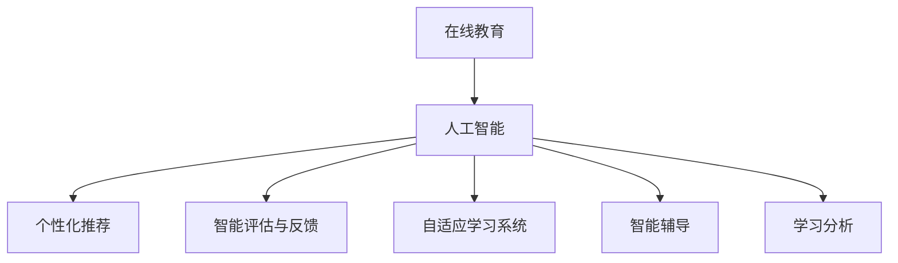

                 

# 在线教育创业：终身学习的推动者

> 关键词：在线教育,终身学习,人工智能,个性化学习,教育技术创新,创业指南,学习平台

## 1. 背景介绍

### 1.1 问题由来
在线教育（e-Learning）自20世纪末以来，经过二十多年的发展，逐步成为全球教育领域的一大趋势。特别是在新冠疫情期间，全球范围内的学校关闭，在线教育成为了唯一可行的教学手段，极大地促进了在线教育的发展。根据《2021年全球教育报告》，全球近一半的K-12学生使用了在线学习平台，这一比例在疫情期间显著提升。

然而，尽管在线教育取得了显著进展，但其核心教育效果仍存在诸多问题。目前大多数在线教育平台主要基于传统的灌输式教学模式，学生学习的主动性和个性化需求难以得到满足。而人工智能技术的发展，为在线教育提供了新的突破点。

### 1.2 问题核心关键点
人工智能在在线教育中的应用，主要体现在以下几个方面：
1. **个性化推荐**：通过分析学生的学习行为、兴趣和知识水平，为每个学生量身定制个性化的学习路径和资源。
2. **智能评估与反馈**：利用自然语言处理和机器学习技术，自动评估学生的作业和考试，并给出个性化的学习建议。
3. **自适应学习系统**：结合学习者的反馈，动态调整学习内容和难度，实现实时适应的教学模式。
4. **智能辅导**：通过智能对话系统和虚拟教师，提供全天候的学习支持，解答学生疑问，提高学习效率。

### 1.3 问题研究意义
在线教育与人工智能的结合，将极大地提升教育的效果和质量，具有以下重要意义：
1. **个性化学习**：实现因材施教，每个学生都能获得最适合自己的学习体验。
2. **提高学习效率**：通过智能推荐和实时反馈，优化学习过程，节省时间和精力。
3. **拓展教育资源**：优质的教育资源不再局限于少数名校，普惠性更强。
4. **推动终身学习**：人工智能助力成人教育和职业培训，支持终身学习理念的实现。
5. **提升教育公平性**：在线教育的普及有助于缩小城乡、贫富之间的教育差距。

## 2. 核心概念与联系

### 2.1 核心概念概述

为了更好地理解人工智能在在线教育中的应用，本节将介绍几个密切相关的核心概念：

- **在线教育（e-Learning）**：指通过电子技术和网络，提供远程教育和学习的方式。包括视频授课、在线讨论、作业提交等形式。

- **人工智能（AI）**：涉及机器学习、自然语言处理、计算机视觉等多个领域，以模拟人类智能为研究目标，广泛应用于教育、医疗、金融等多个行业。

- **个性化学习（Personalized Learning）**：根据学习者的不同特点和需求，量身定制个性化学习计划和资源，实现差异化教育。

- **自适应学习系统（Adaptive Learning System）**：通过动态调整学习内容和难度，适应学习者的实时变化，提高学习效率。

- **智能评估与反馈（Smart Assessment and Feedback）**：利用AI技术自动评估学习者表现，及时给出个性化反馈，辅助学习者自我调整。

- **智能辅导（Intelligent Tutoring）**：通过智能对话系统和虚拟教师，为学习者提供实时解答和支持，增强学习体验。

- **学习分析（Learning Analytics）**：收集和分析学习数据，评估学习者的表现和进步，优化教学策略。

这些核心概念之间存在着密切的联系和相互作用，共同构成了在线教育与人工智能融合的基础。

### 2.2 核心概念原理和架构的 Mermaid 流程图



此流程图展示了在线教育与人工智能的结合路径，以及各个核心概念间的联系。从用户互动到数据反馈，再到内容调整，每一步都依赖于AI技术的支持，以实现个性化的教育目标。

## 3. 核心算法原理 & 具体操作步骤
### 3.1 算法原理概述

人工智能在在线教育中的应用，主要依赖于以下几个关键算法：

- **推荐系统算法**：通过协同过滤、内容推荐、混合推荐等多种策略，为学习者推荐个性化学习资源。
- **自然语言处理算法**：包括分词、词向量、情感分析等，用于自动评估学习者的作业和考试，生成个性化反馈。
- **强化学习算法**：通过模拟学习者的互动行为，动态调整学习内容和难度，实现自适应学习。
- **对话系统算法**：基于意图识别和序列生成模型，实现智能辅导和实时互动。

这些算法在实际应用中通常通过深度学习和机器学习框架实现，如TensorFlow、PyTorch、Scikit-learn等。

### 3.2 算法步骤详解

以下是典型的在线教育AI系统开发流程：

**Step 1: 数据收集与处理**
- 收集学习者的行为数据，如浏览记录、题目答题情况、视频观看时长等。
- 清洗和预处理数据，去除噪音和异常值，确保数据质量。

**Step 2: 模型训练与优化**
- 选择合适的模型和算法，如协同过滤、LSTM、Seq2Seq等，训练推荐系统。
- 使用监督学习或无监督学习算法，训练自然语言处理模型，如BERT、GPT等。
- 利用强化学习算法，训练自适应学习系统，优化学习路径。
- 开发对话系统算法，实现智能辅导功能。

**Step 3: 系统集成与测试**
- 将训练好的模型集成到在线教育平台，实现个性化推荐、智能评估、自适应学习等功能。
- 通过A/B测试等手段，评估系统的性能和用户体验，进行迭代优化。

**Step 4: 部署与监控**
- 将系统部署到云平台，支持大规模在线访问。
- 实时监控系统性能，设置告警机制，确保系统稳定运行。

### 3.3 算法优缺点

人工智能在在线教育中的应用具有以下优点：
1. **个性化学习**：通过算法实现个性化推荐，满足每个学习者的独特需求。
2. **高效评估**：利用自动化评估工具，快速反馈学习者的表现，及时调整学习策略。
3. **提升效率**：自动化学习过程，节省大量人工干预和重复劳动。
4. **数据驱动**：通过数据分析优化教学策略，提高教育效果。

同时，也存在一些缺点：
1. **依赖数据**：算法的准确性依赖于高质量、大量的数据，数据收集和处理成本高。
2. **算法复杂**：需要复杂的技术和算法支持，开发和维护难度较大。
3. **用户隐私**：算法需要处理大量的个人信息，可能存在隐私泄露的风险。
4. **偏见与公平性**：算法可能带有偏见，影响教育公平性。

### 3.4 算法应用领域

人工智能在在线教育中的应用领域非常广泛，包括但不限于以下方面：

- **K-12在线教育**：为中小学生提供个性化的学习路径和资源。
- **成人教育与职业培训**：为在职人员提供灵活的学习机会和支持。
- **语言学习**：利用自然语言处理技术，提供语音识别、口语评估等功能。
- **虚拟课堂**：通过虚拟教师和智能辅导，实现远程教学。
- **教育数据分析**：通过学习分析，评估教育效果和改进教学策略。

## 4. 数学模型和公式 & 详细讲解  
### 4.1 数学模型构建

在线教育AI系统的数学模型通常由以下几个模块组成：

- **推荐系统模型**：包括协同过滤模型、基于内容的推荐模型等。
- **自然语言处理模型**：包括词嵌入模型、情感分析模型等。
- **自适应学习模型**：基于强化学习的动态调整模型。
- **对话系统模型**：基于序列生成模型的智能对话系统。

### 4.2 公式推导过程

以协同过滤推荐系统为例，假设学习者集合为 $U$，物品集合为 $I$，协同矩阵为 $P$，协同矩阵的每个元素 $P_{ui}$ 表示学习者 $u$ 对物品 $i$ 的兴趣度。推荐系统的目标是最大化预测的兴趣度与实际兴趣度的匹配度。

目标函数为：

$$
\max_{\theta} \sum_{(u,i) \in U \times I} \alpha_{ui} \log \sigma(\mathbf{x}_u^\top \theta - \mathbf{x}_i^\top \theta)
$$

其中，$\sigma$ 为激活函数，$\alpha_{ui}$ 为权重系数，$\mathbf{x}_u$ 和 $\mathbf{x}_i$ 为物品和用户的特征向量。

### 4.3 案例分析与讲解

假设有一个在线教育平台，需要为用户推荐课程和视频。平台收集了1000个学习者的行为数据，每个学习者观看了20个课程和30个视频。通过协同过滤模型，对学习者的兴趣度进行建模和预测。具体步骤如下：

1. 构建用户-物品矩阵 $P$，将学习者的课程观看次数和视频观看次数作为用户-物品矩阵的元素。
2. 对矩阵进行归一化处理，确保元素值在0到1之间。
3. 利用模型参数 $\theta$，对用户和物品的特征进行编码。
4. 将编码结果输入神经网络，输出预测的兴趣度。
5. 使用均方误差损失函数，计算预测结果与实际兴趣度的差距。
6. 通过反向传播算法，更新模型参数 $\theta$，最小化损失函数。

## 5. 项目实践：代码实例和详细解释说明
### 5.1 开发环境搭建

在进行在线教育AI系统开发前，我们需要准备好开发环境。以下是使用Python进行TensorFlow开发的環境配置流程：

1. 安装Anaconda：从官网下载并安装Anaconda，用于创建独立的Python环境。

2. 创建并激活虚拟环境：
```bash
conda create -n tensorflow-env python=3.8 
conda activate tensorflow-env
```

3. 安装TensorFlow：根据CUDA版本，从官网获取对应的安装命令。例如：
```bash
conda install tensorflow=2.7 -c conda-forge -c pytorch -c anaconda
```

4. 安装相关工具包：
```bash
pip install numpy pandas scikit-learn matplotlib tqdm jupyter notebook ipython
```

完成上述步骤后，即可在`tensorflow-env`环境中开始开发实践。

### 5.2 源代码详细实现

下面我们以推荐系统为例，给出使用TensorFlow进行在线教育推荐系统的PyTorch代码实现。

首先，定义推荐系统的数据处理函数：

```python
import pandas as pd
import numpy as np
from sklearn.model_selection import train_test_split
from sklearn.preprocessing import MinMaxScaler

def preprocess_data(data):
    # 数据预处理，填充缺失值，归一化等
    return data.fillna(0).apply(lambda x: x.fillna(0))
```

然后，定义模型和优化器：

```python
import tensorflow as tf
from tensorflow.keras.layers import Input, Dense, Embedding, dot
from tensorflow.keras.models import Model

# 定义模型结构
def create_model(input_dim, hidden_dim):
    user_input = Input(shape=(1,))
    item_input = Input(shape=(1,))
    user_embedding = Embedding(input_dim, hidden_dim, input_length=1)(user_input)
    item_embedding = Embedding(input_dim, hidden_dim, input_length=1)(item_input)
    dot_product = dot([user_embedding, item_embedding], axes=1)
    score = Dense(1, activation='sigmoid')(dot_product)
    model = Model([user_input, item_input], score)
    return model

# 训练函数
def train_model(model, X_train, y_train, X_test, y_test, batch_size=64, epochs=10, verbose=0):
    # 定义损失函数和优化器
    loss = tf.keras.losses.BinaryCrossentropy()
    optimizer = tf.keras.optimizers.Adam()
    
    # 训练模型
    model.compile(optimizer=optimizer, loss=loss, metrics=['accuracy'])
    history = model.fit(X_train, y_train, batch_size=batch_size, epochs=epochs, validation_data=(X_test, y_test), verbose=verbose)
    return model, history
```

接着，定义训练和评估函数：

```python
from sklearn.metrics import roc_auc_score, roc_curve

def evaluate_model(model, X_test, y_test):
    # 预测并评估模型
    y_pred = model.predict(X_test)[:, 0]
    auc = roc_auc_score(y_test, y_pred)
    fpr, tpr, thresholds = roc_curve(y_test, y_pred)
    return auc, fpr, tpr, thresholds
```

最后，启动训练流程并在测试集上评估：

```python
# 加载数据
data = pd.read_csv('data.csv')
X = data[['user_id', 'item_id']]
y = data['interest']

# 数据预处理
X = preprocess_data(X)
X_train, X_test, y_train, y_test = train_test_split(X, y, test_size=0.2, random_state=42)

# 定义模型
model = create_model(input_dim=10000, hidden_dim=128)

# 训练模型
model, history = train_model(model, X_train, y_train, X_test, y_test)

# 评估模型
auc, fpr, tpr, thresholds = evaluate_model(model, X_test, y_test)
print(f'ROC AUC: {auc:.4f}')
```

以上就是使用TensorFlow进行在线教育推荐系统的完整代码实现。可以看到，TensorFlow提供了丰富的深度学习API，使得模型开发和训练变得简单易行。

### 5.3 代码解读与分析

让我们再详细解读一下关键代码的实现细节：

**preprocess_data函数**：
- 数据预处理，包括缺失值填充和归一化，确保数据质量。

**create_model函数**：
- 定义了协同过滤推荐系统的模型结构，包含用户嵌入和物品嵌入，通过点积计算预测兴趣度，并使用 sigmoid 函数进行二分类。

**train_model函数**：
- 定义了二分类损失函数和优化器，使用交叉熵损失和Adam优化器进行模型训练。
- 通过keras API训练模型，并返回训练结果。

**evaluate_model函数**：
- 使用ROC曲线和AUC指标评估模型的预测性能。
- 计算真正率（TPR）和假正率（FPR），用于可视化模型性能。

**主程序**：
- 加载数据集，进行预处理和划分。
- 定义并训练模型，使用AUC作为评估指标。

可以看到，TensorFlow的高级API大大简化了深度学习模型的开发和训练流程，使开发者能够快速迭代和优化模型。

## 6. 实际应用场景
### 6.1 智能推荐系统

智能推荐系统是在线教育AI应用的核心之一。通过分析用户的行为数据，推荐系统能够自动为用户推荐最合适的课程和视频，提高学习效率。例如，某在线教育平台通过分析学生的浏览记录、视频观看次数等数据，利用协同过滤和基于内容的推荐策略，为用户推荐个性化学习资源。

### 6.2 智能评估与反馈

智能评估与反馈系统能够实时监控和分析学生的学习情况，提供个性化的学习建议和改进意见。例如，某在线教育平台利用自然语言处理技术，对学生的作业和考试进行自动评估，生成详细的评分报告和反馈信息，帮助学生发现问题并改进。

### 6.3 自适应学习系统

自适应学习系统通过动态调整学习内容和难度，实现实时适应的教学模式。例如，某在线教育平台开发了自适应学习系统，根据学生的学习进度和表现，动态调整课程难度和资源，帮助学生更好地掌握知识。

### 6.4 虚拟课堂与智能辅导

虚拟课堂和智能辅导系统利用AI技术，为学生提供全天候的学习支持。例如，某在线教育平台开发了虚拟教师和智能对话系统，能够实时解答学生的问题，提供个性化辅导，增强学习体验。

## 7. 工具和资源推荐
### 7.1 学习资源推荐

为了帮助开发者系统掌握在线教育AI技术，这里推荐一些优质的学习资源：

1. 《Python深度学习》系列博文：由大模型技术专家撰写，深入浅出地介绍了深度学习在在线教育中的应用。

2. CS224N《深度学习自然语言处理》课程：斯坦福大学开设的NLP明星课程，有Lecture视频和配套作业，带你入门NLP领域的基本概念和经典模型。

3. 《在线教育与人工智能》书籍：系统介绍了在线教育的现状和挑战，以及AI技术如何助力在线教育发展。

4. Udacity《深度学习专业》课程：涵盖深度学习的基础知识和应用，包括自然语言处理、计算机视觉等多个领域。

5. Coursera《机器学习》课程：由Andrew Ng主讲，系统讲解了机器学习的理论和方法，适合入门和进阶学习。

通过对这些资源的学习实践，相信你一定能够快速掌握在线教育AI技术的精髓，并用于解决实际的NLP问题。

### 7.2 开发工具推荐

高效的开发离不开优秀的工具支持。以下是几款用于在线教育AI开发常用的工具：

1. TensorFlow：基于Python的开源深度学习框架，灵活动态的计算图，适合快速迭代研究。

2. PyTorch：基于Python的开源深度学习框架，易于使用和调试，适合科研和工程应用。

3. Scikit-learn：基于Python的机器学习库，提供丰富的算法和工具，适合快速原型开发和数据分析。

4. Jupyter Notebook：开源的交互式笔记本环境，方便编写和执行代码，可视化结果，适合快速迭代开发。

5. Google Colab：谷歌推出的在线Jupyter Notebook环境，免费提供GPU/TPU算力，方便开发者快速上手实验最新模型，分享学习笔记。

合理利用这些工具，可以显著提升在线教育AI任务的开发效率，加快创新迭代的步伐。

### 7.3 相关论文推荐

在线教育与人工智能的研究源于学界的持续研究。以下是几篇奠基性的相关论文，推荐阅读：

1. "Collaborative Filtering for E-Learning: A Recommendation System Approach"：提出了协同过滤算法在在线教育推荐系统中的应用。

2. "Personalized Learning Analytics: A Data-Driven Approach to Curriculum Development"：探讨了个性化学习分析如何辅助课程开发和评估。

3. "Deep Learning for Smart Education: A Survey"：系统综述了深度学习在智能教育中的应用。

4. "Towards a Universal AI-Based Intelligent Tutoring System"：介绍了基于AI的智能辅导系统的设计与实现。

5. "Online Learning with Adaptive Learning Systems"：分析了自适应学习系统的理论基础和实际应用。

这些论文代表了大语言模型微调技术的发展脉络。通过学习这些前沿成果，可以帮助研究者把握学科前进方向，激发更多的创新灵感。

## 8. 总结：未来发展趋势与挑战

### 8.1 总结

本文对在线教育与人工智能的结合进行了全面系统的介绍。首先阐述了在线教育AI的应用背景和意义，明确了AI技术在个性化推荐、智能评估、自适应学习等方面的价值。其次，从原理到实践，详细讲解了推荐系统、自然语言处理、强化学习等核心算法的具体实现步骤。同时，本文还广泛探讨了AI技术在在线教育中的实际应用场景，展示了AI技术在教育领域的巨大潜力。最后，本文精选了在线教育AI的学习资源、开发工具和相关论文，力求为读者提供全方位的技术指引。

通过本文的系统梳理，可以看到，在线教育与人工智能的结合，将极大地提升教育的效果和质量，具有重要的研究价值和应用前景。未来，伴随技术的不断演进和普及，在线教育有望实现更加个性化、高效化和公平化的教育目标。

### 8.2 未来发展趋势

展望未来，在线教育与人工智能的结合将呈现以下几个发展趋势：

1. **智能化的自适应学习**：通过深度学习和强化学习，实现更加智能化的自适应学习系统，根据学生的实时表现动态调整学习内容。
2. **跨领域的知识整合**：将AI技术与知识图谱、逻辑规则等专家知识结合，提升学习系统的普适性和知识深度。
3. **虚拟现实与增强现实**：利用VR/AR技术，实现沉浸式学习体验，提高学习者的参与度和兴趣。
4. **多模态交互**：结合语音、视觉、文本等多种模态的输入输出，实现更加丰富和自然的学习交互方式。
5. **分布式学习系统**：通过区块链和分布式技术，构建去中心化的在线教育平台，提高教育的公平性和可访问性。

以上趋势凸显了在线教育与AI技术的广阔前景。这些方向的探索发展，必将进一步提升在线教育系统的性能和应用范围，为学习者带来更优质的教育体验。

### 8.3 面临的挑战

尽管在线教育与AI技术的结合取得了显著进展，但在迈向更加智能化、普适化应用的过程中，仍面临诸多挑战：

1. **数据隐私与安全**：在线教育涉及大量的学生数据，数据隐私与安全问题不容忽视。
2. **教育公平性**：如何确保在线教育系统在不同地区、不同群体的普及，减少数字鸿沟。
3. **算法透明度与可解释性**：AI系统的决策过程难以解释，如何提高算法的透明度和可解释性。
4. **技术普及与培训**：如何将AI技术普及到教育领域，培养更多掌握AI技术的教育工作者。
5. **课程设计与评估**：如何设计合理的课程和评估指标，确保在线教育的效果和质量。

### 8.4 研究展望

面对在线教育与AI技术面临的挑战，未来的研究需要在以下几个方面寻求新的突破：

1. **隐私保护技术**：研究基于区块链和联邦学习等技术的隐私保护方法，确保学生数据的安全性。
2. **公平性算法**：开发公平性优先的推荐算法，确保在线教育系统的普及性。
3. **可解释性增强**：通过可视化、符号推理等方法，增强AI系统的可解释性和透明度。
4. **多模态学习模型**：构建多模态学习模型，提升学习体验和效果。
5. **知识图谱整合**：将知识图谱与学习系统结合，实现更加全面和深入的知识整合。

这些研究方向的探索，必将引领在线教育与AI技术走向成熟，为构建安全、可靠、可解释、可控的智能教育系统铺平道路。面向未来，在线教育与AI技术的融合将迎来更多创新和突破，为教育事业的发展注入新的动力。

## 9. 附录：常见问题与解答

**Q1：在线教育AI技术对教育有什么影响？**

A: 在线教育AI技术能够显著提升教育的效果和质量，具体表现如下：
1. **个性化学习**：根据学生的不同特点和需求，量身定制个性化的学习计划和资源，实现因材施教。
2. **高效评估**：利用自动化评估工具，快速反馈学习者的表现，及时调整学习策略。
3. **提升效率**：自动化学习过程，节省大量人工干预和重复劳动。
4. **数据驱动**：通过数据分析优化教学策略，提高教育效果。

**Q2：如何评估在线教育AI系统的性能？**

A: 在线教育AI系统的性能可以通过以下几个指标进行评估：
1. **准确率（Accuracy）**：学习资源推荐的准确性和有效性。
2. **用户满意度（User Satisfaction）**：用户对系统的满意度调查。
3. **学习效率（Learning Efficiency）**：学习者完成课程和任务的时间与质量。
4. **学生参与度（Student Engagement）**：学习者与系统互动的频率和深度。

**Q3：在线教育AI技术的开发难点是什么？**

A: 在线教育AI技术的开发难点主要在于以下几个方面：
1. **数据收集与处理**：高质量数据是AI系统的基础，但数据收集和处理成本高。
2. **算法复杂性**：AI算法通常较为复杂，需要丰富的技术和工具支持。
3. **用户隐私**：处理学生数据时需要考虑隐私和伦理问题。
4. **技术普及**：如何将AI技术普及到教育领域，培养更多掌握AI技术的教育工作者。

**Q4：在线教育AI技术的应用场景有哪些？**

A: 在线教育AI技术的应用场景非常广泛，包括但不限于以下方面：
1. **K-12在线教育**：为中小学生提供个性化的学习路径和资源。
2. **成人教育与职业培训**：为在职人员提供灵活的学习机会和支持。
3. **语言学习**：利用自然语言处理技术，提供语音识别、口语评估等功能。
4. **虚拟课堂**：通过虚拟教师和智能辅导，实现远程教学。
5. **教育数据分析**：通过学习分析，评估教育效果和改进教学策略。

通过这些问题的解答，可以看出在线教育AI技术的应用前景和挑战，为未来的研究和实践提供了重要参考。

---

作者：禅与计算机程序设计艺术 / Zen and the Art of Computer Programming

