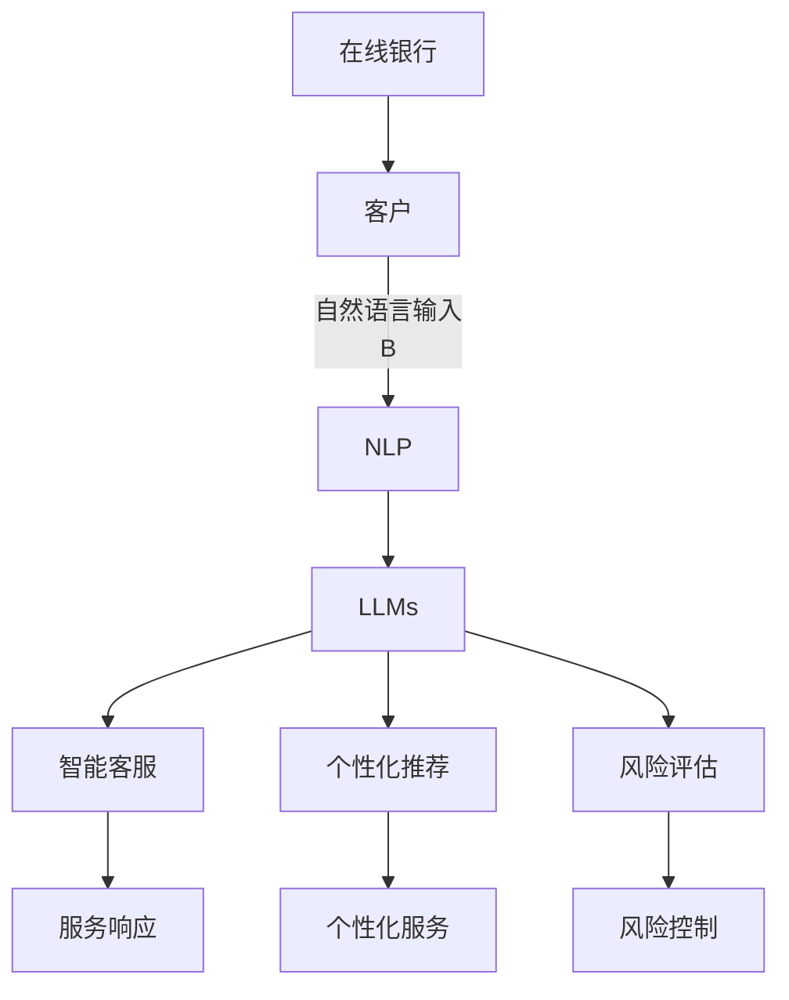

                 

# 在线银行与 LLM：数字金融新体验

> 关键词：在线银行,自然语言处理(NLP),大语言模型(LLM),金融科技,用户体验,风险管理

## 1. 背景介绍

在数字化时代，金融科技（Fintech）正以前所未有的速度改变着传统银行业务的运营模式。特别是随着人工智能和大数据技术的进步，金融服务的在线化、智能化和个性化已成为趋势。在线银行作为金融科技的重要应用，已经成为客户进行交易、查询、咨询、投诉等各类金融活动的重要渠道。

然而，尽管在线银行提供了诸多便利，但服务质量、用户体验、风险控制等问题仍需进一步优化。传统的自动化客服系统、推荐系统、风险评估模型等，往往依赖于预设的规则和模板，缺乏足够的灵活性和自适应能力。为了提高服务的智能化水平，在线银行迫切需要引入更加强大、灵活的语言处理技术，以更好地理解和处理用户的自然语言输入。

近年来，自然语言处理（Natural Language Processing, NLP）领域迎来了突破性的进展。大语言模型（Large Language Models, LLMs）如GPT-3、BERT、T5等，通过在大量无标签文本数据上进行自监督预训练，具备了处理自然语言的强大能力。在线银行可以利用这些大语言模型，提升自然语言理解和生成能力，为用户带来更加流畅、智能的数字金融体验。

本文旨在探讨如何利用大语言模型优化在线银行服务，通过NLP技术提升用户体验，同时加强风险管理，推动数字金融向更高层次发展。

## 2. 核心概念与联系

### 2.1 核心概念概述

在线银行和自然语言处理紧密相关。在线银行需要处理客户的自然语言输入，如问题咨询、账户管理、交易请求等，从而提供智能客服、个性化推荐、风险评估等服务。而自然语言处理，特别是大语言模型，具备从大量自然语言文本中学习语言表示、理解上下文、生成自然语言等能力，能够在在线银行中发挥重要作用。

1. **大语言模型（LLMs）**：以自回归模型（如GPT）或自编码模型（如BERT）为代表的深度神经网络模型，通过在大规模无标签文本语料上预训练，学习通用语言表示，具备强大的语言理解和生成能力。

2. **自然语言处理（NLP）**：涉及语言理解、生成、分析、翻译等任务的计算技术。NLP技术可以帮助在线银行理解和处理用户的自然语言输入，提升服务质量。

3. **在线银行**：提供在线交易、查询、咨询、投诉等各类金融活动的银行服务模式，已成为数字金融的重要组成部分。

4. **金融科技（Fintech）**：利用信息科技手段改进金融业务和金融服务的科技创新，在线银行是金融科技的重要应用。

### 2.2 核心概念原理和架构的 Mermaid 流程图



此图展示了在线银行服务中自然语言处理和大语言模型的联系。客户通过自然语言输入提出需求，NLP系统将其转化为机器可理解的形式，通过大语言模型进行理解和处理，最终生成智能客服响应、个性化推荐、风险评估结果，实现银行服务的智能化和个性化。

## 3. 核心算法原理 & 具体操作步骤

### 3.1 算法原理概述

在线银行中，大语言模型主要应用于以下几个关键场景：

1. **智能客服**：通过NLP和大语言模型，实现自然语言理解和生成，提供7x24小时不间断的智能客服支持。
2. **个性化推荐**：利用大语言模型分析客户的历史行为和偏好，提供个性化的金融产品和服务推荐。
3. **风险评估**：使用大语言模型对客户的文本信息进行情感分析、实体识别等处理，辅助风险评估和管理。

### 3.2 算法步骤详解

1. **数据收集与预处理**：
   - 收集银行历史客户互动数据，包括聊天记录、交易记录、投诉记录等。
   - 对收集到的数据进行清洗、标注，形成训练数据集。
   - 使用大语言模型的预训练模型进行微调，适应在线银行的特定场景。

2. **模型微调**：
   - 选择合适的预训练大语言模型（如GPT-3、BERT），进行微调。
   - 在微调过程中，选择适当的损失函数（如交叉熵损失）和优化器（如AdamW）。
   - 设置合适的学习率和超参数，进行梯度下降训练。

3. **部署与集成**：
   - 将微调后的模型部署到在线银行系统中，集成到自然语言处理引擎中。
   - 设计接口，使模型能够接收自然语言输入，输出对应的智能客服响应、个性化推荐、风险评估结果。

### 3.3 算法优缺点

#### 优点：
- **高效智能化**：大语言模型能够处理复杂的自然语言输入，提供高效、智能的服务。
- **个性化推荐**：通过分析客户行为，提供更加个性化的金融产品推荐。
- **风险控制**：使用情感分析、实体识别等技术，辅助风险评估和管理。

#### 缺点：
- **数据依赖**：模型性能依赖于训练数据的数量和质量。
- **鲁棒性不足**：面对新的、未见过的输入，模型的泛化能力可能较弱。
- **计算资源需求高**：大语言模型需要大量的计算资源进行预训练和微调。

### 3.4 算法应用领域

1. **智能客服**：在客户服务中，通过大语言模型处理自然语言输入，提供快速、准确、个性化的服务。
2. **风险管理**：利用大语言模型进行文本分析，辅助风险评估和监控。
3. **金融产品推荐**：根据客户行为和偏好，提供个性化的金融产品推荐。
4. **交易监测**：使用大语言模型进行情感分析和实体识别，监测交易异常。
5. **合同管理**：利用大语言模型处理合同文本，进行自动审核和归档。

## 4. 数学模型和公式 & 详细讲解 & 举例说明

### 4.1 数学模型构建

假设在线银行中存在一个基于大语言模型的智能客服系统。客户输入自然语言 $x$，系统输出智能客服响应 $y$。模型通过最小化损失函数 $L$ 进行训练，以优化模型参数 $\theta$。

$$
\theta = \mathop{\arg\min}_{\theta} L(y, M_{\theta}(x))
$$

其中 $M_{\theta}$ 为预训练后的大语言模型，$L$ 为损失函数。常见的损失函数包括交叉熵损失、均方误差损失等。

### 4.2 公式推导过程

以交叉熵损失函数为例，对于单个样本 $(x_i, y_i)$，损失函数 $L$ 定义为：

$$
L(y_i, M_{\theta}(x_i)) = -\sum_{j=1}^K y_{ij} \log M_{\theta}(x_i, j)
$$

其中 $K$ 为分类数，$y_{ij}$ 为第 $i$ 个样本在第 $j$ 个类别上的真实标签，$M_{\theta}(x_i, j)$ 为模型在第 $j$ 个类别上的输出概率。

在梯度下降更新模型参数时，对于单个样本的梯度为：

$$
\nabla_{\theta} L = -\sum_{j=1}^K y_{ij} \frac{1}{M_{\theta}(x_i, j)} \nabla_{\theta} M_{\theta}(x_i, j)
$$

其中 $\nabla_{\theta} M_{\theta}(x_i, j)$ 为模型输出概率关于参数 $\theta$ 的梯度。

### 4.3 案例分析与讲解

假设在线银行希望通过大语言模型进行智能客服，解决客户关于账户余额查询的问题。可以收集银行历史客服聊天记录，将问题-答案对作为微调数据，训练模型学习回答各种余额查询。

- **数据准备**：收集历史聊天记录，标注问题和答案，形成训练数据集。
- **模型微调**：使用GPT-3等预训练模型，微调适应余额查询任务。
- **模型评估**：在验证集上评估模型性能，选择表现最佳的模型进行部署。
- **服务集成**：将微调后的模型集成到在线银行系统中，实时处理客户输入，提供快速准确的余额查询服务。

## 5. 项目实践：代码实例和详细解释说明

### 5.1 开发环境搭建

1. **安装Python**：在Python 3.8及以上版本的环境下进行开发。
2. **安装依赖**：使用pip安装transformers、torch等必要的依赖库。
3. **配置环境**：使用Jupyter Notebook或PyCharm等IDE进行开发。

### 5.2 源代码详细实现

下面以一个简单的示例，展示如何使用HuggingFace的transformers库进行GPT-3微调：

```python
from transformers import AutoTokenizer, AutoModelForCausalLM, AdamW, get_linear_schedule_with_warmup
import torch

# 加载预训练模型和分词器
model_name = 'gpt3'
tokenizer = AutoTokenizer.from_pretrained(model_name)
model = AutoModelForCausalLM.from_pretrained(model_name)

# 定义损失函数和优化器
loss_fn = torch.nn.CrossEntropyLoss()
optimizer = AdamW(model.parameters(), lr=1e-5)
scheduler = get_linear_schedule_with_warmup(optimizer, num_warmup_steps=0, num_training_steps=-1)

# 加载训练数据
train_data = ...
train_labels = ...

# 微调模型
model.train()
for epoch in range(epochs):
    optimizer.zero_grad()
    outputs = model(input_ids, labels=train_labels)
    loss = loss_fn(outputs.logits, train_labels)
    loss.backward()
    optimizer.step()
    scheduler.step()
```

### 5.3 代码解读与分析

上述代码展示了使用GPT-3进行微调的基本流程：

1. **加载模型和分词器**：使用transformers库加载预训练的GPT-3模型和对应的分词器。
2. **定义损失函数和优化器**：选择交叉熵损失函数和AdamW优化器，并配置学习率。
3. **加载训练数据**：加载训练数据集和标签。
4. **微调模型**：在模型上进行前向传播和反向传播，更新模型参数。

在实际项目中，还需要考虑更多的细节，如模型评估、模型保存、模型部署等。

### 5.4 运行结果展示

运行上述代码后，可以观察到模型参数的更新情况，评估模型的性能，并保存微调后的模型以备后续使用。

## 6. 实际应用场景

### 6.1 智能客服系统

智能客服系统是在线银行中不可或缺的部分，能够提供7x24小时不间断的客户服务。使用大语言模型进行微调，可以实现智能客服的自主学习与适应，提升服务质量。

具体应用如下：

1. **问题分类与响应**：将客户提出的问题分类，针对不同类别提供个性化的回答。
2. **多轮对话**：通过上下文理解和生成技术，实现多轮对话，提供更加细致的服务。
3. **情感分析**：分析客户情绪，及时响应客户需求，提升用户体验。

### 6.2 个性化推荐系统

个性化推荐系统可以帮助客户发现更多的金融产品，提高银行服务的多样性和满意度。使用大语言模型进行微调，可以分析客户行为和偏好，提供个性化的产品推荐。

具体应用如下：

1. **行为分析**：通过自然语言处理技术，分析客户的查询记录、交易记录、评论记录等，提取客户的偏好和需求。
2. **产品推荐**：根据客户行为分析结果，推荐符合客户需求的金融产品。
3. **用户反馈**：通过用户的反馈，不断调整推荐策略，提升推荐效果。

### 6.3 风险管理

在线银行需要面对各种金融风险，如欺诈、洗钱、违约等。使用大语言模型进行微调，可以提高风险评估和管理的效率和准确性。

具体应用如下：

1. **文本分析**：通过情感分析、实体识别等技术，分析客户的交易记录、投诉记录等文本数据，识别潜在的风险点。
2. **行为监测**：根据客户行为分析，及时发现异常行为，进行风险预警。
3. **决策支持**：结合其他风险管理工具，提供决策支持，优化风险管理流程。

## 7. 工具和资源推荐

### 7.1 学习资源推荐

1. **《NLP基础》课程**：介绍自然语言处理的基础知识，包括文本预处理、语言模型、序列标注等。
2. **《深度学习与自然语言处理》课程**：介绍深度学习在自然语言处理中的应用，涵盖词向量、RNN、LSTM等模型。
3. **《Transformers权威指南》书籍**：详细介绍Transformer模型和预训练技术，适合深度学习初学者。
4. **HuggingFace官方文档**：提供丰富的模型和工具使用指南，帮助开发者快速上手微调大语言模型。
5. **CLUE开源项目**：提供中文语言理解测评基准，涵盖大量NLP数据集和预训练模型，助力中文NLP技术发展。

### 7.2 开发工具推荐

1. **PyTorch**：基于Python的开源深度学习框架，灵活的计算图，适合快速迭代研究。
2. **TensorFlow**：由Google主导开发的开源深度学习框架，生产部署方便，适合大规模工程应用。
3. **transformers库**：HuggingFace开发的NLP工具库，集成了众多预训练模型，支持PyTorch和TensorFlow，是进行微调任务开发的利器。
4. **Weights & Biases**：模型训练的实验跟踪工具，记录和可视化模型训练过程中的各项指标，方便对比和调优。
5. **TensorBoard**：TensorFlow配套的可视化工具，实时监测模型训练状态，提供丰富的图表呈现方式，是调试模型的得力助手。

### 7.3 相关论文推荐

1. **《Attention is All You Need》**：提出Transformer结构，开启了NLP领域的预训练大模型时代。
2. **《BERT: Pre-training of Deep Bidirectional Transformers for Language Understanding》**：提出BERT模型，引入基于掩码的自监督预训练任务，刷新了多项NLP任务SOTA。
3. **《Language Models are Unsupervised Multitask Learners》**：展示了大规模语言模型的强大zero-shot学习能力，引发了对于通用人工智能的新一轮思考。
4. **《Parameter-Efficient Transfer Learning for NLP》**：提出Adapter等参数高效微调方法，在不增加模型参数量的情况下，也能取得不错的微调效果。
5. **《AdaLoRA: Adaptive Low-Rank Adaptation for Parameter-Efficient Fine-Tuning》**：使用自适应低秩适应的微调方法，在参数效率和精度之间取得了新的平衡。

这些论文代表了大语言模型微调技术的发展脉络。通过学习这些前沿成果，可以帮助研究者把握学科前进方向，激发更多的创新灵感。

## 8. 总结：未来发展趋势与挑战

### 8.1 总结

本文对大语言模型在在线银行中的应用进行了全面系统的介绍。通过自然语言处理技术，在线银行可以提升服务的智能化水平，提升用户体验，同时加强风险管理，推动数字金融向更高层次发展。

通过本文的系统梳理，可以看到，大语言模型在金融服务中具备广阔的应用前景，能够处理复杂的自然语言输入，提供高效、智能的服务。然而，大语言模型也面临一些挑战，如数据依赖、鲁棒性不足、计算资源需求高等问题。未来，随着技术的不断进步和应用场景的拓展，大语言模型有望在在线银行中发挥更加重要的作用，推动数字金融向智能化、普适化发展。

### 8.2 未来发展趋势

展望未来，大语言模型在在线银行中的应用将呈现以下几个发展趋势：

1. **智能化水平提升**：随着大语言模型技术的进步，在线银行的智能化水平将进一步提升，能够更好地理解和处理客户的需求。
2. **多模态融合**：未来，在线银行将更多地引入图像、视频等多模态数据，进行多模态融合，提升服务的全面性和丰富性。
3. **个性化服务深化**：通过大语言模型的微调，在线银行能够提供更加个性化的金融产品和服务，提升客户满意度。
4. **风险管理加强**：大语言模型能够进行情感分析、实体识别等处理，辅助风险评估和管理，提升金融服务的安全性。
5. **实时性提升**：通过优化模型结构和计算图，大语言模型的实时性将进一步提升，能够实现更快速的金融服务响应。

### 8.3 面临的挑战

尽管大语言模型在在线银行中具备广阔的应用前景，但仍面临一些挑战：

1. **数据隐私问题**：在线银行需要处理大量的客户数据，如何在保护数据隐私的同时，充分利用数据进行模型训练，是一个重要的问题。
2. **安全性风险**：大语言模型可能面临被恶意利用的风险，如何保护模型的安全性，是一个亟待解决的问题。
3. **模型解释性不足**：大语言模型的决策过程缺乏可解释性，对于高风险应用，模型的可解释性和可审计性尤为重要。
4. **计算资源需求高**：大语言模型需要大量的计算资源进行预训练和微调，如何降低计算成本，是一个需要解决的问题。
5. **跨模态数据融合**：多模态数据的融合和处理，是一个复杂的挑战，需要开发新的技术和方法。

### 8.4 研究展望

未来，研究者需要在以下几个方面继续深入探索：

1. **跨模态数据融合**：开发更加高效、通用的跨模态数据融合技术，提升在线银行的智能化水平。
2. **模型解释性增强**：研究如何增强大语言模型的解释性，使其能够提供更加透明、可解释的决策过程。
3. **安全性提升**：开发安全性和鲁棒性更强的大语言模型，防止模型的滥用。
4. **跨领域迁移学习**：研究如何利用大语言模型的跨领域迁移学习能力，提升模型的泛化能力和适应性。
5. **数据隐私保护**：研究如何在保护数据隐私的前提下，充分利用数据进行模型训练，提升模型的性能。

通过这些方向的研究，大语言模型在在线银行中的应用将更加广泛和深入，推动数字金融向更高层次发展。

## 9. 附录：常见问题与解答

**Q1: 在线银行应用大语言模型，数据隐私如何保护？**

A: 在线银行在应用大语言模型时，需要严格遵守数据隐私保护法规，如GDPR、CCPA等。可以通过以下措施保护数据隐私：

1. **数据脱敏**：对敏感数据进行脱敏处理，如去标识化、匿名化等，保护客户隐私。
2. **访问控制**：设置严格的访问控制机制，确保只有授权人员可以访问敏感数据。
3. **差分隐私**：采用差分隐私技术，在保护隐私的同时，充分利用数据进行模型训练。

**Q2: 在线银行应用大语言模型，安全性如何保障？**

A: 在线银行在应用大语言模型时，需要考虑以下安全措施：

1. **模型审计**：定期对模型进行审计，发现潜在的漏洞和安全风险。
2. **对抗训练**：通过引入对抗样本，提高模型的鲁棒性和安全性。
3. **数据加密**：对传输和存储的数据进行加密，防止数据泄露。
4. **异常检测**：采用异常检测技术，及时发现异常行为，进行风险预警。

**Q3: 在线银行应用大语言模型，如何提升模型解释性？**

A: 大语言模型的解释性是其应用的重要挑战之一。可以通过以下措施提升模型的解释性：

1. **可解释模型**：开发可解释模型，如LIME、SHAP等，帮助用户理解模型的决策过程。
2. **知识图谱**：结合知识图谱，增强模型的解释性和知识表示能力。
3. **透明度增强**：在模型训练和推理过程中，增加透明度，让用户了解模型的运作机制。

**Q4: 在线银行应用大语言模型，计算资源如何优化？**

A: 大语言模型需要大量的计算资源进行预训练和微调，可以通过以下措施优化计算资源：

1. **分布式训练**：采用分布式训练技术，利用多台计算设备并行计算，提高训练效率。
2. **量化加速**：将浮点模型转为定点模型，压缩存储空间，提高计算效率。
3. **模型压缩**：使用模型压缩技术，减小模型尺寸，降低计算需求。

通过这些措施，可以在保证性能的同时，降低计算成本，提高在线银行服务的效率和安全性。

---

作者：禅与计算机程序设计艺术 / Zen and the Art of Computer Programming

