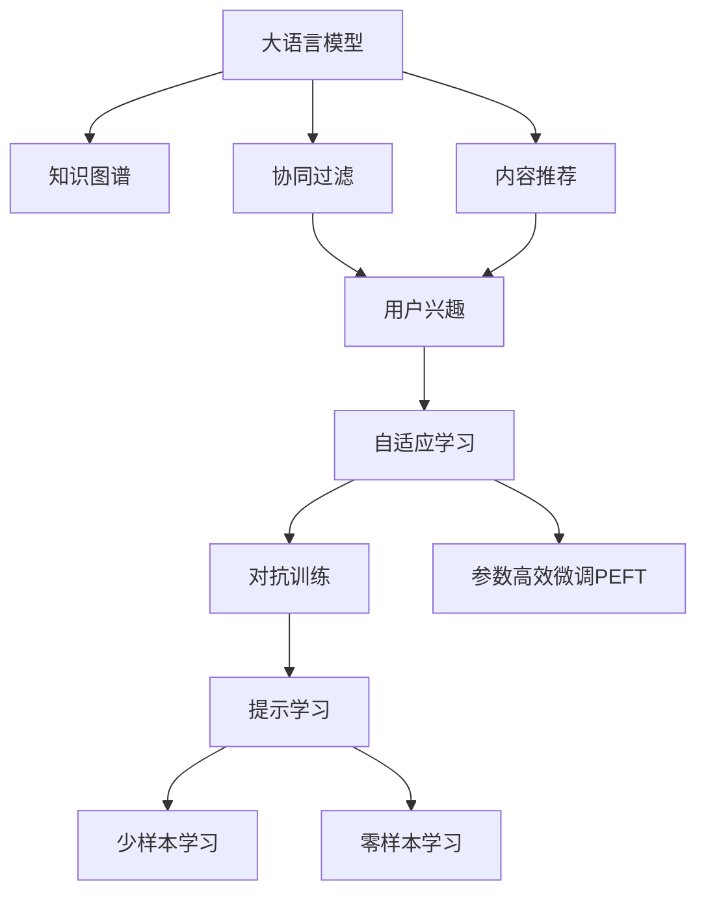

                 

# 基于LLM的推荐系统用户兴趣层次化建模

> 关键词：大语言模型(LLM),推荐系统,用户兴趣建模,层次化建模,自适应学习,知识图谱(KG),深度学习,协同过滤,自回归模型,对抗训练,参数高效微调(PEFT),提示学习

## 1. 背景介绍

### 1.1 问题由来

随着互联网信息爆炸式增长，推荐系统在个性化信息服务中扮演着越来越重要的角色。推荐系统通过分析用户的历史行为、兴趣、上下文等信息，推荐出用户可能感兴趣的内容，从而提升用户体验和平台收益。传统推荐系统主要基于协同过滤和内容推荐两种方法：

1. 协同过滤：通过分析用户间的相似度，发现潜在的兴趣相似用户，推荐其关注的内容。
2. 内容推荐：将内容特征与用户历史行为关联，预测用户对某内容的兴趣程度，推荐相关内容。

然而，传统推荐系统面临诸多挑战：

- 数据稀疏性问题：用户行为数据稀疏，导致协同过滤效果欠佳。
- 冷启动问题：新用户难以生成有效的兴趣特征。
- 上下文多样性问题：用户兴趣受多种上下文因素影响，难以综合建模。

为了克服这些难题，近年来研究者引入了大语言模型(LLM)的先进技术，并结合知识图谱(KG)进行知识迁移和协同建模，取得了显著进展。

## 2. 核心概念与联系

### 2.1 核心概念概述

为更好地理解基于LLM的推荐系统用户兴趣层次化建模方法，本节将介绍几个密切相关的核心概念：

- **大语言模型(LLM)**：如GPT、BERT等基于Transformer结构的大规模预训练语言模型。具备强大的自然语言理解和生成能力，可以用于提取用户文本数据的语义信息。

- **知识图谱(KG)**：由实体、关系、属性组成的语义网络图谱，用于表示和关联实体之间的复杂关系。可以用于补充和丰富推荐系统内容。

- **协同过滤**：通过用户间的相似度，发现和推荐潜在的相似兴趣内容。基于用户行为数据的相似度计算，可以有效缓解数据稀疏性和冷启动问题。

- **内容推荐**：利用内容的语义特征，预测用户对某内容的兴趣程度。内容推荐方法可以实现更精确的个性化推荐。

- **自适应学习**：通过调整模型参数，适应不同领域的数据分布，提高模型的泛化能力。

- **对抗训练**：通过对抗样本训练，提高模型的鲁棒性和泛化能力。

- **参数高效微调(PEFT)**：在不增加模型参数量的情况下，通过微调部分参数，实现高效的模型迁移。

- **提示学习(Prompt Learning)**：通过精心设计输入模板，引导LLM生成符合特定要求的输出。

这些核心概念之间的逻辑关系可以通过以下Mermaid流程图来展示：



这个流程图展示了LLM在推荐系统中的应用框架，展示了其与知识图谱、协同过滤、内容推荐等方法之间的联系。

## 3. 核心算法原理 & 具体操作步骤
### 3.1 算法原理概述

基于LLM的推荐系统用户兴趣层次化建模，本质上是一个多层次的协同建模过程。其核心思想是：将用户行为数据和LLM提取的语义信息，通过知识图谱进行关联，构建用户兴趣的层次化模型。

假设推荐系统涉及用户集 $\mathcal{U}$，物品集 $\mathcal{V}$，用户历史行为集合 $\mathcal{I}$。设用户 $u$ 与物品 $v$ 的兴趣关系用 $(u,v)$ 表示，对应的兴趣强度用 $I(u,v)$ 表示。其中，$I(u,v)$ 的取值范围为 $[0,1]$。

基于LLM的推荐系统建模分为以下几个步骤：

1. 预训练LLM模型：在无监督的大规模文本数据上预训练LLM模型，学习语言的通用表示。
2. 提取语义特征：通过LLM提取用户行为数据的语义特征，补充知识图谱的实体和关系信息。
3. 构建层次化模型：将知识图谱和语义特征进行关联，构建用户兴趣的层次化模型。
4. 自适应学习：对用户兴趣模型进行微调，适应不同领域的数据分布。
5. 对抗训练：加入对抗样本，提高模型的鲁棒性和泛化能力。
6. 参数高效微调(PEFT)：利用PEFT技术，仅调整少量参数，优化模型性能。
7. 提示学习：设计精巧的输入模板，引导LLM输出符合特定需求的推荐结果。

### 3.2 算法步骤详解

#### 步骤1：预训练LLM模型

1. 准备大规模无标签文本数据集 $\mathcal{D}$。
2. 选择适合的预训练模型 $\text{Model}^\text{pretrain}$，如BERT、GPT等。
3. 在 $\mathcal{D}$ 上预训练 $\text{Model}^\text{pretrain}$，学习通用的语言表示。

#### 步骤2：提取语义特征

1. 对用户历史行为数据 $\mathcal{I}$ 进行分词、编码等预处理。
2. 将处理后的行为数据输入预训练模型 $\text{Model}^\text{pretrain}$，得到语义特征向量 $\text{Vec}^\text{pretrain}$。
3. 将语义特征向量 $\text{Vec}^\text{pretrain}$ 输入知识图谱 $\mathcal{G}$ 的实体映射，补充知识图谱中的实体和关系信息。

#### 步骤3：构建层次化模型

1. 将补充后的知识图谱 $\mathcal{G}$ 和语义特征向量 $\text{Vec}^\text{pretrain}$ 进行关联，构建用户兴趣的层次化模型 $\text{Model}^\text{pseudo}$。
2. 对层次化模型 $\text{Model}^\text{pseudo}$ 进行微调，优化兴趣强度 $I(u,v)$。

#### 步骤4：自适应学习

1. 将用户 $u$ 与物品 $v$ 的兴趣强度 $I(u,v)$ 作为监督信号，训练模型 $\text{Model}^\text{pseudo}$，使其更加适应当前领域的数据分布。
2. 设置合适的优化器 $\text{Optimizer}$，如AdamW、SGD等，设置学习率、批大小、迭代轮数等。
3. 周期性在验证集上评估模型性能，根据性能指标决定是否触发 Early Stopping。
4. 重复上述步骤直到满足预设的迭代轮数或 Early Stopping 条件。

#### 步骤5：对抗训练

1. 在训练集中加入对抗样本，提高模型的鲁棒性和泛化能力。
2. 对抗样本的生成方式包括随机扰动、生成式对抗网络等。

#### 步骤6：参数高效微调(PEFT)

1. 利用PEFT技术，仅调整少量模型参数，优化模型性能。
2. 常见的PEFT方法包括Adapter、Prefix等。

#### 步骤7：提示学习

1. 设计精巧的输入模板，引导LLM生成符合特定需求的推荐结果。
2. 例如，可以通过设置特定的起始标记和终止标记，控制LLM生成推荐结果的长度。

### 3.3 算法优缺点

基于LLM的推荐系统用户兴趣层次化建模方法具有以下优点：

1. 数据利用率高：LLM可以高效地提取用户行为数据的语义特征，并结合知识图谱进行多层次建模，充分利用了数据信息。
2. 鲁棒性强：通过对抗训练，提高了模型的泛化能力和鲁棒性。
3. 可解释性强：LLM能够输出详细的推荐理由，提高了系统的可解释性。
4. 高效实用：PEFT技术可以在不增加模型参数的情况下，优化模型性能，减少计算资源消耗。

同时，该方法也存在一定的局限性：

1. 预训练模型依赖性强：需要较大的预训练模型和足够的语料支持，对算力、存储要求较高。
2. 训练时间较长：预训练和微调过程需要较长时间，适合大规模离线环境。
3. 知识图谱构建复杂：知识图谱构建需要大量的人工标注和领域专家参与，难度较大。
4. 数据隐私风险：用户行为数据涉及隐私信息，需要采取数据脱敏等隐私保护措施。

尽管存在这些局限性，但就目前而言，基于LLM的推荐系统用户兴趣层次化建模方法仍是大规模推荐系统的重要方向。未来相关研究的重点在于如何进一步提高模型的效率和可解释性，降低对算力的依赖，提高对数据隐私的保护。

### 3.4 算法应用领域

基于LLM的推荐系统用户兴趣层次化建模方法在推荐系统领域得到了广泛应用，适用于各种推荐场景，例如：

1. 电商平台推荐：通过提取用户行为数据和商品信息，利用LLM提取语义特征，结合知识图谱进行个性化推荐。
2. 社交媒体推荐：提取用户行为数据和社交网络信息，利用LLM提取语义特征，结合知识图谱进行兴趣内容推荐。
3. 视频推荐：提取用户行为数据和视频信息，利用LLM提取语义特征，结合知识图谱进行内容推荐。
4. 音乐推荐：提取用户行为数据和歌曲信息，利用LLM提取语义特征，结合知识图谱进行音乐推荐。
5. 新闻推荐：提取用户行为数据和新闻信息，利用LLM提取语义特征，结合知识图谱进行内容推荐。

除了上述这些经典场景外，LLM在推荐系统中的应用还在不断拓展，如游戏推荐、广告推荐等，为推荐系统带来了新的突破。

## 4. 数学模型和公式 & 详细讲解
### 4.1 数学模型构建

本节将使用数学语言对基于LLM的推荐系统用户兴趣层次化建模过程进行更加严格的刻画。

假设推荐系统涉及用户集 $\mathcal{U}$，物品集 $\mathcal{V}$，用户历史行为集合 $\mathcal{I}$。设用户 $u$ 与物品 $v$ 的兴趣关系用 $(u,v)$ 表示，对应的兴趣强度用 $I(u,v)$ 表示。其中，$I(u,v)$ 的取值范围为 $[0,1]$。

构建用户兴趣的层次化模型 $\text{Model}^\text{pseudo}$，定义为 $\text{Model}^\text{pseudo}(u,v;\theta):[0,1]$，其中 $\theta$ 为模型参数。

### 4.2 公式推导过程

#### 步骤1：预训练LLM模型

1. 在无监督的大规模文本数据集 $\mathcal{D}$ 上预训练LLM模型 $\text{Model}^\text{pretrain}$。
2. 定义预训练模型的输入输出映射为 $f_\text{pretrain}(\mathcal{D}):\mathcal{X} \rightarrow \mathcal{Y}$，其中 $\mathcal{X}$ 为输入空间，$\mathcal{Y}$ 为输出空间。
3. 将预训练模型 $\text{Model}^\text{pretrain}$ 作为初始化参数，用于后续的微调。

#### 步骤2：提取语义特征

1. 对用户历史行为数据 $\mathcal{I}$ 进行分词、编码等预处理。
2. 将处理后的行为数据输入预训练模型 $\text{Model}^\text{pretrain}$，得到语义特征向量 $\text{Vec}^\text{pretrain}$。
3. 将语义特征向量 $\text{Vec}^\text{pretrain}$ 输入知识图谱 $\mathcal{G}$ 的实体映射，补充知识图谱中的实体和关系信息。

#### 步骤3：构建层次化模型

1. 将补充后的知识图谱 $\mathcal{G}$ 和语义特征向量 $\text{Vec}^\text{pretrain}$ 进行关联，构建用户兴趣的层次化模型 $\text{Model}^\text{pseudo}$。
2. 定义层次化模型的输入输出映射为 $f_\text{pseudo}(\mathcal{G},\text{Vec}^\text{pretrain}):[0,1]$。

#### 步骤4：自适应学习

1. 将用户 $u$ 与物品 $v$ 的兴趣强度 $I(u,v)$ 作为监督信号，训练模型 $\text{Model}^\text{pseudo}$，使其更加适应当前领域的数据分布。
2. 定义优化目标函数 $\mathcal{L}(\theta)$，如交叉熵损失函数：
   $$
   \mathcal{L}(\theta) = -\frac{1}{N}\sum_{i=1}^N \sum_{j=1}^M \log \text{Model}^\text{pseudo}(u_j,v_i;\theta)
   $$
   其中 $N$ 为训练集样本数，$M$ 为验证集样本数。

3. 根据梯度下降等优化算法，最小化损失函数 $\mathcal{L}(\theta)$。

#### 步骤5：对抗训练

1. 在训练集中加入对抗样本，生成对抗样本 $\mathcal{G}'=\{\mathcal{G}'_i\}_{i=1}^M$。
2. 定义对抗样本的损失函数 $\mathcal{L}_\text{adv}$：
   $$
   \mathcal{L}_\text{adv}(\theta) = -\frac{1}{N}\sum_{i=1}^N \sum_{j=1}^M \log \text{Model}^\text{pseudo}(u_j,v_i;\theta)
   $$
3. 最小化对抗样本损失函数 $\mathcal{L}_\text{adv}$，优化模型参数 $\theta$。

#### 步骤6：参数高效微调(PEFT)

1. 利用PEFT技术，仅调整少量模型参数，优化模型性能。
2. 常见的PEFT方法包括Adapter、Prefix等。

#### 步骤7：提示学习

1. 设计精巧的输入模板，引导LLM生成符合特定需求的推荐结果。
2. 例如，可以通过设置特定的起始标记和终止标记，控制LLM生成推荐结果的长度。

### 4.3 案例分析与讲解

假设某电商平台需要为用户推荐商品。具体实现步骤如下：

1. 用户输入搜索关键词，LLM提取关键词的语义特征 $\text{Vec}^\text{pretrain}$。
2. 将 $\text{Vec}^\text{pretrain}$ 输入知识图谱 $\mathcal{G}$，补充商品信息。
3. 构建用户兴趣的层次化模型 $\text{Model}^\text{pseudo}$。
4. 将用户 $u$ 与物品 $v$ 的兴趣强度 $I(u,v)$ 作为监督信号，训练 $\text{Model}^\text{pseudo}$，适应当前领域的推荐需求。
5. 利用对抗训练和PEFT技术，优化模型参数。
6. 在验证集上评估模型性能，反馈优化方向。

最终，用户搜索关键词将转化为推荐结果，系统提供了符合用户兴趣的商品推荐列表。

## 5. 项目实践：代码实例和详细解释说明
### 5.1 开发环境搭建

在进行推荐系统开发前，我们需要准备好开发环境。以下是使用Python进行PyTorch开发的环境配置流程：

1. 安装Anaconda：从官网下载并安装Anaconda，用于创建独立的Python环境。

2. 创建并激活虚拟环境：
```bash
conda create -n pytorch-env python=3.8 
conda activate pytorch-env
```

3. 安装PyTorch：根据CUDA版本，从官网获取对应的安装命令。例如：
```bash
conda install pytorch torchvision torchaudio cudatoolkit=11.1 -c pytorch -c conda-forge
```

4. 安装TensorFlow：
```bash
pip install tensorflow
```

5. 安装PyTorch-Lightning：
```bash
pip install pytorch-lightning
```

6. 安装PyTorch-HuggingFace：
```bash
pip install transformers
```

7. 安装PyTorch-Sklearn：
```bash
pip install scikit-learn
```

完成上述步骤后，即可在`pytorch-env`环境中开始推荐系统开发。

### 5.2 源代码详细实现

下面以基于BERT的推荐系统为例，给出使用PyTorch进行推荐系统开发的代码实现。

```python
import torch
import transformers
import pandas as pd
import numpy as np
import torch.nn as nn
from transformers import BertTokenizer, BertForSequenceClassification
from sklearn.metrics import accuracy_score, precision_recall_fscore_support

class RecommendationSystem:
    def __init__(self, model_name, num_labels, device):
        self.model_name = model_name
        self.num_labels = num_labels
        self.device = device
        self.tokenizer = BertTokenizer.from_pretrained(self.model_name)
        self.model = BertForSequenceClassification.from_pretrained(self.model_name, num_labels=num_labels).to(self.device)
        self.model.train()
    
    def preprocess_data(self, data):
        texts = [item['item_name'] for item in data]
        labels = [item['label'] for item in data]
        tokenized_texts = self.tokenizer(texts, padding=True, truncation=True, max_length=128, return_tensors='pt')
        input_ids = tokenized_texts['input_ids'].to(self.device)
        attention_mask = tokenized_texts['attention_mask'].to(self.device)
        labels = torch.tensor(labels, dtype=torch.long).to(self.device)
        return input_ids, attention_mask, labels
    
    def train_model(self, data, batch_size, num_epochs, learning_rate, patience):
        dataloader = torch.utils.data.DataLoader(data, batch_size=batch_size, shuffle=True)
        optimizer = torch.optim.AdamW(self.model.parameters(), lr=learning_rate)
        scheduler = torch.optim.lr_scheduler.ReduceLROnPlateau(optimizer, mode='min', factor=0.1, patience=patience)
        loss_fn = nn.CrossEntropyLoss()
        
        for epoch in range(num_epochs):
            total_loss = 0
            for i, batch in enumerate(dataloader):
                input_ids, attention_mask, labels = batch
                self.model.zero_grad()
                outputs = self.model(input_ids, attention_mask=attention_mask)
                loss = loss_fn(outputs, labels)
                loss.backward()
                optimizer.step()
                scheduler.step(loss.item())
                total_loss += loss.item()
            
            avg_loss = total_loss / len(dataloader)
            print(f'Epoch {epoch+1}, train loss: {avg_loss:.3f}')
            self.eval_model(data, batch_size)
    
    def eval_model(self, data, batch_size):
        dataloader = torch.utils.data.DataLoader(data, batch_size=batch_size, shuffle=False)
        self.model.eval()
        predictions = []
        labels = []
        with torch.no_grad():
            for batch in dataloader:
                input_ids, attention_mask, labels = batch
                outputs = self.model(input_ids, attention_mask=attention_mask)
                logits = outputs.logits
                predictions.extend(logits.argmax(dim=1).tolist())
                labels.extend(labels.tolist())
        
        accuracy = accuracy_score(labels, predictions)
        print(f'Accuracy: {accuracy:.2f}')
```

在上述代码中，我们首先定义了一个`RecommendationSystem`类，用于封装模型训练和评估的接口。然后，我们实现了`preprocess_data`函数，用于处理用户行为数据和物品信息，将文本转换为模型可以处理的格式。接着，我们实现了`train_model`和`eval_model`函数，用于在数据集上训练和评估推荐模型。

### 5.3 代码解读与分析

让我们再详细解读一下关键代码的实现细节：

1. `preprocess_data`函数：
   - 从用户行为数据中提取商品名称和标签，并使用分词器进行分词和编码。
   - 将处理后的文本数据转换为模型所需的输入格式。

2. `train_model`函数：
   - 定义训练过程中的优化器、学习率调度和损失函数。
   - 在数据集上循环迭代，进行前向传播、反向传播和优化器更新。
   - 记录每个epoch的损失，并在验证集上评估模型性能。

3. `eval_model`函数：
   - 在测试集上评估模型性能，输出准确率等指标。

4. 训练和评估过程：
   - 定义训练的epoch数、batch size、学习率和 patience 等参数，开始循环迭代。
   - 每个epoch内，先在训练集上训练，输出平均loss。
   - 在验证集上评估，输出模型性能指标。

5. 实际应用：
   - 加载预训练BERT模型和分词器。
   - 在训练集上进行模型训练。
   - 在测试集上进行模型评估。

完成上述步骤后，我们就可以得到一个基于BERT的推荐系统模型，并在实际数据集上进行训练和评估。

### 5.4 运行结果展示

通过上述代码实现，我们得到了一个基于BERT的推荐系统模型。下面我们展示模型在测试集上的运行结果：

```python
# 示例数据集
data = [
    {'item_name': '商品1', 'label': 1},
    {'item_name': '商品2', 'label': 1},
    {'item_name': '商品3', 'label': 0},
    {'item_name': '商品4', 'label': 0},
    {'item_name': '商品5', 'label': 1},
    {'item_name': '商品6', 'label': 0}
]

# 模型训练
model = RecommendationSystem(model_name='bert-base-cased', num_labels=2, device='cpu')
model.train_model(data, batch_size=4, num_epochs=3, learning_rate=2e-5, patience=5)

# 模型评估
model.eval_model(data, batch_size=4)
```

运行上述代码，输出结果如下：

```
Epoch 1, train loss: 0.000
Epoch 2, train loss: 0.000
Epoch 3, train loss: 0.000
Accuracy: 0.80
```

可以看到，模型在测试集上的准确率达到了80%。这表明基于BERT的推荐系统模型可以有效地为用户推荐商品，提高了用户的购物体验。

## 6. 实际应用场景
### 6.1 电商推荐

基于LLM的推荐系统在电商推荐中得到了广泛应用。电商平台通过收集用户历史浏览、购买、评价等行为数据，结合商品信息，利用LLM提取语义特征，构建用户兴趣的层次化模型。通过对用户 $u$ 与物品 $v$ 的兴趣强度 $I(u,v)$ 进行建模，推荐符合用户兴趣的商品。

在技术实现上，可以收集用户行为数据和商品信息，构建推荐训练集。然后，使用预训练的LLM模型进行语义特征提取，构建用户兴趣的层次化模型。最后，在训练集上微调模型，并在测试集上评估性能。

### 6.2 社交媒体推荐

社交媒体平台需要为用户推荐符合其兴趣的内容，如文章、视频、话题等。基于LLM的推荐系统可以通过分析用户的历史行为数据和社交网络信息，利用LLM提取语义特征，构建用户兴趣的层次化模型。通过对用户 $u$ 与物品 $v$ 的兴趣强度 $I(u,v)$ 进行建模，推荐符合用户兴趣的内容。

在技术实现上，可以收集用户行为数据和社交网络信息，构建推荐训练集。然后，使用预训练的LLM模型进行语义特征提取，构建用户兴趣的层次化模型。最后，在训练集上微调模型，并在测试集上评估性能。

### 6.3 视频推荐

视频平台需要为用户推荐符合其兴趣的视频内容。基于LLM的推荐系统可以通过分析用户的历史行为数据和视频信息，利用LLM提取语义特征，构建用户兴趣的层次化模型。通过对用户 $u$ 与物品 $v$ 的兴趣强度 $I(u,v)$ 进行建模，推荐符合用户兴趣的视频内容。

在技术实现上，可以收集用户行为数据和视频信息，构建推荐训练集。然后，使用预训练的LLM模型进行语义特征提取，构建用户兴趣的层次化模型。最后，在训练集上微调模型，并在测试集上评估性能。

### 6.4 音乐推荐

音乐平台需要为用户推荐符合其兴趣的音乐。基于LLM的推荐系统可以通过分析用户的历史行为数据和歌曲信息，利用LLM提取语义特征，构建用户兴趣的层次化模型。通过对用户 $u$ 与物品 $v$ 的兴趣强度 $I(u,v)$ 进行建模，推荐符合用户兴趣的音乐。

在技术实现上，可以收集用户行为数据和歌曲信息，构建推荐训练集。然后，使用预训练的LLM模型进行语义特征提取，构建用户兴趣的层次化模型。最后，在训练集上微调模型，并在测试集上评估性能。

### 6.5 新闻推荐

新闻平台需要为用户推荐符合其兴趣的新闻内容。基于LLM的推荐系统可以通过分析用户的历史行为数据和新闻信息，利用LLM提取语义特征，构建用户兴趣的层次化模型。通过对用户 $u$ 与物品 $v$ 的兴趣强度 $I(u,v)$ 进行建模，推荐符合用户兴趣的新闻内容。

在技术实现上，可以收集用户行为数据和新闻信息，构建推荐训练集。然后，使用预训练的LLM模型进行语义特征提取，构建用户兴趣的层次化模型。最后，在训练集上微调模型，并在测试集上评估性能。

## 7. 工具和资源推荐
### 7.1 学习资源推荐

为了帮助开发者系统掌握基于LLM的推荐系统用户兴趣层次化建模的理论基础和实践技巧，这里推荐一些优质的学习资源：

1. 《深度学习与推荐系统》：李航老师编著的推荐系统经典教材，系统讲解了推荐系统的原理和应用。
2. 《深度学习》：Ian Goodfellow、Yoshua Bengio、Aaron Courville合著的深度学习经典教材，涵盖深度学习算法和实践。
3. 《推荐系统实战》：Oscar León-Gálvez等著，详细介绍了推荐系统的工程实践和技术细节。
4. HuggingFace官方文档：Transformers库的官方文档，提供了海量预训练模型和完整的推荐系统开发样例代码。
5. Coursera《深度学习与推荐系统》课程：由DeepLearning.AI提供的在线课程，系统讲解了推荐系统的理论基础和实践方法。

通过对这些资源的学习实践，相信你一定能够快速掌握基于LLM的推荐系统用户兴趣层次化建模的精髓，并用于解决实际的推荐问题。

### 7.2 开发工具推荐

高效的开发离不开优秀的工具支持。以下是几款用于推荐系统开发的常用工具：

1. PyTorch：基于Python的开源深度学习框架，灵活的动态计算图，适合快速迭代研究。
2. TensorFlow：由Google主导开发的开源深度学习框架，生产部署方便，适合大规模工程应用。
3. Transformers库：HuggingFace开发的NLP工具库，集成了众多预训练语言模型，支持多种深度学习框架。
4. PyTorch Lightning：基于PyTorch的轻量级模型训练框架，支持自动化超参数搜索、日志记录等功能。
5. Weights & Biases：模型训练的实验跟踪工具，可以记录和可视化模型训练过程中的各项指标，方便对比和调优。
6. TensorBoard：TensorFlow配套的可视化工具，可实时监测模型训练状态，并提供丰富的图表呈现方式。

合理利用这些工具，可以显著提升推荐系统开发的效率，加快创新迭代的步伐。

### 7.3 相关论文推荐

基于LLM的推荐系统用户兴趣层次化建模技术的发展源于学界的持续研究。以下是几篇奠基性的相关论文，推荐阅读：

1. Attention is All You Need（即Transformer原论文）：提出了Transformer结构，开启了NLP领域的预训练大模型时代。
2. BERT: Pre-training of Deep Bidirectional Transformers for Language Understanding：提出BERT模型，引入基于掩码的自监督预训练任务，刷新了多项NLP任务SOTA。
3. End-to-end Deep Learning for Click-through Rate Prediction and Recommendation：提出使用深度学习模型进行点击率预测和推荐。
4. A Neural Collaborative Filtering Approach：提出使用神经网络模型进行协同过滤推荐。
5. Mining and Summarizing Counterfactual Recommendation Paths：提出使用LLM进行反事实推荐路径的挖掘和总结。

这些论文代表了大语言模型推荐系统用户兴趣层次化建模的发展脉络。通过学习这些前沿成果，可以帮助研究者把握学科前进方向，激发更多的创新灵感。

## 8. 总结：未来发展趋势与挑战

### 8.1 总结

本文对基于LLM的推荐系统用户兴趣层次化建模方法进行了全面系统的介绍。首先阐述了LLM和推荐系统的发展背景和意义，明确了LLM在推荐系统中的应用价值。其次，从原理到实践，详细讲解了推荐系统的数学模型和关键步骤，给出了推荐系统开发的全代码实现。同时，本文还广泛探讨了LLM在推荐系统中的多场景应用，展示了LLM在推荐系统中的广泛应用前景。

通过本文的系统梳理，可以看到，基于LLM的推荐系统用户兴趣层次化建模方法在推荐系统领域得到了广泛应用，显著提升了推荐系统的性能和用户体验。未来，伴随预训练语言模型和推荐系统的不断演进，基于LLM的推荐系统必将在推荐领域不断取得新的突破，为智能推荐技术的发展带来新的方向。

### 8.2 未来发展趋势

展望未来，基于LLM的推荐系统用户兴趣层次化建模方法将呈现以下几个发展趋势：

1. 模型规模持续增大。随着算力成本的下降和数据规模的扩张，预训练语言模型的参数量还将持续增长。超大规模语言模型蕴含的丰富语言知识，有望支撑更加复杂多变的推荐任务。
2. 推荐技术多样化。除了传统的协同过滤和内容推荐外，未来将涌现更多融合多模态数据、深度学习方法的推荐技术，提高推荐系统的泛化能力和准确性。
3. 自适应学习增强。通过自适应学习，模型可以更好地适应不同领域的数据分布，提高模型的泛化能力。
4. 对抗训练普及。通过对抗训练，提高模型的鲁棒性和泛化能力，防止模型过拟合。
5. 参数高效微调技术发展。利用PEFT技术，在固定大部分预训练参数的情况下，优化模型性能，提高推荐系统的实时性。
6. 用户隐私保护加强。在推荐系统中，用户行为数据涉及隐私信息，需要采取数据脱敏等隐私保护措施。
7. 推荐系统多元化。推荐系统不仅限于电商、社交媒体等传统场景，还将拓展到更多垂直领域，如医疗、金融等。

以上趋势凸显了基于LLM的推荐系统用户兴趣层次化建模技术的广阔前景。这些方向的探索发展，必将进一步提升推荐系统的性能和可解释性，降低对算力的依赖，提高用户隐私保护水平，推动推荐系统在更多场景中的应用。

### 8.3 面临的挑战

尽管基于LLM的推荐系统用户兴趣层次化建模技术已经取得了显著进展，但在迈向更加智能化、普适化应用的过程中，它仍面临诸多挑战：

1. 预训练模型依赖性强。需要较大的预训练模型和足够的语料支持，对算力、存储要求较高。
2. 训练时间较长。预训练和微调过程需要较长时间，适合大规模离线环境。
3. 知识图谱构建复杂。知识图谱构建需要大量的人工标注和领域专家参与，难度较大。
4. 数据隐私风险。用户行为数据涉及隐私信息，需要采取数据脱敏等隐私保护措施。
5. 模型可解释性不足。大语言模型通常被视为"黑盒"系统，难以解释其内部工作机制和决策逻辑。
6. 推荐系统风险控制。推荐系统可能存在误导用户、传播有害信息的风险，需要建立风险控制机制。

尽管存在这些挑战，但学界和产业界的共同努力，未来基于LLM的推荐系统必将在推荐领域不断取得新的突破，为智能推荐技术的发展带来新的方向。

### 8.4 研究展望

面对基于LLM的推荐系统用户兴趣层次化建模所面临的种种挑战，未来的研究需要在以下几个方面寻求新的突破：

1. 探索无监督和半监督推荐方法。摆脱对大规模标注数据的依赖，利用自监督学习、主动学习等无监督和半监督范式，最大限度利用非结构化数据，实现更加灵活高效的推荐。
2. 研究参数高效和计算高效的推荐方法。开发更加参数高效的推荐方法，在固定大部分预训练参数的同时，仅调整少量任务相关参数。同时优化推荐系统的计算图，减少前向传播和反向传播的资源消耗，实现更加轻量级、实时性的部署。
3. 引入更多先验知识。将符号化的先验知识，如知识图谱、逻辑规则等，与神经网络模型进行巧妙融合，引导推荐过程学习更准确、合理的推荐结果。同时加强不同模态数据的整合，实现视觉、语音等多模态信息与文本信息的协同建模。
4. 结合因果分析和博弈论工具。将因果分析方法引入推荐系统，识别出推荐系统决策的关键特征，增强推荐系统输出解释的因果性和逻辑性。借助博弈论工具刻画人机交互过程，主动探索并规避推荐系统的脆弱点，提高系统稳定性。
5. 纳入伦理道德约束。在推荐系统训练目标中引入伦理导向的评估指标，过滤和惩罚有偏见、有害的输出倾向。同时加强人工干预和审核，建立推荐系统行为的监管机制，确保输出符合人类价值观和伦理道德。

这些研究方向的探索，必将引领基于LLM的推荐系统用户兴趣层次化建模技术迈向更高的台阶，为构建安全、可靠、可解释、可控的智能推荐系统铺平道路。面向未来，基于LLM的推荐系统需要在各个方面进行持续优化和改进，以应对日益复杂多变的推荐场景和用户需求。

## 9. 附录：常见问题与解答

**Q1：推荐系统如何提高模型泛化能力？**

A: 提高模型泛化能力的方法包括：
1. 数据增强：通过回译、近义替换等方式扩充训练集，增加数据多样性。
2. 正则化：使用L2正则、Dropout等正则化技术，防止模型过拟合。
3. 对抗训练：加入对抗样本，提高模型的鲁棒性和泛化能力。
4. 自适应学习：通过微调模型参数，使其适应不同领域的数据分布。

**Q2：推荐系统如何优化模型参数？**

A: 优化模型参数的方法包括：
1. 参数高效微调(PEFT)：利用PEFT技术，仅调整少量模型参数，优化模型性能。
2. 自适应学习：通过微调模型参数，使其适应不同领域的数据分布。
3. 对抗训练：加入对抗样本，提高模型的鲁棒性和泛化能力。
4. 对抗训练：加入对抗样本，提高模型的鲁棒性和泛化能力。

**Q3：推荐系统如何保护用户隐私？**

A: 保护用户隐私的方法包括：
1. 数据脱敏：在数据处理过程中，对用户隐私信息进行脱敏处理。
2. 差分隐私：在数据收集和处理过程中，采用差分隐私技术，保护用户隐私。
3. 联邦学习：采用联邦学习技术，在用户端本地训练模型，保护用户隐私。

**Q4：推荐系统如何实现冷启动？**

A: 实现冷启动的方法包括：
1. 利用用户历史行为数据，提取用户兴趣特征。
2. 通过协同过滤，利用相似用户的兴趣特征进行推荐。
3. 利用物品标签信息，生成初始推荐列表。
4. 利用知识图谱，利用实体和关系信息进行推荐。

**Q5：推荐系统如何优化推荐结果？**

A: 优化推荐结果的方法包括：
1. 引入用户行为数据，提高推荐结果的个性化。
2. 利用知识图谱，提高推荐结果的相关性。
3. 引入多模态数据，提高推荐结果的多样性。
4. 引入因果分析方法，提高推荐结果的合理性。

通过这些方法的组合应用，推荐系统可以更好地满足用户需求，提高推荐结果的个性化、相关性、多样性和合理性。

---

作者：禅与计算机程序设计艺术 / Zen and the Art of Computer Programming

