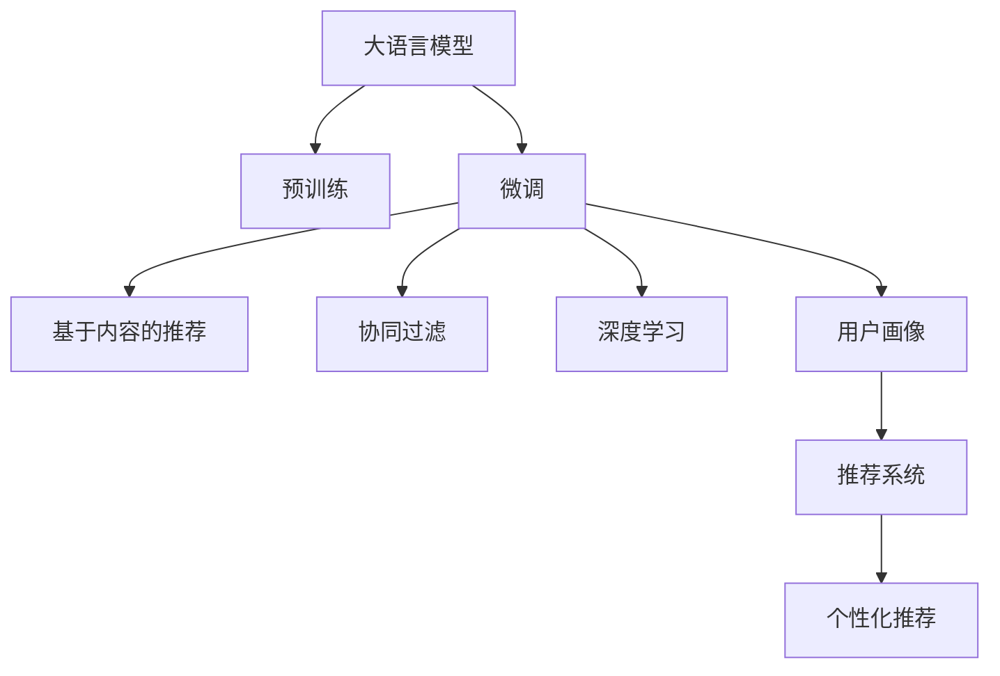

                 

# 基于LLM的推荐系统用户画像更新

> 关键词：基于LLM的推荐系统，用户画像，深度学习，推荐算法，个性化推荐，大模型微调，协同过滤

## 1. 背景介绍

### 1.1 问题由来
推荐系统是现代互联网和电商行业的重要应用之一，通过分析用户的兴趣和行为，为用户提供个性化的商品、内容或服务推荐，极大地提升了用户体验和平台流量。然而，传统的推荐算法（如协同过滤、基于内容的推荐等）往往依赖于显式反馈（如点击、购买、评分等）数据，数据稀疏性问题严重，且对新用户的推荐效果不佳。

近年来，基于深度学习的推荐算法开始逐渐普及，如序列模型、矩阵分解等，能够有效处理用户历史行为数据，对新用户也能进行较好的推荐。但这些深度学习模型仍然需要大量标注数据进行训练，在数据量不足的情况下，推荐的泛化性能有限。

为了解决这些问题，研究者提出了一种基于大语言模型(LLM)的推荐系统新范式，通过微调大语言模型，直接从文本数据中学习用户画像，实现更加高效的推荐。

### 1.2 问题核心关键点
该方法的核心在于：利用大语言模型的大规模预训练能力，对用户行为数据进行微调，获得更丰富的用户画像。然后，根据用户画像更新推荐策略，实现更加个性化和有效的推荐。具体来说，关键点包括：

- 选择合适的预训练语言模型(如BERT、GPT等)，作为初始化参数。
- 收集用户行为数据，包括浏览、点击、购买、评分等。
- 设计合适的微调目标函数，如最大似然估计、交叉熵等。
- 优化超参数，如学习率、批量大小、迭代轮数等。
- 使用微调后的模型进行用户画像更新，并通过预测模型的输出进行推荐。

### 1.3 问题研究意义
基于大语言模型的推荐系统用户画像更新方法，具有以下重要研究意义：

- 降低推荐系统的数据需求：传统的推荐算法需要大量显式反馈数据，而基于LLM的方法可以直接从文本数据中学习用户画像，大大降低了对标注数据的需求。
- 提升新用户推荐效果：传统方法对新用户的数据冷启动问题较大，而LLM方法能从零样本或少量样本中学习用户画像，提升新用户的推荐效果。
- 提供高效个性化推荐：LLM方法通过微调获得更全面的用户画像，能够实现更精细化的推荐。
- 拓宽推荐系统的应用范围：除了电商推荐，LLM方法还可以应用于新闻、音乐、视频等多个领域，拓展推荐系统的应用边界。

## 2. 核心概念与联系

### 2.1 核心概念概述

为更好地理解基于LLM的推荐系统用户画像更新方法，本节将介绍几个密切相关的核心概念：

- 大语言模型(Large Language Model, LLM)：以自回归(如GPT)或自编码(如BERT)模型为代表的大规模预训练语言模型。通过在大规模无标签文本语料上进行预训练，学习通用的语言知识和常识。

- 用户画像(User Profile)：通过对用户历史行为数据的分析，建立用户兴趣和偏好的数学模型。传统的用户画像通常基于显式反馈数据，而基于LLM的用户画像则可以从隐式文本数据中直接学习。

- 推荐系统(Recommendation System)：根据用户画像，为每个用户生成个性化的推荐结果，包括商品、内容、服务等。

- 协同过滤(Collaborative Filtering, CF)：通过分析用户和物品之间的互动数据，进行相似度计算，推荐相似用户喜欢的物品。

- 基于内容的推荐(Content-based Recommendation)：根据物品属性和用户偏好，直接匹配相似物品进行推荐。

- 深度学习(Deep Learning)：利用神经网络模型对用户行为数据进行建模，学习用户兴趣和物品特征的表示。

- 微调(Fine-Tuning)：在大规模预训练模型的基础上，使用下游任务的少量标注数据进行优化，提升模型在特定任务上的性能。

这些概念之间的逻辑关系可以通过以下Mermaid流程图来展示：



这个流程图展示了大语言模型的核心概念及其之间的关系：

1. 大语言模型通过预训练获得基础能力。
2. 微调是对预训练模型进行任务特定的优化，使得模型能更好地适应推荐系统需求。
3. 基于内容的推荐和协同过滤是两种常见的推荐算法。
4. 深度学习通过模型学习用户和物品的表示。
5. 用户画像通过模型学习用户兴趣和偏好。
6. 推荐系统根据用户画像生成个性化推荐。
7. 个性化推荐通过基于内容的推荐和协同过滤实现。

这些概念共同构成了基于LLM的推荐系统的理论和实践框架，使得LLM方法能够高效地从文本数据中学习用户画像，实现个性化推荐。

## 3. 核心算法原理 & 具体操作步骤
### 3.1 算法原理概述

基于大语言模型的推荐系统用户画像更新，本质上是将用户行为数据作为微调标签，通过深度学习模型学习用户画像的过程。其核心思想是：

1. 利用大语言模型的预训练能力，学习用户行为数据的语言表示。
2. 通过微调获得更丰富的用户画像，包括用户的兴趣、偏好、情感等。
3. 根据用户画像更新推荐策略，实现更加个性化和有效的推荐。

### 3.2 算法步骤详解

基于LLM的推荐系统用户画像更新一般包括以下几个关键步骤：

**Step 1: 准备预训练模型和数据集**
- 选择合适的预训练语言模型 $M_{\theta}$ 作为初始化参数，如 BERT、GPT等。
- 准备用户行为数据集 $D=\{(x_i,y_i)\}_{i=1}^N$，其中 $x_i$ 表示用户行为记录，如浏览、点击、购买等，$y_i$ 表示用户的实际反馈，如点击率、购买率等。

**Step 2: 设计微调目标函数**
- 根据用户行为数据，设计合适的微调目标函数 $L(M_{\theta},D)$。通常使用最大似然估计、交叉熵等作为目标函数。
- 目标函数 $L(M_{\theta},D)$ 可以定义为：
  $$
  L(M_{\theta},D) = -\sum_{i=1}^N \log P_{M_{\theta}}(y_i|x_i)
  $$
  其中 $P_{M_{\theta}}(y_i|x_i)$ 表示模型在用户行为 $x_i$ 上的预测概率。

**Step 3: 设置微调超参数**
- 选择合适的优化算法及其参数，如 AdamW、SGD 等，设置学习率、批大小、迭代轮数等。
- 设置正则化技术及强度，包括权重衰减、Dropout、Early Stopping等。
- 确定冻结预训练参数的策略，如仅微调顶层，或全部参数都参与微调。

**Step 4: 执行梯度训练**
- 将用户行为数据集分批次输入模型，前向传播计算预测概率。
- 反向传播计算参数梯度，根据设定的优化算法和学习率更新模型参数。
- 周期性在验证集上评估模型性能，根据性能指标决定是否触发 Early Stopping。
- 重复上述步骤直到满足预设的迭代轮数或 Early Stopping 条件。

**Step 5: 测试和部署**
- 在测试集上评估微调后模型 $M_{\hat{\theta}}$ 的性能，对比微调前后的推荐效果提升。
- 使用微调后的模型进行用户画像更新，得到用户的兴趣和偏好。
- 根据用户画像更新推荐策略，对用户进行个性化推荐。
- 集成到推荐系统中，实现高效的个性化推荐服务。

以上是基于LLM的推荐系统用户画像更新的一般流程。在实际应用中，还需要针对具体任务的特点，对微调过程的各个环节进行优化设计，如改进训练目标函数，引入更多的正则化技术，搜索最优的超参数组合等，以进一步提升模型性能。

### 3.3 算法优缺点

基于LLM的推荐系统用户画像更新方法具有以下优点：

1. 高效学习用户画像：LLM方法可以直接从用户行为数据中学习用户画像，无需显式反馈数据。
2. 新用户推荐效果好：LLM方法能够从少量样本或零样本中学习用户画像，提升新用户的推荐效果。
3. 个性化推荐精度高：LLM方法通过微调获得更全面的用户画像，实现更精细化的推荐。
4. 推荐算法泛化性强：LLM方法适用于多种推荐算法，如协同过滤、基于内容的推荐等。
5. 支持多模态数据：LLM方法不仅适用于文本数据，还可以利用图像、语音等多模态数据进行推荐。

同时，该方法也存在一定的局限性：

1. 对预训练模型依赖性强：LLM方法的效果很大程度上取决于预训练模型的质量和参数量。
2. 计算成本高：大语言模型训练和微调需要大量计算资源，不适合数据量较小的推荐系统。
3. 过拟合风险大：如果用户行为数据不足，微调模型容易出现过拟合现象。
4. 可解释性不足：微调后的LLM模型较难解释其内部工作机制和决策逻辑。
5. 数据隐私问题：需要处理大量的用户行为数据，涉及到数据隐私和安全问题。

尽管存在这些局限性，但LLM方法在推荐系统中的应用前景依然广阔，为推荐系统带来了新的突破和发展方向。

### 3.4 算法应用领域

基于大语言模型的推荐系统用户画像更新方法，已经在推荐系统、智能客服、个性化推荐等多个领域得到广泛应用。以下是几个典型的应用场景：

- 电商推荐：利用用户的浏览、点击、购买记录，微调BERT模型，更新用户画像，实现高效的个性化推荐。
- 新闻推荐：分析用户的阅读、点赞、评论行为，通过微调GPT模型，生成个性化新闻推荐。
- 视频推荐：利用用户的观看、点赞、分享记录，微调Transformer模型，生成个性化视频推荐。
- 智能客服：根据用户对话历史，微调BERT模型，生成智能回答，提升客服响应效率和质量。

除了这些经典应用外，LLM方法还被创新性地应用于更多场景中，如金融风险控制、社交网络内容推荐、广告推荐等，为推荐系统带来了全新的突破。

## 4. 数学模型和公式 & 详细讲解  
### 4.1 数学模型构建

本节将使用数学语言对基于LLM的推荐系统用户画像更新过程进行更加严格的刻画。

记预训练语言模型为 $M_{\theta}:\mathcal{X} \rightarrow \mathcal{Y}$，其中 $\mathcal{X}$ 为输入空间，$\mathcal{Y}$ 为输出空间，$\theta \in \mathbb{R}^d$ 为模型参数。假设用户行为数据集为 $D=\{(x_i,y_i)\}_{i=1}^N$，其中 $x_i$ 表示用户行为记录，$y_i$ 表示用户的实际反馈。

定义模型 $M_{\theta}$ 在用户行为数据 $x_i$ 上的预测概率为 $P_{M_{\theta}}(y_i|x_i)$，则微调的目标函数可以表示为：

$$
L(M_{\theta},D) = -\frac{1}{N}\sum_{i=1}^N \log P_{M_{\theta}}(y_i|x_i)
$$

其中，交叉熵损失函数 $-\log P_{M_{\theta}}(y_i|x_i)$ 用于衡量模型在用户行为数据上的预测效果。

### 4.2 公式推导过程

以下我们以二分类任务为例，推导交叉熵损失函数及其梯度的计算公式。

假设模型 $M_{\theta}$ 在用户行为数据 $x_i$ 上的预测概率为 $P_{M_{\theta}}(y_i=1|x_i)$，则二分类交叉熵损失函数定义为：

$$
L(M_{\theta},D) = -\frac{1}{N}\sum_{i=1}^N [y_i\log P_{M_{\theta}}(y_i=1|x_i)+(1-y_i)\log (1-P_{M_{\theta}}(y_i=1|x_i))]
$$

将其代入目标函数公式，得：

$$
L(M_{\theta},D) = -\frac{1}{N}\sum_{i=1}^N \log P_{M_{\theta}}(y_i|x_i)
$$

根据链式法则，目标函数对参数 $\theta_k$ 的梯度为：

$$
\frac{\partial L(M_{\theta},D)}{\partial \theta_k} = -\frac{1}{N}\sum_{i=1}^N \frac{\partial}{\partial \theta_k}\log P_{M_{\theta}}(y_i|x_i)
$$

其中，$\frac{\partial}{\partial \theta_k}\log P_{M_{\theta}}(y_i|x_i)$ 为交叉熵损失函数对参数 $\theta_k$ 的梯度，可通过反向传播算法高效计算。

在得到目标函数的梯度后，即可带入参数更新公式，完成模型的迭代优化。重复上述过程直至收敛，最终得到适应推荐系统需求的最优模型参数 $\theta^*$。

## 5. 项目实践：代码实例和详细解释说明
### 5.1 开发环境搭建

在进行用户画像更新实践前，我们需要准备好开发环境。以下是使用Python进行PyTorch开发的环境配置流程：

1. 安装Anaconda：从官网下载并安装Anaconda，用于创建独立的Python环境。

2. 创建并激活虚拟环境：
```bash
conda create -n pytorch-env python=3.8 
conda activate pytorch-env
```

3. 安装PyTorch：根据CUDA版本，从官网获取对应的安装命令。例如：
```bash
conda install pytorch torchvision torchaudio cudatoolkit=11.1 -c pytorch -c conda-forge
```

4. 安装Transformers库：
```bash
pip install transformers
```

5. 安装各类工具包：
```bash
pip install numpy pandas scikit-learn matplotlib tqdm jupyter notebook ipython
```

完成上述步骤后，即可在`pytorch-env`环境中开始用户画像更新实践。

### 5.2 源代码详细实现

下面我们以基于BERT模型的电商推荐为例，给出使用Transformers库对BERT模型进行用户画像微调的PyTorch代码实现。

首先，定义用户行为数据集的预处理函数：

```python
from transformers import BertTokenizer
from torch.utils.data import Dataset
import torch

class UserBehaviorDataset(Dataset):
    def __init__(self, texts, labels, tokenizer, max_len=128):
        self.texts = texts
        self.labels = labels
        self.tokenizer = tokenizer
        self.max_len = max_len
        
    def __len__(self):
        return len(self.texts)
    
    def __getitem__(self, item):
        text = self.texts[item]
        label = self.labels[item]
        
        encoding = self.tokenizer(text, return_tensors='pt', max_length=self.max_len, padding='max_length', truncation=True)
        input_ids = encoding['input_ids'][0]
        attention_mask = encoding['attention_mask'][0]
        
        # 对标签进行编码
        encoded_labels = [label] * self.max_len
        labels = torch.tensor(encoded_labels, dtype=torch.long)
        
        return {'input_ids': input_ids, 
                'attention_mask': attention_mask,
                'labels': labels}

# 标签与id的映射
label2id = {'buy': 1, 'click': 0}
id2label = {v: k for k, v in label2id.items()}

# 创建dataset
tokenizer = BertTokenizer.from_pretrained('bert-base-cased')

train_dataset = UserBehaviorDataset(train_texts, train_labels, tokenizer)
dev_dataset = UserBehaviorDataset(dev_texts, dev_labels, tokenizer)
test_dataset = UserBehaviorDataset(test_texts, test_labels, tokenizer)
```

然后，定义模型和优化器：

```python
from transformers import BertForTokenClassification, AdamW

model = BertForTokenClassification.from_pretrained('bert-base-cased', num_labels=2)

optimizer = AdamW(model.parameters(), lr=2e-5)
```

接着，定义训练和评估函数：

```python
from torch.utils.data import DataLoader
from tqdm import tqdm
from sklearn.metrics import accuracy_score

device = torch.device('cuda') if torch.cuda.is_available() else torch.device('cpu')
model.to(device)

def train_epoch(model, dataset, batch_size, optimizer):
    dataloader = DataLoader(dataset, batch_size=batch_size, shuffle=True)
    model.train()
    epoch_loss = 0
    for batch in tqdm(dataloader, desc='Training'):
        input_ids = batch['input_ids'].to(device)
        attention_mask = batch['attention_mask'].to(device)
        labels = batch['labels'].to(device)
        model.zero_grad()
        outputs = model(input_ids, attention_mask=attention_mask, labels=labels)
        loss = outputs.loss
        epoch_loss += loss.item()
        loss.backward()
        optimizer.step()
    return epoch_loss / len(dataloader)

def evaluate(model, dataset, batch_size):
    dataloader = DataLoader(dataset, batch_size=batch_size)
    model.eval()
    preds, labels = [], []
    with torch.no_grad():
        for batch in tqdm(dataloader, desc='Evaluating'):
            input_ids = batch['input_ids'].to(device)
            attention_mask = batch['attention_mask'].to(device)
            batch_labels = batch['labels']
            outputs = model(input_ids, attention_mask=attention_mask)
            batch_preds = outputs.logits.argmax(dim=2).to('cpu').tolist()
            batch_labels = batch_labels.to('cpu').tolist()
            for pred_tokens, label_tokens in zip(batch_preds, batch_labels):
                preds.append(pred_tokens[:len(label_tokens)])
                labels.append(label_tokens)
                
    print(accuracy_score(labels, preds))
```

最后，启动训练流程并在测试集上评估：

```python
epochs = 5
batch_size = 16

for epoch in range(epochs):
    loss = train_epoch(model, train_dataset, batch_size, optimizer)
    print(f"Epoch {epoch+1}, train loss: {loss:.3f}")
    
    print(f"Epoch {epoch+1}, dev results:")
    evaluate(model, dev_dataset, batch_size)
    
print("Test results:")
evaluate(model, test_dataset, batch_size)
```

以上就是使用PyTorch对BERT进行电商推荐用户画像微调的完整代码实现。可以看到，得益于Transformers库的强大封装，我们可以用相对简洁的代码完成BERT模型的加载和微调。

### 5.3 代码解读与分析

让我们再详细解读一下关键代码的实现细节：

**UserBehaviorDataset类**：
- `__init__`方法：初始化文本、标签、分词器等关键组件。
- `__len__`方法：返回数据集的样本数量。
- `__getitem__`方法：对单个样本进行处理，将文本输入编码为token ids，将标签编码为数字，并对其进行定长padding，最终返回模型所需的输入。

**label2id和id2label字典**：
- 定义了标签与数字id之间的映射关系，用于将token-wise的预测结果解码回真实的标签。

**训练和评估函数**：
- 使用PyTorch的DataLoader对数据集进行批次化加载，供模型训练和推理使用。
- 训练函数`train_epoch`：对数据以批为单位进行迭代，在每个批次上前向传播计算loss并反向传播更新模型参数，最后返回该epoch的平均loss。
- 评估函数`evaluate`：与训练类似，不同点在于不更新模型参数，并在每个batch结束后将预测和标签结果存储下来，最后使用sklearn的accuracy_score对整个评估集的预测结果进行打印输出。

**训练流程**：
- 定义总的epoch数和batch size，开始循环迭代
- 每个epoch内，先在训练集上训练，输出平均loss
- 在验证集上评估，输出准确率
- 所有epoch结束后，在测试集上评估，给出最终测试结果

可以看到，PyTorch配合Transformers库使得BERT微调的代码实现变得简洁高效。开发者可以将更多精力放在数据处理、模型改进等高层逻辑上，而不必过多关注底层的实现细节。

当然，工业级的系统实现还需考虑更多因素，如模型的保存和部署、超参数的自动搜索、更灵活的任务适配层等。但核心的微调范式基本与此类似。

## 6. 实际应用场景
### 6.1 智能客服系统

基于大语言模型的推荐系统用户画像更新方法，可以广泛应用于智能客服系统的构建。传统客服往往需要配备大量人力，高峰期响应缓慢，且一致性和专业性难以保证。而使用微调后的推荐系统，可以7x24小时不间断服务，快速响应客户咨询，用自然流畅的语言解答各类常见问题。

在技术实现上，可以收集企业内部的历史客服对话记录，将问题和最佳答复构建成监督数据，在此基础上对预训练推荐系统进行微调。微调后的推荐系统能够自动理解用户意图，匹配最合适的答案模板进行回复。对于客户提出的新问题，还可以接入检索系统实时搜索相关内容，动态组织生成回答。如此构建的智能客服系统，能大幅提升客户咨询体验和问题解决效率。

### 6.2 金融舆情监测

金融机构需要实时监测市场舆论动向，以便及时应对负面信息传播，规避金融风险。传统的人工监测方式成本高、效率低，难以应对网络时代海量信息爆发的挑战。基于大语言模型的文本分类和情感分析技术，为金融舆情监测提供了新的解决方案。

具体而言，可以收集金融领域相关的新闻、报道、评论等文本数据，并对其进行主题标注和情感标注。在此基础上对预训练推荐系统进行微调，使其能够自动判断文本属于何种主题，情感倾向是正面、中性还是负面。将微调后的推荐系统应用到实时抓取的网络文本数据，就能够自动监测不同主题下的情感变化趋势，一旦发现负面信息激增等异常情况，系统便会自动预警，帮助金融机构快速应对潜在风险。

### 6.3 个性化推荐系统

当前的推荐系统往往只依赖用户的历史行为数据进行物品推荐，无法深入理解用户的真实兴趣偏好。基于大语言模型推荐系统用户画像更新方法，个性化推荐系统可以更好地挖掘用户行为背后的语义信息，从而提供更精准、多样的推荐内容。

在实践中，可以收集用户浏览、点击、评论、分享等行为数据，提取和用户交互的物品标题、描述、标签等文本内容。将文本内容作为模型输入，用户的后续行为（如是否点击、购买等）作为监督信号，在此基础上微调预训练语言模型。微调后的推荐系统能够从文本内容中准确把握用户的兴趣点。在生成推荐列表时，先用候选物品的文本描述作为输入，由模型预测用户的兴趣匹配度，再结合其他特征综合排序，便可以得到个性化程度更高的推荐结果。

### 6.4 未来应用展望

随着大语言模型和微调方法的不断发展，基于LLM的推荐系统用户画像更新方法将呈现以下几个发展趋势：

1. 模型规模持续增大。随着算力成本的下降和数据规模的扩张，预训练语言模型的参数量还将持续增长。超大规模语言模型蕴含的丰富语言知识，有望支撑更加复杂多变的推荐系统需求。

2. 微调方法日趋多样。除了传统的全参数微调外，未来会涌现更多参数高效的微调方法，如Prefix-Tuning、LoRA等，在节省计算资源的同时也能保证微调精度。

3. 持续学习成为常态。随着数据分布的不断变化，推荐系统需要持续学习新知识以保持性能。如何在不遗忘原有知识的同时，高效吸收新样本信息，将成为重要的研究课题。

4. 标注样本需求降低。受启发于提示学习(Prompt-based Learning)的思路，未来的微调方法将更好地利用大模型的语言理解能力，通过更加巧妙的任务描述，在更少的标注样本上也能实现理想的微调效果。

5. 多模态微调崛起。当前的微调主要聚焦于纯文本数据，未来会进一步拓展到图像、视频、语音等多模态数据微调。多模态信息的融合，将显著提升推荐系统对现实世界的理解和建模能力。

6. 模型通用性增强。经过海量数据的预训练和多领域任务的微调，未来的推荐系统语言模型将具备更强大的常识推理和跨领域迁移能力，逐步迈向通用人工智能(AGI)的目标。

以上趋势凸显了大语言模型微调技术的广阔前景。这些方向的探索发展，必将进一步提升推荐系统的性能和应用范围，为人类认知智能的进化带来深远影响。

## 7. 工具和资源推荐
### 7.1 学习资源推荐

为了帮助开发者系统掌握基于LLM的推荐系统用户画像更新理论基础和实践技巧，这里推荐一些优质的学习资源：

1. 《Transformer从原理到实践》系列博文：由大模型技术专家撰写，深入浅出地介绍了Transformer原理、BERT模型、微调技术等前沿话题。

2. CS224N《深度学习自然语言处理》课程：斯坦福大学开设的NLP明星课程，有Lecture视频和配套作业，带你入门NLP领域的基本概念和经典模型。

3. 《Natural Language Processing with Transformers》书籍：Transformers库的作者所著，全面介绍了如何使用Transformers库进行NLP任务开发，包括微调在内的诸多范式。

4. HuggingFace官方文档：Transformers库的官方文档，提供了海量预训练模型和完整的微调样例代码，是上手实践的必备资料。

5. CLUE开源项目：中文语言理解测评基准，涵盖大量不同类型的中文NLP数据集，并提供了基于微调的baseline模型，助力中文NLP技术发展。

通过对这些资源的学习实践，相信你一定能够快速掌握基于LLM的推荐系统用户画像更新精髓，并用于解决实际的推荐问题。
###  7.2 开发工具推荐

高效的开发离不开优秀的工具支持。以下是几款用于基于LLM的推荐系统用户画像更新开发的常用工具：

1. PyTorch：基于Python的开源深度学习框架，灵活动态的计算图，适合快速迭代研究。大部分预训练语言模型都有PyTorch版本的实现。

2. TensorFlow：由Google主导开发的开源深度学习框架，生产部署方便，适合大规模工程应用。同样有丰富的预训练语言模型资源。

3. Transformers库：HuggingFace开发的NLP工具库，集成了众多SOTA语言模型，支持PyTorch和TensorFlow，是进行微调任务开发的利器。

4. Weights & Biases：模型训练的实验跟踪工具，可以记录和可视化模型训练过程中的各项指标，方便对比和调优。与主流深度学习框架无缝集成。

5. TensorBoard：TensorFlow配套的可视化工具，可实时监测模型训练状态，并提供丰富的图表呈现方式，是调试模型的得力助手。

6. Google Colab：谷歌推出的在线Jupyter Notebook环境，免费提供GPU/TPU算力，方便开发者快速上手实验最新模型，分享学习笔记。

合理利用这些工具，可以显著提升基于LLM的推荐系统用户画像更新任务的开发效率，加快创新迭代的步伐。

### 7.3 相关论文推荐

大语言模型和微调技术的发展源于学界的持续研究。以下是几篇奠基性的相关论文，推荐阅读：

1. Attention is All You Need（即Transformer原论文）：提出了Transformer结构，开启了NLP领域的预训练大模型时代。

2. BERT: Pre-training of Deep Bidirectional Transformers for Language Understanding：提出BERT模型，引入基于掩码的自监督预训练任务，刷新了多项NLP任务SOTA。

3. Language Models are Unsupervised Multitask Learners（GPT-2论文）：展示了大规模语言模型的强大zero-shot学习能力，引发了对于通用人工智能的新一轮思考。

4. Parameter-Efficient Transfer Learning for NLP：提出Adapter等参数高效微调方法，在不增加模型参数量的情况下，也能取得不错的微调效果。

5. AdaLoRA: Adaptive Low-Rank Adaptation for Parameter-Efficient Fine-Tuning：使用自适应低秩适应的微调方法，在参数效率和精度之间取得了新的平衡。

这些论文代表了大语言模型微调技术的发展脉络。通过学习这些前沿成果，可以帮助研究者把握学科前进方向，激发更多的创新灵感。

## 8. 总结：未来发展趋势与挑战

### 8.1 总结

本文对基于LLM的推荐系统用户画像更新方法进行了全面系统的介绍。首先阐述了基于LLM的推荐系统的研究背景和意义，明确了用户画像更新方法在推荐系统中的应用价值。其次，从原理到实践，详细讲解了微调大语言模型的数学原理和关键步骤，给出了用户画像更新任务开发的完整代码实例。同时，本文还广泛探讨了用户画像更新方法在智能客服、金融舆情、个性化推荐等多个行业领域的应用前景，展示了用户画像更新范式的巨大潜力。此外，本文精选了用户画像更新技术的各类学习资源，力求为读者提供全方位的技术指引。

通过本文的系统梳理，可以看到，基于LLM的推荐系统用户画像更新方法正在成为推荐系统的重要范式，极大地拓展了预训练语言模型的应用边界，催生了更多的落地场景。受益于大规模语料的预训练，微调方法能够从文本数据中学习用户画像，显著提升推荐系统的性能和应用范围，为推荐系统带来了新的突破。未来，伴随预训练语言模型和微调方法的持续演进，相信推荐系统将在更广阔的应用领域大放异彩，深刻影响人类的生产生活方式。

### 8.2 未来发展趋势

展望未来，基于LLM的推荐系统用户画像更新方法将呈现以下几个发展趋势：

1. 模型规模持续增大。随着算力成本的下降和数据规模的扩张，预训练语言模型的参数量还将持续增长。超大规模语言模型蕴含的丰富语言知识，有望支撑更加复杂多变的推荐系统需求。

2. 微调方法日趋多样。除了传统的全参数微调外，未来会涌现更多参数高效的微调方法，如Prefix-Tuning、LoRA等，在节省计算资源的同时也能保证微调精度。

3. 持续学习成为常态。随着数据分布的不断变化，推荐系统需要持续学习新知识以保持性能。如何在不遗忘原有知识的同时，高效吸收新样本信息，将成为重要的研究课题。

4. 标注样本需求降低。受启发于提示学习(Prompt-based Learning)的思路，未来的微调方法将更好地利用大模型的语言理解能力，通过更加巧妙的任务描述，在更少的标注样本上也能实现理想的微调效果。

5. 多模态微调崛起。当前的微调主要聚焦于纯文本数据，未来会进一步拓展到图像、视频、语音等多模态数据微调。多模态信息的融合，将显著提升推荐系统对现实世界的理解和建模能力。

6. 模型通用性增强。经过海量数据的预训练和多领域任务的微调，未来的推荐系统语言模型将具备更强大的常识推理和跨领域迁移能力，逐步迈向通用人工智能(AGI)的目标。

以上趋势凸显了大语言模型微调技术的广阔前景。这些方向的探索发展，必将进一步提升推荐系统的性能和应用范围，为人类认知智能的进化带来深远影响。

### 8.3 面临的挑战

尽管基于LLM的推荐系统用户画像更新方法已经取得了瞩目成就，但在迈向更加智能化、普适化应用的过程中，它仍面临着诸多挑战：

1. 数据隐私问题。需要处理大量的用户行为数据，涉及到数据隐私和安全问题。如何合理使用用户数据，确保数据隐私，是用户画像更新方法应用中需要解决的重要问题。

2. 计算成本高。大语言模型训练和微调需要大量计算资源，不适合数据量较小的推荐系统。如何降低计算成本，优化算法效率，是推荐系统用户画像更新方法的优化方向。

3. 推荐精度不稳定。用户行为数据的质量和多样性会直接影响推荐精度。如何获取高质量、多样的用户行为数据，是推荐系统用户画像更新方法面临的重要挑战。

4. 过拟合风险大。如果用户行为数据不足，微调模型容易出现过拟合现象。如何设计合理的目标函数，引入正则化技术，避免过拟合，是用户画像更新方法的研究课题。

5. 可解释性不足。微调后的LLM模型较难解释其内部工作机制和决策逻辑。如何赋予微调模型更强的可解释性，将是亟待攻克的难题。

6. 知识整合能力不足。现有的微调模型往往局限于任务内数据，难以灵活吸收和运用更广泛的先验知识。如何让微调过程更好地与外部知识库、规则库等专家知识结合，形成更加全面、准确的信息整合能力，还有很大的想象空间。

正视用户画像更新方法面临的这些挑战，积极应对并寻求突破，将是大语言模型微调技术走向成熟的必由之路。相信随着学界和产业界的共同努力，这些挑战终将一一被克服，用户画像更新方法必将在构建安全、可靠、可解释、可控的推荐系统中扮演越来越重要的角色。

### 8.4 研究展望

面向未来，用户画像更新方法需要在以下几个方面寻求新的突破：

1. 探索无监督和半监督用户画像更新方法。摆脱对大规模标注数据的依赖，利用自监督学习、主动学习等无监督和半监督范式，最大限度利用非结构化数据，实现更加灵活高效的用户画像更新。

2. 研究参数高效和计算高效的微调范式。开发更加参数高效的微调方法，在固定大部分预训练参数的同时，只更新极少量的任务相关参数。同时优化微调模型的计算图，减少前向传播和反向传播的资源消耗，实现更加轻量级、实时性的部署。

3. 融合因果和对比学习范式。通过引入因果推断和对比学习思想，增强用户画像更新模型建立稳定因果关系的能力，学习更加普适、鲁棒的用户画像，从而提升模型泛化性和抗干扰能力。

4. 引入更多先验知识。将符号化的先验知识，如知识图谱、逻辑规则等，与神经网络模型进行巧妙融合，引导用户画像更新过程学习更准确、合理的用户画像。同时加强不同模态数据的整合，实现视觉、语音等多模态信息与文本信息的协同建模。

5. 结合因果分析和博弈论工具。将因果分析方法引入用户画像更新模型，识别出模型决策的关键特征，增强输出解释的因果性和逻辑性。借助博弈论工具刻画人机交互过程，主动探索并规避模型的脆弱点，提高系统稳定性。

6. 纳入伦理道德约束。在模型训练目标中引入伦理导向的评估指标，过滤和惩罚有偏见、有害的输出倾向。同时加强人工干预和审核，建立模型行为的监管机制，确保输出符合人类价值观和伦理道德。

这些研究方向的探索，必将引领大语言模型微调技术迈向更高的台阶，为构建安全、可靠、可解释、可控的智能系统铺平道路。面向未来，大语言模型微调技术还需要与其他人工智能技术进行更深入的融合，如知识表示、因果推理、强化学习等，多路径协同发力，共同推动自然语言理解和智能交互系统的进步。只有勇于创新、敢于突破，才能不断拓展语言模型的边界，让智能技术更好地造福人类社会。

## 9. 附录：常见问题与解答

**Q1：基于LLM的推荐系统用户画像更新是否适用于所有NLP任务？**

A: 基于LLM的推荐系统用户画像更新方法在推荐系统领域具有很强的适用性，能够从用户行为数据中学习用户画像，提升个性化推荐效果。但该方法在其他NLP任务中的应用可能受到限制。例如，对于需要大量显式反馈数据的任务，如情感分析、命名实体识别等，直接从用户行为数据中提取用户画像可能不够高效。

**Q2：微调过程中如何选择合适的学习率？**

A: 微调过程中学习率的设定是影响推荐系统性能的重要因素。通常建议从较小的学习率开始，如1e-5，逐步减小，直到收敛。如果微调过程中出现过拟合，可以进一步降低学习率。此外，还可以使用warmup策略，在开始阶段使用较小的学习率，再逐渐过渡到预设值。需要注意的是，不同的优化器(如AdamW、Adafactor等)以及不同的学习率调度策略，可能需要设置不同的学习率阈值。

**Q3：基于LLM的推荐系统用户画像更新是否适合所有推荐场景？**

A: 基于LLM的推荐系统用户画像更新方法适合处理文本驱动的推荐场景，如电商推荐、新闻推荐等。但对于需要大量图像、视频等多模态数据的推荐场景，可能需要引入多模态学习方法和预训练模型，以提高推荐效果。

**Q4：用户画像更新过程中如何避免过拟合？**

A: 避免过拟合是用户画像更新过程中的重要挑战。常用的方法包括：
1. 数据增强：通过回译、近义替换等方式扩充训练集
2. 正则化：使用L2正则、Dropout、Early Stopping等
3. 对抗训练：引入对抗样本，提高模型鲁棒性
4. 参数高效微调：只调整少量参数(如Adapter、Prefix等)，减小过拟合风险
5. 多模型集成：训练多个用户画像更新模型，取平均输出，抑制过拟合

这些策略往往需要根据具体任务和数据特点进行灵活组合。只有在数据、模型、训练、推理等各环节进行全面优化，才能最大限度地发挥用户画像更新方法的威力。

**Q5：基于LLM的推荐系统用户画像更新如何保证数据隐私？**

A: 用户画像更新过程中，数据隐私是一个重要问题。通常可以采取以下措施：
1. 匿名化处理：对用户行为数据进行匿名化处理，去除敏感信息。
2. 数据加密：采用加密技术对数据进行存储和传输，防止数据泄露。
3. 本地计算：尽量在本地进行数据处理和模型训练，减少数据传输。
4. 访问控制：对数据进行访问控制，限制数据的访问权限。
5. 合规审核：确保数据处理和使用的合规性，符合相关法律法规。

通过这些措施，可以降低数据隐私泄露的风险，保障用户隐私安全。

---

作者：禅与计算机程序设计艺术 / Zen and the Art of Computer Programming

