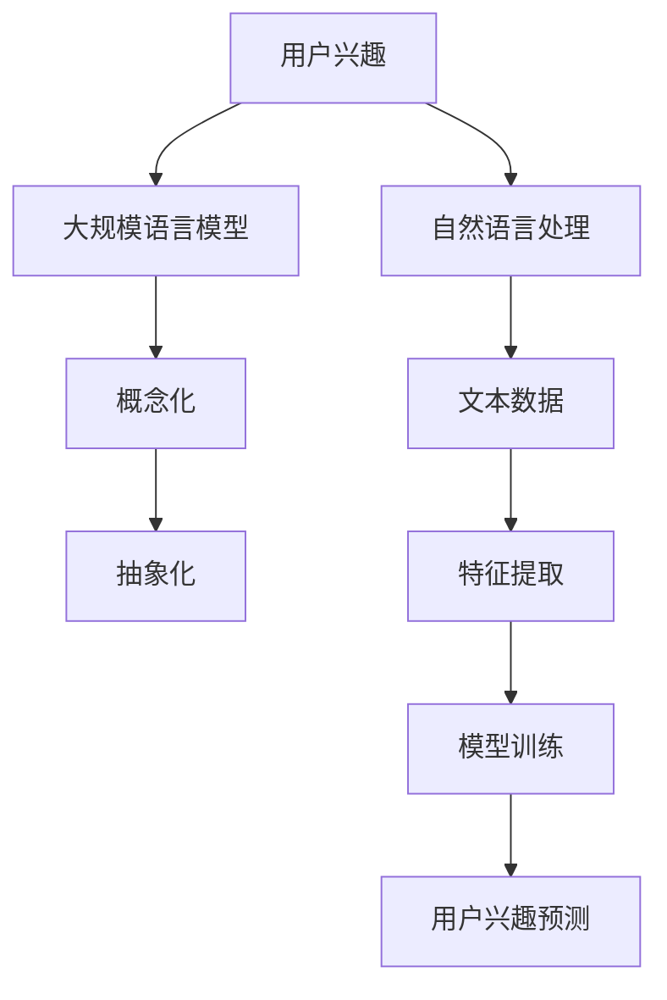

                 

# 基于LLM的用户兴趣概念化与抽象化

> 关键词：用户兴趣,自然语言处理(NLP),大规模语言模型(LLM),概念化与抽象化,深度学习,数据挖掘

## 1. 背景介绍

### 1.1 问题由来
在当今信息爆炸的时代，个性化推荐系统已成为互联网产品竞争的关键要素。通过对用户兴趣的精准捕捉和建模，推荐系统能够更好地满足用户需求，提升用户满意度和留存率。传统的推荐系统多依赖于用户行为数据，如浏览记录、购买历史等，但这些数据往往难以获取，且难以捕捉用户深层次的兴趣。而随着自然语言处理(NLP)技术的发展，大规模语言模型(LLM)已成为新一代推荐系统中获取用户兴趣的重要手段。

### 1.2 问题核心关键点
本文聚焦于基于LLM的用户兴趣概念化与抽象化问题。用户兴趣作为用户内在的、主观的概念，难以直接观察和捕捉。如何通过文本数据等输入，构建对用户兴趣的概念化表示，进而进行抽象化建模，是推荐系统中一个具有重要理论价值和实际意义的课题。

## 2. 核心概念与联系

### 2.1 核心概念概述

为更好地理解基于LLM的用户兴趣概念化与抽象化方法，本节将介绍几个密切相关的核心概念：

- 用户兴趣(User Interest): 用户基于个人偏好、需求、体验等主观因素，对特定产品或内容的表现出的持续关注和需求。

- 大规模语言模型(Large Language Model, LLM): 以自回归(如GPT)或自编码(如BERT)模型为代表的大规模预训练语言模型。通过在大规模无标签文本语料上进行预训练，学习通用的语言表示，具备强大的语言理解和生成能力。

- 自然语言处理(Natural Language Processing, NLP): 通过算法和模型实现计算机对人类语言文字的理解、生成、分析和处理的技术。

- 概念化(Conceptualization): 将复杂、抽象的概念转化为具体、可操作的形式，以便于计算和建模。

- 抽象化(Abstractization): 在概念化的基础上，进一步对数据进行简化和压缩，形成更高效、更易理解的模型表示。

这些核心概念之间的逻辑关系可以通过以下Mermaid流程图来展示：



这个流程图展示了大规模语言模型、自然语言处理、用户兴趣概念化和抽象化的工作流程：

1. 从文本数据开始，进行特征提取。
2. 使用大规模语言模型进行预训练，获得语言表示。
3. 对语言表示进行概念化处理，将其转化为可操作的形式。
4. 对概念化的表示进行进一步的抽象化处理，得到用户兴趣的预测模型。

## 3. 核心算法原理 & 具体操作步骤
### 3.1 算法原理概述

基于LLM的用户兴趣概念化与抽象化方法，本质上是一个从文本数据到用户兴趣表示的映射过程。其核心思想是：

- 利用大规模语言模型对用户输入的文本数据进行预训练，学习到文本中蕴含的用户兴趣信息。
- 通过自然语言处理技术，将预训练得到的文本表示进行概念化，转化为具体的概念或主题。
- 对概念化的表示进行抽象化处理，使用机器学习模型对用户兴趣进行建模和预测。

形式化地，假设用户输入的文本数据为 $X$，语言模型为 $M_{\theta}$，则用户兴趣的概念化表示 $Z$ 可以表示为：

$$
Z = g(M_{\theta}(X))
$$

其中 $g$ 为概念化函数，可以将语言模型生成的文本表示转化为概念或主题。

然后，对概念化的表示 $Z$ 进行抽象化处理，使用机器学习模型 $f$ 进行用户兴趣的预测：

$$
I = f(Z)
$$

其中 $I$ 为用户的兴趣向量。

### 3.2 算法步骤详解

基于LLM的用户兴趣概念化与抽象化方法主要包括以下几个关键步骤：

**Step 1: 准备文本数据和模型**
- 收集用户的历史文本数据，如评论、文章、聊天记录等。
- 选择合适的预训练语言模型 $M_{\theta}$ 作为初始化参数，如 BERT、GPT等。

**Step 2: 文本预处理与特征提取**
- 对文本数据进行清洗、分词、去除停用词等预处理操作。
- 使用自然语言处理工具，将文本转化为语言模型的输入格式。
- 对输入的文本进行特征提取，获得文本向量表示。

**Step 3: 预训练模型进行概念化处理**
- 将文本向量作为输入，通过语言模型进行预训练，获得文本表示 $X'$。
- 对预训练得到的文本表示 $X'$ 进行概念化处理，转化为具体的概念或主题 $Z$。

**Step 4: 概念化的表示进行抽象化处理**
- 对概念化的表示 $Z$ 进行特征抽取，获得更高层次的概念表示。
- 使用机器学习模型对概念表示进行训练，获得用户兴趣的预测模型 $f$。

**Step 5: 用户兴趣预测与更新**
- 对新的用户输入文本进行预处理和特征提取，获得文本向量表示 $X$。
- 将文本向量 $X$ 输入语言模型进行预训练，获得文本表示 $X'$。
- 对文本表示 $X'$ 进行概念化处理，获得概念表示 $Z$。
- 对概念表示 $Z$ 进行抽象化处理，使用预测模型 $f$ 进行用户兴趣预测 $I$。
- 根据用户对预测结果的反馈，对概念化模型和抽象化模型进行更新。

以上是基于LLM的用户兴趣概念化与抽象化的完整流程。在实际应用中，还需要针对具体任务进行优化设计，如改进特征提取方法、优化概念化算法等。

### 3.3 算法优缺点

基于LLM的用户兴趣概念化与抽象化方法具有以下优点：
1. 数据需求低。相比于传统推荐系统需要大量用户行为数据，基于LLM的方法只需少量文本数据即可实现用户兴趣的概念化与抽象化。
2. 泛化能力强。由于预训练模型具有强大的语言理解和生成能力，能够从不同领域的文本中提取通用兴趣特征，提高模型的泛化能力。
3. 模型高效。基于LLM的方法具有较好的计算效率，能够在较短的时间内完成用户兴趣的概念化与抽象化。

同时，该方法也存在一定的局限性：
1. 数据稀疏性。尽管需要少量数据，但文本数据往往存在稀疏性，难以覆盖所有用户兴趣。
2. 文本噪声。文本数据中可能包含大量噪声信息，影响概念化的准确性。
3. 概念泛化性。概念化后的表示可能存在一定的泛化性问题，无法准确映射到具体的用户兴趣。
4. 模型复杂性。概念化和抽象化的处理步骤增加了模型的复杂性，需要更多计算资源。

尽管存在这些局限性，但就目前而言，基于LLM的方法仍是大规模推荐系统中获取用户兴趣的重要手段。未来相关研究的重点在于如何进一步降低数据需求，提高概念化与抽象化的准确性，同时兼顾模型的复杂性和效率。

### 3.4 算法应用领域

基于LLM的用户兴趣概念化与抽象化方法，已在多个推荐系统中得到应用，以下是一些主要领域：

1. 电商推荐：通过分析用户评论、购买记录等文本数据，构建用户兴趣的概念化与抽象化模型，提升推荐精度。
2. 内容推荐：对用户阅读、收藏的文章进行文本分析，获得用户兴趣的概念表示，推荐相关内容。
3. 视频推荐：分析用户观看视频的评论、评分等文本数据，预测用户对新视频的兴趣。
4. 广告推荐：从用户搜索词、网页标题等文本数据中提取用户兴趣，推送相关广告。
5. 社交网络：分析用户的微博、朋友圈等社交文本，推荐可能感兴趣的内容和用户。

此外，该方法还广泛应用于用户行为分析、情感分析、舆情监测等多个领域，为个性化推荐和智能决策提供支撑。

## 4. 数学模型和公式 & 详细讲解  
### 4.1 数学模型构建

本节将使用数学语言对基于LLM的用户兴趣概念化与抽象化方法进行更加严格的刻画。

记用户输入的文本数据为 $X$，语言模型为 $M_{\theta}$，则用户兴趣的概念化表示 $Z$ 可以表示为：

$$
Z = g(M_{\theta}(X))
$$

其中 $g$ 为概念化函数，可以将语言模型生成的文本表示转化为概念或主题。

然后，对概念化的表示 $Z$ 进行抽象化处理，使用机器学习模型 $f$ 进行用户兴趣的预测：

$$
I = f(Z)
$$

其中 $I$ 为用户的兴趣向量。

### 4.2 公式推导过程

以下我们以文本分类任务为例，推导概念化与抽象化方法中的数学公式。

假设用户输入的文本为 $X$，语言模型为 BERT。则BERT生成的文本表示 $X'$ 可以表示为：

$$
X' = \text{BERT}(X)
$$

其中 $\text{BERT}$ 为BERT模型的嵌入层。

然后，将文本表示 $X'$ 作为输入，通过概念化函数 $g$ 转化为概念表示 $Z$：

$$
Z = g(X')
$$

一种常见的概念化方法是通过聚类算法对文本表示进行分类，如K-means、层次聚类等。假设聚类算法得到的概念表示为 $Z_1, Z_2, ..., Z_k$。则用户兴趣的预测向量 $I$ 可以表示为：

$$
I = \text{softmax}(\text{MLP}([Z_1, Z_2, ..., Z_k]))
$$

其中 $\text{MLP}$ 为多隐层感知机，$[Z_1, Z_2, ..., Z_k]$ 为所有概念表示的堆叠向量。

上述公式展示了概念化与抽象化方法的基本框架。在实际应用中，还需根据具体任务选择适当的概念化函数和模型。

### 4.3 案例分析与讲解

我们以电商推荐为例，展示基于LLM的用户兴趣概念化与抽象化方法的具体应用。

假设电商平台收集到用户对商品评论的文本数据 $X = \{X_1, X_2, ..., X_n\}$。我们首先使用BERT模型对文本进行预训练，得到文本表示 $X' = \{X'_1, X'_2, ..., X'_n\}$。

然后，通过聚类算法将文本表示 $X'$ 聚类为 $k$ 个概念，得到概念表示 $Z = \{Z_1, Z_2, ..., Z_k\}$。假设聚类得到的概念为 $Z_1$ 表示“价格”，$Z_2$ 表示“质量”，$Z_3$ 表示“品牌”。

接着，使用多隐层感知机对概念表示 $Z$ 进行训练，得到用户兴趣的预测向量 $I$。假设预测模型得到 $I = [0.5, 0.3, 0.2]$，表示用户对“价格”最感兴趣，其次是“质量”和“品牌”。

最后，将用户的新输入评论文本 $X'$ 进行预训练，得到概念表示 $Z'$。通过预测模型 $f$ 对 $Z'$ 进行预测，得到用户对新商品的兴趣。假设预测结果为 $I' = [0.4, 0.4, 0.2]$，表示用户对新商品的价格和质量都感兴趣，但对品牌的兴趣有所下降。

## 5. 项目实践：代码实例和详细解释说明
### 5.1 开发环境搭建

在进行基于LLM的用户兴趣概念化与抽象化实践前，我们需要准备好开发环境。以下是使用Python进行TensorFlow开发的环境配置流程：

1. 安装Anaconda：从官网下载并安装Anaconda，用于创建独立的Python环境。

2. 创建并激活虚拟环境：
```bash
conda create -n tf-env python=3.8 
conda activate tf-env
```

3. 安装TensorFlow：根据CUDA版本，从官网获取对应的安装命令。例如：
```bash
conda install tensorflow -c tf -c conda-forge
```

4. 安装各类工具包：
```bash
pip install numpy pandas scikit-learn matplotlib tqdm jupyter notebook ipython
```

完成上述步骤后，即可在`tf-env`环境中开始实践。

### 5.2 源代码详细实现

下面我们以文本分类任务为例，给出使用TensorFlow对BERT模型进行概念化与抽象化的PyTorch代码实现。

首先，定义BERT模型的预训练部分：

```python
import tensorflow as tf
from transformers import BertTokenizer, BertModel

tokenizer = BertTokenizer.from_pretrained('bert-base-uncased')
model = BertModel.from_pretrained('bert-base-uncased', output_hidden_states=True)
```

然后，定义概念化函数和抽象化模型：

```python
def get_concept_embeddings(X):
    # 对文本进行预处理和分词
    input_ids = tokenizer(X, return_tensors='tf')
    # 对输入进行预训练，获取文本表示
    outputs = model(input_ids['input_ids'])
    # 获取预训练的文本表示
    X_prime = outputs.last_hidden_state[:, 0, :]
    # 对文本表示进行聚类，获得概念表示
    Z = kmeans(X_prime)
    return Z

def get_interest_prediction(Z):
    # 对概念表示进行抽象化处理
    Z_prime = Z_transformation(Z)
    # 使用MLP对概念表示进行训练
    I = tf.keras.Sequential([
        tf.keras.layers.Dense(64, activation='relu'),
        tf.keras.layers.Dense(3, activation='softmax')
    ]).predict(Z_prime)
    return I
```

其中，`kmeans`和`Z_transformation`为自定义函数，用于对文本表示进行聚类和转换。

最后，启动训练流程：

```python
X_train = ...
X_dev = ...
y_train = ...
y_dev = ...

# 对训练集进行预处理和特征提取
Z_train = get_concept_embeddings(X_train)

# 对训练集的概念表示进行抽象化处理
I_train = get_interest_prediction(Z_train)

# 对验证集进行预处理和特征提取
Z_dev = get_concept_embeddings(X_dev)

# 对验证集的概念表示进行抽象化处理
I_dev = get_interest_prediction(Z_dev)

# 训练MLP模型
model.compile(optimizer='adam', loss='categorical_crossentropy', metrics=['accuracy'])
model.fit(Z_train, I_train, validation_data=(Z_dev, I_dev), epochs=10)
```

以上就是使用TensorFlow对BERT模型进行概念化与抽象化的完整代码实现。可以看到，利用TensorFlow和Transformers库，代码实现变得简洁高效。

### 5.3 代码解读与分析

让我们再详细解读一下关键代码的实现细节：

**BERT模型预训练**：
- 首先，使用Transformer库中的BertTokenizer和BertModel对文本进行预处理和分词。
- 然后，对预处理后的输入进行预训练，获取文本表示 $X'$。

**概念化函数get_concept_embeddings**：
- 对预训练得到的文本表示 $X'$ 进行聚类，得到概念表示 $Z$。
- 在实践中，可以通过k-means、层次聚类等算法实现概念化。

**抽象化模型get_interest_prediction**：
- 对概念表示 $Z$ 进行抽象化处理，使用MLP模型进行用户兴趣的预测。
- 在实践中，可以使用多隐层感知机等神经网络模型实现抽象化。

**训练流程**：
- 定义训练集和验证集的数据，进行概念化和抽象化处理。
- 使用MLP模型对抽象化后的概念表示进行训练，优化用户兴趣预测的精度。
- 使用训练好的模型对新输入的文本进行概念化与抽象化，并进行用户兴趣预测。

可以看到，通过TensorFlow和Transformers库，代码实现变得简洁高效。开发者可以将更多精力放在模型优化、数据处理等高层逻辑上，而不必过多关注底层的实现细节。

当然，工业级的系统实现还需考虑更多因素，如模型的保存和部署、超参数的自动搜索、更灵活的任务适配层等。但核心的概念化与抽象化范式基本与此类似。

## 6. 实际应用场景
### 6.1 电商平台推荐

基于大语言模型微调的方法，可以广泛应用于电商平台推荐系统的构建。传统推荐系统依赖于用户行为数据，难以捕捉用户深层次的兴趣。而利用基于LLM的用户兴趣概念化与抽象化方法，可以获取用户对商品文本的兴趣，实现更加精准的推荐。

在技术实现上，可以收集用户对商品评论的文本数据，通过BERT等模型进行预训练，获得文本表示。然后对文本表示进行概念化处理，得到具体的商品属性标签。最后使用MLP等模型对概念表示进行训练，获得用户对不同属性的兴趣预测。根据预测结果，为每个商品分配相应属性权重，计算出综合推荐分数，进行商品推荐。

### 6.2 内容推荐系统

在内容推荐系统中，用户对文章的阅读兴趣往往是基于文章的标题、摘要等文本信息。通过用户对文章的评论、点赞等行为数据，可以构建用户的兴趣概念化与抽象化模型，实现个性化推荐。

具体而言，可以收集用户对文章评论的文本数据，使用BERT等模型进行预训练，获得文本表示。然后对文本表示进行聚类，得到具体的文章主题标签。最后使用MLP等模型对概念表示进行训练，获得用户对不同主题的兴趣预测。根据预测结果，为用户推荐相关文章。

### 6.3 视频推荐系统

在视频推荐系统中，用户对视频的兴趣通常基于视频标题、描述、用户评价等文本信息。通过用户对视频标题的搜索词、评分等行为数据，可以构建用户的兴趣概念化与抽象化模型，实现个性化推荐。

具体而言，可以收集用户对视频标题的搜索词，使用BERT等模型进行预训练，获得文本表示。然后对文本表示进行聚类，得到具体的视频属性标签。最后使用MLP等模型对概念表示进行训练，获得用户对不同属性的兴趣预测。根据预测结果，为用户推荐相关视频。

### 6.4 社交网络推荐

在社交网络推荐中，用户对社交内容的兴趣通常是基于用户的社交行为和内容标签。通过用户对社交内容的点赞、分享等行为数据，可以构建用户的兴趣概念化与抽象化模型，实现个性化推荐。

具体而言，可以收集用户对社交内容的点赞、评论等文本数据，使用BERT等模型进行预训练，获得文本表示。然后对文本表示进行聚类，得到具体的内容标签。最后使用MLP等模型对概念表示进行训练，获得用户对不同标签的兴趣预测。根据预测结果，为用户推荐相关内容。

### 6.5 未来应用展望

随着大语言模型微调技术的不断发展，基于LLM的用户兴趣概念化与抽象化方法将在更多领域得到应用，为个性化推荐和智能决策提供支撑。

在智慧医疗领域，通过对医生和患者的文本数据进行概念化与抽象化处理，构建用户兴趣的推荐模型，可以实现更加精准的医疗推荐和诊疗建议。

在智能教育领域，通过对学生和老师的文本数据进行概念化与抽象化处理，构建用户兴趣的推荐模型，可以实现个性化教学和智能辅导。

在智慧城市治理中，通过对市民的社交数据进行概念化与抽象化处理，构建用户兴趣的推荐模型，可以实现更加智能化的公共服务和管理。

此外，在企业生产、社会治理、文娱传媒等众多领域，基于大语言模型微调的方法还将不断涌现，为传统行业数字化转型升级提供新的技术路径。相信随着技术的日益成熟，基于LLM的方法必将成为推荐系统中获取用户兴趣的重要手段，推动NLP技术在更多领域的落地应用。

## 7. 工具和资源推荐
### 7.1 学习资源推荐

为了帮助开发者系统掌握基于LLM的用户兴趣概念化与抽象化理论基础和实践技巧，这里推荐一些优质的学习资源：

1. 《Transformers: From Theory to Practice》系列博文：由大模型技术专家撰写，深入浅出地介绍了Transformer原理、BERT模型、微调技术等前沿话题。

2. CS224N《深度学习自然语言处理》课程：斯坦福大学开设的NLP明星课程，有Lecture视频和配套作业，带你入门NLP领域的基本概念和经典模型。

3. 《Natural Language Processing with Transformers》书籍：Transformers库的作者所著，全面介绍了如何使用Transformers库进行NLP任务开发，包括概念化与抽象化在内的诸多范式。

4. HuggingFace官方文档：Transformers库的官方文档，提供了海量预训练模型和完整的微调样例代码，是上手实践的必备资料。

5. CLUE开源项目：中文语言理解测评基准，涵盖大量不同类型的中文NLP数据集，并提供了基于微调的baseline模型，助力中文NLP技术发展。

通过对这些资源的学习实践，相信你一定能够快速掌握基于LLM的用户兴趣概念化与抽象化方法，并用于解决实际的NLP问题。
###  7.2 开发工具推荐

高效的开发离不开优秀的工具支持。以下是几款用于基于LLM的用户兴趣概念化与抽象化开发的常用工具：

1. TensorFlow：由Google主导开发的开源深度学习框架，生产部署方便，适合大规模工程应用。

2. PyTorch：基于Python的开源深度学习框架，灵活动态的计算图，适合快速迭代研究。

3. Transformers库：HuggingFace开发的NLP工具库，集成了众多SOTA语言模型，支持PyTorch和TensorFlow，是进行概念化与抽象化任务开发的利器。

4. Weights & Biases：模型训练的实验跟踪工具，可以记录和可视化模型训练过程中的各项指标，方便对比和调优。

5. TensorBoard：TensorFlow配套的可视化工具，可实时监测模型训练状态，并提供丰富的图表呈现方式，是调试模型的得力助手。

6. Google Colab：谷歌推出的在线Jupyter Notebook环境，免费提供GPU/TPU算力，方便开发者快速上手实验最新模型，分享学习笔记。

合理利用这些工具，可以显著提升基于LLM的用户兴趣概念化与抽象化任务的开发效率，加快创新迭代的步伐。

### 7.3 相关论文推荐

基于LLM的用户兴趣概念化与抽象化方法的研究源于学界的持续研究。以下是几篇奠基性的相关论文，推荐阅读：

1. Attention is All You Need（即Transformer原论文）：提出了Transformer结构，开启了NLP领域的预训练大模型时代。

2. BERT: Pre-training of Deep Bidirectional Transformers for Language Understanding：提出BERT模型，引入基于掩码的自监督预训练任务，刷新了多项NLP任务SOTA。

3. Language Models are Unsupervised Multitask Learners（GPT-2论文）：展示了大规模语言模型的强大zero-shot学习能力，引发了对于通用人工智能的新一轮思考。

4. Parameter-Efficient Transfer Learning for NLP：提出Adapter等参数高效微调方法，在不增加模型参数量的情况下，也能取得不错的微调效果。

5. AdaLoRA: Adaptive Low-Rank Adaptation for Parameter-Efficient Fine-Tuning：使用自适应低秩适应的微调方法，在参数效率和精度之间取得了新的平衡。

这些论文代表了大语言模型微调技术的发展脉络。通过学习这些前沿成果，可以帮助研究者把握学科前进方向，激发更多的创新灵感。

## 8. 总结：未来发展趋势与挑战

### 8.1 总结

本文对基于LLM的用户兴趣概念化与抽象化方法进行了全面系统的介绍。首先阐述了用户兴趣作为用户内在的、主观的概念，难以直接观察和捕捉。然后介绍了如何通过文本数据等输入，构建对用户兴趣的概念化表示，进而进行抽象化建模，以获得用户的兴趣向量。

通过本文的系统梳理，可以看到，基于LLM的方法已成为推荐系统中获取用户兴趣的重要手段。该方法能够从文本数据中提取用户深层次的兴趣特征，提供更精准的推荐服务。同时，该方法还能够广泛应用于内容推荐、电商推荐、视频推荐、社交网络推荐等多个领域，为个性化推荐和智能决策提供支撑。

### 8.2 未来发展趋势

展望未来，基于LLM的用户兴趣概念化与抽象化方法将呈现以下几个发展趋势：

1. 数据需求进一步降低。随着预训练模型和概念化算法的进步，用户兴趣的概念化与抽象化方法将越来越依赖于高质量的少量数据，数据驱动的需求降低。

2. 概念化与抽象化的准确性提升。随着技术的发展，概念化函数和抽象化模型的复杂度将进一步提升，获得更高层次的概念表示。

3. 跨领域应用普及。基于LLM的方法不仅适用于文本数据，还适用于图像、视频等多模态数据，实现多模态数据的融合和智能推荐。

4. 模型复杂度降低。随着模型结构的优化和压缩技术的发展，用户兴趣的概念化与抽象化方法将更加高效，适合实时化部署。

5. 自动化与智能化提升。未来的用户兴趣概念化与抽象化方法将更加智能化，能够自动识别和生成概念化的规则和策略。

这些趋势将进一步拓展用户兴趣的概念化与抽象化方法的应用场景，提升推荐系统的智能化和个性化水平。

### 8.3 面临的挑战

尽管基于LLM的方法在推荐系统中已取得显著成效，但在迈向更加智能化、普适化应用的过程中，仍面临诸多挑战：

1. 数据稀疏性。用户兴趣的表达往往具有多样性和不确定性，难以通过少量数据完全捕捉。如何在数据稀疏的情况下，准确捕捉用户兴趣，还需进一步研究。

2. 概念泛化性。概念化后的表示可能存在一定的泛化性问题，无法准确映射到具体的用户兴趣。如何提高概念化与抽象化的准确性，减少泛化误差，还需要进一步研究。

3. 计算资源消耗。概念化与抽象化的处理步骤增加了计算资源的需求，如何在保证精度的同时，减少计算资源的消耗，还需要进一步研究。

4. 模型复杂性。概念化与抽象化的处理步骤增加了模型的复杂度，需要在模型精度和效率之间找到平衡。

5. 用户体验。用户在概念化与抽象化过程中，往往需要多次交互和反馈，影响用户体验。如何在保证模型的准确性的同时，提升用户体验，还需要进一步研究。

尽管存在这些挑战，但随着学界和产业界的共同努力，基于LLM的用户兴趣概念化与抽象化方法必将在推荐系统中扮演越来越重要的角色。相信随着技术的不断发展，这些挑战终将一一被克服，基于LLM的方法将为推荐系统带来更大的变革。

### 8.4 研究展望

未来的研究需要在以下几个方向进一步探索：

1. 探索更多的概念化函数。除了聚类算法外，可以引入神经网络、图神经网络等方法，进行更高效、更灵活的概念化处理。

2. 研究更先进的抽象化模型。除了MLP等模型外，可以引入自注意力机制、深度神经网络等方法，进行更精准、更高效的用户兴趣预测。

3. 引入更多先验知识。将符号化的先验知识，如知识图谱、逻辑规则等，与神经网络模型进行巧妙融合，引导概念化与抽象化的过程。

4. 结合因果分析和博弈论工具。将因果分析方法引入用户兴趣的概念化与抽象化过程，识别出模型决策的关键特征，增强模型输出的因果性和逻辑性。

5. 纳入伦理道德约束。在模型训练目标中引入伦理导向的评估指标，过滤和惩罚有偏见、有害的输出倾向，确保模型的安全性。

这些研究方向将引领基于LLM的用户兴趣概念化与抽象化方法迈向更高的台阶，为构建安全、可靠、可解释、可控的智能系统铺平道路。面向未来，基于LLM的方法还需要与其他人工智能技术进行更深入的融合，如知识表示、因果推理、强化学习等，多路径协同发力，共同推动自然语言理解和智能交互系统的进步。

## 9. 附录：常见问题与解答

**Q1：概念化与抽象化的具体流程是怎样的？**

A: 概念化与抽象化的具体流程如下：

1. 数据收集与预处理：收集用户输入的文本数据，并进行预处理，如分词、去除停用词等。

2. 文本表示：使用BERT等模型对预处理后的文本进行预训练，获得文本表示。

3. 概念化处理：对文本表示进行聚类等概念化操作，转化为具体的概念或主题。

4. 抽象化处理：对概念表示进行特征抽取和压缩，使用MLP等模型进行训练，得到用户兴趣的预测向量。

5. 兴趣预测：将用户的新输入文本进行预训练和概念化，然后使用训练好的模型进行预测，得到用户兴趣向量。

**Q2：概念化与抽象化对推荐系统有哪些优势？**

A: 概念化与抽象化对推荐系统的优势如下：

1. 数据需求低：相比于传统推荐系统需要大量用户行为数据，基于概念化与抽象化的方法只需少量文本数据即可实现用户兴趣建模。

2. 泛化能力强：预训练模型具有强大的语言理解和生成能力，能够从不同领域的文本中提取通用兴趣特征，提高模型的泛化能力。

3. 模型高效：概念化与抽象化的处理步骤简单高效，能够快速完成用户兴趣的建模与预测。

4. 用户兴趣可解释性：概念化与抽象化方法能够将用户兴趣转化为具体的概念或主题，增强模型的可解释性，便于用户理解和反馈。

**Q3：概念化与抽象化在推荐系统中如何应用？**

A: 概念化与抽象化在推荐系统中的应用如下：

1. 电商推荐：通过对用户评论的文本数据进行概念化与抽象化，构建用户对商品属性（如价格、质量、品牌）的兴趣模型，实现个性化推荐。

2. 内容推荐：对用户阅读文章的文本数据进行概念化与抽象化，构建用户对文章主题（如新闻、科技、娱乐）的兴趣模型，推荐相关文章。

3. 视频推荐：通过对用户观看视频的文本数据进行概念化与抽象化，构建用户对视频属性（如导演、演员、主题）的兴趣模型，推荐相关视频。

4. 社交网络推荐：通过对用户对社交内容的文本数据进行概念化与抽象化，构建用户对社交内容主题（如兴趣、情感、话题）的兴趣模型，推荐相关内容。

**Q4：概念化与抽象化在多模态推荐中的应用前景如何？**

A: 概念化与抽象化在多模态推荐中的应用前景如下：

1. 多模态数据的融合：通过将文本、图像、视频等多模态数据进行概念化与抽象化，实现多模态数据的融合和智能推荐。

2. 多模态兴趣建模：对用户在不同模态下的兴趣进行联合建模，提供更全面、更个性化的推荐服务。

3. 多模态用户建模：对用户在不同模态下的行为进行概念化与抽象化，构建更加全面、准确的兴趣模型。

4. 跨模态推荐：通过对不同模态的数据进行融合，实现跨模态的智能推荐，提升推荐系统的灵活性和普适性。

总之，多模态推荐是未来推荐系统的重要发展方向，基于概念化与抽象化的多模态推荐方法将在更多领域得到应用，为个性化推荐和智能决策提供支撑。

**Q5：概念化与抽象化方法有哪些潜在风险？**

A: 概念化与抽象化方法可能面临以下潜在风险：

1. 数据隐私：在收集和处理用户文本数据时，需要注意用户隐私保护，避免数据泄露和滥用。

2. 模型偏见：如果用户文本数据中存在偏见和歧视信息，概念化与抽象化方法可能会学习到这些偏见，影响推荐系统的公平性。

3. 模型复杂性：概念化与抽象化方法可能引入复杂的模型和算法，增加计算资源的需求和模型的复杂性。

4. 模型泛化性：概念化与抽象化方法可能存在泛化性问题，无法准确映射到具体的用户兴趣。

5. 用户反馈：用户对推荐结果的反馈可能会影响模型的训练，需要在概念化与抽象化过程中进行适当的调整和优化。

这些风险需要在实际应用中加以注意和规避，确保概念化与抽象化方法的安全性和可靠性。

---

作者：禅与计算机程序设计艺术 / Zen and the Art of Computer Programming

