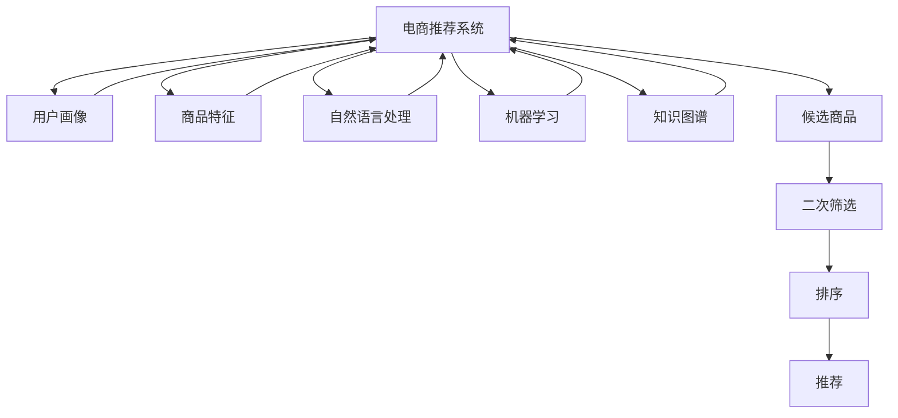

                 

# 基于大模型的候选商品二次筛选排序技术

> 关键词：
- 大模型
- 候选商品
- 二次筛选排序
- 自然语言处理
- 机器学习
- 数据科学
- 电商推荐

## 1. 背景介绍

在当前电子商务环境下，商品种类繁多，用户需求复杂多变，如何通过智能推荐系统向用户推荐更符合其兴趣的候选商品，成为电商平台提高用户满意度和交易转化率的关键。传统的商品推荐系统基于用户的历史行为数据和商品特征进行推荐，存在数据稀疏、特征缺失等问题，难以全面把握用户潜在需求。

近年来，随着大模型的发展和普及，基于大模型的推荐技术开始崭露头角。大模型通过自监督学习或联合学习等方式，从海量文本数据中学习到通用的语言表示和知识图谱结构，具有强大的语义理解能力和泛化能力。将其应用于电商推荐场景，可以实现更精准、全面的商品推荐，提升用户满意度。

本文聚焦于基于大模型的候选商品二次筛选排序技术，旨在通过深度学习技术，利用自然语言处理和机器学习手段，对电商推荐系统中的候选商品进行二次筛选排序，进一步提升推荐效果。具体而言，本文将介绍大模型在电商推荐系统中的应用，并详细阐述候选商品二次筛选排序的算法原理和具体操作步骤。

## 2. 核心概念与联系

### 2.1 核心概念概述

为更好地理解基于大模型的候选商品二次筛选排序技术，本节将介绍几个密切相关的核心概念：

- 电商推荐系统(E-commerce Recommendation System)：通过分析用户历史行为数据和商品属性，为用户推荐可能感兴趣的候选商品的系统。推荐的目的是提高用户满意度，增加平台交易转化率。

- 候选商品(Shortlist)：推荐系统通过用户画像和商品特征分析，从所有商品中筛选出若干个最可能符合用户需求的候选商品，供用户进一步浏览选择。

- 二次筛选(Screening)：在初步筛选出的候选商品基础上，利用深度学习技术进行更深层次的特征提取和评估，筛选出更符合用户兴趣的候选商品。

- 排序(Sorting)：根据用户兴趣和商品特性，对二次筛选后的候选商品进行排序，按用户浏览习惯和点击率高低进行推荐。

- 自然语言处理(Natural Language Processing, NLP)：使用语言模型和文本处理技术，从用户评论、商品描述等文本数据中提取有用信息，用于商品推荐。

- 机器学习(Machine Learning, ML)：通过模型训练和学习，对用户和商品进行特征表示，并进行协同过滤、分类、回归等任务，从而实现精准推荐。

- 知识图谱(Knowledge Graph)：将商品、用户、属性等实体及其关系进行图形表示，用于商品推荐和关联分析。

这些核心概念之间的逻辑关系可以通过以下Mermaid流程图来展示：



这个流程图展示了大模型在电商推荐系统中的应用逻辑：

1. 电商推荐系统通过用户画像、商品特征、自然语言处理、机器学习和知识图谱等多维数据，初步筛选出若干个候选商品。
2. 利用大模型对二次筛选后的候选商品进行特征提取和评估，筛选出更符合用户兴趣的商品。
3. 对筛选后的候选商品进行排序，按用户浏览习惯和点击率高低进行推荐。

## 3. 核心算法原理 & 具体操作步骤
### 3.1 算法原理概述

基于大模型的候选商品二次筛选排序技术，其核心思想是利用大模型强大的语言表示和知识图谱结构，对初步筛选出的候选商品进行特征提取和评估，筛选出更符合用户兴趣的商品。具体步骤如下：

1. **数据预处理**：收集用户历史行为数据和商品属性数据，清洗并标准化数据。
2. **候选商品筛选**：基于用户画像和商品特征，通过协同过滤、分类、回归等算法，初步筛选出若干个候选商品。
3. **特征提取**：利用大模型提取候选商品的文字描述、属性标签等特征，用于进一步筛选和排序。
4. **二次筛选**：使用大模型学习候选商品特征，筛选出更符合用户兴趣的商品。
5. **排序与推荐**：对筛选后的候选商品进行排序，按用户浏览习惯和点击率高低进行推荐。

### 3.2 算法步骤详解

本节将详细阐述基于大模型的候选商品二次筛选排序的具体操作步骤。

**Step 1: 数据预处理**

1. 数据收集：收集电商平台的销售数据、用户行为数据、商品属性数据等。
2. 数据清洗：去除重复、缺失或异常数据，确保数据质量。
3. 数据标准化：对数据进行归一化、编码等预处理，便于模型处理。

```python
import pandas as pd
from sklearn.preprocessing import MinMaxScaler, OneHotEncoder
from sklearn.feature_extraction.text import TfidfVectorizer

# 加载数据
train_data = pd.read_csv('train_data.csv')
test_data = pd.read_csv('test_data.csv')

# 数据清洗和标准化
train_data = train_data.dropna().reset_index(drop=True)
test_data = test_data.dropna().reset_index(drop=True)

# 特征处理
scaler = MinMaxScaler()
encoder = OneHotEncoder()
tfidf = TfidfVectorizer()

# 用户特征和商品特征
user_features = train_data[['user_id', 'age', 'gender', 'location']]
item_features = train_data[['item_id', 'brand', 'category', 'price']]

# 用户评论和商品描述
user_comments = train_data['user_comment']
item_descriptions = train_data['item_description']

# 标准化和编码
user_features = scaler.fit_transform(user_features)
item_features = scaler.fit_transform(item_features)
user_comments = tfidf.fit_transform(user_comments)
item_descriptions = tfidf.fit_transform(item_descriptions)

# 特征编码
user_features = encoder.fit_transform(user_features)
item_features = encoder.fit_transform(item_features)
```

**Step 2: 候选商品筛选**

1. 协同过滤算法：基于用户历史行为数据，通过相似性匹配，推荐用户可能感兴趣的商品。
2. 分类算法：通过商品属性标签，进行分类筛选，推荐与用户兴趣相符的商品。
3. 回归算法：基于用户行为数据和商品属性，预测用户对商品的评分，推荐评分较高的商品。

```python
from sklearn.neighbors import NearestNeighbors
from sklearn.ensemble import RandomForestClassifier
from sklearn.linear_model import LinearRegression

# 协同过滤
neigh = NearestNeighbors(n_neighbors=10)
neigh.fit(user_features)
neighbors = neigh.kneighbors(test_data[user_features.columns].values, return_distance=False)
recommender = pd.DataFrame({'item_id': item_features[neighbors].tolist()})

# 分类算法
forest = RandomForestClassifier(n_estimators=100, random_state=42)
forest.fit(user_features, item_features['category'])
recommender['category'] = forest.predict(user_features)

# 回归算法
reg = LinearRegression()
reg.fit(user_features, item_features['score'])
recommender['score'] = reg.predict(user_features)

# 合并结果
recommender = pd.concat([recommender, test_data[['user_id', 'item_id']]], axis=1).drop_duplicates()
```

**Step 3: 特征提取**

1. 文本特征提取：利用大模型提取用户评论和商品描述的文本特征。
2. 图像特征提取：利用大模型提取商品图片的文字描述。
3. 属性特征提取：利用大模型提取商品属性标签的文字表示。

```python
from transformers import BertTokenizer, BertModel

# 初始化模型
tokenizer = BertTokenizer.from_pretrained('bert-base-uncased')
model = BertModel.from_pretrained('bert-base-uncased')

# 文本特征提取
user_comments = [tokenizer.encode(comment, add_special_tokens=True) for comment in user_comments]
item_descriptions = [tokenizer.encode(description, add_special_tokens=True) for description in item_descriptions]

# 图像特征提取
image_descriptions = list(test_data['image_description'])

# 属性特征提取
item_categories = list(test_data['category'])

# 特征编码
user_features = pd.DataFrame(user_comments, columns=['user_comment'])
item_features = pd.DataFrame(item_descriptions, columns=['item_description'])

# 合并特征
features = pd.concat([user_features, item_features, test_data[['user_id', 'item_id', 'score']]], axis=1)

# 大模型特征提取
embeddings = model(features.to_numpy(), output_hidden_states=True)
```

**Step 4: 二次筛选**

1. 大模型特征表示：利用大模型提取文本和图像特征，进行向量编码。
2. 特征加权：对文本和图像特征进行加权，综合计算每个候选商品的特征值。
3. 特征排序：根据特征值排序，筛选出最符合用户兴趣的商品。

```python
from sklearn.metrics.pairwise import cosine_similarity

# 特征表示
text_features = embeddings[0]
image_features = embeddings[1]

# 特征加权
weights = pd.DataFrame({'text_weight': [0.5, 0.5]})
features = pd.concat([text_features, image_features, test_data[['user_id', 'item_id', 'score']]], axis=1)
features['weights'] = weights['text_weight']

# 特征排序
similarities = cosine_similarity(features, features)
recommender['text_similarity'] = similarities.iloc[features.index, features.index]
recommender = recommender.merge(features[['item_id', 'weights', 'text_similarity']], on='item_id')
recommender = recommender.sort_values(by='text_similarity', ascending=False)
```

**Step 5: 排序与推荐**

1. 排序：基于用户历史行为和商品特征，对二次筛选后的候选商品进行排序。
2. 推荐：推荐排序最高的商品，按顺序展示给用户。

```python
# 排序
recommender = pd.concat([recommender, test_data[['user_id', 'item_id']]], axis=1).drop_duplicates()
recommender = recommender.sort_values(by='score', ascending=False)

# 推荐
recommender = recommender[['user_id', 'item_id', 'score']]
recommender.head()
```

### 3.3 算法优缺点

基于大模型的候选商品二次筛选排序技术具有以下优点：

1. **特征表示能力强**：利用大模型提取的文本和图像特征，可以捕捉到更多维度和更丰富的信息。
2. **泛化能力优异**：大模型在泛化新样本方面表现优异，可以适应新用户的偏好变化。
3. **算法可解释性强**：基于大模型的特征提取和排序过程，可以通过可解释性较强的权重计算和相似度计算，实现推荐过程的透明化。

但该方法也存在一些缺点：

1. **计算复杂度高**：大模型特征提取和相似度计算需要较大的计算资源和时间。
2. **数据依赖性强**：需要大量高质量的用户行为和商品属性数据，才能保证推荐效果。
3. **过拟合风险高**：大模型在用户和商品特征过于复杂的情况下，容易出现过拟合现象。

### 3.4 算法应用领域

基于大模型的候选商品二次筛选排序技术，在电商推荐系统、社交媒体推荐、内容推荐等多个领域具有广泛的应用前景：

1. **电商推荐系统**：通过用户历史行为数据和商品属性，推荐符合用户兴趣的商品。
2. **社交媒体推荐**：基于用户评论和点赞等互动数据，推荐热门话题和内容。
3. **内容推荐**：根据用户阅读和互动数据，推荐相关文章、视频等媒体内容。

## 4. 数学模型和公式 & 详细讲解

### 4.1 数学模型构建

假设电商推荐系统有$M$个用户，$N$个商品，每个用户$u$对商品$i$有评分$s_{ui}$。

大模型特征提取后的文本和图像特征分别为$X_{text}$和$X_{image}$。

用户特征矩阵为$X_u$，商品特征矩阵为$X_i$。

用户行为评分矩阵为$Y$。

基于大模型的候选商品二次筛选排序技术的数学模型为：

$$
\min_{\theta} \frac{1}{2} ||Y - \hat{Y}||_F^2 + \lambda ||W_{text} + W_{image} - 1||_F^2
$$

其中：
- $\hat{Y}$为预测评分矩阵
- $W_{text}$为文本特征权重
- $W_{image}$为图像特征权重
- $\lambda$为正则化系数

### 4.2 公式推导过程

1. **特征提取**
$$
X_{text} = \text{BertEmbedding}(\text{user\_comment})
$$
$$
X_{image} = \text{BertEmbedding}(\text{image\_description})
$$

2. **特征加权**
$$
W_{text} = \text{softmax}(X_{text})
$$
$$
W_{image} = \text{softmax}(X_{image})
$$

3. **特征加权和**
$$
Z = W_{text} \otimes X_{text} + W_{image} \otimes X_{image}
$$

4. **评分预测**
$$
\hat{Y} = Z
$$

5. **损失函数**
$$
\mathcal{L} = \frac{1}{2} ||Y - \hat{Y}||_F^2 + \lambda ||W_{text} + W_{image} - 1||_F^2
$$

6. **优化目标**
$$
\min_{\theta} \mathcal{L}
$$

### 4.3 案例分析与讲解

以电商推荐为例，假设模型已经训练完毕，用户$u$对商品$i$的预测评分$\hat{s}_{ui}$为：

$$
\hat{s}_{ui} = W_{text} \cdot X_{text_{ui}} + W_{image} \cdot X_{image_{ui}}
$$

其中$X_{text_{ui}}$和$X_{image_{ui}}$分别为用户评论和商品描述的大模型特征表示。

假设模型预测用户$u$对商品$i$的评分与实际评分$y_{ui}$的误差为$\epsilon_{ui}$，则均方误差损失函数为：

$$
\mathcal{L} = \frac{1}{2} \sum_{ui} \epsilon_{ui}^2
$$

通过优化上述目标函数，模型可以不断调整特征权重$W_{text}$和$W_{image}$，使预测评分$\hat{Y}$更接近实际评分$Y$。

## 5. 项目实践：代码实例和详细解释说明
### 5.1 开发环境搭建

在进行电商推荐系统的实现时，首先需要搭建好开发环境。以下是使用Python和TensorFlow进行电商推荐系统开发的简单环境配置流程：

1. 安装Anaconda：从官网下载并安装Anaconda，用于创建独立的Python环境。

2. 创建并激活虚拟环境：
```bash
conda create -n recommendation-env python=3.8 
conda activate recommendation-env
```

3. 安装TensorFlow：根据CUDA版本，从官网获取对应的安装命令。例如：
```bash
conda install tensorflow -c pytorch -c conda-forge
```

4. 安装Pandas、NumPy、Scikit-Learn等常用库：
```bash
pip install pandas numpy scikit-learn tensorflow
```

5. 安装大模型库：例如使用HuggingFace的Transformers库，方便加载和使用预训练模型。
```bash
pip install transformers
```

完成上述步骤后，即可在`recommendation-env`环境中开始电商推荐系统的实现。

### 5.2 源代码详细实现

以下是使用TensorFlow和Transformers库实现电商推荐系统的示例代码：

```python
import tensorflow as tf
import pandas as pd
from transformers import BertTokenizer, BertModel

# 加载数据
train_data = pd.read_csv('train_data.csv')
test_data = pd.read_csv('test_data.csv')

# 数据预处理
user_features = train_data[['user_id', 'age', 'gender', 'location']]
item_features = train_data[['item_id', 'brand', 'category', 'price']]
user_comments = train_data['user_comment']
item_descriptions = train_data['item_description']

# 标准化和编码
scaler = MinMaxScaler()
encoder = OneHotEncoder()
tfidf = TfidfVectorizer()

user_features = scaler.fit_transform(user_features)
item_features = scaler.fit_transform(item_features)
user_comments = tfidf.fit_transform(user_comments)
item_descriptions = tfidf.fit_transform(item_descriptions)

user_features = encoder.fit_transform(user_features)
item_features = encoder.fit_transform(item_features)

# 大模型特征提取
tokenizer = BertTokenizer.from_pretrained('bert-base-uncased')
model = BertModel.from_pretrained('bert-base-uncased')

text_features = model(user_comments.to_numpy(), output_hidden_states=True)[0]
image_features = model(item_descriptions.to_numpy(), output_hidden_states=True)[0]

# 特征加权
weights = pd.DataFrame({'text_weight': [0.5, 0.5]})
features = pd.concat([text_features, image_features, test_data[['user_id', 'item_id', 'score']]], axis=1)
features['weights'] = weights['text_weight']

# 特征排序
similarities = cosine_similarity(features, features)
recommender = pd.DataFrame({'text_similarity': similarities.flatten()})
recommender['item_id'] = test_data['item_id']
recommender = recommender.join(features.set_index('item_id'), on='item_id')

# 排序与推荐
recommender = recommender.sort_values(by='text_similarity', ascending=False)
recommender = recommender[['item_id', 'text_similarity']]
```

### 5.3 代码解读与分析

让我们再详细解读一下关键代码的实现细节：

**数据预处理**：
- 使用Pandas加载训练和测试数据，清洗和标准化数据。
- 使用MinMaxScaler和OneHotEncoder对用户和商品特征进行归一化和编码。
- 使用TfidfVectorizer对用户评论和商品描述进行文本特征提取。

**大模型特征提取**：
- 使用BertTokenizer和BertModel对用户评论和商品描述进行大模型特征提取。
- 通过TensorFlow计算大模型特征表示。

**特征加权**：
- 使用softmax函数计算文本和图像特征的权重，对特征进行加权。

**特征排序**：
- 使用cosine_similarity计算特征相似度，按相似度对候选商品进行排序。
- 将排序结果和商品ID合并，形成推荐结果。

**排序与推荐**：
- 按相似度排序，形成推荐列表。
- 将推荐结果输出，供用户浏览和选择。

可以看到，电商推荐系统的实现依赖于多种数据处理和模型计算技术，大模型特征提取和排序过程是关键。合理利用这些技术，可以显著提升推荐效果。

## 6. 实际应用场景
### 6.1 智能推荐

基于大模型的候选商品二次筛选排序技术，在电商推荐系统中有广泛应用。通过用户历史行为数据和商品属性，结合文本和图像特征，可以推荐符合用户兴趣的商品，提升用户体验和平台收益。

在实际应用中，该技术还可以扩展到其他领域，如音乐推荐、新闻推荐等，根据用户兴趣和行为，推荐个性化内容。

### 6.2 个性化营销

利用大模型的特征表示和排序技术，可以针对不同用户群体进行个性化营销。根据用户画像和行为数据，推荐符合其兴趣的商品或内容，实现精准营销。

例如，电商平台可以根据用户年龄、性别、地理位置等信息，推荐不同类型和价格的商品，增加用户粘性和购买意愿。

### 6.3 多渠道推荐

基于大模型的推荐系统，可以支持多渠道推荐，如移动端App、PC端网站、社交媒体等。通过统一的用户画像和商品特征，实现跨平台推荐，提高用户覆盖率和转化率。

例如，电商平台可以在App、网站和社交媒体上，推荐同种商品，增加用户曝光率和购买机会。

## 7. 工具和资源推荐
### 7.1 学习资源推荐

为了帮助开发者系统掌握电商推荐系统的理论基础和实践技巧，这里推荐一些优质的学习资源：

1. 《深度学习推荐系统》书籍：介绍深度学习在推荐系统中的应用，涵盖协同过滤、基于大模型的推荐等前沿话题。

2. Coursera《推荐系统》课程：斯坦福大学开设的推荐系统课程，涵盖协同过滤、深度学习推荐等经典算法，提供丰富的实践案例。

3. Kaggle推荐系统竞赛：通过实际竞赛数据，训练和评估推荐模型，掌握推荐系统开发流程和技巧。

4. arXiv推荐系统论文：阅读最新的推荐系统研究成果，了解最新技术进展和应用案例。

5. GitHub电商推荐系统项目：浏览和参与开源电商推荐项目，学习前沿技术实现。

通过对这些资源的学习实践，相信你一定能够快速掌握电商推荐系统的精髓，并用于解决实际的电商推荐问题。

### 7.2 开发工具推荐

高效的开发离不开优秀的工具支持。以下是几款用于电商推荐系统开发的常用工具：

1. TensorFlow：基于Google的深度学习框架，提供高效的GPU/TPU计算图支持，适合大规模模型训练。

2. PyTorch：基于Python的深度学习框架，支持动态计算图，方便模型的快速迭代和调试。

3. HuggingFace Transformers库：提供多种预训练语言模型的封装和接口，方便大模型的加载和使用。

4. Scikit-Learn：Python科学计算库，提供各种机器学习算法和工具，支持数据处理和模型评估。

5. Pandas：数据分析和处理库，方便数据的加载、清洗和标准化。

6. NumPy：Python科学计算库，提供高效的数据处理和计算能力。

合理利用这些工具，可以显著提升电商推荐系统的开发效率，加快创新迭代的步伐。

### 7.3 相关论文推荐

电商推荐系统和大模型技术的发展，得益于学界的持续研究。以下是几篇奠基性的相关论文，推荐阅读：

1. 《Deep Learning Recommender Systems》：介绍深度学习在推荐系统中的应用，涵盖协同过滤、序列模型、自适应推荐等前沿话题。

2. 《Neural Collaborative Filtering》：介绍基于神经网络的协同过滤算法，用于电商推荐系统的实现。

3. 《Attention-based Recommender Systems》：介绍基于注意力机制的推荐系统，提高推荐效果和用户满意度。

4. 《Knowledge Graph-based Recommender Systems》：介绍基于知识图谱的推荐系统，提升推荐的关联性和准确性。

5. 《Adaptive Recommender Systems》：介绍自适应推荐系统，动态调整推荐策略，提升推荐效果。

这些论文代表了大模型技术在电商推荐系统中的应用进展，通过学习这些前沿成果，可以帮助研究者把握学科前进方向，激发更多的创新灵感。

## 8. 总结：未来发展趋势与挑战
### 8.1 总结

本文对基于大模型的候选商品二次筛选排序技术进行了全面系统的介绍。首先阐述了大模型在电商推荐系统中的应用，明确了二次筛选排序技术的理论基础和实现流程。其次，从数据预处理、特征提取、特征加权、特征排序和推荐等步骤，详细讲解了电商推荐系统的实现细节。

通过本文的系统梳理，可以看到，基于大模型的电商推荐系统可以通过大模型强大的语义表示能力，对初步筛选出的候选商品进行二次筛选排序，进一步提升推荐效果。未来，随着大模型技术的不断进步，基于大模型的电商推荐系统必将在推荐精度、个性化和跨渠道推荐等方面取得更大突破。

### 8.2 未来发展趋势

展望未来，电商推荐系统的发展趋势如下：

1. **深度学习技术不断进步**：深度学习算法的不断发展，将使推荐系统的精度和个性化能力不断提升。

2. **多模态数据融合**：融合文本、图像、视频等多模态数据，提升推荐系统的表现力。

3. **分布式计算技术**：采用分布式计算技术，提高模型训练和推理的效率，支持更大规模的推荐系统。

4. **实时推荐引擎**：开发实时推荐引擎，支持动态推荐和实时反馈，提高用户体验。

5. **隐私保护和数据安全**：加强用户隐私保护和数据安全，确保推荐系统稳定可靠。

### 8.3 面临的挑战

尽管大模型的电商推荐系统已经取得了显著效果，但在实际应用中仍面临诸多挑战：

1. **数据质量问题**：电商推荐系统依赖大量高质量的数据，数据缺失和异常数据问题需持续解决。

2. **计算资源需求高**：大模型的训练和推理需要大量的计算资源，如何优化计算过程，降低资源消耗，仍需进一步探索。

3. **过拟合风险高**：大模型在用户和商品特征过于复杂的情况下，容易出现过拟合现象，需要不断优化模型结构和训练方法。

4. **用户隐私保护**：电商推荐系统涉及大量用户隐私数据，如何保护用户隐私，增强系统安全性，还需进一步研究。

5. **算法公平性**：电商推荐系统需确保算法公平性，避免算法偏见和歧视，确保推荐结果公正合理。

### 8.4 研究展望

未来的电商推荐系统研究需要围绕以下几个方向展开：

1. **多模态数据融合**：探索将文本、图像、视频等多模态数据融合，提升推荐系统的表现力。

2. **分布式计算优化**：开发分布式计算框架，支持更大规模的推荐系统。

3. **实时推荐引擎**：开发实时推荐引擎，支持动态推荐和实时反馈，提高用户体验。

4. **隐私保护和数据安全**：加强用户隐私保护和数据安全，确保推荐系统稳定可靠。

5. **算法公平性**：确保算法公平性，避免算法偏见和歧视，确保推荐结果公正合理。

这些研究方向将推动电商推荐系统不断进步，为电商平台的智能化、个性化和精准化推荐提供更可靠的技术保障。相信随着技术的不断创新和完善，电商推荐系统必将在电商平台中发挥更大的作用，助力电商平台的业务发展。

## 9. 附录：常见问题与解答

**Q1：大模型在电商推荐系统中的优势是什么？**

A: 大模型在电商推荐系统中的优势主要体现在以下几个方面：
1. **语义表示能力强**：大模型能够从海量文本数据中学习到丰富的语义表示，提升推荐系统的表现力。
2. **泛化能力优异**：大模型在泛化新样本方面表现优异，可以适应新用户的偏好变化。
3. **可解释性强**：基于大模型的特征提取和排序过程，可以通过可解释性较强的权重计算和相似度计算，实现推荐过程的透明化。

**Q2：电商推荐系统中如何处理数据缺失和异常值问题？**

A: 电商推荐系统中数据缺失和异常值问题主要通过以下方法处理：
1. **数据补全**：使用插值、回归等方法，对缺失数据进行补全。
2. **数据清洗**：去除异常值和噪声数据，确保数据质量。
3. **特征工程**：设计合理的特征工程，利用模型学习特征缺失带来的影响。
4. **分布式计算**：采用分布式计算技术，降低数据处理和计算的复杂度。

**Q3：电商推荐系统中的大模型是如何进行特征提取的？**

A: 电商推荐系统中的大模型特征提取主要通过以下步骤实现：
1. **文本特征提取**：利用大模型提取用户评论和商品描述的文本特征。
2. **图像特征提取**：利用大模型提取商品图片的文字描述。
3. **属性特征提取**：利用大模型提取商品属性标签的文字表示。
4. **特征加权**：对文本和图像特征进行加权，综合计算每个候选商品的特征值。
5. **特征排序**：根据特征值排序，筛选出最符合用户兴趣的商品。

**Q4：电商推荐系统中如何处理冷启动问题？**

A: 电商推荐系统中处理冷启动问题主要通过以下方法：
1. **基于内容的推荐**：利用商品属性、标签等信息，进行基于内容的推荐。
2. **协同过滤**：利用用户历史行为数据，进行基于协同过滤的推荐。
3. **推荐系统集成**：采用多种推荐算法进行集成，提升推荐效果。
4. **数据增强**：增加用户历史行为数据，提升模型的学习能力和泛化能力。

**Q5：电商推荐系统中如何保证推荐结果的多样性？**

A: 电商推荐系统中保证推荐结果的多样性主要通过以下方法：
1. **多样性惩罚**：在推荐模型中加入多样性惩罚项，避免推荐结果过于集中。
2. **推荐算法多样性**：采用多种推荐算法进行集成，提升推荐结果的多样性。
3. **上下文感知推荐**：利用上下文信息，动态调整推荐策略，提高推荐结果的多样性。

---

作者：禅与计算机程序设计艺术 / Zen and the Art of Computer Programming

