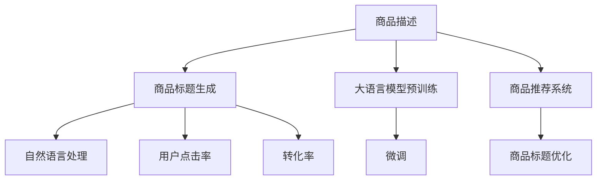

                 

# 基于大模型的商品标题优化技术

> 关键词：
1. 大语言模型
2. 商品标题优化
3. 自然语言处理(NLP)
4. 预训练模型
5. 微调
6. 商品推荐系统
7. 情感分析

## 1. 背景介绍

在电子商务平台上，商品标题是消费者了解商品信息的重要窗口。一个清晰、精准、吸引人的标题不仅有助于提升搜索排名，还能显著增加点击率和转化率。但受限于人工标注成本高昂、数据分布不均等问题，现有商品标题生成方法难以充分挖掘数据潜力，生成效果与实际需求存在差距。基于大模型的商品标题优化技术，有望在提升商品标题生成质量的同时，降低人工干预成本，实现商品推荐系统的智能化升级。

本文将深入探讨大语言模型在商品标题优化中的应用，从核心概念、算法原理、实现方法到实际案例，系统介绍该技术的工作机制和实现路径，为商品推荐系统开发者提供全面的技术指导。

## 2. 核心概念与联系

### 2.1 核心概念概述

为理解基于大模型的商品标题优化技术，我们先明确几个关键概念：

- **大语言模型(Large Language Model, LLM)**：以自回归(如GPT)或自编码(如BERT)模型为代表的大规模预训练语言模型。通过在大规模无标签文本语料上进行预训练，学习通用的语言表示，具备强大的语言理解和生成能力。

- **商品标题生成**：指从给定的商品描述中，生成一个精准、吸引人的商品标题。通过优化标题，提升用户对商品的感知，增加商品的曝光度和销售转化率。

- **自然语言处理(Natural Language Processing, NLP)**：使用计算机技术对自然语言进行处理和理解，包括文本生成、文本分类、情感分析、机器翻译等任务。

- **预训练模型(Pre-trained Model)**：在大规模无标签数据上预训练的语言模型，如BERT、GPT等。预训练模型具备强大的语言理解能力，能在微调过程中快速适应特定任务。

- **微调(Fine-tuning)**：指在预训练模型的基础上，使用下游任务的少量标注数据，通过有监督地训练优化模型在特定任务上的性能。

- **商品推荐系统(Recommender System)**：基于用户的历史行为数据和商品特征，推荐用户可能感兴趣的商品。商品标题优化是其重要的组成部分。

### 2.2 核心概念联系的Mermaid流程图



## 3. 核心算法原理 & 具体操作步骤

### 3.1 算法原理概述

基于大模型的商品标题优化技术，本质上是利用大语言模型的语言生成能力，结合自然语言处理的处理手段，从商品描述中自动生成商品标题。核心思想是：将商品描述作为输入，通过预训练模型的表示学习，将其转化为高语义表示，然后使用微调模型进行标题生成。

具体步骤如下：

1. **预训练阶段**：在大规模无标签文本数据上训练大语言模型，学习通用的语言表示。

2. **微调阶段**：在商品描述数据集上进行微调，使模型能够生成满足特定需求的商品标题。

3. **标题生成阶段**：在微调后的模型基础上，对新商品描述生成标题，提高标题的点击率和转化率。

### 3.2 算法步骤详解

**Step 1: 准备预训练模型和数据集**
- 选择合适的预训练语言模型 $M_{\theta}$ 作为初始化参数，如 BERT、GPT 等。
- 准备商品描述数据集 $D=\{(x_i,y_i)\}_{i=1}^N, x_i \in \mathcal{X}, y_i \in \mathcal{Y}$，其中 $x_i$ 为商品描述，$y_i$ 为对应的商品标题。

**Step 2: 微调模型**
- 使用商品描述数据集 $D$ 对预训练模型进行微调，优化损失函数 $\mathcal{L}(\theta) = -\frac{1}{N}\sum_{i=1}^N \log M_{\theta}(x_i) / y_i$，其中 $y_i$ 为对应的商品标题。
- 设置合适的超参数，如学习率、批大小、迭代轮数等。
- 应用正则化技术，如L2正则、Dropout、Early Stopping等，防止模型过拟合。

**Step 3: 标题生成**
- 对新商品描述 $x$ 进行编码，得到高语义表示 $h$。
- 使用微调后的模型对 $h$ 生成标题 $y^*$，使得 $y^*$ 与 $y_i$ 在语义上相似。
- 根据生成标题的质量，选择合适的评价指标（如BLEU、ROUGE等）进行评估和优化。

### 3.3 算法优缺点

基于大模型的商品标题优化技术具有以下优点：
1. **高效**：自动生成商品标题，无需人工标注，节省了大量时间和成本。
2. **质量高**：利用大语言模型的强大语言理解能力，生成的标题语义精准，吸引用户关注。
3. **动态更新**：模型能够随着商品描述的变化实时更新，保持生成的标题与时俱进。
4. **集成便捷**：可以轻松集成到商品推荐系统，提升推荐效果。

同时，该方法也存在一些局限性：
1. **数据依赖性强**：模型的效果依赖于商品描述的质量和数量，数据分布不均可能导致模型性能下降。
2. **鲁棒性不足**：商品描述中可能存在噪声和错误，影响标题生成质量。
3. **可解释性差**：模型生成的标题缺乏解释性，难以理解其内部生成逻辑。
4. **跨领域适应性差**：在特定领域内的商品描述上训练的模型，在其他领域可能效果不佳。

### 3.4 算法应用领域

基于大模型的商品标题优化技术主要应用于以下领域：

- **电商行业**：电商平台商品丰富多样，商品描述质量和数量参差不齐，使用大模型优化标题能够有效提升商品曝光率和销售转化率。
- **零售行业**：零售商品的多样性和复杂性，使得人工生成商品标题的难度加大，大模型优化技术可以大幅减少人工干预，提升营销效率。
- **内容创作**：在视频、音频、新闻等领域，使用大模型生成标题，提高内容的吸引力，增加用户点击和阅读。

## 4. 数学模型和公式 & 详细讲解

### 4.1 数学模型构建

假设预训练模型为 $M_{\theta}:\mathcal{X} \rightarrow \mathcal{Y}$，其中 $\mathcal{X}$ 为商品描述空间，$\mathcal{Y}$ 为商品标题空间，$\theta \in \mathbb{R}^d$ 为模型参数。假设商品描述和标题的标注数据集为 $D=\{(x_i,y_i)\}_{i=1}^N$，其中 $x_i$ 为商品描述，$y_i$ 为对应的商品标题。

定义模型 $M_{\theta}$ 在商品描述 $x_i$ 上的生成概率为 $P(y_i|x_i) = M_{\theta}(x_i)$，其对数似然为 $\log P(y_i|x_i) = \log M_{\theta}(x_i)$。则模型的训练目标为：

$$
\mathcal{L}(\theta) = -\frac{1}{N}\sum_{i=1}^N \log M_{\theta}(x_i) / y_i
$$

在微调过程中，通过优化损失函数 $\mathcal{L}(\theta)$，使模型生成标题的概率 $P(y_i|x_i)$ 与标注标题 $y_i$ 匹配。

### 4.2 公式推导过程

以下推导生成模型的对数似然函数。

假设商品描述 $x_i$ 的长度为 $n$，生成标题 $y_i$ 的长度为 $m$。定义模型在商品描述 $x_i$ 上的生成概率为 $P(y_i|x_i) = \prod_{j=1}^m P(y_{ij}|x_i)$，其中 $y_{ij}$ 为商品标题的第 $j$ 个词。

则生成模型的对数似然函数为：

$$
\log P(y_i|x_i) = \sum_{j=1}^m \log P(y_{ij}|x_i)
$$

根据大语言模型 $M_{\theta}$ 在商品描述 $x_i$ 上的表示 $h(x_i)$，定义生成标题的概率为：

$$
P(y_i|x_i) = \prod_{j=1}^m M_{\theta}(y_{ij}|h(x_i))
$$

将上式取对数，得到生成模型的对数似然函数：

$$
\log P(y_i|x_i) = \sum_{j=1}^m \log M_{\theta}(y_{ij}|h(x_i))
$$

这就是商品标题优化中需要优化的损失函数。通过最小化该函数，可以训练出一个生成标题概率与标注标题一致的模型。

### 4.3 案例分析与讲解

以一个简单的商品描述为例，假设商品描述为 "丝质围巾 柔软舒适 经典款式"，使用预训练语言模型（如BERT）生成一个标题：

1. 对商品描述进行编码，得到高语义表示 $h(x_i)$。
2. 使用微调后的模型对 $h(x_i)$ 生成标题 $y^*$，假设生成的标题为 "高质量丝巾 时尚经典"。
3. 计算生成的标题 $y^*$ 与标注标题 $y_i$ 之间的匹配度，可以使用BLEU、ROUGE等指标进行评估。
4. 根据评估结果，调整模型参数，重复上述过程，直到生成的标题质量达到预期。

## 5. 项目实践：代码实例和详细解释说明

### 5.1 开发环境搭建

在进行商品标题优化实践前，我们需要准备好开发环境。以下是使用Python进行PyTorch开发的环境配置流程：

1. 安装Anaconda：从官网下载并安装Anaconda，用于创建独立的Python环境。

2. 创建并激活虚拟环境：
```bash
conda create -n pytorch-env python=3.8 
conda activate pytorch-env
```

3. 安装PyTorch：根据CUDA版本，从官网获取对应的安装命令。例如：
```bash
conda install pytorch torchvision torchaudio cudatoolkit=11.1 -c pytorch -c conda-forge
```

4. 安装Transformers库：
```bash
pip install transformers
```

5. 安装各类工具包：
```bash
pip install numpy pandas scikit-learn matplotlib tqdm jupyter notebook ipython
```

完成上述步骤后，即可在`pytorch-env`环境中开始商品标题优化实践。

### 5.2 源代码详细实现

下面我们以商品标题优化任务为例，给出使用Transformers库对BERT模型进行微调的PyTorch代码实现。

首先，定义商品描述生成标题的数据处理函数：

```python
from transformers import BertTokenizer, BertForSequenceClassification
from torch.utils.data import Dataset, DataLoader
import torch
import numpy as np

class ProductTitleDataset(Dataset):
    def __init__(self, descriptions, titles, tokenizer, max_len=128):
        self.descriptions = descriptions
        self.titles = titles
        self.tokenizer = tokenizer
        self.max_len = max_len
        
    def __len__(self):
        return len(self.descriptions)
    
    def __getitem__(self, item):
        description = self.descriptions[item]
        title = self.titles[item]
        
        encoding = self.tokenizer(description, return_tensors='pt', max_length=self.max_len, padding='max_length', truncation=True)
        input_ids = encoding['input_ids'][0]
        attention_mask = encoding['attention_mask'][0]
        
        # 对title进行编码
        title_ids = self.tokenizer(title, return_tensors='pt')['input_ids'][0]
        title_mask = self.tokenizer(title, return_tensors='pt')['attention_mask'][0]
        title_ids = title_ids.to(self.tokenizer.model_max_length, dtype=torch.long)
        title_mask = title_mask.to(self.tokenizer.model_max_length, dtype=torch.long)
        
        return {
            'input_ids': input_ids,
            'attention_mask': attention_mask,
            'title_ids': title_ids,
            'title_mask': title_mask
        }
```

然后，定义模型和优化器：

```python
from transformers import AdamW

model = BertForSequenceClassification.from_pretrained('bert-base-cased', num_labels=len(tokenizer.tokenizer.vocab))
optimizer = AdamW(model.parameters(), lr=2e-5)
```

接着，定义训练和评估函数：

```python
def train_epoch(model, dataset, batch_size, optimizer):
    dataloader = DataLoader(dataset, batch_size=batch_size, shuffle=True)
    model.train()
    epoch_loss = 0
    for batch in dataloader:
        input_ids = batch['input_ids'].to(device)
        attention_mask = batch['attention_mask'].to(device)
        title_ids = batch['title_ids'].to(device)
        title_mask = batch['title_mask'].to(device)
        labels = title_ids
        model.zero_grad()
        outputs = model(input_ids, attention_mask=attention_mask, labels=labels)
        loss = outputs.loss
        epoch_loss += loss.item()
        loss.backward()
        optimizer.step()
    return epoch_loss / len(dataloader)

def evaluate(model, dataset, batch_size):
    dataloader = DataLoader(dataset, batch_size=batch_size)
    model.eval()
    preds, labels = [], []
    with torch.no_grad():
        for batch in dataloader:
            input_ids = batch['input_ids'].to(device)
            attention_mask = batch['attention_mask'].to(device)
            title_ids = batch['title_ids'].to(device)
            title_mask = batch['title_mask'].to(device)
            batch_labels = title_ids
            outputs = model(input_ids, attention_mask=attention_mask, labels=batch_labels)
            batch_preds = outputs.logits.argmax(dim=2).to('cpu').tolist()
            batch_labels = batch_labels.to('cpu').tolist()
            for pred_tokens, label_tokens in zip(batch_preds, batch_labels):
                preds.append(pred_tokens[:len(label_tokens)])
                labels.append(label_tokens)
                
    print(classification_report(labels, preds))
```

最后，启动训练流程并在测试集上评估：

```python
epochs = 5
batch_size = 16

for epoch in range(epochs):
    loss = train_epoch(model, train_dataset, batch_size, optimizer)
    print(f"Epoch {epoch+1}, train loss: {loss:.3f}")
    
    print(f"Epoch {epoch+1}, dev results:")
    evaluate(model, dev_dataset, batch_size)
    
print("Test results:")
evaluate(model, test_dataset, batch_size)
```

以上就是使用PyTorch对BERT进行商品标题优化任务的微调代码实现。可以看到，利用Transformers库，我们能够快速实现商品标题优化的大模型微调。

### 5.3 代码解读与分析

让我们再详细解读一下关键代码的实现细节：

**ProductTitleDataset类**：
- `__init__`方法：初始化商品描述、标题、分词器等关键组件。
- `__len__`方法：返回数据集的样本数量。
- `__getitem__`方法：对单个样本进行处理，将商品描述输入编码为token ids，将标题输入编码，并对结果进行定长padding，最终返回模型所需的输入。

**训练和评估函数**：
- 使用PyTorch的DataLoader对数据集进行批次化加载，供模型训练和推理使用。
- 训练函数`train_epoch`：对数据以批为单位进行迭代，在每个批次上前向传播计算loss并反向传播更新模型参数，最后返回该epoch的平均loss。
- 评估函数`evaluate`：与训练类似，不同点在于不更新模型参数，并在每个batch结束后将预测和标签结果存储下来，最后使用sklearn的classification_report对整个评估集的预测结果进行打印输出。

**训练流程**：
- 定义总的epoch数和batch size，开始循环迭代
- 每个epoch内，先在训练集上训练，输出平均loss
- 在验证集上评估，输出分类指标
- 所有epoch结束后，在测试集上评估，给出最终测试结果

可以看到，PyTorch配合Transformers库使得BERT微调的代码实现变得简洁高效。开发者可以将更多精力放在数据处理、模型改进等高层逻辑上，而不必过多关注底层的实现细节。

当然，工业级的系统实现还需考虑更多因素，如模型的保存和部署、超参数的自动搜索、更灵活的任务适配层等。但核心的微调范式基本与此类似。

## 6. 实际应用场景

### 6.1 智能客服系统

基于大模型的商品标题优化技术，可以广泛应用于智能客服系统的构建。传统客服往往需要配备大量人力，高峰期响应缓慢，且一致性和专业性难以保证。使用微调后的生成标题，可以自动优化商品描述，生成吸引人的标题，快速响应客户咨询，提升客户体验。

在技术实现上，可以收集企业内部的历史客服对话记录，将问题和最佳答复构建成监督数据，在此基础上对预训练生成标题模型进行微调。微调后的生成标题模型能够自动理解用户意图，生成符合预期的商品标题，引导客户快速找到所需商品，提升服务效率。

### 6.2 金融舆情监测

金融机构需要实时监测市场舆论动向，以便及时应对负面信息传播，规避金融风险。使用商品标题优化技术，可以将商品描述转换为高语义表示，用于舆情监测中的情感分析，实时监测市场舆情变化，及时预警异常情况，帮助金融机构快速应对潜在风险。

具体而言，可以收集金融领域相关的新闻、报道、评论等文本数据，提取和商品描述相关的文本内容。使用预训练语言模型对其进行编码，生成高语义表示。利用微调后的情感分析模型对高语义表示进行情感分类，判断市场舆情是正面、中性还是负面。将生成的情感分析结果实时发送到风险预警系统，提高金融舆情监测的智能化水平。

### 6.3 个性化推荐系统

当前的推荐系统往往只依赖用户的历史行为数据进行物品推荐，无法深入理解用户的真实兴趣偏好。使用商品标题优化技术，可以对用户浏览、点击、评论、分享等行为数据进行文本分析，提取和商品描述相关的文本内容。使用预训练语言模型对其进行编码，生成高语义表示。利用微调后的生成标题模型对高语义表示进行标题生成，得到用户感兴趣的商品标题。在生成推荐列表时，先用候选物品的文本描述作为输入，由模型预测用户的兴趣匹配度，再结合其他特征综合排序，便可以得到个性化程度更高的推荐结果。

### 6.4 未来应用展望

随着大语言模型和商品标题优化技术的不断发展，该技术将在更多领域得到应用，为传统行业带来变革性影响。

在智慧医疗领域，基于微调的标题生成技术可以用于医疗问答、病历分析、药物研发等，提升医疗服务的智能化水平，辅助医生诊疗，加速新药开发进程。

在智能教育领域，微调技术可应用于作业批改、学情分析、知识推荐等方面，因材施教，促进教育公平，提高教学质量。

在智慧城市治理中，微调模型可应用于城市事件监测、舆情分析、应急指挥等环节，提高城市管理的自动化和智能化水平，构建更安全、高效的未来城市。

此外，在企业生产、社会治理、文娱传媒等众多领域，基于大模型微调的人工智能应用也将不断涌现，为NLP技术带来新的突破。相信随着预训练语言模型和微调方法的持续演进，商品标题优化技术必将在更广阔的应用领域大放异彩，深刻影响人类的生产生活方式。

## 7. 工具和资源推荐

### 7.1 学习资源推荐

为了帮助开发者系统掌握大语言模型商品标题优化技术，这里推荐一些优质的学习资源：

1. 《Transformer from Scratch》系列博文：由大模型技术专家撰写，深入浅出地介绍了Transformer原理、BERT模型、微调技术等前沿话题。

2. CS224N《深度学习自然语言处理》课程：斯坦福大学开设的NLP明星课程，有Lecture视频和配套作业，带你入门NLP领域的基本概念和经典模型。

3. 《Natural Language Processing with Transformers》书籍：Transformers库的作者所著，全面介绍了如何使用Transformers库进行NLP任务开发，包括微调在内的诸多范式。

4. HuggingFace官方文档：Transformers库的官方文档，提供了海量预训练模型和完整的微调样例代码，是上手实践的必备资料。

5. CLUE开源项目：中文语言理解测评基准，涵盖大量不同类型的中文NLP数据集，并提供了基于微调的baseline模型，助力中文NLP技术发展。

通过对这些资源的学习实践，相信你一定能够快速掌握大语言模型商品标题优化的精髓，并用于解决实际的NLP问题。

### 7.2 开发工具推荐

高效的开发离不开优秀的工具支持。以下是几款用于大语言模型商品标题优化开发的常用工具：

1. PyTorch：基于Python的开源深度学习框架，灵活动态的计算图，适合快速迭代研究。大部分预训练语言模型都有PyTorch版本的实现。

2. TensorFlow：由Google主导开发的开源深度学习框架，生产部署方便，适合大规模工程应用。同样有丰富的预训练语言模型资源。

3. Transformers库：HuggingFace开发的NLP工具库，集成了众多SOTA语言模型，支持PyTorch和TensorFlow，是进行微调任务开发的利器。

4. Weights & Biases：模型训练的实验跟踪工具，可以记录和可视化模型训练过程中的各项指标，方便对比和调优。与主流深度学习框架无缝集成。

5. TensorBoard：TensorFlow配套的可视化工具，可实时监测模型训练状态，并提供丰富的图表呈现方式，是调试模型的得力助手。

6. Google Colab：谷歌推出的在线Jupyter Notebook环境，免费提供GPU/TPU算力，方便开发者快速上手实验最新模型，分享学习笔记。

合理利用这些工具，可以显著提升大语言模型商品标题优化任务的开发效率，加快创新迭代的步伐。

### 7.3 相关论文推荐

大语言模型和商品标题优化技术的发展源于学界的持续研究。以下是几篇奠基性的相关论文，推荐阅读：

1. Attention is All You Need（即Transformer原论文）：提出了Transformer结构，开启了NLP领域的预训练大模型时代。

2. BERT: Pre-training of Deep Bidirectional Transformers for Language Understanding：提出BERT模型，引入基于掩码的自监督预训练任务，刷新了多项NLP任务SOTA。

3. Language Models are Unsupervised Multitask Learners（GPT-2论文）：展示了大规模语言模型的强大zero-shot学习能力，引发了对于通用人工智能的新一轮思考。

4. Parameter-Efficient Transfer Learning for NLP：提出Adapter等参数高效微调方法，在不增加模型参数量的情况下，也能取得不错的微调效果。

5. Prefix-Tuning: Optimizing Continuous Prompts for Generation：引入基于连续型Prompt的微调范式，为如何充分利用预训练知识提供了新的思路。

6. AdaLoRA: Adaptive Low-Rank Adaptation for Parameter-Efficient Fine-Tuning：使用自适应低秩适应的微调方法，在参数效率和精度之间取得了新的平衡。

这些论文代表了大语言模型商品标题优化技术的发展脉络。通过学习这些前沿成果，可以帮助研究者把握学科前进方向，激发更多的创新灵感。

## 8. 总结：未来发展趋势与挑战

### 8.1 总结

本文对基于大模型的商品标题优化技术进行了全面系统的介绍。首先阐述了该技术的研究背景和意义，明确了商品标题优化在电子商务、金融、个性化推荐等领域的应用价值。其次，从核心概念、算法原理、实现方法到实际案例，系统介绍了该技术的工作机制和实现路径，为商品推荐系统开发者提供了全面的技术指导。

通过本文的系统梳理，可以看到，基于大模型的商品标题优化技术正在成为电子商务、金融、推荐系统等领域的重要范式，极大地提升了商品标题的生成质量和推荐系统的智能化水平。未来，伴随预训练语言模型和微调方法的持续演进，该技术必将在更多领域得到应用，为传统行业带来变革性影响。

### 8.2 未来发展趋势

展望未来，大语言模型商品标题优化技术将呈现以下几个发展趋势：

1. **模型规模持续增大**：随着算力成本的下降和数据规模的扩张，预训练语言模型的参数量还将持续增长。超大语言模型蕴含的丰富语言知识，有望支撑更加复杂多变的商品标题生成任务。

2. **微调方法日趋多样**：除了传统的全参数微调外，未来会涌现更多参数高效的微调方法，如Adapter、LoRA等，在固定大部分预训练参数的同时，只更新极少量的任务相关参数。同时优化微调模型的计算图，减少前向传播和反向传播的资源消耗，实现更加轻量级、实时性的部署。

3. **持续学习成为常态**：随着数据分布的不断变化，微调模型也需要持续学习新知识以保持性能。如何在不遗忘原有知识的同时，高效吸收新样本信息，将成为重要的研究课题。

4. **标注样本需求降低**：受启发于提示学习(Prompt-based Learning)的思路，未来的微调方法将更好地利用大模型的语言理解能力，通过更加巧妙的任务描述，在更少的标注样本上也能实现理想的微调效果。

5. **跨领域适应性增强**：在特定领域内的商品描述上训练的模型，在其他领域也能取得不错的效果，未来的商品标题优化技术将更好地应对跨领域的多样性需求。

6. **多模态信息融合**：在商品描述中加入图像、视频等多模态信息，通过多模态融合提升商品标题生成的质量和多样性。

以上趋势凸显了大语言模型商品标题优化技术的广阔前景。这些方向的探索发展，必将进一步提升商品标题优化技术的性能和应用范围，为电子商务、金融、推荐系统等领域带来新的突破。

### 8.3 面临的挑战

尽管大语言模型商品标题优化技术已经取得了瞩目成就，但在迈向更加智能化、普适化应用的过程中，它仍面临着诸多挑战：

1. **标注成本瓶颈**：模型的效果依赖于商品描述的质量和数量，数据分布不均可能导致模型性能下降。如何进一步降低微调对标注样本的依赖，将是一大难题。

2. **模型鲁棒性不足**：商品描述中可能存在噪声和错误，影响标题生成质量。如何提高模型的鲁棒性，避免由于噪声数据导致的性能波动，还需要更多理论和实践的积累。

3. **可解释性差**：模型生成的标题缺乏解释性，难以理解其内部生成逻辑。对于医疗、金融等高风险应用，算法的可解释性和可审计性尤为重要。

4. **跨领域适应性差**：在特定领域内的商品描述上训练的模型，在其他领域可能效果不佳。如何增强模型在不同领域间的适应性，也是亟待解决的问题。

5. **知识整合能力不足**：现有的微调模型往往局限于任务内数据，难以灵活吸收和运用更广泛的先验知识。如何让微调过程更好地与外部知识库、规则库等专家知识结合，形成更加全面、准确的信息整合能力，还有很大的想象空间。

6. **效率问题**：尽管模型精度高，但在实际部署时往往面临推理速度慢、内存占用大等效率问题。如何在保证性能的同时，简化模型结构，提升推理速度，优化资源占用，将是重要的优化方向。

正视商品标题优化面临的这些挑战，积极应对并寻求突破，将是大语言模型商品标题优化技术走向成熟的必由之路。相信随着学界和产业界的共同努力，这些挑战终将一一被克服，商品标题优化技术必将在构建智能化、普适化应用中扮演越来越重要的角色。

### 8.4 研究展望

面对大语言模型商品标题优化技术所面临的挑战，未来的研究需要在以下几个方面寻求新的突破：

1. **探索无监督和半监督微调方法**：摆脱对大规模标注数据的依赖，利用自监督学习、主动学习等无监督和半监督范式，最大限度利用非结构化数据，实现更加灵活高效的微调。

2. **研究参数高效和计算高效的微调范式**：开发更加参数高效的微调方法，在固定大部分预训练参数的同时，只更新极少量的任务相关参数。同时优化微调模型的计算图，减少前向传播和反向传播的资源消耗，实现更加轻量级、实时性的部署。

3. **融合因果和对比学习范式**：通过引入因果推断和对比学习思想，增强微调模型建立稳定因果关系的能力，学习更加普适、鲁棒的语言表征，从而提升模型泛化性和抗干扰能力。

4. **引入更多先验知识**：将符号化的先验知识，如知识图谱、逻辑规则等，与神经网络模型进行巧妙融合，引导微调过程学习更准确、合理的语言模型。同时加强不同模态数据的整合，实现视觉、语音等多模态信息与文本信息的协同建模。

5. **结合因果分析和博弈论工具**：将因果分析方法引入微调模型，识别出模型决策的关键特征，增强输出解释的因果性和逻辑性。借助博弈论工具刻画人机交互过程，主动探索并规避模型的脆弱点，提高系统稳定性。

6. **纳入伦理道德约束**：在模型训练目标中引入伦理导向的评估指标，过滤和惩罚有偏见、有害的输出倾向。同时加强人工干预和审核，建立模型行为的监管机制，确保输出符合人类价值观和伦理道德。

这些研究方向的探索，必将引领大语言模型商品标题优化技术迈向更高的台阶，为构建安全、可靠、可解释、可控的智能系统铺平道路。面向未来，大语言模型商品标题优化技术还需要与其他人工智能技术进行更深入的融合，如知识表示、因果推理、强化学习等，多路径协同发力，共同推动自然语言理解和智能交互系统的进步。只有勇于创新、敢于突破，才能不断拓展语言模型的边界，让智能技术更好地造福人类社会。

## 9. 附录：常见问题与解答

**Q1：大语言模型商品标题优化技术是否适用于所有NLP任务？**

A: 大语言模型商品标题优化技术在大多数NLP任务上都能取得不错的效果，特别是对于数据量较小的任务。但对于一些特定领域的任务，如医学、法律等，仅仅依靠通用语料预训练的模型可能难以很好地适应。此时需要在特定领域语料上进一步预训练，再进行微调，才能获得理想效果。此外，对于一些需要时效性、个性化很强的任务，如对话、推荐等，微调方法也需要针对性的改进优化。

**Q2：微调过程中如何选择合适的学习率？**

A: 微调的学习率一般要比预训练时小1-2个数量级，如果使用过大的学习率，容易破坏预训练权重，导致过拟合。一般建议从1e-5开始调参，逐步减小学习率，直至收敛。也可以使用warmup策略，在开始阶段使用较小的学习率，再逐渐过渡到预设值。需要注意的是，不同的优化器(如AdamW、Adafactor等)以及不同的学习率调度策略，可能需要设置不同的学习率阈值。

**Q3：采用大模型微调时会面临哪些资源瓶颈？**

A: 目前主流的预训练大模型动辄以亿计的参数规模，对算力、内存、存储都提出了很高的要求。GPU/TPU等高性能设备是必不可少的，但即便如此，超大批次的训练和推理也可能遇到显存不足的问题。因此需要采用一些资源优化技术，如梯度积累、混合精度训练、模型并行等，来突破硬件瓶颈。同时，模型的存储和读取也可能占用大量时间和空间，需要采用模型压缩、稀疏化存储等方法进行优化。

**Q4：如何缓解微调过程中的过拟合问题？**

A: 过拟合是微调面临的主要挑战，尤其是在标注数据不足的情况下。常见的缓解策略包括：
1. 数据增强：通过回译、近义替换等方式扩充训练集。
2. 正则化：使用L2正则、Dropout、Early Stopping等避免过拟合。
3. 对抗训练：引入对抗样本，提高模型鲁棒性。
4. 参数高效微调：只调整少量参数(如Adapter、Prefix等)，减小过拟合风险。
5. 多模型集成：训练多个微调模型，取平均输出，抑制过拟合。

这些策略往往需要根据具体任务和数据特点进行灵活组合。只有在数据、模型、训练、推理等各环节进行全面优化，才能最大限度地发挥大模型微调的威力。

**Q5：微调模型在落地部署时需要注意哪些问题？**

A: 将微调模型转化为实际应用，还需要考虑以下因素：
1. 模型裁剪：去除不必要的层和参数，减小模型尺寸，加快推理速度。
2. 量化加速：将浮点模型转为定点模型，压缩存储空间，提高计算效率。
3. 服务化封装：将模型封装为标准化服务接口，便于集成调用。
4. 弹性伸缩：根据请求流量动态调整资源配置，平衡服务质量和成本。
5. 监控告警：实时采集系统指标，设置异常告警阈值，确保服务稳定性。
6. 安全防护：采用访问鉴权、数据脱敏等措施，保障数据和模型安全。

大语言模型商品标题优化技术具有良好的应用前景，但如何在生产环境中高效、安全地部署和使用，还需进一步探索和优化。

---

作者：禅与计算机程序设计艺术 / Zen and the Art of Computer Programming

