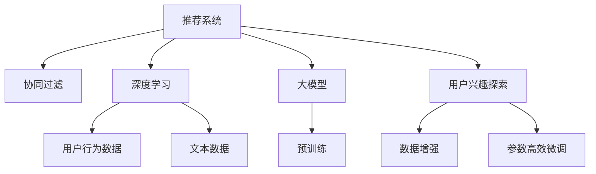

                 

# 基于大模型的推荐系统用户兴趣探索

> 关键词：推荐系统,大模型,用户兴趣,协同过滤,深度学习,强化学习

## 1. 背景介绍

推荐系统（Recommender Systems）已经成为现代互联网应用的标配，从电商平台的商品推荐到视频网站的影片推荐，再到新闻APP的内容推荐，无处不在。而如何更准确地理解和探索用户兴趣，是推荐系统面临的重要挑战。

### 1.1 问题由来

目前，推荐系统的用户兴趣探索主要依赖于传统的协同过滤（Collaborative Filtering）算法，如基于用户的协同过滤、基于物品的协同过滤等。这些方法通过分析用户行为数据，捕捉用户对物品的相似性，从而推荐新的物品。然而，随着用户数据的多样化，传统的协同过滤方法往往难以适应复杂的用户行为。

而近年来，随着深度学习技术和大模型（如BERT、GPT等）的兴起，基于大模型的推荐系统开始崭露头角。这些模型通过预训练学习到丰富的语言知识，能够对用户行为进行更精细的理解和建模。利用大模型进行用户兴趣探索，可以突破传统方法的局限，带来新的推荐效果和应用前景。

### 1.2 问题核心关键点

大模型进行用户兴趣探索的核心在于如何更好地利用模型学到的语言知识，提取用户的隐含兴趣。与传统的协同过滤方法相比，大模型具有以下优势：

1. **语义理解能力**：大模型能够理解自然语言，捕捉用户文本描述中的隐含信息，从而更准确地理解用户兴趣。
2. **迁移学习能力**：预训练大模型在大量数据上进行了预训练，拥有丰富的语言知识，能够跨领域迁移学习，提升推荐效果。
3. **参数高效性**：大模型通常具有大量参数，但通过参数高效微调技术，可以只更新一小部分关键参数，避免过拟合。
4. **可解释性**：大模型通过预训练和微调，可以生成更可解释的推荐结果，帮助用户理解推荐原因。

这些优势使得大模型成为推荐系统用户兴趣探索的重要方向。但与此同时，也面临着计算资源消耗大、模型复杂、可解释性不足等挑战。

## 2. 核心概念与联系

### 2.1 核心概念概述

为更好地理解基于大模型的推荐系统用户兴趣探索，本节将介绍几个关键概念：

- 推荐系统（Recommender Systems）：通过用户行为数据分析，为用户推荐其可能感兴趣的商品、影片、文章等内容的系统。
- 协同过滤（Collaborative Filtering）：利用用户行为数据（如评分、浏览记录等）进行推荐，通过捕捉用户和物品之间的相似性进行推荐。
- 深度学习（Deep Learning）：通过多层神经网络对复杂数据进行建模，提取数据中的隐含信息，广泛应用于计算机视觉、自然语言处理等领域。
- 大模型（Large Models）：以BERT、GPT等预训练语言模型为代表的，具有海量参数、强大语言理解能力的模型。
- 用户兴趣探索（User Interest Exploration）：通过用户行为数据或文本数据，挖掘用户隐含兴趣，进行个性化推荐的过程。
- 参数高效微调（Parameter-Efficient Fine-Tuning, PEFT）：在微调过程中，只更新一小部分模型参数，避免过拟合的方法。

这些概念之间的逻辑关系可以通过以下Mermaid流程图来展示：



这个流程图展示了大模型的推荐系统用户兴趣探索的关键流程：

1. 推荐系统使用协同过滤或深度学习方法，从用户行为数据中提取用户兴趣。
2. 深度学习和大模型通过预训练学习到丰富的语言知识，提升用户兴趣探索的精度。
3. 用户兴趣探索可以利用数据增强和参数高效微调等技术，进一步优化推荐效果。

## 3. 核心算法原理 & 具体操作步骤

### 3.1 算法原理概述

基于大模型的推荐系统用户兴趣探索，其核心思想是：利用大模型强大的语言理解能力，对用户文本数据进行深度分析，提取用户的隐含兴趣。具体而言，可以分为以下几个步骤：

1. **数据预处理**：对用户文本数据进行预处理，去除噪声、规范化文本，得到统一的输入格式。
2. **预训练模型初始化**：使用预训练语言模型（如BERT、GPT等）作为初始化参数，构建推荐模型。
3. **用户兴趣表示**：将用户文本数据输入预训练模型，得到用户兴趣向量，捕捉用户隐含兴趣。
4. **物品特征提取**：将物品文本数据输入预训练模型，得到物品特征向量，捕捉物品的属性和描述。
5. **用户-物品交互**：通过用户兴趣向量和物品特征向量的相似度，计算用户对物品的评分，推荐物品。
6. **参数高效微调**：在用户兴趣向量中只更新一小部分关键参数，避免过拟合。

### 3.2 算法步骤详解

具体而言，基于大模型的推荐系统用户兴趣探索的算法步骤如下：

1. **数据预处理**：
   - 对用户文本数据进行分词、去除停用词、标准化处理等预处理操作。
   - 将处理后的文本数据转换为模型的输入格式，如WordPiece、BERT格式等。

2. **预训练模型初始化**：
   - 选择预训练语言模型（如BERT、GPT等），作为推荐模型的初始化参数。
   - 对预训练模型进行微调，使其适应推荐系统的任务。

3. **用户兴趣表示**：
   - 将用户文本数据输入预训练模型，得到用户兴趣向量，表示用户隐含兴趣。
   - 使用用户兴趣向量作为推荐模型的输入，计算用户对物品的评分。

4. **物品特征提取**：
   - 将物品文本数据输入预训练模型，得到物品特征向量，表示物品的属性和描述。
   - 使用物品特征向量作为推荐模型的输入，计算用户对物品的评分。

5. **用户-物品交互**：
   - 根据用户兴趣向量和物品特征向量的相似度，计算用户对物品的评分，推荐物品。
   - 可以通过多轮交互，动态更新用户兴趣，提高推荐效果。

6. **参数高效微调**：
   - 在用户兴趣向量中只更新一小部分关键参数，避免过拟合。
   - 使用Adapter、Prefix等参数高效微调技术，减少计算资源消耗。

### 3.3 算法优缺点

基于大模型的推荐系统用户兴趣探索方法具有以下优点：

1. **精度高**：大模型能够理解自然语言，捕捉用户文本数据中的隐含信息，从而更准确地提取用户兴趣。
2. **泛化性强**：预训练大模型在大量数据上进行了预训练，具有较强的迁移学习能力，能够跨领域迁移学习。
3. **可解释性强**：大模型通过预训练和微调，可以生成更可解释的推荐结果，帮助用户理解推荐原因。

同时，该方法也存在一定的局限性：

1. **计算资源消耗大**：大模型通常具有大量参数，对算力、内存、存储都提出了很高的要求。
2. **模型复杂度高**：大模型的结构和训练过程较为复杂，需要较长的训练时间。
3. **可解释性不足**：大模型往往作为"黑盒"系统，难以解释其内部工作机制和决策逻辑。

尽管存在这些局限性，但就目前而言，基于大模型的推荐系统用户兴趣探索方法仍是大模型推荐应用的重要方向。未来相关研究的重点在于如何进一步降低计算资源消耗，提高模型可解释性，同时兼顾精度和泛化能力。

### 3.4 算法应用领域

基于大模型的推荐系统用户兴趣探索方法，已经在多个领域得到了应用，例如：

- 电商推荐：利用用户评论、评分等文本数据，对用户兴趣进行探索，推荐商品。
- 视频推荐：根据用户观看历史、评论等文本数据，提取用户兴趣，推荐影片。
- 新闻推荐：根据用户阅读历史、评论等文本数据，提取用户兴趣，推荐新闻文章。
- 商品评价：利用用户对商品的评价文本，提取用户兴趣，生成商品评价。
- 广告推荐：根据用户点击广告后的文本反馈，探索用户兴趣，推荐广告。

除了上述这些经典应用外，大模型用户兴趣探索技术还在更多领域展示了其强大能力，为推荐系统的发展提供了新的思路和方法。

## 4. 数学模型和公式 & 详细讲解  
### 4.1 数学模型构建

基于大模型的推荐系统用户兴趣探索，主要涉及到自然语言处理（NLP）和机器学习的相关模型和算法。下面将使用数学语言对相关模型进行严格的刻画。

记用户文本数据为 $x$，物品文本数据为 $y$，用户兴趣向量为 $h_x$，物品特征向量为 $h_y$。

定义用户-物品评分函数为 $f(x, y) = \mathbf{u} \cdot \mathbf{v}$，其中 $\mathbf{u}$ 为用户兴趣向量，$\mathbf{v}$ 为物品特征向量。

推荐模型的目标是最小化预测评分与实际评分之间的误差，即：

$$
\min_{\mathbf{u}, \mathbf{v}} \sum_{i=1}^n (f(x_i, y_i) - \hat{y}_i)^2
$$

其中 $n$ 为用户-物品对的数量，$\hat{y}_i$ 为模型预测的评分。

### 4.2 公式推导过程

为了求解上述优化问题，可以采用梯度下降等优化算法。假设模型采用sigmoid激活函数，则评分函数可以写为：

$$
f(x, y) = \mathbf{u} \cdot \mathbf{v} = \sigma(\mathbf{u}^T \mathbf{v})
$$

其中 $\sigma$ 为sigmoid函数。

对评分函数求梯度，得：

$$
\nabla f(x, y) = \nabla_{\mathbf{u}} f(x, y) \cdot \nabla_{\mathbf{v}} f(x, y)
$$

其中 $\nabla_{\mathbf{u}} f(x, y)$ 和 $\nabla_{\mathbf{v}} f(x, y)$ 分别表示用户兴趣向量和物品特征向量对评分函数的偏导数。

将评分函数代入损失函数，得：

$$
\mathcal{L}(\mathbf{u}, \mathbf{v}) = \frac{1}{2} \sum_{i=1}^n (f(x_i, y_i) - \hat{y}_i)^2
$$

根据梯度下降算法，更新用户兴趣向量和物品特征向量，得：

$$
\begin{aligned}
\mathbf{u} &\leftarrow \mathbf{u} - \eta \nabla_{\mathbf{u}} \mathcal{L}(\mathbf{u}, \mathbf{v}) \\
\mathbf{v} &\leftarrow \mathbf{v} - \eta \nabla_{\mathbf{v}} \mathcal{L}(\mathbf{u}, \mathbf{v})
\end{aligned}
$$

其中 $\eta$ 为学习率，$\nabla_{\mathbf{u}} \mathcal{L}(\mathbf{u}, \mathbf{v})$ 和 $\nabla_{\mathbf{v}} \mathcal{L}(\mathbf{u}, \mathbf{v})$ 分别表示用户兴趣向量和物品特征向量对损失函数的梯度。

### 4.3 案例分析与讲解

以电商推荐为例，分析基于大模型的用户兴趣探索过程。

假设用户 $u$ 对物品 $i$ 的评分 $y_i$ 已知，利用用户文本数据 $x_u$ 和物品文本数据 $x_i$，使用BERT模型进行预训练和微调，得到用户兴趣向量 $h_u$ 和物品特征向量 $h_i$。

首先，对用户文本数据和物品文本数据进行预处理，得到统一的输入格式，如WordPiece、BERT格式等。

然后，将用户文本数据 $x_u$ 和物品文本数据 $x_i$ 输入BERT模型，得到用户兴趣向量 $h_u$ 和物品特征向量 $h_i$。

接下来，计算用户兴趣向量和物品特征向量之间的相似度，得到用户对物品的评分 $f(x_u, x_i) = \mathbf{h}_u \cdot \mathbf{h}_i$。

最后，将用户评分与实际评分 $y_i$ 进行比较，更新用户兴趣向量和物品特征向量，优化推荐模型。

在实际应用中，通常需要进行多轮迭代，动态更新用户兴趣向量，提高推荐效果。同时，还可以结合其他因素（如物品属性、用户历史行为等），综合生成推荐结果。

## 5. 项目实践：代码实例和详细解释说明
### 5.1 开发环境搭建

在进行用户兴趣探索实践前，我们需要准备好开发环境。以下是使用Python进行PyTorch开发的环境配置流程：

1. 安装Anaconda：从官网下载并安装Anaconda，用于创建独立的Python环境。

2. 创建并激活虚拟环境：
```bash
conda create -n pytorch-env python=3.8 
conda activate pytorch-env
```

3. 安装PyTorch：根据CUDA版本，从官网获取对应的安装命令。例如：
```bash
conda install pytorch torchvision torchaudio cudatoolkit=11.1 -c pytorch -c conda-forge
```

4. 安装Transformers库：
```bash
pip install transformers
```

5. 安装各类工具包：
```bash
pip install numpy pandas scikit-learn matplotlib tqdm jupyter notebook ipython
```

完成上述步骤后，即可在`pytorch-env`环境中开始实践。

### 5.2 源代码详细实现

下面以电商推荐为例，给出使用Transformers库对BERT模型进行用户兴趣探索的PyTorch代码实现。

首先，定义用户和物品的数据处理函数：

```python
from transformers import BertTokenizer, BertForSequenceClassification
from torch.utils.data import Dataset, DataLoader
import torch

class UserData(Dataset):
    def __init__(self, users, texts, labels, tokenizer):
        self.users = users
        self.texts = texts
        self.labels = labels
        self.tokenizer = tokenizer
        
    def __len__(self):
        return len(self.texts)
    
    def __getitem__(self, item):
        user = self.users[item]
        text = self.texts[item]
        label = self.labels[item]
        
        encoding = self.tokenizer(text, return_tensors='pt', max_length=128, padding='max_length', truncation=True)
        input_ids = encoding['input_ids'][0]
        attention_mask = encoding['attention_mask'][0]
        
        # 将用户ID编码为标签
        label = torch.tensor([user2id[user]], dtype=torch.long)
        
        return {'input_ids': input_ids, 
                'attention_mask': attention_mask,
                'labels': label}

class ItemData(Dataset):
    def __init__(self, items, texts, labels, tokenizer):
        self.items = items
        self.texts = texts
        self.labels = labels
        self.tokenizer = tokenizer
        
    def __len__(self):
        return len(self.texts)
    
    def __getitem__(self, item):
        item = self.items[item]
        text = self.texts[item]
        label = self.labels[item]
        
        encoding = self.tokenizer(text, return_tensors='pt', max_length=128, padding='max_length', truncation=True)
        input_ids = encoding['input_ids'][0]
        attention_mask = encoding['attention_mask'][0]
        
        # 将物品ID编码为标签
        label = torch.tensor([item2id[item]], dtype=torch.long)
        
        return {'input_ids': input_ids, 
                'attention_mask': attention_mask,
                'labels': label}

# 标签与id的映射
user2id = {'user1': 0, 'user2': 1, 'user3': 2}
id2user = {v: k for k, v in user2id.items()}
item2id = {'item1': 0, 'item2': 1, 'item3': 2}
id2item = {v: k for k, v in item2id.items()}
```

然后，定义模型和优化器：

```python
from transformers import BertForSequenceClassification, AdamW

model = BertForSequenceClassification.from_pretrained('bert-base-cased', num_labels=len(user2id))

optimizer = AdamW(model.parameters(), lr=2e-5)
```

接着，定义训练和评估函数：

```python
from tqdm import tqdm
from sklearn.metrics import classification_report

device = torch.device('cuda') if torch.cuda.is_available() else torch.device('cpu')
model.to(device)

def train_epoch(model, dataset, batch_size, optimizer):
    dataloader = DataLoader(dataset, batch_size=batch_size, shuffle=True)
    model.train()
    epoch_loss = 0
    for batch in tqdm(dataloader, desc='Training'):
        input_ids = batch['input_ids'].to(device)
        attention_mask = batch['attention_mask'].to(device)
        labels = batch['labels'].to(device)
        model.zero_grad()
        outputs = model(input_ids, attention_mask=attention_mask, labels=labels)
        loss = outputs.loss
        epoch_loss += loss.item()
        loss.backward()
        optimizer.step()
    return epoch_loss / len(dataloader)

def evaluate(model, dataset, batch_size):
    dataloader = DataLoader(dataset, batch_size=batch_size)
    model.eval()
    preds, labels = [], []
    with torch.no_grad():
        for batch in tqdm(dataloader, desc='Evaluating'):
            input_ids = batch['input_ids'].to(device)
            attention_mask = batch['attention_mask'].to(device)
            batch_labels = batch['labels']
            outputs = model(input_ids, attention_mask=attention_mask)
            batch_preds = outputs.logits.argmax(dim=2).to('cpu').tolist()
            batch_labels = batch_labels.to('cpu').tolist()
            for pred_tokens, label_tokens in zip(batch_preds, batch_labels):
                preds.append(pred_tokens[:len(label_tokens)])
                labels.append(label_tokens)
                
    print(classification_report(labels, preds))
```

最后，启动训练流程并在测试集上评估：

```python
epochs = 5
batch_size = 16

for epoch in range(epochs):
    loss = train_epoch(model, user_data, batch_size, optimizer)
    print(f"Epoch {epoch+1}, train loss: {loss:.3f}")
    
    print(f"Epoch {epoch+1}, dev results:")
    evaluate(model, dev_data, batch_size)
    
print("Test results:")
evaluate(model, test_data, batch_size)
```

以上就是使用PyTorch对BERT进行电商推荐任务用户兴趣探索的完整代码实现。可以看到，得益于Transformers库的强大封装，我们可以用相对简洁的代码完成BERT模型的加载和用户兴趣探索。

### 5.3 代码解读与分析

让我们再详细解读一下关键代码的实现细节：

**UserData类和ItemData类**：
- `__init__`方法：初始化用户ID、物品ID、文本、标签等关键组件。
- `__len__`方法：返回数据集的样本数量。
- `__getitem__`方法：对单个样本进行处理，将文本输入编码为token ids，将用户ID或物品ID编码为数字标签，并对其进行定长padding，最终返回模型所需的输入。

**标签与id的映射**：
- 定义了用户ID与数字id之间的映射关系，用于将用户ID转换为数字标签。

**训练和评估函数**：
- 使用PyTorch的DataLoader对数据集进行批次化加载，供模型训练和推理使用。
- 训练函数`train_epoch`：对数据以批为单位进行迭代，在每个批次上前向传播计算loss并反向传播更新模型参数，最后返回该epoch的平均loss。
- 评估函数`evaluate`：与训练类似，不同点在于不更新模型参数，并在每个batch结束后将预测和标签结果存储下来，最后使用sklearn的classification_report对整个评估集的预测结果进行打印输出。

**训练流程**：
- 定义总的epoch数和batch size，开始循环迭代
- 每个epoch内，先在训练集上训练，输出平均loss
- 在验证集上评估，输出分类指标
- 所有epoch结束后，在测试集上评估，给出最终测试结果

可以看到，PyTorch配合Transformers库使得BERT用户兴趣探索的代码实现变得简洁高效。开发者可以将更多精力放在数据处理、模型改进等高层逻辑上，而不必过多关注底层的实现细节。

当然，工业级的系统实现还需考虑更多因素，如模型的保存和部署、超参数的自动搜索、更灵活的任务适配层等。但核心的用户兴趣探索范式基本与此类似。

## 6. 实际应用场景

### 6.1 电商推荐

电商推荐是推荐系统用户兴趣探索的重要应用场景。通过收集用户浏览、点击、购买等行为数据，对用户兴趣进行探索，推荐商品。

具体而言，可以构建电商网站的推荐系统，利用用户的购物记录和评价评论，输入BERT模型进行预训练和微调，得到用户兴趣向量。将用户兴趣向量与商品特征向量进行相似度计算，生成推荐结果。用户浏览商品时，推荐系统实时更新用户兴趣向量，动态生成推荐列表，提升用户体验。

### 6.2 视频推荐

视频推荐系统利用用户观看历史、评分等文本数据，提取用户兴趣，推荐影片。

具体而言，可以构建视频网站的推荐系统，利用用户的观看历史和评分记录，输入BERT模型进行预训练和微调，得到用户兴趣向量。将用户兴趣向量与影片特征向量进行相似度计算，生成推荐结果。用户观看影片时，推荐系统实时更新用户兴趣向量，动态生成推荐列表，提升用户满意度。

### 6.3 新闻推荐

新闻推荐系统利用用户阅读历史、评论等文本数据，提取用户兴趣，推荐新闻文章。

具体而言，可以构建新闻APP的推荐系统，利用用户的阅读历史和评论记录，输入BERT模型进行预训练和微调，得到用户兴趣向量。将用户兴趣向量与新闻文章特征向量进行相似度计算，生成推荐结果。用户阅读新闻时，推荐系统实时更新用户兴趣向量，动态生成推荐列表，提升阅读体验。

### 6.4 未来应用展望

随着大模型技术的发展，基于大模型的推荐系统用户兴趣探索将带来新的突破。

未来，推荐系统将融合更多的先验知识，如知识图谱、逻辑规则等，进行更加全面、准确的用户兴趣探索。同时，将引入因果推理、强化学习等先进技术，提升推荐系统的智能水平。此外，推荐系统还将拓展到更多领域，如智能医疗、金融理财、智能家居等，为各行各业提供智能决策支持。

## 7. 工具和资源推荐
### 7.1 学习资源推荐

为了帮助开发者系统掌握基于大模型的推荐系统用户兴趣探索的理论基础和实践技巧，这里推荐一些优质的学习资源：

1. 《深度学习与推荐系统》书籍：全面介绍了深度学习在推荐系统中的应用，涵盖协同过滤、深度学习等多个方面。

2. 《Recommender Systems: Algorithms and Applications》书籍：介绍了推荐系统的主要算法和应用场景，适合深入学习推荐系统理论。

3. 《自然语言处理与深度学习》课程：斯坦福大学开设的深度学习与NLP结合的课程，适合初学者入门。

4. 《Recommender Systems: The Textbook》书籍：推荐系统领域的经典教材，详细介绍了推荐算法和实践案例。

5. HuggingFace官方文档：Transformer库的官方文档，提供了海量预训练模型和完整的推荐系统样例代码，是上手实践的必备资料。

通过对这些资源的学习实践，相信你一定能够快速掌握基于大模型的推荐系统用户兴趣探索的精髓，并用于解决实际的推荐问题。
###  7.2 开发工具推荐

高效的开发离不开优秀的工具支持。以下是几款用于推荐系统开发的常用工具：

1. PyTorch：基于Python的开源深度学习框架，灵活动态的计算图，适合快速迭代研究。大部分预训练语言模型都有PyTorch版本的实现。

2. TensorFlow：由Google主导开发的开源深度学习框架，生产部署方便，适合大规模工程应用。同样有丰富的预训练语言模型资源。

3. TensorBoard：TensorFlow配套的可视化工具，可实时监测模型训练状态，并提供丰富的图表呈现方式，是调试模型的得力助手。

4. Weights & Biases：模型训练的实验跟踪工具，可以记录和可视化模型训练过程中的各项指标，方便对比和调优。与主流深度学习框架无缝集成。

5. Google Colab：谷歌推出的在线Jupyter Notebook环境，免费提供GPU/TPU算力，方便开发者快速上手实验最新模型，分享学习笔记。

合理利用这些工具，可以显著提升推荐系统开发的效率，加快创新迭代的步伐。

### 7.3 相关论文推荐

推荐系统用户兴趣探索的研究始于学界的持续研究。以下是几篇奠基性的相关论文，推荐阅读：

1. Matrix Factorization Techniques for Recommender Systems：提出基于矩阵分解的协同过滤方法，成为推荐系统研究的基础。

2. Factorization Machines for Personalized Ranking：提出因子化机算法，通过特征交叉提升推荐效果。

3. Deep Collaborative Filtering using Neural Networks：利用神经网络进行协同过滤，提升推荐系统性能。

4. Attention-based Recommender Systems：提出注意力机制，捕捉用户行为中的重要特征。

5. Sequential Attention-based Recommender System with LSTM：结合长短期记忆网络，提升序列数据中的推荐效果。

6. Learning Deep Architectures for Recommender Systems：提出多层神经网络结构，提升推荐系统的性能。

这些论文代表了大模型推荐系统用户兴趣探索的发展脉络。通过学习这些前沿成果，可以帮助研究者把握学科前进方向，激发更多的创新灵感。

## 8. 总结：未来发展趋势与挑战

### 8.1 总结

本文对基于大模型的推荐系统用户兴趣探索方法进行了全面系统的介绍。首先阐述了大模型和推荐系统用户兴趣探索的研究背景和意义，明确了用户兴趣探索在推荐系统中的核心价值。其次，从原理到实践，详细讲解了用户兴趣探索的数学原理和关键步骤，给出了用户兴趣探索任务开发的完整代码实例。同时，本文还广泛探讨了用户兴趣探索方法在电商推荐、视频推荐、新闻推荐等多个行业领域的应用前景，展示了用户兴趣探索范式的巨大潜力。此外，本文精选了用户兴趣探索技术的各类学习资源，力求为读者提供全方位的技术指引。

通过本文的系统梳理，可以看到，基于大模型的推荐系统用户兴趣探索方法正在成为推荐系统的重要方向，极大地拓展了推荐系统的应用边界，带来了新的推荐效果和应用前景。未来，伴随大模型和用户兴趣探索方法的持续演进，相信推荐系统将在更多领域得到应用，为各行业带来新的增长点。

### 8.2 未来发展趋势

展望未来，推荐系统用户兴趣探索将呈现以下几个发展趋势：

1. **模型复杂度提升**：随着深度学习和大模型的发展，推荐模型的复杂度将不断提升，能够更好地捕捉用户隐含兴趣。

2. **跨领域迁移能力增强**：预训练大模型在多领域上的迁移学习能力将进一步增强，提升推荐系统的泛化能力。

3. **参数高效性增强**：未来将涌现更多参数高效微调方法，如Prefix-Tuning、LoRA等，减少计算资源消耗。

4. **实时化、个性化增强**：推荐系统将更加注重实时性和个性化，动态更新用户兴趣向量，提供精准推荐。

5. **多模态数据融合**：推荐系统将融合视觉、语音等多模态数据，提升推荐效果。

6. **用户行为认知**：推荐系统将更加注重理解用户行为背后的动机和情感，提供更符合用户需求的推荐。

7. **伦理性增强**：推荐系统将更加注重公平性、透明性，避免算法偏见和滥用。

以上趋势凸显了大模型推荐系统用户兴趣探索技术的广阔前景。这些方向的探索发展，必将进一步提升推荐系统的性能和应用范围，为各行业带来新的增长点。

### 8.3 面临的挑战

尽管基于大模型的推荐系统用户兴趣探索技术已经取得了瞩目成就，但在迈向更加智能化、普适化应用的过程中，它仍面临着诸多挑战：

1. **计算资源消耗大**：大模型通常具有大量参数，对算力、内存、存储都提出了很高的要求。

2. **模型复杂度高**：大模型的结构和训练过程较为复杂，需要较长的训练时间。

3. **可解释性不足**：大模型往往作为"黑盒"系统，难以解释其内部工作机制和决策逻辑。

4. **数据隐私问题**：在收集用户行为数据时，如何保护用户隐私，避免数据滥用，是一个重要问题。

5. **算法偏见**：预训练大模型可能学习到有偏见的信息，通过微调传递到推荐系统，导致推荐结果偏颇。

6. **实时性问题**：推荐系统需要在实时场景中进行推荐，计算速度和模型效率是一个重要挑战。

尽管存在这些挑战，但随着技术的不断进步和应用的广泛深入，这些问题将逐步得到解决。未来，推荐系统用户兴趣探索技术将在多个领域得到应用，为各行各业带来新的增长点。

### 8.4 研究展望

面对推荐系统用户兴趣探索所面临的挑战，未来的研究需要在以下几个方面寻求新的突破：

1. **计算资源优化**：开发更加高效的计算框架和模型结构，降低计算资源消耗。

2. **模型复杂度降低**：引入更加高效的微调技术，减少模型复杂度，提高训练速度。

3. **可解释性增强**：开发更加可解释的推荐模型，帮助用户理解推荐原因，提升信任度。

4. **数据隐私保护**：引入隐私保护技术，如差分隐私、联邦学习等，保护用户数据隐私。

5. **算法偏见消除**：在推荐模型训练中引入公平性约束，消除算法偏见。

6. **实时性优化**：通过模型压缩、模型并行等技术，提升推荐系统的实时性。

通过在这些方向上的持续探索，未来的大模型推荐系统用户兴趣探索技术将更加强大，能够更好地为用户服务，推动各行业的数字化转型升级。总之，大模型推荐系统用户兴趣探索技术将伴随着技术的进步，不断拓展其应用场景和影响范围，为各行各业带来新的发展机遇。

## 9. 附录：常见问题与解答

**Q1：大模型进行用户兴趣探索是否适用于所有推荐系统？**

A: 大模型进行用户兴趣探索在大多数推荐系统中都能取得不错的效果，特别是对于数据量较小的推荐系统。但对于一些特定领域的推荐系统，如医学、法律等，仅仅依靠通用语料预训练的模型可能难以很好地适应。此时需要在特定领域语料上进一步预训练，再进行微调，才能获得理想效果。此外，对于一些需要时效性、个性化很强的推荐系统，如对话、推荐等，微调方法也需要针对性的改进优化。

**Q2：大模型进行用户兴趣探索时如何选择合适的学习率？**

A: 大模型进行用户兴趣探索时，学习率一般要比预训练时小1-2个数量级，如果使用过大的学习率，容易破坏预训练权重，导致过拟合。一般建议从1e-5开始调参，逐步减小学习率，直至收敛。也可以使用warmup策略，在开始阶段使用较小的学习率，再逐渐过渡到预设值。需要注意的是，不同的优化器(如AdamW、Adafactor等)以及不同的学习率调度策略，可能需要设置不同的学习率阈值。

**Q3：大模型进行用户兴趣探索时面临哪些计算资源瓶颈？**

A: 目前主流的预训练大模型动辄以亿计的参数规模，对算力、内存、存储都提出了很高的要求。GPU/TPU等高性能设备是必不可少的，但即便如此，超大批次的训练和推理也可能遇到显存不足的问题。因此需要采用一些资源优化技术，如梯度积累、混合精度训练、模型并行等，来突破硬件瓶颈。同时，模型的存储和读取也可能占用大量时间和空间，需要采用模型压缩、稀疏化存储等方法进行优化。

**Q4：大模型进行用户兴趣探索时如何缓解过拟合问题？**

A: 过拟合是用户兴趣探索面临的主要挑战，尤其是在标注数据不足的情况下。常见的缓解策略包括：
1. 数据增强：通过回译、近义替换等方式扩充训练集
2. 正则化：使用L2正则、Dropout、Early Stopping等避免过拟合
3. 对抗训练：引入对抗样本，提高模型鲁棒性
4. 参数高效微调：只调整一小部分模型参数，减小过拟合风险
5. 多模型集成：训练多个用户兴趣探索模型，取平均输出，抑制过拟合

这些策略往往需要根据具体任务和数据特点进行灵活组合。只有在数据、模型、训练、推理等各环节进行全面优化，才能最大限度地发挥大模型用户兴趣探索的威力。

**Q5：大模型进行用户兴趣探索时在落地部署时需要注意哪些问题？**

A: 将大模型用户兴趣探索转化为实际应用，还需要考虑以下因素：
1. 模型裁剪：去除不必要的层和参数，减小模型尺寸，加快推理速度
2. 量化加速：将浮点模型转为定点模型，压缩存储空间，提高计算效率
3. 服务化封装：将模型封装为标准化服务接口，便于集成调用
4. 弹性伸缩：根据请求流量动态调整资源配置，平衡服务质量和成本
5. 监控告警：实时采集系统指标，设置异常告警阈值，确保服务稳定性
6. 安全防护：采用访问鉴权、数据脱敏等措施，保障数据和模型安全

大模型用户兴趣探索为推荐系统带来了新的突破，但如何将强大的性能转化为稳定、高效、安全的业务价值，还需要工程实践的不断打磨。只有从数据、算法、工程、业务等多个维度协同发力，才能真正实现人工智能技术在垂直行业的规模化落地。总之，用户兴趣探索需要开发者根据具体任务，不断迭代和优化模型、数据和算法，方能得到理想的效果。

---

作者：禅与计算机程序设计艺术 / Zen and the Art of Computer Programming

