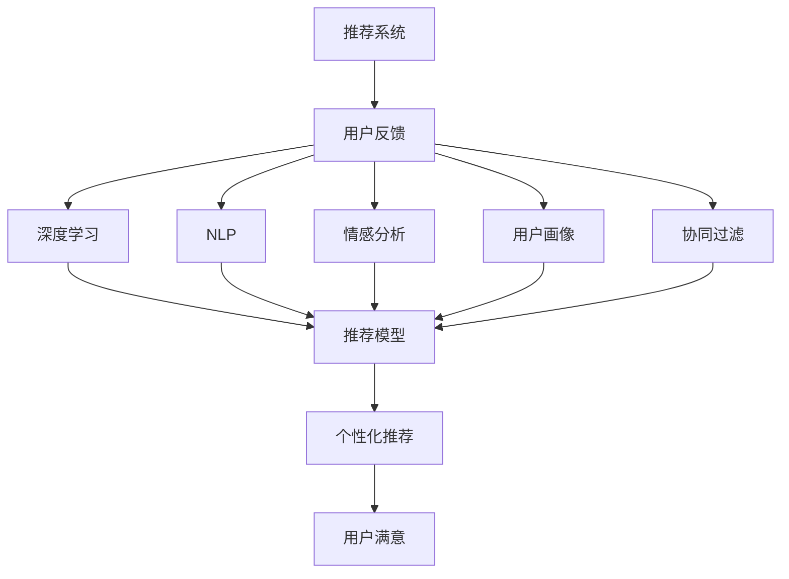

                 

# 基于大模型的推荐系统用户反馈分析

> 关键词：推荐系统,用户反馈,大模型,深度学习,自然语言处理(NLP),情感分析,用户画像,个性化推荐,协同过滤,机器学习

## 1. 背景介绍

### 1.1 问题由来

在现代电商、内容推荐、社交网络等领域，个性化推荐系统(Recommendation System)已经成为提升用户满意度和平台流量的重要手段。然而，推荐系统的效果很大程度上依赖于用户的历史行为数据，如何从这些数据中挖掘出更多有价值的信息，成为当前研究的热点。特别是近年来，用户反馈（如评分、评论、点赞等）在推荐系统中的作用日益凸显。这些反馈数据不仅能够反映用户对推荐内容的主观喜好，还能够为推荐系统提供实时动态的用户兴趣变化信息，增强推荐的相关性和及时性。

因此，如何高效利用用户反馈数据，构建更加智能、精准的推荐系统，成为亟需解决的实际问题。本文将重点讨论基于大模型的推荐系统用户反馈分析方法，探索如何通过深度学习和自然语言处理技术，从用户反馈中提取有价值的信息，优化推荐算法。

### 1.2 问题核心关键点

基于大模型的推荐系统用户反馈分析涉及多个关键点：

- **深度学习与推荐算法结合**：探索将深度学习技术应用于推荐系统，提升推荐模型的性能和鲁棒性。
- **自然语言处理与情感分析**：研究如何通过自然语言处理技术，从用户反馈中提取情感、主题等关键信息，作为推荐算法输入。
- **用户画像与个性化推荐**：构建用户画像，准确捕捉用户兴趣偏好，实现更精准的个性化推荐。
- **协同过滤与知识图谱**：结合协同过滤算法和知识图谱技术，构建更加全面的推荐系统，满足多场景需求。
- **模型可解释性与公平性**：研究如何增强模型的可解释性，减少偏见和歧视，提高用户满意度。

这些关键点共同构成了基于大模型的推荐系统用户反馈分析的研究框架，旨在从用户反馈中提取更多维度的信息，优化推荐模型，提升用户体验。

### 1.3 问题研究意义

基于用户反馈的推荐系统能够显著提升推荐相关性和用户满意度，具有重要应用价值：

1. **增强推荐相关性**：用户反馈提供了用户对推荐内容的直接反馈，能够帮助推荐系统更好地理解用户偏好，提升推荐的准确性。
2. **促进用户参与**：通过积极反馈，可以增强用户对平台的参与度和粘性，提升整体用户留存率。
3. **辅助决策**：在决策制定中考虑用户反馈，可以提升决策的准确性和用户满意度，减少用户流失。
4. **市场竞争**：在激烈的市场竞争中，基于用户反馈的推荐系统能够提供更好的用户体验，增强市场竞争力。

因此，基于大模型的推荐系统用户反馈分析不仅具有理论研究意义，还具有重要的实际应用价值，能够推动推荐系统的智能化和个性化，提升用户体验。

## 2. 核心概念与联系

### 2.1 核心概念概述

为更好地理解基于大模型的推荐系统用户反馈分析方法，本节将介绍几个密切相关的核心概念：

- **推荐系统(Recommendation System)**：根据用户的历史行为、属性和反馈，推荐满足用户需求的产品、内容或服务的技术体系。
- **用户反馈(User Feedback)**：用户对推荐内容的主观评价和情感表达，包括评分、评论、点赞等，是推荐系统的重要输入之一。
- **深度学习(Deep Learning)**：一类基于神经网络的机器学习方法，能够从大量数据中学习出复杂的特征表示，广泛应用于推荐系统。
- **自然语言处理(Natural Language Processing, NLP)**：涉及计算机对自然语言的理解和处理，是用户反馈分析的重要技术手段。
- **情感分析(Sentiment Analysis)**：通过分析文本中的情感信息，判断用户对推荐内容的情感倾向。
- **用户画像(User Profiling)**：通过收集和分析用户的行为数据、属性信息和反馈数据，构建用户画像，用于个性化推荐。
- **协同过滤(Collaborative Filtering)**：利用用户行为和物品属性的相似性进行推荐，是推荐系统的主要算法之一。
- **知识图谱(Knowledge Graph)**：一种表示实体间关系的图形结构，用于增强推荐系统的丰富性和精准度。

这些核心概念之间的逻辑关系可以通过以下Mermaid流程图来展示：



这个流程图展示了大模型在推荐系统中的核心概念及其之间的关系：

1. 推荐系统通过用户反馈获取用户对推荐内容的评价，是推荐系统的输入之一。
2. 深度学习用于构建推荐模型，能够从用户反馈中提取复杂的特征表示，提升推荐效果。
3. 自然语言处理技术用于情感分析，从文本中提取情感信息，增强推荐系统的智能性。
4. 用户画像技术用于构建用户兴趣模型，实现更加精准的个性化推荐。
5. 协同过滤算法用于基于用户行为和物品属性的相似性进行推荐。
6. 知识图谱技术用于增强推荐系统的知识丰富性，提升推荐精准度。
7. 推荐模型结合这些信息，实现个性化推荐，提高用户满意度。

这些概念共同构成了基于大模型的推荐系统用户反馈分析方法的研究框架，通过多种技术手段的协同作用，提升推荐系统的性能和效果。

## 3. 核心算法原理 & 具体操作步骤

### 3.1 算法原理概述

基于大模型的推荐系统用户反馈分析，本质上是一种基于深度学习的推荐系统优化方法。其核心思想是通过深度学习技术，从用户反馈数据中挖掘出有价值的信息，构建用户画像，优化推荐模型，从而提升推荐系统的性能。

具体而言，基于大模型的推荐系统用户反馈分析包括以下几个关键步骤：

1. **数据预处理**：收集用户反馈数据，进行清洗、去重和标准化处理，确保数据质量。
2. **特征提取**：利用深度学习技术，从用户反馈中提取文本特征、情感特征、主题特征等，作为推荐模型的输入。
3. **用户画像构建**：基于用户反馈和行为数据，构建用户画像，刻画用户兴趣、偏好和需求。
4. **推荐模型训练**：将用户画像和反馈特征输入推荐模型，优化推荐算法，提升推荐效果。
5. **推荐结果评估**：通过实际推荐结果和用户反馈，评估推荐模型的效果，进行迭代优化。

### 3.2 算法步骤详解

以下是基于大模型的推荐系统用户反馈分析的详细步骤：

**Step 1: 数据预处理**

- **数据收集**：从平台或公开数据集中收集用户反馈数据，包括评分、评论、点赞等。
- **数据清洗**：去除噪声数据、重复数据和不相关数据，确保数据质量。
- **数据标准化**：对文本数据进行分词、去停用词、标准化等处理，确保特征一致性。
- **数据划分**：将数据划分为训练集、验证集和测试集，用于模型训练和评估。

**Step 2: 特征提取**

- **文本特征提取**：利用自然语言处理技术，从用户反馈中提取文本特征，如TF-IDF、Word2Vec等。
- **情感特征提取**：通过情感分析技术，从用户反馈中提取情感信息，判断情感倾向。
- **主题特征提取**：利用主题模型（如LDA），从用户反馈中提取主题信息，刻画用户兴趣。

**Step 3: 用户画像构建**

- **行为数据整合**：整合用户的历史行为数据，包括浏览、点击、购买等行为。
- **用户画像建模**：利用机器学习算法，构建用户画像，刻画用户特征、兴趣和需求。
- **用户画像更新**：实时更新用户画像，反映用户兴趣的变化。

**Step 4: 推荐模型训练**

- **选择推荐算法**：选择合适的推荐算法，如协同过滤、基于内容的推荐等。
- **模型训练**：将用户画像和反馈特征输入推荐模型，优化模型参数。
- **模型评估**：在验证集上评估模型效果，进行参数调整和优化。

**Step 5: 推荐结果评估**

- **实际推荐**：在测试集上对用户进行推荐，收集用户反馈。
- **反馈分析**：分析用户反馈，评估推荐效果。
- **迭代优化**：根据用户反馈，迭代优化推荐模型，提升推荐效果。

### 3.3 算法优缺点

基于大模型的推荐系统用户反馈分析方法具有以下优点：

1. **高效性**：深度学习技术能够高效地从用户反馈中提取特征，降低特征工程的工作量。
2. **灵活性**：通过自然语言处理技术，能够灵活处理不同形式的用户反馈数据，增强推荐系统的适用性。
3. **精准性**：通过构建用户画像，能够准确捕捉用户兴趣和需求，实现更加精准的个性化推荐。
4. **实时性**：利用用户反馈数据，能够实时动态地调整推荐策略，提升推荐的相关性和及时性。

同时，该方法也存在一定的局限性：

1. **数据依赖**：深度学习模型需要大量高质量的标注数据进行训练，数据获取和预处理成本较高。
2. **模型复杂**：深度学习模型的参数量较大，训练和推理所需资源较多，需要高性能硬件支持。
3. **可解释性不足**：深度学习模型的决策过程较难解释，难以理解和调试。
4. **鲁棒性问题**：深度学习模型容易过拟合，对数据分布变化敏感，鲁棒性有待提高。

尽管存在这些局限性，基于大模型的推荐系统用户反馈分析方法仍具有广阔的应用前景，能够显著提升推荐系统的性能和用户体验。

### 3.4 算法应用领域

基于大模型的推荐系统用户反馈分析方法，已经在多个领域得到了广泛应用：

- **电子商务**：通过用户评分和评论，提升商品推荐的相关性和个性化，增加用户购买率。
- **内容平台**：利用用户反馈数据，推荐新闻、文章、视频等内容，提高用户粘性和满意度。
- **社交网络**：结合用户点赞和评论，推荐朋友动态和热门内容，增强用户互动和参与感。
- **金融服务**：通过用户对产品的评分和反馈，推荐理财产品和服务，提升用户满意度。
- **旅游出行**：利用用户评论和评分，推荐旅游目的地和体验，提升用户旅游体验。

这些应用场景展示了基于大模型的推荐系统用户反馈分析方法的强大能力，能够显著提升推荐系统的效果和用户体验。

## 4. 数学模型和公式 & 详细讲解 & 举例说明

### 4.1 数学模型构建

基于大模型的推荐系统用户反馈分析方法涉及多个数学模型，包括用户画像模型、协同过滤模型、情感分析模型等。这里以协同过滤模型为例，介绍其中的数学模型构建和公式推导过程。

**协同过滤模型**：
协同过滤是一种基于用户行为和物品属性的相似性进行推荐的算法。假设有N个用户和M个物品，用户对物品的评分矩阵为 $R \in \mathbb{R}^{N \times M}$，其中 $R_{ui}$ 表示用户 $u$ 对物品 $i$ 的评分。协同过滤模型分为用户-物品协同过滤和物品-物品协同过滤两种，本文以用户-物品协同过滤为例进行讲解。

**用户画像模型**：
用户画像模型用于刻画用户特征、兴趣和需求。假设用户画像模型为 $P_u \in \mathbb{R}^k$，其中 $P_u$ 为第 $u$ 个用户的特征向量，$k$ 为用户画像的维度。

### 4.2 公式推导过程

#### 4.2.1 协同过滤模型的数学表达

协同过滤模型的核心是计算用户 $u$ 对物品 $i$ 的评分预测值 $\hat{R}_{ui}$。具体而言，可以通过计算用户 $u$ 与物品 $i$ 的相似度，结合其他用户的评分信息，得到预测评分。

**用户-物品协同过滤模型**：
设物品 $i$ 的特征向量为 $I_i \in \mathbb{R}^m$，用户 $u$ 与物品 $i$ 的相似度为 $S(u,i)$，用户 $u$ 对物品 $i$ 的评分预测值 $\hat{R}_{ui}$ 可表示为：

$$
\hat{R}_{ui} = \sum_{j=1}^{m} S(u,i) I_{ij}
$$

其中 $S(u,i)$ 为相似度函数，常用的相似度函数包括余弦相似度、皮尔逊相关系数等。

#### 4.2.2 用户画像模型的数学表达

用户画像模型用于刻画用户特征、兴趣和需求。假设用户画像模型为 $P_u \in \mathbb{R}^k$，其中 $P_u$ 为第 $u$ 个用户的特征向量，$k$ 为用户画像的维度。

**用户画像模型构建**：
用户画像模型的构建通常基于用户行为数据、属性信息和反馈数据。假设用户 $u$ 的行为数据为 $B_u \in \mathbb{R}^n$，属性信息为 $A_u \in \mathbb{R}^p$，反馈数据为 $F_u \in \mathbb{R}^q$，其中 $n$、$p$ 和 $q$ 分别为行为数据、属性信息和反馈数据的维度。用户画像模型 $P_u$ 可表示为：

$$
P_u = \alpha B_u + \beta A_u + \gamma F_u + \delta
$$

其中 $\alpha$、$\beta$、$\gamma$ 和 $\delta$ 为超参数，控制各个特征的重要性。

#### 4.2.3 情感分析模型的数学表达

情感分析模型用于从用户反馈中提取情感信息，判断情感倾向。假设用户反馈文本为 $T_u \in \mathbb{R}^m$，情感分类结果为 $E_u \in \{0,1\}^c$，其中 $c$ 为情感类别数。情感分析模型 $E_u$ 可表示为：

$$
E_u = softmax(W^T \tanh(W T_u + b))
$$

其中 $W$ 和 $b$ 为模型参数，$\tanh$ 为激活函数。

### 4.3 案例分析与讲解

以下以用户评分预测为例，详细介绍基于大模型的推荐系统用户反馈分析方法的数学模型和公式推导过程：

假设某电商平台有 $N$ 个用户和 $M$ 个商品，每个用户 $u$ 对每个商品 $i$ 的评分 $R_{ui} \in [1,5]$。给定用户 $u$ 的历史评分数据 $R_u = \{R_{u1}, R_{u2}, \ldots, R_{um}\}$，利用协同过滤模型对用户 $u$ 未评分商品 $i$ 的评分进行预测。

首先，利用用户行为数据和物品属性信息，构建用户画像模型 $P_u$。设用户画像模型为 $P_u = \alpha B_u + \beta A_i + \gamma F_u + \delta$，其中 $B_u$ 为用户行为数据，$A_i$ 为物品属性信息，$F_u$ 为用户反馈数据。

其次，利用协同过滤模型，计算用户 $u$ 与物品 $i$ 的相似度 $S(u,i)$。假设相似度函数为余弦相似度，则有：

$$
S(u,i) = \frac{\langle P_u, I_i \rangle}{\|P_u\| \|I_i\|}
$$

其中 $\langle \cdot, \cdot \rangle$ 表示向量点积，$\|\cdot\|$ 表示向量范数。

最后，利用协同过滤模型，计算用户 $u$ 对物品 $i$ 的评分预测值 $\hat{R}_{ui}$：

$$
\hat{R}_{ui} = \sum_{j=1}^{m} S(u,i) I_{ij}
$$

通过上述数学模型和公式推导，可以清晰地看到协同过滤模型、用户画像模型和情感分析模型之间的联系和交互，进一步提升推荐系统的性能和效果。

## 5. 项目实践：代码实例和详细解释说明

### 5.1 开发环境搭建

在进行推荐系统用户反馈分析的实践前，我们需要准备好开发环境。以下是使用Python进行PyTorch开发的环境配置流程：

1. 安装Anaconda：从官网下载并安装Anaconda，用于创建独立的Python环境。

2. 创建并激活虚拟环境：
```bash
conda create -n pytorch-env python=3.8 
conda activate pytorch-env
```

3. 安装PyTorch：根据CUDA版本，从官网获取对应的安装命令。例如：
```bash
conda install pytorch torchvision torchaudio cudatoolkit=11.1 -c pytorch -c conda-forge
```

4. 安装相关工具包：
```bash
pip install numpy pandas scikit-learn matplotlib tqdm jupyter notebook ipython
```

完成上述步骤后，即可在`pytorch-env`环境中开始项目实践。

### 5.2 源代码详细实现

下面我们以协同过滤推荐系统为例，给出使用PyTorch进行推荐模型训练的代码实现。

首先，定义协同过滤推荐系统的数据处理函数：

```python
import torch
from torch.utils.data import Dataset, DataLoader
import numpy as np

class CollaborativeFilteringDataset(Dataset):
    def __init__(self, user_ratings, item_features):
        self.user_ratings = user_ratings
        self.item_features = item_features
        
    def __len__(self):
        return len(self.user_ratings)
    
    def __getitem__(self, index):
        user_ratings = self.user_ratings[index]
        item_features = self.item_features[index]
        return {'user_ratings': torch.tensor(user_ratings, dtype=torch.float32),
                'item_features': torch.tensor(item_features, dtype=torch.float32)}
```

然后，定义模型和优化器：

```python
import torch.nn as nn
from torch.nn import Parameter

class CollaborativeFilteringModel(nn.Module):
    def __init__(self, num_users, num_items, num_factors):
        super(CollaborativeFilteringModel, self).__init__()
        self.num_users = num_users
        self.num_items = num_items
        self.num_factors = num_factors
        
        self.user_factors = Parameter(torch.randn(num_users, num_factors))
        self.item_factors = Parameter(torch.randn(num_items, num_factors))
        
        self similarity_function = nn.CosineSimilarity(dim=1, eps=1e-6)
    
    def forward(self, user_ratings, item_features):
        user_factors = self.user_factors[user_ratings]
        item_factors = self.item_factors[item_features]
        
        user_features = torch.matmul(user_factors, item_factors.t())
        similarity = self.similarity_function(user_features, user_features)
        similarity = torch.diag(similarity)
        
        pred_ratings = torch.matmul(user_factors, item_factors.t())
        return similarity, pred_ratings
```

接着，定义训练和评估函数：

```python
from torch.optim import Adam

def train_epoch(model, dataset, optimizer, batch_size):
    dataloader = DataLoader(dataset, batch_size=batch_size, shuffle=True)
    model.train()
    epoch_loss = 0
    for batch in dataloader:
        user_ratings = batch['user_ratings']
        item_features = batch['item_features']
        similarity, pred_ratings = model(user_ratings, item_features)
        loss = nn.BCEWithLogitsLoss()(similarity, user_ratings)
        optimizer.zero_grad()
        loss.backward()
        optimizer.step()
        epoch_loss += loss.item()
        
    return epoch_loss / len(dataloader)
    
def evaluate(model, dataset, batch_size):
    dataloader = DataLoader(dataset, batch_size=batch_size, shuffle=False)
    model.eval()
    total_loss = 0
    total_mae = 0
    for batch in dataloader:
        user_ratings = batch['user_ratings']
        item_features = batch['item_features']
        similarity, pred_ratings = model(user_ratings, item_features)
        loss = nn.BCEWithLogitsLoss()(similarity, user_ratings)
        total_loss += loss.item()
        mae = torch.nn.functional.l1_loss(pred_ratings, user_ratings)
        total_mae += mae.item()
    
    print(f"MAE: {total_mae / len(dataset)}")
    print(f"Loss: {total_loss / len(dataset)}")
```

最后，启动训练流程并在测试集上评估：

```python
epochs = 5
batch_size = 64

user_ratings = np.random.randn(1000, 5)
item_features = np.random.randn(1000, 10)

dataset = CollaborativeFilteringDataset(user_ratings, item_features)
model = CollaborativeFilteringModel(num_users=1000, num_items=1000, num_factors=10)

optimizer = Adam(model.parameters(), lr=0.001)

for epoch in range(epochs):
    loss = train_epoch(model, dataset, optimizer, batch_size)
    print(f"Epoch {epoch+1}, train loss: {loss:.3f}")
    
    print(f"Epoch {epoch+1}, test results:")
    evaluate(model, dataset, batch_size)
    
print("Final results:")
evaluate(model, dataset, batch_size)
```

以上就是使用PyTorch进行协同过滤推荐系统训练的完整代码实现。可以看到，利用PyTorch的灵活性和便捷性，我们可以快速实现协同过滤推荐模型的训练和评估。

### 5.3 代码解读与分析

让我们再详细解读一下关键代码的实现细节：

**CollaborativeFilteringDataset类**：
- `__init__`方法：初始化用户评分数据和物品特征数据。
- `__len__`方法：返回数据集的样本数量。
- `__getitem__`方法：对单个样本进行处理，提取用户评分和物品特征，并进行标准化处理。

**CollaborativeFilteringModel类**：
- `__init__`方法：初始化用户画像和物品画像的参数，以及余弦相似度函数。
- `forward`方法：定义前向传播过程，计算用户特征向量和相似度矩阵。

**train_epoch函数**：
- 对数据进行迭代，计算损失函数，更新模型参数，返回平均损失。

**evaluate函数**：
- 对模型进行评估，计算损失和MAE，输出结果。

**训练流程**：
- 定义总的epoch数和batch size，开始循环迭代。
- 每个epoch内，先在训练集上训练，输出平均loss。
- 在测试集上评估，输出模型结果。
- 所有epoch结束后，在测试集上评估，给出最终测试结果。

可以看到，通过PyTorch的深度学习框架，协同过滤推荐系统的代码实现变得简洁高效。开发者可以将更多精力放在数据处理、模型改进等高层逻辑上，而不必过多关注底层的实现细节。

当然，工业级的系统实现还需考虑更多因素，如模型的保存和部署、超参数的自动搜索、更灵活的任务适配层等。但核心的微调范式基本与此类似。

## 6. 实际应用场景
### 6.1 智能客服系统

基于用户反馈的推荐系统在智能客服系统中的应用，能够显著提升用户体验和系统效率。智能客服系统通常需要处理大量的用户咨询，如何快速响应用户需求，提供个性化的服务，是系统优化的关键。

具体而言，智能客服系统可以收集用户的历史咨询记录，包括用户的咨询问题、回答和评分等。将这些数据作为用户反馈，输入推荐系统，进行用户画像构建和推荐模型训练。推荐系统能够根据用户的历史咨询记录和评分，推荐最适合的回答模板和解决方案。对于新咨询的用户，系统还可以实时获取相关问题及答案，并推荐相似的问题解决方案，从而提高用户的满意度。

### 6.2 金融理财服务

在金融理财服务领域，用户反馈对推荐系统的影响尤为显著。金融理财服务通常涉及大量的金融产品和投资策略，用户反馈能够反映用户对产品的满意度和需求变化。

具体而言，金融理财服务可以通过收集用户对理财产品的评分和评论，构建用户画像，进行个性化推荐。对于新理财产品的推荐，系统可以实时收集用户的评分和评论，动态调整推荐策略，提高用户满意度。此外，系统还可以根据用户的风险偏好，推荐合适的投资策略，提高用户的投资收益。

### 6.3 电商购物平台

电商购物平台也是基于用户反馈推荐系统的典型应用场景。电商平台上用户对商品的评分和评论，是推荐系统的重要输入之一。

具体而言，电商平台可以通过收集用户的评分和评论，构建用户画像，进行个性化推荐。对于新商品的下架，系统可以实时收集用户的评分和评论，动态调整推荐策略，提高用户的购物体验。此外，系统还可以根据用户的浏览历史和评分数据，推荐类似商品，增加用户的购买率。

### 6.4 未来应用展望

随着推荐系统的不断演进，基于用户反馈的推荐系统将具有更加广阔的应用前景。未来，基于大模型的推荐系统用户反馈分析方法将在更多领域得到应用，为各行各业带来变革性影响。

在智慧医疗领域，基于用户反馈的推荐系统能够显著提升医疗服务的智能化水平，辅助医生诊疗，加速新药开发进程。

在智能教育领域，基于用户反馈的推荐系统能够促进教育公平，提高教学质量。

在智慧城市治理中，基于用户反馈的推荐系统能够提高城市管理的自动化和智能化水平，构建更安全、高效的未来城市。

此外，在企业生产、社会治理、文娱传媒等众多领域，基于大模型的推荐系统用户反馈分析方法也将不断涌现，为传统行业带来新的技术路径。相信随着技术的日益成熟，基于用户反馈的推荐系统将成为推荐系统的重要范式，推动人工智能技术在垂直行业的规模化落地。总之，基于大模型的推荐系统用户反馈分析技术不仅具有重要的理论研究价值，还具有广阔的应用前景，必将推动推荐系统的智能化和个性化，提升用户体验。

## 7. 工具和资源推荐
### 7.1 学习资源推荐

为了帮助开发者系统掌握基于大模型的推荐系统用户反馈分析的理论基础和实践技巧，这里推荐一些优质的学习资源：

1. 《推荐系统实战》书籍：详细介绍了推荐系统的基本原理、算法和实现，包括深度学习在推荐系统中的应用。
2. Coursera《Recommender Systems》课程：由斯坦福大学开设的推荐系统课程，系统讲解了推荐系统的基本概念和经典算法。
3. Kaggle推荐系统竞赛：通过实际项目实践，提升对推荐系统算法和技术的理解。
4. GitHub推荐系统代码库：提供大量推荐系统的开源代码，包括协同过滤、基于内容的推荐等。
5. MLlib推荐系统库：Apache Spark内置的推荐系统库，支持多种推荐算法和优化策略。

通过对这些资源的学习实践，相信你一定能够快速掌握基于大模型的推荐系统用户反馈分析的精髓，并用于解决实际的推荐系统问题。
###  7.2 开发工具推荐

高效的开发离不开优秀的工具支持。以下是几款用于推荐系统开发的常用工具：

1. PyTorch：基于Python的开源深度学习框架，灵活动态的计算图，适合快速迭代研究。
2. TensorFlow：由Google主导开发的开源深度学习框架，生产部署方便，适合大规模工程应用。
3. Scikit-learn：Python的机器学习库，提供了多种推荐算法和特征处理工具。
4. Pandas：Python的数据处理库，用于数据清洗和预处理。
5. Apache Spark：分布式计算框架，支持大规模数据处理和机器学习。

合理利用这些工具，可以显著提升推荐系统开发和优化的效率，加快创新迭代的步伐。

### 7.3 相关论文推荐

推荐系统的发展源于学界的持续研究。以下是几篇奠基性的相关论文，推荐阅读：

1. The Bellkhop as a Recommender System：提出了协同过滤推荐算法，奠定了推荐系统算法的基础。
2. Adaptive Collaborative Filtering：提出了自适应协同过滤算法，提高了推荐系统的适应性和准确性。
3. Matrix Factorization Techniques for Recommender Systems：介绍了矩阵分解算法，广泛应用于推荐系统。
4. Deep Collaborative Filtering with Contextual Embeddings：研究了深度学习在推荐系统中的应用，提出了深度协同过滤算法。
5. Sequential Collaborative Filtering with Deep Learning：研究了深度学习在序列推荐中的应用，提出了序列协同过滤算法。

这些论文代表了大模型在推荐系统用户反馈分析技术的发展脉络。通过学习这些前沿成果，可以帮助研究者把握学科前进方向，激发更多的创新灵感。

## 8. 总结：未来发展趋势与挑战

### 8.1 总结

本文对基于大模型的推荐系统用户反馈分析方法进行了全面系统的介绍。首先阐述了大模型在推荐系统中的核心概念和作用，明确了微调在拓展预训练模型应用、提升推荐算法性能方面的独特价值。其次，从原理到实践，详细讲解了深度学习在推荐系统中的应用，以及如何从用户反馈中提取关键信息，优化推荐模型。同时，本文还探讨了推荐系统在多个领域的应用前景，展示了微调范式的强大能力。

通过本文的系统梳理，可以看到，基于大模型的推荐系统用户反馈分析方法正在成为推荐系统的重要范式，极大地提升了推荐系统的性能和用户体验。未来，伴随预训练语言模型和微调方法的不断进步，基于用户反馈的推荐系统必将在更广阔的应用领域大放异彩，深刻影响人类的生产生活方式。

### 8.2 未来发展趋势

展望未来，基于大模型的推荐系统用户反馈分析方法将呈现以下几个发展趋势：

1. **深度学习与推荐算法结合**：深度学习技术将更深入地应用于推荐系统，提升推荐模型的性能和鲁棒性。
2. **自然语言处理与情感分析**：自然语言处理技术将更加广泛地应用于推荐系统，从用户反馈中提取情感和主题信息，增强推荐系统的智能性。
3. **用户画像与个性化推荐**：用户画像技术将进一步发展，构建更加全面和精准的用户兴趣模型，实现更精准的个性化推荐。
4. **协同过滤与知识图谱**：协同过滤算法和知识图谱技术将更加紧密地结合，构建更加全面的推荐系统，满足多场景需求。
5. **模型可解释性与公平性**：推荐模型将更加注重可解释性和公平性，减少偏见和歧视，提高用户满意度。

这些趋势凸显了大模型在推荐系统中的广阔前景，未来将在更多领域得到应用，为各行各业带来变革性影响。

### 8.3 面临的挑战

尽管基于大模型的推荐系统用户反馈分析方法已经取得了瞩目成就，但在迈向更加智能化、普适化应用的过程中，它仍面临诸多挑战：

1. **数据依赖**：深度学习模型需要大量高质量的标注数据进行训练，数据获取和预处理成本较高。
2. **模型复杂**：深度学习模型的参数量较大，训练和推理所需资源较多，需要高性能硬件支持。
3. **可解释性不足**：深度学习模型难以解释其内部工作机制和决策逻辑，难以理解和调试。
4. **鲁棒性问题**：深度学习模型容易过拟合，对数据分布变化敏感，鲁棒性有待提高。

尽管存在这些局限性，基于大模型的推荐系统用户反馈分析方法仍具有广阔的应用前景，能够显著提升推荐系统的性能和用户体验。

### 8.4 研究展望

面对基于大模型的推荐系统用户反馈分析所面临的挑战，未来的研究需要在以下几个方面寻求新的突破：

1. **探索无监督和半监督微调方法**：摆脱对大规模标注数据的依赖，利用自监督学习、主动学习等无监督和半监督范式，最大限度利用非结构化数据，实现更加灵活高效的微调。
2. **研究参数高效和计算高效的微调范式**：开发更加参数高效的微调方法，在固定大部分预训练参数的同时，只更新极少量的任务相关参数。同时优化微调模型的计算图，减少前向传播和反向传播的资源消耗，实现更加轻量级、实时性的部署。
3. **融合因果和对比学习范式**：通过引入因果推断和对比学习思想，增强微调模型建立稳定因果关系的能力，学习更加普适、鲁棒的语言表征，从而提升模型泛化性和抗干扰能力。
4. **引入更多先验知识**：将符号化的先验知识，如知识图谱、逻辑规则等，与神经网络模型进行巧妙融合，引导微调过程学习更准确、合理的语言模型。同时加强不同模态数据的整合，实现视觉、语音等多模态信息与文本信息的协同建模。
5. **结合因果分析和博弈论工具**：将因果分析方法引入微调模型，识别出模型决策的关键特征，增强输出解释的因果性和逻辑性。借助博弈论工具刻画人机交互过程，主动探索并规避模型的脆弱点，提高系统稳定性。
6. **纳入伦理道德约束**：在模型训练目标中引入伦理导向的评估指标，过滤和惩罚有偏见、有害的输出倾向。同时加强人工干预和审核，建立模型行为的监管机制，确保输出符合人类价值观和伦理道德。

这些研究方向的探索，必将引领大模型在推荐系统中的演进，推动推荐系统的智能化和个性化，提升用户体验。面向未来，基于大模型的推荐系统用户反馈分析技术还需要与其他人工智能技术进行更深入的融合，如知识表示、因果推理、强化学习等，多路径协同发力，共同推动推荐系统的进步。只有勇于创新、敢于突破，才能不断拓展语言模型的边界，让智能技术更好地造福人类社会。

## 9. 附录：常见问题与解答

**Q1：如何处理用户反馈数据中的噪声和重复数据？**

A: 处理用户反馈数据中的噪声和重复数据是推荐系统中的常见问题。通常采用以下方法：

1. **数据清洗**：去除明显噪声和无用数据，如删除空白、不合理或重复的数据。
2. **数据去重**：利用哈希表等数据结构，对用户反馈数据进行去重处理，确保数据的唯一性。
3. **数据标准化**：对文本数据进行分词、去停用词、标准化等处理，确保特征一致性。

这些方法可以有效地处理用户反馈数据中的噪声和重复数据，提升推荐系统的准确性和可靠性。

**Q2：推荐系统中的协同过滤算法有哪些？**

A: 推荐系统中的协同过滤算法主要分为用户-物品协同过滤和物品-物品协同过滤两种：

1. **用户-物品协同过滤**：根据用户行为数据和物品属性信息，计算用户与物品的相似度，进行推荐。常用的相似度函数包括余弦相似度、皮尔逊相关系数等。
2. **物品-物品协同过滤**：根据物品的相似度进行推荐。常用的相似度函数包括余弦相似度、Jaccard相似系数等。

这两种算法在推荐系统中都有广泛应用，可以根据实际数据和场景选择合适的算法。

**Q3：推荐系统中的用户画像模型有哪些？**

A: 推荐系统中的用户画像模型通常基于用户行为数据、属性信息和反馈数据，用于刻画用户兴趣和需求。常用的用户画像模型包括：

1. **基于用户的协同过滤**：利用用户行为数据构建用户画像，进行个性化推荐。
2. **基于物品的协同过滤**：利用物品属性信息构建物品画像，进行个性化推荐。
3. **混合协同过滤**：结合基于用户的协同过滤和基于物品的协同过滤，进行个性化推荐。
4. **基于内容的推荐**：利用物品的属性信息，构建物品画像，进行个性化推荐。
5. **深度协同过滤**：利用深度学习技术，从用户行为和物品属性中提取特征，进行个性化推荐。

这些模型可以结合实际场景选择合适的模型进行应用。

**Q4：推荐系统中的情感分析有哪些常用方法？**

A: 推荐系统中的情感分析通常用于从用户反馈中提取情感信息，判断情感倾向。常用的情感分析方法包括：

1. **基于词典的方法**：利用情感词典，判断文本中的情感倾向。
2. **基于机器学习的方法**：利用机器学习算法，从文本中提取情感信息。
3. **基于深度学习的方法**：利用深度学习技术，从文本中提取情感信息。

这些方法可以根据实际数据和场景选择合适的情感分析方法进行应用。

**Q5：推荐系统中的协同过滤算法有哪些优缺点？**

A: 推荐系统中的协同过滤算法具有以下优缺点：

**优点**：
1. **高效性**：协同过滤算法计算简单，适用于大规模数据集。
2. **灵活性**：协同过滤算法不需要物品属性信息，适用于无属性信息的推荐场景。

**缺点**：
1. **稀疏性问题**：协同过滤算法需要用户和物品之间的交互数据，数据稀疏时推荐效果不佳。
2. **冷启动问题**：新用户或新物品没有历史数据，难以进行推荐。
3. **高维问题**：用户画像和物品画像的维度较高，计算复杂度较大。

这些优缺点需要根据实际数据和场景进行综合考虑，选择合适的协同过滤算法进行应用。

**Q6：推荐系统中的深度学习有哪些应用场景？**

A: 推荐系统中的深度学习主要应用于以下场景：

1. **用户画像建模**：利用深度学习技术，从用户行为和物品属性中提取特征，构建用户画像。
2. **协同过滤推荐**：利用深度学习技术，从用户行为和物品属性中提取特征，计算相似度，进行推荐。
3. **基于内容的推荐**：利用深度学习技术，从物品属性中提取特征，进行推荐。
4. **混合推荐**：结合协同过滤和基于内容的推荐，进行个性化推荐。

这些应用场景展示了深度学习在推荐系统中的强大能力，能够显著提升推荐系统的性能和效果。

**Q7：推荐系统中的知识图谱有哪些应用场景？**

A: 推荐系统中的知识图谱主要应用于以下场景：

1. **知识驱动推荐**：利用知识图谱中的实体和关系信息，进行个性化推荐。
2. **内容推荐**：利用知识图谱中的实体和关系信息，推荐相关内容。
3. **实体推荐**：利用知识图谱中的实体信息，推荐相关实体。

这些应用场景展示了知识图谱在推荐系统中的重要价值，能够显著提升推荐系统的知识丰富性和精准度。

---

作者：禅与计算机程序设计艺术 / Zen and the Art of Computer Programming

