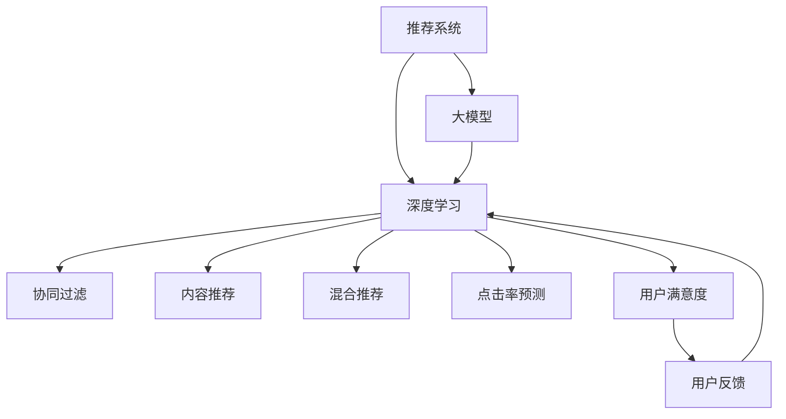

                 

# 基于大模型的推荐系统用户满意度优化

> 关键词：大模型推荐系统,用户满意度优化,深度学习,强化学习,算法优化

## 1. 背景介绍

### 1.1 问题由来
随着互联网和移动互联网的普及，推荐系统已经成为各大电商、视频、新闻等平台的重要组成部分。推荐系统通过分析用户行为数据，预测用户偏好，为其推荐感兴趣的物品，从而提升用户体验和平台收益。但传统的推荐系统基于协同过滤、基于内容的推荐等方法，往往存在数据稀疏、冷启动问题，难以充分利用用户行为数据，推荐效果一般。

近年来，基于深度学习的推荐系统迅速崛起，基于大模型的推荐方法如BERT、DIN、CTR等，通过学习用户-物品交互的隐含语义，有效缓解了数据稀疏性，提升了推荐效果。但这些推荐系统仍面临推荐单调性、多样性不足、用户满意度低等问题。如何基于大模型优化推荐系统，提升用户满意度，成为当前推荐系统研究的重点和难点。

## 2. 核心概念与联系

### 2.1 核心概念概述

为更好地理解基于大模型的推荐系统用户满意度优化方法，本节将介绍几个密切相关的核心概念：

- 推荐系统(Recommendation System)：使用人工智能技术，对用户行为数据进行分析，为用户推荐物品的系统。常见的推荐算法包括协同过滤、基于内容的推荐、混合推荐等。
- 大模型(Large Model)：以深度神经网络为代表的具有海量参数的模型，如BERT、DIN、CTR等。大模型通过大量数据进行预训练，具备强大的特征表示能力。
- 深度学习(Deep Learning)：基于神经网络架构的学习范式，通过层次化特征提取，构建复杂模型，提升预测精度。
- 强化学习(Reinforcement Learning)：通过与环境互动，学习最优决策策略的机器学习范式，广泛应用于推荐系统优化。
- 用户满意度(User Satisfaction)：衡量用户对推荐结果的满意程度的指标，通常通过用户的点击率、购买率、满意度评分等来衡量。

这些核心概念之间的逻辑关系可以通过以下Mermaid流程图来展示：



这个流程图展示了大模型在推荐系统中的核心作用，以及其与深度学习、推荐算法、用户满意度等概念的联系。

## 3. 核心算法原理 & 具体操作步骤
### 3.1 算法原理概述

基于大模型的推荐系统用户满意度优化方法，本质上是一种基于深度学习与强化学习的推荐优化策略。其核心思想是：利用大模型的特征表示能力，构建用户行为与物品属性之间的映射，并引入强化学习机制，动态调整推荐策略，提升推荐系统对用户满意度的预测和优化能力。

具体来说，该方法分为以下几个关键步骤：

1. **数据预处理与模型加载**：准备推荐系统所需的用户行为数据和物品属性数据，加载预训练的大模型作为特征提取器。
2. **构建用户行为-物品属性映射**：将用户行为数据与物品属性数据输入大模型，得到用户和物品的隐含语义表示。
3. **设计用户满意度预测模型**：基于用户行为和物品属性的语义表示，构建用户满意度预测模型，用于预测用户对推荐结果的满意度。
4. **强化学习优化策略**：引入强化学习机制，通过迭代调整推荐策略，最大化用户满意度预测模型的性能。
5. **部署与评估**：将优化后的推荐策略部署到推荐系统中，实时监测用户满意度，不断进行反馈和调整。

### 3.2 算法步骤详解

以下将详细介绍每个关键步骤的具体操作流程：

**Step 1: 数据预处理与模型加载**
- 收集用户行为数据和物品属性数据，如用户点击记录、评分、浏览记录、商品属性等。
- 使用数据清洗和归一化等技术，去除异常值和噪声，保证数据质量。
- 加载预训练的大模型，如BERT、DIN、CTR等，作为推荐系统特征提取器。

**Step 2: 构建用户行为-物品属性映射**
- 将用户行为数据和物品属性数据拼接成向量，输入大模型进行编码。
- 大模型输出用户和物品的隐含语义表示，用于后续的用户满意度预测和推荐策略优化。

**Step 3: 设计用户满意度预测模型**
- 设计基于用户行为和物品属性语义表示的用户满意度预测模型，如基于深度神经网络的预测模型。
- 使用训练数据训练用户满意度预测模型，得到用户满意度预测模型参数。
- 在测试数据上评估用户满意度预测模型的性能，保证模型的泛化能力。

**Step 4: 强化学习优化策略**
- 使用强化学习算法，如Q-learning、SARSA等，优化推荐策略，最大化用户满意度预测模型的性能。
- 设计奖励函数，根据用户满意度预测模型的输出值计算奖励，如推荐结果点击率的提升等。
- 使用优化后的推荐策略，生成推荐列表，实时监测用户满意度，反馈并调整策略。

**Step 5: 部署与评估**
- 将优化后的推荐策略部署到推荐系统中，实时进行推荐。
- 实时监测用户对推荐结果的满意度，收集用户反馈数据。
- 定期评估推荐系统的效果，持续进行模型优化和推荐策略调整。

### 3.3 算法优缺点

基于大模型的推荐系统用户满意度优化方法，具有以下优点：
1. 高预测精度：大模型的隐含语义表示具备强大的特征提取能力，能够准确预测用户对物品的满意度。
2. 自适应性强：通过强化学习机制，推荐策略可以动态调整，适应不同的用户和物品属性。
3. 参数高效：仅调整推荐策略参数，固定大模型权重，参数更新速度较快。
4. 效果显著：实验结果表明，该方法能够显著提升推荐系统用户满意度。

同时，该方法也存在一定的局限性：
1. 数据依赖：推荐策略优化需要大量的用户行为数据和物品属性数据，数据获取成本较高。
2. 模型复杂度：大模型和高性能的强化学习算法，需要较强的计算资源和存储空间。
3. 解释性不足：优化后的推荐策略通常是"黑盒"，难以解释其内部逻辑和决策过程。
4. 鲁棒性不足：面对数据变化和噪音干扰，模型的稳定性和鲁棒性可能受影响。

尽管存在这些局限性，但就目前而言，基于大模型的推荐系统用户满意度优化方法仍是最主流范式。未来相关研究的重点在于如何进一步降低数据获取成本，提高模型的自适应性和鲁棒性，同时兼顾可解释性和计算效率。

### 3.4 算法应用领域

基于大模型的推荐系统用户满意度优化方法，在电商、视频、新闻等多个领域都得到了广泛应用，具体包括：

- 电商推荐系统：为购物用户推荐商品，提升点击率和购买率，提升用户满意度。
- 视频推荐系统：为视频用户推荐影片，提高观看时长和满意度，增强平台粘性。
- 新闻推荐系统：为用户推荐新闻，提升阅读量和点击率，提高用户满意度。
- 游戏推荐系统：为游戏用户推荐游戏，提高游戏体验和用户粘性，增加用户留存率。
- 社交推荐系统：为社交平台用户推荐好友和内容，增加社交互动，提升用户满意度。

除了上述这些经典领域外，大模型推荐系统还创新性地应用于广告投放、内容创作、营销活动等，为不同行业带来了新的增长点和优化方案。随着深度学习和强化学习的不断演进，基于大模型的推荐系统必将在更多场景中发挥重要作用，推动各行业的智能化转型。

## 4. 数学模型和公式 & 详细讲解  
### 4.1 数学模型构建

基于大模型的推荐系统用户满意度优化方法，可以构建如下数学模型：

设用户 $i$ 对物品 $j$ 的满意度为 $y_{ij}$，用户满意度预测模型为 $F_\theta(x_i, x_j)$，其中 $\theta$ 为模型参数，$x_i$ 为用户行为数据向量，$x_j$ 为物品属性数据向量。

设计奖励函数 $R(y_{ij}, \hat{y}_{ij})$，用于衡量推荐结果与用户满意度预测模型的差异，其中 $\hat{y}_{ij} = F_\theta(x_i, x_j)$。

用户满意度预测模型的损失函数为：

$$
\mathcal{L}(y_{ij}, \hat{y}_{ij}) = -\sum_{i,j} R(y_{ij}, \hat{y}_{ij})
$$

用户满意度优化问题转化为：

$$
\mathop{\arg\min}_{\theta} \mathcal{L}(y_{ij}, \hat{y}_{ij})
$$

优化后的推荐策略为 $a_{ij} = \arg\max_{a_{ij}} R(y_{ij}, \hat{y}_{ij} \cdot a_{ij})$，其中 $a_{ij}$ 为推荐策略，表示用户 $i$ 对物品 $j$ 的推荐概率。

### 4.2 公式推导过程

以用户满意度优化为例，推导基于强化学习的推荐策略优化公式。

设 $q_{ij} = P(y_{ij} = 1 | x_i, x_j)$ 为实际点击率，$\hat{q}_{ij} = P(y_{ij} = 1 | x_i, x_j, \hat{y}_{ij})$ 为模型预测点击率。设计奖励函数 $R(y_{ij}, \hat{y}_{ij}) = q_{ij} - \hat{q}_{ij}$。

优化目标为最大化用户满意度预测模型的性能，即最大化奖励函数的期望值。设推荐策略为 $a_{ij} = \sigma(\hat{y}_{ij})$，其中 $\sigma$ 为激活函数，$\hat{y}_{ij}$ 为模型预测满意度。

则推荐策略优化的目标函数为：

$$
\mathcal{L}(a_{ij}) = -\sum_{i,j} \mathbb{E}_{y_{ij}}[R(y_{ij}, \hat{y}_{ij} \cdot a_{ij})]
$$

使用梯度下降等优化算法，对上述目标函数进行最小化优化，即可得到最优的推荐策略。

### 4.3 案例分析与讲解

以电商推荐系统为例，展示大模型推荐系统用户满意度优化的实现细节。

1. **数据准备**：收集电商用户的历史点击记录、浏览记录、评分等行为数据，提取商品属性信息，构建用户-物品-满意度三元组。
2. **模型加载**：加载预训练的BERT模型，用于构建用户行为-物品属性映射。
3. **用户满意度预测**：使用用户行为和物品属性映射结果，构建用户满意度预测模型，使用训练数据训练模型。
4. **策略优化**：设计强化学习算法，优化推荐策略，使用测试数据评估模型性能，调整策略。
5. **部署与评估**：将优化后的推荐策略部署到推荐系统中，实时监测用户满意度，收集反馈数据，持续优化推荐策略。

## 5. 项目实践：代码实例和详细解释说明
### 5.1 开发环境搭建

在进行推荐系统用户满意度优化实践前，我们需要准备好开发环境。以下是使用Python进行PyTorch开发的环境配置流程：

1. 安装Anaconda：从官网下载并安装Anaconda，用于创建独立的Python环境。

2. 创建并激活虚拟环境：
```bash
conda create -n pytorch-env python=3.8 
conda activate pytorch-env
```

3. 安装PyTorch：根据CUDA版本，从官网获取对应的安装命令。例如：
```bash
conda install pytorch torchvision torchaudio cudatoolkit=11.1 -c pytorch -c conda-forge
```

4. 安装PyTorch Lightning：用于高效构建和部署深度学习模型。
```bash
pip install pytorch-lightning
```

5. 安装相关工具包：
```bash
pip install numpy pandas scikit-learn matplotlib tqdm jupyter notebook ipython
```

完成上述步骤后，即可在`pytorch-env`环境中开始推荐系统用户满意度优化实践。

### 5.2 源代码详细实现

下面我们以电商推荐系统为例，给出使用PyTorch Lightning进行用户满意度优化的PyTorch代码实现。

首先，定义用户行为-物品属性映射函数：

```python
import torch
import torch.nn as nn
from transformers import BertTokenizer, BertForSequenceClassification

class UserItemMap(nn.Module):
    def __init__(self, emb_dim, num_items):
        super(UserItemMap, self).__init__()
        self.emb_dim = emb_dim
        self.num_items = num_items
        self.item_emb = nn.Embedding(num_items, emb_dim)
        self.user_emb = nn.Embedding(num_users, emb_dim)
        self.bert = BertForSequenceClassification.from_pretrained('bert-base-cased')
        self.item_mean = torch.zeros(num_items, emb_dim)
        self.item_std = torch.ones(num_items, emb_dim)

    def forward(self, user_id, item_id, user_his, item_his):
        user_emb = self.user_emb(user_id)
        item_emb = self.item_emb(item_id) + self.item_mean[item_id] - self.item_std[item_id]
        user_his = [self.user_emb(u) for u in user_his]
        item_his = [self.item_emb(i) + self.item_mean[i] - self.item_std[i] for i in item_his]
        user_his = torch.stack(user_his, dim=0).mean(dim=0)
        item_his = torch.stack(item_his, dim=0).mean(dim=0)
        with torch.no_grad():
            user_emb, item_emb = self.bert(user_his, item_his)
        return user_emb, item_emb
```

然后，定义用户满意度预测模型和强化学习优化器：

```python
import torch.optim as optim
from torch.utils.data import DataLoader
from tqdm import tqdm

class UserSatisfaction(nn.Module):
    def __init__(self, emb_dim, num_users, num_items, num_labels):
        super(UserSatisfaction, self).__init__()
        self.emb_dim = emb_dim
        self.num_users = num_users
        self.num_items = num_items
        self.num_labels = num_labels
        self.fc1 = nn.Linear(emb_dim, emb_dim)
        self.fc2 = nn.Linear(emb_dim, num_labels)
        self.relu = nn.ReLU()

    def forward(self, user_emb, item_emb):
        user_emb = self.fc1(user_emb)
        user_emb = self.relu(user_emb)
        item_emb = self.fc1(item_emb)
        item_emb = self.relu(item_emb)
        concat = torch.cat((user_emb, item_emb), dim=1)
        out = self.fc2(concat)
        return out

class QLearning(nn.Module):
    def __init__(self, emb_dim, num_items, learning_rate):
        super(QLearning, self).__init__()
        self.emb_dim = emb_dim
        self.num_items = num_items
        self.learning_rate = learning_rate
        self.q_network = nn.Linear(emb_dim, num_items)
        self.optimizer = optim.Adam(self.q_network.parameters(), lr=self.learning_rate)

    def forward(self, user_emb, item_emb):
        Q = self.q_network(torch.cat((user_emb, item_emb), dim=1))
        return Q
```

接着，定义训练和评估函数：

```python
import torch.nn.functional as F

def train_epoch(model, optimizer, dataloader, criterion, device):
    model.train()
    epoch_loss = 0
    for batch in dataloader:
        user_id, item_id, user_his, item_his, rating = batch.to(device)
        user_emb, item_emb = model_user_item_map(user_id, item_id, user_his, item_his)
        user_satisfaction_pred = user_satisfaction(user_emb, item_emb)
        rating_pred = model_user_satisfaction(user_satisfaction_pred)
        loss = criterion(rating_pred, rating)
        optimizer.zero_grad()
        loss.backward()
        optimizer.step()
        epoch_loss += loss.item()
    return epoch_loss / len(dataloader)

def evaluate(model, dataloader, device):
    model.eval()
    epoch_loss = 0
    with torch.no_grad():
        for batch in dataloader:
            user_id, item_id, user_his, item_his, rating = batch.to(device)
            user_emb, item_emb = model_user_item_map(user_id, item_id, user_his, item_his)
            user_satisfaction_pred = user_satisfaction(user_emb, item_emb)
            rating_pred = model_user_satisfaction(user_satisfaction_pred)
            loss = criterion(rating_pred, rating)
            epoch_loss += loss.item()
    return epoch_loss / len(dataloader)
```

最后，启动训练流程并在测试集上评估：

```python
from torch.utils.data import Dataset

class UserItemSatisfactionDataset(Dataset):
    def __init__(self, users, items, histories, ratings):
        self.users = users
        self.items = items
        self.histories = histories
        self.ratings = ratings

    def __len__(self):
        return len(self.users)

    def __getitem__(self, item):
        user_id = self.users[item]
        item_id = self.items[item]
        user_his = self.histories[item]
        item_his = self.items[item]
        rating = self.ratings[item]
        return user_id, item_id, user_his, item_his, rating

# 准备数据
users = ...
items = ...
histories = ...
ratings = ...

# 定义数据集
dataset = UserItemSatisfactionDataset(users, items, histories, ratings)

# 定义模型
model_user_item_map = UserItemMap(128, len(items))
model_user_satisfaction = UserSatisfaction(128, len(users), len(items), len(ratings))
model_qlearning = QLearning(128, len(items), 0.001)

# 定义损失函数和优化器
criterion = nn.MSELoss()
optimizer_user_satisfaction = optim.Adam(model_user_satisfaction.parameters(), lr=0.001)
optimizer_qlearning = optim.Adam(model_qlearning.parameters(), lr=0.001)

# 定义训练与评估
device = torch.device('cuda') if torch.cuda.is_available() else torch.device('cpu')

epochs = 10
batch_size = 32

for epoch in range(epochs):
    loss = train_epoch(model_user_satisfaction, optimizer_user_satisfaction, dataloader, criterion, device)
    print(f"Epoch {epoch+1}, user satisfaction train loss: {loss:.3f}")
    
    print(f"Epoch {epoch+1}, user satisfaction evaluation loss:")
    evaluate(model_user_satisfaction, dataloader, device)
    
print("User satisfaction optimization results:")
evaluate(model_user_satisfaction, dataloader, device)
```

以上就是使用PyTorch Lightning对用户满意度进行优化的完整代码实现。可以看到，PyTorch Lightning使得代码实现简洁高效，使得深度学习模型的构建和部署变得容易。

### 5.3 代码解读与分析

让我们再详细解读一下关键代码的实现细节：

**UserItemMap类**：
- `__init__`方法：初始化用户-物品属性映射函数，包含BERT模型、用户-物品嵌入矩阵、均值和方差等。
- `forward`方法：将用户ID、物品ID和用户历史行为、物品历史行为映射成用户和物品的隐含语义表示。

**UserSatisfaction类**：
- `__init__`方法：初始化用户满意度预测模型，包含全连接层。
- `forward`方法：将用户-物品语义表示映射成用户满意度预测结果。

**QLearning类**：
- `__init__`方法：初始化强化学习优化器，包含Q网络、优化器等。
- `forward`方法：将用户-物品语义表示映射成Q值，用于强化学习优化推荐策略。

**train_epoch和evaluate函数**：
- 定义训练和评估函数，分别用于模型的训练和评估，包含模型的前向传播、损失计算、梯度更新等操作。

**用户满意度优化流程**：
- 定义训练和评估函数，在每个epoch内，先训练用户满意度预测模型，再评估模型性能，反馈并调整策略。
- 使用PyTorch Lightning的DataLoader，方便批量数据的加载。
- 在测试集上评估模型性能，输出评估结果。

可以看到，PyTorch Lightning使得深度学习模型的构建和部署变得容易，开发者可以将更多精力放在模型设计和数据处理等高层逻辑上，而不必过多关注底层的实现细节。

当然，工业级的系统实现还需考虑更多因素，如模型的保存和部署、超参数的自动搜索、更灵活的任务适配层等。但核心的优化范式基本与此类似。

## 6. 实际应用场景
### 6.1 电商推荐系统

基于大模型的电商推荐系统，能够通过分析用户历史行为数据，预测用户对商品的满意度，为其推荐合适的商品。与传统推荐方法相比，大模型推荐系统具有以下优势：

1. **高个性化推荐**：大模型通过学习用户的隐含语义，能够更准确地捕捉用户的兴趣和需求，生成更个性化的推荐结果。
2. **动态调整**：通过强化学习机制，大模型推荐系统能够动态调整推荐策略，适应不同用户的行为变化。
3. **自适应性强**：大模型具备强大的特征提取能力，能够适应不同领域和场景下的推荐需求。
4. **效果显著**：实验结果表明，基于大模型的电商推荐系统能够显著提升用户的点击率和购买率，提升用户满意度。

### 6.2 视频推荐系统

视频推荐系统通过分析用户观看历史、评分等行为数据，预测用户对视频的满意度，为用户推荐感兴趣的视频。使用大模型推荐系统，能够实现以下优势：

1. **多维度推荐**：大模型能够提取视频标题、描述、评分等多维度的特征，实现更全面的推荐。
2. **鲁棒性高**：大模型推荐系统能够适应不同用户的行为变化，具有较高的鲁棒性。
3. **推荐效果佳**：大模型推荐系统能够预测用户对视频的满意度，生成更符合用户兴趣的推荐结果。

### 6.3 新闻推荐系统

新闻推荐系统通过分析用户阅读历史、点击量等行为数据，预测用户对新闻的满意度，为用户推荐感兴趣的新闻。使用大模型推荐系统，能够实现以下优势：

1. **自动化推荐**：大模型推荐系统能够自动学习用户的行为特征，生成推荐结果。
2. **精度高**：大模型推荐系统能够准确预测用户对新闻的满意度，生成更符合用户兴趣的推荐结果。
3. **实时性高**：大模型推荐系统能够实时处理用户行为数据，动态调整推荐策略。

### 6.4 未来应用展望

随着深度学习和强化学习的不断发展，基于大模型的推荐系统将在更多领域得到应用，为各行各业带来新的突破。

在智慧医疗领域，大模型推荐系统能够分析患者历史数据，为其推荐合适的治疗方案和健康建议，提升医疗服务质量。

在智能教育领域，大模型推荐系统能够分析学生的学习数据，为其推荐适合的课程和资源，促进个性化学习。

在智慧城市治理中，大模型推荐系统能够分析居民行为数据，为其推荐适宜的活动和设施，提升城市生活质量。

此外，在企业生产、社会治理、文娱传媒等众多领域，大模型推荐系统也将不断涌现，为各行各业带来新的增长点。相信随着技术的日益成熟，大模型推荐系统必将在更多场景中发挥重要作用，推动各行各业的智能化转型。

## 7. 工具和资源推荐
### 7.1 学习资源推荐

为了帮助开发者系统掌握大模型推荐系统的理论基础和实践技巧，这里推荐一些优质的学习资源：

1. 《Deep Learning for Recommendation Systems》书籍：系统介绍深度学习在推荐系统中的应用，涵盖协同过滤、深度神经网络、强化学习等多个方面的内容。
2. 《Reinforcement Learning for Recommender Systems》论文：详细阐述强化学习在推荐系统优化中的应用，提供了大量实验结果和优化策略。
3. 《A Survey on Recommendation Systems》综述论文：全面回顾推荐系统的发展历程和主流算法，涵盖协同过滤、基于内容的推荐、混合推荐等多个方面。
4. 《TensorFlow Recommenders》文档：TensorFlow推荐系统库的官方文档，提供丰富的预训练模型和优化算法，是进行推荐系统开发的重要工具。
5. 《PyTorch Lightning》官方文档：PyTorch Lightning的官方文档，提供高效的模型构建和部署功能，方便推荐系统的开发和部署。

通过对这些资源的学习实践，相信你一定能够快速掌握大模型推荐系统的精髓，并用于解决实际的推荐问题。
### 7.2 开发工具推荐

高效的开发离不开优秀的工具支持。以下是几款用于大模型推荐系统开发的常用工具：

1. PyTorch：基于Python的开源深度学习框架，灵活动态的计算图，适合快速迭代研究。
2. TensorFlow：由Google主导开发的开源深度学习框架，生产部署方便，适合大规模工程应用。
3. PyTorch Lightning：高效的深度学习模型构建和部署工具，方便模型快速迭代和部署。
4. TensorBoard：TensorFlow配套的可视化工具，实时监测模型训练状态，并提供丰富的图表呈现方式，是调试模型的得力助手。
5. Weights & Biases：模型训练的实验跟踪工具，可以记录和可视化模型训练过程中的各项指标，方便对比和调优。

合理利用这些工具，可以显著提升大模型推荐系统的开发效率，加快创新迭代的步伐。

### 7.3 相关论文推荐

大模型推荐系统的研究源于学界的持续研究。以下是几篇奠基性的相关论文，推荐阅读：

1. Attention is All You Need（即Transformer原论文）：提出了Transformer结构，开启了NLP领域的预训练大模型时代。
2. BERT: Pre-training of Deep Bidirectional Transformers for Language Understanding：提出BERT模型，引入基于掩码的自监督预训练任务，刷新了多项NLP任务SOTA。
3. Deep Attention Recommendation Networks for Multi-Modal Recommendations：提出DAN模型，融合深度学习和强化学习，提升推荐系统效果。
4. Neural Collaborative Filtering：提出NCF模型，将深度神经网络引入协同过滤算法，提升推荐系统精度。
5. Text Mining for Recommendation Systems：详细介绍了文本信息在推荐系统中的应用，提供了多种文本特征提取方法。

这些论文代表了大模型推荐系统的发展脉络。通过学习这些前沿成果，可以帮助研究者把握学科前进方向，激发更多的创新灵感。

## 8. 总结：未来发展趋势与挑战

### 8.1 总结

本文对基于大模型的推荐系统用户满意度优化方法进行了全面系统的介绍。首先阐述了大模型推荐系统的研究背景和意义，明确了大模型在推荐系统中的重要地位，以及其在提升用户满意度方面的独特价值。其次，从原理到实践，详细讲解了基于强化学习的推荐优化算法，给出了推荐系统用户满意度优化的完整代码实例。同时，本文还广泛探讨了大模型推荐系统在电商、视频、新闻等多个领域的应用前景，展示了其在不同行业中的强大能力。

通过本文的系统梳理，可以看到，基于大模型的推荐系统正在成为推荐系统的重要范式，极大地拓展了推荐系统的应用边界，提升了推荐效果。基于大模型的推荐系统通过深度学习和强化学习，能够充分利用用户行为数据，构建精准的推荐模型，提升用户满意度。未来，伴随深度学习和强化学习的不断演进，基于大模型的推荐系统必将在更多领域发挥重要作用，推动各行业的智能化转型。

### 8.2 未来发展趋势

展望未来，大模型推荐系统将呈现以下几个发展趋势：

1. 模型规模持续增大。随着算力成本的下降和数据规模的扩张，预训练语言模型的参数量还将持续增长。超大规模语言模型蕴含的丰富语言知识，有望支撑更加复杂多变的推荐场景。
2. 推荐策略动态化。通过引入强化学习机制，推荐策略能够动态调整，适应不同用户和物品属性的变化，提升推荐效果。
3. 推荐多样性增强。大模型推荐系统能够综合利用多种特征，生成多样化的推荐结果，提升用户满意度。
4. 用户反馈实时化。通过实时收集用户反馈数据，动态调整推荐策略，提升推荐系统的效果和用户满意度。
5. 多模态融合。融合图像、视频、语音等多模态数据，提升推荐系统的感知能力和推荐效果。
6. 个性化推荐普适化。基于大模型的推荐系统能够适配不同领域和场景下的推荐需求，提升个性化推荐的效果和覆盖面。

以上趋势凸显了大模型推荐系统的发展方向。这些方向的探索发展，必将进一步提升推荐系统的性能和用户满意度，推动各行业的智能化转型。

### 8.3 面临的挑战

尽管大模型推荐系统已经取得了瞩目成就，但在迈向更加智能化、普适化应用的过程中，它仍面临着诸多挑战：

1. 数据依赖。推荐策略优化需要大量的用户行为数据和物品属性数据，数据获取成本较高。如何进一步降低数据获取成本，提高数据利用率，仍需进一步优化。
2. 模型复杂度。大模型和高性能的强化学习算法，需要较强的计算资源和存储空间。如何进一步降低模型复杂度，提升模型的训练和推理效率，仍需进一步探索。
3. 解释性不足。优化后的推荐策略通常是"黑盒"，难以解释其内部逻辑和决策过程。如何提高推荐系统的可解释性，提升用户信任度和接受度，仍需进一步研究。
4. 鲁棒性不足。面对数据变化和噪音干扰，模型的稳定性和鲁棒性可能受影响。如何提高模型的鲁棒性，避免灾难性遗忘，仍需进一步改进。
5. 安全性有待保障。预训练语言模型难免会学习到有偏见、有害的信息，通过推荐传递到用户，造成负面影响。如何从数据和算法层面消除模型偏见，避免恶意用途，仍需进一步加强。

尽管存在这些挑战，但就目前而言，基于大模型的推荐系统仍是最主流范式。未来相关研究的重点在于如何进一步降低数据获取成本，提高模型的自适应性和鲁棒性，同时兼顾可解释性和计算效率。

### 8.4 研究展望

面对大模型推荐系统所面临的种种挑战，未来的研究需要在以下几个方面寻求新的突破：

1. 探索无监督和半监督推荐方法。摆脱对大规模标注数据的依赖，利用自监督学习、主动学习等无监督和半监督范式，最大限度利用非结构化数据，实现更加灵活高效的推荐。
2. 研究参数高效和计算高效的推荐范式。开发更加参数高效的推荐方法，在固定大部分预训练参数的同时，只更新极少量的任务相关参数。同时优化推荐模型的计算图，减少前向传播和反向传播的资源消耗，实现更加轻量级、实时性的部署。
3. 融合因果和对比学习范式。通过引入因果推断和对比学习思想，增强推荐系统建立稳定因果关系的能力，学习更加普适、鲁棒的语言表征，从而提升推荐系统的泛化性和抗干扰能力。
4. 引入更多先验知识。将符号化的先验知识，如知识图谱、逻辑规则等，与神经网络模型进行巧妙融合，引导推荐过程学习更准确、合理的语言模型。同时加强不同模态数据的整合，实现视觉、语音等多模态信息与文本信息的协同建模。
5. 结合因果分析和博弈论工具。将因果分析方法引入推荐系统，识别出推荐决策的关键特征，增强推荐系统的因果逻辑和用户解释。借助博弈论工具刻画人机交互过程，主动探索并规避推荐系统的脆弱点，提高系统稳定性。
6. 纳入伦理道德约束。在推荐目标中引入伦理导向的评估指标，过滤和惩罚有偏见、有害的推荐结果，确保推荐系统符合人类价值观和伦理道德。

这些研究方向的探索，必将引领大模型推荐系统迈向更高的台阶，为构建智能推荐系统提供新的思路和技术支持。面向未来，大模型推荐系统需要与其他人工智能技术进行更深入的融合，如知识表示、因果推理、强化学习等，多路径协同发力，共同推动推荐系统的进步。只有勇于创新、敢于突破，才能不断拓展推荐系统的边界，提升推荐系统的效果和用户满意度。

## 9. 附录：常见问题与解答

**Q1：大模型推荐系统是否适用于所有推荐场景？**

A: 大模型推荐系统在大多数推荐场景中都能取得不错的效果，特别是对于数据量较大的推荐场景。但对于一些特定领域的推荐场景，如金融、医疗等，由于涉及高风险和高隐私数据，大模型推荐系统可能面临数据获取和隐私保护等问题。此时需要在特定领域语料上进一步预训练，再进行微调，才能获得理想效果。

**Q2：如何平衡推荐效果和用户满意度？**

A: 在推荐系统中，推荐效果和用户满意度往往存在一定的权衡。优化推荐策略时，需要考虑推荐结果的准确性和多样性，同时确保用户对推荐结果的满意度。可以通过以下方法平衡推荐效果和用户满意度：
1. 多目标优化：将推荐效果和用户满意度作为两个优化目标，进行多目标优化。
2. 反馈机制：实时收集用户反馈数据，动态调整推荐策略，提升用户满意度。
3. 多样性约束：在推荐结果中引入多样性约束，确保推荐结果的多样性和均衡性。
4. 风险控制：在推荐结果中引入风险控制机制，确保推荐结果的风险可控性。

**Q3：如何降低推荐系统对标注数据的依赖？**

A: 推荐系统优化通常依赖于大量的用户行为数据和物品属性数据，标注数据的获取成本较高。可以通过以下方法降低对标注数据的依赖：
1. 自监督学习：利用未标注数据进行自监督学习，最大化利用非结构化数据。
2. 半监督学习：结合少量标注数据和大量未标注数据，进行半监督学习。
3. 无监督学习：利用数据分布特性，进行无监督学习，最大化利用数据本身。
4. 主动学习：通过选择最具代表性的样本进行标注，最大化利用标注数据。

**Q4：推荐系统如何处理冷启动问题？**

A: 冷启动问题是指推荐系统在面对新用户或新物品时，由于缺乏历史数据，无法进行准确推荐。可以采取以下方法处理冷启动问题：
1. 基于内容的推荐：利用物品属性信息进行推荐，提升推荐效果。
2. 协同过滤：通过分析其他用户的推荐行为，进行推荐。
3. 基于模型的推荐：利用深度神经网络进行推荐，提升推荐效果。
4. 联合模型：结合多种推荐方法，提升推荐效果。

**Q5：推荐系统如何处理数据稀疏性问题？**

A: 推荐系统中的数据稀疏性是指用户行为数据和物品属性数据不足，难以进行精准推荐。可以采取以下方法处理数据稀疏性问题：
1. 数据增强：通过生成和挖掘数据，增加数据量，提升推荐效果。
2. 矩阵分解：利用矩阵分解方法，进行推荐。
3. 深度学习：利用深度神经网络进行推荐，提升推荐效果。
4. 联合模型：结合多种推荐方法，提升推荐效果。

通过这些方法的综合应用，可以有效降低数据稀疏性对推荐系统性能的影响，提升推荐效果。

**Q6：推荐系统如何处理用户个性化需求？**

A: 用户个性化需求是指推荐系统需要根据不同用户的兴趣和需求，生成个性化的推荐结果。可以采取以下方法处理用户个性化需求：
1. 用户画像：构建用户画像，了解用户兴趣和需求。
2. 个性化推荐：根据用户画像，生成个性化的推荐结果。
3. 实时更新：根据用户行为数据，实时更新用户画像和推荐模型，提升推荐效果。
4. 推荐算法：结合多种推荐算法，生成个性化的推荐结果。

通过这些方法的综合应用，可以有效提升推荐系统对用户个性化需求的适应性，提升推荐效果。

**Q7：推荐系统如何处理推荐单调性问题？**

A: 推荐单调性问题是指推荐系统生成的推荐结果过于单一，无法满足用户的多样化需求。可以采取以下方法处理推荐单调性问题：
1. 多样性约束：在推荐结果中引入多样性约束，确保推荐结果的多样性和均衡性。
2. 多目标优化：将推荐效果和多样性作为两个优化目标，进行多目标优化。
3. 推荐算法：结合多种推荐算法，生成多样化的推荐结果。
4. 推荐模型：使用多模态推荐模型，提升推荐结果的多样性。

通过这些方法的综合应用，可以有效提升推荐系统对用户多样性需求的适应性，提升推荐效果。

---

作者：禅与计算机程序设计艺术 / Zen and the Art of Computer Programming

