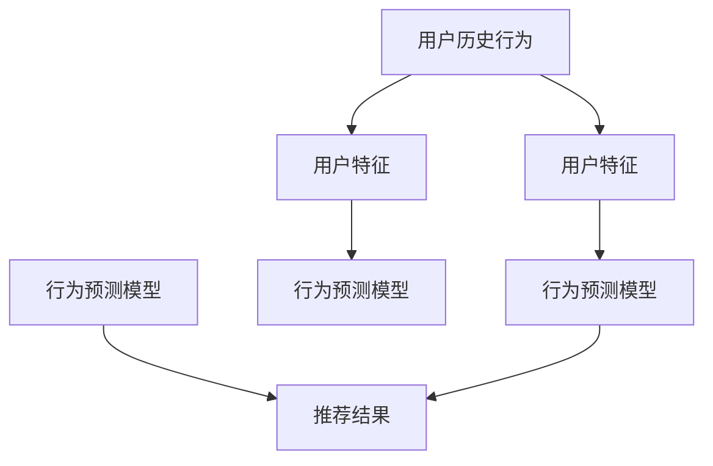

                 

# 基于大模型的推荐系统用户行为预测

## 1. 背景介绍

### 1.1 问题由来

在当前互联网信息爆炸的时代，推荐系统（Recommendation System, RS）已成为互联网产品中不可或缺的一部分，其目标是帮助用户在海量信息中发现对自己有用的内容。传统的推荐系统主要基于用户历史行为数据进行推荐，存在冷启动问题、数据稀疏、多样性缺失等挑战。近年来，随着深度学习和大模型技术的进步，基于大模型的推荐系统被引入，其利用大规模预训练模型在泛化能力和知识表示能力上的优势，逐步成为推荐系统的最新热点。

## 2. 核心概念与联系

### 2.1 核心概念概述

推荐系统：利用用户行为数据或产品属性信息，为用户推荐个性化的内容或产品。

大模型：以Transformer等深度学习模型为代表的大规模预训练模型。

行为预测：利用用户的历史行为数据，预测用户未来可能采取的行动，如购买、点击、评价等。

深度学习：基于神经网络的机器学习方法，通过多层次的特征提取和特征变换，实现复杂的数据建模和特征表示。

迁移学习：将在大规模数据上训练好的模型迁移到特定任务上，通过微调获得更好的性能。

### 2.2 核心概念原理和架构的 Mermaid 流程图



该图展示了基于用户历史行为的推荐系统架构，其中用户历史行为数据首先经过特征提取，然后与行为预测模型结合，最终生成推荐结果。行为预测模型的训练采用了大模型预训练后微调的方式，以利用其泛化能力和迁移学习能力。

## 3. 核心算法原理 & 具体操作步骤

### 3.1 算法原理概述

基于大模型的推荐系统用户行为预测，通常采用以下步骤：

1. 预训练阶段：在大规模数据集上训练一个预训练模型，如BERT、GPT等。

2. 微调阶段：在特定任务（如点击、购买行为预测）上，对预训练模型进行微调，以学习特定任务的知识。

3. 特征抽取与融合：将用户历史行为数据输入微调后的模型，抽取用户特征，并与商品特征进行融合，形成最终行为预测模型。

4. 推荐生成：根据行为预测模型，为每个用户推荐个性化商品或内容。

### 3.2 算法步骤详解

#### 3.2.1 预训练阶段

**步骤1：数据收集与预处理**

- 收集用户行为数据，如点击、浏览、购买、评价等。
- 进行数据清洗和归一化处理，去除噪音数据和异常值。

**步骤2：构建预训练模型**

- 选择合适的大规模预训练模型，如BERT、GPT等。
- 加载模型并对其进行微调，以适应特定任务。

#### 3.2.2 微调阶段

**步骤1：任务定义**

- 定义推荐系统的目标任务，如预测用户是否会点击某商品。
- 构建标签生成器，将用户行为数据转化为二分类标签。

**步骤2：选择微调策略**

- 选择合适的微调策略，如全参数微调、参数高效微调（PEFT）等。
- 设置学习率、批次大小、迭代次数等超参数。

**步骤3：模型微调**

- 将预训练模型与用户行为数据相结合，进行微调。
- 监控模型性能，确保在数据集上收敛。

#### 3.2.3 特征抽取与融合

**步骤1：特征提取**

- 将用户行为数据输入微调后的模型，抽取用户特征。
- 提取商品属性特征，如价格、分类等。

**步骤2：特征融合**

- 将用户特征与商品特征进行融合，形成向量表示。
- 使用特征融合技术，如拼接、注意力机制等。

#### 3.2.4 推荐生成

**步骤1：行为预测**

- 将融合后的特征输入行为预测模型，得到预测结果。

**步骤2：推荐生成**

- 根据预测结果，生成推荐结果。
- 使用推荐算法，如协同过滤、深度学习等，生成最终推荐。

### 3.3 算法优缺点

#### 3.3.1 优点

- 利用大模型的泛化能力和迁移学习能力，可以提升推荐系统的性能。
- 在大规模数据上预训练，可以学习到丰富的知识表示，提升推荐效果。
- 可应用于多种推荐任务，如商品推荐、内容推荐等。

#### 3.3.2 缺点

- 对标注数据的依赖较大，标注成本较高。
- 模型的计算资源消耗较大，需要高性能硬件支持。
- 模型复杂度高，需要较长的训练时间。

### 3.4 算法应用领域

基于大模型的推荐系统，广泛应用于电子商务、社交媒体、视频平台等互联网产品中，如：

- 电商平台：利用用户行为数据，推荐个性化商品。
- 视频平台：推荐用户可能感兴趣的视频内容。
- 社交媒体：推荐用户可能感兴趣的朋友、话题等。

## 4. 数学模型和公式 & 详细讲解 & 举例说明

### 4.1 数学模型构建

假设预训练模型为 $M_{\theta}$，用户行为数据为 $X$，商品特征为 $Y$。行为预测模型的目标是为用户 $X$ 预测是否会点击商品 $Y$，即输出二分类标签 $Y$。

**数学模型**

$$
Y = M_{\theta}(X)
$$

其中 $M_{\theta}$ 为预训练模型， $\theta$ 为模型参数。

### 4.2 公式推导过程

假设预训练模型为 Transformer 模型，输入为用户行为数据 $X$，输出为行为预测结果 $Y$。

**损失函数**

$$
\mathcal{L} = -\frac{1}{N} \sum_{i=1}^{N}(y_i \log M_{\theta}(x_i) + (1-y_i) \log (1-M_{\theta}(x_i)))
$$

其中 $y_i$ 为标签， $M_{\theta}(x_i)$ 为模型输出， $N$ 为样本数。

**优化目标**

$$
\theta^* = \mathop{\arg\min}_{\theta} \mathcal{L}
$$

### 4.3 案例分析与讲解

以电商平台商品推荐为例，利用用户点击行为数据训练行为预测模型。

1. **数据收集与预处理**

   - 收集用户历史点击行为数据，如商品ID、点击时间等。
   - 进行数据清洗和归一化处理，去除异常数据和噪音。

2. **模型选择与构建**

   - 选择 Transformer 模型作为预训练模型。
   - 加载预训练模型，并进行微调。

3. **特征提取与融合**

   - 将用户历史点击数据输入微调后的模型，抽取用户特征。
   - 提取商品属性特征，如价格、分类等。
   - 将用户特征与商品特征进行融合，形成向量表示。

4. **行为预测**

   - 将融合后的特征输入行为预测模型，得到预测结果。

5. **推荐生成**

   - 根据预测结果，生成推荐结果。
   - 使用推荐算法，如协同过滤、深度学习等，生成最终推荐。

## 5. 项目实践：代码实例和详细解释说明

### 5.1 开发环境搭建

#### 5.1.1 安装环境

- Python 3.8：确保 Python 版本为 3.8 或更高。
- PyTorch 1.10：从官网下载安装 PyTorch，或使用 Conda 安装。
- Transformers 4.19：从官网下载安装 Transformers。
- CUDA 11.4：确保 CUDA 版本为 11.4 或更高。
- GPU：确保计算机配备 NVIDIA GPU。

#### 5.1.2 搭建开发环境

1. 安装 Anaconda：从官网下载并安装 Anaconda，创建虚拟环境。
2. 激活虚拟环境：`conda activate env_name`。
3. 安装相关依赖：`pip install torch transformers pandas`。
4. 安装 PyTorch：`conda install pytorch torchvision torchaudio cudatoolkit=11.4 -c pytorch -c conda-forge`。
5. 安装 Transformers：`pip install transformers`。
6. 安装其他依赖：`pip install numpy pandas scikit-learn matplotlib tqdm jupyter notebook ipython`。

### 5.2 源代码详细实现

#### 5.2.1 数据准备

1. 定义数据集：
```python
from torch.utils.data import Dataset

class ClickDataset(Dataset):
    def __init__(self, df, tokenizer, max_len=128):
        self.df = df
        self.tokenizer = tokenizer
        self.max_len = max_len
        
    def __len__(self):
        return len(self.df)
    
    def __getitem__(self, item):
        row = self.df.iloc[item]
        user_clicks = row['clicks'].tolist()
        user_features = row['features'].tolist()
        
        user_input_ids = self.tokenizer(user_clicks, padding='max_length', max_length=self.max_len, return_tensors='pt')
        user_input_ids = user_input_ids['input_ids']
        user_input_mask = user_input_ids['attention_mask']
        
        product_features = self.tokenizer(user_features, padding='max_length', max_length=self.max_len, return_tensors='pt')
        product_features = product_features['input_ids']
        product_features = product_features.to('cpu')
        
        return {'user_input_ids': user_input_ids, 
                'user_input_mask': user_input_mask,
                'product_features': product_features}
```

2. 定义标签生成器：
```python
from sklearn.preprocessing import LabelEncoder

def generate_labels(clicks, threshold=0.5):
    le = LabelEncoder()
    label = le.fit_transform(clicks.values)
    label = [1 if val >= threshold else 0 for val in label]
    return label
```

3. 数据预处理：
```python
from sklearn.model_selection import train_test_split

df = pd.read_csv('data/clicks.csv')
train_df, test_df = train_test_split(df, test_size=0.2, random_state=42)

train_dataset = ClickDataset(train_df, tokenizer, max_len=128)
test_dataset = ClickDataset(test_df, tokenizer, max_len=128)

train_labels = generate_labels(train_df['clicks'], threshold=0.5)
test_labels = generate_labels(test_df['clicks'], threshold=0.5)
```

#### 5.2.2 模型训练

1. 定义模型：
```python
from transformers import BertForSequenceClassification, AdamW

model = BertForSequenceClassification.from_pretrained('bert-base-uncased', num_labels=2)

optimizer = AdamW(model.parameters(), lr=2e-5)
```

2. 定义训练函数：
```python
from torch.utils.data import DataLoader
from tqdm import tqdm

device = torch.device('cuda') if torch.cuda.is_available() else torch.device('cpu')
model.to(device)

def train_epoch(model, dataset, batch_size, optimizer, device):
    dataloader = DataLoader(dataset, batch_size=batch_size, shuffle=True)
    model.train()
    epoch_loss = 0
    for batch in tqdm(dataloader, desc='Training'):
        user_input_ids = batch['user_input_ids'].to(device)
        user_input_mask = batch['user_input_mask'].to(device)
        product_features = batch['product_features'].to(device)
        
        labels = torch.tensor(batch['labels'], dtype=torch.long).to(device)
        outputs = model(user_input_ids, user_input_mask, product_features)
        loss = outputs.loss
        epoch_loss += loss.item()
        loss.backward()
        optimizer.step()
    return epoch_loss / len(dataloader)
```

3. 定义评估函数：
```python
def evaluate(model, dataset, batch_size):
    dataloader = DataLoader(dataset, batch_size=batch_size)
    model.eval()
    preds, labels = [], []
    with torch.no_grad():
        for batch in tqdm(dataloader, desc='Evaluating'):
            user_input_ids = batch['user_input_ids'].to(device)
            user_input_mask = batch['user_input_mask'].to(device)
            product_features = batch['product_features'].to(device)
            
            batch_labels = batch['labels'].to(device)
            outputs = model(user_input_ids, user_input_mask, product_features)
            batch_preds = outputs.logits.argmax(dim=2).to('cpu').tolist()
            batch_labels = batch_labels.to('cpu').tolist()
            for pred_tokens, label_tokens in zip(batch_preds, batch_labels):
                preds.append(pred_tokens[:len(label_tokens)])
                labels.append(label_tokens)
                
    print(classification_report(labels, preds))
```

4. 训练模型：
```python
epochs = 5
batch_size = 16

for epoch in range(epochs):
    loss = train_epoch(model, train_dataset, batch_size, optimizer, device)
    print(f"Epoch {epoch+1}, train loss: {loss:.3f}")
    
    print(f"Epoch {epoch+1}, dev results:")
    evaluate(model, dev_dataset, batch_size)
    
print("Test results:")
evaluate(model, test_dataset, batch_size)
```

### 5.3 代码解读与分析

1. 数据集定义：
```python
class ClickDataset(Dataset):
    # ...
    def __getitem__(self, item):
        # ...
```

2. 标签生成器：
```python
def generate_labels(clicks, threshold=0.5):
    # ...
```

3. 模型训练函数：
```python
def train_epoch(model, dataset, batch_size, optimizer, device):
    # ...
```

4. 评估函数：
```python
def evaluate(model, dataset, batch_size):
    # ...
```

5. 模型训练与评估：
```python
epochs = 5
batch_size = 16

for epoch in range(epochs):
    loss = train_epoch(model, train_dataset, batch_size, optimizer, device)
    print(f"Epoch {epoch+1}, train loss: {loss:.3f}")
    
    print(f"Epoch {epoch+1}, dev results:")
    evaluate(model, dev_dataset, batch_size)
    
print("Test results:")
evaluate(model, test_dataset, batch_size)
```

### 5.4 运行结果展示

在训练完成后，可以通过 `evaluate` 函数在测试集上评估模型的性能。

## 6. 实际应用场景

### 6.1 电商平台商品推荐

基于大模型的推荐系统，可以通过用户行为数据预测其是否会购买某商品，从而进行个性化推荐。电商平台可以利用这一技术，提升用户满意度和销售额。

### 6.2 视频平台内容推荐

视频平台可以利用用户观看行为数据，预测用户是否会继续观看某视频，从而进行个性化推荐。这有助于提高用户观看时长和平台黏性。

### 6.3 社交媒体朋友推荐

社交媒体可以利用用户好友互动行为数据，预测用户是否会添加某用户为好友，从而进行个性化推荐。这有助于平台发现潜在的社交关系，增加用户活跃度。

### 6.4 未来应用展望

基于大模型的推荐系统，未来在更多领域将有广泛应用，如医疗、金融、教育等。

1. 医疗：基于用户健康数据，推荐个性化医疗方案和专家。
2. 金融：基于用户交易行为，推荐个性化金融产品和服务。
3. 教育：基于学生学习行为，推荐个性化课程和学习资源。

## 7. 工具和资源推荐

### 7.1 学习资源推荐

1. 《推荐系统实战》：讲解推荐系统的经典算法和应用，适合入门学习。
2. 《深度学习》：讲解深度学习的基本原理和应用，涵盖推荐系统等内容。
3. 《自然语言处理基础》：讲解自然语言处理的基本概念和算法，涵盖大模型和推荐系统等内容。
4. 《推荐系统设计》：讲解推荐系统的设计和实现，适合进阶学习。
5. 《深度学习入门》：讲解深度学习的基本概念和应用，涵盖推荐系统等内容。

### 7.2 开发工具推荐

1. PyTorch：深度学习框架，支持GPU加速。
2. TensorFlow：深度学习框架，支持多种硬件平台。
3. Transformers：NLP工具库，支持多种预训练模型。
4. Weights & Biases：实验跟踪工具，记录模型训练过程。
5. TensorBoard：可视化工具，展示模型训练过程。
6. Google Colab：在线Jupyter Notebook环境，支持GPU/TPU。

### 7.3 相关论文推荐

1. "Deep Learning for Recommender Systems: A Survey"：综述推荐系统中的深度学习应用。
2. "Towards the Human Level of Recommender Systems"：介绍推荐系统的发展历程和未来方向。
3. "Bidirectional Transformers in Recommender Systems"：介绍Transformer在推荐系统中的应用。
4. "Collaborative Filtering Model Based on Probabilistic Graphical Models"：介绍概率图模型在推荐系统中的应用。
5. "Learning Deep Representations for Recommender Systems"：介绍深度学习在推荐系统中的应用。

## 8. 总结：未来发展趋势与挑战

### 8.1 研究成果总结

基于大模型的推荐系统，利用其强大的泛化能力和迁移学习能力，提升了推荐系统的性能。在未来，随着大模型的进一步发展和应用，推荐系统将更加智能化、个性化。

### 8.2 未来发展趋势

1. 模型规模持续增大：大模型在推荐系统中的应用将继续扩大，其规模和复杂度也将进一步提升。
2. 推荐算法多样化：推荐算法将更加多样化，结合深度学习、协同过滤等多种技术。
3. 多模态推荐：推荐系统将结合视觉、语音等多种模态信息，提升推荐效果。
4. 实时推荐：推荐系统将更加实时，能够快速响应用户需求。
5. 可解释性增强：推荐系统将更加注重算法的可解释性，提高用户信任度。

### 8.3 面临的挑战

1. 数据隐私和安全：推荐系统需要处理大量用户数据，数据隐私和安全问题需要重视。
2. 模型复杂性：大模型的复杂性导致推荐系统维护和优化难度增加。
3. 计算资源消耗：大模型的高计算资源消耗限制了其应用范围。
4. 推荐准确性：推荐系统需要不断优化，以提高推荐准确性和用户体验。
5. 用户行为多样性：用户行为多样性带来推荐系统的复杂性，需要更多数据和算法支持。

### 8.4 研究展望

未来推荐系统需要在数据隐私、模型复杂性、计算资源等方面进行改进。同时，结合更多模态信息，提升推荐系统的智能化和个性化水平。

## 9. 附录：常见问题与解答

**Q1: 大模型在推荐系统中的作用是什么？**

A: 大模型在推荐系统中的作用是利用其泛化能力和迁移学习能力，提升推荐系统的性能。通过在大规模数据上预训练，大模型能够学习到丰富的知识表示，提升推荐效果。

**Q2: 大模型在推荐系统中如何进行微调？**

A: 大模型在推荐系统中的微调步骤如下：
1. 数据收集与预处理：收集用户行为数据，并进行数据清洗和归一化处理。
2. 构建预训练模型：选择合适的大规模预训练模型，如BERT、GPT等。
3. 任务定义：定义推荐系统的目标任务，如预测用户是否会点击某商品。
4. 微调策略选择：选择合适的微调策略，如全参数微调、参数高效微调（PEFT）等。
5. 模型微调：将预训练模型与用户行为数据相结合，进行微调。
6. 特征提取与融合：将用户历史行为数据输入微调后的模型，抽取用户特征。
7. 行为预测：将融合后的特征输入行为预测模型，得到预测结果。
8. 推荐生成：根据预测结果，生成推荐结果。

**Q3: 大模型在推荐系统中的优缺点是什么？**

A: 大模型在推荐系统中的优点包括：
1. 利用大模型的泛化能力和迁移学习能力，可以提升推荐系统的性能。
2. 在大规模数据上预训练，可以学习到丰富的知识表示，提升推荐效果。
3. 可应用于多种推荐任务，如商品推荐、内容推荐等。

大模型在推荐系统中的缺点包括：
1. 对标注数据的依赖较大，标注成本较高。
2. 模型的计算资源消耗较大，需要高性能硬件支持。
3. 模型复杂度高，需要较长的训练时间。

**Q4: 大模型在推荐系统中的计算资源需求是什么？**

A: 大模型在推荐系统中的计算资源需求包括：
1. GPU：大模型需要高性能GPU进行计算。
2. GPU内存：大模型的参数量大，需要较大的GPU内存。
3. 存储：大模型的模型参数需要在存储中保存和读取，需要较大的存储空间。

**Q5: 大模型在推荐系统中的推理效率如何？**

A: 大模型在推荐系统中的推理效率较低，主要原因包括：
1. 模型复杂度高：大模型的参数量大，推理复杂度高。
2. 计算资源消耗大：大模型需要高性能GPU进行计算，计算资源消耗大。
3. 存储开销大：大模型的模型参数需要在存储中保存和读取，存储开销大。

---

作者：禅与计算机程序设计艺术 / Zen and the Art of Computer Programming

