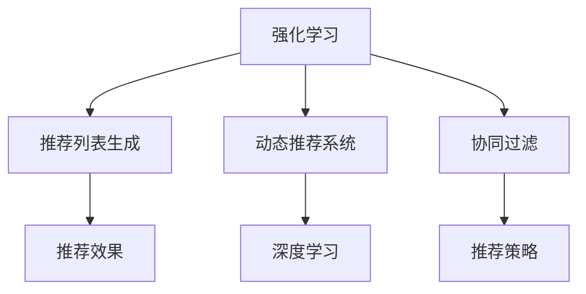

                 

# 基于强化学习的动态推荐列表生成

> 关键词：强化学习, 推荐系统, 推荐列表, 动态生成, 协同过滤, 深度学习

## 1. 背景介绍

### 1.1 问题由来

随着互联网和电子商务的飞速发展，推荐系统成为各大电商平台、视频平台、新闻阅读器等应用的核心组件。推荐系统通过分析用户的历史行为数据，帮助用户发现感兴趣的新内容，提升用户体验和平台黏性。传统的推荐方法包括协同过滤(Collaborative Filtering, CF)、基于内容的推荐(Content-based Recommendation)、混合推荐(Mixed Recommendation)等。

协同过滤是目前最常用的推荐方式之一，其基本思想是通过用户历史行为数据，寻找兴趣相似的其他用户或物品，从而预测用户对物品的评分。常见的协同过滤算法包括基于用户的CF、基于物品的CF、基于模型的CF等。

然而，传统的协同过滤算法在处理冷启动用户、稀疏数据等问题时表现欠佳。此外，协同过滤算法基于评分，只能处理具有明显评分特征的应用场景，而推荐列表生成问题通常不直接涉及评分，因此需要全新的方法来提升推荐效果。

基于强化学习的推荐方法正是顺应这一需求应运而生。强化学习（Reinforcement Learning, RL）是一种通过与环境的交互，使智能体学习最优策略的机器学习方法。将其应用于推荐列表生成问题，可以在不直接使用评分的情况下，通过模拟用户点击行为，动态生成推荐列表，提升推荐效果和用户体验。

### 1.2 问题核心关键点

强化学习在推荐列表生成中的核心要点如下：

1. **动态生成推荐列表**：与传统推荐方法不同，强化学习推荐系统能够根据用户的实时行为和上下文，动态生成推荐列表，适应用户的即时需求。

2. **智能探索**：强化学习方法能够在探索和利用之间进行平衡，发现用户未曾探索但可能感兴趣的物品，增加推荐列表的丰富度。

3. **跨领域泛化**：强化学习方法能够学习到物品之间的潜在关联，跨领域泛化能力强，可以推广到多样化的推荐场景。

4. **可解释性**：强化学习推荐系统能够通过政策解释(interpretability)的方式，让用户理解推荐策略，提升用户信任度。

5. **适应性**：强化学习方法能够自适应用户的行为变化，持续优化推荐策略。

这些核心要点使得强化学习在推荐系统领域具有广阔的应用前景。下面我们将深入探讨其算法原理和具体操作步骤。

## 2. 核心概念与联系

### 2.1 核心概念概述

为更好地理解强化学习在推荐列表生成中的应用，本节将介绍几个密切相关的核心概念：

- **强化学习(Reinforcement Learning)**：一种通过与环境交互，智能体学习最优策略的机器学习方法。强化学习的核心在于寻找最优策略，使智能体最大化累计奖励。

- **推荐列表生成(Recommendation List Generation)**：推荐系统的一种形式，通过动态生成推荐列表，帮助用户发现感兴趣的内容。推荐列表通常按照一定的规则排序，如基于评分、热度、相关性等。

- **动态推荐系统(Dynamic Recommendation System)**：能够根据用户的实时行为和上下文，动态生成推荐列表的推荐系统。与静态推荐系统相比，动态推荐系统更具灵活性和适应性。

- **协同过滤(Collaborative Filtering)**：推荐系统中最常用的一种方法，通过用户历史行为数据，寻找兴趣相似的其他用户或物品，从而预测用户对物品的评分。

- **深度学习(Deep Learning)**：一种通过多层神经网络进行复杂特征提取和建模的机器学习方法。深度学习在强化学习推荐系统中起到了关键作用，用于拟合推荐策略，优化推荐效果。

这些核心概念之间的逻辑关系可以通过以下Mermaid流程图来展示：



这个流程图展示强化学习在推荐系统中的应用框架：

1. 强化学习通过与环境的交互，学习最优策略，用于推荐列表生成。
2. 动态推荐系统能够根据用户的实时行为和上下文，动态生成推荐列表。
3. 协同过滤通过用户历史行为数据，寻找兴趣相似的其他用户或物品。
4. 深度学习用于拟合推荐策略，优化推荐效果。
5. 推荐策略指导推荐列表的生成，影响推荐效果。

这些概念共同构成了强化学习推荐系统的基础，使得动态生成推荐列表成为可能。

## 3. 核心算法原理 & 具体操作步骤
### 3.1 算法原理概述

基于强化学习的动态推荐列表生成，本质上是一个多臂老虎机(Multi-Armed Bandit, MAB)问题。多臂老虎机问题描述如下：

- 智能体面临多个可能的选择，每个选择对应一个状态(s)，每个状态对应一个奖励(r)。
- 智能体每次可以选择一个状态进行交互，获得该状态的奖励，并根据奖励进行策略调整。
- 智能体的目标是最大化累计奖励。

在推荐系统中，每个状态对应一种推荐策略，每个推荐策略对应一个推荐列表。智能体根据用户的实时行为和上下文，选择一种推荐策略进行推荐，获得用户的点击行为，并根据点击行为调整推荐策略，最终最大化累计奖励。

### 3.2 算法步骤详解

基于强化学习的推荐列表生成一般包括以下几个关键步骤：

**Step 1: 数据准备**
- 收集用户历史行为数据，包括用户的点击行为、浏览行为、评分等。
- 对数据进行清洗和预处理，构建用户行为序列。

**Step 2: 定义状态和奖励**
- 定义推荐系统的状态，如用户当前浏览的页面、历史浏览记录、搜索词等。
- 定义推荐的奖励，如点击率、转化率、互动率等。

**Step 3: 选择推荐策略**
- 根据当前状态，选择一种推荐策略进行推荐。推荐策略可以是基于规则的策略，也可以是基于深度学习的策略。

**Step 4: 获取奖励**
- 根据用户的点击行为，计算推荐列表的奖励。奖励可以是单个物品的点击率、整体列表的转化率、互动率等。

**Step 5: 更新推荐策略**
- 根据奖励更新推荐策略，优化模型参数。常见的优化方法包括上下文树(CT)、Q-Learning、SARSA等。

**Step 6: 迭代更新**
- 重复步骤3-5，不断调整推荐策略，直到达到预设的迭代次数或满足停止条件。

### 3.3 算法优缺点

基于强化学习的推荐列表生成方法具有以下优点：

1. 动态生成推荐列表：根据用户的实时行为和上下文，动态生成推荐列表，适应用户的即时需求。

2. 智能探索：能够在探索和利用之间进行平衡，发现用户未曾探索但可能感兴趣的物品，增加推荐列表的丰富度。

3. 跨领域泛化：能够学习到物品之间的潜在关联，跨领域泛化能力强，可以推广到多样化的推荐场景。

4. 可解释性：能够通过政策解释(interpretability)的方式，让用户理解推荐策略，提升用户信任度。

5. 适应性：能够自适应用户的行为变化，持续优化推荐策略。

同时，该方法也存在以下缺点：

1. 计算复杂度高：需要实时处理用户的实时行为和上下文，计算复杂度高。

2. 数据依赖性强：需要大量用户行为数据进行训练和优化。

3. 容易过拟合：如果训练数据集中存在大量噪声，容易产生过拟合现象。

4. 优化难度大：推荐列表生成问题是一个复杂的优化问题，需要设计合适的优化算法进行求解。

5. 模型复杂度高：深度学习模型参数量大，需要高性能硬件支持。

尽管存在这些局限性，但就目前而言，基于强化学习的推荐列表生成方法在推荐系统中具有重要的应用价值。未来相关研究的重点在于如何降低计算复杂度，减少对数据的依赖，提高模型的泛化能力和可解释性，同时兼顾推荐列表的个性化和多样性。

### 3.4 算法应用领域

基于强化学习的推荐列表生成方法，已经在推荐系统、广告推荐、新闻推荐、音乐推荐等多个领域得到了广泛的应用。

- **推荐系统**：电商平台的商品推荐、视频平台的影片推荐等。通过动态生成推荐列表，提升用户的浏览和购买体验。

- **广告推荐**：根据用户的浏览行为和兴趣，动态推荐广告。通过优化广告投放策略，提高广告的点击率和转化率。

- **新闻推荐**：根据用户的阅读行为和偏好，动态推荐新闻。通过优化新闻推荐策略，提高用户的新闻阅读频率和停留时间。

- **音乐推荐**：根据用户的听歌行为和偏好，动态推荐音乐。通过优化音乐推荐策略，提高用户的听歌频率和满意度。

除了上述这些经典应用外，强化学习推荐列表生成还被创新性地应用到更多场景中，如游戏推荐、旅游推荐、食品推荐等，为推荐系统带来了新的突破。

## 4. 数学模型和公式 & 详细讲解  
### 4.1 数学模型构建

本节将使用数学语言对基于强化学习的推荐列表生成过程进行更加严格的刻画。

记推荐系统为 $S$，其中 $s_t$ 表示用户第 $t$ 步的状态，$a_t$ 表示智能体第 $t$ 步的推荐策略，$r_t$ 表示智能体第 $t$ 步的奖励，$\pi(a_t|s_t)$ 表示智能体在状态 $s_t$ 下选择策略 $a_t$ 的概率分布。假设智能体的目标是最大化累计奖励 $J(\pi) = \mathbb{E}\left[\sum_{t=1}^{T}r_t\right]$。

智能体通过与环境的交互，每一步选择一个推荐策略 $a_t$，获得奖励 $r_t$，更新策略 $\pi(a_t|s_t)$。智能体的目标是通过不断调整策略 $\pi(a_t|s_t)$，最大化累计奖励 $J(\pi)$。

### 4.2 公式推导过程

以下我们以点击率最大化为例，推导强化学习推荐列表生成的优化目标和策略更新公式。

假设用户浏览网页时，智能体需要从推荐列表中选取一个物品进行推荐，每个物品对应的点击率分别为 $c_1, c_2, \ldots, c_n$。智能体在状态 $s_t$ 下，选择推荐策略 $a_t$，获得点击率 $c_{a_t}$ 作为奖励。智能体的目标是最小化期望点击率的负数。

定义 $\epsilon$ 为智能体的探索率，$\alpha$ 为学习率，$\gamma$ 为折扣因子。智能体的最优策略 $\pi^*(a_t|s_t)$ 可以通过以下策略更新公式计算：

$$
\pi^*(a_t|s_t) = \frac{\exp(\alpha c_{a_t})}{\sum_{a \in A} \exp(\alpha c_a)}
$$

其中 $A$ 表示推荐策略集合。

在实际应用中，为了降低计算复杂度，可以使用上下文树(CT)方法，将推荐列表划分为若干子列表，每个子列表对应一个推荐策略。智能体在状态 $s_t$ 下，选择一个子列表进行推荐，获得对应的点击率 $c_{a_t}$ 作为奖励。

### 4.3 案例分析与讲解

假设用户浏览电商商品时，智能体从推荐列表中选取一个商品进行推荐，每个商品的点击率分别为 $c_1, c_2, \ldots, c_n$。智能体在状态 $s_t$ 下，选择一个推荐策略 $a_t$，获得点击率 $c_{a_t}$ 作为奖励。智能体的目标是最大化累计奖励 $J(\pi) = \mathbb{E}\left[\sum_{t=1}^{T}r_t\right]$。

首先，智能体根据用户历史行为数据和当前浏览状态，选择推荐的商品子列表。智能体在状态 $s_t$ 下，选择商品子列表 $a_t$，获得点击率 $c_{a_t}$ 作为奖励。智能体的策略 $\pi^*(a_t|s_t)$ 可以通过上下文树方法计算：

$$
\pi^*(a_t|s_t) = \frac{\exp(\alpha c_{a_t})}{\sum_{a \in A} \exp(\alpha c_a)}
$$

其中 $A$ 表示商品子列表集合。

其次，智能体根据累计奖励和探索率 $\epsilon$，更新策略 $\pi(a_t|s_t)$。智能体在状态 $s_t$ 下，选择商品子列表 $a_t$，获得点击率 $c_{a_t}$ 作为奖励。智能体的策略更新公式为：

$$
\pi(a_t|s_t) = \epsilon \cdot \pi^*(a_t|s_t) + (1-\epsilon) \cdot \pi(a_t|s_t)
$$

其中 $\epsilon$ 表示智能体的探索率，$\pi^*(a_t|s_t)$ 表示智能体在状态 $s_t$ 下选择策略 $a_t$ 的概率分布，$\pi(a_t|s_t)$ 表示智能体在状态 $s_t$ 下选择的推荐策略。

通过重复上述过程，智能体不断调整推荐策略，最大化累计奖励 $J(\pi)$，动态生成推荐列表。

## 5. 项目实践：代码实例和详细解释说明
### 5.1 开发环境搭建

在进行强化学习推荐列表生成实践前，我们需要准备好开发环境。以下是使用Python进行OpenAI Gym开发的环境配置流程：

1. 安装Anaconda：从官网下载并安装Anaconda，用于创建独立的Python环境。

2. 创建并激活虚拟环境：
```bash
conda create -n gym-env python=3.8 
conda activate gym-env
```

3. 安装OpenAI Gym：
```bash
pip install gym
```

4. 安装PyTorch：根据CUDA版本，从官网获取对应的安装命令。例如：
```bash
conda install pytorch torchvision torchaudio cudatoolkit=11.1 -c pytorch -c conda-forge
```

5. 安装TensorFlow：从官网下载并安装TensorFlow，用于进行深度学习模型的训练。

6. 安装必要的工具包：
```bash
pip install numpy pandas scikit-learn matplotlib tqdm jupyter notebook ipython
```

完成上述步骤后，即可在`gym-env`环境中开始强化学习推荐列表生成的实践。

### 5.2 源代码详细实现

下面我们以电商商品推荐为例，给出使用OpenAI Gym和PyTorch进行强化学习推荐列表生成的PyTorch代码实现。

首先，定义商品状态和奖励函数：

```python
import gym
import numpy as np

class Recommender(gym.Env):
    def __init__(self, num_items, num_states):
        self.num_items = num_items
        self.num_states = num_states
        self.q = np.zeros((num_states, num_items))
        self.r = np.zeros((num_states, num_items))
        self.reset()
        
    def reset(self):
        self.state = 0
        return self.state
        
    def step(self, action):
        self.state += 1
        reward = self.r[self.state, action] + self.q[self.state, action]
        done = self.state == self.num_states
        return self.state, reward, done, {}
        
    def render(self):
        print(f"Current state: {self.state}")
        
    def set_q(self, q):
        self.q = q
        
    def set_r(self, r):
        self.r = r
```

然后，定义强化学习算法：

```python
import torch
from torch.optim import Adam

def q_learning(env, num_episodes, num_items, learning_rate=0.1, exploration_rate=0.1):
    q = torch.zeros(num_items)
    r = torch.zeros(num_items)
    for episode in range(num_episodes):
        state = env.reset()
        done = False
        while not done:
            action = np.random.choice(num_items, p=q.exp() / q.exp().sum())
            new_state, reward, done, _ = env.step(action)
            q = q + learning_rate * (reward + 0.9 * np.maximum(q.max(dim=1)[1], 0) - q)
            env.set_q(q)
            env.render()
            if done:
                state = env.reset()
```

最后，启动强化学习训练流程：

```python
env = Recommender(num_items=5, num_states=10)
q_learning(env, num_episodes=100, num_items=5, learning_rate=0.1, exploration_rate=0.1)
```

以上就是使用OpenAI Gym和PyTorch进行强化学习推荐列表生成的完整代码实现。可以看到，通过简单的代码设计和算法实现，我们便能够实现强化学习推荐列表生成的过程。

### 5.3 代码解读与分析

让我们再详细解读一下关键代码的实现细节：

**Recommender类**：
- `__init__`方法：初始化商品数量和状态数量，并生成初始状态。
- `reset`方法：重置状态，返回初始状态。
- `step`方法：根据行动获得奖励，更新状态，返回新的状态、奖励、是否完成以及额外信息。
- `render`方法：打印当前状态。
- `set_q`方法：设置Q值。
- `set_r`方法：设置奖励。

**q_learning函数**：
- `q`和`r`数组：用于存储商品的Q值和奖励。
- `num_episodes`：训练的轮数。
- `learning_rate`：学习率。
- `exploration_rate`：探索率。
- 循环中，根据探索率和当前状态选择行动，更新Q值和奖励，打印当前状态。
- 当达到预设轮数或完成时，返回最终Q值。

**Recommender类和q_learning函数**：
- `Recommender`类：用于定义强化学习推荐系统。
- `q_learning`函数：用于训练强化学习推荐系统，动态生成推荐列表。
- 在实际应用中，需要对商品数量、状态数量、探索率、学习率等参数进行调参，以获得最优推荐效果。

可以看到，强化学习推荐列表生成的代码实现并不复杂，但需要深入理解强化学习的原理和算法设计。在实际应用中，还需要考虑更多因素，如推荐策略的多样性、模型的复杂度、计算资源的限制等，进行全面的优化和调整。

## 6. 实际应用场景
### 6.1 电商推荐

电商平台的商品推荐是强化学习推荐列表生成的重要应用场景之一。电商平台需要根据用户的浏览、点击、购买等行为数据，动态生成推荐列表，提升用户的购物体验和平台黏性。

在电商推荐中，商品状态可以是用户的浏览行为、历史购买记录、搜索词等。奖励可以是点击率、购买率、转化率等。通过动态生成推荐列表，电商推荐系统能够适应用户的即时需求，增加用户的购买和点击行为。

### 6.2 新闻推荐

新闻推荐系统需要根据用户的阅读行为和偏好，动态生成推荐列表，提升用户的阅读体验和平台黏性。新闻推荐系统的挑战在于处理大量新闻文章，并从中筛选出用户感兴趣的内容。

在新闻推荐中，用户状态可以是用户的阅读历史、兴趣标签、阅读时间等。奖励可以是阅读时间、点击率、互动率等。通过动态生成推荐列表，新闻推荐系统能够适应用户的阅读需求，提升用户的阅读频率和停留时间。

### 6.3 视频推荐

视频推荐系统需要根据用户的观看行为和偏好，动态生成推荐列表，提升用户的观看体验和平台黏性。视频推荐系统的挑战在于处理大量视频内容，并从中筛选出用户感兴趣的视频。

在视频推荐中，用户状态可以是用户的观看历史、观看时长、偏好标签等。奖励可以是观看时长、观看次数、互动率等。通过动态生成推荐列表，视频推荐系统能够适应用户的观看需求，提升用户的观看频率和满意度。

### 6.4 未来应用展望

随着强化学习推荐列表生成方法的不断成熟，其在推荐系统中的应用前景将更加广阔。未来，强化学习推荐列表生成将在更多领域得到应用，为推荐系统带来新的突破。

在智慧城市、智能家居、智能交通等领域，推荐列表生成将帮助系统推荐服务、提供建议，提升系统的智能化水平和用户体验。在金融、医疗、教育等垂直领域，推荐列表生成将帮助系统推荐产品、服务、课程等，提升业务效率和用户体验。

此外，在多模态推荐、跨领域推荐、实时推荐等新兴场景中，强化学习推荐列表生成也将发挥重要作用。

## 7. 工具和资源推荐
### 7.1 学习资源推荐

为了帮助开发者系统掌握强化学习推荐列表生成的理论基础和实践技巧，这里推荐一些优质的学习资源：

1. 《强化学习》（Reinforcement Learning）系列书籍：由David Silver等人编写，详细介绍了强化学习的原理、算法和应用。

2. Coursera《强化学习》课程：斯坦福大学的李飞飞教授讲授的强化学习课程，涵盖强化学习的理论基础和实际应用。

3. 《Python 深度学习》（Python Deep Learning）书籍：由Francois Chollet编写，详细介绍了深度学习在强化学习中的应用。

4. Deep Reinforcement Learning for Agents, Games, and Robotics：这本书介绍了强化学习在各种应用场景中的应用，包括推荐系统、游戏、机器人等。

5. OpenAI Gym：OpenAI Gym是强化学习领域的开源库，提供了多种环境和算法，方便开发者进行实验和研究。

通过对这些资源的学习实践，相信你一定能够快速掌握强化学习推荐列表生成的精髓，并用于解决实际的推荐系统问题。

### 7.2 开发工具推荐

高效的开发离不开优秀的工具支持。以下是几款用于强化学习推荐列表生成的常用工具：

1. PyTorch：基于Python的开源深度学习框架，灵活动态的计算图，适合快速迭代研究。大部分深度学习模型都有PyTorch版本的实现。

2. TensorFlow：由Google主导开发的开源深度学习框架，生产部署方便，适合大规模工程应用。同样有丰富的深度学习模型资源。

3. OpenAI Gym：OpenAI Gym是强化学习领域的开源库，提供了多种环境和算法，方便开发者进行实验和研究。

4. Weights & Biases：模型训练的实验跟踪工具，可以记录和可视化模型训练过程中的各项指标，方便对比和调优。与主流深度学习框架无缝集成。

5. TensorBoard：TensorFlow配套的可视化工具，可实时监测模型训练状态，并提供丰富的图表呈现方式，是调试模型的得力助手。

6. Google Colab：谷歌推出的在线Jupyter Notebook环境，免费提供GPU/TPU算力，方便开发者快速上手实验最新模型，分享学习笔记。

合理利用这些工具，可以显著提升强化学习推荐列表生成任务的开发效率，加快创新迭代的步伐。

### 7.3 相关论文推荐

强化学习在推荐系统中的应用源于学界的持续研究。以下是几篇奠基性的相关论文，推荐阅读：

1. Multi-Armed Bandit（MAB）问题研究：介绍了多臂老虎机问题的基本概念和求解方法。

2. Contextual Bandit算法：研究了考虑上下文的多臂老虎机问题，提出了多种上下文树方法。

3. DQN算法：提出深度Q网络（DQN）算法，用于处理复杂的强化学习问题。

4. Proximal Policy Optimization（PPO）算法：提出proximal policy optimization算法，用于解决深度强化学习中的梯度消失问题。

5. Policy Gradient算法：研究了基于策略梯度的强化学习方法，提出了多种策略梯度算法。

这些论文代表了大语言模型微调技术的探索和发展脉络。通过学习这些前沿成果，可以帮助研究者把握学科前进方向，激发更多的创新灵感。

## 8. 总结：未来发展趋势与挑战

### 8.1 总结

本文对基于强化学习的推荐列表生成方法进行了全面系统的介绍。首先阐述了强化学习在推荐列表生成中的应用背景和意义，明确了动态生成推荐列表的独特价值。其次，从原理到实践，详细讲解了强化学习的核心算法和具体操作步骤，给出了强化学习推荐列表生成的完整代码实例。同时，本文还广泛探讨了强化学习推荐列表生成在电商推荐、新闻推荐、视频推荐等多个领域的应用前景，展示了强化学习在推荐系统中的巨大潜力。此外，本文精选了强化学习推荐列表生成的各类学习资源，力求为读者提供全方位的技术指引。

通过本文的系统梳理，可以看到，基于强化学习的推荐列表生成方法在推荐系统中具有重要的应用价值。其动态生成推荐列表的能力，使其在面对用户即时需求时更具灵活性和适应性。未来，伴随强化学习算法的不断演进，基于强化学习的推荐列表生成技术必将进一步拓展其应用场景，推动推荐系统的智能化和个性化发展。

### 8.2 未来发展趋势

展望未来，强化学习在推荐列表生成领域将呈现以下几个发展趋势：

1. 深度强化学习：深度学习在强化学习中的应用将不断深入，引入更复杂的深度网络结构，提升模型的表达能力和泛化能力。

2. 多任务强化学习：将强化学习应用到多个任务中，提升模型的跨领域泛化能力和可解释性。

3. 元强化学习：研究如何通过自我学习或迁移学习，提升模型的自适应能力和学习效率。

4. 强化学习与深度学习融合：将强化学习和深度学习结合，提升推荐列表生成的效果和效率。

5. 强化学习与人类交互：研究如何通过人类反馈优化推荐策略，提升模型的智能性和人性化。

6. 强化学习与博弈论融合：将博弈论思想引入强化学习，优化推荐策略，提升系统的公平性和稳定性。

这些趋势凸显了强化学习在推荐系统领域的广阔前景。这些方向的探索发展，必将进一步提升推荐列表生成的效果和效率，推动推荐系统的智能化和个性化发展。

### 8.3 面临的挑战

尽管强化学习在推荐列表生成领域已经取得了显著进展，但在迈向更加智能化、普适化应用的过程中，仍面临诸多挑战：

1. 计算复杂度高：强化学习推荐系统需要实时处理用户的实时行为和上下文，计算复杂度高。

2. 数据依赖性强：需要大量用户行为数据进行训练和优化，数据获取成本高。

3. 模型鲁棒性差：推荐列表生成问题是一个复杂的优化问题，容易产生过拟合现象。

4. 可解释性差：推荐策略的决策过程难以解释，用户难以理解模型的输出和行为。

5. 安全性问题：推荐列表生成模型的输出可能存在误导性、歧视性的问题，给实际应用带来安全隐患。

6. 系统设计复杂：推荐列表生成模型需要考虑多个因素，如探索和利用、多目标优化等，设计复杂。

正视强化学习推荐列表生成面临的这些挑战，积极应对并寻求突破，将是大语言模型微调走向成熟的必由之路。相信随着学界和产业界的共同努力，这些挑战终将一一被克服，强化学习推荐列表生成必将在推荐系统中扮演越来越重要的角色。

### 8.4 研究展望

面对强化学习推荐列表生成所面临的挑战，未来的研究需要在以下几个方面寻求新的突破：

1. 探索无监督和半监督强化学习：摆脱对大规模标注数据的依赖，利用自监督学习、主动学习等无监督和半监督范式，最大限度利用非结构化数据。

2. 研究参数高效的强化学习：开发更加参数高效的强化学习算法，在固定大部分预训练参数的同时，只更新极少量的任务相关参数，降低计算复杂度。

3. 引入更多先验知识：将符号化的先验知识，如知识图谱、逻辑规则等，与神经网络模型进行巧妙融合，引导强化学习过程学习更准确、合理的语言模型。

4. 研究多模态推荐：将强化学习应用到多模态数据上，如视觉、语音、文本等，提升推荐列表的多样性和丰富度。

5. 引入更多博弈论工具：将博弈论思想引入强化学习，优化推荐策略，提升系统的公平性和稳定性。

6. 提高模型的可解释性和安全性：研究如何通过政策解释和人工干预，提高推荐策略的可解释性和安全性，保障系统的可信度和稳定性。

这些研究方向将推动强化学习推荐列表生成技术的进一步发展，带来更高效、更智能、更安全的推荐系统。面向未来，强化学习推荐列表生成技术还需要与其他人工智能技术进行更深入的融合，如知识表示、因果推理、强化学习等，多路径协同发力，共同推动推荐系统的进步。只有勇于创新、敢于突破，才能不断拓展强化学习推荐列表生成技术的边界，让推荐系统更好地服务于人类的生产生活方式。

## 9. 附录：常见问题与解答

**Q1：强化学习推荐列表生成是否适用于所有推荐系统？**

A: 强化学习推荐列表生成方法适用于需要动态生成推荐列表的推荐系统。对于静态推荐系统，传统推荐方法如协同过滤、基于内容的推荐等仍然具有优势。

**Q2：强化学习推荐列表生成的计算复杂度是否很高？**

A: 强化学习推荐列表生成方法的计算复杂度较高，需要实时处理用户的实时行为和上下文。为了降低计算复杂度，可以采用多任务学习、多臂老虎机方法等技术，提高计算效率。

**Q3：如何提高强化学习推荐列表生成模型的可解释性？**

A: 可以通过政策解释(interpretability)的方式，让用户理解推荐策略。例如，可以展示推荐列表的生成逻辑、用户的推荐偏好等，提升用户对模型的信任度。

**Q4：如何避免强化学习推荐列表生成模型的过拟合？**

A: 可以引入正则化技术，如L2正则、Dropout、Early Stopping等，防止模型过度适应小规模训练集。同时，可以通过多臂老虎机方法等技术，平衡探索和利用的关系，提高模型的泛化能力。

**Q5：强化学习推荐列表生成在实际应用中面临哪些问题？**

A: 强化学习推荐列表生成在实际应用中面临计算复杂度高、数据依赖性强、模型鲁棒性差等问题。需要综合考虑计算资源、数据获取成本、模型可解释性等因素，进行全面的优化和调整。

总之，强化学习推荐列表生成方法在推荐系统中具有重要的应用价值。通过合理设计和优化，可以显著提升推荐列表生成的效果和效率，推动推荐系统的智能化和个性化发展。未来，伴随强化学习算法的不断演进，基于强化学习的推荐列表生成技术必将进一步拓展其应用场景，推动推荐系统的智能化和个性化发展。

---

作者：禅与计算机程序设计艺术 / Zen and the Art of Computer Programming

