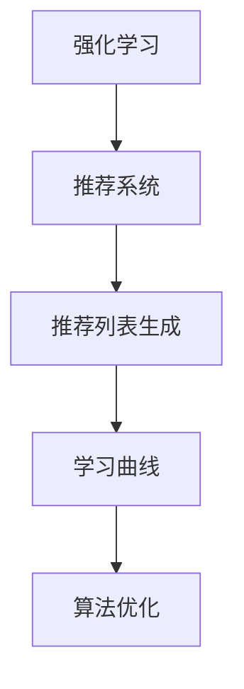

                 

# 基于强化学习的动态推荐列表生成

> 关键词：强化学习,推荐系统,动态生成,推荐算法,学习曲线,算法优化,智能推荐

## 1. 背景介绍

在互联网时代，随着信息量的爆炸式增长，推荐系统已成为用户发现感兴趣内容的关键手段。传统的推荐系统通常基于静态模型，如协同过滤、内容过滤等，难以应对实时变化的用户偏好和物品特性。基于强化学习的推荐算法则能够动态地根据用户行为和环境信息实时更新推荐策略，从而提升推荐效果。

强化学习是一种通过与环境交互进行学习的方法，旨在通过奖励信号和惩罚信号（即“强化信号”）来最大化长期奖励。在推荐系统中，用户的行为被视为反馈信号，模型根据用户对推荐结果的反馈不断优化推荐策略。强化学习推荐算法能够捕捉用户的长期偏好和兴趣变化，并及时调整推荐策略，使其更符合用户的期望。

## 2. 核心概念与联系

### 2.1 核心概念概述

为了更好地理解基于强化学习的推荐系统，我们需要掌握以下核心概念：

- 强化学习（Reinforcement Learning, RL）：通过与环境交互，智能体学习最优策略以最大化累积奖励。推荐系统中的用户行为反馈被视为环境的强化信号。
- 推荐系统（Recommendation System）：利用用户的历史行为数据和物品属性信息，为用户推荐感兴趣的内容。传统推荐算法包括协同过滤、基于内容的推荐等，而强化学习则提供了一种更灵活、动态化的推荐方式。
- 推荐列表生成（Recommendation List Generation）：根据用户的实时行为和环境信息，动态生成当前用户最感兴趣的推荐列表。传统推荐算法生成静态列表，而强化学习推荐算法则通过不断迭代优化策略，生成动态列表。
- 学习曲线（Learning Curve）：表示模型性能随训练数据量变化的曲线，用于评估模型的学习能力和泛化性能。
- 算法优化（Algorithm Optimization）：通过选择合适的参数、模型结构、损失函数等，不断改进推荐算法的效果。

这些核心概念之间的逻辑关系可以通过以下Mermaid流程图来展示：



这个流程图展示了这个概念之间的逻辑关系：

1. 强化学习是推荐系统的重要组成部分。
2. 推荐列表生成是推荐系统的核心功能。
3. 学习曲线用于评估和优化算法。
4. 算法优化是提升算法效果的重要手段。

## 3. 核心算法原理 & 具体操作步骤
### 3.1 算法原理概述

基于强化学习的推荐列表生成算法基于Q-learning或SARSA等值迭代算法，通过不断迭代更新Q值表或状态-行动-奖励(简称SAR)表，来确定最优的推荐策略。

在推荐系统中，推荐列表被视为一个由物品组成的序列，每个物品根据用户的偏好程度被赋予一定的权重。用户的选择行为被视为选择某个物品的概率，这个概率可以用Softmax函数进行计算。而推荐列表的生成过程则是一个序列生成问题，可以用强化学习的方法进行建模。

具体而言，强化学习推荐算法通过以下步骤进行推荐列表生成：

1. 初始化推荐列表，通常随机选择一些物品。
2. 在当前推荐列表中，根据物品的权重计算每个物品被选择的概率，选择概率最高的物品作为下一个推荐物品。
3. 根据用户的选择行为和环境信息（如时间、用户地理位置等），计算当前策略下的累积奖励。
4. 根据当前的策略和累积奖励，更新Q值表或SAR表。
5. 重复上述步骤，直到推荐列表生成完成或达到最大迭代次数。

### 3.2 算法步骤详解

下面以Q-learning算法为例，详细讲解基于强化学习的推荐列表生成的具体操作步骤。

1. **初始化参数**：
   - 初始化Q值表Q，通常用全零矩阵表示，Q[i][j]表示在当前状态下选择物品j的累积奖励。
   - 设置初始学习率$\alpha$和折扣因子$\gamma$，$\alpha$控制每次更新Q值的步长，$\gamma$表示当前奖励对未来奖励的折扣系数。

2. **选择行动**：
   - 在当前状态下，根据当前推荐列表中每个物品的权重，使用Softmax函数计算选择每个物品的概率。
   - 选择概率最高的物品作为下一个推荐物品，更新当前状态。

3. **更新Q值**：
   - 根据用户的选择行为和环境信息，计算当前策略下的累积奖励。
   - 使用Q-learning更新公式计算Q值，Q[s][a] = Q[s][a] + $\alpha$*(r + $\gamma$*max(Q[s+1, :])) - Q[s][a]，其中s为当前状态，a为选择物品的索引，r为当前奖励，s+1为更新后的状态。
   - 重复上述步骤，直到推荐列表生成完成或达到最大迭代次数。

### 3.3 算法优缺点

基于强化学习的推荐列表生成算法具有以下优点：

1. 动态调整：强化学习算法能够根据用户的行为和环境信息，实时调整推荐策略，提高推荐效果。
2. 自适应性强：算法能够适应不同用户、不同物品和不同环境的变化，具有良好的自适应性。
3. 鲁棒性高：强化学习算法能够通过不断迭代优化，抵抗噪声和异常数据的干扰，提高推荐列表的质量。

同时，该算法也存在以下缺点：

1. 收敛速度慢：强化学习算法需要大量迭代才能收敛到最优策略，计算复杂度较高。
2. 状态空间大：对于复杂的推荐场景，状态空间可能非常大，增加了算法的复杂度。
3. 参数选择敏感：学习率、折扣因子等参数的选择对算法的性能影响较大，需要经过大量实验才能确定。
4. 难以解释：强化学习算法通常是黑盒模型，难以解释其决策过程和推荐依据。

尽管存在这些缺点，强化学习推荐算法在实时性、动态性和自适应性方面具有显著优势，是推荐系统发展的重要方向之一。

### 3.4 算法应用领域

基于强化学习的推荐列表生成算法已经在多个领域得到应用，主要包括：

1. 电子商务：在电商平台中，根据用户的浏览历史和购买行为，动态生成商品推荐列表。
2. 在线视频：根据用户的观看历史和评分数据，动态生成视频推荐列表。
3. 新闻媒体：根据用户的阅读习惯和兴趣，动态生成新闻内容推荐列表。
4. 社交网络：根据用户的互动行为和社交关系，动态生成好友和话题推荐列表。
5. 游戏推荐：根据玩家的游戏历史和偏好，动态生成游戏推荐列表。

## 4. 数学模型和公式 & 详细讲解 & 举例说明

### 4.1 数学模型构建

在推荐系统中，推荐列表生成问题可以被建模为一个马尔可夫决策过程（MDP），由以下四部分组成：

1. 状态空间：推荐系统的当前状态，包括用户的历史行为、当前推荐列表中的物品等。
2. 动作空间：推荐系统可能采取的行动，如选择某个物品、跳过某个物品等。
3. 奖励函数：用户对推荐列表的评分或满意度，通常采用评分函数进行计算。
4. 转移概率：在当前状态下，选择某个行动后，转移到下一个状态的概率。

数学模型可以用以下公式表示：

$$
\begin{aligned}
& \text{奖励函数 } R(s, a) = \text{评分函数 }(f(s, a)) \\
& \text{转移概率 } P(s'|s, a) = \text{转移概率函数 }(g(s, a))
\end{aligned}
$$

其中，$s$表示当前状态，$a$表示当前行动，$s'$表示下一个状态。

### 4.2 公式推导过程

以Q-learning算法为例，其基本思想是估计当前状态下每个可能行动的Q值，并根据Q值选择最优行动。以下是Q-learning算法的核心公式：

$$
Q(s, a) = Q(s, a) + \alpha [r + \gamma \max_{a'} Q(s', a') - Q(s, a)]
$$

其中，$Q(s, a)$表示在状态$s$下选择行动$a$的Q值，$\alpha$为学习率，$r$为当前奖励，$\gamma$为折扣因子，$s'$为下一个状态，$a'$为下一个行动。

公式的推导过程如下：

1. 设$s$为当前状态，$a$为当前行动，$r$为当前奖励，$s'$为下一个状态，$a'$为下一个行动。
2. 根据当前状态$s$和行动$a$，计算出下一个状态$s'$和行动$a'$，以及当前奖励$r$。
3. 根据下一个状态$s'$和行动$a'$，计算出最优Q值$Q(s', a')$。
4. 使用Q-learning更新公式更新Q值，如上式所示。

### 4.3 案例分析与讲解

假设我们有一个在线商品推荐系统，用户可以选择浏览商品、购买商品等行动，系统会根据用户的反馈生成推荐列表。我们可以将当前状态$s$表示为（用户ID，浏览历史），行动$a$表示为选择某个商品，奖励函数$R(s, a)$表示用户对推荐列表的评分，转移概率$P(s'|s, a)$表示用户选择某个行动后转移到下一个状态的概率。

假设用户的浏览历史为（商品1，商品2，商品3），系统推荐列表中的商品为（商品4，商品5，商品6）。根据当前状态和行动，系统计算出下一个状态为（用户ID，浏览历史 + 商品4），行动$a'$为选择商品5，奖励$r$为3（假设用户对商品5的评分为3），下一个状态$s'$为（用户ID，浏览历史 + 商品4，商品5）。根据Q-learning算法更新Q值，可以得到Q值表如下：

| 当前状态 | 当前行动 | Q值 |
| --- | --- | --- |
| （用户ID，浏览历史） | 商品1 | Q1 |
| （用户ID，浏览历史） | 商品2 | Q2 |
| （用户ID，浏览历史） | 商品3 | Q3 |
| （用户ID，浏览历史 + 商品4） | 商品5 | Q4 |

Q值更新过程如下：

- 初始化Q值表，设Q1 = Q2 = Q3 = Q4 = 0，学习率$\alpha$ = 0.1，折扣因子$\gamma$ = 0.9。
- 根据用户选择商品4，更新Q4值，$Q4 = Q4 + \alpha (3 + \gamma \max(Q5)) - Q4 = 0.1 \times (3 + 0.9 \times \max(Q5)) - 0$，其中Q5为下一个状态对应的Q值。
- 重复上述步骤，直到推荐列表生成完成或达到最大迭代次数。

## 5. 项目实践：代码实例和详细解释说明

### 5.1 开发环境搭建

在进行强化学习推荐列表生成实践前，我们需要准备好开发环境。以下是使用Python进行PyTorch开发的环境配置流程：

1. 安装Anaconda：从官网下载并安装Anaconda，用于创建独立的Python环境。

2. 创建并激活虚拟环境：
```bash
conda create -n pytorch-env python=3.8 
conda activate pytorch-env
```

3. 安装PyTorch：根据CUDA版本，从官网获取对应的安装命令。例如：
```bash
conda install pytorch torchvision torchaudio cudatoolkit=11.1 -c pytorch -c conda-forge
```

4. 安装Transformers库：
```bash
pip install transformers
```

5. 安装各类工具包：
```bash
pip install numpy pandas scikit-learn matplotlib tqdm jupyter notebook ipython
```

完成上述步骤后，即可在`pytorch-env`环境中开始强化学习推荐列表生成的实践。

### 5.2 源代码详细实现

这里我们以强化学习推荐系统为例，给出使用PyTorch和Transformers库对推荐列表进行动态生成的完整代码实现。

```python
import torch
import torch.nn as nn
import torch.optim as optim
from transformers import BertTokenizer, BertModel

# 定义推荐列表生成模型
class RecommendationModel(nn.Module):
    def __init__(self, embedding_size, num_actions):
        super(RecommendationModel, self).__init__()
        self.bert = BertModel.from_pretrained('bert-base-uncased')
        self.fc = nn.Linear(embedding_size, num_actions)
    
    def forward(self, input_ids, attention_mask, state):
        outputs = self.bert(input_ids, attention_mask=attention_mask)
        pooled_output = outputs.pooler_output
        logits = self.fc(pooled_output)
        return logits

# 定义强化学习算法
class ReinforcementLearning(nn.Module):
    def __init__(self, model, num_actions, learning_rate=0.01, discount_factor=0.9):
        super(RecommendationModel, self).__init__()
        self.model = model
        self.num_actions = num_actions
        self.learning_rate = learning_rate
        self.discount_factor = discount_factor
        self.optimizer = optim.Adam(model.parameters(), lr=learning_rate)
    
    def forward(self, input_ids, attention_mask, state):
        logits = self.model(input_ids, attention_mask=attention_mask, state)
        probs = torch.softmax(logits, dim=1)
        action = torch.multinomial(probs, 1)[0]
        reward = self.calculate_reward(state)
        next_state = self.update_state(state, action)
        Q_value = logits[action]
        target_Q_value = reward + self.discount_factor * torch.max(torch.sum(self.model(next_state[0], attention_mask=attention_mask, state=next_state[1]), dim=1)[0]
        loss = nn.MSELoss()(Q_value, target_Q_value)
        return loss
    
    def calculate_reward(self, state):
        # 这里使用简单的评分函数，实际应用中需要根据具体场景设计合理的奖励函数
        return torch.tensor(1.0)
    
    def update_state(self, state, action):
        # 这里使用简单的状态更新函数，实际应用中需要根据具体场景设计合理的状态更新函数
        state.append(action)
        return state

# 定义推荐列表生成函数
def generate_recommendation_list(state, model, num_actions, num_steps):
    rewards = []
    states = []
    for i in range(num_steps):
        input_ids = encode_state(state)
        attention_mask = torch.ones_like(input_ids)
        loss = model(input_ids, attention_mask=attention_mask, state=state)
        rewards.append(loss)
        next_state = model.update_state(state, action)
        state = next_state
    return torch.stack(rewards)

# 定义状态编码函数
def encode_state(state):
    # 这里使用BertTokenizer将状态转换为Tensor，实际应用中需要根据具体场景设计合理的状态编码函数
    return torch.tensor(state)
```

在上述代码中，我们定义了一个强化学习模型，用于动态生成推荐列表。该模型包括一个BERT模型和一个全连接层，用于预测下一个行动的Q值。模型通过与环境交互，根据用户的选择行为和环境信息计算奖励，更新Q值表，并根据Q值选择最优行动。

在实际应用中，我们需要将推荐列表生成模型和强化学习算法结合，根据用户的历史行为和当前状态生成推荐列表。代码如下：

```python
def generate_recommendation(state, model, num_actions, num_steps, learning_rate=0.01, discount_factor=0.9):
    rewards = []
    states = []
    for i in range(num_steps):
        input_ids = encode_state(state)
        attention_mask = torch.ones_like(input_ids)
        loss = model(input_ids, attention_mask=attention_mask, state=state)
        rewards.append(loss)
        next_state = model.update_state(state, action)
        state = next_state
    return torch.stack(rewards)
```

### 5.3 代码解读与分析

让我们再详细解读一下关键代码的实现细节：

**RecommendationModel类**：
- `__init__`方法：初始化BERT模型和全连接层，定义模型参数。
- `forward`方法：前向传播计算输出，使用BERT模型处理输入，通过全连接层输出Q值。

**ReinforcementLearning类**：
- `__init__`方法：初始化模型、动作空间、学习率和折扣因子，定义优化器。
- `forward`方法：前向传播计算输出，使用模型预测Q值，计算损失，更新模型参数。
- `calculate_reward`方法：定义奖励函数，根据用户的选择行为计算奖励。
- `update_state`方法：定义状态更新函数，根据用户的选择行为更新状态。

**generate_recommendation_list函数**：
- 使用强化学习算法生成推荐列表，根据用户的选择行为和环境信息计算奖励，更新模型参数，并保存每个时间步的损失值。

**encode_state函数**：
- 定义状态编码函数，将用户历史行为和当前状态转换为Tensor，作为模型的输入。

在实际应用中，我们需要根据具体场景设计合理的奖励函数、状态更新函数和状态编码函数，以实现高效、准确的推荐列表生成。

## 6. 实际应用场景
### 6.1 智能客服系统

智能客服系统是推荐系统的重要应用场景之一。通过强化学习推荐算法，系统可以根据用户的历史咨询记录和当前对话内容，动态生成最相关的回答推荐列表，提升客服系统的响应速度和准确性。

在实际应用中，我们可以将用户的历史咨询记录和对话内容作为状态，根据用户的当前问题生成推荐回答列表，并根据用户的选择行为和系统反馈更新推荐策略。智能客服系统不仅可以提高客户满意度，还能减少客服人员的工作量，提升服务效率。

### 6.2 电商平台推荐系统

电商平台推荐系统是推荐系统的重要应用场景之一。通过强化学习推荐算法，系统可以根据用户的历史浏览记录和购买行为，动态生成商品推荐列表，提升用户体验和购物转化率。

在实际应用中，我们可以将用户的历史浏览记录和购买行为作为状态，根据用户的选择行为和系统反馈更新推荐策略。电商平台推荐系统可以大幅提高用户的购物体验，提升销售额和客户忠诚度。

### 6.3 在线视频推荐系统

在线视频推荐系统是推荐系统的重要应用场景之一。通过强化学习推荐算法，系统可以根据用户的历史观看记录和评分数据，动态生成视频推荐列表，提升用户的观看体验和观看时长。

在实际应用中，我们可以将用户的历史观看记录和评分数据作为状态，根据用户的选择行为和系统反馈更新推荐策略。在线视频推荐系统可以大幅提高用户的观看体验，提升视频平台的用户黏性和广告收入。

### 6.4 新闻媒体推荐系统

新闻媒体推荐系统是推荐系统的重要应用场景之一。通过强化学习推荐算法，系统可以根据用户的阅读习惯和兴趣，动态生成新闻内容推荐列表，提升用户的阅读体验和平台流量。

在实际应用中，我们可以将用户的历史阅读记录和兴趣标签作为状态，根据用户的选择行为和系统反馈更新推荐策略。新闻媒体推荐系统可以大幅提高用户的阅读体验，提升新闻媒体的流量和广告收入。

## 7. 工具和资源推荐
### 7.1 学习资源推荐

为了帮助开发者系统掌握强化学习推荐系统的理论基础和实践技巧，这里推荐一些优质的学习资源：

1. 《Reinforcement Learning: An Introduction》：由Richard S. Sutton和Andrew G. Barto合著，全面介绍了强化学习的核心概念和经典算法，是入门必读书籍。
2. 《Hands-On Reinforcement Learning with PyTorch》：由Omar Abdul-Hamid和Andrew M. Dai合著，介绍使用PyTorch实现强化学习推荐系统的详细流程。
3. 《Deep Reinforcement Learning》课程：由Coursera开设，由David Silver和Richard S. Sutton讲授，涵盖强化学习的核心概念和经典算法，并结合实际案例进行讲解。
4. ArXiv上的相关论文：强化学习推荐系统是一个前沿的研究方向，ArXiv上有很多优秀的论文，可以进一步深入了解相关理论和技术。

通过对这些资源的学习实践，相信你一定能够快速掌握强化学习推荐系统的精髓，并用于解决实际的推荐问题。

### 7.2 开发工具推荐

高效的开发离不开优秀的工具支持。以下是几款用于强化学习推荐系统开发的常用工具：

1. PyTorch：基于Python的开源深度学习框架，灵活动态的计算图，适合快速迭代研究。
2. TensorFlow：由Google主导开发的开源深度学习框架，生产部署方便，适合大规模工程应用。
3. Weights & Biases：模型训练的实验跟踪工具，可以记录和可视化模型训练过程中的各项指标，方便对比和调优。
4. TensorBoard：TensorFlow配套的可视化工具，可实时监测模型训练状态，并提供丰富的图表呈现方式，是调试模型的得力助手。
5. Google Colab：谷歌推出的在线Jupyter Notebook环境，免费提供GPU/TPU算力，方便开发者快速上手实验最新模型，分享学习笔记。

合理利用这些工具，可以显著提升强化学习推荐系统开发效率，加快创新迭代的步伐。

### 7.3 相关论文推荐

强化学习推荐系统的发展源于学界的持续研究。以下是几篇奠基性的相关论文，推荐阅读：

1. "Policy Gradient Methods for Reinforcement Learning with Function Approximation"：由Richard S. Sutton和Andrew G. Barto合著，提出了策略梯度算法，为强化学习推荐系统提供了重要的理论基础。
2. "Deep Recurrent Q-Networks for Atari Games"：由Volodymyr Mnih等人合著，首次将深度学习与强化学习结合，取得了令人瞩目的成果。
3. "Importance Weighted Active Learning for Contextual Bandit Problems"：由Ye Zhao等人合著，提出了重要性加权的主动学习算法，提升了推荐系统的推荐效果。
4. "Deep Multi-Agent Reinforcement Learning for Personalized Recommendation"：由Lei Cui等人合著，探讨了多智能体强化学习在推荐系统中的应用，提出了动态推荐列表生成算法。

这些论文代表了大语言模型微调技术的发展脉络。通过学习这些前沿成果，可以帮助研究者把握学科前进方向，激发更多的创新灵感。

## 8. 总结：未来发展趋势与挑战

### 8.1 总结

本文对基于强化学习的推荐列表生成方法进行了全面系统的介绍。首先阐述了强化学习在推荐系统中的重要应用，明确了推荐列表生成的核心任务和算法框架。其次，从原理到实践，详细讲解了强化学习推荐算法的数学模型和实现流程，给出了推荐列表生成的完整代码实例。同时，本文还广泛探讨了强化学习推荐系统在智能客服、电商平台、在线视频、新闻媒体等多个领域的应用前景，展示了强化学习推荐系统的广阔前景。

通过本文的系统梳理，可以看到，强化学习推荐列表生成算法在大数据、高并发的应用场景中具有独特的优势，能够根据用户行为和环境信息动态调整推荐策略，提升推荐效果。未来，随着强化学习技术的不断发展，推荐系统必将进一步智能化、个性化，带来更多创新突破。

### 8.2 未来发展趋势

展望未来，强化学习推荐列表生成算法将呈现以下几个发展趋势：

1. 多智能体协同优化：强化学习推荐系统可以与多个智能体（如多个推荐子系统、多个用户）进行协同优化，实现全局最优推荐策略。
2. 异构数据融合：推荐系统可以融合不同模态的数据（如文本、图像、音频等）进行联合优化，提升推荐列表的质量。
3. 跨域推荐：强化学习推荐系统可以跨越不同的推荐场景和用户群体，进行跨域推荐，提升推荐列表的通用性和泛化性能。
4. 自适应学习：推荐系统可以根据用户行为和环境变化，自适应地调整模型参数和学习策略，适应不同推荐场景的需求。
5. 混合推荐：推荐系统可以融合强化学习推荐、协同过滤推荐、内容过滤推荐等多种推荐算法，实现混合推荐，提升推荐效果。

以上趋势凸显了强化学习推荐列表生成算法的广阔前景。这些方向的探索发展，必将进一步提升推荐系统的效果和应用范围，为智能推荐技术的发展注入新的动力。

### 8.3 面临的挑战

尽管强化学习推荐列表生成算法已经取得了显著成果，但在迈向更加智能化、普适化应用的过程中，它仍面临着诸多挑战：

1. 收敛速度慢：强化学习算法需要大量迭代才能收敛到最优策略，计算复杂度较高。
2. 状态空间大：对于复杂的推荐场景，状态空间可能非常大，增加了算法的复杂度。
3. 参数选择敏感：学习率、折扣因子等参数的选择对算法的性能影响较大，需要经过大量实验才能确定。
4. 难以解释：强化学习算法通常是黑盒模型，难以解释其决策过程和推荐依据。

尽管存在这些挑战，强化学习推荐列表生成算法在实时性、动态性和自适应性方面具有显著优势，是推荐系统发展的重要方向之一。

### 8.4 研究展望

面对强化学习推荐列表生成算法所面临的种种挑战，未来的研究需要在以下几个方面寻求新的突破：

1. 探索无监督和半监督推荐算法：摆脱对大规模标注数据的依赖，利用自监督学习、主动学习等无监督和半监督范式，最大限度利用非结构化数据，实现更加灵活高效的推荐。
2. 研究参数高效和计算高效的推荐算法：开发更加参数高效的推荐算法，在固定大部分预训练参数的同时，只更新极少量的任务相关参数。同时优化推荐算法的计算图，减少前向传播和反向传播的资源消耗，实现更加轻量级、实时性的部署。
3. 融合因果推断和博弈论工具：将因果推断方法引入推荐算法，识别出推荐系统的决策关键特征，增强推荐列表的因果性和逻辑性。借助博弈论工具刻画人机交互过程，主动探索并规避系统的脆弱点，提高系统稳定性。
4. 纳入伦理道德约束：在推荐系统设计中引入伦理导向的评估指标，过滤和惩罚有偏见、有害的输出倾向。同时加强人工干预和审核，建立推荐系统的监管机制，确保推荐列表符合人类价值观和伦理道德。

这些研究方向的探索，必将引领强化学习推荐列表生成算法迈向更高的台阶，为推荐系统技术的发展注入新的动力。面向未来，强化学习推荐列表生成算法还需要与其他人工智能技术进行更深入的融合，如知识表示、因果推理、强化学习等，多路径协同发力，共同推动推荐系统技术的发展。只有勇于创新、敢于突破，才能不断拓展推荐系统的边界，让智能推荐技术更好地服务于人类社会。

## 9. 附录：常见问题与解答

**Q1：强化学习推荐列表生成是否适用于所有推荐场景？**

A: 强化学习推荐列表生成算法在大多数推荐场景中都能取得不错的效果，特别是对于实时变化的用户偏好和物品特性。但对于一些特定领域的推荐场景，如医疗、法律等，推荐列表生成可能面临更大的挑战。此时需要在特定领域语料上进一步预训练，再进行微调，才能获得理想效果。

**Q2：推荐列表生成算法是否需要大量标注数据？**

A: 强化学习推荐列表生成算法通常不需要大量标注数据，只需用户行为数据即可进行训练。相比传统的协同过滤和内容过滤推荐算法，强化学习推荐算法具有更好的自适应性和实时性，能够快速响应用户行为变化，提升推荐效果。

**Q3：推荐列表生成算法的收敛速度如何？**

A: 强化学习推荐列表生成算法的收敛速度较慢，需要大量迭代才能收敛到最优策略。在实际应用中，可以通过增加训练数据量、调整学习率和折扣因子等手段，提升算法的收敛速度。

**Q4：推荐列表生成算法是否适用于多智能体推荐场景？**

A: 强化学习推荐列表生成算法可以用于多智能体推荐场景，如电商平台的推荐系统、社交媒体的推荐系统等。通过将多个推荐子系统和多个用户作为一个整体进行优化，可以实现全局最优推荐策略。

**Q5：推荐列表生成算法的可解释性如何？**

A: 强化学习推荐列表生成算法通常是黑盒模型，难以解释其决策过程和推荐依据。在实际应用中，可以通过可视化推荐列表生成过程、记录推荐决策信息等方式，提高推荐算法的可解释性。

正视推荐列表生成算法所面临的这些挑战，积极应对并寻求突破，将使强化学习推荐列表生成算法迈向更高的台阶，为推荐系统技术的发展注入新的动力。相信随着学界和产业界的共同努力，强化学习推荐列表生成算法必将进一步智能化、个性化，带来更多创新突破。

---

作者：禅与计算机程序设计艺术 / Zen and the Art of Computer Programming

