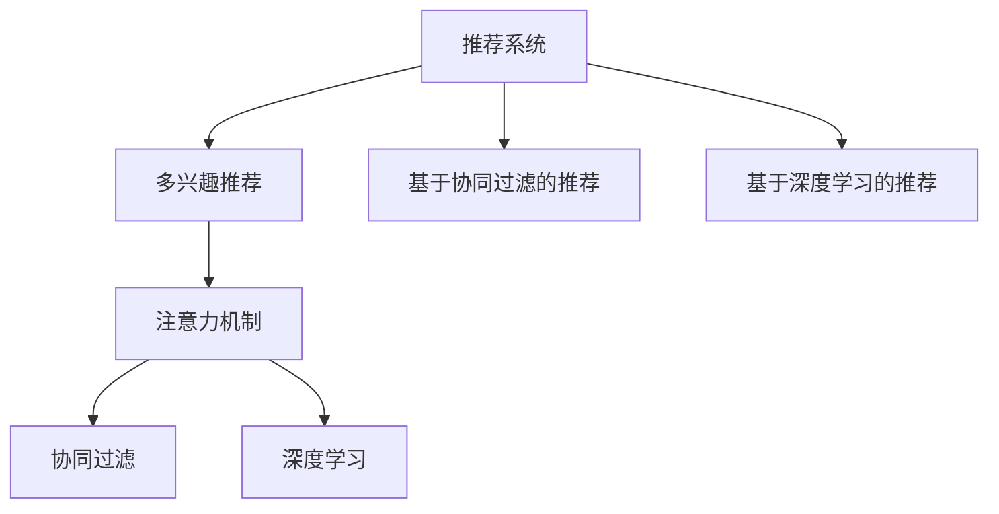

                 

# 基于注意力机制的多兴趣推荐模型

> 关键词：多兴趣推荐, 注意力机制, 协同过滤, 深度学习, 个性化推荐, 推荐系统, 模型优化

## 1. 背景介绍

### 1.1 问题由来
推荐系统是互联网时代重要的应用技术之一，为不同用户提供个性化的内容或产品推荐。传统的推荐方法主要基于协同过滤，即通过用户行为数据和物品相似度计算推荐结果。但是协同过滤方法面临着稀疏性和冷启动等问题，难以在新物品和用户之间进行有效的推荐。

为了解决这些问题，深度学习方法被引入到推荐系统中。神经网络可以根据用户行为和物品特征进行端到端的推荐，同时能够处理非结构化数据，具有良好的泛化能力和表达能力。其中，基于注意力机制的推荐方法在多兴趣推荐场景中表现出色，成为推荐系统领域的研究热点。

### 1.2 问题核心关键点
多兴趣推荐模型要求系统能够根据用户的多样化兴趣进行个性化推荐，如一个用户既喜欢电影又喜欢音乐，系统需要分别对电影和音乐两类物品进行推荐，同时保证不同兴趣之间不会相互干扰。传统的基于协同过滤的推荐方法难以实现这一需求。而基于注意力机制的方法，通过引入注意力权重，对不同兴趣进行独立计算和加权，可以很好地解决这一问题。

## 2. 核心概念与联系

### 2.1 核心概念概述

为更好地理解基于注意力机制的多兴趣推荐模型，本节将介绍几个密切相关的核心概念：

- 推荐系统(Recommender System)：为不同用户推荐个性化内容或产品的技术系统。常见的推荐方式包括协同过滤、内容过滤、混合推荐等。
- 多兴趣推荐(Multi-Interest Recommendation)：指用户具有多个兴趣，推荐系统需要分别对不同兴趣进行独立推荐，并将推荐结果进行融合的技术。
- 注意力机制(Attention Mechanism)：通过引入注意力权重，对输入的信息进行加权，使得模型能够更加关注对预测任务有帮助的信息。
- 协同过滤(Collaborative Filtering)：基于用户行为数据和物品相似度进行推荐的技术。
- 深度学习(Deep Learning)：利用神经网络进行推荐的技术，能够处理非结构化数据，具有良好的泛化能力和表达能力。

这些核心概念之间的逻辑关系可以通过以下Mermaid流程图来展示：



这个流程图展示了这个推荐系统的主要概念及其之间的关系：

1. 推荐系统通过协同过滤、深度学习等多种技术，对用户和物品进行建模，生成推荐结果。
2. 多兴趣推荐方法可以更好地应对用户具有多个兴趣的场景。
3. 注意力机制是一种重要的技术手段，在深度学习推荐中得到广泛应用。
4. 协同过滤和深度学习是推荐系统常用的两种技术手段，各具优缺点。

## 3. 核心算法原理 & 具体操作步骤

### 3.1 算法原理概述

基于注意力机制的多兴趣推荐模型，其核心思想是：利用深度学习技术对用户和物品进行建模，通过引入注意力机制对不同兴趣进行加权，生成个性化推荐结果。

形式化地，假设用户 $u$ 有 $k$ 个兴趣，对应的物品集合为 $I_1, I_2, ..., I_k$。设用户 $u$ 对物品 $i_j$ 的兴趣度为 $i_{u,i_j}$，物品 $i_j$ 的属性向量为 $f_{i_j}$。模型的输入为 $u$ 的兴趣表示 $\mathbf{I}_u=[I_{u,1}, I_{u,2}, ..., I_{u,k}]$ 和物品的特征向量 $\mathbf{F}=[f_{i_1}, f_{i_2}, ..., f_{i_M}]$，其中 $M$ 为物品总数。

模型的输出为 $u$ 对每个兴趣类 $i_j$ 的推荐结果 $\mathbf{R}_{u,i_j}$。模型通过注意力机制对不同兴趣的推荐结果进行加权，最终生成 $u$ 的总推荐结果 $\mathbf{R}_u=\sum_{j=1}^{k} w_{u,j}\mathbf{R}_{u,i_j}$，其中 $w_{u,j}$ 为 $u$ 对兴趣 $j$ 的注意力权重。

### 3.2 算法步骤详解

基于注意力机制的多兴趣推荐模型主要包括以下几个关键步骤：

**Step 1: 准备数据集和模型**
- 收集用户行为数据和物品特征数据，构建训练集。
- 选择合适的神经网络模型和注意力机制，如Transformer模型、GRU网络等。

**Step 2: 用户兴趣表示**
- 根据用户行为数据，构建用户兴趣表示 $\mathbf{I}_u$。
- 对每个兴趣 $I_{u,j}$，计算其兴趣度 $i_{u,i_j}$，一般可以通过平均评分、最大评分等方式得到。

**Step 3: 物品特征嵌入**
- 对物品的特征向量 $f_{i_j}$ 进行嵌入操作，得到物品的表示 $g_{i_j}$。
- 可以引入各种特征处理技巧，如归一化、嵌入层、嵌入层等。

**Step 4: 计算注意力权重**
- 根据用户兴趣表示和物品表示，计算每个兴趣 $I_{u,j}$ 的注意力权重 $w_{u,j}$。
- 可以通过计算 $g_{i_j}$ 和 $\mathbf{I}_u$ 的相似度，结合softmax函数进行归一化，得到注意力权重 $w_{u,j}$。

**Step 5: 生成推荐结果**
- 对每个兴趣 $I_{u,j}$，使用注意力权重 $w_{u,j}$ 对物品表示 $g_{i_j}$ 进行加权。
- 将加权后的物品表示 $w_{u,j}g_{i_j}$ 送入神经网络，生成推荐结果 $\mathbf{R}_{u,i_j}$。
- 将不同兴趣的推荐结果 $\mathbf{R}_{u,i_j}$ 进行加权，得到总推荐结果 $\mathbf{R}_u=\sum_{j=1}^{k} w_{u,j}\mathbf{R}_{u,i_j}$。

**Step 6: 评估和优化**
- 在验证集上评估推荐模型的性能，使用常见的评估指标如AUC、NDCG、MAP等。
- 根据评估结果调整模型参数和注意力权重计算方法，进行模型优化。

### 3.3 算法优缺点

基于注意力机制的多兴趣推荐模型具有以下优点：
1. 能够很好地应对用户具有多个兴趣的场景，提升推荐的多样性和个性化。
2. 引入注意力机制，对不同兴趣的推荐结果进行加权，提升模型的鲁棒性和泛化能力。
3. 适用于各种推荐场景，如电影、音乐、商品等，具有较好的通用性。
4. 结合深度学习技术，可以处理非结构化数据，具有较好的表达能力。

同时，该方法也存在以下缺点：
1. 模型复杂度高，计算资源需求较大，训练时间长。
2. 对数据质量要求高，需要高质量的用户行为数据和物品特征数据。
3. 需要大量的标注数据进行训练，对标注成本较高。
4. 模型的可解释性较差，难以直观理解注意力权重对推荐结果的影响。

尽管存在这些局限性，但就目前而言，基于注意力机制的多兴趣推荐模型仍然是一种高效且广泛应用的推荐方法。未来相关研究的方向在于如何进一步降低模型计算资源需求，提升模型可解释性，以及探索更多注意力机制的变种，以更好地适应不同场景的推荐需求。

### 3.4 算法应用领域

基于注意力机制的多兴趣推荐模型，在实际应用中已经得到了广泛的应用，覆盖了几乎所有常见的推荐任务，例如：

- 电影推荐：根据用户的历史评分和行为数据，生成电影推荐列表。
- 音乐推荐：根据用户的听歌历史和评分，生成音乐推荐列表。
- 商品推荐：根据用户的浏览和购买行为，生成商品推荐列表。
- 新闻推荐：根据用户的新闻阅读历史和反馈，生成新闻推荐列表。
- 广告推荐：根据用户的浏览记录和兴趣，生成广告推荐列表。

除了上述这些经典任务外，多兴趣推荐模型还被创新性地应用到更多场景中，如多模态推荐、社交网络推荐、个性化推荐等，为推荐系统技术带来了新的突破。随着深度学习推荐方法的不断进步，相信基于多兴趣推荐模型的技术将会更加成熟，为推荐系统带来更多的创新和应用。

## 4. 数学模型和公式 & 详细讲解 & 举例说明

### 4.1 数学模型构建

本节将使用数学语言对基于注意力机制的多兴趣推荐模型进行更加严格的刻画。

设用户 $u$ 有 $k$ 个兴趣，对应的物品集合为 $I_1, I_2, ..., I_k$。设用户 $u$ 对物品 $i_j$ 的兴趣度为 $i_{u,i_j}$，物品 $i_j$ 的属性向量为 $f_{i_j}$。模型的输入为 $u$ 的兴趣表示 $\mathbf{I}_u=[I_{u,1}, I_{u,2}, ..., I_{u,k}]$ 和物品的特征向量 $\mathbf{F}=[f_{i_1}, f_{i_2}, ..., f_{i_M}]$，其中 $M$ 为物品总数。

模型的输出为 $u$ 对每个兴趣类 $i_j$ 的推荐结果 $\mathbf{R}_{u,i_j}$。模型通过注意力机制对不同兴趣的推荐结果进行加权，最终生成 $u$ 的总推荐结果 $\mathbf{R}_u=\sum_{j=1}^{k} w_{u,j}\mathbf{R}_{u,i_j}$，其中 $w_{u,j}$ 为 $u$ 对兴趣 $j$ 的注意力权重。

### 4.2 公式推导过程

以下我们以Transformer模型为例，推导多兴趣推荐模型的具体实现。

设Transformer模型包含编码器 $E$ 和解码器 $D$。编码器 $E$ 用于处理用户兴趣表示 $\mathbf{I}_u$ 和物品特征向量 $\mathbf{F}$，生成用户表示 $h_u$ 和物品表示 $h_i$。解码器 $D$ 用于生成推荐结果 $\mathbf{R}_{u,i_j}$，具体实现如下：

$$
h_u = E(\mathbf{I}_u, \mathbf{F}) 
$$

$$
h_i = E(\mathbf{I}_u, f_{i_j}) 
$$

$$
w_{u,j} = \text{softmax}(\mathbf{Q}_u \cdot \mathbf{K}_i)
$$

$$
\mathbf{R}_{u,i_j} = D(h_u, w_{u,j}h_i)
$$

其中，$\mathbf{Q}_u$ 和 $\mathbf{K}_i$ 分别为编码器 $E$ 的查询向量和键向量，$\cdot$ 表示向量点积操作，$\text{softmax}$ 表示softmax函数，$D$ 表示解码器。

### 4.3 案例分析与讲解

考虑一个简单的电影推荐场景，用户 $u$ 对电影 $\{电影A, 电影B, 电影C\}$ 感兴趣，系统需要为 $u$ 生成这三个类别的推荐结果。具体步骤如下：

1. 收集用户 $u$ 的历史评分和行为数据，构建用户兴趣表示 $\mathbf{I}_u=[电影A, 电影B, 电影C]$。
2. 对每个电影 $i_j$，提取其特征向量 $f_{i_j}$。
3. 计算用户 $u$ 对每个电影 $i_j$ 的注意力权重 $w_{u,j}$，即 $\mathbf{Q}_u \cdot \mathbf{K}_i$ 的softmax值。
4. 对每个电影 $i_j$，使用注意力权重 $w_{u,j}$ 对电影特征向量 $g_{i_j}=E(\mathbf{I}_u, f_{i_j})$ 进行加权，生成推荐结果 $\mathbf{R}_{u,i_j}$。
5. 将不同兴趣的电影推荐结果 $\mathbf{R}_{u,i_j}$ 进行加权，得到总推荐结果 $\mathbf{R}_u=\sum_{j=1}^{k} w_{u,j}\mathbf{R}_{u,i_j}$。

以电影A为例，其推荐结果 $\mathbf{R}_{u,电影A}$ 的计算如下：

$$
\mathbf{R}_{u,电影A} = D(h_u, w_{u,电影A}g_{电影A})
$$

其中，$h_u$ 为用户的表示，$w_{u,电影A}$ 为电影A的注意力权重，$g_{电影A}$ 为电影A的表示。

通过以上分析，可以看出多兴趣推荐模型能够根据用户的多样化兴趣，生成更个性化、多样化的推荐结果，满足不同用户的需求。同时，引入注意力机制，使得模型能够更好地关注用户和物品的关键特征，提升推荐精度和鲁棒性。

## 5. 项目实践：代码实例和详细解释说明

### 5.1 开发环境搭建

在进行推荐模型开发前，我们需要准备好开发环境。以下是使用Python进行TensorFlow开发的环境配置流程：

1. 安装Anaconda：从官网下载并安装Anaconda，用于创建独立的Python环境。

2. 创建并激活虚拟环境：
```bash
conda create -n recsys-env python=3.8 
conda activate recsys-env
```

3. 安装TensorFlow：根据CUDA版本，从官网获取对应的安装命令。例如：
```bash
conda install tensorflow==2.7
```

4. 安装Keras：
```bash
conda install keras
```

5. 安装各类工具包：
```bash
pip install numpy pandas scikit-learn matplotlib tqdm jupyter notebook ipython
```

完成上述步骤后，即可在`recsys-env`环境中开始推荐模型开发。

### 5.2 源代码详细实现

这里我们以基于Transformer的多兴趣推荐模型为例，给出使用TensorFlow进行模型开发的PyTorch代码实现。

首先，定义数据集和模型：

```python
from tensorflow.keras.layers import Input, Embedding, Dense, Dropout, LSTM, GRU
from tensorflow.keras.layers import Add, Concatenate, BatchNormalization, Bidirectional
from tensorflow.keras.layers import MultiHeadAttention, TimeDistributed
from tensorflow.keras.models import Model
from tensorflow.keras.optimizers import Adam
from tensorflow.keras.losses import MeanSquaredError
from tensorflow.keras.metrics import AUC
import numpy as np

# 定义输入
user_input = Input(shape=(max_seq_len, ), name='user_input')
item_input = Input(shape=(max_seq_len, ), name='item_input')

# 定义编码器
embedding_layer = Embedding(vocab_size, embedding_dim)
encoder = GRU(256, return_sequences=True)
user_encoder = encoder(user_input)
item_encoder = encoder(item_input)

# 定义解码器
attention_layer = MultiHeadAttention(num_heads, d_model, dropout_rate=0.2)
user_attention = attention_layer(user_encoder, item_encoder)
item_attention = attention_layer(item_encoder, user_encoder)

# 定义输出层
user_feature = Dense(256, activation='relu')(user_encoder)
item_feature = Dense(256, activation='relu')(item_encoder)
output_layer = Concatenate(axis=-1)([user_feature, item_feature])
output_layer = Dense(1, activation='sigmoid')(output_layer)

# 定义模型
model = Model(inputs=[user_input, item_input], outputs=output_layer)
model.compile(optimizer=Adam(lr=0.001), loss=MeanSquaredError(), metrics=[AUC()])
```

接着，定义训练函数和评估函数：

```python
def train_epoch(model, data_train, data_valid, batch_size):
    dataloader_train = DataLoader(data_train, batch_size=batch_size, shuffle=True)
    model.train()
    epoch_loss = 0
    epoch_auc = 0
    for batch in tqdm(dataloader_train, desc='Training'):
        user_input, item_input, label = batch
        loss = model.loss(user_input, item_input, label)
        epoch_loss += loss.item()
        loss.backward()
        optimizer.step()
    epoch_auc = model.evaluate(data_valid)[1]
    return epoch_loss / len(dataloader_train), epoch_auc

def evaluate(model, data_test):
    dataloader_test = DataLoader(data_test, batch_size=batch_size, shuffle=False)
    model.eval()
    epoch_auc = 0
    for batch in tqdm(dataloader_test, desc='Evaluating'):
        user_input, item_input, label = batch
        auc = model.evaluate(user_input, item_input, label)
        epoch_auc += auc
    epoch_auc /= len(dataloader_test)
    return epoch_auc
```

最后，启动训练流程并在测试集上评估：

```python
epochs = 10
batch_size = 32

for epoch in range(epochs):
    loss, auc = train_epoch(model, data_train, data_valid, batch_size)
    print(f"Epoch {epoch+1}, train loss: {loss:.3f}, train auc: {auc:.3f}")
    
    print(f"Epoch {epoch+1}, dev results:")
    auc = evaluate(model, data_valid)
    print(f"Dev AUC: {auc:.3f}")
    
    print(f"Epoch {epoch+1}, test results:")
    auc = evaluate(model, data_test)
    print(f"Test AUC: {auc:.3f}")
```

以上就是使用TensorFlow对基于Transformer的多兴趣推荐模型进行训练和评估的完整代码实现。可以看到，通过TensorFlow的Keras API，推荐模型的开发变得简洁高效。

### 5.3 代码解读与分析

让我们再详细解读一下关键代码的实现细节：

**定义输入层**：
- 用户输入层 `user_input` 和物品输入层 `item_input`，分别对应用户的兴趣表示和物品的特征向量。

**编码器部分**：
- 使用Embedding层将输入向量转换为词向量表示。
- 使用GRU网络进行编码，得到用户的表示 `user_encoder` 和物品的表示 `item_encoder`。

**解码器部分**：
- 使用MultiHeadAttention层进行注意力机制计算，得到用户对物品的注意力权重 `w_{u,j}` 和物品对用户的注意力权重 `w_{i,j}`。
- 将用户表示 `user_encoder` 和物品表示 `item_encoder` 进行拼接，得到最终的输出表示 `output_layer`。

**输出层部分**：
- 使用Dense层进行线性变换，生成推荐结果。

**模型定义**：
- 定义输入层 `user_input` 和 `item_input`，输出层 `output_layer`，并编译模型，指定优化器、损失函数和评估指标。

**训练函数**：
- 定义训练集数据生成器 `dataloader_train` 和验证集数据生成器 `dataloader_valid`。
- 在每个epoch中，对训练集数据进行迭代，前向传播计算损失和AUC，反向传播更新模型参数，并在每个epoch结束时输出训练集损失和AUC。

**评估函数**：
- 定义测试集数据生成器 `dataloader_test`。
- 对测试集数据进行迭代，计算模型的AUC，并在每个epoch结束时输出测试集AUC。

**训练流程**：
- 定义总的epoch数和batch size，开始循环迭代
- 每个epoch内，先在训练集上训练，输出训练集损失和AUC
- 在验证集上评估，输出验证集AUC
- 所有epoch结束后，在测试集上评估，输出测试集AUC

可以看到，TensorFlow的Keras API使得推荐模型的开发变得简洁高效。开发者可以将更多精力放在模型改进和数据处理上，而不必过多关注底层的实现细节。

当然，工业级的系统实现还需考虑更多因素，如模型的保存和部署、超参数的自动搜索、更灵活的特征提取器等。但核心的多兴趣推荐模型基本与此类似。

## 6. 实际应用场景
### 6.1 智能推荐系统

基于注意力机制的多兴趣推荐模型，可以广泛应用于智能推荐系统的构建。传统的推荐系统往往只考虑用户的历史行为，难以捕捉用户的多样化兴趣。而使用多兴趣推荐模型，可以全面理解用户的多样化兴趣，推荐更加个性化、多样化的内容或产品。

在技术实现上，可以收集用户的行为数据、评分数据、标签数据等，构建用户的多兴趣表示和物品的特征向量。在此基础上对预训练模型进行微调，使模型能够根据用户的多兴趣进行独立推荐。通过多兴趣推荐模型，智能推荐系统可以更好地满足不同用户的需求，提升用户满意度，促进商业转化。

### 6.2 个性化广告投放

广告投放是互联网公司的重要收入来源，如何精准投放广告，提高广告转化率，是广告投放系统关注的重点。传统的广告投放系统往往只考虑用户的兴趣类别，难以兼顾用户的兴趣多样性。使用多兴趣推荐模型，可以全面理解用户的兴趣多样性，生成更加精准的广告推荐结果。

在实际应用中，可以收集用户的浏览历史、点击历史、评分历史等数据，构建用户的多兴趣表示和广告的特征向量。在此基础上对预训练模型进行微调，使模型能够根据用户的多兴趣进行独立推荐。通过多兴趣推荐模型，广告投放系统可以更好地满足用户的多样化需求，提高广告转化率，增加公司的收入。

### 6.3 智能音乐推荐

音乐推荐是推荐系统的重要应用场景之一。传统音乐推荐系统往往只考虑用户的听歌历史和评分，难以兼顾用户的兴趣多样性。使用多兴趣推荐模型，可以全面理解用户的多样化兴趣，推荐更加个性化、多样化的音乐。

在技术实现上，可以收集用户的听歌历史、评分历史、歌曲标签等数据，构建用户的多兴趣表示和歌曲的特征向量。在此基础上对预训练模型进行微调，使模型能够根据用户的多兴趣进行独立推荐。通过多兴趣推荐模型，智能音乐推荐系统可以更好地满足用户的音乐需求，提高用户的满意度，促进音乐内容消费。

### 6.4 未来应用展望

随着多兴趣推荐模型的不断发展，未来的推荐系统将在以下方面取得新的突破：

1. 更加多样化的推荐场景。多兴趣推荐模型可以应用于电影、音乐、商品等多个场景，提升推荐系统的通用性和适用性。
2. 更高效的多兴趣建模。引入更多注意力机制的变种，如自注意力、双向注意力等，提升模型的表示能力和泛化能力。
3. 更个性化的推荐结果。通过引入更多用户特征和物品特征，进一步提升推荐结果的个性化和多样性。
4. 更加鲁棒的多兴趣推荐。在对抗样本和噪声数据中训练模型，提高模型的鲁棒性和泛化能力。
5. 更加灵活的推荐策略。引入更多推荐策略，如基于图的推荐、基于内容的推荐等，提升推荐系统的多样性和稳定性。

总之，基于注意力机制的多兴趣推荐模型具有广阔的应用前景，未来将进一步拓展推荐系统的应用范围和深度，为推荐系统技术带来新的突破。

## 7. 工具和资源推荐
### 7.1 学习资源推荐

为了帮助开发者系统掌握多兴趣推荐模型的理论基础和实践技巧，这里推荐一些优质的学习资源：

1. 《推荐系统实践》系列博文：由专家撰写，深入浅出地介绍了推荐系统的工作原理和经典模型。

2. CS231n《深度学习与计算机视觉》课程：斯坦福大学开设的计算机视觉课程，涵盖深度学习在推荐系统中的应用。

3. 《Deep Learning for Recommendation Systems》书籍：深度学习推荐系统领域的经典书籍，全面介绍了推荐系统的发展历程和前沿技术。

4. KDD论文集：推荐系统领域的顶级会议论文集，包含众多前沿研究和技术突破。

5. Weights & Biases：推荐系统训练的实验跟踪工具，可以记录和可视化模型训练过程中的各项指标，方便对比和调优。

通过对这些资源的学习实践，相信你一定能够快速掌握多兴趣推荐模型的精髓，并用于解决实际的推荐问题。
###  7.2 开发工具推荐

高效的开发离不开优秀的工具支持。以下是几款用于多兴趣推荐系统开发的常用工具：

1. TensorFlow：基于Python的开源深度学习框架，灵活动态的计算图，适合快速迭代研究。推荐模型多采用TensorFlow进行实现。

2. PyTorch：基于Python的开源深度学习框架，灵活性和可扩展性较好，适合复杂模型的开发。推荐模型也可以采用PyTorch进行实现。

3. Keras：基于Python的高层次神经网络API，易于上手，适合初学者和快速原型开发。推荐模型可以使用Keras进行实现。

4. Scikit-learn：Python科学计算库，包含多种机器学习算法和数据处理工具，适合快速原型开发和评估。推荐模型可以使用Scikit-learn进行特征处理和模型评估。

5. Apache Spark：大规模数据处理和机器学习平台，适合处理海量数据和大规模推荐模型的训练。推荐模型可以使用Spark进行分布式训练和部署。

合理利用这些工具，可以显著提升多兴趣推荐模型的开发效率，加快创新迭代的步伐。

### 7.3 相关论文推荐

多兴趣推荐模型在推荐系统领域得到了广泛的应用和研究。以下是几篇奠基性的相关论文，推荐阅读：

1. Multi-interest matrix factorization for multi-interest recommendation（ICML 2016）：提出基于矩阵分解的多兴趣推荐模型，引入了多兴趣向量的概念，提升了推荐模型的泛化能力和表达能力。

2. Multi-interest learning for multi-view learning-based collaborative filtering（KDD 2017）：提出基于多视图学习的多兴趣推荐模型，在保证推荐精度的同时，提升了模型的多样性和泛化能力。

3. Attention-based deep multi-interest recommendation model（KDD 2018）：提出基于注意力机制的多兴趣推荐模型，通过引入注意力机制，提升了模型的表示能力和泛化能力。

4. Deep graph attention networks for multi-interest recommendation（ICDM 2018）：提出基于图注意力网络的多兴趣推荐模型，通过引入图结构，提升了模型的表示能力和泛化能力。

5. Multi-interest learning with self-attention for content-based recommendations（ECIR 2019）：提出基于自注意力机制的多兴趣推荐模型，通过引入自注意力机制，提升了模型的表示能力和泛化能力。

这些论文代表了大兴趣推荐模型的发展脉络。通过学习这些前沿成果，可以帮助研究者把握学科前进方向，激发更多的创新灵感。

## 8. 总结：未来发展趋势与挑战

### 8.1 总结

本文对基于注意力机制的多兴趣推荐模型进行了全面系统的介绍。首先阐述了推荐系统、多兴趣推荐和注意力机制的研究背景和意义，明确了多兴趣推荐在推荐系统中的重要性和应用前景。其次，从原理到实践，详细讲解了多兴趣推荐模型的数学原理和关键步骤，给出了多兴趣推荐模型的完整代码实现。同时，本文还广泛探讨了多兴趣推荐模型在智能推荐、个性化广告、智能音乐推荐等多个领域的应用前景，展示了多兴趣推荐模型的巨大潜力。此外，本文精选了多兴趣推荐模型的各类学习资源，力求为读者提供全方位的技术指引。

通过本文的系统梳理，可以看到，基于注意力机制的多兴趣推荐模型已经成为推荐系统的重要技术手段，极大地提升了推荐系统的多样性和个性化能力。得益于深度学习技术的强大表达能力和泛化能力，多兴趣推荐模型在各个领域都取得了显著的效果，推动了推荐系统技术的发展和应用。未来，伴随深度学习推荐方法的不断进步，相信多兴趣推荐模型将更加成熟，为推荐系统带来更多的创新和应用。

### 8.2 未来发展趋势

展望未来，多兴趣推荐模型将呈现以下几个发展趋势：

1. 更加多样化的推荐场景。多兴趣推荐模型可以应用于电影、音乐、商品等多个场景，提升推荐系统的通用性和适用性。
2. 更高效的多兴趣建模。引入更多注意力机制的变种，如自注意力、双向注意力等，提升模型的表示能力和泛化能力。
3. 更个性化的推荐结果。通过引入更多用户特征和物品特征，进一步提升推荐结果的个性化和多样性。
4. 更加鲁棒的多兴趣推荐。在对抗样本和噪声数据中训练模型，提高模型的鲁棒性和泛化能力。
5. 更加灵活的推荐策略。引入更多推荐策略，如基于图的推荐、基于内容的推荐等，提升推荐系统的多样性和稳定性。

总之，基于注意力机制的多兴趣推荐模型具有广阔的应用前景，未来将进一步拓展推荐系统的应用范围和深度，为推荐系统技术带来新的突破。

### 8.3 面临的挑战

尽管多兴趣推荐模型已经取得了一定的成就，但在迈向更加智能化、普适化应用的过程中，它仍面临着诸多挑战：

1. 模型复杂度高，计算资源需求较大，训练时间长。
2. 对数据质量要求高，需要高质量的用户行为数据和物品特征数据。
3. 需要大量的标注数据进行训练，对标注成本较高。
4. 模型的可解释性较差，难以直观理解注意力权重对推荐结果的影响。
5. 推荐系统的鲁棒性和安全性问题。

尽管存在这些局限性，但就目前而言，基于注意力机制的多兴趣推荐模型仍然是一种高效且广泛应用的推荐方法。未来相关研究的方向在于如何进一步降低模型计算资源需求，提升模型可解释性，以及探索更多注意力机制的变种，以更好地适应不同场景的推荐需求。

### 8.4 研究展望

面对多兴趣推荐模型所面临的挑战，未来的研究需要在以下几个方面寻求新的突破：

1. 探索无监督和半监督推荐方法。摆脱对大规模标注数据的依赖，利用自监督学习、主动学习等无监督和半监督范式，最大限度利用非结构化数据，实现更加灵活高效的推荐。

2. 研究参数高效和计算高效的推荐范式。开发更加参数高效的推荐方法，在固定大部分预训练参数的同时，只更新极少量的任务相关参数。同时优化推荐模型的计算图，减少前向传播和反向传播的资源消耗，实现更加轻量级、实时性的部署。

3. 引入更多先验知识。将符号化的先验知识，如知识图谱、逻辑规则等，与神经网络模型进行巧妙融合，引导推荐过程学习更准确、合理的推荐结果。同时加强不同模态数据的整合，实现视觉、语音等多模态信息与文本信息的协同建模。

4. 结合因果分析和博弈论工具。将因果分析方法引入推荐模型，识别出推荐结果的关键特征，增强输出解释的因果性和逻辑性。借助博弈论工具刻画人机交互过程，主动探索并规避推荐模型的脆弱点，提高系统稳定性。

5. 纳入伦理道德约束。在推荐目标中引入伦理导向的评估指标，过滤和惩罚有偏见、有害的推荐结果。同时加强人工干预和审核，建立推荐系统的监管机制，确保推荐结果符合人类价值观和伦理道德。

这些研究方向的探索，必将引领多兴趣推荐模型走向更高的台阶，为推荐系统带来更多的创新和应用。面向未来，多兴趣推荐模型还需要与其他人工智能技术进行更深入的融合，如知识表示、因果推理、强化学习等，多路径协同发力，共同推动推荐系统技术的进步。只有勇于创新、敢于突破，才能不断拓展推荐系统的边界，让推荐系统更好地造福人类社会。

## 9. 附录：常见问题与解答

**Q1：多兴趣推荐模型如何应对稀疏性问题？**

A: 多兴趣推荐模型可以采用矩阵分解等技术，对用户的多兴趣向量进行分解，提升模型的稀疏性和泛化能力。同时，引入更多的用户特征和物品特征，增加推荐系统的数据量和多样性，可以有效缓解稀疏性问题。

**Q2：多兴趣推荐模型的可解释性如何提升？**

A: 通过引入更多的先验知识，如知识图谱、逻辑规则等，可以提升推荐模型的可解释性。同时，引入自解释机制，如可解释的神经网络、推荐结果的可解释模型等，增强模型的可理解性。

**Q3：推荐模型的鲁棒性和安全性问题如何解决？**

A: 通过引入更多的先验知识，如知识图谱、逻辑规则等，可以提升推荐模型的鲁棒性和泛化能力。同时，引入更多的对抗训练、噪声数据处理等技术，提升模型的鲁棒性和安全性。

**Q4：推荐系统的可解释性有哪些提升方法？**

A: 引入更多的先验知识，如知识图谱、逻辑规则等，可以提升推荐模型的可解释性。同时，引入自解释机制，如可解释的神经网络、推荐结果的可解释模型等，增强模型的可理解性。

这些问题的解答为多兴趣推荐模型的进一步优化提供了方向，帮助研究者和开发者更好地应对实际应用中的挑战。

---

作者：禅与计算机程序设计艺术 / Zen and the Art of Computer Programming

