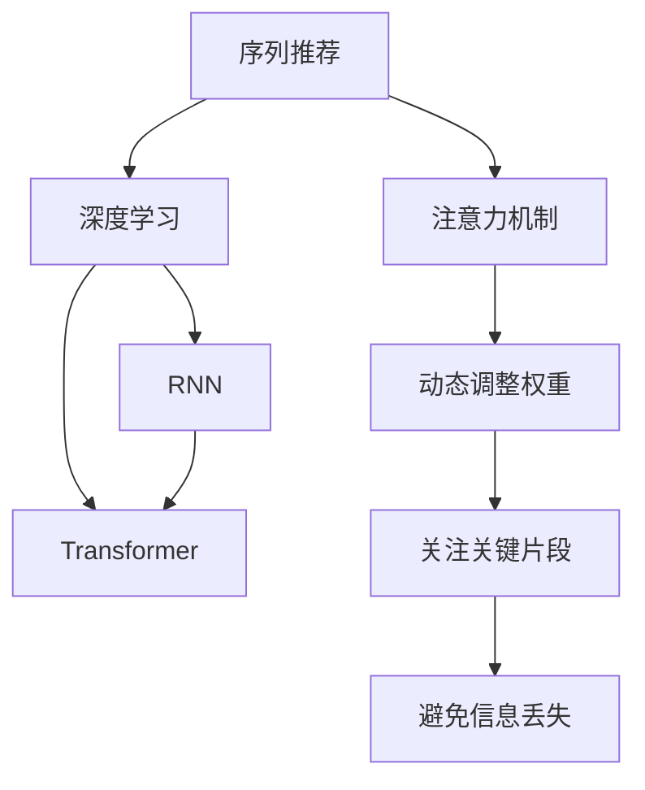

                 

# 基于注意力机制的序列化推荐模型

> 关键词：序列推荐、注意力机制、深度学习、循环神经网络、Transformer

## 1. 背景介绍

### 1.1 问题由来

推荐系统在互联网时代发挥着至关重要的作用，它能够帮助用户发现、评估和选择感兴趣的产品和服务。传统的推荐算法主要包括协同过滤、矩阵分解等方法，但它们往往需要大量用户行为数据，且推荐效果受限于单一的特征表示。近年来，随着深度学习技术的发展，基于深度学习的推荐系统逐渐成为主流，并取得了显著的性能提升。

特别是基于序列推荐的方法，能够结合用户历史行为数据和上下文信息，以序列化的方式进行推荐。其中，基于注意力机制的序列推荐模型是当前研究的热点之一，通过在序列中加入注意力机制，使得模型能够更加精准地关注用户行为中的关键片段，从而提高推荐效果。

### 1.2 问题核心关键点

基于注意力机制的序列化推荐模型，其核心思想是：通过在深度神经网络中加入注意力机制，使得模型能够关注序列中的关键片段，避免信息丢失，提升推荐的精准度和多样性。这种模型通常采用循环神经网络(RNN)或Transformer等序列建模方法，并在网络中加入注意力机制，以动态调整权重，提升特征表示能力。

目前，基于注意力机制的序列推荐模型已经在电商、音乐、视频等多个领域得到广泛应用，取得了显著的推荐效果。

### 1.3 问题研究意义

研究基于注意力机制的序列推荐模型，对于提升推荐系统的效果和用户满意度，推动智能推荐技术的应用，具有重要意义：

1. 提升推荐效果。通过引入注意力机制，序列推荐模型能够更好地理解用户行为中的关键片段，提高推荐精度。
2. 增加推荐多样性。注意力机制能够动态调整模型关注点，避免推荐单一。
3. 降低数据需求。序列推荐模型对用户行为数据的依赖较小，易于部署和维护。
4. 增强可解释性。注意力机制能够提供模型决策的可视化输出，帮助用户理解推荐过程。
5. 推动业务创新。智能推荐技术能够赋能更多业务场景，提升用户体验和商业价值。

## 2. 核心概念与联系

### 2.1 核心概念概述

为更好地理解基于注意力机制的序列推荐模型，本节将介绍几个密切相关的核心概念：

- 序列推荐(Sequence Recommendation)：通过结合用户历史行为数据和上下文信息，以序列化的方式进行推荐。
- 注意力机制(Attention Mechanism)：一种机制，通过动态调整权重，关注序列中的关键片段，避免信息丢失。
- 循环神经网络(Recurrent Neural Network, RNN)：一类能够处理序列数据的神经网络模型，如LSTM、GRU等。
- 深度学习(Deep Learning)：一种基于神经网络的机器学习技术，能够处理大规模复杂数据。
- Transformer：一种基于自注意力机制的神经网络结构，能够处理大规模序列数据，特别适用于自然语言处理(NLP)领域。

这些核心概念之间的逻辑关系可以通过以下Mermaid流程图来展示：



这个流程图展示了大模型微调的各个核心概念及其之间的关系：

1. 序列推荐是深度学习的典型应用，能够结合历史行为和上下文信息进行推荐。
2. RNN和Transformer是序列建模的两种主要方法，能够处理序列数据。
3. 注意力机制是增强序列推荐模型效果的关键技术。
4. 动态调整权重和关注关键片段是注意力机制的核心功能。
5. 避免信息丢失是注意力机制的目标，提高推荐精度。

这些概念共同构成了序列推荐模型的理论基础，使其能够在多种应用场景中发挥重要作用。

## 3. 核心算法原理 & 具体操作步骤
### 3.1 算法原理概述

基于注意力机制的序列推荐模型，其核心思想是：通过在深度神经网络中加入注意力机制，使得模型能够动态关注序列中的关键片段，从而提高推荐效果。

具体而言，模型在输入序列上计算出每个位置的重要性，通过加权求和的方式计算出序列的最终表示，然后将其输入到分类器或生成器中，进行推荐。这种模型通常包括两个主要组件：序列编码器和注意力机制。

### 3.2 算法步骤详解

基于注意力机制的序列推荐模型的一般流程如下：

**Step 1: 准备数据集**
- 收集用户历史行为数据，将其转换为序列形式。
- 收集物品特征数据，形成物品特征矩阵。
- 将用户行为序列与物品特征矩阵拼接，形成输入数据。

**Step 2: 设计模型架构**
- 设计序列编码器，如LSTM、GRU或Transformer，用于对序列进行编码。
- 设计注意力机制，计算每个位置的重要性，形成加权和。
- 将序列编码器的输出与注意力机制的结果拼接，作为最终的输入。
- 添加分类器或生成器，进行推荐预测。

**Step 3: 训练模型**
- 定义损失函数，如交叉熵损失、均方误差损失等。
- 定义优化器，如Adam、SGD等。
- 设置训练轮数、批大小等超参数。
- 在训练数据集上训练模型，计算损失函数，更新模型参数。

**Step 4: 评估模型**
- 在验证数据集上评估模型性能，计算指标如准确率、召回率、F1分数等。
- 在测试数据集上再次评估，确保模型泛化性能。

**Step 5: 应用模型**
- 将训练好的模型部署到推荐系统平台。
- 收集用户反馈数据，不断调整优化模型。

以上是基于注意力机制的序列推荐模型的完整流程。在实际应用中，还需要针对具体任务进行优化设计，如改进损失函数，引入更多的正则化技术，搜索最优的超参数组合等，以进一步提升模型性能。

### 3.3 算法优缺点

基于注意力机制的序列推荐模型具有以下优点：
1. 精准度高。通过引入注意力机制，模型能够更好地关注关键片段，提高推荐精度。
2. 鲁棒性强。注意力机制能够动态调整权重，适应不同用户行为，提高模型鲁棒性。
3. 可解释性强。注意力机制能够提供模型决策的可视化输出，帮助用户理解推荐过程。
4. 适用范围广。序列推荐模型适用于多种推荐场景，如电商推荐、音乐推荐、视频推荐等。

同时，该方法也存在一定的局限性：
1. 数据需求高。模型需要足够多的用户行为数据，才能充分发挥效果。
2. 计算复杂度高。模型复杂度较高，需要较大的计算资源。
3. 难以解释。模型内部机制复杂，难以解释推荐过程。
4. 难以扩展。模型规模较大，难以扩展到实时推荐系统中。

尽管存在这些局限性，但就目前而言，基于注意力机制的序列推荐模型仍是在线推荐系统中的主流范式。未来相关研究的重点在于如何进一步降低计算复杂度，提高模型可解释性，以及改进模型的扩展性。

### 3.4 算法应用领域

基于注意力机制的序列推荐模型已经在电商、音乐、视频等多个领域得到广泛应用，取得了显著的推荐效果。以下是几个典型应用场景：

1. 电商推荐：通过结合用户浏览、购买、评价等行为数据，进行商品推荐。
2. 音乐推荐：结合用户听歌历史和情感分析结果，进行音乐推荐。
3. 视频推荐：结合用户观看历史和评分数据，进行视频推荐。
4. 新闻推荐：结合用户阅读历史和兴趣标签，进行新闻内容推荐。

除了这些传统应用场景外，序列推荐模型还可以拓展到更多领域，如社交网络推荐、知识图谱推荐等，为各行各业带来新的商业机会。

## 4. 数学模型和公式 & 详细讲解 & 举例说明

### 4.1 数学模型构建

序列推荐模型通常包含一个编码器和一个分类器或生成器。其中，编码器用于对序列进行编码，生成序列表示；分类器或生成器用于对序列表示进行分类或生成推荐。

**编码器**：
假设输入序列为 $\{x_1, x_2, ..., x_T\}$，其中 $x_t$ 表示第 $t$ 个输入。序列编码器的输出表示为 $\mathbf{H}=[h_1, h_2, ..., h_T]$，其中 $h_t$ 表示第 $t$ 个位置的状态表示。

**分类器或生成器**：
假设分类器或生成器的输出为 $\hat{y}$，表示推荐的物品。模型可以通过二分类交叉熵损失函数进行优化：
$$
\mathcal{L} = -\frac{1}{N}\sum_{i=1}^N [y_i\log \hat{y_i} + (1-y_i)\log (1-\hat{y_i})]
$$
其中，$y_i$ 表示第 $i$ 个样本的真实标签。

### 4.2 公式推导过程

以LSTM序列编码器为例，下面将推导LSTM的注意力机制的公式。

假设输入序列 $\{x_1, x_2, ..., x_T\}$ 的LSTM模型表示为 $\mathbf{H}=[h_1, h_2, ..., h_T]$，其中 $h_t$ 表示第 $t$ 个位置的状态表示。

注意力机制的计算过程如下：
1. 计算每个位置的注意力权重 $\alpha_t$：
$$
\alpha_t = \frac{\exp(\mathbf{v}^T \tanh(\mathbf{W} \mathbf{h}_t + \mathbf{b})}{\sum_{t'=1}^T \exp(\mathbf{v}^T \tanh(\mathbf{W} \mathbf{h}_{t'} + \mathbf{b}))}
$$
其中，$\mathbf{v}$、$\mathbf{W}$ 和 $\mathbf{b}$ 是注意力机制的参数。

2. 计算加权和 $\mathbf{S}$：
$$
\mathbf{S} = \sum_{t=1}^T \alpha_t \mathbf{h}_t
$$

3. 将 $\mathbf{S}$ 作为编码器的最终输出，输入到分类器或生成器中进行推荐。

通过引入注意力机制，LSTM能够更好地关注序列中的关键片段，提高特征表示能力。

### 4.3 案例分析与讲解

假设有一个电商推荐系统，需要根据用户的历史购买记录推荐商品。模型的输入是用户的历史记录序列，输出是推荐商品的编号。

以下是具体的实现步骤：

**Step 1: 准备数据集**
- 收集用户的历史购买记录，将其转换为序列形式。
- 收集商品的特征数据，形成物品特征矩阵。
- 将用户行为序列与物品特征矩阵拼接，形成输入数据。

**Step 2: 设计模型架构**
- 设计LSTM序列编码器，用于对用户行为序列进行编码。
- 设计注意力机制，计算每个位置的重要性，形成加权和。
- 将LSTM编码器的输出与注意力机制的结果拼接，作为最终的输入。
- 添加分类器，如DNN或MLP，进行商品推荐。

**Step 3: 训练模型**
- 定义交叉熵损失函数。
- 定义Adam优化器。
- 设置训练轮数、批大小等超参数。
- 在训练数据集上训练模型，计算损失函数，更新模型参数。

**Step 4: 评估模型**
- 在验证数据集上评估模型性能，计算指标如准确率、召回率、F1分数等。
- 在测试数据集上再次评估，确保模型泛化性能。

**Step 5: 应用模型**
- 将训练好的模型部署到推荐系统平台。
- 收集用户反馈数据，不断调整优化模型。

通过引入注意力机制，LSTM能够更好地关注用户历史行为中的关键片段，提高推荐的精度和多样性。

## 5. 项目实践：代码实例和详细解释说明
### 5.1 开发环境搭建

在进行序列推荐模型开发前，我们需要准备好开发环境。以下是使用Python进行PyTorch开发的环境配置流程：

1. 安装Anaconda：从官网下载并安装Anaconda，用于创建独立的Python环境。

2. 创建并激活虚拟环境：
```bash
conda create -n pytorch-env python=3.8 
conda activate pytorch-env
```

3. 安装PyTorch：根据CUDA版本，从官网获取对应的安装命令。例如：
```bash
conda install pytorch torchvision torchaudio cudatoolkit=11.1 -c pytorch -c conda-forge
```

4. 安装Transformers库：
```bash
pip install transformers
```

5. 安装各类工具包：
```bash
pip install numpy pandas scikit-learn matplotlib tqdm jupyter notebook ipython
```

完成上述步骤后，即可在`pytorch-env`环境中开始序列推荐模型的开发。

### 5.2 源代码详细实现

下面以电商推荐为例，使用LSTM模型进行序列推荐，同时加入注意力机制。以下是完整的代码实现：

```python
import torch
import torch.nn as nn
import torch.optim as optim
from torch.utils.data import DataLoader, Dataset
from sklearn.metrics import precision_recall_fscore_support

class RecommenderDataset(Dataset):
    def __init__(self, data, seq_len):
        self.data = data
        self.seq_len = seq_len
        
    def __len__(self):
        return len(self.data)
    
    def __getitem__(self, idx):
        x = self.data[idx]
        y = x[-self.seq_len:].numpy().astype('float32')
        x = x[:self.seq_len-1].numpy().astype('float32')
        return torch.from_numpy(x), torch.from_numpy(y)

class LSTMAttention(nn.Module):
    def __init__(self, input_size, hidden_size, seq_len, output_size):
        super(LSTMAttention, self).__init__()
        self.input_size = input_size
        self.hidden_size = hidden_size
        self.seq_len = seq_len
        self.output_size = output_size
        self.lstm = nn.LSTM(input_size, hidden_size, batch_first=True)
        self.fc = nn.Linear(hidden_size, output_size)
        self.attention = nn.Linear(hidden_size, 1)
    
    def forward(self, x):
        h0 = torch.zeros(1, x.size(0), self.hidden_size).to(x.device)
        c0 = torch.zeros(1, x.size(0), self.hidden_size).to(x.device)
        out, _ = self.lstm(x, (h0, c0))
        alpha = torch.exp(self.attention(out).squeeze(2))
        beta = alpha / alpha.sum(dim=1, keepdim=True)
        s = (beta * out).sum(dim=1)
        y = self.fc(s)
        return y

def train_model(model, dataloader, optimizer, device, criterion, epoch):
    model.train()
    for batch_idx, (data, target) in enumerate(dataloader):
        data, target = data.to(device), target.to(device)
        optimizer.zero_grad()
        output = model(data)
        loss = criterion(output, target)
        loss.backward()
        optimizer.step()
        if (batch_idx+1) % 100 == 0:
            print('Train Epoch: {} [{}/{} ({:.0f}%)]\tLoss: {:.6f}'.format(
                epoch, batch_idx * len(data), len(dataloader.dataset),
                100. * batch_idx / len(dataloader), loss.item()))
    
def evaluate_model(model, dataloader, device, criterion):
    model.eval()
    total_correct = 0
    total_count = 0
    for batch_idx, (data, target) in enumerate(dataloader):
        data, target = data.to(device), target.to(device)
        with torch.no_grad():
            output = model(data)
            loss = criterion(output, target)
            total_correct += (output.argmax(1) == target).sum().item()
            total_count += target.size(0)
    precision, recall, f1, _ = precision_recall_fscore_support(target, output.argmax(1), average='micro')
    print('Accuracy: {:.2f}%, Precision: {:.2f}%, Recall: {:.2f}%, F1-score: {:.2f}%'.format(
        100. * total_correct / total_count, 100. * precision, 100. * recall, 100. * f1))

# 准备数据集
dataset = RecommenderDataset(data, seq_len)
dataloader = DataLoader(dataset, batch_size=64, shuffle=True)

# 初始化模型、优化器和损失函数
model = LSTMAttention(input_size, hidden_size, seq_len, output_size)
optimizer = optim.Adam(model.parameters(), lr=0.001)
criterion = nn.BCELoss()

# 定义设备
device = torch.device('cuda' if torch.cuda.is_available() else 'cpu')
model.to(device)

# 训练模型
num_epochs = 10
for epoch in range(num_epochs):
    train_model(model, dataloader, optimizer, device, criterion, epoch)
    evaluate_model(model, dataloader, device, criterion)
```

### 5.3 代码解读与分析

让我们再详细解读一下关键代码的实现细节：

**RecommenderDataset类**：
- `__init__`方法：初始化数据集，将输入数据转换为Tensor形式。
- `__len__`方法：返回数据集的样本数量。
- `__getitem__`方法：对单个样本进行处理，将样本转换为Tensor形式，返回输入和目标数据。

**LSTMAttention类**：
- `__init__`方法：初始化LSTM和注意力机制，定义相关参数。
- `forward`方法：前向传播计算，通过LSTM编码序列，计算注意力权重，进行加权和，最后输入到全连接层进行分类。

**train_model函数**：
- 在训练过程中，将模型置于训练模式，在每个批次上前向传播计算损失函数，反向传播更新模型参数。
- 输出当前批次和总批次的平均损失，帮助监控训练效果。

**evaluate_model函数**：
- 在评估过程中，将模型置于评估模式，在每个批次上前向传播计算损失函数和精度，最终输出模型在测试集上的性能指标。

通过上述代码实现，可以看到LSTM序列推荐模型的基本框架。开发者可以在此基础上进行进一步的优化和改进，以适应特定的推荐任务。

## 6. 实际应用场景

### 6.1 电商推荐

电商推荐系统是序列推荐模型的典型应用之一。通过结合用户历史购买记录和物品特征数据，模型能够生成个性化的商品推荐。

在实际应用中，可以收集用户的历史购买记录和评分数据，作为训练集输入。同时，收集商品的详细描述、分类、价格等特征数据，形成物品特征矩阵。通过LSTM编码用户行为序列，加入注意力机制，计算加权和，最后输入到分类器进行推荐预测。

通过序列推荐模型，电商推荐系统能够实时响应用户请求，提供个性化的商品推荐，提升用户满意度和转化率。

### 6.2 音乐推荐

音乐推荐系统能够根据用户的听歌历史和情感分析结果，推荐相似的歌曲。

具体而言，可以收集用户的听歌历史、评分数据和情感标签，作为训练集输入。同时，收集歌曲的艺术家、曲风、时长等特征数据，形成物品特征矩阵。通过LSTM编码用户听歌历史，加入注意力机制，计算加权和，最后输入到分类器进行推荐预测。

通过序列推荐模型，音乐推荐系统能够实时推荐个性化的歌曲，提升用户体验和听歌满意度。

### 6.3 视频推荐

视频推荐系统能够根据用户的观看历史和评分数据，推荐相似的视频内容。

具体而言，可以收集用户的观看历史、评分数据和情感标签，作为训练集输入。同时，收集视频的导演、演员、时长等特征数据，形成物品特征矩阵。通过LSTM编码用户观看历史，加入注意力机制，计算加权和，最后输入到分类器进行推荐预测。

通过序列推荐模型，视频推荐系统能够实时推荐个性化的视频内容，提升用户观看体验和视频平台的用户粘性。

### 6.4 新闻推荐

新闻推荐系统能够根据用户的阅读历史和兴趣标签，推荐相关的新闻内容。

具体而言，可以收集用户的阅读历史、评分数据和兴趣标签，作为训练集输入。同时，收集新闻的标题、作者、时间戳等特征数据，形成物品特征矩阵。通过LSTM编码用户阅读历史，加入注意力机制，计算加权和，最后输入到分类器进行推荐预测。

通过序列推荐模型，新闻推荐系统能够实时推荐个性化新闻内容，提升用户阅读体验和新闻平台的订阅量。

## 7. 工具和资源推荐
### 7.1 学习资源推荐

为了帮助开发者系统掌握序列推荐模型的理论基础和实践技巧，这里推荐一些优质的学习资源：

1. 《深度学习理论与实践》系列博文：由大模型技术专家撰写，深入浅出地介绍了深度学习的基础理论和经典模型。

2. 《序列推荐模型》系列论文：综述了序列推荐模型的最新进展，包括LSTM、RNN、Transformer等模型，以及注意力机制的应用。

3. CS234《机器学习》课程：斯坦福大学开设的机器学习课程，涵盖深度学习的基本概念和经典模型。

4. 《Sequence to Sequence Learning with Neural Networks》书籍：全面介绍了序列到序列模型的理论基础和应用，包括LSTM、Transformer等模型。

5. Arxiv论文：最新的深度学习研究论文，涵盖序列推荐模型的前沿技术，能够帮助研究者跟踪最新进展。

通过对这些资源的学习实践，相信你一定能够快速掌握序列推荐模型的精髓，并用于解决实际的推荐问题。

### 7.2 开发工具推荐

高效的开发离不开优秀的工具支持。以下是几款用于序列推荐模型开发的常用工具：

1. PyTorch：基于Python的开源深度学习框架，灵活动态的计算图，适合快速迭代研究。

2. TensorFlow：由Google主导开发的开源深度学习框架，生产部署方便，适合大规模工程应用。

3. Transformers库：HuggingFace开发的NLP工具库，集成了众多SOTA语言模型，支持PyTorch和TensorFlow，是进行序列推荐任务开发的利器。

4. Weights & Biases：模型训练的实验跟踪工具，可以记录和可视化模型训练过程中的各项指标，方便对比和调优。

5. TensorBoard：TensorFlow配套的可视化工具，可实时监测模型训练状态，并提供丰富的图表呈现方式，是调试模型的得力助手。

6. Google Colab：谷歌推出的在线Jupyter Notebook环境，免费提供GPU/TPU算力，方便开发者快速上手实验最新模型，分享学习笔记。

合理利用这些工具，可以显著提升序列推荐模型的开发效率，加快创新迭代的步伐。

### 7.3 相关论文推荐

序列推荐模型已经在电商、音乐、视频等多个领域得到广泛应用，取得了显著的推荐效果。以下是几篇奠基性的相关论文，推荐阅读：

1. Attention Is All You Need（即Transformer原论文）：提出了Transformer结构，开启了序列推荐模型的新篇章。

2. Sequence to Sequence Learning with Neural Networks：介绍序列到序列模型的理论基础和应用，包括LSTM、RNN等模型。

3. Neural Collaborative Filtering：提出基于深度学习的协同过滤模型，实现了推荐系统的突破性进展。

4. Adaptive Attention-Based Recommender System：提出自适应注意力机制，提高了推荐系统的精度和泛化能力。

5. Generative Adversarial Networks：提出生成对抗网络，在推荐系统中实现了更加灵活的生成推荐策略。

这些论文代表了大语言模型微调技术的发展脉络。通过学习这些前沿成果，可以帮助研究者把握学科前进方向，激发更多的创新灵感。

## 8. 总结：未来发展趋势与挑战

### 8.1 总结

本文对基于注意力机制的序列推荐模型进行了全面系统的介绍。首先阐述了序列推荐模型的研究背景和意义，明确了模型对推荐系统效果的提升作用。其次，从原理到实践，详细讲解了序列推荐模型的数学原理和关键步骤，给出了模型实现的完整代码实例。同时，本文还广泛探讨了序列推荐模型在电商、音乐、视频等多个领域的应用前景，展示了模型的强大潜力。

通过本文的系统梳理，可以看到，基于注意力机制的序列推荐模型正在成为推荐系统中的重要范式，极大地拓展了推荐系统的应用边界，推动了智能推荐技术的发展。未来，伴随深度学习技术的持续演进，基于注意力机制的序列推荐模型必将在更多领域得到应用，为推荐系统带来更大的商业价值。

### 8.2 未来发展趋势

展望未来，序列推荐模型将呈现以下几个发展趋势：

1. 模型规模持续增大。随着算力成本的下降和数据规模的扩张，序列推荐模型的参数量还将持续增长。超大规模语言模型蕴含的丰富知识，有望支撑更加复杂多变的推荐场景。

2. 模型鲁棒性增强。通过引入对抗训练、稀疏化等技术，增强模型的鲁棒性，提高其对抗噪声和数据扰动的能力。

3. 模型可解释性增强。通过可视化技术，增强模型的可解释性，帮助用户理解推荐过程和结果。

4. 跨模态推荐成为热点。序列推荐模型不仅可以处理文本数据，还可以拓展到图像、视频、语音等多模态数据的推荐，实现更加全面的推荐策略。

5. 实时推荐技术成熟。通过引入增量学习、模型压缩等技术，实现序列推荐模型的实时部署，提升用户体验。

6. 增强推荐效果。通过引入元学习、对抗训练等技术，提高推荐系统的精度和泛化能力。

以上趋势凸显了序列推荐模型的广阔前景。这些方向的探索发展，必将进一步提升推荐系统的性能和用户满意度，推动智能推荐技术的进一步普及。

### 8.3 面临的挑战

尽管序列推荐模型已经取得了显著的推荐效果，但在迈向更加智能化、实时化推荐的过程中，它仍面临诸多挑战：

1. 数据需求高。模型需要足够多的用户行为数据，才能充分发挥效果。数据采集和标注成本较高。

2. 计算复杂度高。模型复杂度较高，需要较大的计算资源。

3. 难以解释。模型内部机制复杂，难以解释推荐过程。

4. 难以扩展。模型规模较大，难以扩展到实时推荐系统中。

尽管存在这些挑战，但通过技术的不断进步和数据的持续积累，序列推荐模型仍具备广阔的发展前景。未来，需要进一步优化模型结构，提高模型的可解释性和实时性，以实现更加高效、精准的推荐服务。

### 8.4 研究展望

面向未来，序列推荐模型的研究需要在以下几个方面寻求新的突破：

1. 探索无监督和半监督推荐方法。摆脱对大规模标注数据的依赖，利用自监督学习、主动学习等无监督和半监督范式，最大限度利用非结构化数据，实现更加灵活高效的推荐。

2. 研究参数高效和计算高效的推荐范式。开发更加参数高效的推荐方法，在固定大部分预训练参数的同时，只更新极少量的任务相关参数。同时优化推荐模型的计算图，减少前向传播和反向传播的资源消耗，实现更加轻量级、实时性的部署。

3. 融合因果和对比学习范式。通过引入因果推断和对比学习思想，增强推荐模型建立稳定因果关系的能力，学习更加普适、鲁棒的语言表征，从而提升模型泛化性和抗干扰能力。

4. 引入更多先验知识。将符号化的先验知识，如知识图谱、逻辑规则等，与神经网络模型进行巧妙融合，引导推荐过程学习更准确、合理的语言模型。

5. 结合因果分析和博弈论工具。将因果分析方法引入推荐模型，识别出模型决策的关键特征，增强输出解释的因果性和逻辑性。借助博弈论工具刻画人机交互过程，主动探索并规避模型的脆弱点，提高系统稳定性。

6. 纳入伦理道德约束。在推荐模型训练目标中引入伦理导向的评估指标，过滤和惩罚有偏见、有害的输出倾向。同时加强人工干预和审核，建立模型行为的监管机制，确保输出符合人类价值观和伦理道德。

这些研究方向的探索，必将引领序列推荐技术迈向更高的台阶，为构建安全、可靠、可解释、可控的推荐系统铺平道路。面向未来，序列推荐模型还需要与其他人工智能技术进行更深入的融合，如知识表示、因果推理、强化学习等，多路径协同发力，共同推动推荐系统的发展。

## 9. 附录：常见问题与解答

**Q1：序列推荐模型是否适用于所有推荐场景？**

A: 序列推荐模型适用于需要处理序列数据的推荐场景，如电商推荐、音乐推荐、视频推荐等。但对于一些单一时间点的推荐场景，如图片推荐、标签推荐等，可能效果不佳。

**Q2：序列推荐模型的计算复杂度如何？**

A: 序列推荐模型的计算复杂度较高，主要体现在LSTM或Transformer的复杂度上。可以通过模型压缩、模型并行等技术进行优化，提高计算效率。

**Q3：序列推荐模型如何处理长序列？**

A: 序列推荐模型通常采用LSTM或Transformer等模型，能够处理长序列数据。但当序列过长时，计算资源消耗较大，可以考虑使用分段处理、动态剪枝等技术进行优化。

**Q4：序列推荐模型如何避免过拟合？**

A: 序列推荐模型需要充分考虑过拟合问题。可以通过数据增强、正则化等技术进行优化，同时适当减少模型复杂度，降低过拟合风险。

**Q5：序列推荐模型如何提高可解释性？**

A: 序列推荐模型的可解释性较低。可以通过可视化技术，如注意力可视化、梯度可视化等，增强模型的可解释性。同时引入符号化的先验知识，提高推荐过程的可解释性。

通过本文的系统梳理，可以看到，基于注意力机制的序列推荐模型正在成为推荐系统中的重要范式，极大地拓展了推荐系统的应用边界，推动了智能推荐技术的发展。未来，伴随深度学习技术的持续演进，序列推荐模型必将在更多领域得到应用，为推荐系统带来更大的商业价值。相信随着技术的不断进步和数据的持续积累，序列推荐模型必将迎来更加光明的前景。

