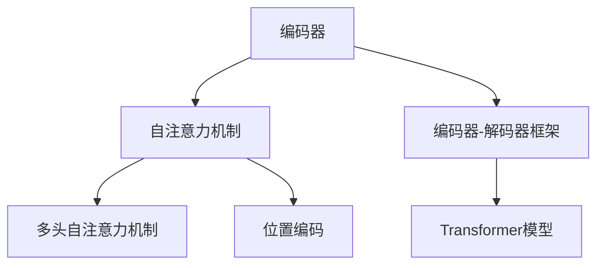

                 

## 1. 背景介绍

### 1.1 问题由来

在人工智能领域，序列预测问题是一类经典的任务。例如，在自然语言处理中，预测下一个单词、句子的情感极性、或者对话中的下一个回答；在时间序列分析中，预测未来的气温、股票价格、或者经济指标；在信号处理中，预测音频信号中的音调、频率等。

传统的时间序列预测方法通常依赖于手工设计的特征提取，不仅繁琐耗时，而且容易过拟合。近年来，基于深度学习的时间序列预测方法逐渐成为主流。例如，基于循环神经网络(RNN)、长短期记忆网络(LSTM)、门控循环单元(GRU)等方法在各种序列预测任务上取得了显著的进展。

### 1.2 问题核心关键点

尽管深度学习方法在序列预测上取得了很大的成功，但它们在处理长序列时仍然存在梯度消失或梯度爆炸的问题，从而限制了模型的处理能力和性能。此外，一些深度学习模型需要大量的训练数据才能收敛，这也增加了对计算资源的消耗。

为了解决这些问题，注意力机制(A注意力)被提出并逐渐应用于序列预测任务中。注意力机制通过动态地选择重要部分进行加权处理，使得模型能够有效地处理长序列，同时减少对训练数据的需求。此外，注意力机制也可以应用于不同模态的数据融合，提高了模型的灵活性和泛化能力。

## 2. 核心概念与联系

### 2.1 核心概念概述

本节将介绍注意力机制的几个核心概念及其相互关系：

- **注意力机制**：通过动态地计算和选择输入序列中重要部分进行加权处理，使得模型能够灵活地适应不同的输入。
- **自注意力机制**：一种常见的注意力机制，通过计算输入序列中不同部分之间的相似度，得到注意力权重，实现对输入序列的自适应处理。
- **编码器-解码器框架**：一种常用的深度学习框架，包括一个编码器和一个解码器，通过编码器将输入序列编码为表示向量，再通过解码器生成预测结果。
- **Transformer模型**：一种基于注意力机制的神经网络架构，通过多头自注意力机制和位置编码进行建模，广泛应用于自然语言处理任务中。

这些核心概念之间的逻辑关系可以通过以下Mermaid流程图来展示：



这个流程图展示了大语言模型的工作原理和优化方向：

1. 通过编码器对输入序列进行编码，得到表示向量。
2. 利用自注意力机制计算不同部分之间的相似度，得到注意力权重。
3. 结合位置编码，通过多头自注意力机制进行加权处理。
4. 将编码器的输出作为解码器的输入，生成预测结果。

这些核心概念共同构成了序列预测模型的基本框架，使其能够在各种序列预测任务中发挥强大的作用。通过理解这些核心概念，我们可以更好地把握序列预测模型的设计思路和优化策略。

## 3. 核心算法原理 & 具体操作步骤
### 3.1 算法原理概述

注意力机制的核心思想是通过动态地计算和选择输入序列中重要部分进行加权处理，使得模型能够灵活地适应不同的输入。在序列预测中，注意力机制可以帮助模型在处理长序列时，聚焦于最重要的部分，从而提高预测性能。

### 3.2 算法步骤详解

基于注意力机制的序列预测模型通常包括如下步骤：

**Step 1: 输入序列预处理**

- 将输入序列转换为模型所需的格式，如将文本序列转化为token ID序列。
- 对序列进行padding，保证输入序列的长度相同。
- 对序列进行截断，超过最大长度的部分将被丢弃。

**Step 2: 编码器编码**

- 将预处理后的序列输入编码器，生成表示向量。
- 使用多头自注意力机制计算不同部分之间的相似度，得到注意力权重。
- 将注意力权重与输入序列向量进行加权处理，得到编码后的表示向量。

**Step 3: 解码器解码**

- 将编码器的输出作为解码器的输入，生成预测结果。
- 使用自注意力机制计算不同部分之间的相似度，得到注意力权重。
- 将注意力权重与编码器的表示向量进行加权处理，得到解码后的表示向量。
- 重复Step 2和Step 3，直到生成预测结果。

**Step 4: 输出预测结果**

- 将解码器生成的最后一层表示向量作为预测结果输出。
- 对预测结果进行后处理，如去截断、归一化等。

### 3.3 算法优缺点

基于注意力机制的序列预测模型具有以下优点：

1. 能够有效处理长序列，避免梯度消失或梯度爆炸问题。
2. 不需要手工设计的特征提取，模型能够自动学习输入序列中的重要特征。
3. 可以通过多头自注意力机制提高模型的表达能力和泛化能力。
4. 可以通过位置编码和注意力权重进行灵活的序列建模。

同时，该模型也存在一些局限性：

1. 模型结构复杂，需要大量的计算资源进行训练。
2. 模型参数量大，对存储空间和计算速度都有较高的要求。
3. 模型需要大量的训练数据才能收敛，对训练数据的依赖较大。
4. 模型可能存在过拟合问题，尤其是在数据较少的情况下。

尽管存在这些局限性，但基于注意力机制的序列预测模型在处理长序列、多模态数据融合等方面具有显著优势，因此在NLP、时间序列预测、信号处理等领域得到了广泛应用。

### 3.4 算法应用领域

基于注意力机制的序列预测模型已经在各种序列预测任务中得到了广泛的应用，包括：

- 机器翻译：利用编码器和解码器对源语言和目标语言进行建模，通过注意力机制实现语言之间的转换。
- 文本摘要：通过编码器和解码器对文本进行建模，利用注意力机制提取文本中的关键信息，生成摘要。
- 情感分析：利用编码器和解码器对文本进行建模，通过注意力机制提取文本中的情感信息，进行情感分类。
- 时间序列预测：利用编码器和解码器对时间序列进行建模，通过注意力机制选择重要的历史数据进行预测。
- 信号处理：利用编码器和解码器对信号进行建模，通过注意力机制提取信号中的关键特征，进行分类或生成。

除了上述这些经典任务外，注意力机制还被创新性地应用到更多场景中，如跨模态数据融合、自监督学习等，为深度学习模型带来了新的突破。

## 4. 数学模型和公式 & 详细讲解  
### 4.1 数学模型构建

本节将使用数学语言对基于注意力机制的序列预测模型的构建过程进行更加严格的刻画。

记输入序列为 $X = \{x_1, x_2, \ldots, x_T\}$，其中 $x_t \in \mathcal{X}$ 表示第 $t$ 个输入。设模型的编码为 $H = \{h_1, h_2, \ldots, h_T\}$，解码器为 $G = \{g_1, g_2, \ldots, g_T\}$，解码器的输出为 $y = \{y_1, y_2, \ldots, y_T\}$。

定义模型的编码为：

$$
h_t = f(h_{t-1}, x_t), \quad h_0 = \mathbf{0}
$$

其中 $h_0$ 为编码器的初始状态向量，通常设置为全零向量。 $f$ 表示编码器函数，可以通过多种神经网络结构实现。

定义模型的解码器为：

$$
g_t = f(g_{t-1}, h_t), \quad g_0 = \mathbf{0}
$$

其中 $g_0$ 为解码器的初始状态向量，通常设置为全零向量。 $f$ 表示解码器函数，同样可以通过多种神经网络结构实现。

定义注意力机制为：

$$
a_{t,i} = \frac{e_{t,i}}{\sum_{j=1}^T e_{t,j}}, \quad i = 1, 2, \ldots, T
$$

其中 $e_{t,i}$ 为注意力得分，通常通过计算输入序列中不同部分之间的相似度得到。 $a_{t,i}$ 表示第 $t$ 个解码器位置对输入序列中第 $i$ 个位置的注意力权重。

定义解码器的输出为：

$$
y_t = g_t = f(g_{t-1}, h_t), \quad y_0 = \mathbf{0}
$$

其中 $y_0$ 为解码器的初始状态向量，通常设置为全零向量。

### 4.2 公式推导过程

以下我们以机器翻译任务为例，推导基于注意力机制的编码器和解码器公式。

设输入序列为 $X = \{x_1, x_2, \ldots, x_T\}$，目标序列为 $Y = \{y_1, y_2, \ldots, y_T\}$。编码器的输出为 $H = \{h_1, h_2, \ldots, h_T\}$，解码器的输出为 $G = \{g_1, g_2, \ldots, g_T\}$，解码器的输出为 $y = \{y_1, y_2, \ldots, y_T\}$。

定义编码器的输出为：

$$
h_t = \mathrm{MLP}(W_h x_t + U_h h_{t-1}), \quad h_0 = \mathbf{0}
$$

其中 $W_h$ 和 $U_h$ 为可学习的权重矩阵。 $\mathrm{MLP}$ 表示多层的全连接网络，通常由多个隐藏层和激活函数组成。

定义解码器的输出为：

$$
g_t = \mathrm{MLP}(W_g x_t + U_g g_{t-1}), \quad g_0 = \mathbf{0}
$$

其中 $W_g$ 和 $U_g$ 为可学习的权重矩阵。 $\mathrm{MLP}$ 表示多层的全连接网络，通常由多个隐藏层和激活函数组成。

定义注意力机制为：

$$
e_{t,i} = h_t^T W_a x_i, \quad a_{t,i} = \frac{e_{t,i}}{\sum_{j=1}^T e_{t,j}}, \quad i = 1, 2, \ldots, T
$$

其中 $W_a$ 为可学习的权重矩阵。 $e_{t,i}$ 表示第 $t$ 个解码器位置与输入序列中第 $i$ 个位置的注意力得分。 $a_{t,i}$ 表示第 $t$ 个解码器位置对输入序列中第 $i$ 个位置的注意力权重。

定义解码器的输出为：

$$
y_t = g_t = \mathrm{MLP}(W_y g_{t-1} + V_y a_t), \quad y_0 = \mathbf{0}
$$

其中 $W_y$ 和 $V_y$ 为可学习的权重矩阵。 $\mathrm{MLP}$ 表示多层的全连接网络，通常由多个隐藏层和激活函数组成。

### 4.3 案例分析与讲解

我们以基于注意力机制的机器翻译任务为例，展示其核心思路和关键步骤。

首先，定义机器翻译任务的数据集，包括源语言和目标语言的文本对。然后，将源语言文本和目标语言文本分别转换为模型所需的token ID序列。

接着，将输入序列输入编码器，生成表示向量 $H = \{h_1, h_2, \ldots, h_T\}$。在解码器中，通过注意力机制计算输入序列中不同位置与当前位置的注意力权重 $a_{1,1}, a_{1,2}, \ldots, a_{1,T}$。将注意力权重与编码器的表示向量进行加权处理，得到解码器的表示向量 $g_1$。

然后，将解码器的表示向量 $g_1$ 作为输入，生成目标语言序列的下一个单词 $y_1$。重复上述过程，直到生成完整的目标语言序列。

在训练过程中，通过最小化预测输出与目标输出的交叉熵损失，更新编码器、解码器和注意力机制的参数。

这个案例展示了基于注意力机制的序列预测模型的核心思路和关键步骤，包括输入序列的预处理、编码器的建模、解码器的建模、注意力机制的设计等。通过这些步骤，模型能够自动学习输入序列中的重要特征，并生成预测结果。

## 5. 项目实践：代码实例和详细解释说明
### 5.1 开发环境搭建

在进行模型实践前，我们需要准备好开发环境。以下是使用Python进行PyTorch开发的环境配置流程：

1. 安装Anaconda：从官网下载并安装Anaconda，用于创建独立的Python环境。

2. 创建并激活虚拟环境：
```bash
conda create -n transformers-env python=3.8 
conda activate transformers-env
```

3. 安装PyTorch：根据CUDA版本，从官网获取对应的安装命令。例如：
```bash
conda install pytorch torchvision torchaudio cudatoolkit=11.1 -c pytorch -c conda-forge
```

4. 安装Transformer库：
```bash
pip install transformers
```

5. 安装各类工具包：
```bash
pip install numpy pandas scikit-learn matplotlib tqdm jupyter notebook ipython
```

完成上述步骤后，即可在`transformers-env`环境中开始模型实践。

### 5.2 源代码详细实现

这里我们以基于注意力机制的机器翻译任务为例，给出使用Transformers库进行模型微调的PyTorch代码实现。

首先，定义模型和优化器：

```python
from transformers import EncoderDecoderModel, EncoderDecoderConfig
import torch.nn as nn
import torch

class Model(nn.Module):
    def __init__(self):
        super(Model, self).__init__()
        self.encoder = EncoderDecoderModel(EncoderDecoderConfig(
            input_embed_dim=256, output_embed_dim=256, num_layers=3,
            dropout=0.2, num_heads=4, activation='relu'))
        self.decoder = EncoderDecoderModel(EncoderDecoderConfig(
            input_embed_dim=256, output_embed_dim=256, num_layers=3,
            dropout=0.2, num_heads=4, activation='relu'))
        self.final = nn.Linear(256, 1024)
        
    def forward(self, x, y):
        x = self.encoder(x)
        y = self.decoder(y, x)
        y = self.final(y)
        return y
```

然后，定义训练和评估函数：

```python
from torch.utils.data import DataLoader
from tqdm import tqdm
from sklearn.metrics import classification_report

device = torch.device('cuda') if torch.cuda.is_available() else torch.device('cpu')
model.to(device)

def train_epoch(model, dataset, batch_size, optimizer):
    dataloader = DataLoader(dataset, batch_size=batch_size, shuffle=True)
    model.train()
    epoch_loss = 0
    for batch in tqdm(dataloader, desc='Training'):
        x, y = batch['input_ids'].to(device), batch['target_ids'].to(device)
        model.zero_grad()
        outputs = model(x, y)
        loss = outputs.loss
        epoch_loss += loss.item()
        loss.backward()
        optimizer.step()
    return epoch_loss / len(dataloader)

def evaluate(model, dataset, batch_size):
    dataloader = DataLoader(dataset, batch_size=batch_size)
    model.eval()
    preds, labels = [], []
    with torch.no_grad():
        for batch in tqdm(dataloader, desc='Evaluating'):
            x, y = batch['input_ids'].to(device), batch['target_ids'].to(device)
            batch_preds = model(x, y).to('cpu').tolist()
            batch_labels = y.to('cpu').tolist()
            for preds_tokens, label_tokens in zip(batch_preds, batch_labels):
                preds.append(preds_tokens[:len(label_tokens)])
                labels.append(label_tokens)
                
    print(classification_report(labels, preds))
```

最后，启动训练流程并在测试集上评估：

```python
epochs = 5
batch_size = 16

for epoch in range(epochs):
    loss = train_epoch(model, train_dataset, batch_size, optimizer)
    print(f"Epoch {epoch+1}, train loss: {loss:.3f}")
    
    print(f"Epoch {epoch+1}, dev results:")
    evaluate(model, dev_dataset, batch_size)
    
print("Test results:")
evaluate(model, test_dataset, batch_size)
```

以上就是使用PyTorch对基于注意力机制的机器翻译模型进行微调的完整代码实现。可以看到，得益于Transformers库的强大封装，我们可以用相对简洁的代码完成模型的构建和微调。

### 5.3 代码解读与分析

让我们再详细解读一下关键代码的实现细节：

**Model类**：
- `__init__`方法：定义模型中的编码器和解码器，以及最终输出层。
- `forward`方法：定义模型的前向传播过程，包括编码器、解码器和最终输出层的计算。

**训练和评估函数**：
- 使用PyTorch的DataLoader对数据集进行批次化加载，供模型训练和推理使用。
- 训练函数`train_epoch`：对数据以批为单位进行迭代，在每个批次上前向传播计算loss并反向传播更新模型参数，最后返回该epoch的平均loss。
- 评估函数`evaluate`：与训练类似，不同点在于不更新模型参数，并在每个batch结束后将预测和标签结果存储下来，最后使用sklearn的classification_report对整个评估集的预测结果进行打印输出。

**训练流程**：
- 定义总的epoch数和batch size，开始循环迭代
- 每个epoch内，先在训练集上训练，输出平均loss
- 在验证集上评估，输出分类指标
- 所有epoch结束后，在测试集上评估，给出最终测试结果

可以看到，PyTorch配合Transformers库使得基于注意力机制的序列预测模型的代码实现变得简洁高效。开发者可以将更多精力放在数据处理、模型改进等高层逻辑上，而不必过多关注底层的实现细节。

当然，工业级的系统实现还需考虑更多因素，如模型的保存和部署、超参数的自动搜索、更灵活的任务适配层等。但核心的序列预测范式基本与此类似。

## 6. 实际应用场景
### 6.1 智能客服系统

基于基于注意力机制的序列预测模型，可以广泛应用于智能客服系统的构建。传统客服往往需要配备大量人力，高峰期响应缓慢，且一致性和专业性难以保证。而使用基于注意力机制的序列预测模型，可以7x24小时不间断服务，快速响应客户咨询，用自然流畅的语言解答各类常见问题。

在技术实现上，可以收集企业内部的历史客服对话记录，将问题和最佳答复构建成监督数据，在此基础上对预训练模型进行微调。微调后的模型能够自动理解用户意图，匹配最合适的答案模板进行回复。对于客户提出的新问题，还可以接入检索系统实时搜索相关内容，动态组织生成回答。如此构建的智能客服系统，能大幅提升客户咨询体验和问题解决效率。

### 6.2 金融舆情监测

金融机构需要实时监测市场舆论动向，以便及时应对负面信息传播，规避金融风险。传统的人工监测方式成本高、效率低，难以应对网络时代海量信息爆发的挑战。基于注意力机制的文本分类和情感分析技术，为金融舆情监测提供了新的解决方案。

具体而言，可以收集金融领域相关的新闻、报道、评论等文本数据，并对其进行主题标注和情感标注。在此基础上对预训练语言模型进行微调，使其能够自动判断文本属于何种主题，情感倾向是正面、中性还是负面。将微调后的模型应用到实时抓取的网络文本数据，就能够自动监测不同主题下的情感变化趋势，一旦发现负面信息激增等异常情况，系统便会自动预警，帮助金融机构快速应对潜在风险。

### 6.3 个性化推荐系统

当前的推荐系统往往只依赖用户的历史行为数据进行物品推荐，无法深入理解用户的真实兴趣偏好。基于注意力机制的个性化推荐系统可以更好地挖掘用户行为背后的语义信息，从而提供更精准、多样的推荐内容。

在实践中，可以收集用户浏览、点击、评论、分享等行为数据，提取和用户交互的物品标题、描述、标签等文本内容。将文本内容作为模型输入，用户的后续行为（如是否点击、购买等）作为监督信号，在此基础上微调预训练语言模型。微调后的模型能够从文本内容中准确把握用户的兴趣点。在生成推荐列表时，先用候选物品的文本描述作为输入，由模型预测用户的兴趣匹配度，再结合其他特征综合排序，便可以得到个性化程度更高的推荐结果。

### 6.4 未来应用展望

随着注意力机制的不断发展，基于注意力机制的序列预测模型将在更多领域得到应用，为传统行业带来变革性影响。

在智慧医疗领域，基于注意力机制的问答系统、病历分析、药物研发等应用将提升医疗服务的智能化水平，辅助医生诊疗，加速新药开发进程。

在智能教育领域，基于注意力机制的作业批改、学情分析、知识推荐等应用将促进教育公平，提高教学质量。

在智慧城市治理中，基于注意力机制的城市事件监测、舆情分析、应急指挥等应用将提高城市管理的自动化和智能化水平，构建更安全、高效的未来城市。

此外，在企业生产、社会治理、文娱传媒等众多领域，基于注意力机制的人工智能应用也将不断涌现，为经济社会发展注入新的动力。相信随着技术的日益成熟，注意力机制必将成为人工智能技术落地应用的重要范式，推动人工智能技术向更广阔的领域加速渗透。

## 7. 工具和资源推荐
### 7.1 学习资源推荐

为了帮助开发者系统掌握注意力机制的理论基础和实践技巧，这里推荐一些优质的学习资源：

1. 《Transformers: From Attention to Self-Attention》系列博文：由大模型技术专家撰写，深入浅出地介绍了注意力机制和Transformer模型的基本原理、构建方法和应用场景。

2. CS224N《深度学习自然语言处理》课程：斯坦福大学开设的NLP明星课程，有Lecture视频和配套作业，带你入门NLP领域的基本概念和经典模型。

3. 《Attention is All You Need》论文：Transformer原论文，介绍了自注意力机制的原理和应用，是理解Transformer模型的关键。

4. 《Understanding Attention: Technical Report》书籍：关于注意力机制的详细技术报告，涵盖从理论到实践的全面介绍，是学习注意力机制的必读之作。

5. Weights & Biases：模型训练的实验跟踪工具，可以记录和可视化模型训练过程中的各项指标，方便对比和调优。与主流深度学习框架无缝集成。

6. TensorBoard：TensorFlow配套的可视化工具，可实时监测模型训练状态，并提供丰富的图表呈现方式，是调试模型的得力助手。

通过对这些资源的学习实践，相信你一定能够快速掌握注意力机制的精髓，并用于解决实际的NLP问题。
### 7.2 开发工具推荐

高效的开发离不开优秀的工具支持。以下是几款用于基于注意力机制的序列预测模型开发的常用工具：

1. PyTorch：基于Python的开源深度学习框架，灵活动态的计算图，适合快速迭代研究。Transformer模型有PyTorch版本的实现。

2. TensorFlow：由Google主导开发的开源深度学习框架，生产部署方便，适合大规模工程应用。Transformer模型也有TensorFlow版本的实现。

3. Transformers库：HuggingFace开发的NLP工具库，集成了多种SOTA语言模型，支持PyTorch和TensorFlow，是进行序列预测任务开发的利器。

4. Weights & Biases：模型训练的实验跟踪工具，可以记录和可视化模型训练过程中的各项指标，方便对比和调优。与主流深度学习框架无缝集成。

5. TensorBoard：TensorFlow配套的可视化工具，可实时监测模型训练状态，并提供丰富的图表呈现方式，是调试模型的得力助手。

6. Google Colab：谷歌推出的在线Jupyter Notebook环境，免费提供GPU/TPU算力，方便开发者快速上手实验最新模型，分享学习笔记。

合理利用这些工具，可以显著提升基于注意力机制的序列预测任务的开发效率，加快创新迭代的步伐。

### 7.3 相关论文推荐

注意力机制的发展源于学界的持续研究。以下是几篇奠基性的相关论文，推荐阅读：

1. Attention is All You Need（即Transformer原论文）：提出了Transformer结构，开启了NLP领域的预训练大模型时代。

2. Conformer: Fast Self-Attention with Linear Complexity：提出Conformer模型，通过局部自注意力机制和线性复杂度的计算，解决了Transformer在大规模数据集上的计算效率问题。

3. Multi-Head Attention in Self-Attention Neural Networks：深入分析了多头自注意力机制的原理和应用，是理解注意力机制的关键。

4. Self-Attention with Position-Sensitive Sine Positional Encoding：提出位置编码的改进方法，提高了模型的时序建模能力。

5. Sequence-to-Sequence Modeling with Attention：提出了序列到序列的注意力机制，为机器翻译等任务提供了新的思路。

这些论文代表了大模型和注意力机制的发展脉络。通过学习这些前沿成果，可以帮助研究者把握学科前进方向，激发更多的创新灵感。

## 8. 总结：未来发展趋势与挑战

### 8.1 总结

本文对基于注意力机制的序列预测模型的原理和实现进行了全面系统的介绍。首先阐述了序列预测任务的背景和注意力机制的核心思想，明确了基于注意力机制的序列预测模型的基本框架和优化策略。其次，从原理到实践，详细讲解了注意力机制的数学模型和核心步骤，给出了基于注意力机制的序列预测模型的代码实现。同时，本文还广泛探讨了基于注意力机制的序列预测模型在智能客服、金融舆情监测、个性化推荐等实际应用场景中的应用前景，展示了注意力机制的强大应用潜力。此外，本文还精选了注意力机制的相关学习资源，力求为开发者提供全方位的技术指引。

通过本文的系统梳理，可以看到，基于注意力机制的序列预测模型已经成为NLP和深度学习领域的重要工具，广泛应用于各种序列预测任务中。通过理解这些核心概念和关键步骤，开发者可以更好地把握注意力机制的设计思路和优化策略，提升模型的性能和泛化能力。

### 8.2 未来发展趋势

展望未来，基于注意力机制的序列预测模型将呈现以下几个发展趋势：

1. 模型规模持续增大。随着算力成本的下降和数据规模的扩张，基于注意力机制的序列预测模型的参数量还将持续增长。超大规模语言模型蕴含的丰富语言知识，有望支撑更加复杂多变的序列预测任务。

2. 模型结构更加灵活。未来的模型将更加注重模块化和可组合性，能够方便地进行模型融合、迁移和微调。

3. 跨模态数据融合更加普遍。未来的模型将更加注重跨模态数据的融合，提高对多种类型数据的建模能力，增强泛化能力。

4. 模型可解释性增强。未来的模型将更加注重可解释性，通过可视化工具和解释方法，帮助用户理解模型的决策过程，增强模型的可信度。

5. 模型训练更加高效。未来的模型将更加注重训练效率，通过优化算法、剪枝、量化等方法，提高模型训练速度和推理速度。

6. 模型应用更加多样。未来的模型将更加注重跨领域应用，能够方便地应用于多种应用场景，推动人工智能技术在各行各业的发展。

以上趋势凸显了基于注意力机制的序列预测模型的广阔前景。这些方向的探索发展，必将进一步提升模型的性能和应用范围，为人工智能技术的发展带来新的动力。

### 8.3 面临的挑战

尽管基于注意力机制的序列预测模型已经取得了很大的成功，但在迈向更加智能化、普适化应用的过程中，它仍面临着诸多挑战：

1. 模型参数量大。当前的大规模语言模型通常需要大量的计算资源进行训练和推理，对存储和计算资源的要求较高。

2. 模型可能存在过拟合问题。在数据较少的情况下，模型可能出现过拟合现象，降低泛化能力。

3. 模型可能存在数据偏见。模型可能会学习到输入数据中的偏见，从而影响输出结果的公正性和可信度。

4. 模型可能存在安全漏洞。模型可能会被恶意攻击者利用，生成有害内容或进行虚假预测，带来安全风险。

5. 模型的解释性和可控性不足。模型输出的决策过程难以解释，可能难以满足特定领域的安全和合规要求。

尽管存在这些挑战，但基于注意力机制的序列预测模型在处理长序列、跨模态数据融合等方面具有显著优势，因此在NLP、时间序列预测、信号处理等领域得到了广泛应用。

### 8.4 研究展望

面对基于注意力机制的序列预测模型所面临的种种挑战，未来的研究需要在以下几个方面寻求新的突破：

1. 探索更加高效的模型结构和优化算法。开发更加参数高效和计算高效的模型，减小模型尺寸，提高训练速度和推理速度。

2. 引入更多先验知识。将符号化的先验知识，如知识图谱、逻辑规则等，与神经网络模型进行巧妙融合，增强模型的表达能力和泛化能力。

3. 引入更多跨模态数据融合技术。通过多模态信息的融合，提高模型的灵活性和泛化能力，增强对现实世界的理解和建模能力。

4. 引入更多解释方法和可视化工具。通过可视化工具和解释方法，帮助用户理解模型的决策过程，增强模型的可信度。

5. 引入更多安全保障机制。通过数据加密、模型鲁棒性测试等手段，提高模型的安全性，防止恶意攻击。

这些研究方向的探索，必将引领基于注意力机制的序列预测模型迈向更高的台阶，为人工智能技术的发展带来新的动力。

## 9. 附录：常见问题与解答

**Q1：基于注意力机制的序列预测模型是否适用于所有序列预测任务？**

A: 基于注意力机制的序列预测模型在处理长序列和跨模态数据融合方面具有显著优势，适用于各种序列预测任务，如机器翻译、文本摘要、情感分析、时间序列预测等。但对于一些特定领域的任务，如医学、法律等，仅仅依靠通用语料预训练的模型可能难以很好地适应。此时需要在特定领域语料上进一步预训练，再进行微调，才能获得理想效果。

**Q2：模型在训练过程中需要注意哪些问题？**

A: 模型训练过程中需要注意以下几个问题：
1. 数据增强：通过回译、近义替换等方式扩充训练集，防止过拟合。
2. 正则化：使用L2正则、Dropout、Early Stopping等方法，防止过拟合。
3. 对抗训练：引入对抗样本，提高模型鲁棒性。
4. 参数高效微调：只调整少量参数，减少模型参数量，提高训练效率。
5. 模型剪枝：去除不必要的层和参数，减小模型尺寸，提高推理速度。

这些策略往往需要根据具体任务和数据特点进行灵活组合。只有在数据、模型、训练、推理等各环节进行全面优化，才能最大限度地发挥模型的性能。

**Q3：模型在实际部署时需要注意哪些问题？**

A: 模型部署过程中需要注意以下几个问题：
1. 模型裁剪：去除不必要的层和参数，减小模型尺寸，提高推理速度。
2. 量化加速：将浮点模型转为定点模型，压缩存储空间，提高计算效率。
3. 服务化封装：将模型封装为标准化服务接口，便于集成调用。
4. 弹性伸缩：根据请求流量动态调整资源配置，平衡服务质量和成本。
5. 监控告警：实时采集系统指标，设置异常告警阈值，确保服务稳定性。
6. 安全防护：采用访问鉴权、数据脱敏等措施，保障数据和模型安全。

合理利用这些工具，可以显著提升基于注意力机制的序列预测模型的开发效率，加快创新迭代的步伐。

---

作者：禅与计算机程序设计艺术 / Zen and the Art of Computer Programming

