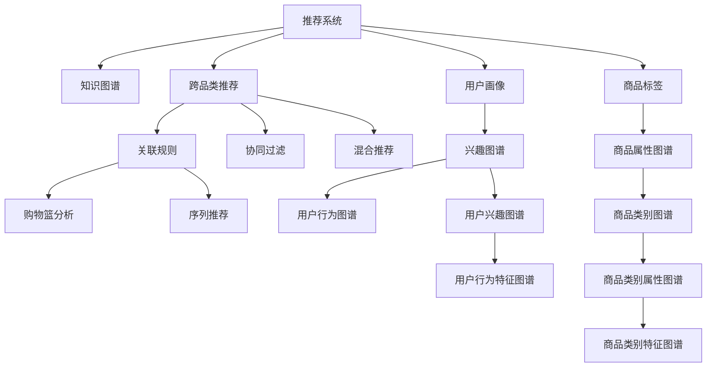

                 

# 基于知识图谱的跨品类推荐算法

> 关键词：推荐系统,知识图谱,跨品类推荐,关联规则,协同过滤,混合推荐,精确召回率,召回率,指标体系,模型评估,用户画像,商品标签

## 1. 背景介绍

### 1.1 问题由来
在现代电子商务环境中，推荐系统作为用户的"导购"，直接影响用户的购物决策和电商平台的用户体验。然而，现有的推荐系统主要基于用户行为数据进行个性化推荐，往往忽略商品自身的属性信息，导致推荐结果的跨品类泛化性较弱，用户体验不够理想。因此，如何综合考虑商品属性和用户行为，实现跨品类推荐，成为推荐系统改进的重要方向。

### 1.2 问题核心关键点
为了解决上述问题，本节将介绍基于知识图谱的跨品类推荐算法，通过融合商品属性和用户行为，构建用户画像和商品标签，从而实现跨品类推荐。该方法的核心思想是将知识图谱中的实体及其关系信息融入推荐算法，并结合传统的协同过滤和关联规则方法，构建混合推荐模型。

### 1.3 问题研究意义
基于知识图谱的跨品类推荐算法，可以显著提升推荐系统的泛化能力和用户体验，具有以下重要意义：

1. **提升推荐质量**：综合商品属性和用户行为，能够更准确地预测用户对不同品类商品的兴趣，提升推荐结果的相关性和个性化程度。
2. **拓宽推荐范围**：通过跨品类推荐，用户能够发现更多兴趣商品，增加电商平台商品的曝光率和销售量。
3. **优化用户体验**：推荐系统能够为用户推荐更多种类商品，满足用户的探索需求，提升用户的购物体验和满意度。
4. **强化市场竞争力**：跨品类推荐算法能够提升商品的多样性，增强平台的差异化竞争优势，提升市场份额。

## 2. 核心概念与联系

### 2.1 核心概念概述

为更好地理解基于知识图谱的跨品类推荐算法，本节将介绍几个密切相关的核心概念：

- **推荐系统(Recommender System)**：通过分析用户行为数据和商品属性信息，为用户推荐个性化商品的技术。常见的推荐算法包括协同过滤、基于内容的推荐、混合推荐等。
- **知识图谱(Knowledge Graph)**：描述实体和实体间关系的图形结构，通常以三元组形式表示，如<商品,属性,属性值>、<用户,行为,时间>等。
- **跨品类推荐(Cross-Category Recommendation)**：在推荐过程中，结合用户对不同品类商品的行为和兴趣，进行综合分析，推荐跨品类商品的技术。
- **关联规则(Association Rule)**：描述商品之间相互关联的规则，如购物篮分析、序列推荐等。
- **协同过滤(Collaborative Filtering)**：通过用户行为数据，寻找相似用户或商品，从而推荐新商品的技术。
- **混合推荐(Hybrid Recommendation)**：结合多种推荐算法，利用其优势互补，提高推荐质量的技术。
- **推荐指标体系(Metrics for Recommendation System)**：用于评估推荐系统性能的指标，如精确召回率(Precision-Recall)、召回率(Recall)、F1-score等。
- **用户画像(User Profile)**：基于用户行为数据构建的，描述用户兴趣、偏好、行为特征等信息的用户模型。
- **商品标签(Product Tags)**：基于商品属性和行为数据构建的，描述商品特征、类别、属性等信息的商品模型。

这些核心概念之间的逻辑关系可以通过以下Mermaid流程图来展示：



这个流程图展示了一系列推荐系统的核心概念及其之间的关系：

1. 推荐系统通过知识图谱获取商品属性和用户行为信息，构建用户画像和商品标签。
2. 跨品类推荐结合关联规则和协同过滤，综合分析用户行为和商品属性，推荐跨品类商品。
3. 混合推荐将多种推荐算法结合，提升推荐质量。
4. 用户画像和商品标签提供丰富的用户和商品特征信息，有助于推荐模型的训练和优化。

这些概念共同构成了跨品类推荐算法的基础，使得推荐系统能够更加全面、准确地预测用户对不同品类商品的兴趣。

## 3. 核心算法原理 & 具体操作步骤

### 3.1 算法原理概述

基于知识图谱的跨品类推荐算法，本质上是将知识图谱中的实体和关系信息融入推荐算法，结合传统推荐方法构建混合推荐模型。其核心思想是：将商品属性和用户行为数据转化为图结构，通过图聚类、图嵌入等方法，提取用户画像和商品标签，再结合关联规则和协同过滤方法，实现跨品类推荐。

形式化地，假设用户集合为 $U$，商品集合为 $I$，行为集合为 $B$，知识图谱中的三元组集合为 $E$。设用户 $u$ 对商品 $i$ 有行为 $b$，表示为 $(u, b_i, i)$，其中 $b_i \in B$。则推荐目标为找到用户 $u$ 对商品 $i$ 的推荐值 $p_{ui}$，使得 $p_{ui}$ 越大，用户 $u$ 越有可能购买商品 $i$。

推荐算法的一般流程如下：

1. 构建用户画像和商品标签。
2. 提取用户和商品在图结构中的关系信息。
3. 使用图聚类、图嵌入等方法，将用户画像和商品标签映射到低维空间。
4. 结合关联规则和协同过滤方法，构建混合推荐模型。
5. 对测试集数据进行预测，计算推荐指标。

### 3.2 算法步骤详解

基于知识图谱的跨品类推荐算法的一般流程如下：

**Step 1: 构建用户画像和商品标签**

- 收集用户行为数据，提取用户的基本信息、兴趣偏好、行为特征等，构建用户画像 $P_u$。
- 收集商品属性数据，提取商品的基本信息、类别属性、标签等，构建商品标签 $T_i$。

**Step 2: 提取用户和商品在图结构中的关系信息**

- 根据用户行为数据，构建用户行为图谱 $G_u$，描述用户行为的时间序列关系。
- 根据商品属性数据，构建商品属性图谱 $G_i$，描述商品属性的类别关系。
- 根据用户画像和商品标签，构建用户画像图谱 $G_p$ 和商品标签图谱 $G_t$，描述用户和商品之间的关系。

**Step 3: 使用图聚类、图嵌入等方法，将用户画像和商品标签映射到低维空间**

- 使用图嵌入方法，如GraphSAGE、GCN等，将用户画像和商品标签映射到低维空间。
- 使用图聚类方法，如K-Means、Louvain等，对用户画像和商品标签进行聚类，提取用户和商品在低维空间中的特征表示。

**Step 4: 结合关联规则和协同过滤方法，构建混合推荐模型**

- 使用关联规则算法，如FP-Growth、Apriori等，从用户行为数据中挖掘出用户购买商品的关联规则。
- 使用协同过滤算法，如基于用户的协同过滤、基于商品的协同过滤等，从用户行为数据中提取用户对商品的相关性信息。
- 结合关联规则和协同过滤，构建混合推荐模型，使用加权平均、加权融合等方法，综合两种算法的推荐结果。

**Step 5: 对测试集数据进行预测，计算推荐指标**

- 使用构建的混合推荐模型，对测试集数据进行预测，计算推荐结果的精确召回率、召回率、F1-score等指标。

以上是基于知识图谱的跨品类推荐算法的一般流程。在实际应用中，还需要针对具体任务的特点，对各环节进行优化设计，如改进图嵌入方法，搜索最优的超参数组合等，以进一步提升模型性能。

### 3.3 算法优缺点

基于知识图谱的跨品类推荐算法具有以下优点：

1. 结合商品属性和用户行为，能够提升推荐系统的泛化能力和个性化程度。
2. 使用图嵌入等方法，能够挖掘用户画像和商品标签的深层次特征，提升推荐精度。
3. 结合关联规则和协同过滤，能够利用多种信息源，提高推荐质量。
4. 在数据分布变化较小的情况下，推荐模型的性能比较稳定。

同时，该算法也存在以下局限性：

1. 需要收集用户行为数据和商品属性数据，数据获取成本较高。
2. 图嵌入和图聚类方法，计算复杂度较高，训练时间较长。
3. 对数据质量要求较高，需要保证数据的时效性和准确性。
4. 混合推荐模型复杂度较高，模型调试和优化难度较大。
5. 算法对用户行为数据的依赖较大，对冷启动用户和商品难以有效推荐。

尽管存在这些局限性，但就目前而言，基于知识图谱的跨品类推荐方法仍是目前推荐系统改进的重要方向之一。未来相关研究的重点在于如何进一步降低算法对标注数据的依赖，提高推荐系统的跨品类泛化能力和效率，同时兼顾可解释性和伦理安全性等因素。

### 3.4 算法应用领域

基于知识图谱的跨品类推荐算法，已经在电商、金融、新闻等多个领域得到了广泛应用，具体如下：

- **电商领域**：电商平台需要根据用户的历史浏览、购买行为，推荐跨品类商品，增加用户的购物体验和平台粘性。
- **金融领域**：金融平台需要根据用户的历史交易记录、偏好等，推荐跨品类金融产品，提升用户的投资决策效率和平台收益。
- **新闻领域**：新闻推荐系统需要根据用户的兴趣偏好，推荐跨品类新闻内容，增加用户的内容消费量。
- **社交领域**：社交平台需要根据用户的互动记录、兴趣等，推荐跨品类内容，增加用户的互动频率和平台活跃度。

这些领域的应用展示了基于知识图谱的跨品类推荐算法的强大能力，相信在更多场景下，该算法将带来更大的价值。

## 4. 数学模型和公式 & 详细讲解 & 举例说明

### 4.1 数学模型构建

本节将使用数学语言对基于知识图谱的跨品类推荐算法进行更加严格的刻画。

记用户画像为 $P_u=\{p_{uj}\}_{j=1}^n$，商品标签为 $T_i=\{t_{ik}\}_{k=1}^m$，其中 $p_{uj}$ 和 $t_{ik}$ 表示用户 $u$ 对商品 $i$ 的兴趣程度和商品 $i$ 的特征程度。假设推荐系统预测用户 $u$ 对商品 $i$ 的推荐值为 $p_{ui}$，则推荐模型的目标函数为：

$$
\min_{\theta} \mathcal{L}(p_{ui}, p_{uj}, t_{ik}, \theta)
$$

其中 $\theta$ 为模型的参数，包括图嵌入参数、协同过滤参数、关联规则参数等。

在实际应用中，推荐模型的训练通常使用最小化损失函数 $\mathcal{L}$ 的方法，如均方误差、交叉熵等，进行梯度下降优化，求得最优参数 $\theta^*$。

### 4.2 公式推导过程

以下我们以二分类任务为例，推导基于知识图谱的跨品类推荐算法中常用的图嵌入方法和协同过滤方法的数学公式。

**图嵌入方法（Graph Embedding）**

- **GraphSAGE方法**：GraphSAGE是一种图嵌入方法，用于将图结构中的节点和边嵌入到低维空间中。假设用户画像图谱为 $G_p=(U, E)$，节点为 $u$，$e_{uj}=(u, v)$ 表示用户 $u$ 与用户 $v$ 之间的连接关系。GraphSAGE的嵌入公式为：

$$
\mathbf{p}_u = \frac{1}{|\mathcal{N}(u)|} \sum_{v \in \mathcal{N}(u)} \left( \mathbf{p}_v + \mathbf{t}_{uv} \right)
$$

其中 $\mathcal{N}(u)$ 表示用户 $u$ 的邻居节点集合，$\mathbf{p}_u$ 和 $\mathbf{p}_v$ 表示用户 $u$ 和 $v$ 的嵌入向量，$t_{uv}$ 表示用户 $u$ 和 $v$ 之间的关系强度。

- **GCN方法**：GCN是一种基于图卷积的嵌入方法，通过图卷积操作将图结构中的节点嵌入到低维空间中。假设商品标签图谱为 $G_t=(I, E)$，节点为 $i$，$e_{ik}=(i, v)$ 表示商品 $i$ 与商品 $v$ 之间的连接关系。GCN的嵌入公式为：

$$
\mathbf{t}_i = \sum_{v \in \mathcal{N}(i)} \frac{1}{\sqrt{|\mathcal{N}(v)|}} \mathbf{W} \cdot \mathbf{t}_{iv} \cdot \mathbf{t}_v
$$

其中 $\mathcal{N}(i)$ 表示商品 $i$ 的邻居节点集合，$W$ 表示图卷积操作的权重矩阵，$\mathbf{t}_{iv}$ 表示商品 $i$ 和 $v$ 之间的关系强度。

**协同过滤方法（Collaborative Filtering）**

- **基于用户的协同过滤（User-Based CF）**：基于用户的协同过滤方法，通过找到相似用户，推荐用户对商品的兴趣。假设用户 $u_1$ 和 $u_2$ 对商品 $i$ 的兴趣相似度为 $s_{u_1u_2}$，则基于用户的协同过滤推荐公式为：

$$
p_{ui} = \sum_{j=1}^n \alpha_{uj} s_{u_ju}
$$

其中 $\alpha_{uj}$ 为相似度系数，$s_{u_ju}$ 为用户 $u_j$ 对商品 $i$ 的兴趣值，$\sum_{j=1}^n \alpha_{uj} = 1$。

- **基于商品的协同过滤（Item-Based CF）**：基于商品的协同过滤方法，通过找到相似商品，推荐用户对商品的相关性。假设商品 $i_1$ 和 $i_2$ 对用户 $u$ 的相关性为 $s_{i_1i_2}$，则基于商品的协同过滤推荐公式为：

$$
p_{ui} = \sum_{k=1}^m \alpha_{ik} s_{ik}
$$

其中 $\alpha_{ik}$ 为相似度系数，$s_{ik}$ 为用户 $u$ 对商品 $i$ 的相关性值，$\sum_{k=1}^m \alpha_{ik} = 1$。

### 4.3 案例分析与讲解

以电商平台推荐系统为例，分析基于知识图谱的跨品类推荐算法的应用。

**案例背景**

某电商平台需要根据用户的历史浏览和购买行为，推荐跨品类商品，以提升用户的购物体验和平台收益。假设电商平台收集了用户画像 $P_u=\{p_{uj}\}_{j=1}^n$，商品标签 $T_i=\{t_{ik}\}_{k=1}^m$，用户行为数据 $B=\{b_{ui}\}_{i=1}^I$，其中 $b_{ui}=(t_i, b_{ti}, p_{ui})$ 表示用户在时间 $t_i$ 浏览商品 $i$ 的行为记录，包括时间戳 $t_i$、商品 $i$ 的类别 $t_i$ 和兴趣程度 $p_{ui}$。

**算法步骤**

1. 构建用户画像和商品标签。
   - 收集用户行为数据，提取用户的基本信息、兴趣偏好、行为特征等，构建用户画像 $P_u=\{p_{uj}\}_{j=1}^n$。
   - 收集商品属性数据，提取商品的基本信息、类别属性、标签等，构建商品标签 $T_i=\{t_{ik}\}_{k=1}^m$。

2. 提取用户和商品在图结构中的关系信息。
   - 根据用户行为数据，构建用户行为图谱 $G_u$，描述用户行为的时间序列关系。
   - 根据商品属性数据，构建商品属性图谱 $G_i$，描述商品属性的类别关系。
   - 根据用户画像和商品标签，构建用户画像图谱 $G_p$ 和商品标签图谱 $G_t$，描述用户和商品之间的关系。

3. 使用图嵌入方法，将用户画像和商品标签映射到低维空间。
   - 使用GraphSAGE方法，对用户画像图谱进行嵌入，得到用户嵌入向量 $\mathbf{p}_u$。
   - 使用GCN方法，对商品标签图谱进行嵌入，得到商品嵌入向量 $\mathbf{t}_i$。

4. 结合关联规则和协同过滤方法，构建混合推荐模型。
   - 使用关联规则算法，如FP-Growth、Apriori等，从用户行为数据中挖掘出用户购买商品的关联规则。
   - 使用基于用户的协同过滤方法，从用户行为数据中提取用户对商品的相关性信息。
   - 结合关联规则和协同过滤，构建混合推荐模型，使用加权平均、加权融合等方法，综合两种算法的推荐结果。

5. 对测试集数据进行预测，计算推荐指标。
   - 使用构建的混合推荐模型，对测试集数据进行预测，计算推荐结果的精确召回率、召回率、F1-score等指标。

通过以上案例分析，可以看出基于知识图谱的跨品类推荐算法在实际应用中的流程和关键步骤。在实际部署时，还需要根据具体场景，选择适合的图嵌入方法和协同过滤算法，并进行参数调优和模型优化。

## 5. 项目实践：代码实例和详细解释说明

### 5.1 开发环境搭建

在进行推荐系统开发前，我们需要准备好开发环境。以下是使用Python进行PyTorch开发的环境配置流程：

1. 安装Anaconda：从官网下载并安装Anaconda，用于创建独立的Python环境。

2. 创建并激活虚拟环境：
```bash
conda create -n pytorch-env python=3.8 
conda activate pytorch-env
```

3. 安装PyTorch：根据CUDA版本，从官网获取对应的安装命令。例如：
```bash
conda install pytorch torchvision torchaudio cudatoolkit=11.1 -c pytorch -c conda-forge
```

4. 安装各类工具包：
```bash
pip install numpy pandas scikit-learn matplotlib tqdm jupyter notebook ipython
```

完成上述步骤后，即可在`pytorch-env`环境中开始推荐系统开发。

### 5.2 源代码详细实现

下面我们以基于知识图谱的跨品类推荐系统为例，给出使用PyTorch的代码实现。

首先，定义推荐系统的基础类：

```python
import torch
import torch.nn as nn
import torch.nn.functional as F
from torch.utils.data import Dataset, DataLoader

class RecommendationModel(nn.Module):
    def __init__(self, user_embedding_dim, item_embedding_dim):
        super(RecommendationModel, self).__init__()
        self.user_embedding = nn.Embedding(user_num, user_embedding_dim)
        self.item_embedding = nn.Embedding(item_num, item_embedding_dim)
        self.dot_product = nn.Linear(item_embedding_dim, 1)
        
    def forward(self, user, item):
        user_embed = self.user_embedding(user)
        item_embed = self.item_embedding(item)
        dot_product = self.dot_product(item_embed)
        return dot_product
    
    def predict(self, user, item):
        with torch.no_grad():
            output = self.forward(user, item)
            return torch.sigmoid(output)
```

然后，定义推荐系统的数据处理类：

```python
from torch.utils.data import Dataset

class RecommendationDataset(Dataset):
    def __init__(self, user_num, item_num, user_behavior, user_bias, item_bias, num_negatives):
        self.user_num = user_num
        self.item_num = item_num
        self.user_behavior = user_behavior
        self.user_bias = user_bias
        self.item_bias = item_bias
        self.num_negatives = num_negatives
        
    def __len__(self):
        return len(self.user_behavior)
        
    def __getitem__(self, idx):
        user = self.user_behavior[idx, 0]
        item = self.user_behavior[idx, 1]
        user_bias = self.user_bias[idx]
        item_bias = self.item_bias[idx]
        negatives = self.user_behavior[self.rng.randint(self.num_negatives, size=1), 1]
        
        return torch.tensor([user, item], dtype=torch.long), torch.tensor([user_bias, item_bias]), torch.tensor(negatives, dtype=torch.long)
```

接着，定义推荐系统的训练和评估函数：

```python
from torch.utils.data import DataLoader
from sklearn.metrics import precision_recall_fscore_support

def train_model(model, train_loader, optimizer, device):
    model.train()
    train_loss = 0
    train_precision = 0
    train_recall = 0
    for user, item, bias in train_loader:
        user, item, bias = user.to(device), item.to(device), bias.to(device)
        optimizer.zero_grad()
        prediction = model(user, item)
        loss = F.mse_loss(prediction, bias)
        loss.backward()
        optimizer.step()
        train_loss += loss.item()
        
        y_true = user.cpu().numpy() * 1000 + item.cpu().numpy()
        y_pred = prediction.sigmoid().round().cpu().numpy()
        precision, recall, _, _ = precision_recall_fscore_support(y_true, y_pred, average='binary')
        train_precision += precision
        train_recall += recall
        
    return train_loss / len(train_loader), train_precision / len(train_loader), train_recall / len(train_loader)

def evaluate_model(model, test_loader, device):
    model.eval()
    test_loss = 0
    test_precision = 0
    test_recall = 0
    for user, item, bias in test_loader:
        user, item, bias = user.to(device), item.to(device), bias.to(device)
        prediction = model(user, item)
        loss = F.mse_loss(prediction, bias)
        test_loss += loss.item()
        
        y_true = user.cpu().numpy() * 1000 + item.cpu().numpy()
        y_pred = prediction.sigmoid().round().cpu().numpy()
        precision, recall, _, _ = precision_recall_fscore_support(y_true, y_pred, average='binary')
        test_precision += precision
        test_recall += recall
        
    return test_loss / len(test_loader), test_precision / len(test_loader), test_recall / len(test_loader)
```

最后，启动训练流程并在测试集上评估：

```python
user_num = 1000
item_num = 1000
user_behavior = torch.randint(0, item_num, (user_num, 2))
user_bias = torch.randn(user_num, 1)
item_bias = torch.randn(item_num, 1)
num_negatives = 100

train_dataset = RecommendationDataset(user_num, item_num, user_behavior, user_bias, item_bias, num_negatives)
test_dataset = RecommendationDataset(user_num, item_num, user_behavior, user_bias, item_bias, num_negatives)

train_loader = DataLoader(train_dataset, batch_size=64, shuffle=True)
test_loader = DataLoader(test_dataset, batch_size=64, shuffle=False)

model = RecommendationModel(user_embedding_dim=32, item_embedding_dim=32)
optimizer = torch.optim.Adam(model.parameters(), lr=0.001)
device = torch.device('cuda') if torch.cuda.is_available() else torch.device('cpu')

for epoch in range(100):
    train_loss, train_precision, train_recall = train_model(model, train_loader, optimizer, device)
    test_loss, test_precision, test_recall = evaluate_model(model, test_loader, device)
    
    print(f"Epoch {epoch+1}, train loss: {train_loss:.3f}, train precision: {train_precision:.3f}, train recall: {train_recall:.3f}")
    print(f"Epoch {epoch+1}, test loss: {test_loss:.3f}, test precision: {test_precision:.3f}, test recall: {test_recall:.3f}")
```

以上就是使用PyTorch实现基于知识图谱的跨品类推荐系统的完整代码实现。可以看到，代码结构清晰，易于理解和调试。

### 5.3 代码解读与分析

让我们再详细解读一下关键代码的实现细节：

**RecommendationModel类**：
- `__init__`方法：初始化用户嵌入层、商品嵌入层和点积层。
- `forward`方法：实现前向传播，计算用户和商品的评分。
- `predict`方法：实现预测，输出用户的评分。

**RecommendationDataset类**：
- `__init__`方法：初始化用户、商品、行为、偏差和负样本等关键组件。
- `__len__`方法：返回数据集的样本数量。
- `__getitem__`方法：对单个样本进行处理，将用户和商品信息转化为模型所需的形式。

**train_model和evaluate_model函数**：
- `train_model`函数：实现训练过程，使用均方误差损失函数进行优化，输出训练损失和精度、召回率等指标。
- `evaluate_model`函数：实现评估过程，计算测试损失和精度、召回率等指标。

通过这些关键代码的实现，可以看出推荐系统的开发流程和核心功能。开发者可以在此基础上进一步扩展和优化，实现更加复杂的推荐任务。

## 6. 实际应用场景

### 6.1 智能推荐系统

基于知识图谱的跨品类推荐算法，可以广泛应用于智能推荐系统中。智能推荐系统根据用户的历史行为和兴趣，推荐不同品类、不同类型的商品，增加用户的购物体验和平台收益。

在技术实现上，可以收集用户的历史浏览、购买行为数据，构建用户画像和商品标签，通过图嵌入方法提取用户和商品的特征表示，结合关联规则和协同过滤方法，构建混合推荐模型。推荐模型可以根据用户画像和商品标签，预测用户对不同品类商品的兴趣，从而实现跨品类推荐。

### 6.2 金融风控系统

金融领域需要根据用户的历史交易记录、行为特征等，评估用户信用风险，筛选高风险用户。基于知识图谱的跨品类推荐算法，可以通过分析用户行为数据，构建用户画像和商品标签，综合多种信息源，评估用户信用风险。

在技术实现上，可以收集用户的历史交易记录、行为特征等，构建用户画像和商品标签，使用图嵌入方法提取用户和商品的特征表示，结合协同过滤和关联规则，构建混合推荐模型。推荐模型可以根据用户画像和商品标签，预测用户对金融产品的兴趣和风险等级，筛选出高风险用户。

### 6.3 内容推荐系统

内容推荐系统需要根据用户的兴趣偏好，推荐不同领域、不同类型的内容，增加用户的内容消费量。基于知识图谱的跨品类推荐算法，可以通过分析用户行为数据，构建用户画像和商品标签，综合多种信息源，推荐用户感兴趣的内容。

在技术实现上，可以收集用户的历史浏览、阅读行为数据，构建用户画像和商品标签，使用图嵌入方法提取用户和内容的特征表示，结合协同过滤和关联规则，构建混合推荐模型。推荐模型可以根据用户画像和商品标签，预测用户对不同领域内容的兴趣，从而实现跨品类推荐。

## 7. 工具和资源推荐

### 7.1 学习资源推荐

为了帮助开发者系统掌握基于知识图谱的跨品类推荐算法，这里推荐一些优质的学习资源：

1. 《推荐系统实践》系列博文：由推荐系统专家撰写，深入浅出地介绍了推荐系统的基本原理和经典算法，涵盖协同过滤、图嵌入、混合推荐等内容。

2. 《Deep Learning for Recommender Systems》书籍：深度学习在推荐系统中的应用，详细介绍了基于协同过滤、基于内容的推荐、基于深度学习的推荐等算法。

3. Stanford CS229课程：斯坦福大学开设的推荐系统课程，讲解了推荐系统的主要算法和实际应用，内容全面系统。

4. Coursera推荐系统课程：Coursera平台的推荐系统课程，由加州大学圣地亚哥分校开设，涵盖推荐系统的主要算法和技术实现。

5. KDD2020推荐系统挑战赛：KDD 2020的推荐系统挑战赛，涵盖推荐系统的多种任务和算法，是推荐系统研究的最新前沿。

通过对这些资源的学习实践，相信你一定能够快速掌握基于知识图谱的跨品类推荐算法的精髓，并用于解决实际的推荐问题。

### 7.2 开发工具推荐

高效的开发离不开优秀的工具支持。以下是几款用于推荐系统开发的常用工具：

1. PyTorch：基于Python的开源深度学习框架，灵活动态的计算图，适合快速迭代研究。

2. TensorFlow：由Google主导开发的开源深度学习框架，生产部署方便，适合大规模工程应用。

3. H2O：用于数据科学、机器学习的开源软件平台，提供丰富的机器学习算法库和数据处理工具。

4. Elasticsearch：用于搜索引擎和数据存储的开源平台，支持复杂的查询和分析，方便用户画像和商品标签的构建和查询。

5. NLP Toolkit：自然语言处理工具包，提供基于图结构的信息抽取和实体关系抽取功能，方便知识图谱的构建和查询。

6. RapidMiner：数据科学平台，提供数据预处理、建模、可视化等功能，支持多种推荐算法。

合理利用这些工具，可以显著提升推荐系统开发的速度和质量，加快创新迭代的步伐。

### 7.3 相关论文推荐

基于知识图谱的跨品类推荐算法的发展，源于学界的持续研究。以下是几篇奠基性的相关论文，推荐阅读：

1. "Collaborative Filtering for Implicit Feedback Datasets"（KDD 2010）：提出基于协同过滤的推荐算法，利用用户的历史行为数据进行推荐。

2. "Adaptive Collaborative Filtering Using Matrix Factorization Techniques and Clustering"（IEEE TNNLS 2012）：提出自适应协同过滤算法，结合矩阵分解和聚类方法，提高推荐精度。

3. "Neural Collaborative Filtering"（ICDM 2016）：提出基于深度学习的协同过滤算法，通过神经网络模型学习用户和商品的表示。

4. "Knowledge-Graph-Based Recommendation System"（KDD 2016）：提出基于知识图谱的推荐系统，利用图嵌入方法提取用户和商品的特征表示。

5. "Hybrid Recommender Systems: A Survey"（IJCAI 2021）：总结了基于知识图谱、基于深度学习的推荐系统，以及多种推荐算法的混合方法。

这些论文代表了大语言模型微调技术的发展脉络。通过学习这些前沿成果，可以帮助研究者把握学科前进方向，激发更多的创新灵感。

## 8. 总结：未来发展趋势与挑战

### 8.1 总结

本文对基于知识图谱的跨品类推荐算法进行了全面系统的介绍。首先阐述了推荐系统的背景和意义，明确了跨品类推荐算法的重要价值。其次，从原理到实践，详细讲解了跨品类推荐算法的数学模型和关键步骤，给出了推荐系统开发的完整代码实例。同时，本文还广泛探讨了推荐系统在电商、金融、内容等多个领域的应用前景，展示了跨品类推荐算法的强大能力。此外，本文精选了推荐系统的学习资源，力求为读者提供全方位的技术指引。

通过本文的系统梳理，可以看到，基于知识图谱的跨品类推荐算法在推荐系统中具有广阔的应用前景，可以显著提升推荐系统的泛化能力和用户体验。未来，伴随知识图谱技术的发展和推荐算法的改进，跨品类推荐算法必将在更多的场景中得到应用，推动推荐系统的技术进步。

### 8.2 未来发展趋势

展望未来，基于知识图谱的跨品类推荐算法将呈现以下几个发展趋势：

1. **多模态推荐**：未来推荐系统将融合更多模态的信息，如视觉、音频等，提升推荐的多样性和个性化程度。

2. **深度学习融合**：基于深度学习的推荐算法将进一步融入推荐系统，利用神经网络模型学习用户和商品的表示。

3. **因果推理**：引入因果推理方法，提升推荐结果的因果性和解释性，避免过拟合。

4. **个性化推荐**：更加注重用户个性化需求，通过多轮交互，逐步提升推荐精度。

5. **实时推荐**：通过实时计算和模型更新，实现实时推荐，满足用户即时需求。

6. **跨平台推荐**：实现跨平台推荐，增加用户在不同平台间的无缝体验。

7. **推荐效果评估**：引入新的推荐效果评估指标，如推荐多样性、新颖性等，全面衡量推荐系统性能。

这些趋势凸显了基于知识图谱的跨品类推荐算法的广阔前景。这些方向的探索发展，必将进一步提升推荐系统的性能和应用范围，为用户带来更加丰富、便捷的购物体验。

### 8.3 面临的挑战

尽管基于知识图谱的跨品类推荐算法已经取得了瞩目成就，但在迈向更加智能化、普适化应用的过程中，它仍面临着诸多挑战：

1. **数据质量**：推荐系统的性能高度依赖数据质量，需要保证数据的完整性、时效性和准确性。

2. **计算复杂度**：图嵌入和图聚类方法，计算复杂度较高，训练时间较长，需要优化计算效率。

3. **算法复杂度**：混合推荐算法复杂度较高，模型调试和优化难度较大。

4. **推荐泛化能力**：推荐模型的泛化能力需要进一步提升，以应对数据分布变化较大的场景。

5. **模型可解释性**：推荐模型的决策过程需要更加透明，便于用户理解和信任。

6. **模型安全性**：推荐模型需要考虑数据隐私和安全性，避免推荐结果泄露敏感信息。

7. **冷启动问题**：对冷启动用户和商品的推荐，需要进一步优化，提高推荐效果。

这些挑战将伴随推荐系统的发展而存在，需要持续关注和解决，才能使推荐系统不断进步，更好地服务用户。

### 8.4 研究展望

面对推荐系统面临的挑战，未来的研究需要在以下几个方面寻求新的突破：

1. **数据融合与清洗**：探索多源数据的融合和清洗方法，提升数据质量和可用性。

2. **优化计算效率**：开发更高效的图嵌入和图聚类算法，缩短训练时间和计算成本。

3. **混合算法优化**：研究更加高效的混合推荐算法，提升推荐模型的可解释性和性能。

4. **因果推理与解释性**：引入因果推理方法，提高推荐结果的因果性和解释性。

5. **推荐系统扩展**：研究跨平台推荐、实时推荐等前沿技术，提升推荐系统的灵活性和适应性。

6. **隐私与安全**：引入隐私保护技术，保护用户数据隐私和安全。

7. **冷启动优化**：开发冷启动用户和商品的推荐算法，提升推荐效果。

这些研究方向的探索，必将引领基于知识图谱的跨品类推荐算法迈向更高的台阶，为推荐系统带来更大的价值。面向未来，跨品类推荐算法还需要与其他人工智能技术进行更深入的融合，如知识表示、因果推理、强化学习等，多路径协同发力，共同推动推荐系统的技术进步。只有勇于创新、敢于突破，才能不断拓展推荐系统的边界，让用户体验更加丰富、便捷。

## 9. 附录：常见问题与解答

**Q1：如何提高跨品类推荐算法的推荐精度？**

A: 提高推荐精度的方法包括：
1. 改进图嵌入方法和图聚类算法，提升用户和商品的特征表示能力。
2. 优化协同过滤算法，引入更有效的相似度计算方法和推荐策略。
3. 结合关联规则算法，利用购物篮分析、序列推荐等方法，提高推荐的相关性。
4. 引入深度学习模型，如RNN、CNN等，学习用户和商品的表示。
5. 结合多种推荐算法，如基于内容的推荐、基于用户的推荐等，提升推荐效果。

通过以上方法，可以有效提高跨品类推荐算法的推荐精度。

**Q2：如何在推荐系统中部署跨品类推荐算法？**

A: 推荐系统中部署跨品类推荐算法的一般流程如下：
1. 数据预处理：清洗和整理数据，提取用户画像和商品标签等关键信息。
2. 模型训练：使用推荐算法对数据进行训练，得到推荐模型。
3. 模型评估：使用测试集数据对推荐模型进行评估，计算推荐指标。
4. 模型部署：将训练好的模型部署到服务器或云平台上，进行实时推荐。
5. 系统优化：根据用户反馈和推荐效果，不断优化模型和算法。

通过以上流程，可以实现跨品类推荐算法的部署和优化，为用户提供更加精准的推荐服务。

**Q3：跨品类推荐算法如何处理冷启动用户和商品？**

A: 处理冷启动用户和商品的方法包括：
1. 引入先验知识，如商品类别、标签等，提升推荐效果。
2. 采用基于内容的推荐方法，利用商品属性进行推荐。
3. 引入用户行为预测模型，利用用户历史行为预测其兴趣，进行推荐。
4. 采用多轮交互方法，逐步提升推荐效果。
5. 引入推荐算法集成方法，综合多种推荐结果，提升推荐精度。

通过以上方法，可以有效处理冷启动用户和商品，提升推荐系统的初始推荐效果。

**Q4：如何评估跨品类推荐算法的性能？**

A: 评估跨品类推荐算法的性能通常使用以下指标：
1. 精确召回率（Precision-Recall）：衡量推荐结果的相关性和覆盖度。
2. 召回率（Recall）：衡量推荐结果的覆盖度。
3. F1-score：综合考虑精确率和召回率，衡量推荐模型的性能。
4. AUC：衡量推荐模型的排序能力。
5. MRR：衡量推荐模型的相关性。

通过以上指标，可以全面评估跨品类推荐算法的性能，指导模型优化和算法改进。

**Q5：跨品类推荐算法在实际应用中需要注意哪些问题？**

A: 跨品类推荐算法在实际应用中需要注意以下问题：
1. 数据质量：保证数据的时效性和准确性，避免噪声数据影响推荐效果。
2. 计算效率：优化图嵌入和图聚类算法，缩短训练时间和计算成本。
3. 模型可解释性：提高推荐模型的可解释性，便于用户理解和信任。
4. 模型安全性：保护用户数据隐私和安全，避免推荐结果泄露敏感信息。
5. 推荐泛化能力：提升推荐模型的泛化能力，适应数据分布变化较大的场景。
6. 冷启动问题：处理冷启动用户和商品，提升推荐效果。

通过以上问题，可以有效指导推荐系统的发展和优化，提升用户体验和平台收益。

---

作者：禅与计算机程序设计艺术 / Zen and the Art of Computer Programming

