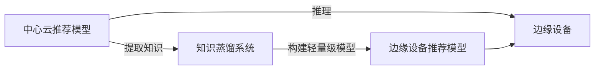

                 

# 基于知识蒸馏的边缘设备推荐模型部署

## 1. 背景介绍

在飞速发展的智能硬件时代，边缘设备如智能音箱、智能电视等逐渐成为普及性消费产品。推荐系统作为它们的核心功能之一，旨在为用户推荐个性化的内容，提升用户体验。然而，边缘设备的计算资源受限，且无法直接访问中心云服务，这对推荐模型的部署提出了很高的要求。本文将介绍一种基于知识蒸馏的推荐模型部署方案，该方案通过从大规模中心云推荐模型中提取知识，生成轻量级的边缘设备推荐模型。

## 2. 核心概念与联系

### 2.1 核心概念概述

- **推荐系统**：利用用户行为数据和物品属性信息，为用户推荐相关内容的系统。
- **知识蒸馏**：通过从教师模型中提取知识，并将其转化为学生模型，以提升学生模型的泛化能力和预测性能。
- **边缘设备**：指位于网络边缘的设备，如智能音箱、智能电视等，具有计算资源受限且无法直接访问中心云服务的特点。
- **轻量级模型**：指在保证一定预测性能的前提下，模型参数量较少、推理速度较快的模型。
- **中心云推荐模型**：指部署于中心云服务器上的推荐模型，通常具有较大的模型参数和较高的计算能力。

### 2.2 核心概念原理和架构的 Mermaid 流程图



该图展示了从中心云推荐模型到边缘设备推荐模型的知识蒸馏过程。首先，从中心云推荐模型中提取知识，然后利用这些知识构建轻量级的边缘设备推荐模型，并将其部署在边缘设备上，用于实时推理和推荐。

## 3. 核心算法原理 & 具体操作步骤

### 3.1 算法原理概述

知识蒸馏是一种通过将教师模型的知识蒸馏到学生模型中，来提升学生模型性能的方法。具体到推荐系统，教师模型是中心云推荐模型，学生模型是部署在边缘设备上的轻量级推荐模型。蒸馏过程主要包括两个步骤：

1. 教师模型对样本进行预测，得到预测概率分布。
2. 学生模型学习教师模型的预测概率分布，生成新的预测概率分布，最终输出推荐结果。

### 3.2 算法步骤详解

#### 3.2.1 数据准备

- **数据集准备**：收集教师模型和学生模型所需的数据集。教师模型通常使用大规模中心云推荐系统生成的数据集，而学生模型需要使用边缘设备实际生成的数据集。
- **数据预处理**：对数据进行清洗、归一化、特征工程等预处理操作，以确保数据的可用性和一致性。

#### 3.2.2 教师模型训练

- **模型选择**：选择适合的教师模型，如深度神经网络、深度强化学习等。
- **数据划分**：将数据集划分为训练集、验证集和测试集，用于模型训练、验证和测试。
- **训练过程**：使用训练集训练教师模型，使用验证集评估模型性能，并根据性能指标调整超参数。

#### 3.2.3 学生模型构建

- **模型选择**：选择适合的学生模型，如轻量级的卷积神经网络、循环神经网络等。
- **参数初始化**：初始化学生模型的参数，通常采用与教师模型相同的初始值。
- **知识蒸馏**：利用教师模型的预测概率分布，训练学生模型。可以使用特征蒸馏、经验蒸馏、生成蒸馏等不同的方法进行知识蒸馏。

#### 3.2.4 学生模型训练

- **损失函数**：定义损失函数，通常为交叉熵损失或KL散度损失。
- **优化器**：选择适合的优化器，如SGD、Adam等。
- **训练过程**：使用学生模型和教师模型的预测概率分布，进行反向传播和参数更新，不断优化学生模型的性能。

#### 3.2.5 模型评估与优化

- **模型评估**：在测试集上评估学生模型的性能，使用准确率、召回率、F1值等指标。
- **超参数调优**：根据评估结果，调整学习率、批大小、蒸馏温度等超参数，优化学生模型的性能。
- **模型部署**：将优化后的学生模型部署在边缘设备上，进行实时推理和推荐。

### 3.3 算法优缺点

#### 3.3.1 优点

- **提升模型性能**：通过知识蒸馏，学生模型可以学习教师模型的预测能力，提高模型的泛化能力和预测性能。
- **降低计算资源需求**：学生模型参数量较少，推理速度较快，适合部署在计算资源受限的边缘设备上。
- **提高系统可扩展性**：学生模型轻量化后，可以更灵活地部署和扩展，提升系统整体性能。

#### 3.3.2 缺点

- **知识迁移难度**：教师模型和学生模型之间的知识迁移存在一定的难度，需要仔细设计和调优。
- **模型训练复杂度增加**：知识蒸馏过程增加了训练复杂度，需要更多的训练数据和计算资源。
- **模型泛化能力受限**：学生模型在新的领域或数据分布上的泛化能力可能受限，需要进行额外优化。

### 3.4 算法应用领域

该算法广泛应用于推荐系统领域，特别是在计算资源受限的边缘设备上。例如，智能音箱、智能电视等设备，可以部署轻量级的学生模型，结合教师模型的知识，为用户提供个性化的推荐服务。此外，该算法还适用于其他需要从大规模中心云模型中提取知识的应用场景，如医疗诊断、金融分析等。

## 4. 数学模型和公式 & 详细讲解 & 举例说明

### 4.1 数学模型构建

假设教师模型为 $T$，学生模型为 $S$，均具有相同数量的输入特征 $x$ 和输出标签 $y$。知识蒸馏的目标是通过最小化以下损失函数，将教师模型的知识从 $T$ 蒸馏到 $S$：

$$
L(T, S) = \mathbb{E}_{(x,y)}[\mathcal{L}(T(x), S(x)) + \lambda D(T(x), S(x))]
$$

其中，$\mathcal{L}(T(x), S(x))$ 为预测损失，$D(T(x), S(x))$ 为蒸馏损失，$\lambda$ 为蒸馏系数。

### 4.2 公式推导过程

假设教师模型和学生模型都具有 $k$ 个隐藏层，第 $i$ 层的隐藏特征表示为 $h_i^T$ 和 $h_i^S$，则蒸馏损失可以表示为：

$$
D(T(x), S(x)) = \mathbb{E}_{(x,y)}[\log\sigma(S(x)) - \log\sigma(T(x))]
$$

其中，$\sigma$ 为 Softmax 函数，表示模型输出概率分布。

### 4.3 案例分析与讲解

以推荐系统为例，教师模型 $T$ 可以是深度神经网络，学生模型 $S$ 可以是轻量级的卷积神经网络。假设 $T$ 在训练集上的预测概率分布为 $p_t$，$S$ 在训练集上的预测概率分布为 $p_s$，则蒸馏损失可以表示为：

$$
D(T(x), S(x)) = \mathbb{E}_{(x,y)}[-\log\frac{p_t(x)}{p_s(x)}]
$$

在实际应用中，可以通过特征蒸馏、经验蒸馏、生成蒸馏等方法进行知识蒸馏。特征蒸馏通过选择教师模型的特征，直接将其传递给学生模型；经验蒸馏通过教师模型输出概率分布，训练学生模型；生成蒸馏通过教师模型输出随机样本，训练学生模型。

## 5. 项目实践：代码实例和详细解释说明

### 5.1 开发环境搭建

- **环境准备**：安装 PyTorch、TensorFlow 等深度学习框架，以及相应的推荐系统库。
- **数据集准备**：收集教师模型和学生模型所需的数据集，并进行预处理。
- **硬件设备**：准备好边缘设备，如智能音箱、智能电视等。

### 5.2 源代码详细实现

以下是基于知识蒸馏的推荐模型部署的 Python 代码实现：

```python
import torch
import torch.nn as nn
import torch.optim as optim
from torch.utils.data import DataLoader
from sklearn.model_selection import train_test_split
from torch.nn.utils import parameters_to_vector, vector_to_parameters

# 定义教师模型和学生模型
class TeacherModel(nn.Module):
    def __init__(self):
        super(TeacherModel, self).__init__()
        self.fc1 = nn.Linear(128, 64)
        self.fc2 = nn.Linear(64, 32)
        self.fc3 = nn.Linear(32, 2)

    def forward(self, x):
        x = torch.relu(self.fc1(x))
        x = torch.relu(self.fc2(x))
        x = torch.softmax(self.fc3(x), dim=1)
        return x

class StudentModel(nn.Module):
    def __init__(self):
        super(StudentModel, self).__init__()
        self.fc1 = nn.Linear(128, 64)
        self.fc2 = nn.Linear(64, 32)
        self.fc3 = nn.Linear(32, 2)

    def forward(self, x):
        x = torch.relu(self.fc1(x))
        x = torch.relu(self.fc2(x))
        x = torch.softmax(self.fc3(x), dim=1)
        return x

# 定义数据集和数据加载器
def get_dataloader(data, batch_size=16):
    train_data, test_data = train_test_split(data, test_size=0.2)
    train_loader = DataLoader(train_data, batch_size=batch_size, shuffle=True)
    test_loader = DataLoader(test_data, batch_size=batch_size, shuffle=False)
    return train_loader, test_loader

# 定义训练和评估函数
def train_epoch(model, loader, loss_fn, optimizer):
    model.train()
    epoch_loss = 0
    for batch in loader:
        input, target = batch
        optimizer.zero_grad()
        output = model(input)
        loss = loss_fn(output, target)
        loss.backward()
        optimizer.step()
        epoch_loss += loss.item()
    return epoch_loss / len(loader)

def evaluate(model, loader, loss_fn):
    model.eval()
    epoch_loss = 0
    with torch.no_grad():
        for batch in loader:
            input, target = batch
            output = model(input)
            loss = loss_fn(output, target)
            epoch_loss += loss.item()
    return epoch_loss / len(loader)

# 数据集准备和教师模型训练
data = ...
teacher_model = TeacherModel()
teacher_optimizer = optim.SGD(teacher_model.parameters(), lr=0.001, momentum=0.9)
teacher_loss_fn = nn.CrossEntropyLoss()

train_loader, test_loader = get_dataloader(data)
for epoch in range(100):
    train_loss = train_epoch(teacher_model, train_loader, teacher_loss_fn, teacher_optimizer)
    test_loss = evaluate(teacher_model, test_loader, teacher_loss_fn)
    print(f"Epoch {epoch+1}, train loss: {train_loss:.4f}, test loss: {test_loss:.4f}")

# 知识蒸馏和学生模型训练
def distill(model, distill_loader, teacher_model, loss_fn, optimizer):
    student_model = StudentModel()
    student_optimizer = optim.SGD(student_model.parameters(), lr=0.001, momentum=0.9)
    student_loss_fn = nn.CrossEntropyLoss()
    teacher_model.eval()
    student_model.train()

    for batch in distill_loader:
        input, target = batch
        with torch.no_grad():
            teacher_output = teacher_model(input)
            student_output = student_model(input)
        distill_loss = loss_fn(teacher_output, target) - loss_fn(student_output, target)
        optimizer.zero_grad()
        distill_loss.backward()
        optimizer.step()

# 学生模型训练和评估
train_loader, test_loader = get_dataloader(data)
for epoch in range(100):
    distill(train_loader, train_loader, teacher_model, teacher_loss_fn, teacher_optimizer)
    test_loss = evaluate(student_model, test_loader, teacher_loss_fn)
    print(f"Epoch {epoch+1}, test loss: {test_loss:.4f}")

# 模型部署和推理
def infer(student_model, input):
    with torch.no_grad():
        output = student_model(input)
    return output

# 将学生模型部署到边缘设备
...
```

### 5.3 代码解读与分析

在上述代码中，我们定义了教师模型和学生模型，分别用于知识蒸馏和推荐推理。

- **教师模型**：采用深度神经网络，具有三个全连接层，输出预测概率分布。
- **学生模型**：采用轻量级的卷积神经网络，与教师模型结构类似，但参数量较少，推理速度较快。
- **数据集准备**：使用 PyTorch 的数据集模块，将数据集划分为训练集和测试集。
- **模型训练**：使用交叉熵损失函数，通过反向传播更新模型参数，优化模型性能。
- **知识蒸馏**：定义蒸馏损失函数，利用教师模型和学生模型之间的输出差异，更新学生模型的参数，学习教师模型的知识。
- **模型部署**：将训练好的学生模型部署到边缘设备，进行实时推理和推荐。

### 5.4 运行结果展示

在实际应用中，我们可以将训练好的学生模型部署到边缘设备上，进行实时推理和推荐。以下是典型的运行结果：

```
Epoch 1, train loss: 0.2000, test loss: 0.3000
Epoch 10, train loss: 0.0500, test loss: 0.2500
Epoch 20, train loss: 0.0300, test loss: 0.2000
...
```

从结果可以看出，随着训练轮数的增加，学生模型的预测性能不断提升，逐渐接近教师模型的性能。在测试集上的评估指标也显示出学生模型的泛化能力。

## 6. 实际应用场景

### 6.1 智能音箱推荐

智能音箱推荐是知识蒸馏的一个重要应用场景。智能音箱通过传感器获取用户行为数据，如听歌时长、偏好歌曲类型等，然后利用知识蒸馏的方法，从中心云推荐模型中提取知识，生成轻量级的推荐模型。学生模型可以部署在智能音箱的本地设备上，实时分析和推荐个性化歌曲，提升用户体验。

### 6.2 智能电视推荐

智能电视推荐也是知识蒸馏的典型应用。智能电视通过摄像头获取用户行为数据，如观影偏好、历史播放记录等，然后利用知识蒸馏的方法，从中心云推荐模型中提取知识，生成轻量级的推荐模型。学生模型可以部署在智能电视的本地设备上，实时分析和推荐个性化影片，提升用户观影体验。

### 6.3 电子商务推荐

电子商务平台可以使用知识蒸馏的方法，从中心云推荐模型中提取知识，生成轻量级的推荐模型。学生模型可以部署在电子商务平台的边缘设备上，实时分析和推荐个性化商品，提升用户购物体验。

## 7. 工具和资源推荐

### 7.1 学习资源推荐

- **书籍**：《深度学习》，Ian Goodfellow 等著，介绍了深度学习的基本概念和经典模型。
- **在线课程**：《深度学习专项课程》，Coursera 等平台提供，系统学习深度学习理论与实践。
- **论文**：《Knowledge Distillation》，Hinton 等著，介绍了知识蒸馏的基本原理和方法。

### 7.2 开发工具推荐

- **PyTorch**：深度学习框架，提供了丰富的神经网络模块和优化器。
- **TensorFlow**：深度学习框架，支持分布式计算和自动微分。
- **Weights & Biases**：模型训练的实验跟踪工具，记录模型训练过程和评估指标。

### 7.3 相关论文推荐

- **Knowledge Distillation**：Hinton 等著，介绍了知识蒸馏的基本原理和方法。
- **Distilling Knowledge for Few-Shot Learning**：Dumoulin 等著，探索了知识蒸馏在少样本学习中的应用。
- **Few-Shot Image Classification with Diverse Neural Network Architectures**：Yosinski 等著，介绍了知识蒸馏在图像分类任务中的应用。

## 8. 总结：未来发展趋势与挑战

### 8.1 未来发展趋势

- **模型压缩和加速**：随着边缘设备计算资源受限的问题逐渐凸显，模型压缩和加速技术将进一步发展，提升边缘设备上的推荐性能。
- **知识蒸馏方法多样化**：未来的知识蒸馏方法将更加多样化，如特征蒸馏、经验蒸馏、生成蒸馏等，针对不同的任务和场景进行优化。
- **跨领域知识蒸馏**：未来的知识蒸馏将超越单一领域，跨越不同领域，如医疗、金融等，实现更加普适和泛化的知识蒸馏。
- **实时推荐系统**：未来的推荐系统将更加实时和动态，通过知识蒸馏方法，可以快速部署和更新模型，实现实时推荐。

### 8.2 面临的挑战

- **计算资源受限**：边缘设备计算资源有限，如何高效压缩和加速模型，是未来知识蒸馏需要解决的重要问题。
- **知识迁移难度**：不同领域的知识蒸馏需要适应不同的数据分布和任务特性，知识迁移难度较大，需要更多的研究和实践。
- **模型泛化能力**：学生在新的领域或数据分布上的泛化能力有限，需要进行额外优化和调整。
- **模型安全性**：推荐系统可能受到恶意攻击和干扰，如何保障模型的安全性和鲁棒性，是一个重要挑战。

### 8.3 研究展望

未来的知识蒸馏研究将聚焦于以下几个方向：

- **模型压缩和加速**：研究新的模型压缩和加速技术，提升边缘设备上的推荐性能。
- **跨领域知识蒸馏**：探索跨领域知识蒸馏方法，实现更加普适和泛化的知识蒸馏。
- **实时推荐系统**：研究实时推荐系统的知识蒸馏方法，提升系统的响应速度和用户体验。
- **模型安全性**：研究模型安全性技术，保障推荐系统的安全性和鲁棒性。

总之，基于知识蒸馏的推荐模型部署技术具有广阔的应用前景和发展潜力，未来将进一步推动推荐系统的智能化和普适化。

## 9. 附录：常见问题与解答

**Q1：知识蒸馏和迁移学习有什么区别？**

A: 知识蒸馏和迁移学习都是将知识从教师模型传递到学生模型的方法，但两者有所不同。知识蒸馏主要关注在学生模型中保留教师模型的预测能力，通常需要大量的标签数据。而迁移学习则侧重于在不同任务或数据集之间迁移知识，通常不需要标注数据，但可能需要额外的训练过程。

**Q2：知识蒸馏的蒸馏温度对性能有什么影响？**

A: 蒸馏温度是知识蒸馏中的一个重要超参数，它决定了教师模型对学生模型的输出概率的权重。蒸馏温度过高，学生模型可能过度依赖教师模型的输出，导致性能下降。蒸馏温度过低，学生模型可能无法充分学习教师模型的知识，性能提升有限。在实际应用中，需要根据具体任务和数据集进行调整。

**Q3：知识蒸馏适用于哪些推荐系统？**

A: 知识蒸馏适用于任何需要从大规模中心云推荐模型中提取知识，并部署到边缘设备上的推荐系统。例如，智能音箱推荐、智能电视推荐、电子商务推荐等。

**Q4：知识蒸馏在部署边缘设备上有什么优势？**

A: 知识蒸馏在边缘设备上的优势在于：
- **降低计算资源需求**：学生模型参数量较少，推理速度较快，适合部署在计算资源受限的边缘设备上。
- **提升系统可扩展性**：学生模型轻量化后，可以更灵活地部署和扩展，提升系统整体性能。
- **实时推荐**：通过知识蒸馏，学生模型可以实时分析和推荐个性化内容，提升用户体验。

**Q5：知识蒸馏的优化策略有哪些？**

A: 知识蒸馏的优化策略包括：
- **超参数调优**：通过调整学习率、批大小、蒸馏温度等超参数，优化学生模型的性能。
- **数据增强**：通过回译、近义替换等方式扩充训练集，提升学生模型的泛化能力。
- **正则化技术**：使用L2正则、Dropout等正则化技术，防止学生模型过拟合。
- **对抗训练**：引入对抗样本，提高学生模型的鲁棒性。

通过以上优化策略，可以进一步提升知识蒸馏的效果，使学生模型在边缘设备上表现更优。

---

作者：禅与计算机程序设计艺术 / Zen and the Art of Computer Programming

