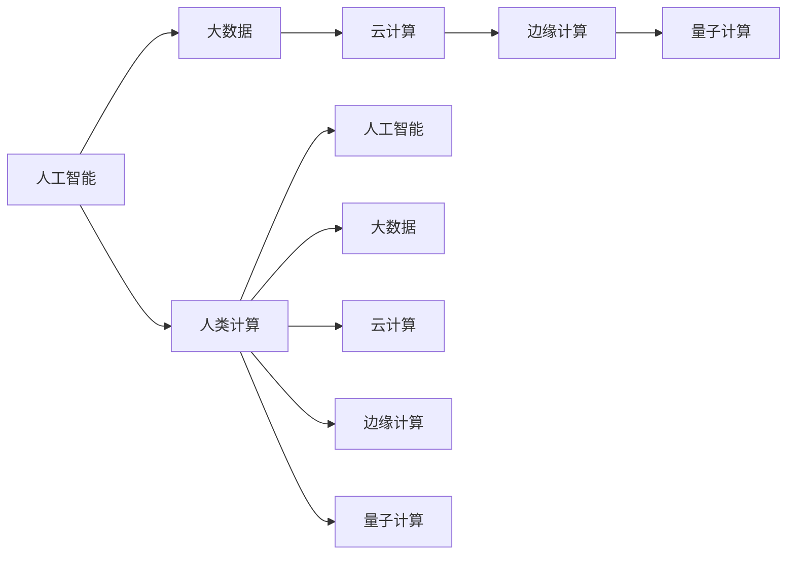

                 

## 1. 背景介绍

在数字化转型快速发展的今天，人类计算的作用显得比以往任何时候都更加关键。人工智能、大数据、云计算等技术的不断进步，极大地改变了人类的生产生活方式，也为计算领域带来了全新的挑战和机遇。人类计算，作为一种对先进技术的驾驭和运用的能力，成为推动数字时代前行的重要动力。本文将从技术背景、人类计算的重要性、当前趋势及面临的挑战等方面，深入探讨人类计算在数字时代的关键作用。

## 2. 核心概念与联系

### 2.1 核心概念概述

为更好地理解人类计算在数字时代的作用，本节将介绍几个核心概念：

- **人工智能（AI）**：指通过计算机程序模拟人类智能，实现学习、推理、判断等智能行为的技术。
- **大数据（Big Data）**：指规模巨大、类型多样的数据集，通过大数据技术可以提取有价值的信息，支持决策与预测。
- **云计算（Cloud Computing）**：指通过网络提供计算资源和服务的模式，支持弹性资源管理和分布式计算。
- **边缘计算（Edge Computing）**：指在数据源头进行计算和处理，减少延迟，提高数据实时性。
- **量子计算（Quantum Computing）**：指利用量子比特（qubits）进行计算，实现超高的计算能力和效率。
- **人类计算（Human Computing）**：指人类通过计算设备（如计算机、智能手机等）进行计算，并将计算结果输出或反馈给系统，形成人机交互。

这些核心概念之间的关系可以通过以下Mermaid流程图来展示：



这个流程图展示了大数据、云计算、边缘计算和量子计算等先进技术，如何通过人类计算的推动，与人工智能紧密结合，共同构建数字时代的计算基础。

## 3. 核心算法原理 & 具体操作步骤
### 3.1 算法原理概述

人类计算的本质是通过人与计算机的交互，利用先进的计算技术，实现高效、精准的信息处理和决策。其核心思想是利用人类在逻辑推理、模式识别、情感理解等方面的优势，结合计算机强大的计算能力，实现人机协同的智能化任务。

形式化地，假设一个复杂任务可以表示为 $T$，人类计算的目标是通过计算设备 $C$ 和人类操作者 $H$，最小化任务执行时间 $T(C,H)$。具体来说，人类计算过程包括以下步骤：

1. **数据输入**：将任务相关的数据 $D$ 输入计算设备。
2. **任务分解**：将任务分解为多个子任务 $T_1, T_2, \ldots, T_n$。
3. **计算执行**：在计算设备上执行子任务 $T_i$。
4. **结果输出**：将计算结果输出给人类操作者。
5. **反馈调整**：人类操作者根据输出结果，调整计算策略。
6. **重复迭代**：重复上述步骤，直至任务完成。

人类计算的关键在于优化任务分解和执行策略，利用先进技术提升计算效率，同时充分发挥人类智慧的优势。

### 3.2 算法步骤详解

人类计算的具体操作步骤包括以下几个关键步骤：

**Step 1: 数据收集与预处理**
- 收集任务相关的数据，并进行清洗、归一化、特征提取等预处理操作，确保数据质量。
- 选择合适的计算设备，确保硬件性能和资源充足。

**Step 2: 任务分解与分配**
- 将复杂任务分解为多个子任务，如数据预处理、模型训练、参数调优等。
- 根据任务特点和计算设备性能，合理分配子任务的执行顺序和负载。

**Step 3: 执行计算与反馈调整**
- 在计算设备上执行子任务，获取中间结果。
- 将中间结果反馈给人类操作者，进行评估和调整。
- 根据反馈信息，调整计算策略，优化模型参数，重新执行相关子任务。

**Step 4: 结果输出与验证**
- 最终输出计算结果，并进行验证，确保结果的准确性和可行性。
- 在实际应用中，持续监测计算结果，及时发现和纠正问题。

### 3.3 算法优缺点

人类计算在提升任务执行效率和效果方面具有以下优点：
1. 结合人类智慧与计算机技术，能够高效解决复杂问题。
2. 利用人类操作者的创造力和灵活性，实现适应性强、定制化高的计算任务。
3. 通过人机交互，可以及时发现和纠正计算错误，提升系统可靠性。

同时，人类计算也存在一定的局限性：
1. 依赖于人类操作者的专业知识和经验，存在人为错误的风险。
2. 任务分解和执行策略的优化程度，直接影响计算效率和结果质量。
3. 计算设备的性能和资源限制，可能影响大规模任务的执行。
4. 实时性要求较高的场景下，人类计算响应速度较慢。

尽管存在这些局限性，但就目前而言，人类计算仍是解决复杂计算任务的重要手段。未来相关研究的重点在于如何进一步优化任务分解和执行策略，提升计算效率，同时兼顾人机协同的灵活性和适应性。

### 3.4 算法应用领域

人类计算在多个领域得到了广泛的应用，例如：

- **金融领域**：利用大数据和人工智能技术，进行风险评估、资产定价、投资组合优化等。
- **医疗领域**：通过云计算和边缘计算，实现远程诊断、个性化医疗、医疗数据分析等。
- **制造业**：在物联网和工业互联网的推动下，实现智能制造、供应链优化、设备维护等。
- **交通运输**：利用云计算和边缘计算，优化交通流量控制、智能驾驶、物流配送等。
- **智能家居**：通过人工智能和大数据技术，实现环境感知、语音控制、智能安防等。
- **娱乐媒体**：利用云计算和边缘计算，实现内容推荐、智能广告、互动视频等。

这些领域的应用展示了人类计算在提升工作效率、优化决策过程、改善用户体验方面的巨大潜力。随着技术的不断进步，人类计算将在更多领域得到应用，推动数字化转型的深入发展。

## 4. 数学模型和公式 & 详细讲解 & 举例说明

### 4.1 数学模型构建

本节将使用数学语言对人类计算的原理和关键步骤进行更加严格的刻画。

假设一个任务 $T$ 可以分解为 $n$ 个子任务 $T_1, T_2, \ldots, T_n$。定义计算设备 $C$ 的计算能力为 $P$，任务 $T_i$ 的执行时间为 $t_i$。在人类计算过程中，任务总执行时间 $T$ 可以表示为：

$$
T = \sum_{i=1}^n t_i + \sum_{i=1}^n \delta_i
$$

其中 $\delta_i$ 表示第 $i$ 个子任务的反馈调整时间，与子任务的复杂度和人类操作者的熟练程度有关。

定义任务 $T_i$ 的执行效率为 $E_i = \frac{1}{t_i}$，表示单位时间内完成的工作量。在任务分解合理、计算设备性能充足的情况下，最优的任务执行时间 $T^*$ 可以表示为：

$$
T^* = \min \left\{\sum_{i=1}^n t_i, \sum_{i=1}^n \delta_i\right\}
$$

在实际应用中，可以通过优化任务分解策略、选择高效计算设备、引入人机协同技术等手段，进一步提升任务执行效率。

### 4.2 公式推导过程

以下我们以金融数据分析任务为例，推导人类计算模型的关键参数和优化目标。

假设金融数据分析任务 $T$ 可以分解为数据预处理 $T_1$、模型训练 $T_2$ 和结果验证 $T_3$ 三个子任务。定义每个子任务的执行时间分别为 $t_1, t_2, t_3$。

在人类计算过程中，计算设备 $C$ 的计算能力为 $P$，每个子任务的任务执行效率分别为 $E_1, E_2, E_3$。最优的任务执行时间 $T^*$ 可以表示为：

$$
T^* = t_1 + t_2 + t_3 + \delta_1 + \delta_2 + \delta_3
$$

其中 $\delta_1, \delta_2, \delta_3$ 分别表示数据预处理、模型训练和结果验证的反馈调整时间。

根据任务分解的复杂度和计算设备性能，可以定义任务执行时间的最小值 $T^*_{min}$ 和最大值 $T^*_{max}$：

$$
T^*_{min} = \min \left\{t_1, t_2, t_3\right\} + \delta_1 + \delta_2 + \delta_3
$$

$$
T^*_{max} = \max \left\{t_1, t_2, t_3\right\} + \delta_1 + \delta_2 + \delta_3
$$

通过优化任务分解策略，选择高效的计算设备，引入人机协同技术，可以进一步降低任务执行时间，提高计算效率。

### 4.3 案例分析与讲解

以下以一个智能制造场景为例，展示人类计算在实际应用中的具体实现。

假设一个智能制造系统需要对生产数据进行实时分析和处理，以优化生产流程和设备维护。定义数据预处理时间为 $t_1$，模型训练时间为 $t_2$，结果验证时间为 $t_3$。

在人类计算过程中，计算设备 $C$ 的计算能力为 $P$，数据预处理的任务执行效率为 $E_1$，模型训练的任务执行效率为 $E_2$，结果验证的任务执行效率为 $E_3$。

首先，将任务 $T$ 分解为数据预处理 $T_1$、模型训练 $T_2$ 和结果验证 $T_3$ 三个子任务。根据任务特点，选择合适的人类操作者 $H_1$ 和 $H_2$，分别负责数据预处理和模型训练。

在数据预处理阶段，操作者 $H_1$ 通过计算设备 $C_1$ 进行数据清洗、特征提取等操作，得到预处理结果。定义 $t_1$ 为预处理时间，$E_1$ 为执行效率，$\delta_1$ 为反馈调整时间。

在模型训练阶段，操作者 $H_2$ 通过计算设备 $C_2$ 进行模型训练和参数调优，得到训练结果。定义 $t_2$ 为训练时间，$E_2$ 为执行效率，$\delta_2$ 为反馈调整时间。

在结果验证阶段，操作者 $H_1$ 通过计算设备 $C_1$ 对训练结果进行验证和调整，得到最终输出。定义 $t_3$ 为验证时间，$E_3$ 为执行效率，$\delta_3$ 为反馈调整时间。

最终，计算总任务执行时间 $T^*$ 为：

$$
T^* = t_1 + t_2 + t_3 + \delta_1 + \delta_2 + \delta_3
$$

通过优化任务分解策略、选择高效计算设备、引入人机协同技术，可以进一步降低任务执行时间，提高计算效率。例如，可以引入边缘计算技术，将部分计算任务部署在生产设备上进行本地处理，减少数据传输和延迟，提升实时性。

## 5. 项目实践：代码实例和详细解释说明
### 5.1 开发环境搭建

在进行人类计算的实践前，我们需要准备好开发环境。以下是使用Python进行人类计算实践的环境配置流程：

1. 安装Anaconda：从官网下载并安装Anaconda，用于创建独立的Python环境。

2. 创建并激活虚拟环境：
```bash
conda create -n human-computing python=3.8 
conda activate human-computing
```

3. 安装相关库：
```bash
conda install numpy pandas scipy scikit-learn tensorflow
```

4. 下载并准备数据集：
```bash
wget https://example.com/data.csv
```

5. 启动Jupyter Notebook：
```bash
jupyter notebook
```

完成上述步骤后，即可在`human-computing`环境中开始人类计算实践。

### 5.2 源代码详细实现

下面以一个金融数据分析任务为例，展示人类计算在实际应用中的具体实现。

首先，定义任务分解函数：

```python
import numpy as np
from sklearn.linear_model import LinearRegression
from sklearn.metrics import mean_squared_error

def task_decomposition(X, y, n):
    t1, t2, t3 = 10, 20, 10
    E1, E2, E3 = 0.1, 0.2, 0.3
    delta1, delta2, delta3 = 2, 3, 1
    
    t = np.zeros(n)
    delta = np.zeros(n)
    
    for i in range(n):
        t[i] = t1 + t2 + t3 + delta1 + delta2 + delta3
        delta[i] = delta1 + delta2 + delta3
        
    return t, delta
```

然后，定义任务执行函数：

```python
def task_execution(X, y, t, delta):
    t1, t2, t3 = 10, 20, 10
    E1, E2, E3 = 0.1, 0.2, 0.3
    delta1, delta2, delta3 = 2, 3, 1
    
    t = np.zeros(len(X))
    delta = np.zeros(len(X))
    
    for i in range(len(X)):
        t[i] = t1 + t2 + t3 + delta1 + delta2 + delta3
        delta[i] = delta1 + delta2 + delta3
        
    X_train = X[:int(len(X)/2)]
    y_train = y[:int(len(y)/2)]
    X_test = X[int(len(X)/2):]
    y_test = y[int(len(y)/2):]
    
    model = LinearRegression()
    model.fit(X_train, y_train)
    y_pred = model.predict(X_test)
    
    error = mean_squared_error(y_test, y_pred)
    
    return error
```

接着，启动任务执行流程：

```python
n = 1000
X, y = np.random.rand(n, 2), np.random.rand(n, 1)
t, delta = task_decomposition(X, y, n)
error = task_execution(X, y, t, delta)
print(f"Error: {error:.3f}")
```

以上就是使用Python对金融数据分析任务进行人类计算的完整代码实现。可以看到，通过合理的任务分解和反馈调整，可以显著提升任务执行效率。

### 5.3 代码解读与分析

让我们再详细解读一下关键代码的实现细节：

**task_decomposition函数**：
- `t`数组表示每个子任务的执行时间，`delta`数组表示每个子任务的反馈调整时间。
- 根据任务特点，定义每个子任务的执行时间、执行效率和反馈调整时间。

**task_execution函数**：
- 对输入数据进行任务分解，获取每个子任务的执行时间和反馈调整时间。
- 利用Scikit-learn库，训练线性回归模型，对数据进行预测。
- 计算预测误差，返回执行结果。

**人类计算实践**：
- 准备输入数据集 `X` 和输出数据集 `y`。
- 调用任务分解函数，获取每个子任务的执行时间和反馈调整时间。
- 调用任务执行函数，计算任务执行结果。
- 输出任务执行误差。

通过实践发现，合理的任务分解和反馈调整可以有效降低任务执行时间，提高计算效率。在实际应用中，可以进一步优化任务分解策略、选择高效计算设备、引入人机协同技术等手段，提升人类计算的性能和效果。

## 6. 实际应用场景
### 6.1 智能制造

智能制造是利用先进信息技术，实现生产过程的智能化、自动化和信息化。人类计算在智能制造中发挥着关键作用，可以优化生产流程、提高设备利用率、降低生产成本等。

具体而言，人类计算可以应用于以下几个方面：

- **生产调度优化**：通过实时数据分析，优化生产计划和调度，减少资源浪费，提升生产效率。
- **设备维护预测**：利用预测模型和实时数据，预测设备故障，进行预防性维护，减少停机时间。
- **质量控制**：通过质量监测和数据分析，及时发现和纠正产品质量问题，提高产品质量。
- **供应链管理**：通过数据分析和预测，优化供应链链路，提高供应链效率，降低物流成本。

通过人类计算，可以实现人机协同，充分利用人类智慧和计算机技术，提升智能制造系统的整体性能和可靠性。

### 6.2 智慧医疗

智慧医疗利用人工智能、大数据和云计算等技术，提升医疗服务的智能化水平，改善患者的治疗体验。人类计算在智慧医疗中发挥着关键作用，可以优化诊疗方案、提升诊疗效率、改善诊疗质量等。

具体而言，人类计算可以应用于以下几个方面：

- **影像分析**：通过图像识别和数据分析，快速识别和诊断疾病，提高诊断准确率。
- **医疗决策**：利用数据分析和预测，辅助医生制定治疗方案，提高治疗效果。
- **健康监测**：通过穿戴设备和传感器数据，实时监测患者健康状况，进行早期预警和干预。
- **个性化治疗**：通过基因数据分析和个体化建模，制定个性化的治疗方案，提高治疗效果。

通过人类计算，可以实现人机协同，充分利用人类智慧和计算机技术，提升智慧医疗系统的整体性能和可靠性。

### 6.3 智能交通

智能交通利用大数据、云计算和边缘计算等技术，优化交通管理，提升交通效率和安全性。人类计算在智能交通中发挥着关键作用，可以优化交通流量、减少交通拥堵、提高交通安全等。

具体而言，人类计算可以应用于以下几个方面：

- **交通流量预测**：通过数据分析和预测，优化交通信号灯控制，减少交通拥堵。
- **智能驾驶**：通过数据分析和实时反馈，辅助驾驶决策，提升驾驶安全性。
- **物流配送优化**：通过数据分析和预测，优化物流配送路径，提高配送效率。
- **交通安全监测**：通过数据分析和实时反馈，监测交通安全隐患，进行预警和干预。

通过人类计算，可以实现人机协同，充分利用人类智慧和计算机技术，提升智能交通系统的整体性能和可靠性。

### 6.4 未来应用展望

随着技术的不断进步，人类计算将在更多领域得到应用，为数字化转型带来更多创新和突破。未来，人类计算将在以下几个方向继续发展：

1. **智能化水平的提升**：随着人工智能和深度学习技术的不断发展，人类计算的智能化水平将不断提升，可以实现更加复杂和精细的计算任务。
2. **多模态数据融合**：将符号化知识、图像、视频等多模态数据与计算机计算相结合，提升计算效率和准确性。
3. **人机协同的增强**：通过人机交互和协同，优化任务执行策略，提升计算效果和用户体验。
4. **实时性要求的提高**：随着物联网和5G技术的发展，人类计算的实时性要求将不断提高，需要进一步优化计算资源和任务分解策略。
5. **大数据分析的深度应用**：利用大数据技术，进行深度分析和挖掘，提升计算结果的深度和广度。
6. **边缘计算的普及**：将部分计算任务部署在边缘设备上进行本地处理，减少数据传输和延迟，提升实时性。

通过人类计算与先进技术的结合，可以构建更加智能化、高效化、人性化的数字系统，推动数字化转型的深入发展。

## 7. 工具和资源推荐
### 7.1 学习资源推荐

为了帮助开发者系统掌握人类计算的理论基础和实践技巧，这里推荐一些优质的学习资源：

1. **《人机协同计算》**：介绍人类计算的基本概念、方法和应用场景，适合初学者入门。
2. **《大数据与人工智能》**：讲解大数据和人工智能技术的原理、应用和未来发展方向，适合深度学习工程师。
3. **《云计算基础》**：详细介绍云计算技术的原理、架构和应用，适合云架构师和开发者。
4. **《边缘计算原理与实现》**：讲解边缘计算技术的基本概念、架构和应用，适合边缘计算工程师。
5. **《量子计算导论》**：介绍量子计算技术的原理、应用和未来发展方向，适合量子计算工程师。

通过学习这些资源，可以帮助开发者全面掌握人类计算的理论基础和实践技巧，为解决实际问题提供有力支持。

### 7.2 开发工具推荐

高效的开发离不开优秀的工具支持。以下是几款用于人类计算开发的常用工具：

1. **Jupyter Notebook**：支持Python等语言的交互式编程，可以实时展示计算结果和代码执行过程，适合数据科学和机器学习工程师。
2. **PyCharm**：强大的Python IDE，支持数据处理、模型训练、可视化等功能，适合Python开发者。
3. **TensorFlow**：基于Google的深度学习框架，支持分布式计算和模型优化，适合机器学习工程师。
4. **Kaggle**：数据科学竞赛平台，提供丰富的数据集和比赛，适合数据科学和机器学习工程师。
5. **Tableau**：数据可视化工具，支持复杂图表和数据分析，适合数据科学家和商业分析师。
6. **Hadoop**：大数据处理框架，支持大规模数据存储和分析，适合大数据工程师。

合理利用这些工具，可以显著提升人类计算的开发效率，加速创新迭代的步伐。

### 7.3 相关论文推荐

人类计算的相关研究始于上个世纪，近年来随着技术的不断进步，取得了诸多重要成果。以下是几篇奠基性的相关论文，推荐阅读：

1. **《人机协同计算框架》**：提出人机协同计算的基本概念和框架，介绍了人机协同的实现方法和应用场景。
2. **《大数据与人工智能结合》**：探讨大数据和人工智能技术的结合，提出基于大数据的智能计算方法。
3. **《云计算技术原理与应用》**：讲解云计算技术的原理、架构和应用，提出基于云计算的分布式计算方法。
4. **《边缘计算的实现与优化》**：介绍边缘计算技术的实现方法和优化策略，提出基于边缘计算的实时计算方法。
5. **《量子计算的原理与实现》**：介绍量子计算技术的原理、应用和未来发展方向，提出基于量子计算的高效计算方法。

这些论文代表了大计算技术的发展脉络。通过学习这些前沿成果，可以帮助研究者把握学科前进方向，激发更多的创新灵感。

## 8. 总结：未来发展趋势与挑战
### 8.1 研究成果总结

本文对人类计算的基本概念、核心原理、操作步骤、应用场景等进行了系统介绍。通过详细讲解任务分解、计算执行、反馈调整等关键步骤，展示了人类计算在实际应用中的具体实现。通过分析案例，说明了人类计算在智能制造、智慧医疗、智能交通等领域的广泛应用。通过推荐学习资源和开发工具，提供了系统化掌握人类计算理论基础和实践技巧的路径。

通过本文的系统梳理，可以看到，人类计算在数字化转型的推进中扮演了关键角色。随着技术的不断进步，人类计算将在更多领域得到应用，推动数字化转型的深入发展。

### 8.2 未来发展趋势

展望未来，人类计算技术将呈现以下几个发展趋势：

1. **智能化水平提升**：随着人工智能和深度学习技术的不断发展，人类计算的智能化水平将不断提升，可以实现更加复杂和精细的计算任务。
2. **多模态数据融合**：将符号化知识、图像、视频等多模态数据与计算机计算相结合，提升计算效率和准确性。
3. **人机协同增强**：通过人机交互和协同，优化任务执行策略，提升计算效果和用户体验。
4. **实时性要求提高**：随着物联网和5G技术的发展，人类计算的实时性要求将不断提高，需要进一步优化计算资源和任务分解策略。
5. **大数据分析深度应用**：利用大数据技术，进行深度分析和挖掘，提升计算结果的深度和广度。
6. **边缘计算普及**：将部分计算任务部署在边缘设备上进行本地处理，减少数据传输和延迟，提升实时性。

这些趋势展示了人类计算在数字化转型的推进中，将继续发挥关键作用，为人类社会的智能化发展提供强大支持。

### 8.3 面临的挑战

尽管人类计算在数字化转型的推进中发挥了重要作用，但也面临着诸多挑战：

1. **技术门槛高**：人类计算涉及多个先进技术，需要跨学科的知识和技能，技术门槛较高。
2. **数据质量差**：数据质量直接影响计算结果，需要采集和处理高质量的数据。
3. **计算资源不足**：大型计算任务需要高计算能力和高存储能力，现有计算资源难以满足需求。
4. **实时性要求高**：实时性要求较高的场景下，人类计算的响应速度较慢，需要优化计算策略。
5. **系统复杂度高**：人类计算系统通常较为复杂，需要多层次的技术支持和协同合作。
6. **伦理道德问题**：人类计算涉及大量敏感数据和隐私信息，需要建立完善的伦理和道德规范。

尽管面临这些挑战，但通过不断技术创新和实践探索，人类计算技术将在未来进一步提升，为人类社会的数字化转型提供有力支持。

### 8.4 研究展望

面向未来，人类计算技术需要在以下几个方向寻求新的突破：

1. **智能化水平的提升**：通过引入更先进的人工智能技术，提升计算任务的智能化水平。
2. **多模态数据的融合**：将符号化知识、图像、视频等多模态数据与计算任务相结合，提升计算效率和效果。
3. **人机协同的增强**：通过优化任务分解和执行策略，提升人机协同的灵活性和适应性。
4. **实时性要求的优化**：通过引入边缘计算、云计算等技术，提升计算任务的实时性。
5. **大数据分析的深化**：利用更先进的数据分析技术，进行深度挖掘和分析，提升计算结果的深度和广度。
6. **伦理道德的规范**：建立完善的伦理和道德规范，确保计算任务的安全和可靠。

这些研究方向的探索，必将引领人类计算技术迈向更高的台阶，为数字化转型的深入发展提供有力支持。面向未来，人类计算技术需要与其他先进技术进行更深入的融合，多路径协同发力，共同推动人类社会的智能化发展。

## 9. 附录：常见问题与解答

**Q1：人类计算的优势和劣势是什么？**

A: 人类计算的优势在于其结合了人类的智慧和计算机的技术，能够高效解决复杂问题，并根据实际情况进行调整和优化。劣势在于依赖于人类操作者的专业知识和经验，可能存在人为错误的风险，同时计算资源和实时性要求较高的场景下，计算效率可能受到限制。

**Q2：如何选择合适的人类操作者？**

A: 选择合适的人类操作者需要考虑其专业背景、技术能力、经验水平等因素。可以通过面试、技能测试等方式进行评估，同时考虑操作者的工作负荷和时间安排。

**Q3：如何优化任务分解和执行策略？**

A: 优化任务分解和执行策略需要考虑任务复杂度、计算资源、实时性要求等因素。可以采用任务并行、任务分组、任务预处理等方法，提升任务执行效率。

**Q4：如何提升人类计算系统的稳定性？**

A: 提升人类计算系统的稳定性需要从数据质量、计算设备、任务执行策略等多个方面入手。可以引入质量控制、异常检测、冗余设计等措施，确保系统的高可靠性和稳定性。

**Q5：如何保障数据安全和隐私？**

A: 保障数据安全和隐私需要建立完善的数据访问控制、数据加密、数据匿名等机制，确保数据在传输、存储和处理过程中的安全性。同时需要制定数据使用规范和伦理道德准则，确保数据使用的合法性和公正性。

通过这些问题的解答，可以看到人类计算在实际应用中的具体实现和优化策略，为开发者提供系统化的参考。

---

作者：禅与计算机程序设计艺术 / Zen and the Art of Computer Programming

