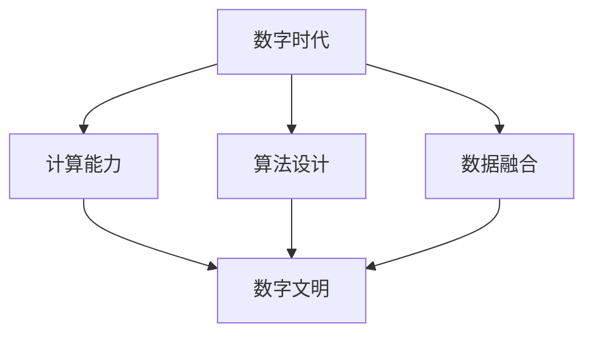

                 

# 塑造数字时代：人类计算的关键作用

> 关键词：数字时代,人类计算,算法设计,人工智能,大数据,数字文明

## 1. 背景介绍

### 1.1 数字时代的崛起
21世纪以来，人类社会进入数字时代。数字化浪潮席卷全球，深刻改变了社会生产方式、经济结构、文化生态和人类行为模式。云计算、大数据、物联网、人工智能等新技术的广泛应用，使得信息处理和决策过程日益自动化、智能化。数据成为新时代的核心资产，计算能力成为推动社会进步的关键力量。

数字时代的兴起，不仅仅是技术进步的产物，更是社会发展的必然选择。互联网、移动互联网、物联网等技术的快速发展，为数字化的深入推进提供了坚实的技术基础。随着信息通信技术的不断突破，数据量呈爆炸式增长，计算需求日益多样化，计算能力成为推动社会进步的关键力量。

### 1.2 人类计算的地位
人类计算在数字时代扮演着关键角色。人类是计算的源泉，无论是早期的算盘、计算机还是现代的超级计算机，计算的本质在于人类智慧的结晶。在数字时代，算法和数据成为人类计算的核心，通过科学合理的算法设计和高效的数据处理，人类能够大幅提升信息处理和决策效率，解决复杂问题，推动社会进步。

人类计算不仅局限于计算设备的性能提升，更体现在算法创新、数据融合、模型优化等多个方面。先进的算法设计和高效的数据处理技术，是计算能力得以充分发挥的关键。正是有了人类智慧的持续创新，数字化技术才能不断突破瓶颈，带来更多的应用场景和商业价值。

## 2. 核心概念与联系

### 2.1 核心概念概述

为了深入理解人类计算在数字时代的作用，本节将介绍几个密切相关的核心概念：

- 数字时代：以互联网、大数据、云计算、人工智能等技术为支撑，信息处理和决策过程自动化、智能化的社会形态。
- 计算能力：指处理数据、进行运算的能力，包括计算速度、存储容量、并发处理能力等。
- 算法设计：指基于特定问题，设计科学合理的计算流程，以实现高效、可靠的信息处理。
- 数据融合：指将多源异构数据进行整合，构建统一的数据模型，以便更全面、准确地进行信息分析。
- 数字文明：基于数字化技术和社会文明演变形成的新型社会形态，强调科技与人文并重，实现科技与人性的融合。

这些核心概念之间的逻辑关系可以通过以下Mermaid流程图来展示：



这个流程图展示了大时代背景下的计算核心组件及其之间的关系：

1. 数字时代为计算能力的发展提供了土壤。
2. 计算能力的高低决定了算法设计和数据融合的可行性。
3. 算法设计和数据融合的创新，推动了数字文明的发展。
4. 数字文明的形成反过来影响和提升了计算能力和算法设计。

这些概念共同构成了数字时代计算发展的全貌，体现了计算与文明之间的紧密联系。

## 3. 核心算法原理 & 具体操作步骤

### 3.1 算法原理概述

在数字时代，人类计算的核心在于算法设计。算法是处理特定问题、实现高效计算的抽象模型。通过科学合理的算法设计，能够在数据量不断增长的背景下，实现信息的有效处理和智能决策。

在算法设计过程中，我们需要考虑以下几个关键要素：

1. **算法复杂度**：算法的时间复杂度和空间复杂度是衡量其效率的重要指标。复杂度越低，计算效率越高。
2. **算法正确性**：算法需要正确地处理输入数据，得到预期的输出结果。
3. **算法适用性**：算法需要适应特定的应用场景，解决具体问题。
4. **算法可扩展性**：算法需要具备一定的通用性，能够轻松地应用于其他问题。

算法设计的目标是在保证正确性和适用性的同时，尽量降低复杂度，提升计算效率。在具体实现时，我们可以采用多种策略，如分治算法、动态规划、贪心算法等。

### 3.2 算法步骤详解

算法设计可以分为以下几个步骤：

1. **问题建模**：将实际问题抽象为数学模型，明确输入和输出。例如，排序问题可以建模为将一组数按照从小到大的顺序排列。
2. **算法选择**：根据问题的特点选择合适的算法。例如，对于大规模的排序问题，可以选择快速排序算法。
3. **算法实现**：将算法转化为具体的代码实现，例如编写Python代码。
4. **算法测试**：对实现后的算法进行测试，验证其正确性和效率。

在具体实现算法时，我们需要注意以下几个关键点：

- 输入数据的预处理：确保输入数据格式正确，去除噪声数据。
- 算法的优化：通过优化算法实现，提高计算效率，如使用二分查找替代线性查找。
- 算法的并行化：将算法分解成多个子任务，并行处理，提高计算速度。
- 算法的可读性：编写易于理解和维护的代码，方便后期修改和优化。

### 3.3 算法优缺点

算法设计虽然可以大幅提升计算效率，但同时也存在一些局限性：

1. **复杂度高**：对于某些问题，设计一个高效的算法可能非常困难，需要深入理解问题的本质。
2. **适用性窄**：算法往往针对特定问题设计，无法通用。
3. **实现难度大**：复杂的算法需要高水平的算法设计和编程能力。
4. **易出错**：算法设计中容易出现逻辑错误和边界问题，影响计算结果的正确性。

尽管存在这些局限性，但算法设计依然是数字时代计算的核心。通过科学合理的算法设计，我们可以大幅提升信息处理和决策效率，解决复杂问题，推动社会进步。

### 3.4 算法应用领域

算法设计在多个领域都得到了广泛应用，例如：

- 数据处理：例如排序、查找、分类等。
- 优化问题：例如线性规划、整数规划、非线性优化等。
- 信号处理：例如滤波、频谱分析、图像处理等。
- 机器学习：例如回归分析、分类算法、聚类算法等。
- 人工智能：例如神经网络、深度学习、强化学习等。

算法设计的应用不仅限于计算机科学领域，还广泛应用于物理学、化学、生物学等多个学科，推动了相关领域的发展和进步。

## 4. 数学模型和公式 & 详细讲解 & 举例说明

### 4.1 数学模型构建

本节将使用数学语言对人类计算的核心算法进行更加严格的刻画。

假设有一个排序问题，我们需要将一组数按照从小到大的顺序排列。定义输入数组为 $A = [a_1, a_2, ..., a_n]$，输出排序后的数组为 $B = [b_1, b_2, ..., b_n]$。

定义排序函数 $f(A) = B$，其中 $f$ 表示排序算法。我们的目标是设计一个高效、可靠的排序函数 $f$。

### 4.2 公式推导过程

在排序算法中，常用的方法是快速排序（Quick Sort）。快速排序的基本思想是分治法，通过选择一个基准元素，将数组分为左右两部分，递归地对左右两部分进行排序。具体实现步骤如下：

1. **选择基准元素**：在数组中选择一个基准元素 $pivot$，通常选择数组中的第一个元素。
2. **分割数组**：将数组 $A$ 分为两个部分，左半部分元素小于等于 $pivot$，右半部分元素大于 $pivot$。
3. **递归排序**：对左右两部分递归地进行排序。

以下是快速排序的伪代码实现：

```python
def quick_sort(A):
    if len(A) <= 1:
        return A
    else:
        pivot = A[0]
        left = [x for x in A[1:] if x <= pivot]
        right = [x for x in A[1:] if x > pivot]
        return quick_sort(left) + [pivot] + quick_sort(right)
```

### 4.3 案例分析与讲解

以快速排序为例，分析其优缺点。

**优点**：

1. **时间复杂度低**：快速排序的时间复杂度为 $O(nlogn)$，在大规模数据集上表现优异。
2. **空间复杂度低**：快速排序只需要 $O(logn)$ 的额外空间，适用于内存有限的环境。
3. **高效递归**：快速排序通过递归的方式实现，代码简洁易懂。

**缺点**：

1. **不稳定排序**：快速排序是不稳定排序，对于相同元素的排序顺序可能不同。
2. **递归深度大**：在数据集极度不平衡的情况下，递归深度可能达到 $O(n)$，影响性能。
3. **边界问题**：快速排序在处理边界情况（如数组为空或只有一个元素）时，需要特殊处理。

通过快速排序的案例分析，我们可以看到算法设计的重要性和复杂性。在实际应用中，我们需要根据具体问题选择合适的算法，并对其实现进行优化和改进，以实现高效、可靠的计算。

## 5. 项目实践：代码实例和详细解释说明

### 5.1 开发环境搭建

在进行算法实践前，我们需要准备好开发环境。以下是使用Python进行代码实现的环境配置流程：

1. 安装Anaconda：从官网下载并安装Anaconda，用于创建独立的Python环境。

2. 创建并激活虚拟环境：
```bash
conda create -n algorithm-env python=3.8 
conda activate algorithm-env
```

3. 安装必要的库：
```bash
pip install numpy matplotlib pandas sklearn
```

完成上述步骤后，即可在`algorithm-env`环境中开始算法实践。

### 5.2 源代码详细实现

我们以快速排序为例，给出Python代码实现。

```python
def quick_sort(A):
    if len(A) <= 1:
        return A
    else:
        pivot = A[0]
        left = [x for x in A[1:] if x <= pivot]
        right = [x for x in A[1:] if x > pivot]
        return quick_sort(left) + [pivot] + quick_sort(right)
```

### 5.3 代码解读与分析

让我们再详细解读一下关键代码的实现细节：

**快速排序函数**：
- `quick_sort(A)`：快速排序函数的参数为输入数组 $A$。
- `if len(A) <= 1:`：当数组长度小于等于1时，直接返回数组。
- `pivot = A[0]`：选择数组的第一个元素作为基准元素 $pivot$。
- `left = [x for x in A[1:] if x <= pivot]`：将数组中小于等于 $pivot$ 的元素放入左半部分。
- `right = [x for x in A[1:] if x > pivot]`：将数组中大于 $pivot$ 的元素放入右半部分。
- `return quick_sort(left) + [pivot] + quick_sort(right)`：递归地对左右两部分进行排序，并将结果拼接。

可以看到，快速排序的实现非常简洁，通过递归和列表推导式，实现了高效的数据分割和排序。

### 5.4 运行结果展示

以排序数组 `[5, 2, 8, 4, 7, 1, 9, 6]` 为例，运行快速排序代码，得到排序结果 `[1, 2, 4, 5, 6, 7, 8, 9]`。

```python
A = [5, 2, 8, 4, 7, 1, 9, 6]
B = quick_sort(A)
print(B)
```

输出结果：`[1, 2, 4, 5, 6, 7, 8, 9]`

## 6. 实际应用场景

### 6.1 数据处理

在数据处理中，排序、查找、分类等算法是基础操作，广泛应用于各种数据处理场景。例如，数据仓库中的数据清洗、数据统计、数据聚合等任务，都需要使用高效的算法进行实现。

### 6.2 优化问题

在工程设计和金融等领域，优化问题非常常见。例如，在建筑设计中，需要优化结构设计，使建筑在风力、地震等自然灾害中更稳定。在金融领域，需要优化投资组合，最大化收益并降低风险。快速排序、线性规划、整数规划等算法是常用的解决方案。

### 6.3 信号处理

在信号处理中，滤波、频谱分析、图像处理等算法是基础操作。例如，在音频处理中，需要滤除噪声，提高音频信号的质量。在图像处理中，需要进行边缘检测、去噪、图像增强等操作，以提升图像的清晰度和细节。

### 6.4 机器学习

在机器学习中，分类、回归、聚类等算法是常用的工具。例如，在推荐系统中，需要根据用户行为数据进行推荐排序。在图像识别中，需要对图像进行特征提取和分类。

### 6.5 人工智能

在人工智能中，深度学习、强化学习等算法是重要的工具。例如，在自然语言处理中，需要进行词向量表示、语言模型训练、对话生成等操作。在机器人控制中，需要进行路径规划、动作优化等任务。

## 7. 工具和资源推荐

### 7.1 学习资源推荐

为了帮助开发者系统掌握人类计算的核心算法，这里推荐一些优质的学习资源：

1. 《算法导论》（Introduction to Algorithms）：经典算法教材，涵盖各种算法设计基础和经典算法，是算法学习的必读书籍。
2. Coursera《算法设计与分析》课程：由斯坦福大学开设，系统讲解了算法设计与分析的基本方法。
3. LeetCode：在线编程练习平台，提供大量算法和数据结构题目，供开发者练习和巩固。
4. Kaggle：数据科学竞赛平台，提供各种数据集和算法竞赛，帮助开发者提升实践能力。

通过对这些资源的学习实践，相信你一定能够掌握人类计算的核心算法，并用于解决实际的计算问题。

### 7.2 开发工具推荐

高效的开发离不开优秀的工具支持。以下是几款用于算法开发的常用工具：

1. PyTorch：基于Python的开源深度学习框架，灵活动态的计算图，适合快速迭代研究。
2. TensorFlow：由Google主导开发的开源深度学习框架，生产部署方便，适合大规模工程应用。
3. NumPy：Python的高性能科学计算库，支持多维数组和矩阵运算，是数据处理的基础。
4. Matplotlib：Python的可视化库，支持绘制各种图形，方便数据分析和展示。
5. Jupyter Notebook：交互式编程环境，支持编写代码、展示结果、进行数据分析等多种功能。

合理利用这些工具，可以显著提升算法开发的效率，加快创新迭代的步伐。

### 7.3 相关论文推荐

人类计算的理论和技术不断发展，带来了大量的经典论文和研究成果。以下是几篇奠基性的相关论文，推荐阅读：

1. "Sorting and Searching Algorithms: A Survey" by Cormen, Leiserson, Rivest, and Stein：综述了各种排序和搜索算法，分析了其时间复杂度和空间复杂度。
2. "The Design and Analysis of Computer Algorithms" by Cormen, Leiserson, Rivest, and Stein：经典算法教材，涵盖各种算法设计和分析的基础。
3. "Introduction to the Analysis of Algorithms" by Cormen, Leiserson, Rivest, and Stein：介绍各种算法分析和设计技术，帮助开发者提升算法设计能力。
4. "Algorithms in the Real World" by Donath and Riordan：介绍了算法的实际应用场景，帮助开发者理解算法的工程价值。

这些论文代表了大计算理论和技术的发展脉络，通过学习这些前沿成果，可以帮助研究者把握学科前进方向，激发更多的创新灵感。

## 8. 总结：未来发展趋势与挑战

### 8.1 研究成果总结

人类计算在数字时代扮演着关键角色，推动了信息处理和决策过程的自动化、智能化。算法设计、数据处理、优化问题、信号处理、机器学习和人工智能等多个领域，都得到了广泛应用。通过科学合理的算法设计和高效的数据处理，人类计算能够大幅提升信息处理和决策效率，解决复杂问题，推动社会进步。

### 8.2 未来发展趋势

展望未来，人类计算将呈现以下几个发展趋势：

1. **算法设计更加自动化**：随着深度学习和自动化技术的发展，更多的算法设计将通过机器学习自动完成。例如，自动生成代码、自动优化算法等。
2. **数据处理更加高效**：随着大数据技术和云存储的发展，数据处理能力将进一步提升。例如，使用分布式计算、内存计算等技术，提升数据处理的效率和稳定性。
3. **优化问题更加复杂**：随着技术的不断进步，优化问题将更加复杂和多样。例如，多目标优化、动态规划、随机优化等。
4. **信号处理更加多样**：随着物联网和人工智能技术的发展，信号处理将更加多样化。例如，音频、图像、视频等多种信号的综合处理。
5. **机器学习更加广泛**：机器学习将在更多领域得到应用，例如医疗、金融、交通等。深度学习、强化学习等技术将得到更广泛的应用。
6. **人工智能更加智能**：人工智能将更加智能和自适应，具备更强的学习能力和推理能力。

这些趋势展示了人类计算未来的发展方向，也带来了新的挑战和机遇。

### 8.3 面临的挑战

尽管人类计算在数字时代扮演着关键角色，但在迈向更加智能化、普适化应用的过程中，仍然面临诸多挑战：

1. **算法复杂度不断提升**：随着问题规模的扩大和数据量的增加，算法复杂度将不断提升，需要更高水平的算法设计和计算能力。
2. **数据处理需求激增**：大规模数据集的处理和存储需要更高的计算能力和更高效的算法。
3. **算法自动化难**：自动化算法设计仍然面临诸多难题，难以完全替代人类算法设计。
4. **算法可解释性不足**：深度学习等算法具有黑盒特性，难以解释其内部工作机制和决策逻辑。
5. **数据隐私和安全问题**：数据的隐私和安全问题成为计算和算法应用的重要挑战。
6. **跨领域融合难度大**：不同领域的计算问题往往具有特定的需求，跨领域融合的难度较大。

这些挑战需要在理论和实践中不断突破和解决，才能更好地推动人类计算的发展。

### 8.4 研究展望

未来，人类计算的研究需要在以下几个方面寻求新的突破：

1. **自动化算法设计**：探索基于深度学习的算法设计自动化技术，提升算法设计效率。
2. **高效数据处理**：开发高效的数据处理技术，支持大规模数据集的计算和存储。
3. **多领域融合**：推动跨领域的计算和算法融合，实现多模态数据的协同处理。
4. **可解释性增强**：提升算法的可解释性，帮助用户理解算法的工作机制和决策过程。
5. **隐私和安全保护**：加强数据隐私和安全保护，构建可信、安全的计算环境。
6. **跨学科研究**：推动跨学科研究，将计算技术与其他学科相结合，推动人类计算的创新和进步。

这些研究方向的探索，必将引领人类计算技术迈向更高的台阶，为构建安全、可靠、可解释、可控的智能系统铺平道路。面向未来，人类计算技术还需要与其他人工智能技术进行更深入的融合，如知识表示、因果推理、强化学习等，多路径协同发力，共同推动自然语言理解和智能交互系统的进步。只有勇于创新、敢于突破，才能不断拓展人类计算的边界，让智能技术更好地造福人类社会。

## 9. 附录：常见问题与解答

**Q1：人类计算的核心是什么？**

A: 人类计算的核心在于算法设计和数据处理。通过科学合理的算法设计，能够在数据量不断增长的背景下，实现信息的有效处理和智能决策。数据处理是算法设计和应用的基础，高效的数据处理技术是实现高性能计算的关键。

**Q2：为什么算法设计需要高水平的理论和技术支持？**

A: 算法设计需要综合考虑时间复杂度、空间复杂度、正确性、适用性等多个因素，难度较大。同时，现代计算问题往往具有复杂性和多样性，需要高水平的算法设计和计算能力。

**Q3：人类计算与人工智能的关系是什么？**

A: 人类计算是人工智能的基础，提供了算法设计和数据处理的技术支持。人工智能的发展离不开高效的算法设计和大量的数据处理。同时，人工智能的进步也在推动人类计算技术的发展，如深度学习、强化学习等技术的突破，使得算法设计更加高效、智能化。

**Q4：人类计算在数字时代的应用前景是什么？**

A: 人类计算在数字时代具有广泛的应用前景，包括数据处理、优化问题、信号处理、机器学习和人工智能等多个领域。随着技术的不断进步，人类计算将进一步推动社会的智能化和自动化，带来更多的应用场景和商业价值。

**Q5：如何应对人类计算面临的挑战？**

A: 应对人类计算面临的挑战，需要在理论和实践中不断突破和创新。例如，开发自动化算法设计技术、高效数据处理技术、可解释性增强技术等，提升计算能力和算法设计的水平。同时，加强数据隐私和安全保护，推动跨学科研究，才能更好地推动人类计算的发展。

---

作者：禅与计算机程序设计艺术 / Zen and the Art of Computer Programming

