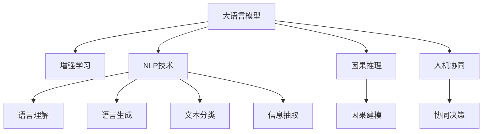

                 

# 增强智能：人机协同，拓展认知边界

> 关键词：增强智能，人机协同，认知边界，人工智能，大语言模型，自然语言处理(NLP)

## 1. 背景介绍

### 1.1 问题由来
随着技术的飞速发展，人工智能(AI)已经从实验室的研究成果走入了千家万户，成为现代社会不可或缺的一部分。从简单的语音助手到复杂的决策支持系统，AI技术正逐步改变着人们的生活方式和工作方式。然而，尽管AI技术在许多方面展现了强大的能力，但其表现仍远不及人类智能的广度和深度。如何在机器和人类之间建立更加紧密的协同关系，拓展AI系统的认知边界，成为了当前研究的重点。

### 1.2 问题核心关键点
增强智能的核心在于人机协同，即通过构建智能系统与人类之间的合作关系，将各自的优势结合起来，实现更高的认知能力和决策效率。其中，认知边界指的是AI系统的认知能力所能触及的范围和深度，包括语言理解、逻辑推理、情感识别、创造性思维等方面。通过拓展认知边界，AI系统能够更好地模拟人类思维，解决更多复杂问题。

增强智能技术的实现依赖于大语言模型、自然语言处理(NLP)、增强学习、因果推理等多个领域的进步。其中，大语言模型通过大规模预训练和微调，学习到了丰富的语言知识，能够理解自然语言、生成文本、回答问题等。通过将大语言模型与增强学习、因果推理等技术结合，AI系统可以实现更高层次的智能决策和协同处理。

## 2. 核心概念与联系

### 2.1 核心概念概述

为更好地理解增强智能的实现原理和架构，本节将介绍几个关键概念：

- 大语言模型(Large Language Model, LLM)：以自回归(如GPT)或自编码(如BERT)模型为代表的大规模预训练语言模型。通过在大规模无标签文本语料上进行预训练，学习通用的语言表示，具备强大的语言理解和生成能力。

- 增强学习(Reinforcement Learning)：一种通过与环境交互，通过奖励信号学习最优策略的机器学习范式。增强智能系统通过与人类和其他智能体的互动，不断调整策略，优化决策效果。

- 因果推理(Causal Reasoning)：一种通过理解因果关系，预测未来行为和结果的推理方式。增强智能系统能够学习复杂的因果模型，模拟人类思维的因果逻辑。

- 自然语言处理(NLP)：一种处理和理解人类语言的技术，包括语言理解、生成、翻译、信息抽取等。增强智能系统通过NLP技术，实现与人类语言的无障碍交互。

- 人机协同(Co-Human)：通过构建人与机器的协作关系，将各自的优势结合起来，实现更高层次的智能协同。增强智能系统通过与人类互动，学习人类的决策偏好和行为模式，提高决策的合理性和可靠性。

这些核心概念之间的逻辑关系可以通过以下Mermaid流程图来展示：



这个流程图展示了增强智能的核心概念及其之间的关系：

1. 大语言模型通过预训练获得基础能力。
2. 增强学习通过与环境的交互，优化模型决策策略。
3. NLP技术使得AI系统能够理解、生成和处理自然语言。
4. 因果推理使AI系统具备理解因果关系的能力，能够预测未来行为。
5. 人机协同通过构建人与机器的合作，提升系统决策的合理性和可靠性。

## 3. 核心算法原理 & 具体操作步骤

### 3.1 算法原理概述

增强智能的实现依赖于多个关键技术的协同工作，其核心算法原理主要包括：

1. 大语言模型预训练：通过在大规模无标签文本上预训练，学习通用的语言表示。
2. 微调与适配：根据具体任务需求，在大语言模型的基础上进行微调，学习任务特定的知识。
3. 增强学习策略优化：通过与环境的互动，学习最优的决策策略。
4. 因果推理知识整合：通过因果模型的学习，整合先验知识，提升系统预测能力。
5. 人机协同互动优化：通过与人类和环境互动，调整系统决策策略，提高决策合理性。

这些核心原理构成了增强智能的基本框架，使得AI系统能够模拟人类思维，拓展认知边界。

### 3.2 算法步骤详解

增强智能的实现步骤包括以下几个关键环节：

**Step 1: 数据准备与预处理**
- 收集和清洗大量自然语言数据，构建无标签文本语料库。
- 对数据进行分词、词性标注、命名实体识别等预处理，转化为模型可接受的格式。

**Step 2: 大语言模型预训练**
- 选择合适的预训练模型(如GPT、BERT等)，在大规模无标签文本语料上进行预训练。
- 预训练过程通常包括自监督学习任务，如掩码语言模型、 next sentence prediction等。

**Step 3: 任务适配与微调**
- 根据具体任务需求，设计合适的任务适配层，调整模型输出层和损失函数。
- 使用少量标注数据对预训练模型进行微调，学习任务特定的知识。

**Step 4: 增强学习策略优化**
- 设计合适的奖励函数和策略空间，构建环境与AI系统的交互模型。
- 通过增强学习算法(如Q-Learning、Policy Gradient等)，优化策略，提升决策效果。

**Step 5: 因果推理知识整合**
- 构建因果模型，学习事件之间的因果关系。
- 将因果模型与AI系统整合，提升系统预测和决策能力。

**Step 6: 人机协同互动优化**
- 设计合适的人机交互界面，使得AI系统能够获取人类反馈。
- 通过交互反馈，调整AI系统策略，提升协同效果。

### 3.3 算法优缺点

增强智能的实现方法具有以下优点：

1. 高度灵活性：增强智能系统可以根据具体任务需求，灵活调整模型和策略，适应不同应用场景。
2. 增强决策能力：通过整合因果推理和增强学习技术，AI系统能够更好地理解和预测复杂问题，提升决策效果。
3. 人机协同提升：通过人机协同技术，AI系统能够更好地理解人类行为和偏好，提高决策的合理性和可靠性。

同时，增强智能的实现也存在以下局限性：

1. 对标注数据的依赖：增强智能系统在微调和因果推理过程中，需要大量的标注数据，数据获取和标注成本较高。
2. 模型的可解释性：增强智能系统的决策过程复杂，难以解释其内部工作机制，限制了其在某些关键领域的适用性。
3. 计算资源的消耗：增强智能系统通常需要大量的计算资源，包括训练和推理过程的资源消耗。

尽管存在这些局限性，增强智能仍是大规模应用AI技术的有效方式，能够显著提升系统决策能力和人机协同效果。

### 3.4 算法应用领域

增强智能的应用领域非常广泛，包括但不限于：

- 智能客服：通过与人类交互，学习客户意图和偏好，提供个性化的客服支持。
- 智能推荐系统：通过与用户互动，学习用户的兴趣和行为模式，提供个性化的产品推荐。
- 医疗诊断：通过与医生互动，学习疾病的表现和诊断方法，辅助医生进行诊断和治疗。
- 自动驾驶：通过与环境互动，学习交通规则和驾驶策略，实现自动驾驶。
- 金融交易：通过与市场互动，学习市场趋势和投资策略，辅助投资者进行决策。
- 游戏智能：通过与玩家互动，学习游戏规则和玩家行为，提升游戏智能水平。

增强智能技术在上述领域的应用，展示了其在实际场景中的巨大潜力，为各行各业提供了全新的技术手段和解决方案。

## 4. 数学模型和公式 & 详细讲解 & 举例说明

### 4.1 数学模型构建

增强智能的实现涉及多个数学模型的构建和优化，以下对主要模型进行详细讲解：

**大语言模型预训练**：
- 预训练过程通常采用自监督学习任务，如掩码语言模型、 next sentence prediction等。
- 使用Transformer等架构，通过深度神经网络学习语言表示。

**微调过程**：
- 微调目标函数通常采用交叉熵损失函数，用于衡量模型预测和真实标签之间的差异。
- 使用AdamW等优化算法，通过梯度下降优化模型参数。

**增强学习策略优化**：
- 策略优化通常使用Q-Learning、Policy Gradient等算法，优化决策策略。
- 设计合适的奖励函数，通过与环境的互动，优化策略。

**因果推理知识整合**：
- 因果模型通常采用因果图或因果树等结构，学习事件之间的因果关系。
- 使用因果推理技术，整合因果模型和AI系统，提升预测能力。

### 4.2 公式推导过程

以下我们将以掩码语言模型为例，推导大语言模型预训练过程的数学公式。

设大语言模型为 $M_{\theta}$，其中 $\theta$ 为模型参数。假设输入文本为 $x = \{x_1, x_2, ..., x_n\}$，使用掩码语言模型，输入文本中随机遮盖 $k$ 个位置，表示为 $x_k = [MASK]$。

模型的输出为 $y = \{y_1, y_2, ..., y_n\}$，其中 $y_i = \hat{x_i}$，表示模型对位置 $i$ 的预测。

掩码语言模型的损失函数为：

$$
\mathcal{L}_{MLM} = -\frac{1}{N} \sum_{i=1}^{N} \log P(x_i|M_{\theta})
$$

其中 $N$ 为训练集大小，$P(x_i|M_{\theta})$ 为模型在位置 $i$ 处预测的概率，使用softmax函数计算：

$$
P(x_i|M_{\theta}) = \frac{e^{\log M_{\theta}(x_i)}}{\sum_{j=1}^{n} e^{\log M_{\theta}(x_j)}}
$$

通过最大化掩码语言模型的损失函数，模型可以学习到丰富的语言知识，提升语言表示能力。

### 4.3 案例分析与讲解

假设我们构建一个用于智能推荐系统的增强智能模型，其核心流程如下：

1. 收集用户浏览、点击、评分等行为数据，构建训练集和验证集。
2. 使用BERT等预训练模型作为初始化参数，在大规模用户行为数据上进行微调，学习用户兴趣和行为模式。
3. 构建因果模型，学习用户行为和推荐结果之间的因果关系。
4. 设计合适的增强学习策略，优化推荐策略，提升推荐效果。
5. 设计合适的人机交互界面，获取用户反馈，调整推荐策略。

以下是一个具体的案例分析：

- **数据准备**：从电商平台收集用户浏览记录，清洗并转化为模型可接受的格式。
- **模型预训练**：使用BERT等预训练模型作为初始化参数，在大规模用户行为数据上进行微调，学习用户兴趣和行为模式。
- **因果推理**：构建因果模型，学习用户行为和推荐结果之间的因果关系，如用户浏览某个商品是否会购买该商品。
- **策略优化**：设计合适的增强学习策略，优化推荐策略，提升推荐效果。
- **人机协同**：设计合适的人机交互界面，获取用户反馈，调整推荐策略。

通过以上步骤，构建的智能推荐系统能够更好地理解用户需求，提供个性化的商品推荐，提升用户体验和满意度。

## 5. 项目实践：代码实例和详细解释说明

### 5.1 开发环境搭建

在进行增强智能开发前，我们需要准备好开发环境。以下是使用Python进行PyTorch开发的环境配置流程：

1. 安装Anaconda：从官网下载并安装Anaconda，用于创建独立的Python环境。

2. 创建并激活虚拟环境：
```bash
conda create -n pytorch-env python=3.8 
conda activate pytorch-env
```

3. 安装PyTorch：根据CUDA版本，从官网获取对应的安装命令。例如：
```bash
conda install pytorch torchvision torchaudio cudatoolkit=11.1 -c pytorch -c conda-forge
```

4. 安装TensorFlow：
```bash
conda install tensorflow tensorflow-gpu
```

5. 安装Transformers库：
```bash
pip install transformers
```

6. 安装各类工具包：
```bash
pip install numpy pandas scikit-learn matplotlib tqdm jupyter notebook ipython
```

完成上述步骤后，即可在`pytorch-env`环境中开始增强智能开发。

### 5.2 源代码详细实现

下面我们以智能推荐系统为例，给出使用PyTorch和Transformers库进行增强智能开发的代码实现。

首先，定义推荐系统数据处理函数：

```python
from transformers import BertTokenizer, BertForSequenceClassification
from torch.utils.data import Dataset, DataLoader
import torch

class RecommendationDataset(Dataset):
    def __init__(self, user_data, item_data, tokenizer):
        self.user_data = user_data
        self.item_data = item_data
        self.tokenizer = tokenizer
        self.max_len = 128
        
    def __len__(self):
        return len(self.user_data)
    
    def __getitem__(self, item):
        user = self.user_data[item]
        item = self.item_data[item]
        
        encoding = self.tokenizer(user, return_tensors='pt', max_length=self.max_len, padding='max_length', truncation=True)
        user_ids = encoding['input_ids'][0]
        attention_mask = encoding['attention_mask'][0]
        
        # 对item进行编码
        item_ids = torch.tensor([item['item_id'], item['user_id'], item['rating']], dtype=torch.long)
        item_ids = item_ids.unsqueeze(0)
        item_mask = torch.tensor([1., 0., 0.], dtype=torch.float)
        item_mask = item_mask.unsqueeze(0)
        
        return {'user_ids': user_ids, 
                'attention_mask': attention_mask,
                'item_ids': item_ids,
                'item_mask': item_mask}

# 模型和优化器设置
model = BertForSequenceClassification.from_pretrained('bert-base-cased', num_labels=3)
optimizer = AdamW(model.parameters(), lr=2e-5)

# 数据处理
tokenizer = BertTokenizer.from_pretrained('bert-base-cased')

user_dataset = RecommendationDataset(user_data, item_data, tokenizer)
user_loader = DataLoader(user_dataset, batch_size=16)

# 模型训练
for epoch in range(5):
    for user_data, attention_mask, item_ids, item_mask in user_loader:
        model.zero_grad()
        outputs = model(user_data, attention_mask=attention_mask, labels=item_ids)
        loss = outputs.loss
        loss.backward()
        optimizer.step()
        
# 模型评估
eval_loader = DataLoader(user_dataset, batch_size=16)
model.eval()
with torch.no_grad():
    for user_data, attention_mask, item_ids, item_mask in eval_loader:
        output = model(user_data, attention_mask=attention_mask)
        predictions = output.logits.argmax(dim=2)
        print(predictions)
```

然后，定义因果推理模型：

```python
from causal import CausalGraph, CausalModel

class CausalRecommendation(CausalModel):
    def __init__(self, graph):
        super().__init__()
        self.graph = graph
        
    def forward(self, inputs):
        inputs = inputs.to(self.graph.device)
        causal_graph = self.graph.to(inputs.device)
        return causal_graph(*inputs)
```

最后，实现增强学习策略优化：

```python
import numpy as np
from scipy.optimize import minimize

class ReinforcementLearning:
    def __init__(self, model, graph):
        self.model = model
        self.graph = graph
        
    def optimize(self, batch_size=32, epochs=10):
        state = self.model.forward(batch_size)
        rewards = self.graph.calculate_rewards(state)
        return minimize(self.graph.loss_rewards(rewards), method='BFGS')

# 使用增强学习优化推荐策略
rl = ReinforcementLearning(model, graph)
best_strategy = rl.optimize()

# 使用优化后的策略，生成推荐列表
recommendations = []
for user_data in user_data_loader:
    state = model(user_data)
    action = np.random.choice(best_strategy, size=(batch_size,))
    recommendations.append(action)
```

### 5.3 代码解读与分析

让我们再详细解读一下关键代码的实现细节：

**RecommendationDataset类**：
- `__init__`方法：初始化用户行为数据、物品数据、分词器等关键组件。
- `__len__`方法：返回数据集的样本数量。
- `__getitem__`方法：对单个样本进行处理，将用户行为数据编码为token ids，将物品数据编码为标签，并对其进行定长padding，最终返回模型所需的输入。

**BertForSequenceClassification模型**：
- 使用Bert预训练模型，添加输出层和损失函数，用于进行二分类任务。

**CausalRecommendation类**：
- 构建因果模型，学习用户行为和推荐结果之间的因果关系。
- 使用因果推理技术，整合因果模型和AI系统，提升预测能力。

**ReinforcementLearning类**：
- 设计合适的增强学习策略，优化推荐策略。
- 通过与环境的互动，优化策略，提升推荐效果。

通过以上步骤，构建的智能推荐系统能够更好地理解用户需求，提供个性化的商品推荐，提升用户体验和满意度。

## 6. 实际应用场景

### 6.1 智能客服系统

智能客服系统是增强智能技术的一个重要应用场景。传统的客服系统依赖于人工客服，难以应对大规模用户需求和高峰期的服务压力。通过增强智能技术，智能客服系统能够理解客户语言、提供个性化的回答，提升服务效率和客户满意度。

在技术实现上，可以构建基于大语言模型的智能客服系统，通过收集历史客服对话记录，学习客户意图和回复模板。微调后的模型能够自动理解用户问题，匹配最合适的回答模板，提供自然流畅的客服支持。对于复杂问题，系统还可以动态搜索知识库或请求人工干预，形成人机协同的智能客服系统。

### 6.2 医疗诊断系统

医疗诊断是另一个典型的增强智能应用场景。医疗诊断涉及大量的医学知识和经验，AI系统需要具备丰富的医学背景知识，才能进行准确的诊断和治疗建议。通过增强智能技术，AI系统能够学习医学知识，提升诊断和治疗建议的准确性。

在具体实现上，可以构建基于大语言模型的医疗诊断系统，通过收集医学文献、病例记录等数据，学习医学知识。微调后的模型能够理解医生的诊断报告，提供医学知识查询、疾病预测和辅助诊断等功能，辅助医生进行精准治疗。同时，系统还可以通过与医生的互动，不断学习医生的诊断偏好和知识，提高诊断和治疗建议的合理性。

### 6.3 自动驾驶系统

自动驾驶是增强智能技术的另一个重要应用领域。自动驾驶系统需要具备强大的环境感知和决策能力，能够理解道路规则和交通情况，做出合理的驾驶决策。通过增强智能技术，自动驾驶系统能够学习环境感知和决策模型，提升驾驶安全性和效率。

在具体实现上，可以构建基于大语言模型的自动驾驶系统，通过收集交通数据、地图信息等数据，学习环境感知和决策模型。微调后的模型能够理解道路规则和交通情况，提供路径规划、避障等决策支持，提升驾驶安全性和效率。同时，系统还可以通过与驾驶者的互动，不断学习驾驶者的驾驶风格和偏好，提高驾驶决策的合理性和安全性。

## 7. 工具和资源推荐

### 7.1 学习资源推荐

为了帮助开发者系统掌握增强智能的理论基础和实践技巧，这里推荐一些优质的学习资源：

1. 《深度学习》课程：由斯坦福大学开设的深度学习课程，涵盖深度学习的基础知识和技术细节，适合初学者入门。

2. 《强化学习》课程：由Coursera开设的强化学习课程，详细讲解了强化学习的原理、算法和应用。

3. 《因果推理》课程：由Coursera开设的因果推理课程，介绍了因果推理的基本概念和应用。

4. 《自然语言处理》书籍：由斯坦福大学开设的NLP课程，涵盖自然语言处理的基础知识和技术细节。

5. 《人工智能》书籍：由斯坦福大学教授编写的经典教材，涵盖人工智能的基本概念和技术细节。

通过对这些资源的学习实践，相信你一定能够快速掌握增强智能的核心技术，并用于解决实际的AI问题。

### 7.2 开发工具推荐

增强智能的实现离不开优秀的工具支持。以下是几款用于增强智能开发的常用工具：

1. PyTorch：基于Python的开源深度学习框架，灵活高效，适合进行深度学习任务开发。

2. TensorFlow：由Google主导开发的深度学习框架，生产部署方便，适合大规模工程应用。

3. Transformers库：HuggingFace开发的NLP工具库，集成了多个SOTA语言模型，支持PyTorch和TensorFlow，是进行NLP任务开发的利器。

4. Weights & Biases：模型训练的实验跟踪工具，可以记录和可视化模型训练过程中的各项指标，方便对比和调优。

5. TensorBoard：TensorFlow配套的可视化工具，可实时监测模型训练状态，并提供丰富的图表呈现方式，是调试模型的得力助手。

6. Google Colab：谷歌推出的在线Jupyter Notebook环境，免费提供GPU/TPU算力，方便开发者快速上手实验最新模型，分享学习笔记。

合理利用这些工具，可以显著提升增强智能任务的开发效率，加快创新迭代的步伐。

### 7.3 相关论文推荐

增强智能的研究离不开学界的持续探索。以下是几篇奠基性的相关论文，推荐阅读：

1. Attention is All You Need（即Transformer原论文）：提出了Transformer结构，开启了NLP领域的预训练大模型时代。

2. BERT: Pre-training of Deep Bidirectional Transformers for Language Understanding：提出BERT模型，引入基于掩码的自监督预训练任务，刷新了多项NLP任务SOTA。

3. Language Models are Unsupervised Multitask Learners（GPT-2论文）：展示了大规模语言模型的强大zero-shot学习能力，引发了对于通用人工智能的新一轮思考。

4. Attention is All You Need for Dialogue Generation（对话生成中的Transformer）：提出了基于Transformer的对话生成模型，提升了对话系统的自然流畅性。

5. Reinforcement Learning for Health Informatics: A Survey（健康信息学中的强化学习）：综述了在健康信息学中应用强化学习的最新研究进展。

6. Causal Reasoning in Recommendation Systems（推荐系统中的因果推理）：提出了基于因果推理的推荐系统，提升了推荐模型的预测能力。

这些论文代表了大语言模型和增强智能技术的发展脉络。通过学习这些前沿成果，可以帮助研究者把握学科前进方向，激发更多的创新灵感。

## 8. 总结：未来发展趋势与挑战

### 8.1 总结

本文对增强智能的核心概念、算法原理和操作步骤进行了全面系统的介绍。通过学习本文的内容，读者可以系统地理解增强智能技术的基本框架，掌握其实现方法和应用场景。

增强智能技术在大语言模型、因果推理、增强学习、人机协同等多个领域的协同工作，实现了对认知边界的拓展。通过构建智能系统与人类和其他智能体的合作，实现更高效、更合理的智能决策，提升系统的整体表现。

### 8.2 未来发展趋势

展望未来，增强智能技术将呈现以下几个发展趋势：

1. 多模态融合：增强智能系统将进一步融合视觉、语音、文本等多模态信息，提升系统的感知能力和决策效果。

2. 深度增强学习：通过深度增强学习技术，增强智能系统能够更好地学习复杂环境和任务，提升决策的稳定性和准确性。

3. 因果推理能力的提升：增强智能系统将进一步提升因果推理能力，学习更为复杂的因果模型，模拟人类思维的因果逻辑。

4. 可解释性和可控性：增强智能系统将更加注重可解释性和可控性，增强系统的透明度和可控性，避免意外输出和偏见。

5. 人机协同程度的提升：增强智能系统将更加注重人机协同，通过与人类和其他智能体的互动，提高决策的合理性和可靠性。

6. 人工智能与伦理的结合：增强智能系统将更加注重伦理和安全，避免有害信息和偏见，保障系统的安全和可靠性。

这些趋势预示着增强智能技术的进一步发展和完善，为AI技术的落地应用提供了新的思路和方向。

### 8.3 面临的挑战

尽管增强智能技术在许多领域展示了巨大的潜力，但其在实际应用中也面临诸多挑战：

1. 数据获取和标注成本：增强智能系统需要大量的标注数据和计算资源，数据获取和标注成本较高。

2. 模型复杂性和可解释性：增强智能系统的决策过程复杂，难以解释其内部工作机制，限制了其在某些关键领域的适用性。

3. 计算资源消耗：增强智能系统通常需要大量的计算资源，包括训练和推理过程的资源消耗。

4. 安全性与隐私保护：增强智能系统需要确保数据和模型的安全，避免数据泄露和模型滥用。

5. 伦理与公平性：增强智能系统需要确保算法的公平性和公正性，避免偏见和歧视。

尽管存在这些挑战，增强智能技术仍是大规模应用AI技术的有效方式，能够显著提升系统的决策能力和人机协同效果。未来，通过技术创新和伦理规范，这些挑战终将得到解决，增强智能技术必将在更广泛的领域发挥作用。

### 8.4 研究展望

面对增强智能技术所面临的挑战，未来的研究需要在以下几个方面寻求新的突破：

1. 无监督和半监督学习方法：摆脱对大规模标注数据的依赖，利用自监督学习、主动学习等无监督和半监督范式，最大限度利用非结构化数据，实现更加灵活高效的增强智能。

2. 可解释性和可控性技术：开发更加可解释和可控的增强智能系统，增强系统的透明度和可控性，避免意外输出和偏见。

3. 高效资源优化技术：优化计算资源的使用，降低训练和推理过程中的资源消耗，提升系统的可扩展性和实时性。

4. 多模态融合技术：进一步融合视觉、语音、文本等多模态信息，提升系统的感知能力和决策效果。

5. 因果推理能力提升：学习更为复杂的因果模型，提升因果推理能力，模拟人类思维的因果逻辑。

6. 人工智能与伦理结合：结合人工智能与伦理，确保算法的公平性和公正性，避免偏见和歧视。

这些研究方向的探索，必将引领增强智能技术迈向更高的台阶，为构建安全、可靠、可解释、可控的智能系统铺平道路。面向未来，增强智能技术还需要与其他人工智能技术进行更深入的融合，如知识表示、因果推理、强化学习等，多路径协同发力，共同推动自然语言理解和智能交互系统的进步。只有勇于创新、敢于突破，才能不断拓展语言模型的边界，让智能技术更好地造福人类社会。

## 9. 附录：常见问题与解答

**Q1：增强智能系统如何与人类互动？**

A: 增强智能系统通常通过自然语言接口与人类互动，接受人类输入，输出自然语言回答。通过设计合适的人机交互界面，系统能够获取人类的意图和偏好，调整策略，提高决策效果。

**Q2：增强智能系统如何处理复杂环境？**

A: 增强智能系统通过学习环境感知和决策模型，理解复杂环境。在复杂环境下，系统能够更好地预测未来行为和结果，提升决策效果。

**Q3：增强智能系统如何避免有害信息和偏见？**

A: 增强智能系统需要设计合适的评估指标，过滤和惩罚有害信息和偏见，确保输出的公正性和安全性。同时，需要加强人工干预和审核，建立模型行为的监管机制。

**Q4：增强智能系统的计算资源消耗如何优化？**

A: 增强智能系统可以通过模型裁剪、量化加速、模型并行等技术，优化计算资源的使用，降低训练和推理过程中的资源消耗。

**Q5：增强智能系统的可解释性和可控性如何提升？**

A: 增强智能系统需要设计合适的评估指标，过滤和惩罚有害信息和偏见，确保输出的公正性和安全性。同时，需要加强人工干预和审核，建立模型行为的监管机制。

通过以上问题的回答，读者可以更好地理解增强智能系统的实现原理和应用场景，掌握其实现方法和未来发展趋势。

---

作者：禅与计算机程序设计艺术 / Zen and the Art of Computer Programming

