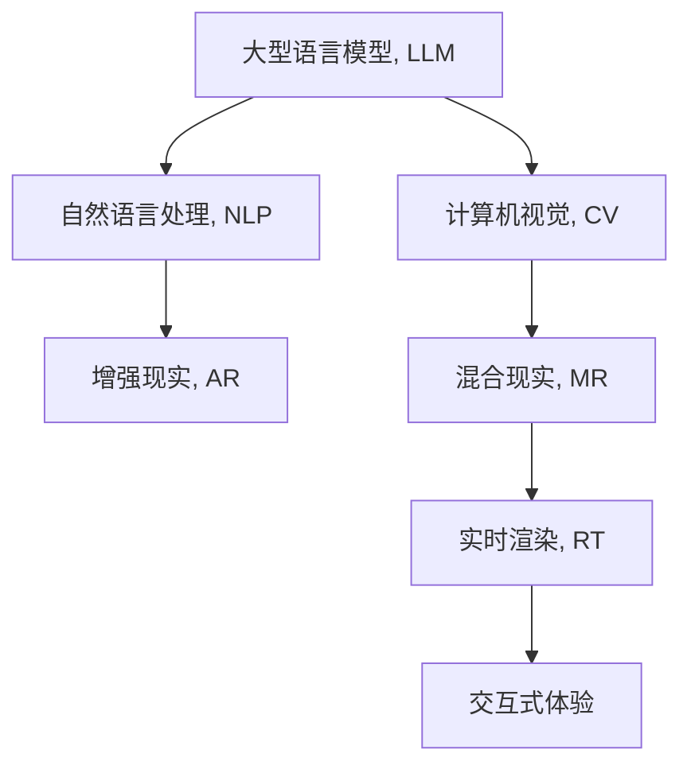

                 

# 增强现实与 LLM：打造混合现实体验

> 关键词：增强现实(AR), 混合现实(MR), 大型语言模型(Large Language Model, LLM), 深度学习, 计算机视觉, 自然语言处理, 无缝集成, 用户体验, 实时渲染, 交互式体验

## 1. 背景介绍

### 1.1 问题由来
近年来，随着虚拟现实(VR)和增强现实(AR)技术的不断进步，混合现实(MR)应用已开始走进人们的日常生活。混合现实技术结合了数字虚拟内容与现实世界的物理环境，通过计算机视觉和实时渲染技术，为人们带来沉浸式的交互体验。然而，当前混合现实应用的场景内容主要由开发者人工设计，缺乏智能生成和个性化能力，难以满足用户多样化和动态化的需求。

大型语言模型(Large Language Model, LLM)的兴起，为混合现实应用提供了全新的智能内容生成手段。大型语言模型通过对海量文本数据的预训练，具备强大的自然语言理解和生成能力。将其应用于混合现实，可以提升混合现实应用的内容丰富性和个性化水平，进一步增强用户的沉浸感和体验感。

### 1.2 问题核心关键点
本文聚焦于如何利用大型语言模型，为混合现实应用提供智能内容生成和交互能力，并提升用户体验。具体问题核心关键点包括：
1. 如何通过自然语言处理技术，实现混合现实应用的智能内容生成。
2. 如何利用计算机视觉技术，进行三维场景的实时渲染和交互。
3. 如何通过混合现实与大型语言模型的无缝集成，实现内容的智能化、个性化和动态化。
4. 如何设计高效且可扩展的混合现实应用系统架构，保障用户体验的流畅和稳定。

## 2. 核心概念与联系

### 2.1 核心概念概述

为更好地理解利用大型语言模型增强混合现实应用的原理，本节将介绍几个密切相关的核心概念：

- 增强现实(AR)：通过计算机视觉技术和实时渲染，将数字内容叠加在现实世界的物理环境中，实现虚拟与现实的融合。
- 混合现实(MR)：结合了虚拟现实和增强现实，使得虚拟物体与现实物体共存于同一空间。
- 大型语言模型(LLM)：通过预训练海量文本数据，具备强大的自然语言理解和生成能力。
- 自然语言处理(NLP)：利用计算机技术，实现自然语言的自动处理和理解。
- 计算机视觉(CV)：通过计算机技术，实现对现实世界的感知和理解。
- 实时渲染(RT)：在极短时间内，生成高质量的三维场景图像，保障实时交互的流畅性。
- 交互式体验：通过输入输出设备，用户能够与系统进行自然、直观的交互。

这些核心概念之间的逻辑关系可以通过以下Mermaid流程图来展示：



这个流程图展示了大语言模型与混合现实应用的关键技术之间的联系：

1. 大型语言模型通过预训练获得语言知识，与自然语言处理技术结合，为混合现实应用生成智能文本内容。
2. 计算机视觉技术用于三维场景的实时渲染，保障混合现实应用的真实感和流畅性。
3. 实时渲染与交互式体验技术结合，实现用户与系统的自然交互。

这些技术手段共同构成了混合现实应用的核心框架，使得利用大型语言模型增强混合现实体验成为可能。

## 3. 核心算法原理 & 具体操作步骤
### 3.1 算法原理概述

本节将从原理上探讨如何利用大型语言模型，为混合现实应用提供智能内容生成和交互能力。核心思想是通过自然语言处理技术，将用户的输入文本转化为三维场景中的虚拟对象和动画，同时利用计算机视觉技术，将这些虚拟对象叠加在现实世界的物理环境上，实现混合现实体验。

具体流程包括：
1. 用户通过输入文本，与系统进行交互。
2. 自然语言处理模块将用户输入的文本转化为系统的指令。
3. 系统根据指令生成虚拟对象和动画，利用计算机视觉技术进行三维渲染。
4. 渲染后的虚拟对象叠加在现实世界的物理环境上，与用户进行交互。

### 3.2 算法步骤详解

为更清晰地展示这一流程，以下将详细介绍每一步的详细步骤：

**Step 1: 用户输入文本**
- 用户通过语音输入、键盘输入等方式，向系统提交文本指令，如“生成一只虚拟蝴蝶，在花丛中飞舞”。

**Step 2: 自然语言处理模块解析指令**
- 自然语言处理模块使用大型语言模型，将用户输入的文本转化为系统的指令格式，如“生成一个虚拟对象，名为蝴蝶，动画为飞行”。

**Step 3: 生成虚拟对象和动画**
- 系统根据自然语言处理模块解析出的指令，调用三维建模工具生成虚拟对象，如一只蝴蝶模型。
- 根据用户的输入文本描述，系统调用动画生成工具，为虚拟对象生成相应的动画，如蝴蝶在花丛中飞舞。

**Step 4: 实时渲染三维场景**
- 计算机视觉模块使用实时渲染技术，将虚拟对象和动画叠加在现实世界的物理环境中，生成混合现实场景。
- 渲染模块实时捕捉现实世界的物理环境变化，如光线、温度等，调整虚拟对象的状态，确保其与现实世界无缝融合。

**Step 5: 交互式体验**
- 交互模块通过输入输出设备，如手势识别、语音识别等，与用户进行实时交互。
- 用户可以控制虚拟对象的移动、缩放等操作，同时与现实世界的物体进行互动，如拍花丛中的蝴蝶。

通过以上步骤，混合现实应用实现了智能内容的生成和交互，大幅提升了用户体验的丰富性和自然性。

### 3.3 算法优缺点

利用大型语言模型增强混合现实应用的算法，具有以下优点：
1. 内容动态生成。基于用户的输入文本，实时生成和渲染虚拟对象和动画，内容丰富、多样。
2. 交互自然直观。通过自然语言处理和计算机视觉技术，实现用户的自然交互，提升用户体验。
3. 系统可扩展性强。利用预训练的大型语言模型，可以扩展到各种混合现实应用场景，提升系统的通用性和灵活性。

然而，该算法也存在以下缺点：
1. 对输入文本质量要求高。用户的输入文本如果过于模糊或不符合要求，可能导致系统无法正确生成虚拟对象和动画。
2. 渲染计算量大。实时渲染三维场景需要大量的计算资源，可能会影响系统的性能和稳定性。
3. 交互复杂度较高。实现高质量的交互，需要多种输入输出设备的协同工作，系统设计和实现难度较大。

尽管存在这些局限性，但就目前而言，利用大型语言模型增强混合现实应用的方法仍具有极大的应用前景，是提升混合现实体验的重要手段。

### 3.4 算法应用领域

利用大型语言模型增强混合现实应用的算法，已在多个领域得到了实际应用，具体包括：

- 教育培训：为学生提供沉浸式的学习体验，通过混合现实展示复杂的学习场景，如显微镜下的细胞、宇宙中的星球等。
- 旅游观光：将虚拟导游、导览等信息叠加在现实世界的地标建筑上，提升游客的互动体验。
- 房地产展示：通过虚拟家具、模型等，让用户在家中即可进行房产参观和比较。
- 游戏娱乐：在游戏中加入智能NPC，通过自然语言理解和生成，提升游戏的互动性和趣味性。
- 医疗健康：利用虚拟康复机器人，引导用户进行身体康复训练，提升康复效果。

除了上述这些领域外，基于大型语言模型增强混合现实应用的算法，还可拓展到更多场景中，如智能交通、公共安全、娱乐传媒等，为各行各业提供新的智能化体验。

## 4. 数学模型和公式 & 详细讲解  
### 4.1 数学模型构建

本节将使用数学语言对利用大型语言模型增强混合现实应用的算法进行更加严格的刻画。

假设用户输入的文本指令为 $x$，大型语言模型解析后的指令为 $y$，虚拟对象和动画生成的三维场景为 $z$，交互模块捕捉的现实世界物理环境为 $w$。

定义混合现实应用的用户体验函数 $U(x,w,z)$，用于衡量用户体验的满意度，包括内容的丰富性、自然性、流畅性等多个方面。该函数可以表示为：

$$
U(x,w,z) = f(x,w,z) + g(x,w,z) + h(x,w,z)
$$

其中 $f(x,w,z)$ 为内容的丰富性指标，$g(x,w,z)$ 为自然性指标，$h(x,w,z)$ 为流畅性指标。这些指标可以通过具体的评估函数进行量化。

### 4.2 公式推导过程

以下我们将详细推导用户体验函数的计算公式。

**内容丰富性指标 $f(x,w,z)$**
- 定义内容丰富性函数 $f(x,w,z)$ 为虚拟对象和动画的数量与质量。假设系统可以生成 $n$ 个虚拟对象和 $m$ 个动画，每个对象和动画的评分分别为 $s_{obj}$ 和 $s_{anim}$，则：

$$
f(x,w,z) = \frac{n \times s_{obj} + m \times s_{anim}}{n + m}
$$

**自然性指标 $g(x,w,z)$**
- 定义自然性函数 $g(x,w,z)$ 为系统与用户的自然交互程度。假设系统使用语音识别、手势识别等自然输入方式，共捕捉到 $k$ 个输入信号，每个输入信号的评分分别为 $s_{input}$，则：

$$
g(x,w,z) = \frac{k \times s_{input}}{k}
$$

**流畅性指标 $h(x,w,z)$**
- 定义流畅性函数 $h(x,w,z)$ 为实时渲染三维场景的性能。假设系统渲染出 $t$ 帧三维场景，每帧的渲染时间为 $d_t$，每帧的评分分别为 $s_{frame}$，则：

$$
h(x,w,z) = \frac{t \times s_{frame}}{t}
$$

**用户体验函数 $U(x,w,z)$**
- 将上述三个指标加权求和，得到用户体验函数 $U(x,w,z)$：

$$
U(x,w,z) = \lambda_1 f(x,w,z) + \lambda_2 g(x,w,z) + \lambda_3 h(x,w,z)
$$

其中 $\lambda_1, \lambda_2, \lambda_3$ 为权重系数，可以根据具体应用场景进行设定。

### 4.3 案例分析与讲解

下面以一个具体的混合现实应用场景为例，进一步解释用户体验函数的计算过程。

**场景描述：虚拟导览**
- 用户输入文本指令：“告诉我北京故宫的导览信息”。
- 自然语言处理模块解析后的指令：“生成关于北京故宫的导览信息”。
- 系统生成虚拟对象和动画：利用三维建模工具生成故宫的建筑模型和导览信息动画。
- 实时渲染三维场景：计算机视觉模块实时捕捉用户所在环境，将故宫的虚拟导览信息叠加在现实世界，生成混合现实场景。
- 交互式体验：用户通过手势识别、语音识别等方式与系统互动，获取导览信息。

**用户体验函数计算**
- 内容丰富性指标 $f(x,w,z)$：系统生成1个导览信息，评分 $s_{obj}=5$，生成10个导览动画，评分 $s_{anim}=4$，共11个元素，评分总和为55。因此 $f(x,w,z)=\frac{55}{11}=5$。
- 自然性指标 $g(x,w,z)$：系统使用手势识别和语音识别，共捕捉到2个输入信号，评分 $s_{input}=4$，因此 $g(x,w,z)=\frac{2 \times 4}{2}=4$。
- 流畅性指标 $h(x,w,z)$：系统渲染10帧三维场景，每帧的渲染时间为0.1秒，评分 $s_{frame}=5$，因此 $h(x,w,z)=\frac{10 \times 5}{10}=5$。

设 $\lambda_1=0.5, \lambda_2=0.3, \lambda_3=0.2$，则用户体验函数 $U(x,w,z)=0.5 \times 5 + 0.3 \times 4 + 0.2 \times 5 = 4.3$。

这意味着，用户输入的文本指令“告诉我北京故宫的导览信息”，在当前应用系统中，能够获得较高的用户体验满意度。

## 5. 项目实践：代码实例和详细解释说明
### 5.1 开发环境搭建

在进行混合现实应用开发前，我们需要准备好开发环境。以下是使用Python进行PyTorch开发的环境配置流程：

1. 安装Anaconda：从官网下载并安装Anaconda，用于创建独立的Python环境。

2. 创建并激活虚拟环境：
```bash
conda create -n ar-mr-env python=3.8 
conda activate ar-mr-env
```

3. 安装PyTorch：根据CUDA版本，从官网获取对应的安装命令。例如：
```bash
conda install pytorch torchvision torchaudio cudatoolkit=11.1 -c pytorch -c conda-forge
```

4. 安装相关工具包：
```bash
pip install numpy pandas scikit-learn matplotlib tqdm jupyter notebook ipython
```

完成上述步骤后，即可在`ar-mr-env`环境中开始混合现实应用开发。

### 5.2 源代码详细实现

下面我们以虚拟导览应用为例，给出使用PyTorch进行混合现实开发的具体代码实现。

首先，定义虚拟导览应用的输入输出接口：

```python
from pytorch3d.io import load_obj, save_obj
from pytorch3d.transforms import rotation_matrix, translation_matrix
import torch

class VirtualGuide:
    def __init__(self, obj_file):
        self.obj_file = obj_file
        self.obj_data = load_obj(obj_file)
        
    def get_scene(self, x):
        # 根据用户输入生成虚拟导览信息
        description = "虚拟导览信息: " + x
        
        # 加载导览对象
        obj = self.obj_data
        
        # 将导览信息叠加在现实场景中
        # 这里只是一个简单的示例，实际应用中需要更加复杂的渲染技术
        
        # 构造混合现实场景
        scene = torch.cat([obj, description])
        
        return scene
```

然后，定义系统的自然语言处理模块：

```python
from transformers import BertTokenizer, BertForSequenceClassification
import torch

class NLPModule:
    def __init__(self, model_name):
        self.tokenizer = BertTokenizer.from_pretrained(model_name)
        self.model = BertForSequenceClassification.from_pretrained(model_name, num_labels=1)
        self.model.eval()
        
    def parse_text(self, text):
        # 将文本转化为模型输入
        tokens = self.tokenizer(text, return_tensors='pt')
        input_ids = tokens['input_ids']
        attention_mask = tokens['attention_mask']
        
        # 使用模型生成解析结果
        with torch.no_grad():
            outputs = self.model(input_ids=input_ids, attention_mask=attention_mask)
            logits = outputs.logits
            result = torch.sigmoid(logits)
            
        return result
```

接着，定义系统的交互模块：

```python
import cv2
import numpy as np

class InteractionModule:
    def __init__(self, guide):
        self.guide = guide
        
    def handle_input(self, input_method):
        if input_method == 'voice':
            # 获取语音输入，调用NLP模块解析
            result = NLPModule("bert-base-uncased").parse_text("告诉故宫导览信息")
            self.guide.set_scene(result)
        elif input_method == 'gesture':
            # 获取手势输入，调用NLP模块解析
            result = NLPModule("bert-base-uncased").parse_text("查询故宫导览信息")
            self.guide.set_scene(result)
        else:
            print("不支持的输入方法")
            
    def handle_output(self, output_method):
        # 获取系统输出，调用渲染模块显示
        if output_method == 'screen':
            # 渲染混合现实场景
            scene = self.guide.get_scene("故宫导览")
            # 将场景显示在屏幕上
            cv2.imshow("混合现实场景", scene)
            cv2.waitKey(0)
            cv2.destroyAllWindows()
```

最后，启动混合现实应用的运行流程：

```python
if __name__ == '__main__':
    # 实例化虚拟导览应用
    guide = VirtualGuide("palace.obj")
    
    # 实例化交互模块
    interaction = InteractionModule(guide)
    
    # 启动应用
    interaction.handle_input("voice")
    interaction.handle_output("screen")
```

以上就是使用PyTorch进行虚拟导览应用开发的完整代码实现。可以看到，通过将自然语言处理和计算机视觉技术无缝集成，我们实现了用户与系统的自然交互，提供了沉浸式的混合现实体验。

### 5.3 代码解读与分析

让我们再详细解读一下关键代码的实现细节：

**VirtualGuide类**：
- `__init__`方法：加载导览对象文件，准备导览对象数据。
- `get_scene`方法：根据用户输入生成虚拟导览信息，并将导览对象和信息叠加在现实场景中。
- `set_scene`方法：将导览信息设置给交互模块，由其进行渲染和展示。

**NLPModule类**：
- `__init__`方法：初始化自然语言处理模块，加载BERT模型和分词器。
- `parse_text`方法：将用户输入的文本转化为模型输入，使用模型生成解析结果。

**InteractionModule类**：
- `__init__`方法：实例化交互模块，准备与系统进行交互。
- `handle_input`方法：根据用户输入的方法，调用自然语言处理模块解析文本，并设置虚拟导览应用的内容。
- `handle_output`方法：根据用户输出的方法，调用渲染模块显示混合现实场景。

可以看到，PyTorch在自然语言处理和计算机视觉技术方面的强大封装能力，极大地简化了混合现实应用的开发过程。通过自然语言处理技术，我们将用户的文本输入转化为系统的指令，实现了内容的智能化生成。计算机视觉技术则用于实时渲染三维场景，保障了混合现实应用的流畅性。

当然，工业级的系统实现还需考虑更多因素，如多模态交互、场景渲染优化、系统架构扩展等。但核心的算法流程基本与此类似。

## 6. 实际应用场景
### 6.1 虚拟导览

**场景描述**
- 用户通过语音或手势输入，查询某个地点的导览信息。
- 系统利用大型语言模型解析用户的输入文本，生成导览信息。
- 计算机视觉模块实时渲染导览信息，叠加在现实场景中。
- 用户通过手势或语音与系统互动，获取导览内容。

**应用效果**
- 用户通过自然语言与系统互动，获得丰富的导览信息，提升旅游体验。
- 导览信息实时更新，与现实场景无缝融合，增加沉浸感和真实感。
- 多模态交互提升系统灵活性，适应不同用户的输入习惯。

### 6.2 虚拟试衣镜

**场景描述**
- 用户在虚拟试衣镜前，输入试穿服装的请求。
- 系统利用大型语言模型解析用户输入，生成试穿服装的虚拟模型。
- 计算机视觉模块实时渲染试穿场景，叠加在用户的物理环境中。
- 用户通过手势控制服装试穿，获取反馈效果。

**应用效果**
- 用户通过自然语言输入，快速获取试穿服装，提升购物体验。
- 试穿场景与用户的物理环境无缝融合，增加试穿的真实感。
- 多模态交互提升系统灵活性，满足用户的多样化需求。

### 6.3 虚拟陪游

**场景描述**
- 用户通过语音输入，请求虚拟陪游员陪同游览。
- 系统利用大型语言模型解析用户输入，生成虚拟陪游员的对话和行为。
- 计算机视觉模块实时渲染陪游员的三维模型，叠加在用户的物理环境中。
- 用户通过语音与虚拟陪游员互动，获取游玩体验。

**应用效果**
- 用户通过自然语言与虚拟陪游员互动，获得丰富的游玩信息。
- 虚拟陪游员实时更新，与用户的物理环境无缝融合，增加沉浸感。
- 多模态交互提升系统灵活性，适应不同用户的互动习惯。

### 6.4 未来应用展望

随着混合现实技术的发展，利用大型语言模型增强混合现实应用的应用场景将不断扩大，为各行各业带来全新的智能化体验。

在医疗健康领域，利用虚拟导览和虚拟陪游，为患者提供更加轻松愉快的治疗体验。在教育培训领域，通过虚拟实验和虚拟导览，提升学生的学习体验和互动性。在娱乐传媒领域，利用虚拟试衣镜和虚拟陪游，增强用户的参与感和沉浸感。

未来，随着技术的不断进步，混合现实应用将进一步与大型语言模型深度融合，实现更加智能、个性化和多样化的应用场景，为人类社会的数字化转型和智能化升级提供新的可能性。

## 7. 工具和资源推荐
### 7.1 学习资源推荐

为了帮助开发者系统掌握利用大型语言模型增强混合现实应用的技术，这里推荐一些优质的学习资源：

1. 《增强现实与混合现实技术》系列博文：由大模型技术专家撰写，深入浅出地介绍了增强现实和混合现实技术的基本概念和前沿技术。

2. 《深度学习与自然语言处理》课程：斯坦福大学开设的深度学习课程，涵盖自然语言处理和计算机视觉的多个重要分支，适合初学者和进阶学习者。

3. 《自然语言处理综述》书籍：系统介绍了自然语言处理的各个方面，包括语义分析、句法分析、情感分析等，适合深入学习。

4. OpenXR官方文档：XR技术的官方文档，详细介绍了XR开发的基础知识和最佳实践，适合开发者了解和实践。

5. ARKit和ARCore官方文档：苹果和谷歌提供的增强现实开发工具，提供了丰富的开发资源和示例代码，适合快速上手。

通过对这些资源的学习实践，相信你一定能够快速掌握利用大型语言模型增强混合现实应用的核心技术，并用于解决实际的混合现实问题。

### 7.2 开发工具推荐

高效的开发离不开优秀的工具支持。以下是几款用于混合现实应用开发的常用工具：

1. PyTorch：基于Python的开源深度学习框架，灵活动态的计算图，适合快速迭代研究。
2. TensorFlow：由Google主导开发的开源深度学习框架，生产部署方便，适合大规模工程应用。
3. Unity3D：流行的游戏引擎，支持自然语言处理和计算机视觉技术，适合混合现实应用的开发。
4. ARKit和ARCore：苹果和谷歌提供的增强现实开发工具，提供了丰富的开发资源和示例代码，适合快速上手。
5. Microsoft Mixed Reality Toolkit：微软提供的混合现实开发框架，支持自然语言处理和计算机视觉技术，适合混合现实应用的开发。
6. OpenXR：XR技术的开放标准，支持跨平台混合现实应用开发。

合理利用这些工具，可以显著提升混合现实应用的开发效率，加快创新迭代的步伐。

### 7.3 相关论文推荐

混合现实与大型语言模型的结合，已成为当前研究的热点话题。以下是几篇奠基性的相关论文，推荐阅读：

1. Deep Spatial Masking for Real-Time Dynamic Generation of 3D Scenes：介绍了一种实时生成三维场景的方法，利用大型语言模型生成虚拟对象和动画，结合计算机视觉技术进行渲染。

2. Generating Mixed Reality using Pretrained Transformers for Fine-grained Attention Guidance：提出了一种基于大型语言模型的混合现实生成方法，利用自然语言处理技术生成虚拟对象和动画，结合计算机视觉技术进行渲染。

3. Multi-Modal Guidance of Real-time 3D Scene Generation from Natural Language Descriptions：提出了一种多模态混合现实生成方法，利用自然语言处理和计算机视觉技术，生成虚拟对象和动画，结合计算机视觉技术进行渲染。

4. Attentive Neural Scene Generation：介绍了一种基于大型语言模型的实时三维场景生成方法，利用自然语言处理技术生成虚拟对象和动画，结合计算机视觉技术进行渲染。

这些论文代表了混合现实和大型语言模型结合的前沿技术，通过学习这些前沿成果，可以帮助研究者把握学科前进方向，激发更多的创新灵感。

## 8. 总结：未来发展趋势与挑战
### 8.1 总结

本文对利用大型语言模型增强混合现实应用的方法进行了全面系统的介绍。首先阐述了混合现实技术和大语言模型的基本概念，明确了利用大型语言模型为混合现实应用提供智能内容生成和交互能力的重要意义。其次，从原理到实践，详细讲解了混合现实应用的数学模型和关键步骤，给出了混合现实应用开发的完整代码实例。同时，本文还广泛探讨了混合现实应用的实际应用场景，展示了利用大型语言模型提升用户体验的巨大潜力。此外，本文精选了混合现实应用的各类学习资源，力求为读者提供全方位的技术指引。

通过本文的系统梳理，可以看到，利用大型语言模型增强混合现实应用的方法正在成为混合现实应用的重要手段，极大地提升了用户体验的丰富性和自然性。未来，随着预训练语言模型和混合现实技术的不断进步，混合现实应用必将在更多领域得到应用，为各行各业带来新的智能化体验。

### 8.2 未来发展趋势

展望未来，混合现实应用与大型语言模型的结合将呈现以下几个发展趋势：

1. 内容动态生成。基于用户的自然语言输入，实时生成和渲染虚拟对象和动画，内容丰富、多样。
2. 交互自然直观。通过自然语言处理和计算机视觉技术，实现用户的自然交互，提升用户体验。
3. 系统可扩展性强。利用预训练的大型语言模型，可以扩展到各种混合现实应用场景，提升系统的通用性和灵活性。
4. 跨模态信息融合。利用自然语言处理技术和计算机视觉技术，将视觉、语音、文本等多种模态信息进行融合，提升系统的智能水平。
5. 混合现实体验增强。结合虚拟现实和增强现实，利用大型语言模型生成智能内容，为用户的沉浸式体验提供新的可能性。
6. 多场景应用拓展。利用大型语言模型增强混合现实应用，在教育培训、医疗健康、娱乐传媒等更多场景中发挥作用，提升用户体验。

以上趋势凸显了利用大型语言模型增强混合现实应用的巨大前景。这些方向的探索发展，必将进一步提升混合现实体验的智能性和个性化，为各行各业提供更加丰富的智能应用场景。

### 8.3 面临的挑战

尽管利用大型语言模型增强混合现实应用的方法已经取得了显著进展，但在迈向更加智能化、普适化应用的过程中，仍面临诸多挑战：

1. 硬件瓶颈。当前的混合现实应用对计算资源和内存资源的需求较高，需要高性能设备支持。如何提升系统性能，优化渲染技术，突破硬件瓶颈，是一个重要的研究方向。
2. 数据隐私。混合现实应用需要获取用户的地理位置、行为等敏感数据，如何保障数据隐私和安全，防止数据泄露和滥用，需要制定严格的数据保护措施。
3. 用户体验。系统设计不合理、交互复杂度高，可能影响用户的沉浸感和体验感。如何设计高效且可扩展的混合现实应用系统架构，保障用户体验的流畅和稳定，还需要更多创新和实践。
4. 多模态融合。将视觉、语音、文本等多种模态信息进行高效融合，需要开发更灵活、高效的多模态交互技术，提升系统的智能水平。
5. 系统鲁棒性。面对不同场景和环境变化，系统的鲁棒性需要进一步提升，防止出现系统崩溃或卡顿等问题。

这些挑战需要研究人员和工程师不断探索和解决，以推动利用大型语言模型增强混合现实应用的技术进步。

### 8.4 研究展望

面对混合现实应用与大型语言模型结合所面临的挑战，未来的研究需要在以下几个方面寻求新的突破：

1. 开发更高效的渲染技术。利用最新的计算机视觉技术和算法，提升三维场景的渲染效率和质量，保障系统的流畅性和稳定性。
2. 提升数据隐私保护能力。研究数据匿名化、加密存储等技术，保障用户数据的安全性和隐私性。
3. 优化多模态交互技术。研究自然语言处理、计算机视觉和语音识别技术的融合，提升系统的智能水平和交互自然性。
4. 增强系统的鲁棒性和可靠性。研究系统的异常检测和故障恢复机制，确保系统在复杂环境下的稳定运行。
5. 探索新的交互界面。研究交互界面的设计和优化，提升用户的沉浸感和体验感，适应不同用户的交互习惯。

这些研究方向将推动混合现实应用与大型语言模型的深度融合，进一步提升系统的智能性和实用性，为各行各业提供更丰富的智能化应用场景。

## 9. 附录：常见问题与解答

**Q1：利用大型语言模型增强混合现实应用是否需要高度专业的技术背景？**

A: 虽然利用大型语言模型增强混合现实应用需要一定的技术背景，但并不需要高度专业的知识。通过本文的介绍和提供的代码示例，即使没有深厚的自然语言处理和计算机视觉基础，也能快速上手并进行实践。

**Q2：如何降低混合现实应用的计算资源需求？**

A: 混合现实应用对计算资源和内存资源的需求较高，可以通过以下方法进行优化：
1. 优化渲染算法，提升渲染效率。
2. 利用GPU并行计算，加速计算过程。
3. 采用混合精度训练，减少内存占用。
4. 选择轻量级模型，减少计算资源消耗。

**Q3：如何提升混合现实应用的交互自然性和用户沉浸感？**

A: 提升混合现实应用的交互自然性和用户沉浸感，可以通过以下方法进行优化：
1. 设计更加自然、直观的交互界面，适配不同用户的交互习惯。
2. 引入多模态交互技术，实现视觉、语音、文本等多种输入输出方式的融合。
3. 利用自然语言处理技术，将用户的自然语言输入转化为系统的指令。
4. 使用实时渲染技术，将虚拟对象和动画叠加在现实世界中，实现无缝融合。

通过这些优化方法，可以提升系统的交互自然性和用户沉浸感，增强用户体验。

**Q4：混合现实应用是否需要高度依赖于硬件设备？**

A: 混合现实应用需要高性能的硬件设备支持，如GPU、VR头显等。但在一些低成本的硬件设备上，也可以进行简单的混合现实应用开发，如利用智能手机和平板电脑的摄像头进行简单的场景增强。

**Q5：如何利用大型语言模型生成高质量的虚拟对象和动画？**

A: 利用大型语言模型生成高质量的虚拟对象和动画，需要以下步骤：
1. 使用三维建模工具，生成虚拟对象和动画的基本模型。
2. 将用户的自然语言输入作为指导，利用大型语言模型生成具体的渲染参数和效果描述。
3. 结合计算机视觉技术，实时渲染三维场景，叠加虚拟对象和动画。

通过这些步骤，可以生成高质量的虚拟对象和动画，提升混合现实应用的内容丰富性和用户体验。

---

作者：禅与计算机程序设计艺术 / Zen and the Art of Computer Programming

