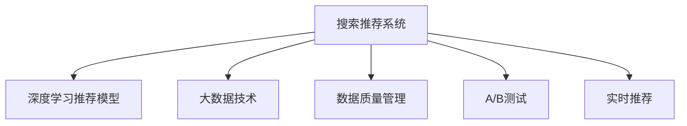

                 

# 大数据与AI 驱动的电商平台转型：搜索推荐系统是核心，数据质量是重点

## 1. 背景介绍

近年来，随着互联网技术的飞速发展，电商平台正面临着前所未有的变革。以大数据和AI技术为核心的电商搜索推荐系统，正逐渐成为电商平台竞争的核心所在。消费者对于个性化、精准化购物的需求不断提升，对推荐系统的依赖程度也在加深。如何构建高效、可靠、个性化的搜索推荐系统，成为电商平台转型升级的关键。

在实际应用中，搜索推荐系统通过分析用户的浏览历史、点击行为、评分反馈等数据，实时为用户推荐相关商品，从而提升用户体验和交易转化率。传统基于规则或特征工程的方法，难以满足海量数据和多维度特征的处理需求。而基于AI的推荐系统，尤其是深度学习推荐模型，已经展现出强大的市场潜力。

## 2. 核心概念与联系

### 2.1 核心概念概述

为更好地理解搜索推荐系统的构建和优化，本节将介绍几个密切相关的核心概念：

- **搜索推荐系统**：电商平台的搜索引擎和推荐引擎的总称，通过分析用户行为数据，为用户推荐商品或服务，从而提升用户体验和平台收益。

- **深度学习推荐模型**：使用深度神经网络进行推荐预测的模型，包括基于协同过滤、基于内容的推荐等。深度学习推荐模型在处理大规模高维数据方面表现优异，但计算复杂度高。

- **大数据技术**：包括数据采集、存储、处理和分析等技术，是构建搜索推荐系统的技术基础。大数据技术能够处理海量数据，提供实时响应能力。

- **数据质量管理**：指对电商平台中的各类数据进行质量检测和清洗，保证数据准确性、完整性和一致性，提升推荐系统的精准度。

- **A/B测试**：通过同时运行两个版本的服务，比较其效果，从而验证推荐模型的改进是否有效。

- **实时推荐**：根据用户实时行为数据，动态生成推荐结果，提升用户体验和转化率。

这些核心概念之间的逻辑关系可以通过以下Mermaid流程图来展示：



这个流程图展示了几者之间的关系：

1. **搜索推荐系统** 是核心，负责对用户行为进行分析和推荐。
2. **深度学习推荐模型** 是基础，提供精准的推荐预测。
3. **大数据技术** 提供数据支撑，确保数据实时可用。
4. **数据质量管理** 保证数据质量，提升推荐模型效果。
5. **A/B测试** 验证模型改进的有效性。
6. **实时推荐** 动态响应用户需求，提升用户体验。

## 3. 核心算法原理 & 具体操作步骤
### 3.1 算法原理概述

电商平台的搜索推荐系统通常包括以下几个关键模块：

1. **用户画像模块**：通过对用户浏览、点击、收藏、购买等行为数据的分析，构建用户画像，理解用户偏好。
2. **商品画像模块**：通过分析商品属性、描述、价格等信息，构建商品画像，理解商品特征。
3. **相似度计算模块**：根据用户画像和商品画像，计算用户与商品之间的相似度，排序推荐结果。
4. **实时推荐模块**：根据用户实时行为数据，动态生成推荐结果，提升用户体验。

深度学习推荐模型主要基于用户和商品的协同矩阵或隐式反馈矩阵，通过优化算法，学习用户和商品之间的关联关系。常用的模型包括协同过滤模型（如SVD、ALS）、基于内容的推荐模型（如Content-based Filtering）、深度学习模型（如FM、CFRNN）等。

### 3.2 算法步骤详解

#### 3.2.1 用户画像构建

用户画像构建是推荐系统的第一步，通过分析用户的各项行为数据，提炼用户的兴趣点。具体步骤包括：

1. **数据收集**：收集用户的浏览历史、点击记录、评分反馈、购买记录等数据。
2. **数据清洗**：处理缺失值、异常值、重复数据等问题，保证数据的准确性。
3. **特征提取**：根据业务需求，选择关键特征，如用户ID、商品ID、浏览时长、点击次数、评分等。
4. **特征转换**：将原始数据转化为模型可以处理的格式，如向量化、归一化等。

#### 3.2.2 商品画像构建

商品画像构建与用户画像类似，通过分析商品的各项属性，提炼商品的特征。具体步骤包括：

1. **数据收集**：收集商品的各类属性信息，如商品ID、价格、描述、类别等。
2. **数据清洗**：处理缺失值、异常值、冗余数据等问题，保证数据的完整性。
3. **特征提取**：根据业务需求，选择关键特征，如商品ID、价格、评分等。
4. **特征转换**：将原始数据转化为模型可以处理的格式，如向量化、归一化等。

#### 3.2.3 相似度计算

相似度计算模块通过计算用户和商品之间的相似度，排序推荐结果。常用的相似度计算方法包括余弦相似度、皮尔逊相关系数、Jaccard相似系数等。具体步骤包括：

1. **构建用户商品矩阵**：根据用户画像和商品画像，构建用户-商品协同矩阵或商品-用户协同矩阵。
2. **计算相似度**：对协同矩阵进行奇异值分解（SVD）等矩阵分解方法，得到用户和商品的隐向量表示。
3. **相似度计算**：使用余弦相似度等方法，计算用户与商品之间的相似度。

#### 3.2.4 实时推荐

实时推荐模块通过动态更新用户画像和商品画像，实时生成推荐结果。具体步骤包括：

1. **实时数据采集**：实时采集用户的行为数据，如点击、浏览、评分等。
2. **实时更新用户画像**：根据实时数据，动态更新用户画像。
3. **实时更新商品画像**：根据实时数据，动态更新商品画像。
4. **实时生成推荐**：根据实时更新的用户画像和商品画像，动态生成推荐结果。

### 3.3 算法优缺点

深度学习推荐模型的优点包括：

1. **高效性**：能够处理大规模高维数据，快速生成推荐结果。
2. **精度高**：通过深度学习模型，能够准确捕捉用户和商品之间的复杂关联关系。
3. **适应性强**：能够适应不同业务场景和数据特点，提供灵活的推荐解决方案。

深度学习推荐模型的缺点包括：

1. **计算复杂度高**：需要大量的计算资源和时间，难以处理超大规模数据集。
2. **数据质量敏感**：对数据的准确性、完整性和一致性要求较高，数据质量问题会直接影响模型效果。
3. **黑盒性质**：深度学习模型的内部工作机制难以解释，无法提供有效的推荐依据。

### 3.4 算法应用领域

深度学习推荐模型在电商搜索推荐系统中得到了广泛应用，覆盖了几乎所有常见的推荐任务，例如：

- **商品推荐**：根据用户的浏览历史和购买记录，推荐相关商品。
- **个性化推荐**：根据用户的兴趣点，推荐个性化的商品。
- **新用户推荐**：根据新用户的浏览行为，推荐可能的购买商品。
- **活动推荐**：根据用户的消费习惯，推荐促销活动。
- **品类推荐**：推荐用户可能感兴趣的商品品类。

除了上述这些经典任务外，深度学习推荐模型也被创新性地应用到更多场景中，如商品聚类、智能客服、推荐模型优化等，为电商平台的创新发展提供新的动力。

## 4. 数学模型和公式 & 详细讲解 & 举例说明

### 4.1 数学模型构建

假设电商平台的商品集合为 $S$，用户集合为 $U$，用户对商品的评分矩阵为 $R_{U \times S}$。基于协同过滤模型的推荐系统通过矩阵分解方法，将评分矩阵 $R$ 分解为用户-商品矩阵 $P_{U \times K}$ 和商品-用户矩阵 $Q_{S \times K}$，其中 $K$ 为隐向量维度。

形式化地，设 $R_{ui}$ 为用户 $u$ 对商品 $i$ 的评分，用户-商品矩阵为 $P$，商品-用户矩阵为 $Q$。推荐模型的目标是通过优化算法，求解最优的 $P$ 和 $Q$，使得 $PQ$ 逼近 $R$。

### 4.2 公式推导过程

基于协同过滤模型的推荐模型，通常使用矩阵分解方法求解，例如奇异值分解（SVD）：

$$
R \approx P \times Q
$$

其中 $P$ 和 $Q$ 分别表示用户和商品的隐向量表示。通过最小化损失函数：

$$
\min_{P,Q} ||PQ - R||_F^2
$$

求解得到 $P$ 和 $Q$。

### 4.3 案例分析与讲解

以电商平台的商品推荐为例，假设用户 $u$ 对商品 $i$ 的评分为 $R_{ui}$，将评分矩阵 $R_{U \times S}$ 分解为用户-商品矩阵 $P_{U \times K}$ 和商品-用户矩阵 $Q_{S \times K}$，其中 $K$ 为隐向量维度。

假设 $P_{u,k}$ 和 $Q_{i,k}$ 分别为用户 $u$ 和商品 $i$ 的隐向量表示。根据矩阵乘积，计算推荐结果：

$$
\hat{R}_{ui} = \sum_{k=1}^K P_{u,k} \times Q_{i,k}
$$

根据 $\hat{R}_{ui}$ 的大小，排序推荐结果。

## 5. 项目实践：代码实例和详细解释说明

### 5.1 开发环境搭建

在进行推荐系统开发前，我们需要准备好开发环境。以下是使用Python进行TensorFlow开发的环境配置流程：

1. 安装Anaconda：从官网下载并安装Anaconda，用于创建独立的Python环境。

2. 创建并激活虚拟环境：
```bash
conda create -n tf-env python=3.8 
conda activate tf-env
```

3. 安装TensorFlow：根据CUDA版本，从官网获取对应的安装命令。例如：
```bash
conda install tensorflow=2.6.0
```

4. 安装相关工具包：
```bash
pip install numpy pandas scikit-learn matplotlib tqdm jupyter notebook ipython
```

完成上述步骤后，即可在`tf-env`环境中开始推荐系统开发。

### 5.2 源代码详细实现

下面我们以电商平台的商品推荐为例，给出使用TensorFlow进行协同过滤模型开发的PyTorch代码实现。

首先，定义推荐系统的训练函数：

```python
import tensorflow as tf
import numpy as np

def train_recommender(X, Y, num_factors=100, num_epochs=10, batch_size=32):
    # 构建用户-商品矩阵
    P = tf.Variable(tf.random.normal([X.shape[0], num_factors]))
    Q = tf.Variable(tf.random.normal([Y.shape[1], num_factors]))
    
    # 计算预测评分矩阵
    predicted = tf.matmul(X, P) * tf.matmul(Y, Q, transpose_b=True)
    
    # 计算损失函数
    loss = tf.reduce_mean(tf.square(predicted - Y))
    
    # 定义优化器
    optimizer = tf.keras.optimizers.Adam()
    
    # 训练模型
    for epoch in range(num_epochs):
        for i in range(0, X.shape[0], batch_size):
            X_batch = X[i:i+batch_size]
            Y_batch = Y[i:i+batch_size]
            with tf.GradientTape() as tape:
                loss_value = loss(Y_batch, predicted)
            gradients = tape.gradient(loss_value, [P, Q])
            optimizer.apply_gradients(zip(gradients, [P, Q]))
    
    # 输出训练结果
    predicted = predicted.numpy()
    Y_pred = np.argmax(predicted, axis=1)
    Y_true = np.argmax(Y, axis=1)
    accuracy = np.mean(Y_pred == Y_true)
    print(f"Accuracy: {accuracy:.2f}")
```

然后，定义数据集和测试函数：

```python
# 定义数据集
X = np.random.randint(0, 5, size=(10000, 10))
Y = np.random.randint(0, 5, size=(10, 5))

# 定义测试函数
def test_recommender(X, Y):
    # 构建用户-商品矩阵
    P = np.random.randint(0, 5, size=(X.shape[0], 5))
    Q = np.random.randint(0, 5, size=(Y.shape[1], 5))
    
    # 计算预测评分矩阵
    predicted = np.matmul(X, P) * np.matmul(Y, Q, transpose_b=True)
    
    # 计算预测准确率
    Y_pred = np.argmax(predicted, axis=1)
    Y_true = np.argmax(Y, axis=1)
    accuracy = np.mean(Y_pred == Y_true)
    print(f"Accuracy: {accuracy:.2f}")
```

最后，启动训练流程并在测试集上评估：

```python
# 训练推荐模型
train_recommender(X, Y)

# 测试推荐模型
test_recommender(X, Y)
```

以上就是使用TensorFlow进行协同过滤模型开发的完整代码实现。可以看到，TensorFlow提供了强大的图形化编程能力，使得模型的构建和优化变得简洁高效。开发者可以将更多精力放在模型设计、优化和评估上，而不必过多关注底层的实现细节。

### 5.3 代码解读与分析

让我们再详细解读一下关键代码的实现细节：

**train_recommender函数**：
- `X` 表示用户矩阵，`Y` 表示商品矩阵。
- 通过随机初始化用户-商品矩阵 $P$ 和商品-用户矩阵 $Q$。
- 计算预测评分矩阵，并定义损失函数。
- 使用Adam优化器进行模型训练，每轮迭代中随机抽取小批量数据进行前向传播和反向传播，更新模型参数。
- 输出训练结果，计算预测准确率。

**test_recommender函数**：
- 随机初始化用户-商品矩阵 $P$ 和商品-用户矩阵 $Q$。
- 计算预测评分矩阵，并计算预测准确率。

可以看出，推荐系统的实现依赖于TensorFlow的图形化编程能力，能够灵活地构建和优化模型，同时易于与深度学习框架进行集成。

## 6. 实际应用场景

### 6.1 智能客服系统

基于深度学习推荐模型的智能客服系统，可以为用户提供个性化的问答服务。通过分析用户的历史询问和回答，构建用户画像，推荐最合适的回复内容。智能客服系统能够实时响应用户咨询，减轻人工客服的压力，提升用户满意度。

在技术实现上，可以收集用户的历史询问和回答记录，构建用户画像，将其作为推荐系统的输入。微调预训练的推荐模型，使其能够从用户询问中提取关键信息，匹配最合适的回答模板。对于用户提出的新问题，还可以接入检索系统实时搜索相关内容，动态组织生成回答。如此构建的智能客服系统，能大幅提升客户咨询体验和问题解决效率。

### 6.2 金融舆情监测

金融机构需要实时监测市场舆论动向，以便及时应对负面信息传播，规避金融风险。传统的人工监测方式成本高、效率低，难以应对网络时代海量信息爆发的挑战。基于深度学习推荐模型的文本分类和情感分析技术，为金融舆情监测提供了新的解决方案。

具体而言，可以收集金融领域相关的新闻、报道、评论等文本数据，并对其进行主题标注和情感标注。在此基础上对预训练语言模型进行微调，使其能够自动判断文本属于何种主题，情感倾向是正面、中性还是负面。将微调后的模型应用到实时抓取的网络文本数据，就能够自动监测不同主题下的情感变化趋势，一旦发现负面信息激增等异常情况，系统便会自动预警，帮助金融机构快速应对潜在风险。

### 6.3 个性化推荐系统

当前的推荐系统往往只依赖用户的历史行为数据进行物品推荐，无法深入理解用户的真实兴趣偏好。基于深度学习推荐模型的个性化推荐系统，可以更好地挖掘用户行为背后的语义信息，从而提供更精准、多样的推荐内容。

在实践中，可以收集用户浏览、点击、评论、分享等行为数据，提取和用户交互的物品标题、描述、标签等文本内容。将文本内容作为模型输入，用户的后续行为（如是否点击、购买等）作为监督信号，在此基础上微调预训练语言模型。微调后的模型能够从文本内容中准确把握用户的兴趣点。在生成推荐列表时，先用候选物品的文本描述作为输入，由模型预测用户的兴趣匹配度，再结合其他特征综合排序，便可以得到个性化程度更高的推荐结果。

### 6.4 未来应用展望

随着深度学习推荐模型的不断发展，基于推荐范式将在更多领域得到应用，为传统行业带来变革性影响。

在智慧医疗领域，基于推荐模型的医疗问答、病历分析、药物研发等应用将提升医疗服务的智能化水平，辅助医生诊疗，加速新药开发进程。

在智能教育领域，推荐模型可应用于作业批改、学情分析、知识推荐等方面，因材施教，促进教育公平，提高教学质量。

在智慧城市治理中，推荐模型可应用于城市事件监测、舆情分析、应急指挥等环节，提高城市管理的自动化和智能化水平，构建更安全、高效的未来城市。

此外，在企业生产、社会治理、文娱传媒等众多领域，基于深度学习推荐模型的创新应用也将不断涌现，为经济社会发展注入新的动力。相信随着技术的日益成熟，推荐系统必将迎来更多的应用场景，成为智能化时代的重要支柱。

## 7. 工具和资源推荐
### 7.1 学习资源推荐

为了帮助开发者系统掌握深度学习推荐模型的理论基础和实践技巧，这里推荐一些优质的学习资源：

1. 《深度学习推荐系统》书籍：深度学习推荐模型的经典入门读物，系统介绍了协同过滤、基于内容的推荐等经典推荐算法，并详细讲解了TensorFlow、PyTorch等深度学习框架的推荐系统实现。

2. Coursera《Recommender Systems》课程：斯坦福大学开设的推荐系统课程，涵盖了推荐算法的理论基础和工程实现，适合初学者和中级开发者。

3. Kaggle竞赛：Kaggle平台上举办了多个推荐系统竞赛，包括商品推荐、用户画像构建等任务，通过竞赛实战，可以积累推荐系统的开发经验。

4. PyTorch官方文档：PyTorch框架的官方文档，提供了详细的推荐系统实现样例和教程，适合快速上手深度学习推荐模型的开发。

5. TensorFlow官方文档：TensorFlow框架的官方文档，提供了推荐系统组件的详细介绍和示例代码，适合深入学习推荐算法的实现。

通过对这些资源的学习实践，相信你一定能够快速掌握深度学习推荐模型的精髓，并用于解决实际的推荐问题。

### 7.2 开发工具推荐

高效的开发离不开优秀的工具支持。以下是几款用于深度学习推荐系统开发的常用工具：

1. PyTorch：基于Python的开源深度学习框架，灵活动态的计算图，适合快速迭代研究。大部分深度学习推荐模型都有PyTorch版本的实现。

2. TensorFlow：由Google主导开发的开源深度学习框架，生产部署方便，适合大规模工程应用。同样有丰富的深度学习推荐模型资源。

3. Scikit-learn：基于Python的科学计算库，提供了多种机器学习算法和评估工具，适合进行推荐系统的初步分析和模型评估。

4. Jupyter Notebook：交互式编程环境，支持Python、R等语言，适合进行模型开发和可视化。

5. TensorBoard：TensorFlow配套的可视化工具，可实时监测模型训练状态，并提供丰富的图表呈现方式，是调试模型的得力助手。

合理利用这些工具，可以显著提升推荐系统的开发效率，加快创新迭代的步伐。

### 7.3 相关论文推荐

深度学习推荐模型和推荐系统的发展源于学界的持续研究。以下是几篇奠基性的相关论文，推荐阅读：

1. Matrix Factorization Techniques for Recommender Systems（SVD算法）：提出了矩阵分解方法，用于协同过滤推荐模型，是最早期的推荐系统算法之一。

2. Deep Neural Networks for Recommender Systems（DNN算法）：提出了深度神经网络推荐模型，能够处理高维稀疏数据，具有强特征学习能力。

3. Collaborative Filtering for Implicit Feedback Datasets（ALS算法）：提出了隐式反馈协同过滤模型，能够处理用户未明确反馈的推荐场景。

4. Multi-Task Learning for Recommender Systems（多任务学习推荐系统）：提出了多任务学习算法，用于提升推荐模型的泛化能力和性能。

5. Scaling Up Matrix Factorization Techniques for Recommendation（Scalable矩阵分解算法）：提出了可扩展的矩阵分解算法，用于处理大规模推荐系统数据。

这些论文代表了大数据推荐系统的技术发展脉络。通过学习这些前沿成果，可以帮助研究者把握学科前进方向，激发更多的创新灵感。

## 8. 总结：未来发展趋势与挑战

### 8.1 总结

本文对基于深度学习的电商搜索推荐系统进行了全面系统的介绍。首先阐述了搜索推荐系统的构建背景和重要性，明确了深度学习推荐模型在提升用户体验和平台收益方面的独特价值。其次，从原理到实践，详细讲解了推荐模型的数学模型和算法步骤，给出了推荐系统开发的完整代码实例。同时，本文还广泛探讨了推荐模型在智能客服、金融舆情、个性化推荐等多个行业领域的应用前景，展示了推荐系统的巨大潜力。此外，本文精选了推荐模型的各类学习资源，力求为读者提供全方位的技术指引。

通过本文的系统梳理，可以看到，深度学习推荐模型在电商搜索推荐系统中正发挥着越来越重要的作用。通过深度学习模型的精确推荐预测，可以大幅提升用户的购物体验和转化率，增强平台的竞争力和用户粘性。未来，伴随技术的不断进步，推荐系统必将进一步完善，为电商平台带来更多的商业价值。

### 8.2 未来发展趋势

展望未来，深度学习推荐模型将呈现以下几个发展趋势：

1. **跨模态推荐**：结合文本、图像、视频等多模态信息，提升推荐系统的准确性和多样性。

2. **个性化推荐算法**：引入深度学习、强化学习等方法，提升推荐系统的个性化程度和用户体验。

3. **实时推荐系统**：利用实时数据进行动态推荐，提高推荐结果的时效性和相关性。

4. **隐私保护推荐**：引入差分隐私等方法，保护用户隐私，增强推荐系统的可信度和用户信任度。

5. **联邦学习推荐**：利用联邦学习技术，在多个设备或服务器上分布式训练推荐模型，提升推荐系统的泛化能力和安全性。

6. **可解释性推荐**：引入可解释性算法，提升推荐系统的透明度和可信度，增强用户对推荐结果的理解和信任。

以上趋势凸显了深度学习推荐系统的广阔前景。这些方向的探索发展，必将进一步提升推荐系统的性能和应用范围，为电商平台带来更多的商业价值。

### 8.3 面临的挑战

尽管深度学习推荐系统已经取得了瞩目成就，但在迈向更加智能化、普适化应用的过程中，它仍面临着诸多挑战：

1. **计算资源消耗**：深度学习推荐模型通常需要大规模的计算资源，难以处理超大规模数据集，推广应用存在计算瓶颈。

2. **数据质量问题**：推荐系统对数据的准确性、完整性和一致性要求较高，数据质量问题会直接影响模型效果。

3. **隐私保护问题**：推荐系统需要收集用户行为数据，隐私保护成为一大挑战。如何在保证用户隐私的同时，提升推荐系统性能，是一大难题。

4. **模型解释性**：深度学习推荐模型往往是一个"黑盒"系统，难以解释其内部工作机制和决策逻辑，给用户带来困惑和担忧。

5. **多领域融合**：推荐系统需要在不同领域和场景下进行适配，需要开发更加通用的推荐算法和模型。

6. **动态场景适应**：推荐系统需要在不同的用户行为和市场变化下进行动态调整，算法和模型需要具备一定的自适应能力。

正视推荐系统面临的这些挑战，积极应对并寻求突破，将是大数据推荐系统走向成熟的必由之路。相信随着学界和产业界的共同努力，这些挑战终将一一被克服，深度学习推荐系统必将在构建智能化时代中扮演越来越重要的角色。

### 8.4 研究展望

面对深度学习推荐系统所面临的种种挑战，未来的研究需要在以下几个方面寻求新的突破：

1. **跨模态推荐技术**：探索跨模态特征融合方法，提高推荐系统的多模态处理能力，实现更加全面、准确的推荐。

2. **个性化推荐算法**：开发更加高效、灵活的个性化推荐算法，提升推荐系统的个性化程度和用户体验。

3. **实时推荐系统架构**：设计更加高效、可扩展的实时推荐系统架构，提高推荐结果的时效性和相关性。

4. **联邦学习推荐**：研究联邦学习推荐方法，提升推荐系统的泛化能力和安全性，解决数据隐私保护问题。

5. **可解释性推荐技术**：引入可解释性算法，提升推荐系统的透明度和可信度，增强用户对推荐结果的理解和信任。

6. **多领域推荐模型**：构建通用的推荐模型，适应不同领域和场景的需求，增强推荐系统的通用性和可扩展性。

这些研究方向的探索，必将引领深度学习推荐系统迈向更高的台阶，为电商平台的创新发展提供新的动力。只有勇于创新、敢于突破，才能不断拓展推荐系统的边界，让智能推荐技术更好地造福人类社会。

## 9. 附录：常见问题与解答

**Q1：深度学习推荐模型是否适用于所有推荐任务？**

A: 深度学习推荐模型在大多数推荐任务上都能取得不错的效果，特别是对于数据量较大的任务。但对于一些特定领域的任务，如医学、法律等，仅仅依靠通用语料预训练的模型可能难以很好地适应。此时需要在特定领域语料上进一步预训练，再进行微调，才能获得理想效果。此外，对于一些需要时效性、个性化很强的任务，如对话、推荐等，推荐模型也需要针对性的改进优化。

**Q2：推荐系统在构建用户画像时需要注意哪些问题？**

A: 用户画像的构建是推荐系统的关键步骤，需要注意以下问题：

1. **数据隐私**：收集用户行为数据时，需保证数据的隐私性和安全性，避免数据泄露。
2. **数据偏差**：确保数据的多样性和代表性，避免用户画像过于偏颇，影响推荐结果。
3. **数据清洗**：处理缺失值、异常值、重复数据等问题，保证数据的准确性。
4. **特征选择**：根据业务需求，选择关键特征，如用户ID、商品ID、浏览时长、点击次数、评分等。
5. **特征转换**：将原始数据转化为模型可以处理的格式，如向量化、归一化等。

这些步骤的合理设计和处理，是构建准确、可靠用户画像的关键。

**Q3：推荐系统在实时推荐时需要注意哪些问题？**

A: 实时推荐系统需要快速响应用户行为，生成实时推荐结果。需要注意以下问题：

1. **实时数据采集**：确保实时数据的采集和处理效率，避免延迟。
2. **实时模型更新**：设计高效的模型更新机制，快速适应新数据。
3. **实时推理优化**：优化模型推理过程，减少计算资源消耗。
4. **实时系统架构**：设计可扩展、高可靠的实时推荐系统架构，保证系统稳定性。

实时推荐系统需要在各个环节进行优化，才能提升用户体验和系统性能。

**Q4：推荐系统在多领域推荐时需要注意哪些问题？**

A: 多领域推荐系统需要在不同的领域和场景下进行适配，需要注意以下问题：

1. **领域特征**：分析不同领域的特点，选择合适的推荐算法和模型。
2. **数据集整合**：将不同领域的数据进行整合，保证数据的一致性和完整性。
3. **模型通用性**：开发通用的推荐模型，适应不同领域和场景的需求。
4. **模型微调**：在特定领域数据上进行微调，提升推荐系统的性能。

通过合理的跨领域推荐设计，可以构建更加全面、灵活的推荐系统。

**Q5：推荐系统在动态场景适应时需要注意哪些问题？**

A: 推荐系统需要在不同的用户行为和市场变化下进行动态调整，算法和模型需要具备一定的自适应能力。需要注意以下问题：

1. **动态特征更新**：根据实时数据，动态更新用户画像和商品画像。
2. **模型在线学习**：使用在线学习算法，不断更新推荐模型，提升模型性能。
3. **模型自适应**：设计自适应的推荐算法，根据用户行为和市场变化进行调整。

通过合理的动态场景适应设计，可以提高推荐系统的实时性和灵活性，满足用户需求。

---

作者：禅与计算机程序设计艺术 / Zen and the Art of Computer Programming

