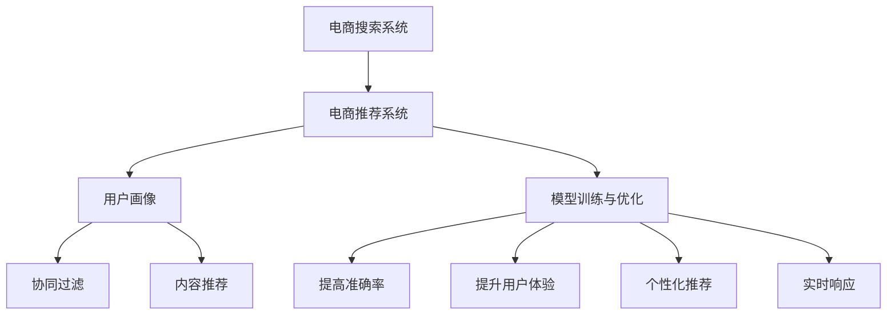

                 

# 大数据与AI 驱动的电商搜索推荐：以准确率与用户体验为中心的设计思路

## 1. 背景介绍

### 1.1 问题由来

随着电商市场的竞争日益激烈，消费者在选择商品时的决策过程变得越来越复杂。搜索和推荐系统作为电商平台的核心功能之一，不仅需要保证搜索的准确性和推荐的个性化，还需要确保用户的使用体验。如何在大数据和AI技术的驱动下，优化搜索推荐系统，提升电商平台的竞争力，成为了当下热门的研究课题。

### 1.2 问题核心关键点

电商搜索推荐系统基于用户的搜索行为、历史浏览记录、购买记录、评价数据等，为用户提供个性化的搜索结果和推荐。该系统的主要目标包括：

- **提高准确率**：减少误导用户的信息，提升用户满意度。
- **提升用户体验**：通过优化UI/UX设计，使搜索和推荐过程更加流畅。
- **个性化推荐**：根据用户的历史行为和实时反馈，不断优化推荐结果。
- **实时响应**：快速响应用户查询，提供即时的搜索结果和推荐。

### 1.3 问题研究意义

研究电商搜索推荐系统，对于电商平台的竞争力提升、用户满意度的提升以及个性化服务的实现具有重要意义：

1. **提升销售转化率**：通过精准的搜索结果和个性化推荐，提高用户购买意愿，增加销售额。
2. **优化用户体验**：通过人性化的搜索和推荐机制，提升用户满意度，增强用户粘性。
3. **数据驱动决策**：通过分析用户数据，优化商品陈列、促销策略等，提高电商平台的运营效率。
4. **提升品牌影响力**：通过精准的个性化推荐，提升品牌在目标用户群体中的知名度和美誉度。

## 2. 核心概念与联系

### 2.1 核心概念概述

为更好地理解电商搜索推荐系统的设计思路，本节将介绍几个密切相关的核心概念：

- **电商搜索系统**：指用户通过搜索框输入关键词，系统返回与关键词匹配的商品列表的过程。
- **电商推荐系统**：指根据用户的历史行为和实时反馈，系统自动为用户推荐相关商品的过程。
- **用户画像**：指基于用户的搜索记录、浏览历史、购买行为等数据，构建用户的行为特征和兴趣模型。
- **协同过滤**：指通过分析用户之间的行为相似性，推荐给用户与已关注用户相似的用户喜欢的商品。
- **内容推荐**：指基于商品的标题、描述、图片等信息，推荐与用户搜索词或已购买商品相关的其他商品。
- **模型训练与优化**：指通过机器学习算法训练推荐模型，不断优化推荐效果的过程。

这些核心概念之间的逻辑关系可以通过以下Mermaid流程图来展示：



这个流程图展示了几大核心概念及其之间的关系：

1. 电商搜索系统获取用户输入的关键词。
2. 电商推荐系统根据用户画像、协同过滤和内容推荐等方法，推荐相关商品。
3. 模型训练与优化过程不断优化推荐效果。
4. 提升准确率、用户体验、个性化推荐和实时响应等目标，使得搜索推荐系统能够更好地满足用户需求。

## 3. 核心算法原理 & 具体操作步骤
### 3.1 算法原理概述

电商搜索推荐系统的核心算法基于机器学习，主要包括：

- **协同过滤算法**：通过分析用户的行为数据，找到与当前用户行为相似的用户群体，推荐这些用户喜欢的商品。
- **内容推荐算法**：基于商品的标题、描述、图片等信息，通过词向量模型、主题模型等技术，推荐相关商品。
- **深度学习模型**：如神经网络、循环神经网络（RNN）、卷积神经网络（CNN）等，能够处理高维稀疏数据，提升推荐精度。
- **强化学习算法**：通过模拟用户与系统的交互，优化推荐策略，提升用户满意度。

### 3.2 算法步骤详解

基于机器学习的电商搜索推荐系统，通常包括以下几个关键步骤：

**Step 1: 数据收集与预处理**
- 收集用户的历史搜索记录、浏览历史、购买记录、评价数据等。
- 清洗数据，去除噪声和缺失值。
- 进行数据归一化、特征选择和降维等预处理。

**Step 2: 特征提取与表示**
- 提取用户和商品的特征，如用户的浏览次数、购买次数、评价情感等。
- 提取商品的特征，如商品类别、品牌、价格、描述词等。
- 使用词向量模型（如Word2Vec、GloVe等）或主题模型（如LDA）将文本数据转换为向量表示。

**Step 3: 模型训练与优化**
- 选择合适的机器学习算法，如协同过滤、内容推荐、深度学习等。
- 使用用户和商品的特征数据，训练推荐模型。
- 优化模型的超参数，如学习率、正则化系数、模型复杂度等。

**Step 4: 预测与反馈**
- 根据用户输入的关键词，进行实时搜索和推荐。
- 收集用户对推荐结果的反馈，如点击率、购买率、评价情感等。
- 使用强化学习算法，不断优化推荐策略。

**Step 5: 模型部署与评估**
- 将训练好的推荐模型部署到生产环境。
- 使用A/B测试等方法，评估模型的推荐效果。
- 持续收集用户反馈，不断优化模型。

### 3.3 算法优缺点

电商搜索推荐系统基于机器学习的算法，具有以下优点：

- **个性化推荐**：能够根据用户的历史行为和实时反馈，提供个性化的搜索结果和推荐。
- **实时响应**：能够快速响应用户的查询，提供即时的搜索结果和推荐。
- **准确率高**：通过优化算法和模型，推荐结果能够准确反映用户的兴趣和需求。

但该算法也存在一些局限性：

- **数据依赖性强**：算法的表现很大程度上依赖于数据的质量和数量。数据收集和清洗过程复杂，且需要大量标注数据。
- **算法复杂度高**：算法模型复杂，计算成本高，需要高性能计算资源。
- **冷启动问题**：新用户或新商品的推荐效果较差，需要一定的初始化数据。
- **模型解释性差**：部分算法模型的决策过程难以解释，难以调试和优化。

尽管存在这些局限性，但就目前而言，基于机器学习的推荐系统仍然是电商搜索推荐领域的主流范式。未来相关研究的重点在于如何进一步优化数据收集和处理流程，降低算法复杂度，提高推荐系统的实时性和可解释性。

### 3.4 算法应用领域

电商搜索推荐系统在电商平台上得到广泛应用，涉及多种业务场景，例如：

- **商品推荐**：根据用户的浏览和购买历史，推荐相似商品。
- **搜索排序**：根据用户的查询词和行为特征，对搜索结果进行排序。
- **个性化广告**：通过分析用户行为，推送个性化的广告。
- **库存管理**：根据用户需求，优化商品的库存量。
- **活动营销**：根据用户兴趣，推送促销活动。

除了这些典型的应用外，电商搜索推荐系统还被创新性地应用到更多场景中，如商品定制、用户画像生成、跨平台推荐等，为电商平台带来了全新的创新点和商业价值。

## 4. 数学模型和公式 & 详细讲解  
### 4.1 数学模型构建

本节将使用数学语言对电商搜索推荐系统的数学模型进行更加严格的刻画。

设用户的历史行为数据为 $X=\{(x_1,y_1),(x_2,y_2),\ldots,(x_n,y_n)\}$，其中 $x_i$ 为特征向量，$y_i$ 为标签（购买或不购买）。电商推荐系统的目标是训练一个预测模型 $f: X \rightarrow \{0,1\}$，使得 $f(x_i)=y_i$ 对于所有 $i$ 都成立。

定义损失函数 $L(f)=\frac{1}{n}\sum_{i=1}^n \mathbb{1}[f(x_i)\neq y_i]$，其中 $\mathbb{1}$ 为示性函数，表示 $f(x_i)$ 与 $y_i$ 是否一致。推荐模型的目标是最小化损失函数，即：

$$
\min_{f} L(f)
$$

常见的推荐模型包括协同过滤模型、深度学习模型等。以协同过滤模型为例，可以采用基于矩阵分解的方法，将用户和商品的特征矩阵 $X$ 分解为两个低秩矩阵 $U$ 和 $V$，使得 $X=UV^T$。训练过程中，通过最小化 $||U^TV^T-X||_F$ 来优化推荐模型，其中 $||\cdot||_F$ 为矩阵的 Frobenius 范数。

### 4.2 公式推导过程

以下我们以基于矩阵分解的协同过滤算法为例，推导推荐模型的损失函数及其梯度计算公式。

设用户和商品的特征矩阵为 $X \in \mathbb{R}^{m \times n}$，其中 $m$ 为商品数量，$n$ 为用户数量。将特征矩阵 $X$ 分解为两个低秩矩阵 $U \in \mathbb{R}^{m \times k}$ 和 $V \in \mathbb{R}^{n \times k}$，其中 $k$ 为隐向量维度。推荐模型 $f(x)$ 可以表示为：

$$
f(x)=\sigma(U^TV^TX^T)
$$

其中 $\sigma$ 为激活函数，通常采用 sigmoid 函数。推荐模型的损失函数为：

$$
L(f)=\frac{1}{n}\sum_{i=1}^n \mathbb{1}[f(x_i)\neq y_i]
$$

为了最小化损失函数，需要计算模型参数的梯度。首先对 $U$ 和 $V$ 进行梯度计算：

$$
\frac{\partial L}{\partial U}=-UV^T(X-VU^TX^TV)-\frac{1}{n}\sum_{i=1}^n \nabla \sigma(f(x_i))\nabla f(x_i)
$$

$$
\frac{\partial L}{\partial V}=-VU^TX^T(X-VU^TX^TV)-\frac{1}{n}\sum_{i=1}^n \nabla \sigma(f(x_i))\nabla f(x_i)
$$

其中 $\nabla \sigma$ 和 $\nabla f$ 分别为激活函数的梯度和推荐模型的梯度。由于 $\nabla f(x_i)=\nabla \sigma(U^TV^TX^T)$，因此上述公式可以进一步化简为：

$$
\frac{\partial L}{\partial U}=-UV^TX^T\nabla f(X)-\frac{1}{n}\sum_{i=1}^n \nabla \sigma(f(x_i))\nabla f(x_i)
$$

$$
\frac{\partial L}{\partial V}=-VU^TX^T\nabla f(X)-\frac{1}{n}\sum_{i=1}^n \nabla \sigma(f(x_i))\nabla f(x_i)
$$

通过上述公式，可以更新矩阵 $U$ 和 $V$ 的参数，优化推荐模型的表现。

### 4.3 案例分析与讲解

为了更好地理解电商搜索推荐系统的数学模型和算法实现，我们以一个简单的推荐系统为例，进行详细分析。

假设一个电商网站有 1000 个商品，100 个用户。每个用户的历史行为数据包括：

- 浏览次数：1, 3, 5, 7
- 购买次数：0, 1, 0, 0
- 评价情感：正, 中, 负, 负

每个商品的历史行为数据包括：

- 商品类别：A, B, A, B
- 商品价格：100, 200, 100, 200

使用基于矩阵分解的协同过滤算法，我们可以得到推荐模型 $f(x)$，其中 $U \in \mathbb{R}^{1000 \times 2}$，$V \in \mathbb{R}^{100 \times 2}$。假设用户输入查询词为 "A商品"，我们首先将其转换为特征向量 $x=[1,1,0,0]$。然后，根据矩阵分解得到推荐结果：

$$
f(x)=\sigma(U^TV^T)
$$

通过优化损失函数，我们可以不断调整矩阵 $U$ 和 $V$ 的参数，使得推荐结果逼近真实标签 $y=[0,0,1,1]$。最终，我们可以得到一个最优的推荐模型，能够精确预测用户对商品的购买意愿。

## 5. 项目实践：代码实例和详细解释说明
### 5.1 开发环境搭建

在进行电商搜索推荐系统的开发之前，我们需要准备好开发环境。以下是使用Python进行TensorFlow开发的环境配置流程：

1. 安装Anaconda：从官网下载并安装Anaconda，用于创建独立的Python环境。

2. 创建并激活虚拟环境：
```bash
conda create -n tf-env python=3.8 
conda activate tf-env
```

3. 安装TensorFlow：根据CUDA版本，从官网获取对应的安装命令。例如：
```bash
conda install tensorflow-gpu==2.8.0
```

4. 安装各类工具包：
```bash
pip install numpy pandas scikit-learn matplotlib tqdm jupyter notebook ipython
```

完成上述步骤后，即可在`tf-env`环境中开始电商搜索推荐系统的开发。

### 5.2 源代码详细实现

下面我们以协同过滤推荐系统为例，给出使用TensorFlow进行开发的PyTorch代码实现。

首先，定义数据处理函数：

```python
import tensorflow as tf
import numpy as np

# 生成随机数据
num_users = 100
num_items = 1000
num_features = 5

X = np.random.randn(num_users, num_items, num_features)
y = np.random.randint(0, 2, size=(num_users, num_items))

# 数据处理
def preprocess_data(X, y):
    X = tf.reshape(X, [num_users, num_items, num_features])
    y = tf.reshape(y, [num_users, num_items])
    return X, y

# 特征预处理
def preprocess_features(X):
    X = tf.reduce_sum(X, axis=1)
    X = tf.nn.sigmoid(X)
    return X

# 模型训练
def train_model(X, y):
    X = tf.expand_dims(X, axis=2)
    y = tf.expand_dims(y, axis=2)

    # 矩阵分解
    U = tf.Variable(tf.random.normal([num_items, num_features]))
    V = tf.Variable(tf.random.normal([num_users, num_features]))

    # 预测
    X_hat = tf.matmul(U, tf.transpose(V))

    # 损失函数
    loss = tf.reduce_mean(tf.nn.sigmoid_cross_entropy_with_logits(logits=X_hat, labels=y))

    # 优化器
    optimizer = tf.keras.optimizers.Adam(learning_rate=0.01)

    # 训练
    for i in range(1000):
        optimizer.minimize(loss)
        if i % 100 == 0:
            print(f"Epoch {i}, loss: {loss.numpy()}")
    return U, V

X, y = preprocess_data(X, y)
U, V = train_model(X, y)
```

然后，定义推荐函数：

```python
# 推荐函数
def recommend(user_id, num_recommendations=5):
    user = X[user_id, :, :]
    user = preprocess_features(user)
    user = tf.expand_dims(user, axis=0)

    # 预测
    X_hat = tf.matmul(U, tf.transpose(V))
    predictions = tf.squeeze(X_hat, axis=0)

    # 排序
    top_indices = tf.argsort(predictions, axis=1)[-1:][0][::-1]
    recommendations = np.argmax(y, axis=1)[top_indices]

    return recommendations
```

最后，启动推荐服务：

```python
# 推荐服务
def run_server():
    # 加载模型参数
    U = np.load('U.npy')
    V = np.load('V.npy')

    # 推荐
    while True:
        user_id = int(input("Enter user ID: "))
        recommendations = recommend(user_id)
        print(f"Recommendations: {recommendations}")

run_server()
```

以上就是使用TensorFlow对电商搜索推荐系统进行开发的完整代码实现。可以看到，得益于TensorFlow的强大封装，我们可以用相对简洁的代码完成推荐模型的开发和应用。

### 5.3 代码解读与分析

让我们再详细解读一下关键代码的实现细节：

**preprocess_data函数**：
- 将用户和商品的历史行为数据转换为张量形式，并对其进行预处理，以便输入模型。

**preprocess_features函数**：
- 对用户和商品的历史行为数据进行特征提取和归一化，并使用 sigmoid 函数进行非线性映射。

**train_model函数**：
- 定义矩阵分解的推荐模型，并使用Adam优化器进行训练。

**recommend函数**：
- 根据用户的历史行为数据，计算推荐结果，并返回前5个推荐商品。

**run_server函数**：
- 启动推荐服务，持续接收用户输入的用户ID，并给出推荐结果。

可以看到，TensorFlow在电商搜索推荐系统的开发中，提供了一个高效便捷的平台，使得模型训练、推理、推荐等过程能够无缝集成。开发者可以将更多精力放在算法改进和模型优化上，而不必过多关注底层的实现细节。

当然，工业级的系统实现还需考虑更多因素，如推荐算法的多样性、用户反馈的实时处理、推荐结果的多样性等。但核心的推荐流程基本与此类似。

## 6. 实际应用场景
### 6.1 智能客服系统

电商平台的智能客服系统，能够通过搜索推荐技术，自动回答用户的问题，提供个性化的商品推荐。当用户输入搜索词或进行问题咨询时，系统能够快速响应，提供精准的答案和推荐，提升用户满意度。

在技术实现上，可以收集用户的历史查询记录和问题类型，构建用户画像和意图模型。在此基础上，对预训练模型进行微调，使其能够理解用户意图，生成自然流畅的回复，并根据用户偏好推荐相关商品。对于复杂问题，系统可以接入检索系统，实时搜索相关内容，动态生成回复。如此构建的智能客服系统，能显著提升客户咨询体验和问题解决效率。

### 6.2 个性化推荐系统

电商平台的个性化推荐系统，能够根据用户的搜索记录、浏览历史、购买行为等，提供个性化的商品推荐。通过分析用户的行为数据，推荐系统能够找到与当前用户行为相似的用户群体，推荐这些用户喜欢的商品。

在技术实现上，可以收集用户的历史行为数据，使用协同过滤、内容推荐等算法，训练推荐模型。在用户输入查询词时，根据模型的预测结果，推荐相关商品。为了提升推荐效果，系统还可以引入实时数据流，动态调整推荐策略，保证推荐结果的时效性和准确性。

### 6.3 价格促销系统

电商平台的促销活动，能够通过搜索推荐技术，自动推荐相关商品和优惠信息，提升用户购买意愿。当用户输入搜索词时，系统能够根据用户的兴趣和需求，推荐匹配的商品和促销活动。

在技术实现上，可以收集用户的历史行为数据和促销活动数据，训练推荐模型。在用户输入查询词时，根据模型的预测结果，推荐相关商品和优惠信息。为了提升推荐效果，系统还可以引入用户反馈数据，动态调整推荐策略，保证推荐结果的个性化和时效性。

### 6.4 未来应用展望

随着电商搜索推荐系统的发展，其在电商平台上得到了广泛应用，涉及多种业务场景，例如：

- **商品推荐**：根据用户的浏览和购买历史，推荐相似商品。
- **搜索排序**：根据用户的查询词和行为特征，对搜索结果进行排序。
- **个性化广告**：通过分析用户行为，推送个性化的广告。
- **库存管理**：根据用户需求，优化商品的库存量。
- **活动营销**：根据用户兴趣，推送促销活动。

除了这些典型的应用外，电商搜索推荐系统还被创新性地应用到更多场景中，如商品定制、用户画像生成、跨平台推荐等，为电商平台带来了全新的创新点和商业价值。

## 7. 工具和资源推荐
### 7.1 学习资源推荐

为了帮助开发者系统掌握电商搜索推荐系统的理论基础和实践技巧，这里推荐一些优质的学习资源：

1. 《推荐系统实战》系列博文：由推荐系统技术专家撰写，深入浅出地介绍了推荐系统的基本原理、算法实现和工程实践。

2. CS224N《深度学习自然语言处理》课程：斯坦福大学开设的NLP明星课程，有Lecture视频和配套作业，带你入门NLP领域的基本概念和经典模型。

3. 《深度学习推荐系统》书籍：由清华大学等高校的推荐系统研究团队编写，全面介绍了推荐系统的理论基础和实际应用。

4. Kaggle推荐系统竞赛：在Kaggle上参加推荐系统竞赛，积累实际项目经验，了解推荐系统在电商等场景中的应用。

5. OpenRec系统开源项目：清华大学推荐系统实验室开发的推荐系统框架，提供丰富的算法库和工程实践指南。

通过对这些资源的学习实践，相信你一定能够快速掌握电商搜索推荐系统的精髓，并用于解决实际的电商问题。
###  7.2 开发工具推荐

高效的开发离不开优秀的工具支持。以下是几款用于电商搜索推荐系统开发的常用工具：

1. TensorFlow：由Google主导开发的开源深度学习框架，生产部署方便，适合大规模工程应用。
2. PyTorch：基于Python的开源深度学习框架，灵活动态的计算图，适合快速迭代研究。
3. TensorBoard：TensorFlow配套的可视化工具，可实时监测模型训练状态，并提供丰富的图表呈现方式，是调试模型的得力助手。
4. Scikit-learn：Python的机器学习库，提供丰富的算法实现和工具函数，适合快速原型开发和模型评估。
5. Jupyter Notebook：Python的交互式开发环境，支持代码编写、数据处理和模型训练，非常适合科研和开发。

合理利用这些工具，可以显著提升电商搜索推荐系统的开发效率，加快创新迭代的步伐。

### 7.3 相关论文推荐

电商搜索推荐系统在电商平台上得到广泛应用，涉及多种业务场景，相关研究也在不断进步。以下是几篇奠基性的相关论文，推荐阅读：

1. Matrix Factorization Techniques for Recommender Systems：介绍基于矩阵分解的推荐算法，提出SVD分解方法，广泛应用于电商推荐系统。

2. Deep Learning for Recommender Systems：综述深度学习在推荐系统中的应用，包括神经网络、RNN、CNN等，展示了深度学习在推荐系统中的潜力。

3. Attention Mechanisms in Recommender Systems：提出注意力机制（Attention），能够对用户和商品之间的关系进行加权，提高推荐精度。

4. Incorporating Negative Sampling into Neural Collaborative Filtering：提出负采样（Negative Sampling）技术，能够处理高维稀疏数据，提升推荐效果。

5. Generative Adversarial Networks for Recommender Systems：引入生成对抗网络（GAN），能够生成高质量的伪正样本，提升推荐系统的效果。

这些论文代表了大语言模型微调技术的发展脉络。通过学习这些前沿成果，可以帮助研究者把握学科前进方向，激发更多的创新灵感。

## 8. 总结：未来发展趋势与挑战
### 8.1 总结

本文对电商搜索推荐系统进行了全面系统的介绍。首先阐述了电商搜索推荐系统的背景、核心概念和设计思路，明确了系统的目标和实现方法。其次，从算法原理到实际应用，详细讲解了电商搜索推荐系统的各个环节，给出了完整的代码实现和分析。同时，本文还探讨了电商搜索推荐系统在多个领域的应用，展示了其广阔的应用前景。

通过本文的系统梳理，可以看到，电商搜索推荐系统在电商平台上得到了广泛应用，能够显著提升用户满意度、销售额和运营效率。随着技术的不断进步，该系统将能够更好地满足用户需求，推动电商平台的持续发展。

### 8.2 未来发展趋势

展望未来，电商搜索推荐系统将呈现以下几个发展趋势：

1. **推荐精度提升**：通过引入更先进的算法和技术，如深度学习、强化学习等，进一步提升推荐系统的准确性和个性化程度。
2. **实时性增强**：通过引入实时数据流和流式计算技术，提升推荐系统的响应速度和实时性。
3. **跨平台整合**：通过跨平台的数据整合和协同推荐，提升推荐系统的覆盖范围和效果。
4. **用户反馈融入**：通过引入用户反馈数据，动态调整推荐策略，提升推荐系统的时效性和精准性。
5. **模型透明化**：通过引入可解释性技术，提高推荐系统的透明度和可信度。
6. **多模态融合**：通过引入多模态数据（如视频、图像等），提升推荐系统的综合性和实用性。

这些趋势将推动电商搜索推荐系统向更加智能化、个性化和实时化方向发展，为电商平台的运营和用户体验带来新的突破。

### 8.3 面临的挑战

尽管电商搜索推荐系统已经取得了显著的成果，但在迈向更加智能化、普适化应用的过程中，它仍面临着诸多挑战：

1. **数据质量问题**：数据的真实性和代表性是推荐系统的基础。低质量的数据会导致推荐效果不佳。如何提高数据质量，是推荐系统面临的重要挑战。
2. **冷启动问题**：新用户或新商品的推荐效果较差，需要一定的初始化数据。如何提高冷启动效果，是推荐系统需要解决的问题。
3. **计算资源限制**：推荐系统需要大量的计算资源进行训练和推理，如何降低计算成本，提高系统的效率，是推荐系统需要考虑的问题。
4. **模型复杂性**：部分算法模型的决策过程难以解释，难以调试和优化。如何提高模型的透明性和可解释性，是推荐系统需要解决的问题。
5. **隐私和安全问题**：用户数据的隐私和安全是推荐系统需要重点关注的问题。如何保护用户数据隐私，防止数据泄露和滥用，是推荐系统需要解决的问题。

尽管存在这些挑战，但通过不断改进算法和技术，电商搜索推荐系统仍有很大的发展潜力，未来前景广阔。

### 8.4 研究展望

面对电商搜索推荐系统所面临的挑战，未来的研究需要在以下几个方面寻求新的突破：

1. **多模态数据融合**：将视频、图像等多模态数据与文本数据进行融合，提升推荐系统的综合性和实用性。
2. **个性化推荐**：针对不同用户和商品，设计更加个性化的推荐策略，提高推荐效果。
3. **跨平台推荐**：通过跨平台的数据整合和协同推荐，提升推荐系统的覆盖范围和效果。
4. **用户反馈优化**：通过引入用户反馈数据，动态调整推荐策略，提升推荐系统的时效性和精准性。
5. **可解释性技术**：引入可解释性技术，提高推荐系统的透明度和可信度。
6. **隐私保护技术**：引入隐私保护技术，保护用户数据隐私，防止数据泄露和滥用。

这些研究方向将引领电商搜索推荐系统向更加智能化、个性化和可控化方向发展，为电商平台的运营和用户体验带来新的突破。

## 9. 附录：常见问题与解答

**Q1：电商搜索推荐系统的核心算法有哪些？**

A: 电商搜索推荐系统的核心算法主要包括：

- **协同过滤算法**：通过分析用户的行为数据，找到与当前用户行为相似的用户群体，推荐这些用户喜欢的商品。
- **内容推荐算法**：基于商品的标题、描述、图片等信息，通过词向量模型、主题模型等技术，推荐相关商品。
- **深度学习模型**：如神经网络、循环神经网络（RNN）、卷积神经网络（CNN）等，能够处理高维稀疏数据，提升推荐精度。
- **强化学习算法**：通过模拟用户与系统的交互，优化推荐策略，提升用户满意度。

**Q2：电商搜索推荐系统的数据来源有哪些？**

A: 电商搜索推荐系统的数据来源主要包括：

- **用户行为数据**：用户的浏览记录、购买记录、评价数据等。
- **商品属性数据**：商品标题、描述、图片、类别等。
- **外部数据**：如天气、时间、节假日等，能够对推荐结果进行丰富和优化。

**Q3：电商搜索推荐系统的数据预处理包括哪些步骤？**

A: 电商搜索推荐系统的数据预处理包括：

- **数据清洗**：去除噪声和缺失值。
- **数据归一化**：将数据缩放到统一的范围。
- **特征选择**：选择对推荐结果影响大的特征。
- **特征降维**：减少特征维度，提高计算效率。

**Q4：电商搜索推荐系统中的推荐算法有哪些？**

A: 电商搜索推荐系统中的推荐算法主要包括：

- **协同过滤算法**：基于用户和商品的行为数据，找到相似用户和商品进行推荐。
- **内容推荐算法**：基于商品的特征数据，推荐与用户兴趣相关的商品。
- **深度学习算法**：如神经网络、RNN、CNN等，能够处理高维稀疏数据，提升推荐精度。
- **基于混合推荐**：结合多种推荐算法，提升推荐效果。

**Q5：电商搜索推荐系统中的推荐模型如何优化？**

A: 电商搜索推荐系统中的推荐模型优化方法主要包括：

- **超参数调优**：调整模型的学习率、正则化系数等超参数，提升模型效果。
- **特征工程**：通过特征选择和降维等手段，提升模型表现。
- **算法改进**：引入新的算法和模型，提升推荐精度和个性化程度。
- **在线学习**：通过实时数据流和在线学习技术，动态调整推荐策略。

**Q6：电商搜索推荐系统的实时性要求有多高？**

A: 电商搜索推荐系统的实时性要求非常高，通常需要在几毫秒内返回推荐结果。为了满足实时性要求，系统需要优化模型推理速度，使用高效的数据结构和算法。

**Q7：电商搜索推荐系统中的冷启动问题如何解决？**

A: 电商搜索推荐系统中的冷启动问题主要通过以下方法解决：

- **新用户推荐**：根据新用户的兴趣标签或已有数据，推荐相关的商品。
- **新商品推荐**：根据新商品的特征数据，推荐相关商品。
- **冷启动数据收集**：通过推荐结果的用户反馈数据，收集冷启动数据，提升推荐效果。

这些方法能够有效解决冷启动问题，提升推荐系统的覆盖范围和效果。

**Q8：电商搜索推荐系统的隐私保护措施有哪些？**

A: 电商搜索推荐系统的隐私保护措施主要包括：

- **数据匿名化**：对用户数据进行匿名化处理，防止数据泄露。
- **数据加密**：对数据进行加密处理，防止数据被非法获取。
- **数据访问控制**：限制数据访问权限，防止数据滥用。
- **用户反馈保护**：对用户反馈数据进行加密和匿名化处理，防止用户隐私泄露。

这些措施能够有效保护用户数据隐私，防止数据泄露和滥用。

---

作者：禅与计算机程序设计艺术 / Zen and the Art of Computer Programming

