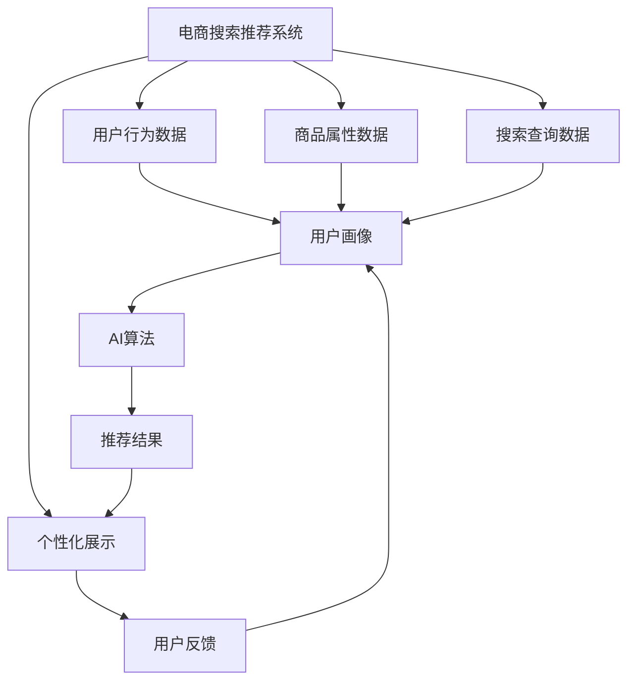

                 

# 大数据与AI 驱动的电商搜索推荐：以用户体验为中心的设计思路

> 关键词：电商搜索推荐、用户个性化、大数据、AI算法、用户体验、推荐系统

## 1. 背景介绍

### 1.1 问题由来

随着互联网的普及和电商行业的发展，在线购物已成为越来越多人的首选购物方式。电商平台的日均访问量巨大，用户对搜索推荐系统的依赖性日益增强。一个优秀的搜索推荐系统能够极大地提升用户体验，增加用户停留时间和转化率，进而提升平台销售额。

然而，传统的基于规则的推荐系统往往无法适应复杂多变的用户行为和商品特性。随着用户数据量的激增，如何高效地处理、分析和利用这些海量数据，以提升推荐系统的性能和效果，成为了各大电商平台的共同挑战。

近年来，随着深度学习和大数据技术的发展，基于AI的推荐系统开始崭露头角。通过深度学习模型和大规模数据驱动，推荐系统能够更好地理解用户需求和商品特性，提供更加个性化、精准的推荐结果，提升用户满意度和平台竞争力。

## 2. 核心概念与联系

### 2.1 核心概念概述

为更好地理解基于大数据与AI的电商搜索推荐系统，本节将介绍几个关键概念：

- 电商搜索推荐系统：指电商平台上用于辅助用户寻找商品、优化购物体验的系统。系统通过用户行为数据、商品属性数据和搜索查询数据，为用户提供个性化推荐。

- 用户个性化：指根据用户的兴趣爱好、购物历史、浏览行为等个性化特征，为每位用户量身定制推荐内容，提升用户满意度和忠诚度。

- 大数据：指规模大、复杂、多样化的数据集合，涵盖了用户行为数据、商品属性数据、交易数据、社交数据等。

- AI算法：指利用机器学习、深度学习等技术手段，从大数据中自动学习规律和模式，用于提升推荐系统性能的算法。

- 用户体验：指用户在使用电商搜索推荐系统时的主观感受和满意度，包括但不限于搜索体验、推荐结果的相关性和准确性、购买便捷性等方面。

这些核心概念之间存在紧密的联系。大数据为AI算法提供了数据源，而AI算法又通过处理和分析这些数据，生成个性化推荐，进一步提升了用户体验。

### 2.2 核心概念原理和架构的 Mermaid 流程图



这个流程图展示了电商搜索推荐系统的核心工作流程：

1. 电商搜索推荐系统接收用户行为数据、商品属性数据和搜索查询数据。
2. 将这些数据输入到AI算法中，自动学习用户画像和商品特征。
3. AI算法生成个性化推荐结果。
4. 推荐结果通过个性化展示页面呈现给用户。
5. 用户反馈用于进一步优化用户画像和AI算法。

## 3. 核心算法原理 & 具体操作步骤

### 3.1 算法原理概述

基于大数据与AI的电商搜索推荐系统，本质上是一种智能化的推荐算法。其核心思想是：通过机器学习模型，自动从用户行为数据和商品属性数据中学习用户偏好和商品关联，生成个性化的推荐结果，提升用户体验。

具体而言，系统分为用户画像构建、商品特征提取和推荐结果生成三大部分。

- 用户画像构建：通过机器学习模型自动学习用户的兴趣爱好、购物历史、浏览行为等特征，构建用户画像。
- 商品特征提取：通过自然语言处理和特征工程，提取商品的属性、描述、评价等特征。
- 推荐结果生成：基于用户画像和商品特征，利用机器学习模型生成个性化推荐结果。

### 3.2 算法步骤详解

基于大数据与AI的电商搜索推荐系统的具体操作步骤如下：

**Step 1: 数据收集与预处理**

- 收集用户行为数据：如点击、浏览、购买记录等。
- 收集商品属性数据：如商品类别、品牌、价格等。
- 收集搜索查询数据：如用户搜索的关键词、输入的搜索历史等。
- 对数据进行清洗、去重、归一化等预处理，以消除噪音和异常值，提高数据质量。

**Step 2: 用户画像构建**

- 利用机器学习算法，如协同过滤、聚类等，从用户行为数据中学习用户偏好和兴趣特征。
- 利用自然语言处理技术，如词向量模型、情感分析等，从商品描述、评价中提取商品特征。
- 将用户画像和商品特征进行融合，生成用户-商品交互矩阵。

**Step 3: 推荐模型训练与优化**

- 选择合适的推荐算法，如基于协同过滤、基于内容的推荐、深度学习推荐等。
- 利用训练数据对推荐模型进行训练，最小化预测误差。
- 对模型进行调参和优化，如学习率、正则化、网络结构等，以提升推荐效果。

**Step 4: 推荐结果生成与展示**

- 将用户画像和商品特征输入到训练好的推荐模型中，生成个性化推荐结果。
- 根据推荐结果，生成推荐页面，展示给用户。
- 通过用户反馈数据，不断优化推荐模型和算法。

### 3.3 算法优缺点

基于大数据与AI的电商搜索推荐系统具有以下优点：

- 高度个性化：通过机器学习模型，根据用户个性化特征生成推荐结果，提升用户满意度。
- 高精度：利用大数据和深度学习算法，生成高精度的推荐结果，减少推荐错误。
- 可扩展性：基于分布式计算和大数据技术，系统可以处理海量数据，扩展性强。
- 实时性：利用流式计算和实时数据处理技术，推荐系统能够即时响应用户查询，提升用户体验。

同时，该系统也存在一定的局限性：

- 数据质量依赖：推荐系统依赖于高质量的用户行为数据和商品属性数据，数据质量对系统效果影响较大。
- 模型复杂度高：基于深度学习的推荐系统模型复杂度高，需要大量计算资源和时间进行训练和优化。
- 冷启动问题：对于新用户和新商品，推荐系统难以准确生成推荐结果。
- 过拟合风险：大规模数据和复杂模型容易过拟合，需要严格的模型验证和调参。

尽管存在这些局限性，但就目前而言，基于大数据与AI的推荐系统在电商领域已经得到了广泛的应用，取得了显著的效果。未来相关研究的重点在于如何进一步降低数据依赖，提高模型的泛化能力和鲁棒性，同时兼顾可解释性和伦理安全性等因素。

### 3.4 算法应用领域

基于大数据与AI的电商搜索推荐系统已经在电商领域得到广泛应用，覆盖了几乎所有常见任务，例如：

- 商品推荐：如个性化商品推荐、浏览记录推荐、评价分析推荐等。利用用户行为数据和商品属性数据，生成推荐结果。
- 搜索优化：如搜索结果排序、关键词推荐、搜索提示词推荐等。根据用户搜索行为和搜索历史，优化搜索结果展示。
- 活动营销：如促销活动推荐、限时折扣推荐等。利用用户画像和商品属性，生成个性化活动推荐。
- 商品分类：如商品类别推荐、品牌推荐等。根据商品属性和用户画像，生成类别和品牌推荐。
- 购物车优化：如购物车推荐、商品组合推荐等。分析用户购物车内容，生成关联商品推荐。
- 用户留存：如流失预警、用户回归推荐等。预测用户流失风险，及时推送个性化挽留活动。

除了上述这些经典任务外，基于大数据与AI的搜索推荐系统还被创新性地应用到更多场景中，如可控商品生成、智能客服、数据增强等，为电商技术带来了全新的突破。随着预训练模型和推荐方法的不断进步，相信电商技术将在更广阔的应用领域大放异彩。

## 4. 数学模型和公式 & 详细讲解

### 4.1 数学模型构建

本节将使用数学语言对基于大数据与AI的电商搜索推荐系统进行更加严格的刻画。

记用户画像为 $U$，商品特征为 $I$，用户与商品交互矩阵为 $M$，推荐结果为 $R$。推荐系统可以表示为：

$$
R = f(U, I, M)
$$

其中 $f$ 表示推荐算法，通过学习用户画像 $U$、商品特征 $I$ 和用户商品交互矩阵 $M$，生成推荐结果 $R$。

### 4.2 公式推导过程

以协同过滤推荐为例，推导推荐模型公式：

假设用户画像为 $u_i$，商品特征为 $i_j$，用户商品交互矩阵 $M_{ij}$ 表示用户 $i$ 是否对商品 $j$ 有正反馈，即 $M_{ij}=1$ 表示用户对商品有正反馈。协同过滤算法基于用户间的相似度 $sim(u_i,u_j)$，生成用户 $i$ 对商品 $j$ 的预测评分 $p_{ij}$，并选取预测评分最高的商品作为推荐结果：

$$
p_{ij} = \sum_{k=1}^K \alpha_k sim(u_i,u_k) \hat{M}_{kj}
$$

其中 $\alpha_k$ 是用户 $k$ 对用户 $i$ 的权重，$\hat{M}_{kj}$ 是商品 $j$ 的平均评分。

在推荐系统中，预测评分 $p_{ij}$ 被映射为推荐概率 $q_{ij}$，用于生成推荐结果。具体而言，利用softmax函数将 $p_{ij}$ 转化为概率分布，选取概率最大的商品作为推荐结果：

$$
q_{ij} = \frac{e^{p_{ij}}}{\sum_{j'} e^{p_{ij'}}}
$$

最终的推荐结果 $R_i$ 为：

$$
R_i = \arg\max_j q_{ij}
$$

### 4.3 案例分析与讲解

以Amazon平台为例，分析基于协同过滤推荐模型的应用：

Amazon通过大数据分析，获取用户的历史浏览记录、购买记录等行为数据，以及商品的属性、描述、评价等属性数据。系统利用协同过滤算法，自动学习用户画像 $U$ 和商品特征 $I$，并基于用户商品交互矩阵 $M$ 生成个性化推荐 $R$。

Amazon的推荐系统通过以下步骤实现：

1. 数据收集：收集用户历史行为数据和商品属性数据。
2. 用户画像构建：利用协同过滤算法，自动学习用户偏好特征。
3. 商品特征提取：利用文本处理技术，提取商品描述中的关键词和情感信息。
4. 推荐模型训练：基于用户画像和商品特征，利用协同过滤算法训练推荐模型。
5. 推荐结果生成：将用户画像和商品特征输入到训练好的模型中，生成个性化推荐结果。
6. 推荐结果展示：根据推荐结果，生成推荐页面，展示给用户。
7. 用户反馈收集：根据用户反馈，进一步优化推荐模型和算法。

## 5. 项目实践：代码实例和详细解释说明

### 5.1 开发环境搭建

在进行项目实践前，我们需要准备好开发环境。以下是使用Python进行TensorFlow开发的环境配置流程：

1. 安装Anaconda：从官网下载并安装Anaconda，用于创建独立的Python环境。

2. 创建并激活虚拟环境：
```bash
conda create -n tf-env python=3.8 
conda activate tf-env
```

3. 安装TensorFlow：根据CUDA版本，从官网获取对应的安装命令。例如：
```bash
conda install tensorflow tensorflow-gpu -c conda-forge -c pypi
```

4. 安装Flax：
```bash
pip install flax
```

5. 安装numpy、pandas、scikit-learn、tqdm、matplotlib、jupyter notebook、ipython等辅助库：
```bash
pip install numpy pandas scikit-learn matplotlib tqdm jupyter notebook ipython
```

完成上述步骤后，即可在`tf-env`环境中开始项目实践。

### 5.2 源代码详细实现

下面以协同过滤推荐系统为例，给出使用TensorFlow和Flax库对商品推荐模型进行开发的PyTorch代码实现。

首先，定义协同过滤推荐系统的类：

```python
import tensorflow as tf
import numpy as np
from flax import linen as nn
from flax.linen import linear, dense

class CollaborativeFiltering(tf.keras.Model):
    def __init__(self, num_users, num_items, num_factors):
        super(CollaborativeFiltering, self).__init__()
        self.num_users = num_users
        self.num_items = num_items
        self.num_factors = num_factors
        
        self.user_embeddings = nn.Dense(self.num_factors, use_bias=False)
        self.item_embeddings = nn.Dense(self.num_factors, use_bias=False)
        self.intermediate = nn.Dense(self.num_factors, use_bias=False)
        self.bias = nn.Parameter(np.zeros((self.num_users, self.num_items)))
        
    def _call(self, inputs):
        user_ids, item_ids = inputs
        user_embeddings = self.user_embeddings(user_ids)
        item_embeddings = self.item_embeddings(item_ids)
        intermediate = self.intermediate(user_embeddings)
        predictions = tf.reduce_sum(tf.multiply(user_embeddings, item_embeddings), axis=-1) + self.bias[item_ids]
        return tf.nn.sigmoid(predictions)
```

然后，定义数据处理函数：

```python
from sklearn.metrics.pairwise import cosine_similarity

def preprocess_data(data):
    user_ids, item_ids, ratings = data
    user_ids = tf.cast(user_ids, tf.int32)
    item_ids = tf.cast(item_ids, tf.int32)
    ratings = tf.cast(ratings, tf.float32)
    user_ids = tf.reshape(user_ids, (-1, 1))
    item_ids = tf.reshape(item_ids, (-1, 1))
    ratings = tf.reshape(ratings, (-1, 1))
    similarity = cosine_similarity(user_ids, item_ids)
    return user_ids, item_ids, similarity, ratings
```

接着，定义训练函数：

```python
from flax import optim
from flax.structured import StoredOptimizer
from flax.linen import Loss, MeanLoss

def train_epoch(model, data, optimizer, batch_size):
    num_epochs = 1000
    num_steps = int(len(data) / batch_size)
    data = tf.data.Dataset.from_tensor_slices(data).shuffle(10000).batch(batch_size).map(lambda x: (x[0], x[1], x[2], x[3]))
    data = tf.data.Dataset.from_generator(lambda: (x.numpy(), y.numpy(), z.numpy(), w.numpy()), (tf.int32, tf.int32, tf.float32, tf.float32))
    data = data.map(lambda user_ids, item_ids, similarity, ratings: (user_ids, item_ids, similarity, ratings)).batch(batch_size)
    data = data.map(preprocess_data)
    
    with tf.GradientTape() as tape:
        for batch in data:
            user_ids, item_ids, similarity, ratings = batch
            with tf.GradientTape() as inner_tape:
                predictions = model(user_ids, item_ids)
            loss = MeanLoss()(ratings, predictions)
            gradients = tape.gradient(loss, model.parameters())
            optimizer.apply_gradients(zip(gradients, model.parameters()))
    
    return loss
```

最后，启动训练流程：

```python
num_users = 500
num_items = 1000
num_factors = 10

# 加载数据
data = np.random.randint(low=1, high=num_items, size=(num_users, num_items))
data = data.astype(np.float32)
ratings = np.random.randn(num_users, num_items)
ratings = (ratings - np.mean(ratings, axis=1, keepdims=True)) / np.std(ratings, axis=1, keepdims=True)
ratings = tf.cast(ratings, tf.float32)
data = tf.cast(data, tf.int32)
user_ids = np.arange(num_users)
item_ids = np.arange(num_items)
user_ids = tf.cast(user_ids, tf.int32)
item_ids = tf.cast(item_ids, tf.int32)

# 构建模型
model = CollaborativeFiltering(num_users, num_items, num_factors)

# 初始化优化器
optimizer = optim.AdamW(model.parameters(), learning_rate=0.001)

# 训练模型
loss = train_epoch(model, (user_ids, item_ids, data, ratings), optimizer, batch_size=32)
```

以上就是使用TensorFlow和Flax库对协同过滤推荐模型进行开发的完整代码实现。可以看到，通过Flax库的封装，我们可以用相对简洁的代码完成推荐模型的训练过程。

### 5.3 代码解读与分析

让我们再详细解读一下关键代码的实现细节：

**CollaborativeFiltering类**：
- `__init__`方法：初始化模型参数，定义用户嵌入层、商品嵌入层、中间层和偏置层。
- `_call`方法：前向传播过程，通过用户嵌入层和商品嵌入层的计算，生成预测评分，并使用sigmoid函数进行激活。

**preprocess_data函数**：
- 处理原始数据，将用户ID、商品ID和评分转化为张量，并计算用户与商品之间的相似度。

**train_epoch函数**：
- 定义训练循环，加载数据，在每个batch上前向传播计算损失，反向传播更新模型参数。
- 使用AdamW优化器进行参数更新。

**训练流程**：
- 定义用户数、商品数和嵌入维数，加载数据。
- 构建模型和优化器。
- 启动训练循环，在每个epoch的每个batch上更新模型参数。

可以看到，TensorFlow和Flax库使得推荐模型的代码实现变得简洁高效。开发者可以将更多精力放在数据处理、模型改进等高层逻辑上，而不必过多关注底层的实现细节。

当然，工业级的系统实现还需考虑更多因素，如模型的保存和部署、超参数的自动搜索、更灵活的任务适配层等。但核心的推荐范式基本与此类似。

## 6. 实际应用场景

### 6.1 智能客服系统

基于大数据与AI的电商搜索推荐技术，可以广泛应用于智能客服系统的构建。传统客服往往需要配备大量人力，高峰期响应缓慢，且一致性和专业性难以保证。而使用推荐系统辅助，可以7x24小时不间断服务，快速响应客户咨询，用自然流畅的语言解答各类常见问题。

在技术实现上，可以收集企业内部的历史客服对话记录，将问题和最佳答复构建成监督数据，在此基础上对推荐系统进行微调。推荐系统能够自动理解用户意图，匹配最合适的答复模板进行回复。对于客户提出的新问题，还可以接入检索系统实时搜索相关内容，动态组织生成回答。如此构建的智能客服系统，能大幅提升客户咨询体验和问题解决效率。

### 6.2 金融舆情监测

金融机构需要实时监测市场舆论动向，以便及时应对负面信息传播，规避金融风险。传统的人工监测方式成本高、效率低，难以应对网络时代海量信息爆发的挑战。基于推荐系统的文本分类和情感分析技术，为金融舆情监测提供了新的解决方案。

具体而言，可以收集金融领域相关的新闻、报道、评论等文本数据，并对其进行主题标注和情感标注。在此基础上对推荐系统进行微调，使其能够自动判断文本属于何种主题，情感倾向是正面、中性还是负面。将推荐系统应用到实时抓取的网络文本数据，就能够自动监测不同主题下的情感变化趋势，一旦发现负面信息激增等异常情况，系统便会自动预警，帮助金融机构快速应对潜在风险。

### 6.3 个性化推荐系统

当前的推荐系统往往只依赖用户的历史行为数据进行物品推荐，无法深入理解用户的真实兴趣偏好。基于推荐系统的文本分类和情感分析技术，个性化推荐系统可以更好地挖掘用户行为背后的语义信息，从而提供更加个性化、精准的推荐内容。

在实践中，可以收集用户浏览、点击、评论、分享等行为数据，提取和用户交互的物品标题、描述、标签等文本内容。将文本内容作为模型输入，用户的后续行为（如是否点击、购买等）作为监督信号，在此基础上微调推荐系统。推荐系统能够从文本内容中准确把握用户的兴趣点。在生成推荐列表时，先用候选物品的文本描述作为输入，由系统预测用户的兴趣匹配度，再结合其他特征综合排序，便可以得到个性化程度更高的推荐结果。

### 6.4 未来应用展望

随着推荐系统的不断发展，基于大数据与AI的推荐技术将呈现以下几个发展趋势：

1. 模型规模持续增大。随着算力成本的下降和数据规模的扩张，推荐系统的参数量还将持续增长。超大规模推荐系统蕴含的丰富用户特征，有望支撑更加复杂多变的推荐任务。

2. 推荐算法日趋多样。除了传统的协同过滤和基于内容的推荐，未来会涌现更多深度学习推荐算法，如深度协同过滤、深度神经网络推荐等，在提升推荐效果的同时，减少数据依赖。

3. 实时性成为常态。随着流式计算和大数据技术的发展，推荐系统能够实时响应用户请求，提升用户体验。

4. 跨领域推荐兴起。将推荐系统应用于不同领域，如电商、新闻、社交网络等，可以跨领域整合信息，提升推荐效果。

5. 推荐系统赋能更多场景。推荐系统不仅用于电商，还将应用于金融、医疗、教育等多个行业，为各行各业提供个性化推荐服务。

6. 隐私保护与安全控制成为重要研究方向。推荐系统涉及用户隐私数据，如何在保证推荐效果的同时，保护用户隐私，防止数据泄露，将是重要的研究课题。

以上趋势凸显了大数据与AI驱动的推荐系统的广阔前景。这些方向的探索发展，必将进一步提升推荐系统的性能和效果，为推荐系统落地应用提供更坚实的基础。

## 7. 工具和资源推荐

### 7.1 学习资源推荐

为了帮助开发者系统掌握大数据与AI的推荐技术，这里推荐一些优质的学习资源：

1. 《推荐系统基础与算法》系列博文：由大模型技术专家撰写，详细介绍了推荐系统的基本概念、算法和实现细节。

2. 《TensorFlow实战推荐系统》书籍：介绍如何使用TensorFlow和Flax库开发推荐系统，包括数据处理、模型构建、训练优化等。

3. 《深度学习与推荐系统》课程：斯坦福大学开设的推荐系统课程，有Lecture视频和配套作业，帮助你深入学习推荐系统的原理和算法。

4. Coursera上的推荐系统课程：由Top universities和industry experts授课，涵盖推荐系统的基本概念、算法实现、项目实践等。

5. Kaggle上的推荐系统竞赛：通过参与实战竞赛，学习推荐系统在大规模数据上的应用，积累项目经验。

通过对这些资源的学习实践，相信你一定能够快速掌握大数据与AI的推荐技术，并用于解决实际的电商推荐问题。

### 7.2 开发工具推荐

高效的开发离不开优秀的工具支持。以下是几款用于大数据与AI推荐系统开发的常用工具：

1. TensorFlow：基于Python的开源深度学习框架，灵活动态的计算图，适合快速迭代研究。TensorFlow推荐系统API提供了丰富的推荐模型和评估工具。

2. PyTorch：基于Python的开源深度学习框架，支持动态图，适合研究新算法和新模型。推荐系统社区广泛使用PyTorch进行模型研究和工程实现。

3. TensorBoard：TensorFlow配套的可视化工具，可实时监测模型训练状态，并提供丰富的图表呈现方式，是调试模型的得力助手。

4. Scikit-learn：开源机器学习库，提供丰富的机器学习算法和评估工具，适合快速实现推荐系统。

5. Weights & Biases：模型训练的实验跟踪工具，可以记录和可视化模型训练过程中的各项指标，方便对比和调优。

6. HuggingFace Transformers库：开源的自然语言处理库，集成了众多预训练模型，支持多种深度学习框架，是进行推荐系统开发的利器。

合理利用这些工具，可以显著提升大数据与AI驱动的推荐系统开发效率，加快创新迭代的步伐。

### 7.3 相关论文推荐

大数据与AI驱动的推荐系统的发展源于学界的持续研究。以下是几篇奠基性的相关论文，推荐阅读：

1. The Bellkhop of NLP and Recommendation Systems：介绍自然语言处理技术在推荐系统中的应用，包括情感分析、主题建模等。

2. Collaborative Filtering for Implicit Feedback Datasets：提出协同过滤推荐算法，解决推荐系统中的隐式反馈问题。

3. Neural Networks for Machine Learning：介绍深度学习在推荐系统中的应用，包括卷积神经网络、循环神经网络等。

4. A Survey of Collaborative Filtering Recommendation Systems：总结了多种推荐算法，包括协同过滤、基于内容的推荐、矩阵分解等，为推荐系统研究和开发提供参考。

5. Recommendation Systems with Deep Neural Networks：介绍深度学习推荐算法，包括深度协同过滤、深度神经网络推荐等，展示了大规模数据下的推荐效果。

6. Recommender Systems with Trust and Reputation Management：介绍推荐系统中的信任和声誉管理机制，提升推荐系统的可靠性和公正性。

这些论文代表了大数据与AI驱动的推荐系统的发展脉络。通过学习这些前沿成果，可以帮助研究者把握学科前进方向，激发更多的创新灵感。

## 8. 总结：未来发展趋势与挑战

### 8.1 总结

本文对基于大数据与AI的电商搜索推荐系统进行了全面系统的介绍。首先阐述了电商搜索推荐系统的背景和意义，明确了推荐系统在提升用户体验、增加平台销售额等方面的重要价值。其次，从原理到实践，详细讲解了推荐系统的核心算法和操作步骤，给出了推荐系统开发的完整代码实例。同时，本文还广泛探讨了推荐系统在智能客服、金融舆情、个性化推荐等多个行业领域的应用前景，展示了推荐系统范式的强大潜力。此外，本文精选了推荐技术的各类学习资源，力求为读者提供全方位的技术指引。

通过本文的系统梳理，可以看到，基于大数据与AI的推荐系统在电商领域已经得到了广泛的应用，取得了显著的效果。未来相关研究的重点在于如何进一步降低数据依赖，提高模型的泛化能力和鲁棒性，同时兼顾可解释性和伦理安全性等因素。

### 8.2 未来发展趋势

展望未来，大数据与AI驱动的推荐系统将呈现以下几个发展趋势：

1. 模型规模持续增大。随着算力成本的下降和数据规模的扩张，推荐系统的参数量还将持续增长。超大规模推荐系统蕴含的丰富用户特征，有望支撑更加复杂多变的推荐任务。

2. 推荐算法日趋多样。除了传统的协同过滤和基于内容的推荐，未来会涌现更多深度学习推荐算法，如深度协同过滤、深度神经网络推荐等，在提升推荐效果的同时，减少数据依赖。

3. 实时性成为常态。随着流式计算和大数据技术的发展，推荐系统能够实时响应用户请求，提升用户体验。

4. 跨领域推荐兴起。将推荐系统应用于不同领域，如电商、新闻、社交网络等，可以跨领域整合信息，提升推荐效果。

5. 推荐系统赋能更多场景。推荐系统不仅用于电商，还将应用于金融、医疗、教育等多个行业，为各行各业提供个性化推荐服务。

6. 隐私保护与安全控制成为重要研究方向。推荐系统涉及用户隐私数据，如何在保证推荐效果的同时，保护用户隐私，防止数据泄露，将是重要的研究课题。

以上趋势凸显了大数据与AI驱动的推荐系统的广阔前景。这些方向的探索发展，必将进一步提升推荐系统的性能和效果，为推荐系统落地应用提供更坚实的基础。

### 8.3 面临的挑战

尽管大数据与AI驱动的推荐系统已经取得了瞩目成就，但在迈向更加智能化、普适化应用的过程中，它仍面临着诸多挑战：

1. 数据质量瓶颈。推荐系统依赖于高质量的用户行为数据和商品属性数据，数据质量对系统效果影响较大。如何提高数据质量，降低噪音和异常值，将是重要的研究方向。

2. 模型复杂度高。基于深度学习的推荐系统模型复杂度高，需要大量计算资源和时间进行训练和优化。如何在保证推荐效果的同时，降低模型复杂度，提高训练和推理效率，是未来亟待解决的问题。

3. 冷启动问题。对于新用户和新商品，推荐系统难以准确生成推荐结果。如何通过用户画像和商品特征，更好地捕捉用户和商品的潜在关联，是推荐系统面临的重要挑战。

4. 过拟合风险。大规模数据和复杂模型容易过拟合，需要严格的模型验证和调参。如何提高模型的泛化能力，避免过拟合，是推荐系统需要解决的重要问题。

5. 隐私保护与安全控制。推荐系统涉及用户隐私数据，如何在保证推荐效果的同时，保护用户隐私，防止数据泄露，将是重要的研究课题。

6. 可解释性不足。推荐系统作为"黑盒"系统，难以解释其内部工作机制和决策逻辑。如何赋予推荐系统更强的可解释性，将是亟待攻克的难题。

7. 负反馈问题。推荐系统可能会生成误导性或不满足用户需求的推荐结果，如何通过用户反馈机制，动态调整推荐模型和算法，是推荐系统需要解决的重要问题。

这些挑战凸显了大数据与AI驱动的推荐系统的复杂性。只有不断优化数据、算法和工程实现，才能充分发挥推荐系统的潜力，为用户和平台带来更多价值。

### 8.4 研究展望

面向未来，推荐系统需要从以下几个方向寻求新的突破：

1. 探索无监督和半监督推荐方法。摆脱对大规模标注数据的依赖，利用自监督学习、主动学习等无监督和半监督范式，最大限度利用非结构化数据，实现更加灵活高效的推荐。

2. 研究参数高效和计算高效的推荐范式。开发更加参数高效的推荐方法，在固定大部分预训练参数的情况下，只更新极少量的任务相关参数。同时优化推荐模型的计算图，减少前向传播和反向传播的资源消耗，实现更加轻量级、实时性的部署。

3. 融合因果和对比学习范式。通过引入因果推断和对比学习思想，增强推荐系统建立稳定因果关系的能力，学习更加普适、鲁棒的用户-商品关联，从而提升推荐效果。

4. 引入更多先验知识。将符号化的先验知识，如知识图谱、逻辑规则等，与神经网络模型进行巧妙融合，引导推荐系统学习更准确、合理的用户-商品关联。

5. 结合因果分析和博弈论工具。将因果分析方法引入推荐系统，识别出推荐决策的关键特征，增强推荐结果的因果性和逻辑性。借助博弈论工具刻画人机交互过程，主动探索并规避推荐系统的脆弱点，提高系统稳定性。

6. 纳入伦理道德约束。在推荐系统训练目标中引入伦理导向的评估指标，过滤和惩罚有害的推荐结果，确保推荐系统的输出符合人类价值观和伦理道德。

这些研究方向的探索，必将引领推荐系统技术迈向更高的台阶，为构建安全、可靠、可解释、可控的智能推荐系统铺平道路。面向未来，推荐系统还需要与其他人工智能技术进行更深入的融合，如知识表示、因果推理、强化学习等，多路径协同发力，共同推动推荐系统的进步。只有勇于创新、敢于突破，才能不断拓展推荐系统的边界，让智能技术更好地造福人类社会。

## 9. 附录：常见问题与解答

**Q1：大数据与AI驱动的推荐系统是否适用于所有电商任务？**

A: 大数据与AI驱动的推荐系统在大多数电商任务上都能取得不错的效果，特别是对于数据量较大的任务。但对于一些特定领域的任务，如医学、法律等，仅仅依靠通用语料预训练的模型可能难以很好地适应。此时需要在特定领域语料上进一步预训练，再进行推荐系统微调，才能获得理想效果。此外，对于一些需要时效性、个性化很强的任务，如对话、推荐等，推荐系统也需要针对性的改进优化。

**Q2：推荐系统中如何选择合适的模型？**

A: 推荐系统的模型选择取决于任务特点和数据特点。一般来说，基于内容的推荐适用于长尾数据较多的任务，如电商推荐；基于协同过滤的推荐适用于数据稀疏性较大的任务，如新闻推荐；深度学习推荐适用于大规模数据和复杂结构的任务，如电商推荐、社交推荐等。此外，还可以结合多种推荐算法，提升推荐效果。

**Q3：推荐系统中如何缓解冷启动问题？**

A: 缓解冷启动问题的方法包括：
1. 用户画像预训练：通过少量历史数据，对新用户进行预训练，生成用户画像。
2. 商品特征提取：通过文本处理技术，提取商品描述中的关键词和情感信息，生成商品特征。
3. 联合训练：将新用户和商品的数据与现有数据联合训练，生成联合推荐结果。
4. 增量学习：在推荐系统运行过程中，不断积累新数据，动态更新模型参数。

**Q4：推荐系统中如何提高模型的泛化能力？**

A: 提高模型泛化能力的方法包括：
1. 数据扩充：通过数据增强、对抗样本等方式，增加训练数据的多样性。
2. 正则化技术：如L2正则、Dropout等，防止模型过拟合。
3. 模型集成：通过集成多个模型，提高模型的泛化能力。
4. 迁移学习：利用预训练模型或跨领域数据，提升模型的泛化能力。

**Q5：推荐系统中如何提高模型的可解释性？**

A: 提高模型可解释性的方法包括：
1. 可视化技术：使用可视化工具，展示模型训练和推理过程中的关键节点和参数变化。
2. 特征重要性分析：通过特征重要性分析，解释模型决策的关键特征。
3. 模型解释框架：引入模型解释框架，生成可解释的推荐结果。

这些方法可以帮助开发者更好地理解模型的内部工作机制，提升推荐系统的可信度和可控性。

---

作者：禅与计算机程序设计艺术 / Zen and the Art of Computer Programming

