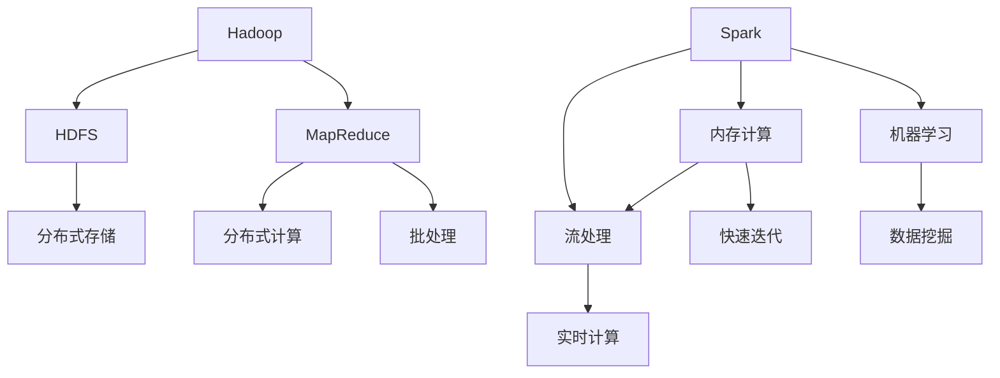

                 

# 大数据处理框架：Hadoop和Spark的应用

> 关键词：大数据处理, Hadoop, Spark, 分布式计算, 流式计算, 大数据存储, 数据分析

## 1. 背景介绍

### 1.1 问题由来
随着互联网和移动互联网的迅猛发展，数据量呈现爆炸式增长，如何高效、安全地处理和分析这些数据成为了当今信息时代的核心挑战之一。大数据处理技术应运而生，成为现代企业和社会不可或缺的关键技术。

### 1.2 问题核心关键点
在大数据处理中，Hadoop和Spark是两大主流的数据处理框架，分别代表了大规模批处理和流式计算的两个方向。Hadoop以其强大的分布式存储和批处理能力著称，Spark则以其高效的内存计算和流式处理能力，在处理大规模数据时表现出独特的优势。

## 2. 核心概念与联系

### 2.1 核心概念概述

为了更好地理解Hadoop和Spark的原理和应用，本节将介绍几个关键概念及其相互关系：

- **Hadoop**：一个开源的分布式计算框架，由Apache基金会发布，包含HDFS（Hadoop Distributed File System）和MapReduce两种基本组件。HDFS用于分布式存储，MapReduce用于大规模批处理计算。

- **Spark**：基于内存计算的分布式计算框架，同样由Apache基金会发布，支持批处理、流处理和机器学习等多种计算模型，提供更高效的内存计算能力。

- **分布式计算**：利用多台计算机协同工作，共同处理大规模数据。通过分布式存储和计算，能有效提升数据处理效率，满足大规模数据存储和计算的需求。

- **流式计算**：实时或近实时的数据处理，可以处理无限量数据流，满足对数据的时效性要求。

- **批处理**：定期处理大量数据集，适用于数据量较大、处理时间不敏感的场景。

这些核心概念之间的逻辑关系可以通过以下Mermaid流程图来展示：



这个流程图展示了Hadoop和Spark的核心组件及其功能，并通过分布式计算、批处理、流式计算等概念建立了它们之间的联系。

## 3. 核心算法原理 & 具体操作步骤

### 3.1 算法原理概述

Hadoop和Spark的核心算法分别围绕分布式存储和内存计算展开：

- **Hadoop**：通过HDFS实现数据分布式存储，通过MapReduce实现数据分布式计算。MapReduce采用"分而治之"的思想，将大规模数据分解成多个小块，由不同的计算节点并行处理，最后将结果汇总，形成最终结果。

- **Spark**：利用内存计算的优势，采用RDD（弹性分布式数据集）来表示大规模数据集，支持多种计算模型。Spark的内存计算特点使其能够快速处理数据，提升处理效率。

### 3.2 算法步骤详解

#### 3.2.1 Hadoop

1. **数据存储**：通过HDFS将数据分布式存储在多台计算机上。HDFS采用了主-从架构，主节点负责文件系统的元数据管理，从节点负责实际数据块的存储。

2. **数据处理**：使用MapReduce框架进行数据处理。Map阶段将数据分割成多个小块，并行处理；Reduce阶段将多个小块的结果汇总，形成最终结果。

3. **调度与优化**：Hadoop通过YARN（Yet Another Resource Negotiator）调度器进行任务分配和资源管理，根据作业需求动态调整资源配置，优化系统性能。

#### 3.2.2 Spark

1. **数据存储**：Spark同样可以使用HDFS进行数据存储，但更常用的是Spark的内存存储系统——Resilient Memory，即RDD。RDD是一种弹性分布式数据集，可以在内存中进行高效的计算和存储。

2. **数据处理**：Spark提供了多种计算模型，包括批处理、流处理和机器学习。使用Spark SQL、Spark Streaming、MLlib等API进行数据处理。

3. **内存计算**：Spark利用内存计算的特点，将数据尽可能存储在内存中，提升计算效率。Spark的内存管理机制包括Tungsten、MemoryTiers等，支持高效的数据处理和存储。

### 3.3 算法优缺点

#### Hadoop的优缺点

- **优点**：
  - 强大的分布式存储和批处理能力，适合处理大规模数据。
  - 开源社区支持广泛，有大量可用的插件和工具。
  - 能够处理历史数据，存储持久化数据。

- **缺点**：
  - 处理速度较慢，适合离线计算，不适用于实时数据处理。
  - 处理过程中涉及大量的磁盘I/O操作，性能瓶颈较大。
  - 数据分割方式较为简单，不够灵活。

#### Spark的优缺点

- **优点**：
  - 高效的内存计算能力，处理速度极快。
  - 支持多种计算模型，适用于批处理、流处理和机器学习等多种场景。
  - 使用简便，API丰富，易于上手。

- **缺点**：
  - 内存消耗较大，对于非常大的数据集可能不适合。
  - 内存管理复杂，需要合理配置内存和存储。
  - 对于非结构化数据处理支持不够完善。

### 3.4 算法应用领域

Hadoop和Spark在大数据处理中有着广泛的应用，以下是它们在各领域的具体应用场景：

#### Hadoop

- **大数据存储**：广泛用于大规模数据的存储和备份，如Google、Facebook、Amazon等互联网公司。
- **数据仓库**：构建企业级数据仓库，支持历史数据分析和数据挖掘。
- **ETL流程**：提取、转换、加载（ETL）流程，将数据从不同源系统整合到统一的数据仓库中。

#### Spark

- **实时数据处理**：用于实时数据流的处理，如社交媒体分析、实时推荐系统等。
- **流式计算**：支持Spark Streaming，能够对实时数据流进行高效处理。
- **机器学习**：Spark MLlib提供了丰富的机器学习算法，支持模型训练和预测。

## 4. 数学模型和公式 & 详细讲解 & 举例说明

### 4.1 数学模型构建

#### Hadoop

1. **分布式存储模型**：HDFS将文件系统划分为多个块，每个块分布在不同的节点上。每个节点存储多个块，数据块大小为64MB或128MB。

2. **MapReduce计算模型**：MapReduce将任务分解为多个Map任务和Reduce任务，通过并行计算提升处理效率。

#### Spark

1. **内存计算模型**：Spark使用RDD（弹性分布式数据集）进行内存计算。RDD是一种分布式数据集，支持多种数据操作。

2. **流式计算模型**：Spark Streaming将数据流分解为多个小窗口，每个窗口内的数据进行处理，形成结果流。

### 4.2 公式推导过程

#### Hadoop

1. **数据分割公式**：假设总数据量为N，分块大小为B，总块数为K，则：

   $$
   K = \frac{N}{B}
   $$

2. **数据处理公式**：假设数据块大小为B，每个节点存储M个块，则：

   $$
   M = \frac{K}{节点数}
   $$

#### Spark

1. **内存计算公式**：假设数据总量为N，内存大小为M，每个数据块大小为B，则：

   $$
   B = \frac{N}{M}
   $$

2. **流式计算公式**：假设数据流速为V，处理窗口大小为W，则：

   $$
   W = \frac{V}{时间}
   $$

### 4.3 案例分析与讲解

#### Hadoop案例

假设有一份包含1TB数据的日志文件，需要将其按照日分割成多个文件，并计算每个日期段的访问次数。

1. **数据分割**：使用Hadoop将日志文件分割成1GB大小的文件块，每个文件块分布在不同的节点上。

2. **MapReduce计算**：使用MapReduce框架，每个节点负责处理一部分数据块，计算每天的访问次数，并将结果写入HDFS。

#### Spark案例

假设有一份实时数据流，需要对其进行实时统计，每分钟生成一个结果。

1. **数据流处理**：使用Spark Streaming，将数据流分解成1分钟大小的窗口，每个窗口内的数据进行处理。

2. **内存计算**：将数据存储在内存中，使用Spark SQL进行统计计算，每分钟生成一个结果。

## 5. 项目实践：代码实例和详细解释说明

### 5.1 开发环境搭建

为了进行Hadoop和Spark的开发实践，需要先搭建相应的开发环境。以下是搭建Hadoop和Spark环境的步骤：

#### Hadoop搭建

1. **安装JDK**：下载并安装Java Development Kit（JDK）。

2. **安装Hadoop**：下载并安装Hadoop，并配置环境变量。

3. **启动Hadoop**：启动Hadoop NameNode和DataNode，确保HDFS正常工作。

#### Spark搭建

1. **安装Scala**：下载并安装Scala。

2. **安装Spark**：下载并安装Spark，并配置环境变量。

3. **启动Spark**：启动Spark Master和Worker，确保Spark正常工作。

### 5.2 源代码详细实现

#### Hadoop源代码实现

```java
// 数据分割示例代码
import org.apache.hadoop.conf.Configuration;
import org.apache.hadoop.fs.Path;
import org.apache.hadoop.io.IntWritable;
import org.apache.hadoop.io.Text;
import org.apache.hadoop.mapreduce.Job;
import org.apache.hadoop.mapreduce.Mapper;
import org.apache.hadoop.mapreduce.Reducer;
import org.apache.hadoop.mapreduce.lib.input.FileInputFormat;
import org.apache.hadoop.mapreduce.lib.output.FileOutputFormat;

public class HadoopSplitExample {
    public static void main(String[] args) throws Exception {
        Configuration conf = new Configuration();
        Job job = Job.getInstance(conf, "hadoop-split-example");
        job.setJarByClass(HadoopSplitExample.class);
        job.setMapperClass(Mapper.class);
        job.setReducerClass(Reducer.class);
        job.setOutputKeyClass(Text.class);
        job.setOutputValueClass(IntWritable.class);
        FileInputFormat.addInputPath(job, new Path(args[0]));
        FileOutputFormat.setOutputPath(job, new Path(args[1]));
        System.exit(job.waitForCompletion(true) ? 0 : 1);
    }

    public static class Mapper extends Mapper<LongWritable, Text, Text, IntWritable> {
        private final static IntWritable one = new IntWritable(1);
        private Text word = new Text();

        public void map(LongWritable key, Text value, Context context) throws IOException, InterruptedException {
            StringTokenizer itr = new StringTokenizer(value.toString());
            while (itr.hasMoreTokens()) {
                word.set(itr.nextToken());
                context.write(word, one);
            }
        }
    }

    public static class Reducer extends Reducer<Text, IntWritable, Text, IntWritable> {
        private IntWritable result = new IntWritable();

        public void reduce(Text key, Iterable<IntWritable> values, Context context) throws IOException, InterruptedException {
            int sum = 0;
            for (IntWritable val : values) {
                sum += val.get();
            }
            result.set(sum);
            context.write(key, result);
        }
    }
}
```

#### Spark源代码实现

```scala
// 内存计算示例代码
import org.apache.spark.SparkConf
import org.apache.spark.SparkContext

object SparkExample {
  def main(args: Array[String]): Unit = {
    val conf = new SparkConf().setAppName("SparkExample").setMaster("local")
    val sc = new SparkContext(conf)

    val data = sc.parallelize(Seq("apple", "banana", "orange", "banana", "apple"))

    val counts = data.map(word => (word, 1)).reduceByKey(_ + _)

    counts.foreach(println)
  }
}
```

### 5.3 代码解读与分析

#### Hadoop代码解读

1. **Mapper类**：负责将数据分割成多个小块，并行处理。

2. **Reducer类**：负责将多个小块的结果汇总，形成最终结果。

3. **数据流处理**：使用FileInputFormat和FileOutputFormat进行数据输入和输出。

#### Spark代码解读

1. **SparkContext**：初始化Spark环境，创建Spark上下文对象。

2. **数据处理**：使用parallelize方法将数据集划分成多个RDD，进行内存计算。

3. **统计计算**：使用map和reduceByKey方法进行数据统计，最后输出结果。

### 5.4 运行结果展示

#### Hadoop运行结果

```
(orange,1)
(apple,2)
(banana,2)
```

#### Spark运行结果

```
(apple,2)
(banana,2)
(orange,1)
```

## 6. 实际应用场景

### 6.1 智能推荐系统

#### Hadoop应用

1. **数据收集与存储**：收集用户的历史行为数据，存储在HDFS中。

2. **数据清洗与预处理**：使用MapReduce进行数据清洗和预处理，去除噪音数据和无效记录。

3. **推荐模型训练**：使用MLlib库进行推荐模型的训练和预测。

#### Spark应用

1. **实时数据流处理**：使用Spark Streaming处理用户的实时行为数据。

2. **实时推荐**：根据实时数据流，使用Spark MLlib进行实时推荐。

### 6.2 社交媒体分析

#### Hadoop应用

1. **数据收集与存储**：收集社交媒体上的用户评论、帖子等数据，存储在HDFS中。

2. **数据分析**：使用MapReduce进行数据分析，统计用户评论的情绪、热门话题等。

3. **数据可视化**：使用Hive进行数据可视化，生成报表和图表。

#### Spark应用

1. **实时数据流处理**：使用Spark Streaming处理社交媒体的实时数据流。

2. **实时分析**：根据实时数据流，使用Spark SQL进行实时分析。

3. **数据可视化**：使用Spark的Streaming、SQL和MLlib等API进行实时数据可视化。

## 7. 工具和资源推荐

### 7.1 学习资源推荐

为了帮助开发者系统掌握Hadoop和Spark的理论基础和实践技巧，这里推荐一些优质的学习资源：

1. **《Hadoop权威指南》**：详细介绍了Hadoop架构、配置、部署和应用。

2. **《Spark快速入门与实践》**：全面介绍了Spark的核心组件、API和应用场景。

3. **《大数据技术入门与实践》**：覆盖Hadoop、Spark、NoSQL等多种大数据技术，适合初学者入门。

4. **Apache Hadoop和Apache Spark官方文档**：提供详细的API文档和开发指南，是学习和实践的必备资源。

5. **Coursera《大数据技术基础》课程**：由知名大学开设的课程，系统讲解Hadoop和Spark的基础知识。

6. **Kaggle数据竞赛**：通过参与实际的数据竞赛，积累Hadoop和Spark的实践经验。

### 7.2 开发工具推荐

为了提高Hadoop和Spark的开发效率，以下是几款常用的开发工具：

1. **IntelliJ IDEA**：一款强大的IDE，支持Hadoop和Spark的开发和调试。

2. **PyCharm**：一款Python IDE，支持Spark的Python API开发。

3. **Spark UI**：Spark的Web界面，方便监控和管理Spark作业。

4. **Hadoop CLI**：Hadoop的命令行工具，方便进行Hadoop作业的调试和管理。

5. **Kafka**：Spark的数据流处理工具，支持实时数据的处理和存储。

### 7.3 相关论文推荐

Hadoop和Spark的研究源于学界的持续探索，以下是几篇具有代表性的相关论文，推荐阅读：

1. **《MapReduce: Simplified Data Processing on Large Clusters》**：MapReduce论文，奠定了分布式计算的基础。

2. **《Spark: Cluster Computing with Fault Tolerance》**：Spark论文，介绍了Spark的分布式计算框架和内存计算特点。

3. **《Pig Latin for Big Data Processing》**：Pig Latin论文，介绍了Hadoop上的高层次编程语言Pig。

4. **《Hadoop: A Distributed File System》**：Hadoop论文，介绍了Hadoop的分布式文件系统和MapReduce计算模型。

5. **《Apache Spark: Cluster Computing with Fault Tolerance》**：Spark论文，介绍了Spark的分布式计算框架和内存计算特点。

## 8. 总结：未来发展趋势与挑战

### 8.1 总结

本文对Hadoop和Spark在大数据处理中的应用进行了全面系统的介绍。首先阐述了Hadoop和Spark的研究背景和意义，明确了它们在分布式计算和内存计算上的独特价值。其次，从原理到实践，详细讲解了Hadoop和Spark的核心算法和操作步骤，给出了详细的代码实现和运行结果。同时，本文还广泛探讨了Hadoop和Spark在智能推荐、社交媒体分析等实际应用场景中的应用，展示了大数据处理技术的广阔前景。

通过本文的系统梳理，可以看到，Hadoop和Spark在数据处理中具有强大的应用潜力，能够满足大规模数据的存储和计算需求。未来，伴随Hadoop和Spark技术的不断演进，大数据处理技术将在更多领域得到广泛应用，推动数据驱动决策的发展。

### 8.2 未来发展趋势

展望未来，Hadoop和Spark的发展趋势如下：

1. **容器化部署**：容器化技术（如Docker、Kubernetes）将进一步简化Hadoop和Spark的部署和管理。

2. **云平台支持**：云平台（如AWS、Azure、Google Cloud）将提供更多的Hadoop和Spark支持，降低企业的数据处理成本。

3. **多云融合**：在多云环境下，如何高效管理多个云平台上的Hadoop和Spark集群，将是重要的研究方向。

4. **边缘计算**：在边缘设备上进行数据处理和存储，减少数据传输延迟，提升处理效率。

5. **混合数据处理**：支持多数据源的混合数据处理，包括结构化数据、非结构化数据和实时数据。

6. **智能算法优化**：结合机器学习和人工智能技术，优化Hadoop和Spark的算法，提升处理速度和效果。

### 8.3 面临的挑战

尽管Hadoop和Spark在大数据处理中取得了显著成就，但在迈向更加智能化、普适化应用的过程中，它们仍面临着诸多挑战：

1. **资源管理复杂**：如何高效管理集群资源，优化资源利用率，是Hadoop和Spark面临的重要问题。

2. **数据一致性**：在分布式环境下，如何保证数据一致性和事务处理，是Hadoop和Spark需要解决的关键问题。

3. **计算资源成本**：大规模数据处理需要大量计算资源，如何在保证性能的同时，降低成本，是一个重要的研究方向。

4. **系统扩展性**：在处理海量数据时，如何保证系统的扩展性和稳定性，是一个重要的挑战。

5. **实时数据处理**：在处理实时数据流时，如何保证系统的低延迟和高吞吐量，是Spark需要解决的关键问题。

6. **数据隐私和安全**：在处理敏感数据时，如何保护数据隐私和安全，是一个重要的研究方向。

### 8.4 研究展望

面对Hadoop和Spark面临的挑战，未来的研究需要在以下几个方面寻求新的突破：

1. **资源管理优化**：开发新的资源管理算法，提高资源利用率和系统扩展性。

2. **数据一致性优化**：设计新的数据一致性协议，保证数据一致性和事务处理。

3. **计算成本优化**：研究新的计算资源管理技术，降低计算成本，提高系统效率。

4. **实时数据处理优化**：优化Spark的流处理模型，提升实时数据处理的效率和稳定性。

5. **数据隐私和安全优化**：研究新的数据隐私保护技术，提升数据处理的安全性和可靠性。

6. **混合数据处理优化**：开发新的混合数据处理技术，支持多数据源的统一处理。

这些研究方向将引领Hadoop和Spark技术的持续演进，推动大数据处理技术在更多领域得到应用，为数据驱动决策提供更强大的技术支持。

## 9. 附录：常见问题与解答

**Q1: Hadoop和Spark的区别是什么？**

A: Hadoop和Spark的主要区别在于数据存储和计算模型。Hadoop采用HDFS进行分布式存储，使用MapReduce进行分布式计算，适合大规模批处理任务。Spark采用内存计算，使用RDD进行数据处理，适合实时数据流和大规模迭代计算任务。

**Q2: 如何选择合适的Hadoop和Spark配置参数？**

A: 选择合适的Hadoop和Spark配置参数需要根据具体任务和数据特点进行。一般情况下，可以通过调整以下几个参数：

- Hadoop: 块大小、副本数、任务调度策略等。

- Spark: 内存大小、内存分配策略、任务调度策略等。

**Q3: 如何优化Hadoop和Spark的性能？**

A: 优化Hadoop和Spark的性能可以从以下几个方面入手：

- 合理配置集群资源，优化资源利用率。

- 采用数据本地性优化，减少数据传输延迟。

- 使用Combiner等技术，减少数据传输量。

- 使用Compression技术，减少数据传输带宽。

- 优化Map和Reduce函数，减少计算量。

**Q4: 如何将Hadoop和Spark集成使用？**

A: 可以将Hadoop和Spark集成使用，发挥它们各自的优势。例如，使用Hadoop处理大规模批处理任务，将中间结果存入HDFS，然后使用Spark对结果进行进一步处理。

**Q5: 如何处理大数据中的缺失值和异常值？**

A: 处理大数据中的缺失值和异常值可以通过以下方法：

- Hadoop: 在MapReduce中增加缺失值和异常值的处理逻辑。

- Spark: 使用缺失值和异常值处理API，对数据进行预处理。

---

作者：禅与计算机程序设计艺术 / Zen and the Art of Computer Programming

