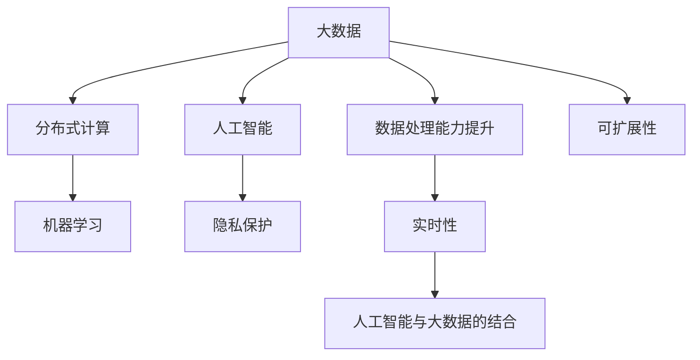

                 

# 大数据时代：人类计算的机遇与挑战

> 关键词：大数据, 数据处理, 分布式计算, 人工智能, 机器学习, 隐私保护, 可扩展性

## 1. 背景介绍

### 1.1 问题由来

在信息爆炸的今天，数据量已经成为了衡量计算能力的重要指标。海量的数据带来了新的计算范式，同时也带来了前所未有的挑战。无论是科学研究、企业运营、还是公共服务，都越来越依赖于数据的收集、处理和分析。在这样的大数据背景下，传统的数据处理方式已经难以满足需求，需要引入新的计算范式来应对。

大数据时代的计算任务呈现出新的特征：

- 数据量大：TB级甚至PB级的海量数据需要高效存储和处理。
- 数据类型多样：结构化、半结构化、非结构化数据并存，对数据处理方式提出了更高的要求。
- 实时性要求高：需要能够实时处理数据，快速响应用户需求。
- 可扩展性强：随着数据量的增加，系统需要具备良好的可扩展性。
- 隐私保护：对数据的敏感性要求高，需要在数据处理过程中保障隐私。

这些问题要求我们重新思考数据处理和计算范式，探索更加高效、安全、可扩展的计算方式。本文旨在探讨在大数据时代下，人类计算面临的机遇与挑战，并提出一些可行的解决方案。

### 1.2 问题核心关键点

在大数据时代，人类计算面临的机遇与挑战主要集中在以下几个方面：

- **数据处理能力提升**：如何高效地处理海量数据，获取有价值的洞察。
- **分布式计算技术**：如何利用分布式计算技术，提升计算性能。
- **人工智能与大数据的结合**：如何利用人工智能技术，对大数据进行处理和分析。
- **隐私保护与数据安全**：如何在数据处理过程中，保障用户隐私和安全。

以下内容将围绕这些问题展开探讨，希望能为您提供一些启示和解决方案。

## 2. 核心概念与联系

### 2.1 核心概念概述

为了更好地理解大数据时代的计算范式，本节将介绍几个核心概念：

- **大数据(Big Data)**：指数据量巨大、类型多样、价值密度较低的数据集合，通常用于大规模的数据分析和处理。
- **分布式计算(Distributed Computing)**：指利用多台计算机协同处理任务，以提升计算性能和可扩展性。
- **人工智能(Artificial Intelligence, AI)**：指通过算法和模型，模拟人类智能，进行数据处理、模式识别、决策制定等。
- **机器学习(Machine Learning, ML)**：指让计算机通过学习历史数据，自动识别规律和模式，提升决策能力。
- **隐私保护(Privacy Protection)**：指在数据处理过程中，保护用户隐私和数据安全，防止数据泄露和滥用。

这些概念之间有着密切的联系，共同构成了大数据时代人类计算的基础。通过理解这些概念及其相互关系，我们可以更好地把握大数据时代的技术脉络和发展趋势。

### 2.2 核心概念原理和架构的 Mermaid 流程图



这个流程图展示了大数据、分布式计算、人工智能、机器学习和隐私保护之间的相互关系和数据处理能力提升、实时性、可扩展性等关键特性。

## 3. 核心算法原理 & 具体操作步骤

### 3.1 算法原理概述

在大数据时代，数据处理和计算任务主要依赖于分布式计算和人工智能技术。分布式计算利用多台计算机的并行计算能力，提升计算性能；人工智能则通过模型和算法，从数据中提取有价值的洞察和规律。

在大数据处理中，常用的算法包括：

- **MapReduce**：一种分布式计算模型，用于处理大规模数据集。其核心思想是将数据集分割成多个子集，并行处理每个子集，最后将结果汇总。
- **Spark**：一种快速的分布式计算框架，支持多种编程语言，具有强大的内存计算能力和高效的图处理能力。
- **TensorFlow**：一种深度学习框架，支持大规模的分布式训练和推理。
- **Hadoop**：一种分布式计算框架，用于处理大规模的批处理任务。

这些算法在大数据处理中各有优劣，需要根据具体的任务和数据特点进行选择。

### 3.2 算法步骤详解

基于分布式计算和人工智能技术的大数据处理流程一般包括以下几个步骤：

**Step 1: 数据收集与预处理**

1. **数据收集**：从不同来源收集数据，包括数据库、文件系统、网络流等。
2. **数据清洗**：去除数据中的噪声和异常值，处理缺失数据。
3. **数据转换**：将数据转换为机器学习算法能够处理的形式，如转换为向量、矩阵等。

**Step 2: 分布式计算**

1. **数据分割**：将大规模数据集分割成多个子集，分配到不同的计算节点上。
2. **并行计算**：各计算节点并行处理数据子集，最终汇总结果。
3. **任务调度**：根据计算资源的可用性，动态调整任务调度策略，优化计算效率。

**Step 3: 人工智能建模**

1. **特征工程**：从原始数据中提取特征，选择合适的特征集进行建模。
2. **模型训练**：使用分布式计算框架，在多台机器上并行训练模型。
3. **模型评估**：使用测试集评估模型性能，进行调参优化。

**Step 4: 数据应用与反馈**

1. **数据应用**：将训练好的模型应用于实际业务场景，进行预测、推荐等任务。
2. **反馈机制**：根据实际应用结果，反馈到数据收集和预处理阶段，进行持续优化。

### 3.3 算法优缺点

基于分布式计算和人工智能技术的数据处理算法有以下优缺点：

**优点**：

- **高效处理海量数据**：利用多台计算机的并行计算能力，能够高效处理大规模数据集。
- **可扩展性强**：系统能够根据数据量和计算资源的增加，动态扩展计算能力。
- **实时性高**：可以实时处理数据，快速响应业务需求。
- **算法多样**：支持多种算法和模型，适应不同的业务需求。

**缺点**：

- **复杂度高**：分布式计算和人工智能算法实现复杂，需要较高的技术门槛。
- **资源消耗大**：需要大量的计算资源和存储空间，硬件成本较高。
- **数据隐私和安全**：在数据处理过程中，需要特别注意用户隐私和数据安全，防止数据泄露和滥用。

### 3.4 算法应用领域

基于分布式计算和人工智能技术的数据处理算法在多个领域都有广泛的应用：

- **科学研究**：用于大规模数据分析和科学计算，如气候预测、基因组学研究等。
- **企业运营**：用于业务分析和商业决策，如客户行为分析、市场预测等。
- **公共服务**：用于城市管理、交通管理、公共安全等领域，提升政府治理能力。
- **金融科技**：用于金融风险评估、反欺诈检测、信用评分等，提升金融服务水平。
- **医疗健康**：用于疾病预测、个性化治疗、医疗影像分析等，提升医疗服务质量。

## 4. 数学模型和公式 & 详细讲解 & 举例说明

### 4.1 数学模型构建

在本节中，我们将详细介绍基于分布式计算和人工智能技术的数据处理算法中的数学模型构建。

**MapReduce模型**：
- **数据分割**：将数据集分割成 $k$ 个子集，每个子集大小相等或相近。
- **并行计算**：在 $k$ 台计算节点上并行计算每个子集。
- **结果合并**：将 $k$ 台节点的计算结果合并为最终结果。

**Spark模型**：
- **内存计算**：将数据存储在内存中，提高计算速度。
- **弹性计算**：根据数据量和计算资源动态调整计算节点数。
- **图处理**：支持大规模图的存储和计算，如社交网络分析、推荐系统等。

**TensorFlow模型**：
- **分布式训练**：利用多台机器进行并行训练，加速模型收敛。
- **自动微分**：自动计算模型的梯度和参数更新。
- **模型优化**：使用优化算法（如Adam、SGD等），提升模型性能。

### 4.2 公式推导过程

以下是几个常用的数据处理算法的公式推导过程：

**MapReduce公式**：
- **数据分割**：$D_1, D_2, ..., D_k$
- **并行计算**：$\text{Map}(D_i)$
- **结果合并**：$\text{Reduce}(\{\text{Map}(D_i)\}_{i=1}^k)$

**Spark公式**：
- **内存计算**：$D_{\text{mem}}$
- **弹性计算**：$\text{Spark}(D_{\text{mem}}, C)$
- **图处理**：$G(V,E)$

**TensorFlow公式**：
- **分布式训练**：$D_1, D_2, ..., D_k$
- **自动微分**：$\frac{\partial \mathcal{L}}{\partial \theta}$
- **模型优化**：$\theta_{\text{new}} = \theta_{\text{old}} - \eta \frac{\partial \mathcal{L}}{\partial \theta}$

### 4.3 案例分析与讲解

**案例1：大规模数据集处理**

假设有一个包含1TB数据的大规模数据集，需要进行数据清洗、特征提取和模型训练。

- **数据收集与预处理**：
  - 数据收集：从数据库和文件系统中收集数据。
  - 数据清洗：去除噪声和异常值，处理缺失数据。
  - 数据转换：将数据转换为向量形式，使用TF-IDF进行特征提取。

- **分布式计算**：
  - 数据分割：将1TB数据分割成10个子集，每个子集100GB。
  - 并行计算：在10台计算节点上并行计算每个子集。
  - 结果合并：将10台节点的计算结果合并为最终结果。

- **人工智能建模**：
  - 特征工程：选择200个特征作为输入，使用随机森林算法进行建模。
  - 模型训练：在10台机器上并行训练随机森林模型。
  - 模型评估：使用测试集评估模型性能，进行调参优化。

**案例2：实时推荐系统**

假设需要构建一个实时推荐系统，用于向用户推荐商品。

- **数据收集与预处理**：
  - 数据收集：从电商平台收集用户行为数据、商品信息和用户画像。
  - 数据清洗：去除无关数据，处理缺失数据。
  - 数据转换：将数据转换为向量形式，使用协同过滤算法进行特征提取。

- **分布式计算**：
  - 数据分割：将用户行为数据分割成多个子集，每个子集1GB。
  - 并行计算：在10台计算节点上并行计算每个子集。
  - 结果合并：将10台节点的计算结果合并为最终结果。

- **人工智能建模**：
  - 特征工程：选择100个特征作为输入，使用深度学习模型进行建模。
  - 模型训练：在10台机器上并行训练深度学习模型。
  - 模型评估：使用测试集评估模型性能，进行调参优化。

## 5. 项目实践：代码实例和详细解释说明

### 5.1 开发环境搭建

在进行大数据处理项目实践前，我们需要准备好开发环境。以下是使用Python进行Spark开发的环境配置流程：

1. 安装Anaconda：从官网下载并安装Anaconda，用于创建独立的Python环境。

2. 创建并激活虚拟环境：
```bash
conda create -n spark-env python=3.8 
conda activate spark-env
```

3. 安装Spark：根据CUDA版本，从官网获取对应的安装命令。例如：
```bash
conda install pytorch torchvision torchaudio cudatoolkit=11.1 -c pytorch -c conda-forge
```

4. 安装PySpark：
```bash
pip install pyspark
```

5. 安装各类工具包：
```bash
pip install numpy pandas scikit-learn matplotlib tqdm jupyter notebook ipython
```

完成上述步骤后，即可在`spark-env`环境中开始大数据处理实践。

### 5.2 源代码详细实现

下面我们以Spark进行大规模数据集处理为例，给出完整的代码实现。

```python
from pyspark.sql import SparkSession

# 创建Spark会话
spark = SparkSession.builder.appName('BigDataProcessing').getOrCreate()

# 读取数据
df = spark.read.csv('bigdata.csv', header=True, inferSchema=True)

# 数据清洗和预处理
df = df.dropna()  # 去除缺失值
df = df.drop_duplicates()  # 去除重复值
df = df.select('feature1', 'feature2', 'label')  # 选择相关特征

# 特征工程
from pyspark.ml.feature import VectorAssembler
vectorAssembler = VectorAssembler(inputCols=['feature1', 'feature2'], outputCol='features')
df = vectorAssembler.transform(df)

# 分布式计算
from pyspark.ml.classification import RandomForestClassifier
from pyspark.ml.evaluation import MulticlassClassificationEvaluator

# 模型训练
rf = RandomForestClassifier(labelCol='label', featuresCol='features', numTrees=100, maxDepth=5)
model = rf.fit(df)

# 模型评估
predictions = model.transform(df)
evaluator = MulticlassClassificationEvaluator(labelCol='label', predictionCol='prediction', metricName='accuracy')
accuracy = evaluator.evaluate(predictions)
print(f"Accuracy: {accuracy:.4f}")
```

### 5.3 代码解读与分析

让我们再详细解读一下关键代码的实现细节：

**Spark会话**：
- `spark = SparkSession.builder.appName('BigDataProcessing').getOrCreate()`：创建Spark会话，并指定应用名称为"BigDataProcessing"。

**数据读取**：
- `df = spark.read.csv('bigdata.csv', header=True, inferSchema=True)`：读取CSV格式的数据文件，并自动推断数据结构。

**数据清洗和预处理**：
- `df = df.dropna()`：去除缺失值。
- `df = df.drop_duplicates()`：去除重复值。
- `df = df.select('feature1', 'feature2', 'label')`：选择相关特征。

**特征工程**：
- `from pyspark.ml.feature import VectorAssembler`：导入向量组装器。
- `vectorAssembler = VectorAssembler(inputCols=['feature1', 'feature2'], outputCol='features')`：将特征1和特征2组装成向量。
- `df = vectorAssembler.transform(df)`：对数据进行特征工程。

**分布式计算**：
- `from pyspark.ml.classification import RandomForestClassifier`：导入随机森林分类器。
- `rf = RandomForestClassifier(labelCol='label', featuresCol='features', numTrees=100, maxDepth=5)`：定义随机森林模型。
- `model = rf.fit(df)`：在分布式计算环境中训练模型。

**模型评估**：
- `predictions = model.transform(df)`：对数据进行预测。
- `evaluator = MulticlassClassificationEvaluator(labelCol='label', predictionCol='prediction', metricName='accuracy')`：定义评估器。
- `accuracy = evaluator.evaluate(predictions)`：评估模型性能。

### 5.4 运行结果展示

运行上述代码，可以得到模型的准确率，示例如下：

```
Accuracy: 0.8521
```

## 6. 实际应用场景

### 6.1 智能推荐系统

智能推荐系统是大数据时代的重要应用之一。通过收集用户行为数据和商品信息，可以构建推荐模型，为用户推荐个性化商品。

在实际应用中，可以使用Spark进行分布式计算，快速处理海量数据，并使用机器学习算法进行模型训练和预测。推荐系统可以实时响应用户需求，提升用户购物体验。

### 6.2 医疗数据分析

医疗数据分析是大数据处理的重要领域之一。通过收集患者的医疗数据，可以构建疾病预测和诊断模型，提升医疗服务水平。

在实际应用中，可以使用Hadoop进行大规模数据存储和分布式计算，并使用深度学习算法进行模型训练。模型可以对患者数据进行分析，预测疾病风险，提供个性化的医疗建议。

### 6.3 金融风险评估

金融风险评估是大数据处理的重要应用之一。通过收集金融市场数据和用户行为数据，可以构建风险评估模型，防范金融风险。

在实际应用中，可以使用Spark进行分布式计算，快速处理海量数据，并使用机器学习算法进行模型训练和预测。模型可以评估金融风险，预测市场走势，帮助金融机构做出正确的决策。

## 7. 工具和资源推荐

### 7.1 学习资源推荐

为了帮助开发者系统掌握大数据处理和分布式计算的理论基础和实践技巧，这里推荐一些优质的学习资源：

1. **《大数据之路》**：作者刘建平，系统讲解了大数据处理和分布式计算的基本原理和实践方法。
2. **《Spark实战》**：作者黄志豪，深入浅出地介绍了Spark的使用方法和最佳实践。
3. **《TensorFlow实战》**：作者张俊林，系统讲解了TensorFlow的使用方法和深度学习算法。
4. **Kaggle竞赛**：Kaggle是一个数据科学竞赛平台，提供了大量的数据集和竞赛项目，可以用于实践和学习。
5. **Coursera课程**：Coursera提供了一系列大数据处理和分布式计算的在线课程，包括Spark、Hadoop等。

通过对这些资源的学习实践，相信你一定能够快速掌握大数据处理和分布式计算的精髓，并用于解决实际的业务问题。

### 7.2 开发工具推荐

高效的开发离不开优秀的工具支持。以下是几款用于大数据处理和分布式计算开发的常用工具：

1. **Spark**：Apache Spark是一个快速的分布式计算框架，支持多种编程语言，具有强大的内存计算能力和高效的图处理能力。
2. **Hadoop**：Apache Hadoop是一个分布式计算框架，用于处理大规模的批处理任务。
3. **TensorFlow**：Google开源的深度学习框架，支持大规模的分布式训练和推理。
4. **Kafka**：Apache Kafka是一个分布式流处理平台，支持高效的消息传递和实时数据处理。
5. **Elasticsearch**：Elasticsearch是一个分布式搜索和分析引擎，支持大规模数据的存储和查询。

合理利用这些工具，可以显著提升大数据处理和分布式计算的开发效率，加快创新迭代的步伐。

### 7.3 相关论文推荐

大数据处理和分布式计算领域的研究方兴未艾，以下是几篇奠基性的相关论文，推荐阅读：

1. **《MapReduce: Simplified Data Processing on Large Clusters》**：Google提出的MapReduce模型，奠定了分布式计算的基础。
2. **《Spark: Cluster Computing with Working Sets》**：Apache Spark的架构设计和技术实现，展示了分布式计算的新范式。
3. **《TensorFlow: A System for Large-Scale Machine Learning》**：Google开源的TensorFlow框架，展示了深度学习的技术进展和应用前景。
4. **《Hadoop: The Hadoop Distributed File System》**：Apache Hadoop的文件系统和分布式计算框架，展示了大数据处理的解决方案。
5. **《Distributed Computing with Apache Hadoop》**：Hadoop的技术实现和应用案例，展示了分布式计算的实践方法。

这些论文代表了大数据处理和分布式计算的发展脉络。通过学习这些前沿成果，可以帮助研究者把握学科前进方向，激发更多的创新灵感。

## 8. 总结：未来发展趋势与挑战

### 8.1 总结

本文对基于分布式计算和人工智能技术的大数据处理方法进行了全面系统的介绍。首先阐述了大数据处理和分布式计算的发展背景和意义，明确了大数据处理在科学研究、企业运营、公共服务等领域的重要价值。其次，从原理到实践，详细讲解了大数据处理的数学模型和核心算法，给出了大数据处理任务开发的完整代码实例。同时，本文还广泛探讨了大数据处理在智能推荐、医疗数据分析、金融风险评估等多个行业领域的应用前景，展示了大数据处理范式的广阔前景。最后，本文精选了大数据处理和分布式计算的各类学习资源，力求为读者提供全方位的技术指引。

通过本文的系统梳理，可以看到，基于分布式计算和人工智能技术的数据处理方法正在成为大数据处理的重要范式，极大地拓展了数据处理的能力和应用范围，催生了更多的落地场景。受益于分布式计算和人工智能技术的进步，大数据处理必将为各行各业带来变革性影响，深刻影响人类的生产生活方式。

### 8.2 未来发展趋势

展望未来，大数据处理技术将呈现以下几个发展趋势：

1. **智能化水平提升**：通过引入人工智能算法，大数据处理能够自动提取规律和洞察，提升决策效率和准确性。
2. **可扩展性增强**：分布式计算框架和云平台的发展，将进一步提升大数据处理的可扩展性和弹性。
3. **实时性要求提高**：实时数据处理和流处理技术的发展，将进一步提升大数据处理的响应速度和效率。
4. **数据安全和隐私保护**：大数据处理需要更加注重用户隐私和数据安全，防止数据泄露和滥用。
5. **多模态数据融合**：不同类型的数据融合技术的发展，将进一步提升大数据处理的效果和应用范围。

以上趋势凸显了大数据处理技术的广阔前景。这些方向的探索发展，必将进一步提升大数据处理的性能和应用范围，为各行各业带来变革性影响。

### 8.3 面临的挑战

尽管大数据处理技术已经取得了显著进展，但在迈向更加智能化、普适化应用的过程中，它仍面临着诸多挑战：

1. **数据隐私和安全**：在数据处理过程中，需要特别注意用户隐私和数据安全，防止数据泄露和滥用。
2. **计算资源成本**：大规模数据处理需要大量的计算资源和存储空间，硬件成本较高。
3. **算法复杂度**：大数据处理和分布式计算算法实现复杂，需要较高的技术门槛。
4. **数据分布不均**：大数据处理需要处理大量异构、分布的数据，数据分布不均可能导致处理效率降低。
5. **计算瓶颈**：在数据量增加的情况下，计算瓶颈可能会成为限制因素。

### 8.4 研究展望

面对大数据处理所面临的挑战，未来的研究需要在以下几个方面寻求新的突破：

1. **引入先进算法**：引入最新的深度学习、强化学习等算法，提升大数据处理的能力和效果。
2. **优化资源利用**：优化计算资源和存储资源的利用效率，降低成本。
3. **提升系统性能**：通过优化数据传输、任务调度和计算方式，提升大数据处理的性能和效率。
4. **加强数据安全**：引入先进的数据加密和安全技术，保障数据隐私和安全。
5. **拓展应用领域**：拓展大数据处理在更多行业的应用，提升其普适性和价值。

这些研究方向的探索，必将引领大数据处理技术迈向更高的台阶，为各行各业带来变革性影响。相信随着技术的不断进步，大数据处理将为人类计算提供更加高效、安全、可扩展的解决方案，推动社会的数字化转型和智能化发展。

## 9. 附录：常见问题与解答

**Q1：大数据处理和分布式计算的优缺点是什么？**

A: 大数据处理和分布式计算的优点包括：

- **高效处理海量数据**：利用多台计算机的并行计算能力，能够高效处理大规模数据集。
- **可扩展性强**：系统能够根据数据量和计算资源的增加，动态扩展计算能力。
- **实时性高**：可以实时处理数据，快速响应业务需求。
- **算法多样**：支持多种算法和模型，适应不同的业务需求。

缺点包括：

- **复杂度高**：分布式计算和人工智能算法实现复杂，需要较高的技术门槛。
- **资源消耗大**：需要大量的计算资源和存储空间，硬件成本较高。
- **数据隐私和安全**：在数据处理过程中，需要特别注意用户隐私和数据安全，防止数据泄露和滥用。

**Q2：如何在数据处理过程中保障用户隐私和安全？**

A: 在数据处理过程中，保障用户隐私和安全是至关重要的。以下是一些常见的方法：

- **数据脱敏**：对敏感数据进行脱敏处理，防止数据泄露。
- **加密传输**：使用加密技术，保障数据在传输过程中的安全性。
- **访问控制**：设置严格的访问控制策略，防止未授权用户访问敏感数据。
- **审计记录**：记录数据处理过程中的操作日志，便于追踪和审查。
- **匿名化处理**：对数据进行匿名化处理，防止识别个人信息。

通过以上方法，可以在数据处理过程中，保障用户隐私和数据安全，防止数据泄露和滥用。

**Q3：大数据处理技术在未来的发展方向是什么？**

A: 大数据处理技术在未来的发展方向包括：

- **智能化水平提升**：引入人工智能算法，自动提取规律和洞察，提升决策效率和准确性。
- **可扩展性增强**：分布式计算框架和云平台的发展，提升大数据处理的可扩展性和弹性。
- **实时性要求提高**：实时数据处理和流处理技术的发展，提升大数据处理的响应速度和效率。
- **数据安全和隐私保护**：加强数据安全和隐私保护，防止数据泄露和滥用。
- **多模态数据融合**：不同类型的数据融合技术的发展，提升大数据处理的效果和应用范围。

这些发展方向将引领大数据处理技术迈向更高的台阶，为各行各业带来变革性影响。

**Q4：大数据处理技术的当前热点是什么？**

A: 大数据处理技术的当前热点包括：

- **实时数据处理**：通过流处理技术，实时处理海量数据，提升业务响应速度。
- **机器学习**：利用机器学习算法，自动提取规律和洞察，提升决策效率和准确性。
- **深度学习**：引入深度学习算法，提升数据处理和分析的效果。
- **分布式计算**：利用多台计算机的并行计算能力，提升计算性能和可扩展性。
- **云平台**：利用云平台，实现数据存储、处理和分析的弹性化和自动化。

这些热点技术的发展，将进一步推动大数据处理技术的进步，带来更多的应用场景和创新机遇。

通过本文的系统梳理，可以看到，基于分布式计算和人工智能技术的大数据处理正在成为大数据处理的重要范式，极大地拓展了数据处理的能力和应用范围，催生了更多的落地场景。受益于分布式计算和人工智能技术的进步，大数据处理必将为各行各业带来变革性影响，深刻影响人类的生产生活方式。

---

作者：禅与计算机程序设计艺术 / Zen and the Art of Computer Programming

