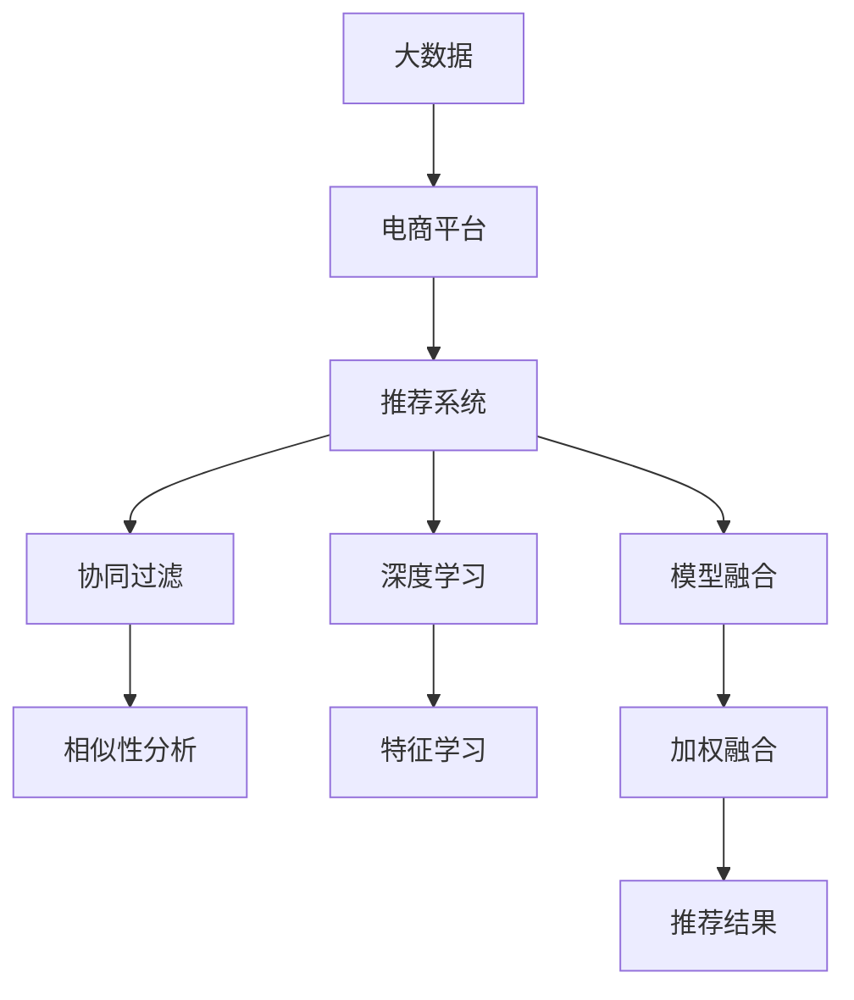

                 

# 大数据驱动的电商推荐系统：AI 模型融合技术在电商平台的应用

> 关键词：大数据, 电商平台, 推荐系统, AI 模型融合, 协同过滤, 深度学习, 模型融合

## 1. 背景介绍

随着电子商务的迅猛发展，电商平台已经成为全球范围内最重要的在线零售渠道之一。为了提高用户体验和销售额，电商平台纷纷引入智能推荐系统，通过分析用户行为数据，为用户精准推送可能感兴趣的商品。推荐系统作为电商平台的“大脑”，能够显著提升平台的用户粘性和转化率，是电商企业竞争力的核心之一。

然而，传统的推荐系统多基于规则和统计方法，如协同过滤、基于内容的推荐等，难以满足用户多样化的需求和复杂的场景变化。近年来，AI技术在电商推荐系统中的应用越来越广泛，特别是在深度学习和模型融合等前沿技术的应用上，推荐系统得到了前所未有的提升。本文将对电商平台中的AI推荐系统进行全面探讨，分析其中的算法原理和操作步骤，展示具体案例，并展望未来发展趋势和面临的挑战。

## 2. 核心概念与联系

### 2.1 核心概念概述

为了更好地理解AI推荐系统，本节将介绍几个关键概念：

- **大数据**：指规模巨大、复杂度高、速度快、类型多样的数据集，是现代AI推荐系统数据基础。
- **电商平台**：指通过互联网平台提供商品销售的在线商店，包括PC端和移动端。
- **推荐系统**：指利用算法推荐用户可能感兴趣的商品的系统。
- **AI 模型融合**：指将多种AI模型进行组合，取长补短，获得更好的推荐效果的技术。
- **协同过滤**：指通过用户行为数据进行相似性分析，推荐其他用户喜欢的商品。
- **深度学习**：指利用多层神经网络模型进行数据表示学习和模式识别的方法。
- **模型融合**：指将多个模型输出结果进行加权融合，提升推荐准确率。

这些核心概念之间存在紧密的联系，通过它们，我们能够构建出更高效的电商平台推荐系统。

### 2.2 核心概念原理和架构的 Mermaid 流程图



这个流程图展示了大数据、电商平台、推荐系统之间的关系，以及协同过滤、深度学习和模型融合等关键技术在其中的应用。

## 3. 核心算法原理 & 具体操作步骤
### 3.1 算法原理概述

AI推荐系统主要通过分析用户行为数据和商品属性数据，预测用户对不同商品的兴趣，从而进行精准推荐。其中，大数据、协同过滤、深度学习和模型融合是四个核心技术。

- **大数据**：推荐系统需要海量用户行为数据，用于分析用户偏好和行为模式。
- **协同过滤**：基于用户行为相似性，推荐用户可能感兴趣的商品。
- **深度学习**：通过多层神经网络模型，自动学习数据的高层次表示。
- **模型融合**：将多种模型的输出进行加权融合，提升推荐准确率。

### 3.2 算法步骤详解

基于AI模型融合的电商平台推荐系统主要包括以下几个关键步骤：

**Step 1: 数据收集与预处理**
- 收集电商平台上的用户行为数据，如浏览记录、购买记录、评分记录等。
- 清洗和整理数据，去除噪音和异常值。
- 划分训练集、验证集和测试集。

**Step 2: 特征提取与工程**
- 从用户行为数据中提取特征，如点击次数、浏览时长、浏览路径等。
- 将文本属性转换为数值特征，如商品名称、描述、品牌等。
- 设计特征工程流程，将原始数据转化为模型可接受的格式。

**Step 3: 协同过滤模型训练**
- 基于用户行为数据，训练协同过滤模型，如基于用户的协同过滤和基于物品的协同过滤。
- 使用准确率、召回率、F1分数等指标评估模型性能。

**Step 4: 深度学习模型训练**
- 使用深度神经网络模型，如深度协同过滤、深度神经网络推荐等，学习用户与商品的潜在关系。
- 使用均方误差、交叉熵等损失函数训练模型。
- 通过前向传播和反向传播更新模型参数。

**Step 5: 模型融合与优化**
- 将协同过滤和深度学习模型的输出进行加权融合，提升推荐效果。
- 使用模型融合算法，如加权平均、Adaboost等，综合多种模型。
- 优化融合参数，最大化推荐效果。

**Step 6: 部署与监控**
- 将训练好的模型部署到生产环境，实现实时推荐。
- 实时监控推荐系统性能，及时调整优化。

### 3.3 算法优缺点

基于AI模型融合的电商平台推荐系统有以下优点：

- **精度高**：融合多种模型，取长补短，能够提高推荐准确率。
- **泛化性强**：模型基于大数据训练，具备较强的泛化能力。
- **灵活性高**：模型可以动态更新，适应不同用户的个性化需求。

同时，该方法也存在以下缺点：

- **计算复杂**：融合多种模型需要更高的计算资源。
- **可解释性差**：深度学习模型的黑箱特性导致推荐结果难以解释。
- **模型选择困难**：需要合理选择多种模型，工作量大。

### 3.4 算法应用领域

基于AI模型融合的推荐系统已经广泛应用于多个电商平台的商品推荐中，包括：

- 亚马逊、京东、淘宝等主流电商平台。
- 垂直类电商网站，如母婴电商、服装电商、美妆电商等。
- 跨境电商，如全球速卖通、eBay等。
- 社交电商平台，如拼多多、蘑菇街等。

这些电商平台通过引入AI推荐技术，显著提升了用户体验和转化率，推动了电商业务的发展。

## 4. 数学模型和公式 & 详细讲解 & 举例说明

### 4.1 数学模型构建

在电商平台推荐系统中，常用的数学模型包括协同过滤模型和深度学习模型。

#### 4.1.1 协同过滤模型
协同过滤模型分为基于用户的协同过滤和基于物品的协同过滤。

基于用户的协同过滤模型：
$$
\hat{r}_{ui} = \alpha \sum_{j\in \mathcal{N}(u)} \frac{r_{uj}}{k_u} \times r_{ji}
$$
其中，$\hat{r}_{ui}$表示用户 $u$ 对物品 $i$ 的评分预测，$r_{ui}$ 为真实评分，$r_{uj}$ 为用户 $u$ 对物品 $j$ 的评分，$\mathcal{N}(u)$ 表示用户 $u$ 的邻居集合，$k_u$ 为邻居数，$\alpha$ 为衰减因子。

基于物品的协同过滤模型：
$$
\hat{r}_{ui} = \alpha \sum_{j\in \mathcal{N}(i)} \frac{r_{uj}}{k_i} \times r_{ji}
$$
其中，$\mathcal{N}(i)$ 表示物品 $i$ 的邻居集合，$k_i$ 为邻居数。

#### 4.1.2 深度学习模型
深度学习模型如深度协同过滤（Deep Collaborative Filtering），主要使用多层神经网络进行用户与物品的潜在关系学习。

假设有 $n$ 个用户和 $m$ 个物品，使用一个 $n \times m$ 的矩阵 $R$ 表示用户对物品的评分，$R$ 中的每个元素 $r_{ui}$ 表示用户 $u$ 对物品 $i$ 的评分。假设深度协同过滤模型由 $H$ 个隐藏层组成，每个隐藏层 $h_k$ 包含 $d_k$ 个神经元。模型的目标是最小化预测评分与真实评分之间的均方误差：
$$
\min_{\theta} \frac{1}{N} \sum_{i=1}^m \sum_{j=1}^n (\hat{r}_{ij} - r_{ij})^2
$$
其中 $\hat{r}_{ij}$ 为模型预测的评分，$r_{ij}$ 为真实评分，$\theta$ 为模型参数。

### 4.2 公式推导过程

以基于用户的协同过滤模型为例，推导评分预测公式。

假设用户 $u$ 的邻居集合为 $\mathcal{N}(u) = \{j_1, j_2, ..., j_k\}$，则用户 $u$ 对物品 $i$ 的评分预测公式为：
$$
\hat{r}_{ui} = \alpha \sum_{j\in \mathcal{N}(u)} \frac{r_{uj}}{k_u} \times r_{ji}
$$

其中，$\alpha$ 为衰减因子，$k_u$ 为邻居数，$r_{uj}$ 为用户 $u$ 对物品 $j$ 的评分，$r_{ji}$ 为物品 $j$ 对用户 $u$ 的评分，$\frac{r_{uj}}{k_u}$ 表示用户 $u$ 的邻居评分平均值。

通过将用户与物品的评分进行加权平均，协同过滤模型能够预测用户对未评分物品的评分，从而实现个性化推荐。

### 4.3 案例分析与讲解

以亚马逊商品推荐系统为例，展示AI模型融合的具体应用。

亚马逊的推荐系统采用了多种算法，包括协同过滤、深度学习、内容过滤等。协同过滤模型基于用户历史行为数据，推荐用户可能感兴趣的商品。深度学习模型通过分析用户行为特征，自动学习用户与商品的潜在关系。内容过滤模型则根据商品属性，推荐与用户过去浏览的商品相似的商品。

亚马逊的推荐系统首先使用协同过滤模型，筛选出与用户行为相似的用户和物品。然后，使用深度学习模型对用户行为特征进行学习，预测用户对未评分物品的评分。最后，使用内容过滤模型，推荐与用户过去浏览的商品相似的商品。

通过多种算法的融合，亚马逊的推荐系统能够实现高精度的个性化推荐，显著提升了用户购物体验和销售额。

## 5. 项目实践：代码实例和详细解释说明
### 5.1 开发环境搭建

在进行AI推荐系统开发前，我们需要准备好开发环境。以下是使用Python进行TensorFlow开发的环境配置流程：

1. 安装Anaconda：从官网下载并安装Anaconda，用于创建独立的Python环境。

2. 创建并激活虚拟环境：
```bash
conda create -n tf-env python=3.8 
conda activate tf-env
```

3. 安装TensorFlow：根据CUDA版本，从官网获取对应的安装命令。例如：
```bash
conda install tensorflow -c tf -c conda-forge
```

4. 安装Keras：Keras是一个高层次的神经网络API，能够方便地构建深度学习模型。
```bash
pip install keras
```

5. 安装Flask：Flask是一个轻量级的Web框架，用于实现推荐系统的前端展示。
```bash
pip install flask
```

完成上述步骤后，即可在`tf-env`环境中开始AI推荐系统的开发。

### 5.2 源代码详细实现

下面以协同过滤模型为例，展示使用TensorFlow进行推荐系统开发的PyTorch代码实现。

首先，定义协同过滤模型的输入和输出：

```python
import tensorflow as tf
from tensorflow.keras import layers, models

def create_model(input_dim, output_dim, k):
    input_layer = layers.Input(shape=(input_dim,))
    hidden_layer = layers.Dense(32, activation='relu')(input_layer)
    output_layer = layers.Dense(output_dim, activation='sigmoid')(hidden_layer)
    model = models.Model(input_layer, output_layer)
    model.compile(optimizer='adam', loss='binary_crossentropy')
    return model
```

然后，定义数据集和模型：

```python
# 定义数据集
train_data = pd.read_csv('train.csv', sep=',')
train_x = train_data.drop('rating', axis=1)
train_y = train_data['rating']

# 定义模型
model = create_model(train_x.shape[1], 1, k)
model.summary()

# 训练模型
history = model.fit(train_x, train_y, epochs=10, batch_size=32, validation_split=0.2)
```

最后，评估模型并输出推荐结果：

```python
# 评估模型
test_data = pd.read_csv('test.csv', sep=',')
test_x = test_data.drop('rating', axis=1)
test_y = test_data['rating']

# 输出推荐结果
y_pred = model.predict(test_x)
y_pred = np.round(y_pred)

# 输出推荐结果
for i in range(len(test_x)):
    print(f"User: {i+1}, Predicted rating: {y_pred[i][0][0]}")
```

以上就是使用TensorFlow进行协同过滤模型开发的完整代码实现。可以看到，TensorFlow提供了丰富的API和工具，方便构建和训练神经网络模型，从而实现高效的推荐系统开发。

### 5.3 代码解读与分析

让我们再详细解读一下关键代码的实现细节：

**create_model函数**：
- 定义输入层、隐藏层和输出层，使用ReLU激活函数和sigmoid输出层，用于二分类任务。
- 定义模型的优化器和损失函数，使用Adam优化器和二分类交叉熵损失函数。
- 返回模型实例，准备进行训练。

**数据集处理**：
- 从CSV文件中读取训练数据和测试数据，去除目标变量（即评分），保留特征变量。
- 将特征变量和目标变量划分为训练集和测试集，进行模型评估。

**模型训练**：
- 定义模型实例，使用训练集数据进行模型训练。
- 使用验证集进行模型验证，调整超参数。

**推荐结果输出**：
- 使用测试集数据进行模型预测，输出预测评分。
- 对预测评分进行四舍五入，输出推荐结果。

可以看到，TensorFlow提供了简单易用的API，方便开发者构建和训练神经网络模型，快速实现推荐系统的功能。

当然，工业级的系统实现还需考虑更多因素，如模型的保存和部署、超参数的自动搜索、更灵活的任务适配层等。但核心的推荐范式基本与此类似。

## 6. 实际应用场景

### 6.1 智能推荐引擎

基于AI推荐系统的智能推荐引擎是电商平台的核心组件之一。通过分析用户行为数据，推荐系统能够为用户精准推送可能感兴趣的商品，提升用户购物体验和平台粘性。

在技术实现上，智能推荐引擎需要收集用户浏览、点击、购买等行为数据，构建用户画像和物品属性特征，训练推荐模型。推荐模型根据用户和物品的相似度，计算推荐得分，排序生成推荐结果。推荐结果可以用于首页推荐、搜索推荐、个性化页推荐等多种场景。

### 6.2 广告推荐系统

电商平台的广告推荐系统也是一个典型的AI推荐应用场景。通过分析用户行为数据，推荐系统能够为广告主精准匹配潜在用户，提升广告点击率和转化率。

广告推荐系统需要收集用户的搜索记录、浏览记录、点击记录等行为数据，构建用户画像和广告特征，训练推荐模型。推荐模型根据用户和广告的相似度，计算推荐得分，排序生成推荐结果。推荐结果可以用于首页广告推荐、搜索广告推荐、个性化广告推荐等多种场景。

### 6.3 个性化商品推荐

电商平台的个性化商品推荐系统能够根据用户的个性化需求，推荐可能感兴趣的商品。通过分析用户历史浏览记录、购买记录、评分记录等数据，推荐系统能够为用户生成个性化的商品推荐列表。

个性化商品推荐系统需要收集用户行为数据，构建用户画像和商品特征，训练推荐模型。推荐模型根据用户和商品的相似度，计算推荐得分，排序生成推荐结果。推荐结果可以用于个性化推荐页、个性化搜索推荐、个性化广告推荐等多种场景。

### 6.4 未来应用展望

随着AI技术的发展，基于AI模型融合的推荐系统将在更多场景中得到应用，为电商行业带来变革性影响。

在未来，基于AI模型融合的推荐系统将具备以下特征：

- **实时性**：推荐系统能够实时分析用户行为数据，动态调整推荐结果，提升用户购物体验。
- **个性化**：推荐系统能够根据用户历史行为和实时行为，生成个性化的推荐结果，满足用户多样化需求。
- **多模态融合**：推荐系统能够融合文本、图像、音频等多模态数据，提升推荐准确率。
- **知识图谱整合**：推荐系统能够引入外部知识图谱，提升推荐效果，增强推荐内容的可信度。

通过这些技术突破，基于AI模型融合的推荐系统将能够更好地适应电商行业的需求，提升用户购物体验，推动电商业务的发展。

## 7. 工具和资源推荐
### 7.1 学习资源推荐

为了帮助开发者系统掌握AI推荐系统的理论基础和实践技巧，这里推荐一些优质的学习资源：

1. 《推荐系统实战》一书：详细介绍了推荐系统的发展历程和算法原理，以及具体实现方法。

2. 斯坦福大学CS244课程：斯坦福大学开设的推荐系统课程，内容涵盖协同过滤、深度学习、模型融合等多个方面，适合深度学习开发者。

3. 《深度学习推荐系统》一书：全面介绍了深度学习在推荐系统中的应用，包括协同过滤、深度神经网络推荐等。

4. 吴恩达机器学习课程：吴恩达教授的机器学习课程，涵盖数据预处理、模型训练、模型评估等多个方面，是学习推荐系统的必备资源。

5. Kaggle竞赛平台：Kaggle是一个开源数据竞赛平台，提供大量推荐系统竞赛数据集和算法实现代码，适合实践和竞赛。

通过对这些资源的学习实践，相信你一定能够快速掌握AI推荐系统的精髓，并用于解决实际的电商推荐问题。

### 7.2 开发工具推荐

高效的开发离不开优秀的工具支持。以下是几款用于AI推荐系统开发的常用工具：

1. TensorFlow：由Google主导开发的开源深度学习框架，生产部署方便，适合大规模工程应用。

2. PyTorch：基于Python的开源深度学习框架，灵活动态的计算图，适合快速迭代研究。

3. Scikit-learn：一个Python科学计算库，提供了丰富的机器学习算法和工具，适合快速实验和数据预处理。

4. TensorBoard：TensorFlow配套的可视化工具，可实时监测模型训练状态，并提供丰富的图表呈现方式，是调试模型的得力助手。

5. Keras：一个高层次的神经网络API，能够方便地构建深度学习模型，适合快速实验和模型部署。

合理利用这些工具，可以显著提升AI推荐系统的开发效率，加快创新迭代的步伐。

### 7.3 相关论文推荐

AI推荐系统的发展源于学界的持续研究。以下是几篇奠基性的相关论文，推荐阅读：

1. "Collaborative Filtering for Implicit Feedback Datasets"：提出基于矩阵分解的协同过滤模型，适用于处理隐式反馈数据。

2. "Fast Matrix Factorization Techniques for Recommender Systems"：提出矩阵分解的加速方法，提高协同过滤模型的计算效率。

3. "Deep Neural Networks for Recommender Systems"：提出深度协同过滤模型，使用多层神经网络学习用户和物品的潜在关系。

4. "Model-Based Deep Collaborative Filtering for Recommendations"：提出基于深度学习的协同过滤模型，提升推荐准确率。

5. "A Survey of Deep Learning for Recommender Systems"：全面综述了深度学习在推荐系统中的应用，涵盖协同过滤、深度神经网络推荐等。

这些论文代表了大语言模型微调技术的发展脉络。通过学习这些前沿成果，可以帮助研究者把握学科前进方向，激发更多的创新灵感。

## 8. 总结：未来发展趋势与挑战

### 8.1 总结

本文对基于AI模型融合的电商平台推荐系统进行了全面系统的介绍。首先阐述了AI推荐系统的背景和意义，明确了其在提升用户体验和平台粘性方面的独特价值。其次，从原理到实践，详细讲解了协同过滤、深度学习和模型融合等关键技术的算法原理和操作步骤，展示了具体案例。

通过本文的系统梳理，可以看到，基于AI模型融合的推荐系统已经在电商推荐中得到了广泛应用，显著提升了用户购物体验和平台转化率。未来，伴随AI技术的发展，推荐系统还将具备更强的实时性、个性化、多模态融合和知识图谱整合能力，为电商行业带来更深刻的变革。

### 8.2 未来发展趋势

展望未来，AI推荐系统将呈现以下几个发展趋势：

1. **实时推荐**：推荐系统能够实时分析用户行为数据，动态调整推荐结果，提升用户体验。
2. **个性化推荐**：推荐系统能够根据用户历史行为和实时行为，生成个性化的推荐结果，满足用户多样化需求。
3. **多模态融合**：推荐系统能够融合文本、图像、音频等多模态数据，提升推荐准确率。
4. **知识图谱整合**：推荐系统能够引入外部知识图谱，提升推荐效果，增强推荐内容的可信度。

这些趋势凸显了AI推荐系统的广阔前景。这些方向的探索发展，必将进一步提升推荐系统的性能和应用范围，为电商行业带来更深刻的变革。

### 8.3 面临的挑战

尽管AI推荐系统已经取得了瞩目成就，但在迈向更加智能化、普适化应用的过程中，它仍面临着诸多挑战：

1. **数据质量**：推荐系统依赖于高质量的数据，数据噪声和异常值会影响推荐效果。如何提高数据质量，保障数据安全，是未来的重要研究方向。
2. **计算资源**：推荐系统需要大量的计算资源，尤其是在多模态融合和知识图谱整合方面。如何提高计算效率，降低计算成本，是未来的重要研究方向。
3. **模型可解释性**：推荐系统使用的深度学习模型具有黑箱特性，难以解释其内部工作机制和决策逻辑。如何赋予推荐系统更强的可解释性，是未来的重要研究方向。
4. **鲁棒性**：推荐系统在面对新的用户和物品时，容易出现过拟合和灾难性遗忘。如何提高推荐系统的鲁棒性，避免过拟合和灾难性遗忘，是未来的重要研究方向。

这些挑战将推动推荐系统不断优化和提升，推动电商行业的发展和变革。

### 8.4 研究展望

未来，基于AI模型融合的推荐系统需要在以下几个方面寻求新的突破：

1. **数据融合与增强**：将更多数据来源（如社交媒体、物联网等）引入推荐系统，提升数据质量和多样性。
2. **多模态融合**：融合文本、图像、音频等多模态数据，提升推荐准确率。
3. **知识图谱整合**：引入外部知识图谱，提升推荐效果，增强推荐内容的可信度。
4. **实时推荐**：实时分析用户行为数据，动态调整推荐结果，提升用户体验。
5. **个性化推荐**：根据用户历史行为和实时行为，生成个性化的推荐结果，满足用户多样化需求。
6. **推荐模型解释性**：提升推荐系统的可解释性，帮助用户理解推荐过程和结果。
7. **推荐系统鲁棒性**：提高推荐系统的鲁棒性，避免过拟合和灾难性遗忘。

这些研究方向将推动推荐系统不断优化和提升，推动电商行业的发展和变革。

## 9. 附录：常见问题与解答

**Q1：电商平台中的推荐系统如何处理用户冷启动问题？**

A: 用户冷启动问题是推荐系统面临的一个普遍问题。在用户刚加入平台时，没有足够的历史行为数据，无法生成推荐结果。常见的解决方案包括：

1. 随机推荐：在用户刚加入时，使用一些热门商品或随机商品进行推荐，等待用户产生行为数据后再生成个性化推荐。
2. 基于兴趣的推荐：通过用户兴趣调查或标签等方式，为刚加入用户生成兴趣相关的推荐结果。
3. 推荐模型预训练：在平台未上线时，使用预训练的推荐模型，生成一些高质量的推荐结果。

通过这些方法，推荐系统能够解决用户冷启动问题，为用户提供良好的初始推荐体验。

**Q2：推荐系统中的协同过滤模型有哪些优缺点？**

A: 协同过滤模型具有以下优缺点：

**优点**：
- 能够利用用户之间的相似性，生成高质量的推荐结果。
- 适用于处理稀疏矩阵数据，能够处理大量用户和物品数据。
- 无需对数据进行标签标注，能够利用隐式反馈数据。

**缺点**：
- 模型难以处理新用户和新物品，容易出现冷启动问题。
- 对数据分布敏感，难以处理数据噪声和异常值。
- 模型依赖用户行为数据，难以适应用户行为变化。

**Q3：如何提高AI推荐系统的实时性？**

A: 提高推荐系统的实时性是推荐系统的重要研究方向。以下是一些提高实时性的方法：

1. 使用流式数据处理技术，实时处理用户行为数据，动态调整推荐结果。
2. 使用分布式计算框架，提高计算效率，提升实时性。
3. 使用高效的算法，如近似矩阵分解、在线协同过滤等，提高计算效率。
4. 使用缓存技术，存储高频访问的数据，提升查询速度。

通过这些方法，推荐系统能够实现高实时性的推荐，提升用户体验。

**Q4：推荐系统中的深度学习模型有哪些优缺点？**

A: 深度学习模型具有以下优缺点：

**优点**：
- 能够自动学习数据的高层次表示，提升推荐准确率。
- 能够处理复杂数据，如多模态数据和动态数据。
- 能够自适应新的用户和物品，避免冷启动问题。

**缺点**：
- 模型复杂度高，计算成本高。
- 模型黑箱特性，难以解释其内部工作机制和决策逻辑。
- 对数据分布敏感，难以处理数据噪声和异常值。

这些优缺点需要根据具体场景进行选择和优化，综合使用协同过滤和深度学习等算法，提升推荐系统的性能和实时性。

以上是本文对基于AI模型融合的电商平台推荐系统的全面探讨。通过系统梳理，我们可以看到AI推荐系统在电商行业中的广泛应用和巨大潜力，同时也看到了未来发展的方向和面临的挑战。相信随着AI技术的发展，推荐系统将不断优化和提升，推动电商行业的发展和变革。

