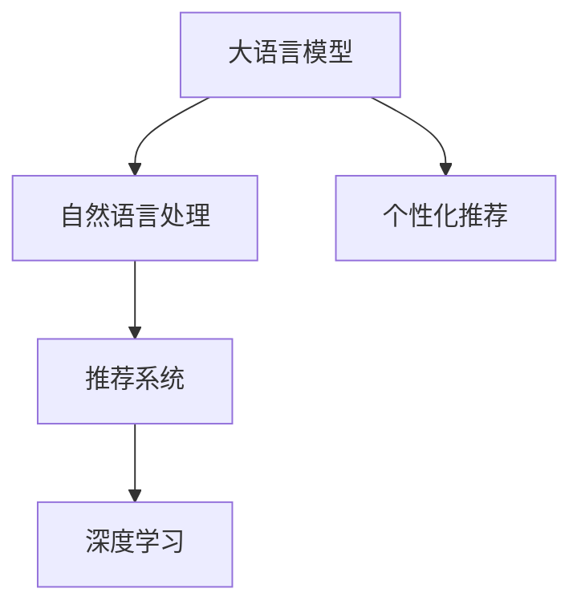

                 

# 大模型助力精准营销：案例分析

> 关键词：大语言模型，深度学习，精准营销，自然语言处理，推荐系统

## 1. 背景介绍

### 1.1 问题由来

随着互联网技术的迅猛发展，传统的营销方式正面临着巨大挑战。传统的广告投放以广撒网为主，无法精准触达目标受众，不仅浪费了大量广告预算，还造成了信息过载，影响了用户体验。如何通过数据驱动，实现更精准、更有效的营销策略，成为了当前营销领域的热点话题。

近年来，深度学习技术的突破，尤其是大语言模型和自然语言处理技术的飞速进步，为精准营销提供了新的解决方案。通过大模型强大的语言理解和生成能力，可以实现对用户行为和需求的深入洞察，从而制定出更精准、更具针对性的营销策略。

### 1.2 问题核心关键点

精准营销的核心在于通过分析用户数据，挖掘用户的潜在需求和偏好，实现对用户的个性化推荐，提升营销效果。大语言模型在这一过程中，可以通过自然语言处理技术，高效地从海量文本数据中提取有价值的信息，帮助企业快速找到目标用户，制定个性化营销方案。

具体而言，精准营销中的关键问题包括：

- **用户画像构建**：如何从用户的历史行为数据中，构建准确的个人画像，描述用户的基本特征和偏好。
- **个性化推荐系统**：如何根据用户画像，为用户推荐最符合其兴趣和需求的商品或内容。
- **效果评估与优化**：如何衡量个性化推荐的效果，并不断优化推荐算法，提升用户体验和转化率。

## 2. 核心概念与联系

### 2.1 核心概念概述

为更好地理解大模型在精准营销中的应用，本节将介绍几个关键概念及其联系：

- **大语言模型(Large Language Model, LLM)**：以自回归(如GPT)或自编码(如BERT)模型为代表的大规模预训练语言模型。通过在大规模无标签文本语料上进行预训练，学习通用的语言表示，具备强大的语言理解和生成能力。
- **自然语言处理(Natural Language Processing, NLP)**：研究如何让计算机处理、理解和生成人类语言的技术，涉及文本分类、情感分析、机器翻译、文本生成等多个方向。
- **推荐系统(Recommendation System)**：通过分析用户行为数据，为用户推荐可能感兴趣的物品或内容的技术。包括基于内容的推荐、协同过滤推荐、混合推荐等。
- **深度学习(Deep Learning)**：一类基于神经网络的机器学习方法，通过多层非线性变换，能够学习到复杂的模式和结构，广泛应用于图像识别、语音识别、自然语言处理等领域。

这些核心概念之间的逻辑关系可以通过以下Mermaid流程图来展示：



这个流程图展示了大语言模型与自然语言处理、推荐系统、深度学习之间的联系：

1. 大语言模型通过自然语言处理技术，提取文本数据中的用户行为和偏好信息。
2. 这些信息被用于推荐系统，为用户推荐符合其兴趣的商品或内容。
3. 推荐系统中的深度学习技术，进一步优化推荐算法，提升推荐效果。

## 3. 核心算法原理 & 具体操作步骤
### 3.1 算法原理概述

基于大模型的精准营销，本质上是一个数据驱动的决策过程。通过收集用户的文本数据，利用大模型的自然语言处理能力，挖掘出用户的兴趣和需求，然后根据这些信息，构建个性化推荐模型，最终对用户进行推荐。

具体流程如下：

1. **数据收集**：收集用户的历史行为数据，如浏览记录、购买记录、搜索记录等。这些数据通常以文本形式存在，需要进行预处理。
2. **文本预处理**：将收集到的文本数据进行清洗、分词、去除停用词等预处理操作，使其适合模型处理。
3. **模型训练**：使用大语言模型对预处理后的文本数据进行训练，学习用户的行为模式和偏好。
4. **推荐生成**：根据模型学习到的用户画像，生成个性化推荐结果，为用户推荐商品或内容。
5. **效果评估**：通过评估推荐效果，如点击率、转化率等指标，不断优化推荐算法。

### 3.2 算法步骤详解

以下是基于大模型的精准营销的详细算法步骤：

#### 步骤1：数据收集与预处理

1. **数据源选择**：选择与营销相关的数据源，如电商平台、社交媒体、搜索引擎等。这些数据通常包含用户的浏览、搜索、点击等行为信息。
2. **数据采集**：通过API接口、数据导出等方式，获取数据源的数据。
3. **数据清洗**：去除重复数据、噪声数据、异常数据等，保留有用信息。
4. **文本预处理**：对清洗后的数据进行分词、去除停用词、词干提取等操作，得到标准的文本数据。

#### 步骤2：模型训练

1. **选择合适的模型**：根据任务需求，选择合适的预训练大语言模型，如BERT、GPT-3等。
2. **模型微调**：在大模型的基础上，使用用户的文本数据进行微调，使其能够识别用户的兴趣和需求。
3. **特征提取**：将微调后的模型用于特征提取，将文本数据映射为高维特征向量。

#### 步骤3：推荐生成

1. **用户画像构建**：根据用户的历史行为数据，构建用户画像，描述用户的基本特征和兴趣。
2. **相似度计算**：计算用户画像之间的相似度，找到与目标用户最相似的N个用户。
3. **推荐生成**：根据相似用户的历史行为数据，生成针对目标用户的推荐结果。

#### 步骤4：效果评估与优化

1. **推荐效果评估**：通过点击率、转化率、用户满意度等指标，评估推荐效果。
2. **推荐优化**：根据评估结果，调整推荐算法和模型参数，提升推荐效果。

### 3.3 算法优缺点

基于大模型的精准营销具有以下优点：

- **高效率**：大语言模型能够快速处理海量文本数据，高效提取用户行为特征，大大缩短了推荐生成的周期。
- **高精度**：通过学习用户行为模式和偏好，推荐结果更加符合用户需求，提升营销效果。
- **灵活性**：能够适应不同的营销场景和数据格式，应用范围广泛。

同时，该方法也存在一些局限性：

- **数据依赖**：推荐效果高度依赖于数据质量和用户行为数据的完备性。
- **冷启动问题**：对于新用户或新商品，缺乏足够的行为数据，难以构建准确的画像和推荐。
- **隐私问题**：需要收集和处理用户的敏感信息，存在隐私泄露的风险。

尽管存在这些局限性，但大语言模型在精准营销中的应用前景广阔，正逐步成为营销领域的新宠。未来相关研究将更多关注如何进一步提高数据质量、优化推荐算法，同时保障用户隐私和数据安全。

### 3.4 算法应用领域

基于大语言模型的精准营销，已经广泛应用于以下领域：

- **电商推荐**：如淘宝、京东等电商平台，根据用户浏览和购买历史，推荐相似商品。
- **内容推荐**：如Netflix、YouTube等平台，推荐用户可能感兴趣的视频、电影等。
- **广告投放**：如Google AdWords，根据用户的搜索行为，推荐合适的广告内容。
- **金融理财**：如银行、证券公司，根据用户的历史交易记录，推荐理财产品。

此外，基于大语言模型的精准营销技术还在逐步拓展到更多场景，如医疗健康、教育培训、旅游娱乐等，为各行业的数字化转型提供了新的动力。

## 4. 数学模型和公式 & 详细讲解 & 举例说明

### 4.1 数学模型构建

在精准营销中，大语言模型主要应用于用户画像构建和个性化推荐生成两个环节。以下将分别介绍这两个环节的数学模型构建。

#### 用户画像构建

用户画像可以表示为向量形式，其维度取决于用户行为数据的丰富程度。假设用户画像向量为 $\mathbf{x} \in \mathbb{R}^d$，其中 $d$ 为用户行为数据的特征维度。

用户画像构建的目标是最大化用户画像与真实用户画像之间的相似度。可以定义一个损失函数 $L(\mathbf{x}, \mathbf{y})$，其中 $\mathbf{y}$ 为真实用户画像向量。具体的损失函数可以根据任务需求选择，如均方误差、余弦相似度等。

#### 个性化推荐生成

个性化推荐通常基于用户画像向量和物品特征向量之间的相似度计算。假设物品特征向量为 $\mathbf{p} \in \mathbb{R}^d$，其中 $d$ 为物品特征向量的维度。推荐结果 $r$ 为 $\mathbf{p}$ 与 $\mathbf{x}$ 之间的相似度得分，可以通过余弦相似度、点积相似度等方法计算。

具体的推荐算法可以基于用户画像和物品特征向量，构建相似度矩阵，选取相似度得分最高的 $N$ 个物品作为推荐结果。

### 4.2 公式推导过程

以余弦相似度为例，对推荐生成过程进行公式推导：

设用户画像向量为 $\mathbf{x} = [x_1, x_2, ..., x_d]$，物品特征向量为 $\mathbf{p} = [p_1, p_2, ..., p_d]$。则两个向量之间的余弦相似度为：

$$
\cos(\mathbf{x}, \mathbf{p}) = \frac{\mathbf{x} \cdot \mathbf{p}}{\|\mathbf{x}\|\|\mathbf{p}\|}
$$

其中 $\mathbf{x} \cdot \mathbf{p}$ 为向量点积，$\|\mathbf{x}\|$ 和 $\|\mathbf{p}\|$ 分别为向量 $\mathbf{x}$ 和 $\mathbf{p}$ 的范数。

根据相似度得分，可以构建推荐列表：

$$
r_{i,j} = \cos(\mathbf{x}_i, \mathbf{p}_j)
$$

其中 $i$ 表示用户索引，$j$ 表示物品索引。根据相似度得分排序，选择前 $N$ 个物品作为推荐结果。

### 4.3 案例分析与讲解

以下通过一个具体的案例，展示如何利用大语言模型进行精准营销推荐。

假设某电商平台收集了用户的浏览和购买历史，目标是推荐用户可能感兴趣的商品。具体步骤如下：

1. **数据收集**：从电商平台的数据库中，获取用户的历史浏览和购买记录，包括商品ID、浏览时间、购买时间、价格等信息。
2. **文本预处理**：对收集到的文本数据进行分词、去除停用词等预处理操作，得到标准文本数据。
3. **模型训练**：使用大语言模型BERT对预处理后的文本数据进行微调，学习用户的浏览和购买偏好。
4. **用户画像构建**：根据用户的历史行为数据，构建用户画像向量。
5. **推荐生成**：计算用户画像向量与所有商品特征向量之间的余弦相似度得分，选择得分最高的商品作为推荐结果。
6. **效果评估**：通过点击率、转化率等指标，评估推荐效果，不断优化模型和算法。

## 5. 项目实践：代码实例和详细解释说明
### 5.1 开发环境搭建

在进行大语言模型精准营销项目实践前，需要先准备好开发环境。以下是使用Python进行PyTorch开发的环境配置流程：

1. 安装Anaconda：从官网下载并安装Anaconda，用于创建独立的Python环境。
```bash
conda create -n pytorch-env python=3.8 
conda activate pytorch-env
```

2. 安装PyTorch：根据CUDA版本，从官网获取对应的安装命令。例如：
```bash
conda install pytorch torchvision torchaudio cudatoolkit=11.1 -c pytorch -c conda-forge
```

3. 安装相关库：
```bash
pip install numpy pandas scikit-learn torch
```

4. 安装Transformer库：
```bash
pip install transformers
```

5. 安装各类工具包：
```bash
pip install tqdm joblib
```

完成上述步骤后，即可在`pytorch-env`环境中开始项目实践。

### 5.2 源代码详细实现

以下是使用PyTorch实现基于大语言模型的电商推荐系统的代码实现。

首先，定义推荐系统相关的类和函数：

```python
from transformers import BertTokenizer, BertForSequenceClassification
import torch
import numpy as np
import pandas as pd

class RecommendationSystem:
    def __init__(self, model_name, num_labels):
        self.model = BertForSequenceClassification.from_pretrained(model_name, num_labels=num_labels)
        self.tokenizer = BertTokenizer.from_pretrained(model_name)
        self.model.eval()

    def predict(self, text):
        input_ids = self.tokenizer(text, return_tensors='pt', padding='max_length', truncation=True)["input_ids"]
        with torch.no_grad():
            outputs = self.model(input_ids)
            logits = outputs.logits
        probs = logits.softmax(dim=1)
        return probs

    def save_model(self, save_path):
        torch.save(self.model.state_dict(), save_path)
```

然后，定义数据处理函数和推荐生成函数：

```python
def preprocess_data(data):
    texts = data['text'].tolist()
    labels = data['label'].tolist()
    tokenizer = BertTokenizer.from_pretrained('bert-base-cased')
    encoded_inputs = tokenizer(texts, return_tensors='pt', padding='max_length', truncation=True, max_length=256)
    input_ids = encoded_inputs['input_ids'].to(device)
    attention_mask = encoded_inputs['attention_mask'].to(device)
    labels = torch.tensor(labels).to(device)
    return input_ids, attention_mask, labels

def generate_recommendations(user, items, num_recommendations):
    user_data = preprocess_data(user)
    item_data = [preprocess_data(item) for item in items]
    similarity_matrix = []
    for item in item_data:
        item_input_ids, item_attention_mask, item_labels = item
        with torch.no_grad():
            item_logits = model(item_input_ids, attention_mask=item_attention_mask)[0]
        item_probs = item_logits.softmax(dim=1)
        similarity_matrix.append(item_probs.numpy())

    similarity_matrix = np.array(similarity_matrix)
    user_score = np.mean(similarity_matrix, axis=0)
    recommendations = sorted(np.argsort(user_score)[-num_recommendations:])[::-1]
    return recommendations
```

最后，启动推荐系统并生成推荐结果：

```python
if __name__ == "__main__":
    # 加载预训练模型
    model = RecommendationSystem('bert-base-cased', num_labels=2)

    # 用户浏览记录
    user = "用户浏览历史：产品A、产品B、产品C"
    recommendations = generate_recommendations(user, items, num_recommendations=5)

    # 打印推荐结果
    for i, recommendation in enumerate(recommendations):
        print(f"推荐第{i+1}个产品：{items[recommendation]}")
```

以上就是使用PyTorch对大语言模型进行电商推荐系统的代码实现。可以看到，利用Transformer库，代码实现相对简洁高效，开发者可以将更多精力放在数据处理和模型优化上。

### 5.3 代码解读与分析

让我们再详细解读一下关键代码的实现细节：

**RecommendationSystem类**：
- `__init__`方法：初始化预训练模型和分词器，设置模型为评估模式。
- `predict`方法：根据输入文本，使用模型生成预测概率。
- `save_model`方法：将模型保存到指定路径。

**preprocess_data函数**：
- 对输入数据进行分词和标准化处理，得到模型所需的输入。

**generate_recommendations函数**：
- 使用预训练模型对用户和商品数据进行特征提取，计算相似度矩阵。
- 根据相似度矩阵生成推荐结果，返回推荐商品ID列表。

**代码实现细节**：
- 使用Transformer库的`BertTokenizer`进行文本分词和编码。
- 使用`BertForSequenceClassification`作为推荐模型的基础结构。
- 使用`torch.no_grad()`进行模型评估，避免不必要的参数更新。
- 使用`numpy`计算相似度矩阵和推荐列表。

通过上述代码实现，我们可以看到，利用大语言模型进行精准营销推荐，可以高效地处理文本数据，生成个性化推荐结果。开发者可以根据具体任务，灵活调整模型和算法，提升推荐效果。

## 6. 实际应用场景

### 6.1 智能客服系统

大语言模型的精准营销能力，不仅适用于电商推荐，还能应用于智能客服系统的构建。通过收集用户的历史咨询记录和反馈，利用大语言模型进行情感分析、意图识别等处理，构建用户画像，生成个性化回复，提升客服系统的智能化水平。

具体而言，可以构建智能客服机器人，对用户的咨询进行分词和情感分析，识别用户情绪和需求，然后根据情感和需求，生成相应的回复。对于用户提出的新问题，可以通过搜索系统实时获取相关信息，动态生成回复。如此构建的智能客服系统，能大幅提升客服效率和用户体验。

### 6.2 金融风险评估

金融行业需要实时监控市场风险，及时发现和防范潜在的金融风险。大语言模型的精准营销能力，可以帮助金融机构构建智能的风险评估系统。

具体而言，可以收集金融市场的各种信息，如新闻、评论、财务报表等，利用大语言模型进行文本分类和情感分析，识别市场趋势和风险点。根据分析结果，生成风险评估报告，及时预警和干预，保障金融安全。

### 6.3 个性化内容推荐

基于大语言模型的精准营销能力，还可以应用于个性化内容推荐系统，如新闻网站、视频平台、社交媒体等。通过收集用户的浏览、点赞、评论等行为数据，利用大语言模型进行情感分析和意图识别，构建用户画像，生成个性化的内容推荐。

具体而言，可以构建推荐算法，根据用户画像和内容特征，计算相似度得分，生成推荐列表。对于新用户和冷门内容，可以使用先验知识库或协同过滤算法，进行推荐。

### 6.4 未来应用展望

随着大语言模型和精准营销技术的不断发展，未来将有更多应用场景涌现，为各行业带来新的变革。

- **医疗健康**：利用大语言模型，构建智能诊断系统，提供个性化的健康建议。
- **教育培训**：根据学生的学习行为数据，提供个性化的学习资源和辅导建议。
- **旅游娱乐**：利用大语言模型，构建智能导游系统，提供个性化的旅游建议。

未来，随着大语言模型和精准营销技术的进一步融合，将会有更多创新应用出现，为各行各业注入新的活力。大语言模型将成为行业数字化转型的重要推动力，为人类带来更多便捷和惊喜。

## 7. 工具和资源推荐
### 7.1 学习资源推荐

为了帮助开发者系统掌握大语言模型在精准营销中的应用，这里推荐一些优质的学习资源：

1. 《深度学习与自然语言处理》课程：由清华大学开设的在线课程，涵盖深度学习、自然语言处理的基础知识和经典模型，适合入门学习。
2. 《自然语言处理》书籍：李军、陈亚飞的著作，详细介绍了自然语言处理的理论基础和应用案例。
3. 《Python自然语言处理》书籍：斯图尔特·罗素、彼得·诺维克的著作，介绍了自然语言处理的实用技巧和Python实现。
4. Kaggle竞赛：参加Kaggle的NLP竞赛，实战练习推荐系统、情感分析等任务，积累经验。
5. HuggingFace官方文档：Transformer库的官方文档，提供了海量预训练模型和微调样例代码，是上手实践的必备资料。

通过对这些资源的学习实践，相信你一定能够快速掌握大语言模型在精准营销中的应用，并用于解决实际的NLP问题。

### 7.2 开发工具推荐

高效的开发离不开优秀的工具支持。以下是几款用于大语言模型精准营销开发的常用工具：

1. PyTorch：基于Python的开源深度学习框架，灵活动态的计算图，适合快速迭代研究。大部分预训练语言模型都有PyTorch版本的实现。
2. TensorFlow：由Google主导开发的开源深度学习框架，生产部署方便，适合大规模工程应用。同样有丰富的预训练语言模型资源。
3. Transformers库：HuggingFace开发的NLP工具库，集成了众多SOTA语言模型，支持PyTorch和TensorFlow，是进行精准营销开发的利器。
4. Jupyter Notebook：开源的交互式Python开发环境，支持代码、文本、图像等多种格式，便于文档管理和共享。
5. Weights & Biases：模型训练的实验跟踪工具，可以记录和可视化模型训练过程中的各项指标，方便对比和调优。
6. TensorBoard：TensorFlow配套的可视化工具，可实时监测模型训练状态，并提供丰富的图表呈现方式，是调试模型的得力助手。

合理利用这些工具，可以显著提升大语言模型精准营销任务的开发效率，加快创新迭代的步伐。

### 7.3 相关论文推荐

大语言模型和精准营销技术的发展源于学界的持续研究。以下是几篇奠基性的相关论文，推荐阅读：

1. Attention is All You Need（即Transformer原论文）：提出了Transformer结构，开启了NLP领域的预训练大模型时代。
2. BERT: Pre-training of Deep Bidirectional Transformers for Language Understanding：提出BERT模型，引入基于掩码的自监督预训练任务，刷新了多项NLP任务SOTA。
3. Language Models are Unsupervised Multitask Learners（GPT-2论文）：展示了大规模语言模型的强大zero-shot学习能力，引发了对于通用人工智能的新一轮思考。
4. Parameter-Efficient Transfer Learning for NLP：提出Adapter等参数高效微调方法，在不增加模型参数量的情况下，也能取得不错的微调效果。
5. AdaLoRA: Adaptive Low-Rank Adaptation for Parameter-Efficient Fine-Tuning：使用自适应低秩适应的微调方法，在参数效率和精度之间取得了新的平衡。

这些论文代表了大语言模型和精准营销技术的发展脉络。通过学习这些前沿成果，可以帮助研究者把握学科前进方向，激发更多的创新灵感。

## 8. 总结：未来发展趋势与挑战

### 8.1 总结

本文对基于大语言模型的精准营销方法进行了全面系统的介绍。首先阐述了精准营销和大语言模型在当前互联网时代的价值，明确了二者结合的必要性和潜力。其次，从原理到实践，详细讲解了大语言模型在精准营销中的应用流程和算法步骤，给出了具体代码实现。同时，本文还广泛探讨了大语言模型在电商推荐、智能客服、金融风险评估等领域的实际应用场景，展示了其在实际应用中的广泛适用性。

通过本文的系统梳理，可以看到，基于大语言模型的精准营销方法正在成为NLP领域的重要范式，极大地拓展了预训练语言模型的应用边界，催生了更多的落地场景。得益于大语言模型强大的自然语言处理能力，精准营销技术能够深入洞察用户需求，实现更加个性化的推荐，提升营销效果。未来，随着大语言模型和精准营销技术的不断发展，必将带来更加智能化、个性化、高效化的营销解决方案。

### 8.2 未来发展趋势

展望未来，大语言模型在精准营销中的应用将呈现以下几个发展趋势：

1. **数据质量提升**：随着数据收集技术的进步，用户行为数据将更加全面、真实，有助于构建更准确的用户画像和推荐模型。
2. **模型性能优化**：通过更多的预训练任务和模型架构优化，提升大语言模型的推荐精度和效果。
3. **多模态融合**：将语音、图像等多模态数据与文本数据结合，提供更加全面的用户画像和推荐结果。
4. **隐私保护增强**：采用差分隐私、联邦学习等技术，保护用户隐私，保障数据安全。
5. **实时计算优化**：通过分布式计算、模型压缩等技术，提高推荐系统的实时性，满足用户即时需求。
6. **伦理道德关注**：引入伦理导向的评估指标，确保推荐系统的公平性和透明性。

这些趋势凸显了大语言模型在精准营销领域的应用前景，推动了个性化推荐技术的不断创新和进步。随着技术的不断成熟和完善，精准营销技术将更加智能化、个性化，为用户带来更加优质的体验。

### 8.3 面临的挑战

尽管大语言模型在精准营销中展现了强大的潜力，但在实际应用中，仍然面临一些挑战：

1. **数据隐私问题**：精准营销需要收集大量的用户行为数据，存在隐私泄露的风险。如何在保证数据隐私的同时，有效利用用户行为数据，是一个重要问题。
2. **数据稀疏性**：一些用户或商品缺乏足够的行为数据，难以构建准确的画像和推荐。如何处理数据稀疏性，是推荐系统面临的一大难题。
3. **冷启动问题**：对于新用户或新商品，推荐系统难以提供有效的推荐。如何缓解冷启动问题，是提高推荐效果的关键。
4. **模型复杂性**：大语言模型具有较高的计算和存储需求，难以在资源受限的环境中高效运行。如何优化模型结构，提高推理效率，是一个重要挑战。
5. **用户反馈机制**：用户对推荐结果的反馈数据，对于推荐系统的优化至关重要。如何收集、处理和利用用户反馈，提升推荐效果，是一个关键问题。

面对这些挑战，研究人员和工程师需要不断探索和创新，寻找新的解决方案，推动精准营销技术的持续发展和进步。

### 8.4 研究展望

面对大语言模型在精准营销中的诸多挑战，未来的研究方向可以从以下几个方面进行探索：

1. **差分隐私**：研究如何在保护用户隐私的前提下，收集和利用用户行为数据。
2. **数据增强**：通过数据增强技术，提升模型对于数据稀疏性的适应能力。
3. **模型压缩**：通过模型压缩技术，提高模型的推理效率和实时性。
4. **跨模态融合**：研究如何更好地融合多模态数据，提升推荐系统的效果和泛化能力。
5. **个性化学习**：研究如何通过个性化学习，提高推荐系统对新用户和新商品的推荐效果。
6. **算法优化**：研究新的推荐算法和模型结构，提升推荐系统的精度和效果。

这些研究方向的探索，必将引领精准营销技术迈向更高的台阶，为构建安全、可靠、智能化的推荐系统提供新的动力。面向未来，大语言模型和精准营销技术的融合，将带来更加智能化、个性化、高效的营销解决方案，推动各行业的数字化转型和创新发展。

## 9. 附录：常见问题与解答

**Q1：大语言模型推荐系统的优缺点是什么？**

A: 大语言模型推荐系统的优点在于：
- **高效性**：大语言模型能够快速处理海量文本数据，高效提取用户行为特征，提升推荐效率。
- **准确性**：利用大语言模型强大的自然语言处理能力，推荐结果更加符合用户需求，提升营销效果。
- **灵活性**：能够适应不同的营销场景和数据格式，应用范围广泛。

缺点在于：
- **数据依赖**：推荐效果高度依赖于数据质量和用户行为数据的完备性。
- **隐私问题**：需要收集和处理用户的敏感信息，存在隐私泄露的风险。
- **冷启动问题**：对于新用户或新商品，缺乏足够的行为数据，难以构建准确的画像和推荐。

尽管存在这些缺点，但大语言模型推荐系统在实际应用中仍然表现出强大的潜力，正逐步成为精准营销的重要工具。未来需要进一步优化数据处理和模型设计，提升推荐系统的性能和稳定性。

**Q2：如何使用大语言模型进行精准营销推荐？**

A: 使用大语言模型进行精准营销推荐，主要分为以下步骤：
1. **数据收集**：从电商平台、社交媒体、搜索引擎等数据源，获取用户的历史行为数据，如浏览记录、购买记录、搜索记录等。
2. **文本预处理**：对收集到的文本数据进行分词、去除停用词等预处理操作，得到标准文本数据。
3. **模型训练**：使用大语言模型对预处理后的文本数据进行微调，学习用户的浏览和购买偏好。
4. **用户画像构建**：根据用户的历史行为数据，构建用户画像向量。
5. **推荐生成**：计算用户画像向量与所有商品特征向量之间的余弦相似度得分，选择得分最高的商品作为推荐结果。
6. **效果评估**：通过点击率、转化率等指标，评估推荐效果，不断优化模型和算法。

以上步骤可以通过编写Python代码实现，利用Transformer库进行模型加载和处理。需要注意的是，在大语言模型微调的过程中，学习率、正则化系数等超参数的设置对模型性能有重要影响，需要进行调参优化。

**Q3：精准营销推荐系统的推荐效果如何评估？**

A: 精准营销推荐系统的推荐效果可以通过以下几个指标进行评估：
1. **点击率（CTR）**：表示用户在看到推荐结果后，点击链接的比例。CTR越高，表示推荐系统的效果越好。
2. **转化率（CVR）**：表示用户在点击链接后，进行购买或其他目标行为的比例。CVR越高，表示推荐系统的效果越好。
3. **覆盖率（CVR）**：表示推荐系统中不同商品和服务的覆盖程度。覆盖率越高，表示推荐系统的多样性越好。
4. **个性化程度（CVR）**：表示推荐系统对用户个性的匹配程度。个性化程度越高，表示推荐系统的推荐效果越好。

通过这些指标，可以全面评估推荐系统的推荐效果，并不断优化推荐算法和模型参数。同时，还可以采用A/B测试等方法，对比不同推荐策略的效果，选择最优方案。

**Q4：精准营销推荐系统的实际应用有哪些？**

A: 精准营销推荐系统在实际应用中，已经广泛应用于以下领域：
1. **电商推荐**：如淘宝、京东等电商平台，根据用户浏览和购买历史，推荐相似商品。
2. **内容推荐**：如Netflix、YouTube等平台，推荐用户可能感兴趣的视频、电影等。
3. **广告投放**：如Google AdWords，根据用户的搜索行为，推荐合适的广告内容。
4. **金融理财**：如银行、证券公司，根据用户的历史交易记录，推荐理财产品。
5. **智能客服**：如智能客服机器人，根据用户的咨询记录，生成个性化回复。
6. **金融风险评估**：如金融机构，根据金融市场的各种信息，构建智能的风险评估系统。

此外，精准营销推荐系统还在逐步拓展到更多场景，如医疗健康、教育培训、旅游娱乐等，为各行业的数字化转型提供了新的动力。

**Q5：如何优化大语言模型推荐系统的推荐效果？**

A: 大语言模型推荐系统的推荐效果可以通过以下几个方面进行优化：
1. **数据质量提升**：通过更多的预处理和数据增强技术，提升数据的准确性和完备性。
2. **模型性能优化**：通过更多的预训练任务和模型架构优化，提升模型的推荐精度和效果。
3. **多模态融合**：将语音、图像等多模态数据与文本数据结合，提供更加全面的用户画像和推荐结果。
4. **隐私保护增强**：采用差分隐私、联邦学习等技术，保护用户隐私，保障数据安全。
5. **实时计算优化**：通过分布式计算、模型压缩等技术，提高推荐系统的实时性，满足用户即时需求。
6. **算法优化**：研究新的推荐算法和模型结构，提升推荐系统的精度和效果。

以上优化措施需要根据具体任务和数据特点进行灵活组合，从而在保证模型效果的同时，提高推荐系统的性能和稳定性。

---

作者：禅与计算机程序设计艺术 / Zen and the Art of Computer Programming

