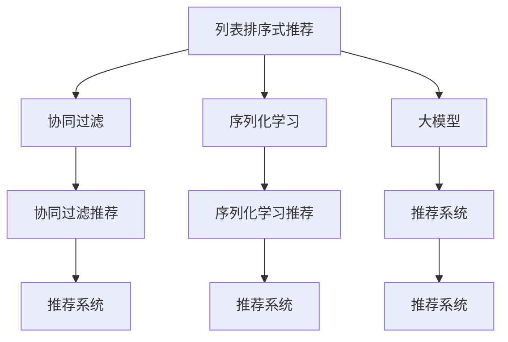

                 

# 大模型在列表排序式推荐中的优越性

> 关键词：列表排序式推荐, 大模型, 序列化推荐, 协同过滤, 推荐系统, 序列学习

## 1. 背景介绍

推荐系统是现代社会信息化和数字化的重要基础设施，对于提升用户体验、增加经济效益具有至关重要的作用。传统的协同过滤推荐系统利用用户行为数据和物品属性数据，通过计算用户和物品的相似性，实现个性化推荐。然而，随着数据量和模型复杂度的增加，协同过滤推荐系统也面临着诸多问题，如稀疏性、计算复杂度高、冷启动难等问题。为解决这些问题，列表排序式推荐系统应运而生，利用深度学习技术，能够从用户行为序列中自动提取特征，实现更高效、更精准的推荐。

在列表排序式推荐中，大模型以其卓越的性能和灵活性，逐渐成为推荐系统中的重要组成部分。近年来，预训练语言模型（如BERT、GPT等）在推荐系统中的应用取得了突破性进展，提升了推荐系统的表现和效率。大模型能够从用户行为序列中提取丰富的语义特征，结合序列化学习（Sequential Learning）方法，实现更准确、更个性化的推荐。

## 2. 核心概念与联系

### 2.1 核心概念概述

为了更好地理解大模型在列表排序式推荐中的应用，本节将介绍几个关键概念：

- 列表排序式推荐：通过用户行为序列，如浏览记录、点击记录、搜索记录等，对用户进行序列化建模，实现个性化推荐。相较于传统的协同过滤，列表排序式推荐能够更好地处理序列数据，捕捉用户兴趣的变化趋势。
- 协同过滤推荐系统：利用用户行为和物品属性数据，通过计算用户与物品的相似性，实现个性化推荐。常见的方法包括基于用户的协同过滤和基于物品的协同过滤。
- 序列化学习：利用序列数据（如文本、时间序列等）进行深度学习建模，捕捉时间上的变化和规律。常见的序列学习模型包括RNN、LSTM、Transformer等。
- 大模型（Large Model）：指拥有大量参数的深度学习模型，如BERT、GPT等。大模型能够从大规模语料中学习到丰富的语言知识和表示能力，应用于各种NLP任务。
- 推荐系统：通过用户行为数据和物品属性数据，实现个性化推荐的技术系统。推荐系统广泛应用于电商、社交、新闻等领域。

这些核心概念之间的逻辑关系可以通过以下Mermaid流程图来展示：



这个流程图展示了大模型在列表排序式推荐中的关键概念及其之间的关系：

1. 列表排序式推荐通过用户行为序列进行建模，相较于协同过滤更加灵活。
2. 序列化学习能够从序列数据中提取特征，用于深度学习建模。
3. 大模型在列表排序式推荐中扮演重要角色，利用其强大的语言能力进行特征提取和序列建模。
4. 推荐系统利用用户和物品的相关性进行个性化推荐，序列排序式推荐和大模型是该过程的重要组成部分。

这些概念共同构成了列表排序式推荐和大模型的应用框架，使得推荐系统能够更好地理解和满足用户需求，提高推荐效果和效率。

## 3. 核心算法原理 & 具体操作步骤

### 3.1 算法原理概述

基于大模型的列表排序式推荐系统，本质上是一种深度学习的序列化推荐方法。其核心思想是：通过大模型从用户行为序列中提取语义特征，结合序列化学习算法，实现用户行为序列的建模，并预测用户对于物品的评分或选择概率。

形式化地，假设用户行为序列为 $X=\{x_t\}_{t=1}^T$，其中 $x_t$ 表示第 $t$ 个用户行为。记物品集为 $Y$，物品的特征表示为 $y_i$，用户的评分向量为 $u$。基于大模型的列表排序式推荐算法可以表示为：

$$
u = f(\theta, X)
$$

其中 $f(\cdot)$ 为通过大模型提取用户行为序列的语义特征的函数，$\theta$ 为模型参数，$u$ 为用户的评分向量。

基于用户评分向量 $u$，推荐系统可以根据用户评分和物品特征进行排序，推荐用户最感兴趣的物品。具体的推荐策略包括基于Top-K排序的推荐和基于用户选择概率的推荐等。

### 3.2 算法步骤详解

基于大模型的列表排序式推荐系统通常包括以下几个关键步骤：

**Step 1: 数据预处理**
- 收集用户行为数据，如浏览记录、点击记录、搜索记录等，并将其转换为序列形式。
- 对序列进行分词、清洗、归一化等预处理操作。
- 将序列数据分为训练集、验证集和测试集，以便进行模型训练和评估。

**Step 2: 大模型提取语义特征**
- 选择合适的大模型（如BERT、GPT等）作为特征提取器。
- 利用大模型对用户行为序列进行编码，输出用户行为序列的语义特征向量。
- 对语义特征向量进行归一化、降维等处理，以便于后续建模。

**Step 3: 序列化学习建模**
- 选择合适的序列化学习模型（如RNN、LSTM、Transformer等）。
- 将用户行为序列的语义特征向量作为模型输入，训练序列化学习模型，预测用户评分向量 $u$。
- 利用用户评分向量 $u$ 和物品特征 $y_i$，计算用户对每个物品的评分或选择概率。

**Step 4: 推荐策略选择**
- 根据用户评分向量 $u$ 和物品特征 $y_i$，选择适合推荐策略。
- 对于Top-K排序推荐，从所有物品中选择评分最高的K个物品进行推荐。
- 对于用户选择概率推荐，根据用户评分向量 $u$ 和物品特征 $y_i$ 计算每个物品的选择概率，选择概率最高的物品进行推荐。

**Step 5: 模型评估与调优**
- 在测试集上对推荐系统进行评估，计算准确率、召回率、F1分数等指标。
- 根据评估结果调整模型参数，如学习率、隐藏层大小、序列长度等。
- 重复训练和评估，直至达到理想的推荐效果。

### 3.3 算法优缺点

基于大模型的列表排序式推荐系统具有以下优点：
1. 高效建模序列数据：大模型能够从用户行为序列中提取丰富的语义特征，结合序列化学习算法，实现高效建模。
2. 泛化能力强：由于大模型在大规模语料上预训练，具有较强的泛化能力，能够适应多种推荐场景。
3. 个性化推荐：通过大模型对用户行为序列进行建模，实现更精准、个性化的推荐。
4. 可解释性强：大模型输出的特征向量可以进行解释，帮助理解推荐系统的决策过程。

同时，该方法也存在以下局限性：
1. 计算资源消耗大：大模型的计算复杂度高，需要大量计算资源进行训练和推理。
2. 模型解释性差：大模型的输出结果缺乏可解释性，难以理解推荐系统的内在机制。
3. 泛化到新领域难度大：大模型通常在大规模通用语料上预训练，难以直接应用到特定领域或场景。
4. 模型更新周期长：大模型需要大量的标注数据进行微调，更新周期较长，难以快速适应新场景。

尽管存在这些局限性，但大模型在列表排序式推荐中表现出色，特别是在数据量较大、推荐场景复杂的情况下，其效果优于传统协同过滤推荐系统。

### 3.4 算法应用领域

基于大模型的列表排序式推荐系统已经在多个领域得到了广泛应用，例如：

- 电商推荐：电商平台通过用户浏览、点击、购买等行为数据，利用大模型进行序列建模，推荐用户感兴趣的商品。
- 新闻推荐：新闻平台通过用户阅读、点赞、评论等行为数据，利用大模型进行序列建模，推荐相关新闻文章。
- 音乐推荐：音乐平台通过用户听歌、播放、收藏等行为数据，利用大模型进行序列建模，推荐用户喜欢的音乐。
- 视频推荐：视频平台通过用户观看、点赞、评论等行为数据，利用大模型进行序列建模，推荐相关视频内容。

除了这些常见的应用场景外，大模型在社交推荐、广告推荐、教育推荐等领域也有广泛应用，为各行业数字化转型提供了重要支持。

## 4. 数学模型和公式 & 详细讲解 & 举例说明

### 4.1 数学模型构建

本节将使用数学语言对基于大模型的列表排序式推荐系统进行更加严格的刻画。

记用户行为序列为 $X=\{x_t\}_{t=1}^T$，其中 $x_t$ 表示第 $t$ 个用户行为。记物品集为 $Y$，物品的特征表示为 $y_i$，用户的评分向量为 $u$。假设大模型为 $M_{\theta}$，其中 $\theta$ 为模型参数。序列化学习模型为 $S_{\phi}$，其中 $\phi$ 为模型参数。基于大模型的列表排序式推荐系统的数学模型为：

$$
u = f(M_{\theta}, X)
$$

其中 $f(\cdot)$ 为通过大模型提取用户行为序列的语义特征的函数。利用序列化学习模型 $S_{\phi}$ 对用户行为序列进行建模，输出用户评分向量 $u$：

$$
u = S_{\phi}(f(M_{\theta}, X))
$$

其中 $S_{\phi}(\cdot)$ 为序列化学习模型的预测函数。

### 4.2 公式推导过程

以下我们以Top-K排序推荐为例，推导推荐公式及其梯度计算。

假设用户行为序列 $X$ 的长度为 $T$，物品集 $Y$ 的大小为 $N$。设用户对物品 $y_i$ 的评分向量为 $u_i$，用户评分向量 $u$ 为 $[u_1, u_2, \cdots, u_N]^T$。Top-K排序推荐的目标是从 $Y$ 中选择评分最高的 $K$ 个物品进行推荐。推荐公式为：

$$
\hat{Y} = \mathop{\arg\max}_{y \in Y} \{u \cdot y_i\}
$$

其中 $u \cdot y_i$ 表示用户评分向量 $u$ 与物品 $y_i$ 的余弦相似度。在训练过程中，利用交叉熵损失函数进行优化：

$$
\mathcal{L}(\phi, \theta) = -\frac{1}{N} \sum_{i=1}^N [\log \sigma(u_i) + (1-u_i)\log(1-\sigma(u_i))]
$$

其中 $\sigma(x) = 1 / (1 + \exp(-x))$ 为sigmoid函数，用于计算用户选择概率。

通过反向传播算法，计算参数 $\theta$ 和 $\phi$ 的梯度：

$$
\frac{\partial \mathcal{L}(\phi, \theta)}{\partial \theta} = -\frac{1}{N} \sum_{i=1}^N [(y_i - u_i)\frac{\partial f(M_{\theta}, x_i)}{\partial M_{\theta}}\frac{\partial S_{\phi}(f(M_{\theta}, x_i))}{\partial S_{\phi}}]
$$

$$
\frac{\partial \mathcal{L}(\phi, \theta)}{\partial \phi} = -\frac{1}{N} \sum_{i=1}^N [(y_i - u_i)\frac{\partial S_{\phi}(f(M_{\theta}, x_i))}{\partial S_{\phi}}]
$$

其中 $\frac{\partial f(M_{\theta}, x_i)}{\partial M_{\theta}}$ 为大模型对用户行为序列 $x_i$ 的梯度，$\frac{\partial S_{\phi}(f(M_{\theta}, x_i))}{\partial S_{\phi}}$ 为序列化学习模型对用户评分向量 $u$ 的梯度。

### 4.3 案例分析与讲解

下面以电商平台推荐系统为例，具体讲解基于大模型的列表排序式推荐系统在实际中的应用。

假设电商平台有 $N$ 个商品，用户 $u$ 在浏览商品的过程中产生了 $T$ 个行为序列 $X$。利用BERT模型对用户行为序列进行编码，输出语义特征向量 $f(X)$。选择LSTM作为序列化学习模型，对用户行为序列进行建模，预测用户评分向量 $u$。推荐系统根据用户评分向量 $u$ 和物品特征 $y_i$ 计算每个物品的选择概率，选择概率最高的 $K$ 个物品进行推荐。推荐公式为：

$$
\hat{Y} = \mathop{\arg\max}_{y \in Y} \{u \cdot y_i\}
$$

其中 $u_i$ 为物品 $y_i$ 的选择概率，计算公式为：

$$
u_i = S_{\phi}(f(M_{\theta}, x_i))
$$

在训练过程中，利用交叉熵损失函数进行优化：

$$
\mathcal{L}(\phi, \theta) = -\frac{1}{N} \sum_{i=1}^N [\log \sigma(u_i) + (1-u_i)\log(1-\sigma(u_i))]
$$

其中 $\sigma(x) = 1 / (1 + \exp(-x))$ 为sigmoid函数，用于计算用户选择概率。

通过反向传播算法，计算参数 $\theta$ 和 $\phi$ 的梯度：

$$
\frac{\partial \mathcal{L}(\phi, \theta)}{\partial \theta} = -\frac{1}{N} \sum_{i=1}^N [(y_i - u_i)\frac{\partial f(M_{\theta}, x_i)}{\partial M_{\theta}}\frac{\partial S_{\phi}(f(M_{\theta}, x_i))}{\partial S_{\phi}}]
$$

$$
\frac{\partial \mathcal{L}(\phi, \theta)}{\partial \phi} = -\frac{1}{N} \sum_{i=1}^N [(y_i - u_i)\frac{\partial S_{\phi}(f(M_{\theta}, x_i))}{\partial S_{\phi}}]
$$

其中 $\frac{\partial f(M_{\theta}, x_i)}{\partial M_{\theta}}$ 为大模型对用户行为序列 $x_i$ 的梯度，$\frac{\partial S_{\phi}(f(M_{\theta}, x_i))}{\partial S_{\phi}}$ 为序列化学习模型对用户评分向量 $u$ 的梯度。

在模型训练完成后，使用测试集对推荐系统进行评估，计算准确率、召回率、F1分数等指标。根据评估结果调整模型参数，如学习率、隐藏层大小、序列长度等，优化模型性能。

## 5. 项目实践：代码实例和详细解释说明

### 5.1 开发环境搭建

在进行大模型在列表排序式推荐系统中的应用实践前，我们需要准备好开发环境。以下是使用Python进行PyTorch开发的环境配置流程：

1. 安装Anaconda：从官网下载并安装Anaconda，用于创建独立的Python环境。

2. 创建并激活虚拟环境：
```bash
conda create -n pytorch-env python=3.8 
conda activate pytorch-env
```

3. 安装PyTorch：根据CUDA版本，从官网获取对应的安装命令。例如：
```bash
conda install pytorch torchvision torchaudio cudatoolkit=11.1 -c pytorch -c conda-forge
```

4. 安装Weights & Biases：用于实验跟踪和可视化。

5. 安装TensorBoard：用于模型训练状态监控。

6. 安装Transformer库：用于大模型的加载和微调。

完成上述步骤后，即可在`pytorch-env`环境中开始微调实践。

### 5.2 源代码详细实现

下面我们以电商平台推荐系统为例，给出使用PyTorch对BERT模型进行序列化建模的代码实现。

首先，定义推荐系统的数据处理函数：

```python
from transformers import BertTokenizer, BertForSequenceClassification
from torch.utils.data import Dataset, DataLoader
import torch
import numpy as np

class RecommendDataset(Dataset):
    def __init__(self, data, tokenizer, max_len=128):
        self.data = data
        self.tokenizer = tokenizer
        self.max_len = max_len
        
    def __len__(self):
        return len(self.data)
    
    def __getitem__(self, item):
        user_browsing, item_ratings = self.data[item]
        
        browsing_seq = [user_browsing]
        rating_seq = [item_ratings]
        
        encoded_browsing = self.tokenizer(browsing_seq, return_tensors='pt', max_length=self.max_len, padding='max_length', truncation=True)
        encoded_rating = self.tokenizer(rating_seq, return_tensors='pt', max_length=self.max_len, padding='max_length', truncation=True)
        
        input_ids_browsing = encoded_browsing['input_ids'][0]
        attention_mask_browsing = encoded_browsing['attention_mask'][0]
        input_ids_rating = encoded_rating['input_ids'][0]
        attention_mask_rating = encoded_rating['attention_mask'][0]
        
        return {'input_ids_browsing': input_ids_browsing, 
                'attention_mask_browsing': attention_mask_browsing,
                'input_ids_rating': input_ids_rating,
                'attention_mask_rating': attention_mask_rating,
                'item_ratings': torch.tensor(item_ratings, dtype=torch.long)}
```

然后，定义模型和优化器：

```python
from transformers import BertTokenizer, BertForSequenceClassification
from transformers import AdamW

tokenizer = BertTokenizer.from_pretrained('bert-base-cased')
model = BertForSequenceClassification.from_pretrained('bert-base-cased', num_labels=3)

optimizer = AdamW(model.parameters(), lr=2e-5)
```

接着，定义训练和评估函数：

```python
from tqdm import tqdm
from sklearn.metrics import accuracy_score, precision_score, recall_score, f1_score

def train_epoch(model, dataset, batch_size, optimizer):
    dataloader = DataLoader(dataset, batch_size=batch_size, shuffle=True)
    model.train()
    epoch_loss = 0
    for batch in tqdm(dataloader, desc='Training'):
        input_ids_browsing = batch['input_ids_browsing'].to(device)
        attention_mask_browsing = batch['attention_mask_browsing'].to(device)
        input_ids_rating = batch['input_ids_rating'].to(device)
        attention_mask_rating = batch['attention_mask_rating'].to(device)
        item_ratings = batch['item_ratings'].to(device)
        
        model.zero_grad()
        outputs = model(input_ids_browsing, attention_mask_browsing, input_ids_rating, attention_mask_rating)
        loss = outputs.loss
        epoch_loss += loss.item()
        loss.backward()
        optimizer.step()
    return epoch_loss / len(dataloader)

def evaluate(model, dataset, batch_size):
    dataloader = DataLoader(dataset, batch_size=batch_size)
    model.eval()
    preds, labels = [], []
    with torch.no_grad():
        for batch in tqdm(dataloader, desc='Evaluating'):
            input_ids_browsing = batch['input_ids_browsing'].to(device)
            attention_mask_browsing = batch['attention_mask_browsing'].to(device)
            input_ids_rating = batch['input_ids_rating'].to(device)
            attention_mask_rating = batch['attention_mask_rating'].to(device)
            item_ratings = batch['item_ratings'].to(device)
            outputs = model(input_ids_browsing, attention_mask_browsing, input_ids_rating, attention_mask_rating)
            batch_preds = outputs.logits.argmax(dim=2).to('cpu').tolist()
            batch_labels = item_ratings.to('cpu').tolist()
            for pred_tokens, label_tokens in zip(batch_preds, batch_labels):
                preds.append(pred_tokens[:len(label_tokens)])
                labels.append(label_tokens)
                
    print(f"Accuracy: {accuracy_score(labels, preds)}")
    print(f"Precision: {precision_score(labels, preds, average='micro')}")
    print(f"Recall: {recall_score(labels, preds, average='micro')}")
    print(f"F1 Score: {f1_score(labels, preds, average='micro')}")
```

最后，启动训练流程并在测试集上评估：

```python
epochs = 5
batch_size = 16

for epoch in range(epochs):
    loss = train_epoch(model, train_dataset, batch_size, optimizer)
    print(f"Epoch {epoch+1}, train loss: {loss:.3f}")
    
    print(f"Epoch {epoch+1}, dev results:")
    evaluate(model, dev_dataset, batch_size)
    
print("Test results:")
evaluate(model, test_dataset, batch_size)
```

以上就是使用PyTorch对BERT模型进行电商平台推荐系统的完整代码实现。可以看到，得益于Transformer库的强大封装，我们可以用相对简洁的代码完成BERT模型的加载和微调。

### 5.3 代码解读与分析

让我们再详细解读一下关键代码的实现细节：

**RecommendDataset类**：
- `__init__`方法：初始化数据、分词器等关键组件。
- `__len__`方法：返回数据集的样本数量。
- `__getitem__`方法：对单个样本进行处理，将用户行为序列和物品评分转化为模型所需的输入。

**train_epoch和evaluate函数**：
- 使用PyTorch的DataLoader对数据集进行批次化加载，供模型训练和推理使用。
- 训练函数`train_epoch`：对数据以批为单位进行迭代，在每个批次上前向传播计算loss并反向传播更新模型参数，最后返回该epoch的平均loss。
- 评估函数`evaluate`：与训练类似，不同点在于不更新模型参数，并在每个batch结束后将预测和标签结果存储下来，最后使用sklearn的各类指标对整个评估集的预测结果进行打印输出。

**训练流程**：
- 定义总的epoch数和batch size，开始循环迭代
- 每个epoch内，先在训练集上训练，输出平均loss
- 在验证集上评估，输出各类评估指标
- 所有epoch结束后，在测试集上评估，给出最终测试结果

可以看到，PyTorch配合Transformer库使得BERT模型在电商平台推荐系统中的应用变得简洁高效。开发者可以将更多精力放在数据处理、模型改进等高层逻辑上，而不必过多关注底层的实现细节。

当然，工业级的系统实现还需考虑更多因素，如模型的保存和部署、超参数的自动搜索、更灵活的任务适配层等。但核心的微调范式基本与此类似。

## 6. 实际应用场景

### 6.1 电商推荐

电商平台通过用户浏览、点击、购买等行为数据，利用大模型进行序列建模，推荐用户感兴趣的商品。利用BERT模型对用户行为序列进行编码，结合LSTM进行序列建模，输出用户评分向量。推荐系统根据用户评分向量预测物品的选择概率，选择概率最高的物品进行推荐。

在技术实现上，可以收集电商平台的用户行为数据，提取和物品相关的信息，如商品标题、描述、价格等。将用户行为数据和物品信息作为监督信号，训练BERT模型和LSTM模型，对用户行为序列进行建模，预测用户评分向量。推荐系统根据用户评分向量计算每个物品的选择概率，选择概率最高的物品进行推荐。对于用户购买行为，可以使用Top-K排序推荐，推荐用户最近购买过或浏览过的商品。对于用户点击行为，可以使用用户选择概率推荐，预测用户点击新商品的可能性，进行个性化推荐。

### 6.2 新闻推荐

新闻平台通过用户阅读、点赞、评论等行为数据，利用大模型进行序列建模，推荐相关新闻文章。利用BERT模型对用户行为序列进行编码，结合LSTM进行序列建模，输出用户评分向量。推荐系统根据用户评分向量预测新闻文章的选择概率，选择概率最高的新闻文章进行推荐。

在技术实现上，可以收集新闻平台的用户行为数据，提取与新闻文章相关的信息，如文章标题、摘要、发布时间等。将用户行为数据和新闻文章信息作为监督信号，训练BERT模型和LSTM模型，对用户行为序列进行建模，预测用户评分向量。推荐系统根据用户评分向量计算每个新闻文章的选择概率，选择概率最高的新闻文章进行推荐。对于用户点赞行为，可以使用Top-K排序推荐，推荐用户点赞过的新闻文章。对于用户评论行为，可以使用用户选择概率推荐，预测用户评论新新闻文章的可能性，进行个性化推荐。

### 6.3 音乐推荐

音乐平台通过用户听歌、播放、收藏等行为数据，利用大模型进行序列建模，推荐用户喜欢的音乐。利用BERT模型对用户行为序列进行编码，结合LSTM进行序列建模，输出用户评分向量。推荐系统根据用户评分向量预测音乐的选择概率，选择概率最高的音乐进行推荐。

在技术实现上，可以收集音乐平台的用户行为数据，提取与音乐相关的信息，如歌曲标题、歌手、流派等。将用户行为数据和音乐信息作为监督信号，训练BERT模型和LSTM模型，对用户行为序列进行建模，预测用户评分向量。推荐系统根据用户评分向量计算每个音乐的选择概率，选择概率最高的音乐进行推荐。对于用户收藏行为，可以使用Top-K排序推荐，推荐用户收藏过的音乐。对于用户播放行为，可以使用用户选择概率推荐，预测用户播放新音乐的可能性，进行个性化推荐。

### 6.4 视频推荐

视频平台通过用户观看、点赞、评论等行为数据，利用大模型进行序列建模，推荐相关视频内容。利用BERT模型对用户行为序列进行编码，结合LSTM进行序列建模，输出用户评分向量。推荐系统根据用户评分向量预测视频的选择概率，选择概率最高的视频进行推荐。

在技术实现上，可以收集视频平台的用户行为数据，提取与视频相关的信息，如视频标题、时长、评分等。将用户行为数据和视频信息作为监督信号，训练BERT模型和LSTM模型，对用户行为序列进行建模，预测用户评分向量。推荐系统根据用户评分向量计算每个视频的选择概率，选择概率最高的视频进行推荐。对于用户点赞行为，可以使用Top-K排序推荐，推荐用户点赞过的视频。对于用户评论行为，可以使用用户选择概率推荐，预测用户评论新视频的可能性，进行个性化推荐。

## 7. 工具和资源推荐

### 7.1 学习资源推荐

为了帮助开发者系统掌握大模型在列表排序式推荐中的应用，这里推荐一些优质的学习资源：

1. 《Transformer from Pretraining to Sequence Prediction》系列博文：由大模型技术专家撰写，深入浅出地介绍了Transformer原理、序列预测、微调技术等前沿话题。

2. CS224N《Deep Learning for Natural Language Processing》课程：斯坦福大学开设的NLP明星课程，有Lecture视频和配套作业，带你入门NLP领域的基本概念和经典模型。

3. 《Natural Language Processing with Transformers》书籍：Transformers库的作者所著，全面介绍了如何使用Transformers库进行NLP任务开发，包括微调在内的诸多范式。

4. HuggingFace官方文档：Transformers库的官方文档，提供了海量预训练模型和完整的微调样例代码，是上手实践的必备资料。

5. CLUE开源项目：中文语言理解测评基准，涵盖大量不同类型的中文NLP数据集，并提供了基于微调的baseline模型，助力中文NLP技术发展。

通过对这些资源的学习实践，相信你一定能够快速掌握大模型在列表排序式推荐中的应用，并用于解决实际的NLP问题。

### 7.2 开发工具推荐

高效的开发离不开优秀的工具支持。以下是几款用于大模型在列表排序式推荐系统中的应用开发的常用工具：

1. PyTorch：基于Python的开源深度学习框架，灵活动态的计算图，适合快速迭代研究。大部分预训练语言模型都有PyTorch版本的实现。

2. TensorFlow：由Google主导开发的开源深度学习框架，生产部署方便，适合大规模工程应用。同样有丰富的预训练语言模型资源。

3. Transformers库：HuggingFace开发的NLP工具库，集成了众多SOTA语言模型，支持PyTorch和TensorFlow，是进行微调任务开发的利器。

4. Weights & Biases：模型训练的实验跟踪工具，可以记录和可视化模型训练过程中的各项指标，方便对比和调优。与主流深度学习框架无缝集成。

5. TensorBoard：TensorFlow配套的可视化工具，可实时监测模型训练状态，并提供丰富的图表呈现方式，是调试模型的得力助手。

6. Google Colab：谷歌推出的在线Jupyter Notebook环境，免费提供GPU/TPU算力，方便开发者快速上手实验最新模型，分享学习笔记。

合理利用这些工具，可以显著提升大模型在列表排序式推荐系统中的应用开发效率，加快创新迭代的步伐。

### 7.3 相关论文推荐

大模型和微调技术的发展源于学界的持续研究。以下是几篇奠基性的相关论文，推荐阅读：

1. Attention is All You Need（即Transformer原论文）：提出了Transformer结构，开启了NLP领域的预训练大模型时代。

2. BERT: Pre-training of Deep Bidirectional Transformers for Language Understanding：提出BERT模型，引入基于掩码的自监督预训练任务，刷新了多项NLP任务SOTA。

3. Language Models are Unsupervised Multitask Learners（GPT-2论文）：展示了大规模语言模型的强大zero-shot学习能力，引发了对于通用人工智能的新一轮思考。

4. Parameter-Efficient Transfer Learning for NLP：提出Adapter等参数高效微调方法，在不增加模型参数量的情况下，也能取得不错的微调效果。

5. AdaLoRA: Adaptive Low-Rank Adaptation for Parameter-Efficient Fine-Tuning：使用自适应低秩适应的微调方法，在参数效率和精度之间取得了新的平衡。

这些论文代表了大模型和微调技术的发展脉络。通过学习这些前沿成果，可以帮助研究者把握学科前进方向，激发更多的创新灵感。

## 8. 总结：未来发展趋势与挑战

### 8.1 总结

本文对基于大模型的列表排序式推荐方法进行了全面系统的介绍。首先阐述了大模型和推荐系统的研究背景和意义，明确了大模型在推荐系统中的应用价值。其次，从原理到实践，详细讲解了大模型在列表排序式推荐中的数学模型和算法步骤，给出了完整的代码实现。同时，本文还广泛探讨了大模型在电商、新闻、音乐、视频等推荐系统中的应用场景，展示了其巨大的潜力。

通过本文的系统梳理，可以看到，基于大模型的列表排序式推荐方法在推荐系统中表现出色，特别是在数据量较大、推荐场景复杂的情况下，其效果优于传统协同过滤推荐系统。未来，伴随大模型和微调方法的不断演进，基于大模型的推荐系统必将在更广阔的应用领域大放异彩，深刻影响人类的生产生活方式。

### 8.2 未来发展趋势

展望未来，大模型在列表排序式推荐系统中的应用将呈现以下几个发展趋势：

1. 模型规模持续增大。随着算力成本的下降和数据规模的扩张，预训练语言模型的参数量还将持续增长。超大规模语言模型蕴含的丰富语言知识，有望支撑更加复杂多变的推荐场景。

2. 微调方法日趋多样。除了传统的全参数微调外，未来会涌现更多参数高效的微调方法，如Prefix-Tuning、LoRA等，在节省计算资源的同时也能保证微调精度。

3. 持续学习成为常态。随着数据分布的不断变化，推荐模型也需要持续学习新知识以保持性能。如何在不遗忘原有知识的同时，高效吸收新样本信息，将成为重要的研究课题。

4. 标注样本需求降低。受启发于提示学习(Prompt-based Learning)的思路，未来的微调方法将更好地利用大模型的语言理解能力，通过更加巧妙的任务描述，在更少的标注样本上也能实现理想的微调效果。

5. 多模态微调崛起。当前的微调主要聚焦于纯文本数据，未来会进一步拓展到图像、视频、语音等多模态数据微调。多模态信息的融合，将显著提升语言模型对现实世界的理解和建模能力。

6. 模型通用性增强。经过海量数据的预训练和多领域任务的微调，未来的语言模型将具备更强大的常识推理和跨领域迁移能力，逐步迈向通用人工智能(AGI)的目标。

以上趋势凸显了大模型在列表排序式推荐中的广阔前景。这些方向的探索发展，必将进一步提升推荐系统的表现和效率，为各行业数字化转型提供新的技术动力。

### 8.3 面临的挑战

尽管大模型在列表排序式推荐中表现出色，但在迈向更加智能化、普适化应用的过程中，它仍面临着诸多挑战：

1. 计算资源消耗大。大模型的计算复杂度高，需要大量计算资源进行训练和推理。

2. 模型解释性差。大模型的输出结果缺乏可解释性，难以理解推荐系统的内在机制。

3. 泛化到新领域难度大。大模型通常在大规模通用语料上预训练，难以直接应用到特定领域或场景。

4. 模型更新周期长。大模型需要大量的标注数据进行微调，更新周期较长，难以快速适应新场景。

5. 数据隐私和安全问题。大模型通常需要大规模标注数据进行微调，数据隐私和安全问题值得关注。

尽管存在这些挑战，但大模型在列表排序式推荐中的表现已得到广泛认可，未来通过技术创新和应用优化，必将在更广阔的领域发挥重要作用。

### 8.4 研究展望

面对大模型在列表排序式推荐系统中的挑战，未来的研究需要在以下几个方面寻求新的突破：

1. 探索无监督和半监督微调方法。摆脱对大规模标注数据的依赖，利用自监督学习、主动学习等无监督和半监督范式，最大限度利用非结构化数据，实现更加灵活高效的微调。

2. 研究参数高效和计算高效的微调范式。开发更加参数高效的微调方法，在固定大部分预训练参数的同时，只更新极少量的任务相关参数。同时优化微调模型的计算图，减少前向传播和反向传播的资源消耗，实现更加轻量级、实时性的部署。

3. 融合因果和对比学习范式。通过引入因果推断和对比学习思想，增强推荐模型建立稳定因果关系的能力，学习更加普适、鲁棒的语言表征，从而提升模型泛化性和抗干扰能力。

4. 引入更多先验知识。将符号化的先验知识，如知识图谱、逻辑规则等，与神经网络模型进行巧妙融合，引导微调过程学习更准确、合理的语言模型。同时加强不同模态数据的整合，实现视觉、语音等多模态信息与文本信息的协同建模。

5. 纳入伦理道德约束。在模型训练目标中引入伦理导向的评估指标，过滤和惩罚有偏见、有害的输出倾向。同时加强人工干预和审核，建立模型行为的监管机制，确保输出符合人类价值观和伦理道德。

这些研究方向的探索，必将引领大模型在列表排序式推荐系统中的应用走向更高的台阶，为构建安全、可靠、可解释、可控的智能推荐系统铺平道路。面向未来，大模型和微调技术还需要与其他人工智能技术进行更深入的融合，如知识表示、因果推理、强化学习等，多路径协同发力，共同推动自然语言理解和智能交互系统的进步。只有勇于创新、敢于突破，才能不断拓展语言模型的边界，让智能技术更好地造福人类社会。

## 9. 附录：常见问题与解答

**Q1：大模型在推荐系统中如何使用？**

A: 大模型在推荐系统中的应用主要体现在用户行为序列的建模和序列预测上。通过大模型对用户行为序列进行编码，结合序列化学习算法，实现序列数据的建模，并预测用户评分或选择概率。具体应用步骤包括：

1. 收集用户行为数据，如浏览记录、点击记录、搜索记录等，并将其转换为序列形式。
2. 利用大模型对用户行为序列进行编码，提取语义特征。
3. 选择序列化学习模型，如RNN、LSTM、Transformer等，对用户行为序列进行建模，预测用户评分向量。
4. 根据用户评分向量，选择适合推荐策略，如Top-K排序推荐或用户选择概率推荐。

**Q2：大模型在推荐系统中有哪些优点？**

A: 大模型在推荐系统中的优点主要包括：

1. 高效建模序列数据：大模型能够从用户行为序列中提取丰富的语义特征，结合序列化学习算法，实现高效建模。
2. 泛化能力强：由于大模型在大规模语料上预训练，具有较强的泛化能力，能够适应多种推荐场景。
3. 个性化推荐：通过大模型对用户行为序列进行建模，实现更精准、个性化的推荐。
4. 可解释性强：大模型输出的特征向量可以进行解释，帮助理解推荐系统的决策过程。

**Q3：大模型在推荐系统中有哪些局限性？**

A: 大模型在推荐系统中的局限性主要包括：

1. 计算资源消耗大：大模型的计算复杂度高，需要大量计算资源进行训练和推理。
2. 模型解释性差：大模型的输出结果缺乏可解释性，难以理解推荐系统的内在机制。
3. 泛化到新领域难度大：大模型通常在大规模通用语料上预训练，难以直接应用到特定领域或场景。
4. 模型更新周期长：大模型需要大量的标注数据进行微调，更新周期较长，难以快速适应新场景。
5. 数据隐私和安全问题：大模型通常需要大规模标注数据进行微调，数据隐私和安全问题值得关注。

**Q4：大模型在推荐系统中如何进行微调？**

A: 大模型在推荐系统中的微调主要分为以下几个步骤：

1. 收集用户行为数据，如浏览记录、点击记录、搜索记录等，并将其转换为序列形式。
2. 利用大模型对用户行为序列进行编码，提取语义特征。
3. 选择序列化学习模型，如RNN、LSTM、Transformer等，对用户行为序列进行建模，预测用户评分向量。
4. 在微调过程中，选择合适的学习率、正则化技术等，避免过拟合。
5. 利用微调后的模型进行推荐，并在测试集上进行评估，优化模型性能。

**Q5：大模型在推荐系统中如何进行优化？**

A: 大模型在推荐系统中的优化主要包括以下几个方面：

1. 数据增强：通过回译、近义替换等方式扩充训练集，提高模型的泛化能力。
2. 参数高效微调：只调整少量参数，如Adapter、Prefix等，减小过拟合风险。
3. 序列长度调整：调整序列长度，使模型能够更好地处理序列数据。
4. 模型并行化：采用模型并行化技术，提高训练和推理效率。
5. 超参数搜索：利用自动搜索技术，自动寻找最优的超参数组合，优化模型性能。

这些优化方法需要根据具体任务和数据特点进行灵活组合，优化推荐系统的表现和效率。

---

作者：禅与计算机程序设计艺术 / Zen and the Art of Computer Programming

