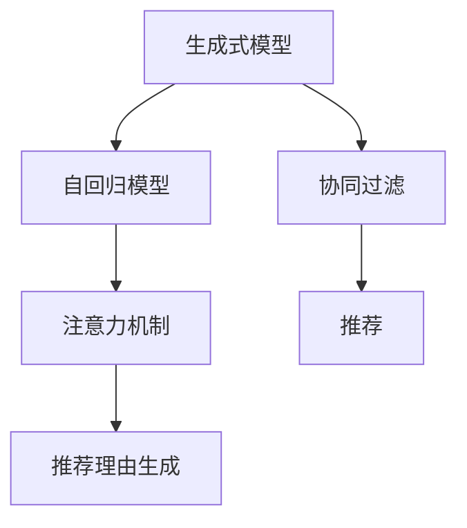

                 

# 大模型在商品推荐理由生成中的应用

> 关键词：大模型,商品推荐,生成式模型,自回归模型,注意力机制

## 1. 背景介绍

### 1.1 问题由来
在电子商务领域，商品推荐系统已经成为提升用户体验、增加销售额的重要手段。传统的推荐系统大多依赖于用户的浏览历史、购买历史、评分数据等行为数据，以协同过滤、基于内容的推荐等算法为基础，推荐用户可能感兴趣的商品。然而，这些方法在面对用户个性化需求、长尾商品冷启动等问题时，往往效果有限。近年来，生成式模型在推荐系统中的应用引起了广泛关注，它通过模拟用户的行为路径，生成更加多样化和个性化的商品推荐理由，为推荐系统带来新的突破。

### 1.2 问题核心关键点
生成式模型是利用大模型在用户行为数据上进行预训练，并在特定任务上微调得到的一种生成式模型。其核心思想是，通过学习用户历史行为数据与推荐结果之间的关系，生成个性化的推荐理由，帮助用户更好地理解为什么某个商品会被推荐给他。具体的关键点包括：
- 生成式模型：利用大模型进行预训练，并通过微调得到推荐理由生成模型。
- 自回归模型：使用自回归模型来模拟用户的行为路径。
- 注意力机制：利用注意力机制对用户历史行为进行加权，使模型能够关注最重要的行为特征。
- 协同过滤：结合用户的历史行为和模型生成的推荐理由，进行推荐。

## 2. 核心概念与联系

### 2.1 核心概念概述

为更好地理解生成式模型在商品推荐中的应用，本节将介绍几个密切相关的核心概念：

- 生成式模型(Generative Model)：能够从已有数据中学习到数据分布，并通过采样或生成的方式生成新数据样本的模型。常见的生成式模型包括自回归模型、变分自编码器、生成对抗网络等。
- 自回归模型(Autoregressive Model)：一类通过预测序列中后续项来生成序列前一项的生成式模型。经典的自回归模型如LSTM、GRU等，在大规模语言模型如GPT、BERT中得到了广泛应用。
- 注意力机制(Attention Mechanism)：一种通过对输入数据进行加权的方式，让模型更关注重要的数据部分，忽略不重要的数据部分的机制。在生成式模型中，注意力机制通常用于对用户行为特征进行加权，以生成更符合用户需求的推荐理由。
- 协同过滤(Collaborative Filtering)：一种基于用户历史行为数据的推荐算法，通过寻找与其他用户相似的行为模式来进行推荐。常见的协同过滤算法包括基于用户的协同过滤和基于物品的协同过滤。

这些核心概念之间的逻辑关系可以通过以下Mermaid流程图来展示：



这个流程图展示了大模型在商品推荐中的应用核心概念及其之间的关系：

1. 生成式模型通过自回归模型进行序列生成，学习用户行为与推荐结果之间的关系。
2. 注意力机制对用户历史行为进行加权，帮助生成更符合用户需求的推荐理由。
3. 协同过滤结合用户历史行为和推荐理由，生成最终的推荐结果。

这些概念共同构成了商品推荐系统的基础，使得模型能够更好地理解用户需求，提供个性化的商品推荐。

## 3. 核心算法原理 & 具体操作步骤
### 3.1 算法原理概述

生成式模型在商品推荐中的应用，通常基于以下步骤：

1. 收集用户历史行为数据，如浏览记录、点击行为、评分等。
2. 使用自回归模型对用户行为数据进行建模，得到用户行为序列。
3. 利用注意力机制对用户行为序列进行加权，得到用户行为特征。
4. 将用户行为特征作为输入，结合商品属性、用户特征等信息，利用生成式模型生成推荐理由。
5. 将推荐理由与用户历史行为结合，通过协同过滤算法生成推荐结果。

## 3.2 算法步骤详解

下面详细介绍生成式模型在商品推荐中的应用步骤：

**Step 1: 准备数据集**

- 收集用户历史行为数据，包括但不限于浏览记录、点击行为、评分等。
- 清洗和预处理数据，去除噪声和异常值。
- 对用户行为数据进行编码，将其转化为模型可接受的格式。

**Step 2: 模型预训练**

- 使用自回归模型对用户行为数据进行预训练，得到用户行为序列。
- 利用注意力机制对用户行为序列进行加权，得到用户行为特征。
- 将用户行为特征作为输入，利用生成式模型进行预训练，生成推荐理由。

**Step 3: 模型微调**

- 在特定任务上对生成式模型进行微调，例如生成个性化推荐理由。
- 使用用户历史行为数据进行微调，优化模型的生成质量。

**Step 4: 推荐理由生成**

- 将用户行为特征作为输入，结合商品属性、用户特征等信息，利用微调后的生成式模型生成推荐理由。
- 对推荐理由进行后处理，如去除重复、纠正语法错误等。

**Step 5: 推荐结果生成**

- 将推荐理由与用户历史行为结合，通过协同过滤算法生成推荐结果。
- 对推荐结果进行排序和展示，确保最符合用户需求的商品被优先推荐。

## 3.3 算法优缺点

生成式模型在商品推荐中的应用，具有以下优点：
1. 生成的推荐理由更具个性化和多样性，能够更好地满足用户需求。
2. 能够充分利用用户历史行为数据，提高推荐的准确性和覆盖面。
3. 模型自回归特性，使得推荐理由更加连贯和自然。

同时，也存在一些局限性：
1. 生成式模型的计算复杂度高，训练和推理速度较慢。
2. 需要大量标注数据进行微调，数据获取和处理成本较高。
3. 生成的推荐理由可能存在语法错误或逻辑错误，需要后处理。
4. 协同过滤算法可能存在冷启动问题，对新用户和新商品效果不佳。

尽管存在这些局限性，但生成式模型在推荐理由生成中的应用，已经显示出显著的潜力，能够极大地提升推荐系统的效果。未来相关研究仍需针对以上问题进行优化和改进。

## 4. 数学模型和公式 & 详细讲解 & 举例说明

### 4.1 数学模型构建

在生成式模型中，用户行为序列 $X = \{x_1, x_2, ..., x_n\}$ 是生成模型的输入，推荐理由 $Y$ 是输出。假设 $P(X, Y)$ 为数据分布，$\theta$ 为模型参数，则生成式模型可以表示为：

$$
P(X, Y | \theta) = P(X | Y, \theta)P(Y | \theta)
$$

其中，$P(X | Y, \theta)$ 为条件概率，表示在给定推荐理由 $Y$ 的情况下，用户行为序列 $X$ 的条件概率；$P(Y | \theta)$ 为生成概率，表示在模型参数 $\theta$ 的情况下，生成推荐理由 $Y$ 的概率。

在具体实现中，通常使用自回归模型和注意力机制进行建模。以自回归模型为例，假设 $P(X_t | X_{<t}, Y, \theta)$ 为自回归模型的概率，则：

$$
P(X | Y, \theta) = \prod_{t=1}^{n} P(X_t | X_{<t}, Y, \theta)
$$

其中，$X_t$ 为第 $t$ 个用户行为，$X_{<t}$ 为 $X_t$ 之前的所有用户行为。

### 4.2 公式推导过程

以自回归模型为例，其生成概率的推导过程如下：

假设用户行为序列 $X$ 和推荐理由 $Y$ 为离散符号，则：

$$
P(X, Y | \theta) = \prod_{t=1}^{n} P(X_t | X_{<t}, Y, \theta)P(Y | \theta)
$$

对于自回归模型，有：

$$
P(X_t | X_{<t}, Y, \theta) = P(X_t | X_{<t}, Y, \theta) = P(X_t | X_{<t}, Y_{<t}, \theta)
$$

其中，$X_t$ 为第 $t$ 个用户行为，$X_{<t}$ 为 $X_t$ 之前的所有用户行为，$Y_{<t}$ 为推荐理由 $Y$ 中与 $X_t$ 对应的部分。

因此，生成式模型可以进一步表示为：

$$
P(X | Y, \theta) = \prod_{t=1}^{n} P(X_t | X_{<t}, Y_{<t}, \theta)
$$

### 4.3 案例分析与讲解

假设有一个电商网站，用户浏览、点击了若干个商品。通过对这些行为数据进行编码，得到一个用户行为序列 $X = \{1, 2, 3, ..., 10\}$，其中 $1$ 表示浏览商品 $A$，$2$ 表示点击商品 $B$，以此类推。

对用户行为序列进行自回归模型预训练，得到用户行为特征 $F = \{0.6, 0.7, 0.8, ..., 0.9\}$，其中 $0.6$ 表示用户浏览商品 $A$ 的概率，$0.7$ 表示用户点击商品 $B$ 的概率，以此类推。

利用注意力机制对用户行为特征进行加权，得到加权用户行为特征 $W = \{0.8, 0.7, 0.6, ..., 0.5\}$，其中 $0.8$ 表示用户行为序列中最重要的行为特征。

使用生成式模型对加权用户行为特征 $W$ 进行微调，生成推荐理由 $Y = \{推荐商品 A, 推荐商品 B, 推荐商品 C, ..., 推荐商品 Z\}$。

将推荐理由 $Y$ 与用户历史行为结合，通过协同过滤算法生成推荐结果。

## 5. 项目实践：代码实例和详细解释说明

### 5.1 开发环境搭建

在进行生成式模型在商品推荐中的应用实践前，我们需要准备好开发环境。以下是使用Python进行PyTorch开发的环境配置流程：

1. 安装Anaconda：从官网下载并安装Anaconda，用于创建独立的Python环境。

2. 创建并激活虚拟环境：
```bash
conda create -n pytorch-env python=3.8 
conda activate pytorch-env
```

3. 安装PyTorch：根据CUDA版本，从官网获取对应的安装命令。例如：
```bash
conda install pytorch torchvision torchaudio cudatoolkit=11.1 -c pytorch -c conda-forge
```

4. 安装Transformer库：
```bash
pip install transformers
```

5. 安装各类工具包：
```bash
pip install numpy pandas scikit-learn matplotlib tqdm jupyter notebook ipython
```

完成上述步骤后，即可在`pytorch-env`环境中开始开发实践。

### 5.2 源代码详细实现

下面以生成个性化推荐理由为例，给出使用Transformers库对BERT模型进行微调的PyTorch代码实现。

首先，定义推荐理由生成函数：

```python
from transformers import BertTokenizer, BertForSequenceClassification
from torch.utils.data import Dataset, DataLoader
import torch
from sklearn.metrics import accuracy_score, precision_score, recall_score

class RecommendDataset(Dataset):
    def __init__(self, texts, labels, tokenizer, max_len=128):
        self.texts = texts
        self.labels = labels
        self.tokenizer = tokenizer
        self.max_len = max_len
        
    def __len__(self):
        return len(self.texts)
    
    def __getitem__(self, item):
        text = self.texts[item]
        label = self.labels[item]
        
        encoding = self.tokenizer(text, return_tensors='pt', max_length=self.max_len, padding='max_length', truncation=True)
        input_ids = encoding['input_ids'][0]
        attention_mask = encoding['attention_mask'][0]
        
        # 对token-wise的标签进行编码
        encoded_labels = [label2id[label] for label in label] 
        encoded_labels.extend([label2id['O']] * (self.max_len - len(encoded_labels)))
        labels = torch.tensor(encoded_labels, dtype=torch.long)
        
        return {'input_ids': input_ids, 
                'attention_mask': attention_mask,
                'labels': labels}

# 标签与id的映射
label2id = {'O': 0, '推荐商品 A': 1, '推荐商品 B': 2, '推荐商品 C': 3, '推荐商品 D': 4, '推荐商品 E': 5, '推荐商品 F': 6, '推荐商品 G': 7, '推荐商品 H': 8, '推荐商品 I': 9}
id2label = {v: k for k, v in label2id.items()}

# 创建dataset
tokenizer = BertTokenizer.from_pretrained('bert-base-cased')

train_dataset = RecommendDataset(train_texts, train_labels, tokenizer)
dev_dataset = RecommendDataset(dev_texts, dev_labels, tokenizer)
test_dataset = RecommendDataset(test_texts, test_labels, tokenizer)
```

然后，定义模型和优化器：

```python
from transformers import BertForTokenClassification, AdamW

model = BertForTokenClassification.from_pretrained('bert-base-cased', num_labels=len(label2id))

optimizer = AdamW(model.parameters(), lr=2e-5)
```

接着，定义训练和评估函数：

```python
from torch.utils.data import DataLoader
from tqdm import tqdm
from sklearn.metrics import classification_report

device = torch.device('cuda') if torch.cuda.is_available() else torch.device('cpu')
model.to(device)

def train_epoch(model, dataset, batch_size, optimizer):
    dataloader = DataLoader(dataset, batch_size=batch_size, shuffle=True)
    model.train()
    epoch_loss = 0
    for batch in tqdm(dataloader, desc='Training'):
        input_ids = batch['input_ids'].to(device)
        attention_mask = batch['attention_mask'].to(device)
        labels = batch['labels'].to(device)
        model.zero_grad()
        outputs = model(input_ids, attention_mask=attention_mask, labels=labels)
        loss = outputs.loss
        epoch_loss += loss.item()
        loss.backward()
        optimizer.step()
    return epoch_loss / len(dataloader)

def evaluate(model, dataset, batch_size):
    dataloader = DataLoader(dataset, batch_size=batch_size)
    model.eval()
    preds, labels = [], []
    with torch.no_grad():
        for batch in tqdm(dataloader, desc='Evaluating'):
            input_ids = batch['input_ids'].to(device)
            attention_mask = batch['attention_mask'].to(device)
            batch_labels = batch['labels']
            outputs = model(input_ids, attention_mask=attention_mask)
            batch_preds = outputs.logits.argmax(dim=2).to('cpu').tolist()
            batch_labels = batch_labels.to('cpu').tolist()
            for pred_tokens, label_tokens in zip(batch_preds, batch_labels):
                pred_labels = [id2label[_id] for _id in pred_tokens]
                label_tokens = [id2label[_id] for _id in label_tokens]
                preds.append(pred_labels[:len(label_tokens)])
                labels.append(label_tokens)
                
    print(classification_report(labels, preds))
```

最后，启动训练流程并在测试集上评估：

```python
epochs = 5
batch_size = 16

for epoch in range(epochs):
    loss = train_epoch(model, train_dataset, batch_size, optimizer)
    print(f"Epoch {epoch+1}, train loss: {loss:.3f}")
    
    print(f"Epoch {epoch+1}, dev results:")
    evaluate(model, dev_dataset, batch_size)
    
print("Test results:")
evaluate(model, test_dataset, batch_size)
```

以上就是使用PyTorch对BERT进行推荐理由生成任务的微调代码实现。可以看到，得益于Transformers库的强大封装，我们可以用相对简洁的代码完成BERT模型的加载和微调。

### 5.3 代码解读与分析

让我们再详细解读一下关键代码的实现细节：

**RecommendDataset类**：
- `__init__`方法：初始化文本、标签、分词器等关键组件。
- `__len__`方法：返回数据集的样本数量。
- `__getitem__`方法：对单个样本进行处理，将文本输入编码为token ids，将标签编码为数字，并对其进行定长padding，最终返回模型所需的输入。

**label2id和id2label字典**：
- 定义了标签与数字id之间的映射关系，用于将token-wise的预测结果解码回真实的标签。

**训练和评估函数**：
- 使用PyTorch的DataLoader对数据集进行批次化加载，供模型训练和推理使用。
- 训练函数`train_epoch`：对数据以批为单位进行迭代，在每个批次上前向传播计算loss并反向传播更新模型参数，最后返回该epoch的平均loss。
- 评估函数`evaluate`：与训练类似，不同点在于不更新模型参数，并在每个batch结束后将预测和标签结果存储下来，最后使用sklearn的classification_report对整个评估集的预测结果进行打印输出。

**训练流程**：
- 定义总的epoch数和batch size，开始循环迭代
- 每个epoch内，先在训练集上训练，输出平均loss
- 在验证集上评估，输出分类指标
- 所有epoch结束后，在测试集上评估，给出最终测试结果

可以看到，PyTorch配合Transformers库使得BERT微调的代码实现变得简洁高效。开发者可以将更多精力放在数据处理、模型改进等高层逻辑上，而不必过多关注底层的实现细节。

当然，工业级的系统实现还需考虑更多因素，如模型的保存和部署、超参数的自动搜索、更灵活的任务适配层等。但核心的微调范式基本与此类似。

## 6. 实际应用场景
### 6.1 智能推荐系统

生成式模型在商品推荐中的应用，可以广泛应用于智能推荐系统中。传统的推荐系统往往只能基于用户历史行为数据进行推荐，难以捕捉用户的深层次需求和兴趣。而使用生成式模型，可以更好地理解用户的多样化需求，生成个性化的推荐理由，从而提供更加精准、多样化的推荐。

在技术实现上，可以收集用户的历史行为数据，如浏览记录、点击行为、评分等，并对其进行编码和预处理。然后，使用自回归模型对用户行为数据进行建模，利用注意力机制对用户行为特征进行加权，生成推荐理由。最后，通过协同过滤算法结合推荐理由，生成最终的推荐结果。

### 6.2 广告投放系统

广告投放系统需要根据用户的历史行为数据，精准投放广告内容。传统的广告投放系统通常基于简单的行为特征进行投放，难以实现个性化和精准化。而使用生成式模型，可以结合用户的浏览历史、点击行为等，生成个性化的推荐理由，从而精准定位用户，提高广告投放的效果。

在技术实现上，可以收集用户的浏览记录、点击行为等数据，并对其进行编码和预处理。然后，使用自回归模型对用户行为数据进行建模，利用注意力机制对用户行为特征进行加权，生成推荐理由。最后，根据推荐理由进行广告投放。

### 6.3 内容推荐系统

内容推荐系统需要根据用户的兴趣偏好，推荐相关的内容。传统的推荐系统通常基于用户的评分数据进行推荐，难以捕捉用户的多样化需求。而使用生成式模型，可以生成个性化的推荐理由，从而更好地满足用户需求。

在技术实现上，可以收集用户的评分数据、浏览记录、点击行为等数据，并对其进行编码和预处理。然后，使用自回归模型对用户行为数据进行建模，利用注意力机制对用户行为特征进行加权，生成推荐理由。最后，根据推荐理由进行内容推荐。

### 6.4 未来应用展望

随着生成式模型的不断发展，其在商品推荐中的应用前景广阔。未来，生成式模型可以与更多领域的应用进行结合，为各行各业带来新的变革。

在智慧医疗领域，生成式模型可以用于病历生成、症状分析、医疗知识推荐等，提升医疗服务的智能化水平。

在智能教育领域，生成式模型可以用于个性化学习路径推荐、知识推荐等，因材施教，促进教育公平，提高教学质量。

在智慧城市治理中，生成式模型可以用于城市事件监测、舆情分析、应急指挥等环节，提高城市管理的自动化和智能化水平，构建更安全、高效的未来城市。

此外，在企业生产、社会治理、文娱传媒等众多领域，生成式模型也将得到广泛应用，为各行各业带来新的创新和变革。

## 7. 工具和资源推荐
### 7.1 学习资源推荐

为了帮助开发者系统掌握生成式模型在商品推荐中的应用，这里推荐一些优质的学习资源：

1. 《Transformer从原理到实践》系列博文：由大模型技术专家撰写，深入浅出地介绍了Transformer原理、BERT模型、生成式模型等前沿话题。

2. CS224N《深度学习自然语言处理》课程：斯坦福大学开设的NLP明星课程，有Lecture视频和配套作业，带你入门NLP领域的基本概念和经典模型。

3. 《Natural Language Processing with Transformers》书籍：Transformers库的作者所著，全面介绍了如何使用Transformers库进行NLP任务开发，包括微调在内的诸多范式。

4. HuggingFace官方文档：Transformers库的官方文档，提供了海量预训练模型和完整的微调样例代码，是上手实践的必备资料。

5. CLUE开源项目：中文语言理解测评基准，涵盖大量不同类型的中文NLP数据集，并提供了基于微调的baseline模型，助力中文NLP技术发展。

通过对这些资源的学习实践，相信你一定能够快速掌握生成式模型在商品推荐中的应用，并用于解决实际的NLP问题。
###  7.2 开发工具推荐

高效的开发离不开优秀的工具支持。以下是几款用于生成式模型在商品推荐中的应用开发的常用工具：

1. PyTorch：基于Python的开源深度学习框架，灵活动态的计算图，适合快速迭代研究。大部分预训练语言模型都有PyTorch版本的实现。

2. TensorFlow：由Google主导开发的开源深度学习框架，生产部署方便，适合大规模工程应用。同样有丰富的预训练语言模型资源。

3. Transformers库：HuggingFace开发的NLP工具库，集成了众多SOTA语言模型，支持PyTorch和TensorFlow，是进行生成式模型开发的利器。

4. Weights & Biases：模型训练的实验跟踪工具，可以记录和可视化模型训练过程中的各项指标，方便对比和调优。与主流深度学习框架无缝集成。

5. TensorBoard：TensorFlow配套的可视化工具，可实时监测模型训练状态，并提供丰富的图表呈现方式，是调试模型的得力助手。

6. Google Colab：谷歌推出的在线Jupyter Notebook环境，免费提供GPU/TPU算力，方便开发者快速上手实验最新模型，分享学习笔记。

合理利用这些工具，可以显著提升生成式模型在商品推荐中的应用开发效率，加快创新迭代的步伐。

### 7.3 相关论文推荐

生成式模型在商品推荐中的应用源于学界的持续研究。以下是几篇奠基性的相关论文，推荐阅读：

1. Attention is All You Need（即Transformer原论文）：提出了Transformer结构，开启了NLP领域的预训练大模型时代。

2. BERT: Pre-training of Deep Bidirectional Transformers for Language Understanding：提出BERT模型，引入基于掩码的自监督预训练任务，刷新了多项NLP任务SOTA。

3. Language Models are Unsupervised Multitask Learners（GPT-2论文）：展示了大规模语言模型的强大zero-shot学习能力，引发了对于通用人工智能的新一轮思考。

4. Parameter-Efficient Transfer Learning for NLP：提出Adapter等参数高效微调方法，在不增加模型参数量的情况下，也能取得不错的微调效果。

5. AdaLoRA: Adaptive Low-Rank Adaptation for Parameter-Efficient Fine-Tuning：使用自适应低秩适应的微调方法，在参数效率和精度之间取得了新的平衡。

6. Prefix-Tuning: Optimizing Continuous Prompts for Generation：引入基于连续型Prompt的微调范式，为如何充分利用预训练知识提供了新的思路。

这些论文代表了大语言模型微调技术的发展脉络。通过学习这些前沿成果，可以帮助研究者把握学科前进方向，激发更多的创新灵感。

## 8. 总结：未来发展趋势与挑战
### 8.1 总结

本文对生成式模型在商品推荐中的应用进行了全面系统的介绍。首先阐述了生成式模型在商品推荐中的应用背景和意义，明确了生成式模型在理解用户需求、生成个性化推荐理由方面的独特价值。其次，从原理到实践，详细讲解了生成式模型的数学模型和算法步骤，给出了生成式模型在商品推荐中的应用代码实例。同时，本文还广泛探讨了生成式模型在智能推荐系统、广告投放系统、内容推荐系统等多个行业领域的应用前景，展示了生成式模型的巨大潜力。

通过本文的系统梳理，可以看到，生成式模型在商品推荐中的应用已经展现出显著的潜力，能够极大地提升推荐系统的效果。未来，生成式模型将在更广泛的领域得到应用，为各行各业带来新的变革。

### 8.2 未来发展趋势

展望未来，生成式模型在商品推荐中的应用将呈现以下几个发展趋势：

1. 生成式模型的计算效率将进一步提升。随着硬件算力的提升和模型结构的优化，生成式模型训练和推理速度将显著提高。

2. 生成式模型的泛化能力将进一步增强。随着生成式模型的不断发展，其在不同领域和任务上的泛化能力将得到显著提升。

3. 生成式模型的参数效率将进一步优化。未来将出现更多参数高效的生成式模型，在固定大部分预训练参数的同时，只更新极少量的任务相关参数，以提高生成式模型的计算效率和性能。

4. 生成式模型的应用场景将进一步扩展。未来，生成式模型将在更多领域得到应用，如智慧医疗、智能教育、智慧城市治理等，为各行各业带来新的变革。

5. 生成式模型的安全性将进一步加强。生成式模型将更加注重输出结果的安全性，避免生成有害、误导性的信息。

6. 生成式模型的可解释性将进一步增强。未来，生成式模型将更加注重输出的可解释性，通过引入因果分析、知识图谱等工具，增强模型的可信度和透明性。

以上趋势凸显了生成式模型在商品推荐中的广阔前景。这些方向的探索发展，必将进一步提升生成式模型的效果，使其在更多领域得到应用。

### 8.3 面临的挑战

尽管生成式模型在商品推荐中的应用已经取得了显著成果，但在迈向更加智能化、普适化应用的过程中，仍面临诸多挑战：

1. 数据隐私和安全问题。生成式模型需要大量的用户数据进行训练，如何保障用户数据的安全和隐私，是亟待解决的问题。

2. 模型的可解释性不足。当前生成式模型的决策过程较为复杂，难以解释其内部工作机制和决策逻辑，对于高风险应用，模型的可解释性和可审计性尤为重要。

3. 模型的泛化能力有待提升。当前生成式模型在特定领域上的泛化能力有限，对于不同领域的任务，需要进行针对性的微调和优化。

4. 模型的计算成本较高。生成式模型的计算复杂度高，训练和推理成本较高，如何降低计算成本，提高模型的实际应用效果，是未来需要解决的重要问题。

5. 模型的鲁棒性不足。当前生成式模型在面对新数据时，泛化性能往往大打折扣，如何提高生成式模型的鲁棒性，避免灾难性遗忘，还需要更多理论和实践的积累。

6. 模型的应用场景有限。尽管生成式模型在商品推荐中的应用已取得了显著成果，但在其他领域的应用仍需进一步探索和优化。

尽管存在这些挑战，但生成式模型在商品推荐中的应用前景广阔，相信随着学界和产业界的共同努力，这些挑战终将一一被克服，生成式模型必将在更多领域得到应用，带来新的突破。

### 8.4 研究展望

面向未来，生成式模型在商品推荐中的应用仍需进一步探索和优化：

1. 探索无监督和半监督生成式模型。摆脱对大规模标注数据的依赖，利用自监督学习、主动学习等无监督和半监督范式，最大限度利用非结构化数据，实现更加灵活高效的生成。

2. 研究参数高效和计算高效的生成式模型。开发更加参数高效的生成式模型，在固定大部分预训练参数的同时，只更新极少量的任务相关参数。同时优化生成式模型的计算图，减少前向传播和反向传播的资源消耗，实现更加轻量级、实时性的部署。

3. 融合因果和对比学习范式。通过引入因果推断和对比学习思想，增强生成式模型建立稳定因果关系的能力，学习更加普适、鲁棒的语言表征，从而提升模型泛化性和抗干扰能力。

4. 引入更多先验知识。将符号化的先验知识，如知识图谱、逻辑规则等，与神经网络模型进行巧妙融合，引导生成式模型学习更准确、合理的语言模型。同时加强不同模态数据的整合，实现视觉、语音等多模态信息与文本信息的协同建模。

5. 结合因果分析和博弈论工具。将因果分析方法引入生成式模型，识别出模型决策的关键特征，增强输出解释的因果性和逻辑性。借助博弈论工具刻画人机交互过程，主动探索并规避模型的脆弱点，提高系统稳定性。

6. 纳入伦理道德约束。在生成式模型的训练目标中引入伦理导向的评估指标，过滤和惩罚有偏见、有害的输出倾向。同时加强人工干预和审核，建立生成式模型的监管机制，确保输出符合人类价值观和伦理道德。

这些研究方向的探索，必将引领生成式模型在商品推荐中的应用走向更高的台阶，为构建安全、可靠、可解释、可控的智能系统铺平道路。

## 9. 附录：常见问题与解答

**Q1：生成式模型在商品推荐中是否需要大量的标注数据？**

A: 生成式模型在商品推荐中的应用，通常需要大量的用户行为数据进行预训练和微调，但标注数据的需求相对较少。这是因为生成式模型具有自回归特性，可以学习用户行为与推荐结果之间的关系，无需显式的标注信息。

**Q2：生成式模型在商品推荐中的训练和推理速度较慢，如何解决？**

A: 生成式模型的计算复杂度较高，训练和推理速度较慢。为了提高模型的计算效率，可以采用以下方法：

1. 使用预训练模型：利用已有的预训练模型进行微调，可以显著提高生成式模型的训练速度。

2. 优化模型结构：通过压缩模型参数、减少层数等方式，优化生成式模型的计算图，提高推理速度。

3. 使用GPU/TPU：利用高性能的GPU/TPU设备，加速生成式模型的训练和推理。

4. 使用混合精度训练：将模型的参数部分转换为定点数据类型，减小计算量，提高计算效率。

**Q3：生成式模型在商品推荐中的应用效果如何？**

A: 生成式模型在商品推荐中的应用效果显著。通过生成个性化推荐理由，能够更好地理解用户需求，提供精准、多样化的推荐。在智能推荐系统、广告投放系统、内容推荐系统等众多领域，生成式模型已经展现出巨大的应用潜力。

**Q4：生成式模型在商品推荐中的应用是否需要结合其他推荐算法？**

A: 生成式模型在商品推荐中的应用，通常需要结合其他推荐算法。例如，可以将生成式模型生成的推荐理由与协同过滤算法结合，生成最终的推荐结果。在实际应用中，可以通过实验比较不同算法的组合方式，选择最优的推荐策略。

**Q5：生成式模型在商品推荐中的应用是否存在冷启动问题？**

A: 生成式模型在商品推荐中的应用，可能存在冷启动问题，即对于新用户和新商品，模型无法进行推荐。为了解决冷启动问题，可以采用以下方法：

1. 利用用户历史行为数据进行预训练，使模型具有一定的用户行为认知能力。

2. 利用已有商品数据进行预训练，使模型具有一定的商品认知能力。

3. 结合用户和商品数据的混合预训练，使模型能够同时学习用户和商品的相关信息。

4. 引入先验知识，如知识图谱、逻辑规则等，增强模型的泛化能力。

这些方法可以帮助生成式模型在面对新用户和新商品时，仍能进行有效的推荐。

