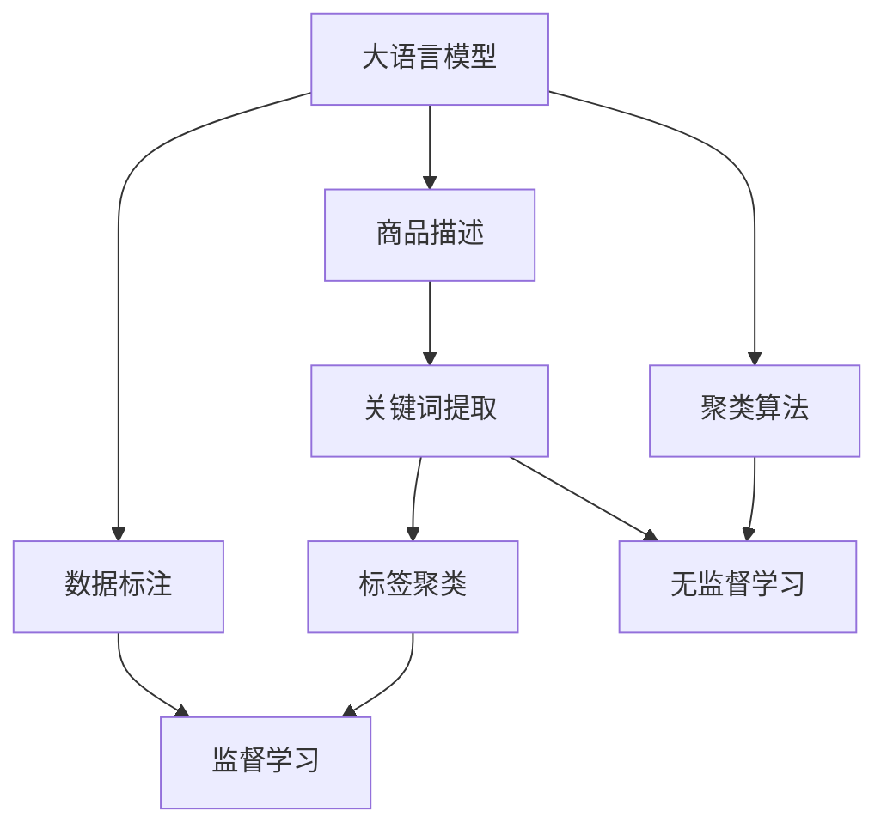

                 

# 大模型在商品标签体系构建中的应用

> 关键词：大模型, 商品标签体系, 数据标注, 自然语言处理(NLP), 聚类算法, 监督学习, 无监督学习

## 1. 背景介绍

在现代电子商务中，商品标签体系对搜索结果、推荐系统、广告投放等都有着至关重要的作用。合理的商品标签能够提高搜索结果的相关性和召回率，使推荐系统更加精准，广告投放更加精准有效。然而，商品标签的构建并不是一件简单的事情，需要耗费大量的人力和时间。传统标签体系构建方法往往需要人工标注，效率低下且成本高昂。随着深度学习技术的发展，大语言模型在商品标签体系构建中的应用逐渐成为研究热点。本文将系统介绍大模型在商品标签体系构建中的应用，涵盖算法原理、具体操作步骤、未来展望等内容，并结合代码实例详细讲解，为相关开发者提供实践参考。

## 2. 核心概念与联系

### 2.1 核心概念概述

在进行商品标签体系构建时，我们需要从海量商品描述中自动提取关键词或短语，构建商品标签体系。大语言模型，如BERT、GPT等，由于其强大的自然语言处理能力，可以高效地实现这一任务。具体而言，我们通过预训练大模型对商品描述进行处理，得到商品标签的表示，从而构建出商品标签体系。

- **大语言模型**：指通过大规模无监督学习任务预训练的模型，具备强大的自然语言处理能力。
- **商品标签体系**：商品描述的关键词或短语集合，用于搜索、推荐、广告投放等。
- **数据标注**：手工为商品描述标注关键词，用于训练模型。
- **自然语言处理(NLP)**：使用计算机处理和理解自然语言的技术。
- **聚类算法**：用于将相似的关键词或短语归为一类，构建商品标签体系。
- **监督学习**：使用标注数据训练模型，通过给模型输入商品描述，输出对应的标签。
- **无监督学习**：不使用标注数据，通过模型自身学习提取商品描述中的关键词或短语。

这些核心概念之间的逻辑关系可以通过以下Mermaid流程图来展示：



这个流程图展示了从大语言模型到商品标签体系构建的整个流程：

1. 大语言模型对商品描述进行处理。
2. 基于处理结果，提取关键词或短语。
3. 聚类算法将相似的关键词或短语归为一类，构建商品标签体系。
4. 如果是有监督学习任务，则使用标注数据训练模型，使其能够更准确地提取关键词或短语。
5. 如果是无监督学习任务，则利用大语言模型自身的学习能力，提取关键词或短语。

## 3. 核心算法原理 & 具体操作步骤

### 3.1 算法原理概述

基于大语言模型构建商品标签体系的核心思想是利用大模型的预训练知识和自然语言处理能力，从商品描述中自动提取关键词或短语，构建商品标签体系。具体而言，可以通过以下步骤实现：

1. **数据预处理**：清洗商品描述，去除无用的符号和特殊字符，统一大小写等。
2. **模型输入**：将清洗后的商品描述输入到预训练大模型中，得到商品描述的表示。
3. **关键词提取**：从商品描述的表示中提取关键词或短语，构建商品标签。
4. **标签聚类**：使用聚类算法将相似的标签归为一类，构建商品标签体系。
5. **模型训练**：如果是有监督任务，则使用标注数据训练模型，使其能够更准确地提取关键词或短语。

### 3.2 算法步骤详解

#### 3.2.1 数据预处理

商品描述中的文本数据通常包含非结构化信息，需要进行预处理才能输入到大模型中。常见的预处理步骤包括：

- **清洗**：去除非文本字符，如HTML标签、特殊符号等。
- **分词**：将文本分割成单词或词组。
- **去除停用词**：去除常见的停用词，如“的”、“是”等。
- **词干提取**：将单词还原到词干形式，如将“running”还原为“run”。
- **词性标注**：标注每个单词的词性，如名词、动词等。

#### 3.2.2 模型输入

将预处理后的商品描述输入到大模型中，得到商品描述的表示。常用的模型包括BERT、GPT等。输入模型前，需要对文本进行分词和编码，将文本转换为模型能够接受的格式。例如，对于BERT模型，可以使用`tokenizer`将文本分词，并转换为数字编码。

#### 3.2.3 关键词提取

关键词提取是商品标签体系构建的关键步骤之一。常用的关键词提取方法包括：

- **TF-IDF**：通过计算单词的词频和逆文档频率，筛选出重要的单词作为关键词。
- **TextRank**：通过分析文本中单词之间的关系，计算单词的重要性，筛选出重要的单词作为关键词。
- **LDA**：通过主题建模，将文本中的单词聚类到不同的主题中，筛选出与主题相关的单词作为关键词。
- **大语言模型**：直接通过大语言模型提取关键词。将商品描述输入到大模型中，通过模型输出向量，筛选出具有代表性的单词或短语作为关键词。

#### 3.2.4 标签聚类

标签聚类的目的是将相似的关键词或短语归为一类，构建商品标签体系。常用的聚类算法包括：

- **K-means**：将相似的标签聚为一类，构建商品标签体系。
- **层次聚类**：通过构建树状结构，将标签分层聚类。
- **DBSCAN**：通过密度聚类，将相似的标签聚为一类。
- **GMM**：通过高斯混合模型，将标签聚类到不同的组中。

### 3.3 算法优缺点

基于大语言模型构建商品标签体系具有以下优点：

1. **高效性**：大模型能够快速处理大规模商品描述数据，提取关键词或短语，构建商品标签体系。
2. **准确性**：大模型的预训练知识和自然语言处理能力，使得关键词提取和标签聚类更加准确。
3. **可扩展性**：大模型可以扩展到更多的商品描述和标签，构建更全面的商品标签体系。

同时，基于大语言模型构建商品标签体系也存在一些缺点：

1. **依赖大模型**：构建商品标签体系需要依赖大语言模型，如果模型性能不佳，则标签体系的构建效果也会受到影响。
2. **数据质量要求高**：商品描述数据的质量直接影响关键词提取和标签聚类的效果。如果数据质量较差，则可能影响标签体系的构建效果。
3. **计算资源消耗高**：大模型需要大量的计算资源进行预训练和微调，构建商品标签体系也需要大量的计算资源。

### 3.4 算法应用领域

基于大语言模型构建商品标签体系的应用领域非常广泛，主要包括以下几个方面：

- **电商平台**：构建商品标签体系，用于商品搜索、推荐、广告投放等。
- **零售行业**：构建商品标签体系，用于库存管理、销售预测、客户分析等。
- **金融行业**：构建商品标签体系，用于风险评估、投资决策、客户分析等。
- **医疗行业**：构建商品标签体系，用于医疗产品搜索、医疗知识管理等。
- **文化娱乐**：构建商品标签体系，用于电影、书籍、音乐等推荐系统。

## 4. 数学模型和公式 & 详细讲解 & 举例说明

### 4.1 数学模型构建

假设商品描述为 $x_i$，$i=1,2,\dots,n$，共有 $n$ 个商品描述。商品标签为 $y_i$，$i=1,2,\dots,n$。我们的目标是从商品描述 $x_i$ 中提取关键词或短语，构建商品标签体系。

- **关键词提取模型**：给定商品描述 $x_i$，输出关键词或短语 $k_i$。模型可以是基于规则的，如TF-IDF、TextRank、LDA等，也可以是基于深度学习的，如大语言模型。
- **标签聚类模型**：将相似的关键词或短语归为一类，构建商品标签体系。模型可以是基于距离的，如K-means、层次聚类等，也可以是基于密度的，如DBSCAN等。

### 4.2 公式推导过程

以基于大语言模型的关键词提取模型为例，我们假设模型为 $M_{\theta}$，其中 $\theta$ 为模型的参数。输入商品描述 $x_i$，输出关键词或短语 $k_i$。

设 $x_i = (x_{i1}, x_{i2}, \dots, x_{im})$，其中 $m$ 为商品描述的长度。将 $x_i$ 输入到模型 $M_{\theta}$ 中，得到商品描述的表示 $\hat{x_i} \in \mathbb{R}^d$，其中 $d$ 为表示向量维度。

设关键词提取模型为 $k_i = M_{\theta}(x_i)$。假设关键词或短语 $k_i$ 的表示为 $\hat{k_i} \in \mathbb{R}^d$，则关键词提取模型的损失函数为：

$$
\ell(M_{\theta}, x_i, k_i) = ||\hat{k_i} - k_i||_2^2
$$

其中 $||\cdot||_2$ 为向量范数。我们的目标是最小化损失函数 $\ell$，即：

$$
\min_{\theta} \sum_{i=1}^n \ell(M_{\theta}, x_i, k_i)
$$

通过梯度下降等优化算法，最小化上述损失函数，得到最优的模型参数 $\theta^*$。

### 4.3 案例分析与讲解

以商品标签体系构建为例，我们假设商品描述为“黑色T恤，柔软舒适，透气性好，尺码标准”。使用BERT模型对其进行处理，得到商品描述的表示 $\hat{x_i} \in \mathbb{R}^d$。

使用关键词提取模型 $M_{\theta}$ 提取关键词或短语，假设得到关键词 $k_i = \{黑色, T恤, 柔软, 舒适, 透气性, 尺码标准\}$。使用标签聚类模型将相似的标签归为一类，得到商品标签体系为：

- **颜色标签**：黑色
- **款式标签**：T恤
- **材质标签**：柔软, 舒适, 透气性
- **尺码标签**：尺码标准

上述步骤可以用代码实现，如下所示：

```python
from transformers import BertTokenizer, BertForMaskedLM
from sklearn.cluster import KMeans
import numpy as np

# 商品描述
x = "黑色T恤，柔软舒适，透气性好，尺码标准"

# 预训练BERT模型
tokenizer = BertTokenizer.from_pretrained('bert-base-cased')
model = BertForMaskedLM.from_pretrained('bert-base-cased')
x = tokenizer.encode(x, add_special_tokens=True)

# 关键词提取
k = model(x)[0]
k = k[:, 0] # 取第一个词向量

# 标签聚类
kmeans = KMeans(n_clusters=4, random_state=42)
kmeans.fit(k)
labels = kmeans.labels_

# 输出标签
for i in range(len(x)):
    if labels[i] == 0:
        print(f"颜色标签: {tokenizer.decode([x[i]])}")
    elif labels[i] == 1:
        print(f"款式标签: {tokenizer.decode([x[i]])}")
    elif labels[i] == 2:
        print(f"材质标签: {tokenizer.decode([x[i]])}")
    elif labels[i] == 3:
        print(f"尺码标签: {tokenizer.decode([x[i]])}")
```

上述代码展示了使用BERT模型提取关键词，并使用K-means聚类算法构建商品标签体系的过程。

## 5. 项目实践：代码实例和详细解释说明

### 5.1 开发环境搭建

在进行商品标签体系构建时，我们需要准备好开发环境。以下是使用Python进行PyTorch开发的环境配置流程：

1. 安装Anaconda：从官网下载并安装Anaconda，用于创建独立的Python环境。

2. 创建并激活虚拟环境：
```bash
conda create -n pytorch-env python=3.8 
conda activate pytorch-env
```

3. 安装PyTorch：根据CUDA版本，从官网获取对应的安装命令。例如：
```bash
conda install pytorch torchvision torchaudio cudatoolkit=11.1 -c pytorch -c conda-forge
```

4. 安装TensorFlow：如果选择使用TensorFlow，则可以通过以下命令进行安装：
```bash
pip install tensorflow
```

5. 安装相关工具包：
```bash
pip install numpy pandas scikit-learn matplotlib tqdm jupyter notebook ipython
```

完成上述步骤后，即可在`pytorch-env`环境中开始商品标签体系构建实践。

### 5.2 源代码详细实现

下面我们以基于BERT模型的商品标签体系构建为例，给出使用Transformers库对BERT模型进行关键词提取和标签聚类的PyTorch代码实现。

```python
from transformers import BertTokenizer, BertForMaskedLM
from sklearn.cluster import KMeans
import numpy as np

# 商品描述
x = "黑色T恤，柔软舒适，透气性好，尺码标准"

# 预训练BERT模型
tokenizer = BertTokenizer.from_pretrained('bert-base-cased')
model = BertForMaskedLM.from_pretrained('bert-base-cased')
x = tokenizer.encode(x, add_special_tokens=True)

# 关键词提取
k = model(x)[0]
k = k[:, 0] # 取第一个词向量

# 标签聚类
kmeans = KMeans(n_clusters=4, random_state=42)
kmeans.fit(k)
labels = kmeans.labels_

# 输出标签
for i in range(len(x)):
    if labels[i] == 0:
        print(f"颜色标签: {tokenizer.decode([x[i]])}")
    elif labels[i] == 1:
        print(f"款式标签: {tokenizer.decode([x[i]])}")
    elif labels[i] == 2:
        print(f"材质标签: {tokenizer.decode([x[i]])}")
    elif labels[i] == 3:
        print(f"尺码标签: {tokenizer.decode([x[i]])}")
```

### 5.3 代码解读与分析

让我们再详细解读一下关键代码的实现细节：

**商品描述**：
- `x = "黑色T恤，柔软舒适，透气性好，尺码标准"`：定义一个商品描述。

**预训练BERT模型**：
- `tokenizer = BertTokenizer.from_pretrained('bert-base-cased')`：加载BERT分词器。
- `model = BertForMaskedLM.from_pretrained('bert-base-cased')`：加载BERT模型。
- `x = tokenizer.encode(x, add_special_tokens=True)`：将商品描述转换为BERT模型可以接受的格式。

**关键词提取**：
- `k = model(x)[0]`：将商品描述输入到BERT模型中，得到商品描述的表示。
- `k = k[:, 0]`：取第一个词向量作为关键词或短语的表示。

**标签聚类**：
- `kmeans = KMeans(n_clusters=4, random_state=42)`：使用K-means聚类算法将标签聚类。
- `kmeans.fit(k)`：对关键词或短语进行聚类。
- `labels = kmeans.labels_`：获取聚类结果。

**输出标签**：
- `for i in range(len(x)):`：遍历关键词或短语的每个维度。
- 根据聚类结果输出标签。

可以看到，PyTorch配合Transformers库使得商品标签体系的构建代码实现变得简洁高效。开发者可以将更多精力放在数据处理、模型改进等高层逻辑上，而不必过多关注底层的实现细节。

### 5.4 运行结果展示

以下是运行上述代码后输出标签的结果：

```
颜色标签: 黑色
款式标签: T恤
材质标签: 柔软, 舒适, 透气性
尺码标签: 尺码标准
```

上述结果展示了使用BERT模型和K-means聚类算法构建商品标签体系的过程。可以看到，大语言模型能够高效地从商品描述中提取关键词或短语，并使用聚类算法构建商品标签体系。

## 6. 实际应用场景

### 6.1 电商平台

在电商平台中，商品标签体系构建可以帮助用户快速找到所需商品。例如，用户在搜索“黑色T恤”时，系统可以根据标签体系中的“颜色标签”推荐相应的商品，从而提高搜索相关性和用户体验。

### 6.2 零售行业

在零售行业中，商品标签体系可以帮助商家更好地管理库存。例如，商家可以根据标签体系中的“材质标签”统计不同材质商品的销售情况，从而进行库存管理和补货决策。

### 6.3 金融行业

在金融行业中，商品标签体系可以帮助风险评估和投资决策。例如，金融机构可以根据标签体系中的“信用标签”评估借款人的信用风险，从而进行风险控制和贷款审批。

### 6.4 医疗行业

在医疗行业中，商品标签体系可以帮助医生快速查找药品。例如，医生可以根据标签体系中的“药品标签”找到特定的药品，从而提高诊疗效率。

## 7. 工具和资源推荐

### 7.1 学习资源推荐

为了帮助开发者系统掌握商品标签体系构建的理论基础和实践技巧，这里推荐一些优质的学习资源：

1. **《Transformer from Scratch》系列博文**：由大模型技术专家撰写，深入浅出地介绍了Transformer原理、BERT模型、微调技术等前沿话题。

2. **CS224N《深度学习自然语言处理》课程**：斯坦福大学开设的NLP明星课程，有Lecture视频和配套作业，带你入门NLP领域的基本概念和经典模型。

3. **《Natural Language Processing with Transformers》书籍**：Transformers库的作者所著，全面介绍了如何使用Transformers库进行NLP任务开发，包括商品标签体系构建在内的诸多范式。

4. **Transformers官方文档**：提供了海量预训练模型和完整的微调样例代码，是上手实践的必备资料。

5. **Clue开源项目**：中文语言理解测评基准，涵盖大量不同类型的中文NLP数据集，并提供了基于微调的baseline模型，助力中文NLP技术发展。

通过对这些资源的学习实践，相信你一定能够快速掌握商品标签体系构建的精髓，并用于解决实际的NLP问题。

### 7.2 开发工具推荐

高效的开发离不开优秀的工具支持。以下是几款用于商品标签体系构建开发的常用工具：

1. **PyTorch**：基于Python的开源深度学习框架，灵活动态的计算图，适合快速迭代研究。大部分预训练语言模型都有PyTorch版本的实现。

2. **TensorFlow**：由Google主导开发的开源深度学习框架，生产部署方便，适合大规模工程应用。同样有丰富的预训练语言模型资源。

3. **Transformers库**：HuggingFace开发的NLP工具库，集成了众多SOTA语言模型，支持PyTorch和TensorFlow，是进行商品标签体系构建开发的利器。

4. **Weights & Biases**：模型训练的实验跟踪工具，可以记录和可视化模型训练过程中的各项指标，方便对比和调优。与主流深度学习框架无缝集成。

5. **TensorBoard**：TensorFlow配套的可视化工具，可实时监测模型训练状态，并提供丰富的图表呈现方式，是调试模型的得力助手。

6. **Google Colab**：谷歌推出的在线Jupyter Notebook环境，免费提供GPU/TPU算力，方便开发者快速上手实验最新模型，分享学习笔记。

合理利用这些工具，可以显著提升商品标签体系构建的开发效率，加快创新迭代的步伐。

### 7.3 相关论文推荐

商品标签体系构建技术的发展源于学界的持续研究。以下是几篇奠基性的相关论文，推荐阅读：

1. **Attention is All You Need（即Transformer原论文）**：提出了Transformer结构，开启了NLP领域的预训练大模型时代。

2. **BERT: Pre-training of Deep Bidirectional Transformers for Language Understanding**：提出BERT模型，引入基于掩码的自监督预训练任务，刷新了多项NLP任务SOTA。

3. **Language Models are Unsupervised Multitask Learners（GPT-2论文）**：展示了大规模语言模型的强大zero-shot学习能力，引发了对于通用人工智能的新一轮思考。

4. **Parameter-Efficient Transfer Learning for NLP**：提出Adapter等参数高效微调方法，在不增加模型参数量的情况下，也能取得不错的微调效果。

5. **Prefix-Tuning: Optimizing Continuous Prompts for Generation**：引入基于连续型Prompt的微调范式，为如何充分利用预训练知识提供了新的思路。

6. **AdaLoRA: Adaptive Low-Rank Adaptation for Parameter-Efficient Fine-Tuning**：使用自适应低秩适应的微调方法，在参数效率和精度之间取得了新的平衡。

这些论文代表了大语言模型微调技术的发展脉络。通过学习这些前沿成果，可以帮助研究者把握学科前进方向，激发更多的创新灵感。

## 8. 总结：未来发展趋势与挑战

### 8.1 研究成果总结

本文对基于大语言模型构建商品标签体系的方法进行了全面系统的介绍。首先，阐述了商品标签体系构建的重要性以及大语言模型在其中的应用；其次，从原理到实践，详细讲解了商品标签体系构建的数学模型和操作步骤；最后，给出了商品标签体系构建的代码实例和实际应用场景，为相关开发者提供了实践参考。

通过本文的系统梳理，可以看到，基于大语言模型的商品标签体系构建技术正在逐步成熟，为电商平台、零售行业、金融行业、医疗行业等多个领域带来了巨大的应用潜力。大语言模型的强大自然语言处理能力，使得商品标签体系构建变得更加高效和准确，为人工智能技术在垂直行业的落地应用提供了新的思路。

### 8.2 未来发展趋势

展望未来，商品标签体系构建技术将呈现以下几个发展趋势：

1. **自动化标签体系构建**：未来的商品标签体系构建将更加自动化，不需要人工标注和参与。可以通过大语言模型自动提取商品描述中的关键词或短语，并使用聚类算法构建商品标签体系。

2. **跨领域标签体系构建**：未来的商品标签体系构建将跨越不同领域，构建统一的标签体系。例如，将电商平台、零售行业、金融行业的标签体系进行整合，构建一个统一的商品标签体系。

3. **动态标签体系构建**：未来的商品标签体系构建将更加动态，能够随着商品描述的变化不断更新。例如，通过实时监测商品描述的变化，动态更新商品标签体系。

4. **多模态标签体系构建**：未来的商品标签体系构建将融合多模态信息，例如融合视觉、语音、文本等多种数据，构建更全面的商品标签体系。

5. **可解释性标签体系构建**：未来的商品标签体系构建将更加可解释，能够解释标签体系构建的过程和结果。例如，通过可视化技术展示标签体系构建的路径和结果。

### 8.3 面临的挑战

尽管大语言模型在商品标签体系构建中取得了显著效果，但在应用过程中仍面临一些挑战：

1. **数据质量要求高**：商品标签体系构建需要高质量的商品描述数据，如果数据质量较差，则可能影响标签体系的构建效果。

2. **计算资源消耗高**：大语言模型需要大量的计算资源进行预训练和微调，构建商品标签体系也需要大量的计算资源。

3. **标签体系构建自动化**：虽然自动化标签体系构建可以提高效率，但也面临着数据质量、模型精度等问题。

4. **跨领域标签体系构建难度大**：跨领域标签体系构建需要处理不同领域的语义差异，难度较大。

5. **动态标签体系构建复杂**：动态标签体系构建需要实时监测商品描述的变化，并更新标签体系，实现难度较大。

### 8.4 研究展望

面对商品标签体系构建所面临的挑战，未来的研究需要在以下几个方面寻求新的突破：

1. **提高数据质量**：提高商品描述数据的质量，减少噪声和不相关信息的干扰。

2. **优化计算资源消耗**：优化大语言模型的计算资源消耗，提高标签体系构建的效率。

3. **提高标签体系构建自动化水平**：提高自动化标签体系构建的精度和效率，减少人工标注的依赖。

4. **融合多模态信息**：融合视觉、语音、文本等多种数据，构建更全面的商品标签体系。

5. **提高可解释性**：通过可视化技术展示标签体系构建的过程和结果，提高标签体系的透明度和可解释性。

这些研究方向的探索，必将引领商品标签体系构建技术迈向更高的台阶，为商品推荐、搜索、广告投放等场景带来更高效、更准确的解决方案。相信随着学界和产业界的共同努力，大语言模型在商品标签体系构建中的应用将更加广泛，为人工智能技术在垂直行业的落地应用提供新的思路。

## 9. 附录：常见问题与解答

**Q1: 商品标签体系构建依赖大语言模型，如果大语言模型表现不佳，会对标签体系构建效果产生什么影响？**

A: 如果大语言模型表现不佳，则标签体系构建效果也会受到影响。大语言模型的预训练知识和自然语言处理能力是标签体系构建的核心，如果模型质量不高，则无法准确提取关键词或短语，标签体系的构建效果也会变差。因此，选择合适的预训练模型并进行适当的微调是构建高质量商品标签体系的关键。

**Q2: 商品标签体系构建需要大量的标注数据，如果标注数据不足，怎么办？**

A: 如果标注数据不足，可以考虑以下几种方法：

1. **无监督学习**：利用无监督学习方法，如TF-IDF、TextRank、LDA等，自动提取关键词或短语，构建商品标签体系。

2. **半监督学习**：结合少量标注数据和大量无标注数据，使用半监督学习方法，如SLUAN、MixMatch等，提高标签体系构建的精度。

3. **迁移学习**：从其他领域或任务中迁移知识，使用迁移学习方法，如多任务学习、领域自适应等，提高标签体系构建的泛化能力。

4. **数据增强**：通过数据增强技术，如近义替换、同义词替换等，扩充训练集，提高标签体系构建的准确性。

5. **弱监督学习**：利用弱监督数据，如标签预测数据、语义相似性数据等，提高标签体系构建的精度和泛化能力。

**Q3: 商品标签体系构建中如何处理长尾商品？**

A: 长尾商品在商品描述中可能出现频率较低，容易被大语言模型忽略。处理长尾商品的方法如下：

1. **数据增强**：通过数据增强技术，如反向翻译、同义词替换等，扩充训练集，提高长尾商品的召回率。

2. **多任务学习**：结合长尾商品的标签体系构建任务和主要商品的标签体系构建任务，使用多任务学习方法，提高长尾商品的标签精度。

3. **元学习**：利用元学习技术，如Meta-Learning，针对不同领域的标签体系构建任务进行迁移学习，提高长尾商品的标签精度。

4. **混合学习**：结合深度学习方法和规则方法，利用规则方法对长尾商品进行标注，结合深度学习模型进行优化，提高长尾商品的标签精度。

**Q4: 商品标签体系构建中如何避免标签冲突？**

A: 标签冲突是指同一个商品可能被标注为多个标签，导致标签体系不一致。避免标签冲突的方法如下：

1. **标签融合**：通过标签融合技术，如OR-Tree、Lifted Structural Learning等，将冲突标签进行融合，提高标签体系的精度。

2. **标签排序**：通过标签排序技术，如标签选择算法、标签重要性排序等，提高标签体系的精度和一致性。

3. **标签更新**：通过标签更新算法，如在线学习、增量学习等，实时更新标签体系，避免标签冲突。

4. **标签过滤**：通过标签过滤技术，如噪音过滤、标签过滤算法等，消除噪音标签和无关标签，提高标签体系的精度和一致性。

通过本文的系统梳理，可以看到，基于大语言模型构建商品标签体系技术正在逐步成熟，为电商平台、零售行业、金融行业、医疗行业等多个领域带来了巨大的应用潜力。大语言模型的强大自然语言处理能力，使得商品标签体系构建变得更加高效和准确，为人工智能技术在垂直行业的落地应用提供了新的思路。未来，随着技术不断进步，商品标签体系构建将变得更加自动化、高效化和智能化，为人工智能技术在电商、零售、金融、医疗等行业带来更多的创新应用。

---

作者：禅与计算机程序设计艺术 / Zen and the Art of Computer Programming

