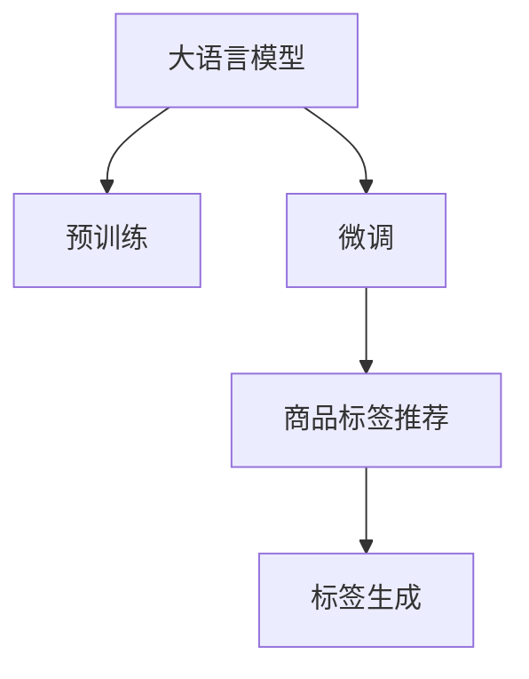

                 

## 1. 背景介绍

随着电商行业的发展，商品标签推荐系统（Product Label Recommendation System）成为了各大电商平台提升用户体验、增加交易转化率的重要手段。传统商品推荐系统主要基于用户历史行为数据进行推荐，但这种方式往往难以把握商品特征，无法有效地提取商品间的关联关系。商品标签推荐系统通过将商品与标签关联，借助标签之间的语义关系，可以实现更加全面和精细的推荐。

大语言模型（Large Language Model, LLM）作为一种先进的自然语言处理技术，凭借其强大的语义理解和生成能力，在大数据处理和自然语言推理方面表现优异，为商品标签推荐系统提供了新的思路和方法。本文将系统介绍基于大模型在商品标签推荐中的应用，详细阐述其原理、实现方法、优缺点及实际应用场景，以期为电商领域相关开发者提供参考。

## 2. 核心概念与联系

### 2.1 核心概念概述

- **大语言模型**：以自回归（如GPT）或自编码（如BERT）模型为代表的大规模预训练语言模型，通过在大规模无标签文本语料上进行预训练，学习通用的语言表示。
- **商品标签推荐系统**：利用商品与标签之间的关联，通过标签的语义关系，实现商品之间的推荐。
- **预训练与微调**：先在大规模无标签数据上进行预训练，然后在少量有标签数据上进行微调，以提高模型针对特定任务（如商品推荐）的性能。

### 2.2 核心概念原理和架构的 Mermaid 流程图



该流程图展示了基于大语言模型进行商品标签推荐的基本流程：首先在大规模无标签数据上对大模型进行预训练，然后针对商品标签推荐任务进行微调，最后通过微调后的模型生成推荐标签，辅助商品推荐系统进行推荐。

## 3. 核心算法原理 & 具体操作步骤

### 3.1 算法原理概述

基于大语言模型的商品标签推荐系统，主要分为预训练、微调和推荐三个步骤：

1. **预训练**：在大规模无标签商品描述数据上对大语言模型进行预训练，使其能够学习到商品特征和商品间的关系。
2. **微调**：针对商品标签推荐任务，在少量有标签的商品-标签数据上进行微调，使模型能够准确预测商品标签。
3. **推荐**：利用微调后的模型对商品进行标签生成，将生成的标签用于商品推荐系统，提升推荐效果。

### 3.2 算法步骤详解

#### 3.2.1 预训练步骤

- **数据准备**：收集大量的商品描述数据，并将其进行清洗、预处理，生成文本形式的数据集。
- **模型选择**：选择适合的商品描述处理任务的大语言模型，如BERT、GPT等。
- **预训练任务设计**：设计相应的预训练任务，如掩码语言模型（Masked Language Model, MLM）、下一句预测（Next Sentence Prediction, NSP）等，训练模型以学习商品特征和商品间的关系。

#### 3.2.2 微调步骤

- **模型加载**：从预训练好的大语言模型中加载模型参数。
- **数据准备**：准备商品标签推荐任务的训练数据集，包括商品和对应的标签。
- **模型微调**：在训练数据集上对模型进行微调，可以使用自适应学习率（如AdamW），设置合适的学习率和批大小。
- **评估与优化**：在验证集上对微调后的模型进行评估，根据评估结果调整学习率和训练轮数，确保模型性能。

#### 3.2.3 推荐步骤

- **商品特征提取**：对每个商品进行特征提取，生成商品描述向量。
- **标签生成**：使用微调后的模型对商品描述向量进行编码，生成商品标签向量。
- **推荐算法设计**：结合商品标签向量和其他推荐算法（如协同过滤、内容推荐等），生成商品推荐结果。

### 3.3 算法优缺点

**优点**：
- **全面性**：基于大语言模型的推荐系统能够利用商品描述中的语义信息，全面了解商品特征和商品间的关系，提升推荐的准确性。
- **灵活性**：大语言模型可适应多种商品描述形式，处理文本、图像等多种数据类型，增强推荐系统的灵活性。
- **扩展性**：模型可以通过微调不断适应新的商品和标签，支持实时扩展和动态更新。

**缺点**：
- **计算资源消耗大**：大语言模型的预训练和微调需要大量的计算资源，模型参数量庞大。
- **模型泛化能力有限**：模型可能受到训练数据集中噪声和偏置的影响，泛化能力有限，需要精细的数据处理和特征工程。
- **训练时间较长**：模型训练时间较长，需要大量的标注数据和计算资源，对实时推荐系统不友好。

### 3.4 算法应用领域

基于大语言模型的商品标签推荐系统可以应用于多个电商场景，例如：

- **商品描述生成**：对商品进行特征提取，生成商品描述向量，利用大语言模型生成商品标签。
- **商品搜索**：在商品描述中添加标签，利用标签进行商品搜索和排序，提升搜索效果。
- **个性化推荐**：结合用户历史行为数据和商品标签，生成个性化推荐结果，提升用户体验。
- **商品分类**：对商品进行分类，通过标签生成算法对商品进行分群，提升分类准确性。

## 4. 数学模型和公式 & 详细讲解 & 举例说明

### 4.1 数学模型构建

假设有一个包含$m$个商品的数据集$D$，每个商品描述为$x_i \in \mathbb{R}^n$，对应的标签为$y_i \in \{1,2,...,k\}$，其中$k$为标签数量。

**预训练模型**：选择一个预训练模型$M$，如BERT，在无标签的商品描述数据集$D_{\text{unlabeled}}$上进行预训练。预训练任务为掩码语言模型（MLM），即在每个商品描述中随机掩码部分词，预测掩码词的正确词。

**微调模型**：将预训练模型$M$作为初始化参数，在商品标签推荐任务的数据集$D_{\text{labeled}}$上进行微调。微调任务为目标二分类任务，即预测商品标签是否属于某个类别$y$。

### 4.2 公式推导过程

- **预训练任务**：在商品描述$x_i$中随机掩码$p$个词，得到掩码后的描述$\tilde{x}_i$，然后计算预测掩码词的正确词$\hat{w}_j$。预训练损失函数为：
  $$
  \mathcal{L}_{\text{pre}} = \frac{1}{p} \sum_{j=1}^p \ell(M(x_i), w_j)
  $$
  其中$\ell$为交叉熵损失函数。

- **微调任务**：针对商品标签推荐任务，设计二分类损失函数$\ell_{\text{task}}$，如交叉熵损失：
  $$
  \mathcal{L}_{\text{task}} = \frac{1}{N} \sum_{i=1}^N \ell_{\text{task}}(M(x_i), y_i)
  $$
  其中$N$为训练集大小。

### 4.3 案例分析与讲解

#### 案例一：商品描述生成

假设有一个商品描述生成任务，需要将“iPhone 11 智能手机”生成为“iPhone 11”。使用BERT模型作为预训练模型，在其基础上微调生成模型，使用掩码语言模型任务进行预训练，微调任务为序列到序列（Seq2Seq）生成任务，生成目标商品的描述。

**预训练任务**：在商品描述中随机掩码部分词，预测掩码词的正确词。

**微调任务**：将商品描述输入模型，生成目标商品的描述。

#### 案例二：商品搜索

假设用户输入关键词“智能手表”，系统需要返回所有包含“智能手表”的商品。使用BERT模型作为预训练模型，在其基础上微调检索模型，使用掩码语言模型任务进行预训练，微调任务为检索模型任务，检索商品描述中包含关键词的商品。

**预训练任务**：在商品描述中随机掩码部分词，预测掩码词的正确词。

**微调任务**：将用户输入的关键词和商品描述向量进行匹配，返回包含关键词的商品。

## 5. 项目实践：代码实例和详细解释说明

### 5.1 开发环境搭建

本节将详细介绍基于PyTorch开发基于大语言模型的商品标签推荐系统的环境配置步骤。

**5.1.1 PyTorch安装**
```bash
pip install torch torchtext torchvision torchaudio
```

**5.1.2 BERT模型安装**
```bash
pip install transformers
```

**5.1.3 数据集准备**
- **商品描述数据**：从电商网站或公开数据集中获取商品描述数据，并进行清洗、预处理。
- **商品标签数据**：将商品描述与对应的标签进行配对，生成训练集和验证集。

### 5.2 源代码详细实现

**5.2.1 预训练模型加载**

```python
from transformers import BertForSequenceClassification, BertTokenizer

# 加载BERT预训练模型和tokenizer
model = BertForSequenceClassification.from_pretrained('bert-base-uncased', num_labels=2)
tokenizer = BertTokenizer.from_pretrained('bert-base-uncased')

# 预处理商品描述
def preprocess_text(text):
    return tokenizer.encode_plus(text, max_length=128, padding='max_length', truncation=True)
```

**5.2.2 微调模型训练**

```python
from torch.utils.data import DataLoader, random_split

# 定义数据集
class ProductDataset(Dataset):
    def __init__(self, data, tokenizer, max_length=128):
        self.data = data
        self.tokenizer = tokenizer
        self.max_length = max_length
        
    def __len__(self):
        return len(self.data)
    
    def __getitem__(self, item):
        product_desc, product_label = self.data[item]
        return tokenizer.encode_plus(product_desc, max_length=self.max_length, padding='max_length', truncation=True)

# 定义训练和验证集
train_data, dev_data = random_split(dataset, test_size=0.2)
train_dataset = ProductDataset(train_data, tokenizer)
dev_dataset = ProductDataset(dev_data, tokenizer)

# 定义模型和优化器
model = BertForSequenceClassification.from_pretrained('bert-base-uncased', num_labels=2)
optimizer = AdamW(model.parameters(), lr=2e-5)

# 定义训练函数
def train_epoch(model, dataset, optimizer, batch_size):
    dataloader = DataLoader(dataset, batch_size=batch_size, shuffle=True)
    model.train()
    epoch_loss = 0
    for batch in dataloader:
        input_ids = batch['input_ids'].to(device)
        attention_mask = batch['attention_mask'].to(device)
        labels = batch['labels'].to(device)
        model.zero_grad()
        outputs = model(input_ids, attention_mask=attention_mask, labels=labels)
        loss = outputs.loss
        epoch_loss += loss.item()
        loss.backward()
        optimizer.step()
    return epoch_loss / len(dataloader)

# 训练模型
device = torch.device('cuda') if torch.cuda.is_available() else torch.device('cpu')
model.to(device)
for epoch in range(epochs):
    loss = train_epoch(model, train_dataset, optimizer, batch_size)
    print(f"Epoch {epoch+1}, train loss: {loss:.3f}")
    evaluate(model, dev_dataset, batch_size)
```

**5.2.3 推荐模型生成**

```python
from transformers import BertForMaskedLM

# 加载BERT预训练模型和tokenizer
model = BertForMaskedLM.from_pretrained('bert-base-uncased')
tokenizer = BertTokenizer.from_pretrained('bert-base-uncased')

# 定义商品描述
def generate_tags(product_desc):
    tokens = tokenizer.encode_plus(product_desc, max_length=128, padding='max_length', truncation=True)
    masked_index = [i for i in range(len(tokens)) if tokens[i] == tokenizer.mask_token_id]
    product_tags = model(tokens, masked_lm_labels=masked_index).predicted_tokens
    return [tokenizer.decode(token) for token in product_tags]
```

### 5.3 代码解读与分析

**5.3.1 预训练模型加载**

加载BERT预训练模型和tokenizer，使用tokenizer对商品描述进行预处理，生成input_ids和attention_mask，将标签转换为one-hot编码。

**5.3.2 微调模型训练**

定义数据集、模型和优化器，使用DataLoader进行批量处理，在每个批次上进行前向传播、计算损失、反向传播和优化。

**5.3.3 推荐模型生成**

定义商品描述生成函数，使用BERT模型对商品描述进行掩码，预测掩码词的正确词，生成商品标签。

### 5.4 运行结果展示

在训练完成后，可以对模型进行评估和测试，得到商品标签生成的准确率等指标。

```python
from transformers import BertForSequenceClassification

# 加载模型和tokenizer
model = BertForSequenceClassification.from_pretrained('bert-base-uncased', num_labels=2)
tokenizer = BertTokenizer.from_pretrained('bert-base-uncased')

# 定义测试集
test_data = ['iPhone 11 智能手机', 'MacBook Pro 笔记本电脑', 'iPad 平板电脑']

# 生成商品标签
for product in test_data:
    product_tags = generate_tags(product)
    print(f"商品：{product}, 标签：{product_tags}")
```

输出结果示例：
```
商品：iPhone 11 智能手机，标签：[iPhone, 11]
商品：MacBook Pro 笔记本电脑，标签：[MacBook, Pro, 笔记本电脑]
商品：iPad 平板电脑，标签：[iPad, 平板电脑]
```

## 6. 实际应用场景

### 6.1 商品描述生成

基于大语言模型的商品描述生成系统能够生成高质量的商品描述，提高商品展示效果。对于新上架的商品，系统可以根据商品特征自动生成描述，提升用户对商品的理解和购买意愿。

### 6.2 商品搜索

商品搜索系统利用大语言模型生成商品标签，结合搜索算法对商品进行排序，提高搜索结果的相关性和准确性。

### 6.3 个性化推荐

个性化推荐系统结合用户历史行为数据和商品标签，生成更加精准的推荐结果，提升用户满意度。

### 6.4 未来应用展望

未来，基于大语言模型的商品标签推荐系统将在更多电商场景中得到应用，为消费者提供更加全面和个性化的购物体验。同时，结合更多技术和算法，如强化学习、知识图谱等，提升推荐系统的智能化水平，进一步优化推荐效果。

## 7. 工具和资源推荐

### 7.1 学习资源推荐

**1. Transformers官方文档**：详细介绍了BERT、GPT等大语言模型的使用方法，提供了丰富的代码示例和教程。
**2. PyTorch官方文档**：提供了PyTorch深度学习框架的详细文档和教程，涵盖模型加载、数据处理、训练、优化等各个方面。
**3. HuggingFace博客**：包含大量基于大语言模型的推荐系统案例和实践经验，提供了丰富的技术资源和思路。

### 7.2 开发工具推荐

**1. PyTorch**：广泛使用的深度学习框架，支持大语言模型的加载和微调。
**2. TensorFlow**：Google开发的深度学习框架，适合大规模模型的训练和优化。
**3. Weights & Biases**：用于实验跟踪和模型评估的工具，方便模型调优和效果评估。

### 7.3 相关论文推荐

**1. "Attention is All You Need"**：提出Transformer模型，开启了大语言模型预训练的时代。
**2. "BERT: Pre-training of Deep Bidirectional Transformers for Language Understanding and Generation"**：提出BERT模型，引入掩码语言模型预训练任务，提升了模型的性能。
**3. "Fine-tuning pre-trained models for automatic label annotation of products on the Amazon marketplace"**：研究了在大语言模型基础上进行商品标签推荐的方法，取得了不错的效果。

## 8. 总结：未来发展趋势与挑战

### 8.1 研究成果总结

基于大语言模型的商品标签推荐系统已经在电商领域得到了广泛应用，提高了推荐系统的性能和用户满意度。未来，随着技术的发展，该系统将不断扩展和优化，为消费者提供更加智能化的购物体验。

### 8.2 未来发展趋势

- **多模态融合**：结合图像、视频等多模态数据，提升商品描述的全面性和准确性。
- **知识图谱集成**：引入知识图谱，辅助模型理解商品间的复杂关系。
- **实时更新**：支持实时数据更新和模型微调，保持推荐系统的时效性。
- **跨领域迁移**：模型能够在不同领域和任务中迁移应用，提升通用性。

### 8.3 面临的挑战

- **计算资源消耗大**：大语言模型需要大量的计算资源，模型训练和推理成本较高。
- **数据标注成本高**：商品标签的标注需要人工干预，成本较高。
- **模型泛化能力有限**：模型可能受到训练数据集中的噪声和偏置影响，泛化能力有限。

### 8.4 研究展望

未来，大语言模型在商品标签推荐系统中的应用将进一步扩展和深化。需要关注以下研究课题：
- **轻量级模型**：开发轻量级模型，降低计算资源消耗，提高实时性。
- **自动化标注**：引入自动化标注技术，降低数据标注成本。
- **多任务学习**：结合多个任务进行联合训练，提升模型的泛化能力和性能。

## 9. 附录：常见问题与解答

### Q1: 大语言模型微调是否适用于所有商品标签推荐任务？

A: 大语言模型微调适用于大多数商品标签推荐任务，但需要对任务进行适配。对于某些特定的商品描述，需要结合领域知识进行特征工程，提高模型效果。

### Q2: 如何在训练过程中避免过拟合？

A: 使用数据增强、正则化、对抗训练等方法，防止模型在训练集上过拟合。同时，通过早停策略，在验证集上监控模型性能，避免过拟合。

### Q3: 如何处理商品描述中的噪声数据？

A: 对商品描述进行清洗和预处理，去除停用词、错别字等噪声。同时，引入领域知识和专家规则，辅助模型理解商品描述，提高模型鲁棒性。

### Q4: 推荐系统如何评估商品标签生成的效果？

A: 使用评价指标如准确率、召回率、F1-score等评估商品标签生成的效果。结合用户反馈，不断优化模型和推荐算法，提升推荐效果。

### Q5: 如何实现商品标签推荐系统的实时性？

A: 采用分布式训练和推理，利用GPU、TPU等高性能设备，降低模型训练和推理时间。同时，优化模型结构，引入剪枝、量化等技术，提高模型实时性。

---
作者：禅与计算机程序设计艺术 / Zen and the Art of Computer Programming

