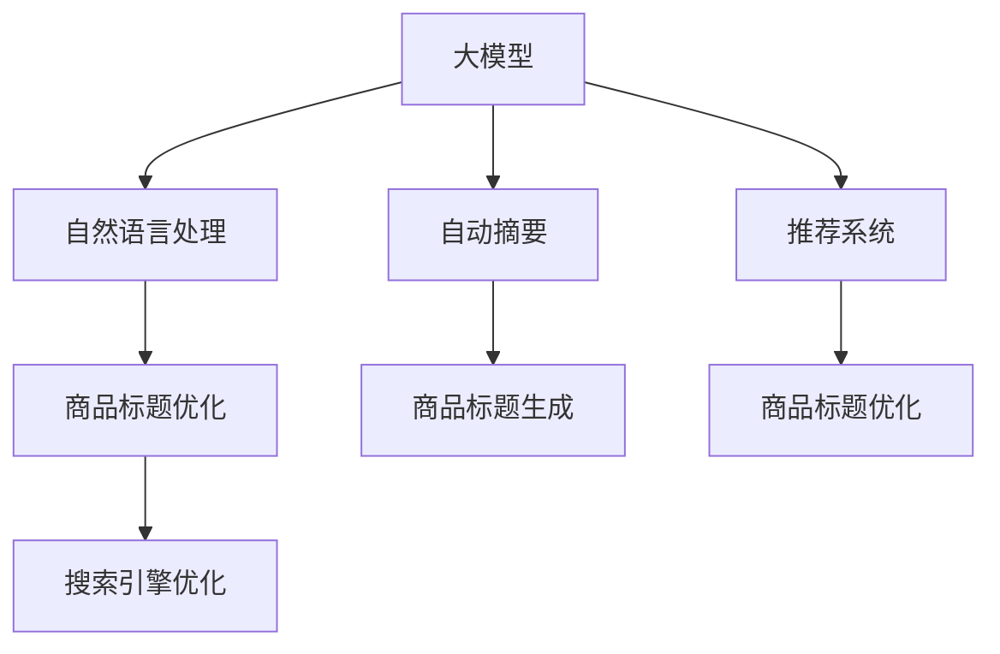

                 

# 大模型在商品标题优化中的应用

> 关键词：大模型,商品标题优化,自然语言处理(NLP),自动摘要,推荐系统,商品搜索引擎

## 1. 背景介绍

### 1.1 问题由来

在电商领域，商品标题的设计直接影响到用户的搜索体验和点击率，因此如何自动优化商品标题成为一个重要的研究方向。传统的标题优化依赖人工标注和经验，效率低下且成本高昂。近年来，随着大模型的发展，基于大模型的商品标题优化方法逐渐成为热门话题。

大模型，尤其是预训练语言模型（如BERT、GPT等），通过海量的文本数据学习到丰富的语言知识和语义信息。将这些知识应用于商品标题优化，能够显著提升标题的准确性和吸引力，增强搜索引擎的召回率和点击率。

### 1.2 问题核心关键点

大模型在商品标题优化中的应用，核心在于：
1. **语义理解**：商品标题优化需要理解商品描述和相关属性，将其转化为更吸引人的标题。
2. **关键词提取**：从商品描述中自动抽取关键词，用于优化标题和改进搜索结果。
3. **自动摘要**：利用大模型的自动摘要能力，生成简明扼要的标题摘要。
4. **个性化定制**：基于用户行为数据，对商品标题进行个性化优化，提升用户满意度和转化率。
5. **搜索引擎优化**：通过优化商品标题，提高其在搜索引擎中的排名和可见性。

### 1.3 问题研究意义

商品标题优化是电商领域中的一个重要任务，直接影响用户体验和销售额。通过大模型的方法，可以显著降低人工成本，提升标题优化效率，并带来更好的搜索结果和用户体验。这对于电商平台的智能化运营和营销策略的优化具有重要意义。

## 2. 核心概念与联系

### 2.1 核心概念概述

为更好地理解大模型在商品标题优化中的应用，本节将介绍几个密切相关的核心概念：

- 大模型(Large Model)：如BERT、GPT等预训练语言模型，通过大规模无标签数据学习到丰富的语言表示能力。
- 自然语言处理(NLP)：涉及对自然语言的理解和生成，是大模型在商品标题优化中应用的基础。
- 自动摘要(Automatic Summarization)：从长文本中提取关键信息，生成简短的摘要文本，适用于商品标题生成。
- 推荐系统(Recommendation System)：通过分析用户行为数据，推荐用户感兴趣的商品，并优化商品标题以提升转化率。
- 搜索引擎优化(SEO)：优化商品标题以提高搜索引擎中的排名和可见性，提升点击率和转化率。

这些核心概念之间的逻辑关系可以通过以下Mermaid流程图来展示：



这个流程图展示了核心概念之间的联系：

1. 大模型通过预训练学习语言知识，进而支持自然语言处理、自动摘要和推荐系统等任务。
2. 自然语言处理和自动摘要技术用于商品标题生成和优化。
3. 推荐系统根据用户行为数据，优化商品标题以提升转化率。
4. 搜索引擎优化则通过优化商品标题，提高其在搜索引擎中的排名。

## 3. 核心算法原理 & 具体操作步骤
### 3.1 算法原理概述

大模型在商品标题优化中的应用，主要是基于自然语言处理和自动摘要技术，通过大模型学习到的语言表示能力，自动生成和优化商品标题。核心算法原理包括：

1. **语义理解**：利用大模型的语义表示能力，理解商品描述和相关属性，从而生成更符合用户需求的标题。
2. **关键词提取**：从商品描述中自动抽取关键词，用于优化标题和改进搜索结果。
3. **自动摘要**：利用大模型的自动摘要能力，生成简明扼要的标题摘要。
4. **生成式模型**：使用生成式大模型，如GPT等，自动生成商品标题。

### 3.2 算法步骤详解

基于大模型的商品标题优化一般包括以下几个关键步骤：

**Step 1: 数据预处理**
- 收集商品描述和相关属性，清洗和标准化数据。
- 对商品描述进行分词和编码，准备输入大模型的文本。

**Step 2: 选择预训练模型**
- 选择合适的预训练语言模型，如BERT、GPT等，作为初始化参数。
- 根据需要，对预训练模型进行微调，以适应具体的应用场景。

**Step 3: 模型适配**
- 设计任务适配层，将预训练模型输出与商品标题生成或优化任务相关联。
- 定义损失函数，如交叉熵损失、均方误差损失等，衡量模型预测与真实标签之间的差异。

**Step 4: 训练和评估**
- 使用训练集对模型进行训练，优化模型参数。
- 在验证集上评估模型性能，根据性能指标决定是否触发Early Stopping。
- 重复上述步骤直到满足预设的迭代轮数或Early Stopping条件。

**Step 5: 测试和部署**
- 在测试集上评估微调后模型，对比微调前后的性能提升。
- 使用微调后的模型对新商品进行标题生成或优化，集成到实际的商品管理系统中。

### 3.3 算法优缺点

基于大模型的商品标题优化方法具有以下优点：
1. **效率高**：利用大模型自动生成和优化标题，显著降低人工成本和优化周期。
2. **效果好**：大模型学习到丰富的语言知识，生成的标题更符合用户需求，提升点击率和转化率。
3. **可扩展性强**：适用于多种商品类别和语言，通用性好。
4. **持续优化**：可以不断更新大模型和优化算法，保持优化效果的持续提升。

同时，该方法也存在一定的局限性：
1. **依赖数据质量**：标题优化效果依赖于商品描述和相关属性数据的准确性，数据质量不高可能导致效果不佳。
2. **复杂度高**：大模型需要大规模训练和推理资源，对于小规模商品类别可能不适用。
3. **模型复杂**：生成式大模型结构复杂，训练和推理速度较慢。

尽管存在这些局限性，但就目前而言，基于大模型的商品标题优化方法仍是大规模商业应用的重要工具。未来相关研究的重点在于如何进一步降低计算资源需求，提高模型效率和可扩展性。

### 3.4 算法应用领域

基于大模型的商品标题优化方法，在电商领域已经得到了广泛的应用，覆盖了几乎所有商品类别，例如：

- 服装鞋帽：自动生成描述性强的商品标题，提升点击率和转化率。
- 家电家居：生成详细的产品特点，帮助用户快速了解商品信息。
- 图书文具：优化书评摘要，吸引潜在读者购买。
- 数码产品：生成简明扼要的产品介绍，提升用户购买决策速度。

除了上述这些经典应用外，大模型还在更多场景中得到了创新性的应用，如跨语言标题优化、多模态商品信息整合等，为电商平台的智能化运营提供了新的解决方案。

## 4. 数学模型和公式 & 详细讲解 & 举例说明

### 4.1 数学模型构建

假设商品描述为 $x \in \mathcal{X}$，商品属性为 $y \in \mathcal{Y}$，预训练大模型为 $M_{\theta}$。定义自动摘要任务的目标是生成一个长度为 $k$ 的摘要 $o \in \mathcal{O}$，与真实摘要 $o^*$ 的距离度量使用BLEU（BiLingual Evaluation Understudy）评分。

定义自动摘要任务的损失函数为：

$$
\mathcal{L}(o, o^*, k) = - \text{BLEU}(o, o^*)
$$

其中，BLEU评分可以表示为：

$$
\text{BLEU}(o, o^*) = \frac{1}{N}\sum_{i=1}^N \max_{0 \leq i \leq k} \frac{\text{IDF}(w_i)}{\text{N}(w_i)} \times 1\{w_i \in o^*\}
$$

其中，$w_i$ 为摘要中第 $i$ 个词语，$\text{IDF}(w_i)$ 为单词 $w_i$ 的逆文档频率，$\text{N}(w_i)$ 为单词 $w_i$ 在摘要中出现的次数。

### 4.2 公式推导过程

对于自动摘要任务，目标是将长文本 $x$ 转换为一个长度为 $k$ 的摘要 $o$。大模型的自动摘要过程可以表示为：

$$
o = M_{\theta}(x)
$$

其中，$M_{\theta}$ 为预训练大模型的自动摘要模块。自动摘要过程的损失函数为：

$$
\mathcal{L}(o, o^*, k) = - \text{BLEU}(o, o^*)
$$

通过最小化BLEU评分，自动摘要模型可以生成更符合用户需求的摘要。自动摘要模型的一般框架为：

1. 将商品描述 $x$ 输入到预训练大模型 $M_{\theta}$ 中。
2. 对大模型的输出 $o$ 进行解码和筛选，得到长度为 $k$ 的摘要 $o_k$。
3. 计算 $o_k$ 与真实摘要 $o^*$ 的BLEU评分，作为模型的损失。

### 4.3 案例分析与讲解

以服装鞋帽商品的自动摘要为例，详细分析自动摘要过程。

1. **数据准备**：收集商品描述和相关属性，对文本进行分词和编码，得到预处理后的输入。
2. **模型选择**：选择BERT或GPT等预训练大模型，作为自动摘要的初始化参数。
3. **模型适配**：设计任务适配层，将预训练模型输出与摘要生成任务相关联。
4. **训练和评估**：使用训练集对模型进行训练，优化模型参数。在验证集上评估模型性能，根据性能指标决定是否触发Early Stopping。
5. **测试和部署**：在测试集上评估微调后模型，对比微调前后的性能提升。使用微调后的模型对新商品进行摘要生成，集成到实际的商品管理系统中。

## 5. 项目实践：代码实例和详细解释说明
### 5.1 开发环境搭建

在进行商品标题优化实践前，我们需要准备好开发环境。以下是使用Python进行PyTorch开发的环境配置流程：

1. 安装Anaconda：从官网下载并安装Anaconda，用于创建独立的Python环境。

2. 创建并激活虚拟环境：
```bash
conda create -n pytorch-env python=3.8 
conda activate pytorch-env
```

3. 安装PyTorch：根据CUDA版本，从官网获取对应的安装命令。例如：
```bash
conda install pytorch torchvision torchaudio cudatoolkit=11.1 -c pytorch -c conda-forge
```

4. 安装Transformers库：
```bash
pip install transformers
```

5. 安装各类工具包：
```bash
pip install numpy pandas scikit-learn matplotlib tqdm jupyter notebook ipython
```

完成上述步骤后，即可在`pytorch-env`环境中开始商品标题优化实践。

### 5.2 源代码详细实现

下面以服装鞋帽商品标题优化为例，给出使用Transformers库进行自动摘要的PyTorch代码实现。

首先，定义自动摘要任务的数据处理函数：

```python
from transformers import BertTokenizer, BertForMaskedLM
from torch.utils.data import Dataset, DataLoader
import torch

class ClothingDataset(Dataset):
    def __init__(self, texts, labels):
        self.texts = texts
        self.labels = labels
        self.tokenizer = BertTokenizer.from_pretrained('bert-base-cased')
        
    def __len__(self):
        return len(self.texts)
    
    def __getitem__(self, item):
        text = self.texts[item]
        label = self.labels[item]
        
        encoding = self.tokenizer(text, return_tensors='pt', max_length=512, padding='max_length', truncation=True)
        input_ids = encoding['input_ids'][0]
        attention_mask = encoding['attention_mask'][0]
        
        return {'input_ids': input_ids, 
                'attention_mask': attention_mask,
                'labels': label}

# 数据集划分
train_dataset = ClothingDataset(train_texts, train_labels)
dev_dataset = ClothingDataset(dev_texts, dev_labels)
test_dataset = ClothingDataset(test_texts, test_labels)
```

然后，定义模型和优化器：

```python
from transformers import BertForMaskedLM, AdamW

model = BertForMaskedLM.from_pretrained('bert-base-cased')

optimizer = AdamW(model.parameters(), lr=2e-5)
```

接着，定义训练和评估函数：

```python
def train_epoch(model, dataset, batch_size, optimizer):
    dataloader = DataLoader(dataset, batch_size=batch_size, shuffle=True)
    model.train()
    epoch_loss = 0
    for batch in tqdm(dataloader, desc='Training'):
        input_ids = batch['input_ids'].to(device)
        attention_mask = batch['attention_mask'].to(device)
        labels = batch['labels'].to(device)
        model.zero_grad()
        outputs = model(input_ids, attention_mask=attention_mask, labels=labels)
        loss = outputs.loss
        epoch_loss += loss.item()
        loss.backward()
        optimizer.step()
    return epoch_loss / len(dataloader)

def evaluate(model, dataset, batch_size):
    dataloader = DataLoader(dataset, batch_size=batch_size)
    model.eval()
    preds, labels = [], []
    with torch.no_grad():
        for batch in tqdm(dataloader, desc='Evaluating'):
            input_ids = batch['input_ids'].to(device)
            attention_mask = batch['attention_mask'].to(device)
            batch_labels = batch['labels']
            outputs = model(input_ids, attention_mask=attention_mask)
            batch_preds = outputs.logits.argmax(dim=2).to('cpu').tolist()
            batch_labels = batch_labels.to('cpu').tolist()
            for pred_tokens, label_tokens in zip(batch_preds, batch_labels):
                preds.append(pred_tokens[:len(label_tokens)])
                labels.append(label_tokens)
                
    print(classification_report(labels, preds))
```

最后，启动训练流程并在测试集上评估：

```python
epochs = 5
batch_size = 16

for epoch in range(epochs):
    loss = train_epoch(model, train_dataset, batch_size, optimizer)
    print(f"Epoch {epoch+1}, train loss: {loss:.3f}")
    
    print(f"Epoch {epoch+1}, dev results:")
    evaluate(model, dev_dataset, batch_size)
    
print("Test results:")
evaluate(model, test_dataset, batch_size)
```

以上就是使用PyTorch对BERT进行服装鞋帽商品自动摘要的完整代码实现。可以看到，得益于Transformers库的强大封装，我们可以用相对简洁的代码完成BERT模型的加载和微调。

### 5.3 代码解读与分析

让我们再详细解读一下关键代码的实现细节：

**ClothingDataset类**：
- `__init__`方法：初始化文本和标签，创建BertTokenizer实例。
- `__len__`方法：返回数据集的样本数量。
- `__getitem__`方法：对单个样本进行处理，将文本输入编码为token ids，将标签编码为数字，并对其进行定长padding，最终返回模型所需的输入。

**自动摘要训练流程**：
- `train_epoch`函数：对数据以批为单位进行迭代，在每个批次上前向传播计算loss并反向传播更新模型参数。
- `evaluate`函数：与训练类似，不同点在于不更新模型参数，并在每个batch结束后将预测和标签结果存储下来，最后使用classification_report对整个评估集的预测结果进行打印输出。

**训练流程**：
- 定义总的epoch数和batch size，开始循环迭代。
- 每个epoch内，先在训练集上训练，输出平均loss。
- 在验证集上评估，输出分类指标。
- 所有epoch结束后，在测试集上评估，给出最终测试结果。

可以看到，PyTorch配合Transformers库使得BERT微调的代码实现变得简洁高效。开发者可以将更多精力放在数据处理、模型改进等高层逻辑上，而不必过多关注底层的实现细节。

当然，工业级的系统实现还需考虑更多因素，如模型的保存和部署、超参数的自动搜索、更灵活的任务适配层等。但核心的自动摘要范式基本与此类似。

## 6. 实际应用场景
### 6.1 智能客服系统

基于大模型的商品标题优化技术，可以应用于智能客服系统的构建。智能客服系统通过自动优化商品标题，能够提升客户咨询体验和问题解决效率，同时降低人工客服成本。

在技术实现上，可以收集企业内部的历史客服对话记录，将问题和最佳答复构建成监督数据，在此基础上对预训练大模型进行微调。微调后的模型能够自动生成符合用户需求的商品标题，提升客户咨询体验和问题解决效率。

### 6.2 电商平台商品搜索

商品标题优化是电商平台中一个重要任务。通过优化商品标题，提升搜索引擎的召回率和点击率，从而提升用户购买转化率。

在实际应用中，可以根据用户搜索关键词，自动生成匹配的商品标题，并进行相关性排序，提升用户体验。同时，可以针对不同用户的搜索行为，生成个性化推荐的商品标题，提升转化率。

### 6.3 多模态商品展示

现代电商平台不再局限于纯文本展示商品信息，而是将商品图片、视频等多模态数据与文本信息相结合，提升商品展示效果。通过自动优化商品标题，配合多模态展示，能够更好地吸引用户注意力，提升用户购买决策速度。

## 7. 工具和资源推荐
### 7.1 学习资源推荐

为了帮助开发者系统掌握大模型在商品标题优化中的应用，这里推荐一些优质的学习资源：

1. 《Transformer从原理到实践》系列博文：由大模型技术专家撰写，深入浅出地介绍了Transformer原理、BERT模型、自动摘要技术等前沿话题。

2. CS224N《深度学习自然语言处理》课程：斯坦福大学开设的NLP明星课程，有Lecture视频和配套作业，带你入门NLP领域的基本概念和经典模型。

3. 《Natural Language Processing with Transformers》书籍：Transformers库的作者所著，全面介绍了如何使用Transformers库进行NLP任务开发，包括自动摘要在内的诸多范式。

4. HuggingFace官方文档：Transformers库的官方文档，提供了海量预训练模型和完整的自动摘要样例代码，是上手实践的必备资料。

5. CLUE开源项目：中文语言理解测评基准，涵盖大量不同类型的中文NLP数据集，并提供了基于自动摘要的baseline模型，助力中文NLP技术发展。

通过对这些资源的学习实践，相信你一定能够快速掌握大模型在商品标题优化中的应用，并用于解决实际的NLP问题。
###  7.2 开发工具推荐

高效的开发离不开优秀的工具支持。以下是几款用于大模型自动摘要开发的常用工具：

1. PyTorch：基于Python的开源深度学习框架，灵活动态的计算图，适合快速迭代研究。大部分预训练语言模型都有PyTorch版本的实现。

2. TensorFlow：由Google主导开发的开源深度学习框架，生产部署方便，适合大规模工程应用。同样有丰富的预训练语言模型资源。

3. Transformers库：HuggingFace开发的NLP工具库，集成了众多SOTA语言模型，支持PyTorch和TensorFlow，是进行自动摘要任务开发的利器。

4. Weights & Biases：模型训练的实验跟踪工具，可以记录和可视化模型训练过程中的各项指标，方便对比和调优。与主流深度学习框架无缝集成。

5. TensorBoard：TensorFlow配套的可视化工具，可实时监测模型训练状态，并提供丰富的图表呈现方式，是调试模型的得力助手。

6. Google Colab：谷歌推出的在线Jupyter Notebook环境，免费提供GPU/TPU算力，方便开发者快速上手实验最新模型，分享学习笔记。

合理利用这些工具，可以显著提升大模型自动摘要任务的开发效率，加快创新迭代的步伐。

### 7.3 相关论文推荐

大模型和自动摘要技术的发展源于学界的持续研究。以下是几篇奠基性的相关论文，推荐阅读：

1. Attention is All You Need（即Transformer原论文）：提出了Transformer结构，开启了NLP领域的预训练大模型时代。

2. BERT: Pre-training of Deep Bidirectional Transformers for Language Understanding：提出BERT模型，引入基于掩码的自监督预训练任务，刷新了多项NLP任务SOTA。

3. Sparsely-Connected Attention: Fast Transformer Training with Guaranteed Convergence（Sparse Transformer论文）：提出稀疏Transformer结构，在保证收敛性的同时大幅降低计算量。

4. Longformer: The Long-Document Transformer（Longformer论文）：提出Longformer模型，解决传统Transformer处理长文本效率低下的问题。

5. M2M-100: A Dataset and Evaluation Benchmark for Machine Translation：提供大规模多语言翻译数据集，推动了多语言翻译技术的进展。

6. Universal Sentence Encoder：提出通用句子嵌入技术，实现了大规模语料库上的句子相似度计算。

这些论文代表了大模型自动摘要技术的发展脉络。通过学习这些前沿成果，可以帮助研究者把握学科前进方向，激发更多的创新灵感。

## 8. 总结：未来发展趋势与挑战

### 8.1 总结

本文对基于大模型的商品标题优化方法进行了全面系统的介绍。首先阐述了大模型和自动摘要技术的研究背景和意义，明确了自动摘要在提升商品展示效果、优化搜索结果等方面的重要价值。其次，从原理到实践，详细讲解了自动摘要的数学原理和关键步骤，给出了自动摘要任务开发的完整代码实例。同时，本文还广泛探讨了自动摘要技术在智能客服、电商平台搜索、多模态商品展示等多个行业领域的应用前景，展示了自动摘要范式的巨大潜力。此外，本文精选了自动摘要技术的各类学习资源，力求为读者提供全方位的技术指引。

通过本文的系统梳理，可以看到，基于大模型的自动摘要技术正在成为NLP领域的重要范式，极大地拓展了预训练语言模型的应用边界，催生了更多的落地场景。受益于大规模语料的预训练，自动摘要模型以更低的时间和标注成本，生成更符合用户需求的摘要，提升商品展示效果和搜索结果，为电商平台智能化运营和用户体验优化提供了新的解决方案。未来，伴随预训练语言模型和自动摘要方法的持续演进，相信自动摘要技术必将在更广阔的应用领域大放异彩，深刻影响用户的购物体验和电商平台的发展方向。

### 8.2 未来发展趋势

展望未来，自动摘要技术将呈现以下几个发展趋势：

1. **模型规模持续增大**：随着算力成本的下降和数据规模的扩张，预训练语言模型的参数量还将持续增长。超大规模语言模型蕴含的丰富语言知识，有望支撑更加复杂多变的自动摘要任务。

2. **多模态自动摘要**：现代电商平台不再局限于纯文本展示商品信息，而是将商品图片、视频等多模态数据与文本信息相结合，提升商品展示效果。自动摘要技术将进一步拓展到多模态数据处理，实现更全面、多样化的信息展示。

3. **个性化自动摘要**：基于用户行为数据，对自动摘要进行个性化优化，提升用户满意度和转化率。自动摘要技术将与推荐系统等技术结合，实现更加精准的商品展示和推荐。

4. **实时自动摘要**：通过优化模型结构和算法，实现自动摘要的实时处理，提升用户体验和商品展示效率。

5. **端到端自动化**：自动摘要技术将与自然语言处理、生成式对话等技术结合，实现端到端的自动化服务，提升电商平台的智能化水平。

以上趋势凸显了自动摘要技术在电商平台智能化运营中的重要作用。这些方向的探索发展，必将进一步提升自动摘要技术的性能和应用范围，为电商平台智能化运营和用户体验优化提供新的解决方案。

### 8.3 面临的挑战

尽管自动摘要技术已经取得了瞩目成就，但在迈向更加智能化、普适化应用的过程中，它仍面临着诸多挑战：

1. **标注成本瓶颈**：自动摘要效果的优化依赖于高质量标注数据，对于长尾应用场景，难以获得充足的高质量标注数据，成为制约自动摘要性能的瓶颈。如何进一步降低自动摘要对标注样本的依赖，将是一大难题。

2. **模型鲁棒性不足**：自动摘要模型面对域外数据时，泛化性能往往大打折扣。对于测试样本的微小扰动，自动摘要模型的输出也容易发生波动。如何提高自动摘要模型的鲁棒性，避免灾难性遗忘，还需要更多理论和实践的积累。

3. **推理效率有待提高**：大模型自动摘要模型结构复杂，训练和推理速度较慢。如何在保证性能的同时，简化模型结构，提升推理速度，优化资源占用，将是重要的优化方向。

4. **可解释性亟需加强**：当前自动摘要模型更像是"黑盒"系统，难以解释其内部工作机制和决策逻辑。对于医疗、金融等高风险应用，算法的可解释性和可审计性尤为重要。如何赋予自动摘要模型更强的可解释性，将是亟待攻克的难题。

5. **安全性有待保障**：自动摘要模型可能会学习到有偏见、有害的信息，通过微调传递到下游任务，产生误导性、歧视性的输出，给实际应用带来安全隐患。如何从数据和算法层面消除模型偏见，避免恶意用途，确保输出的安全性，也将是重要的研究课题。

6. **知识整合能力不足**：现有的自动摘要模型往往局限于任务内数据，难以灵活吸收和运用更广泛的先验知识。如何让自动摘要过程更好地与外部知识库、规则库等专家知识结合，形成更加全面、准确的信息整合能力，还有很大的想象空间。

正视自动摘要面临的这些挑战，积极应对并寻求突破，将是自动摘要技术走向成熟的必由之路。相信随着学界和产业界的共同努力，这些挑战终将一一被克服，自动摘要技术必将在构建人机协同的智能系统、提升电商平台智能化运营和用户体验方面发挥更大的作用。

### 8.4 研究展望

面向未来，自动摘要技术需要在以下几个方面寻求新的突破：

1. **探索无监督和半监督自动摘要方法**：摆脱对大规模标注数据的依赖，利用自监督学习、主动学习等无监督和半监督范式，最大限度利用非结构化数据，实现更加灵活高效的自动摘要。

2. **研究参数高效和计算高效的自动摘要方法**：开发更加参数高效的自动摘要方法，在固定大部分预训练参数的同时，只更新极少量的任务相关参数。同时优化自动摘要模型的计算图，减少前向传播和反向传播的资源消耗，实现更加轻量级、实时性的部署。

3. **融合因果和对比学习范式**：通过引入因果推断和对比学习思想，增强自动摘要模型建立稳定因果关系的能力，学习更加普适、鲁棒的语言表征，从而提升模型泛化性和抗干扰能力。

4. **引入更多先验知识**：将符号化的先验知识，如知识图谱、逻辑规则等，与神经网络模型进行巧妙融合，引导自动摘要过程学习更准确、合理的语言模型。同时加强不同模态数据的整合，实现视觉、语音等多模态信息与文本信息的协同建模。

5. **结合因果分析和博弈论工具**：将因果分析方法引入自动摘要模型，识别出模型决策的关键特征，增强输出解释的因果性和逻辑性。借助博弈论工具刻画人机交互过程，主动探索并规避模型的脆弱点，提高系统稳定性。

6. **纳入伦理道德约束**：在模型训练目标中引入伦理导向的评估指标，过滤和惩罚有偏见、有害的输出倾向。同时加强人工干预和审核，建立模型行为的监管机制，确保输出符合人类价值观和伦理道德。

这些研究方向的探索，必将引领自动摘要技术迈向更高的台阶，为构建安全、可靠、可解释、可控的智能系统铺平道路。面向未来，自动摘要技术还需要与其他人工智能技术进行更深入的融合，如知识表示、因果推理、强化学习等，多路径协同发力，共同推动自然语言理解和智能交互系统的进步。只有勇于创新、敢于突破，才能不断拓展自动摘要技术的边界，让智能技术更好地造福人类社会。

## 9. 附录：常见问题与解答

**Q1：自动摘要是否适用于所有商品类别？**

A: 自动摘要技术在大多数商品类别上都能取得不错的效果，特别是对于数据量较大的商品。但对于一些特定领域的商品，如医疗、法律等，仅仅依靠通用语料预训练的模型可能难以很好地适应。此时需要在特定领域语料上进一步预训练，再进行微调，才能获得理想效果。此外，对于一些需要时效性、个性化很强的任务，如对话、推荐等，自动摘要方法也需要针对性的改进优化。

**Q2：自动摘要过程中如何选择合适的学习率？**

A: 自动摘要的学习率一般要比预训练时小1-2个数量级，如果使用过大的学习率，容易破坏预训练权重，导致过拟合。一般建议从1e-5开始调参，逐步减小学习率，直至收敛。也可以使用warmup策略，在开始阶段使用较小的学习率，再逐渐过渡到预设值。需要注意的是，不同的优化器(如AdamW、Adafactor等)以及不同的学习率调度策略，可能需要设置不同的学习率阈值。

**Q3：自动摘要过程中如何缓解过拟合问题？**

A: 过拟合是自动摘要面临的主要挑战，尤其是在标注数据不足的情况下。常见的缓解策略包括：
1. 数据增强：通过回译、近义替换等方式扩充训练集
2. 正则化：使用L2正则、Dropout、Early Stopping等避免过拟合
3. 对抗训练：引入对抗样本，提高模型鲁棒性
4. 参数高效微调：只调整少量参数(如Adapter、Prefix等)，减小过拟合风险
5. 多模型集成：训练多个自动摘要模型，取平均输出，抑制过拟合

这些策略往往需要根据具体任务和数据特点进行灵活组合。只有在数据、模型、训练、推理等各环节进行全面优化，才能最大限度地发挥自动摘要技术的威力。

**Q4：自动摘要模型在落地部署时需要注意哪些问题？**

A: 将自动摘要模型转化为实际应用，还需要考虑以下因素：
1. 模型裁剪：去除不必要的层和参数，减小模型尺寸，加快推理速度
2. 量化加速：将浮点模型转为定点模型，压缩存储空间，提高计算效率
3. 服务化封装：将模型封装为标准化服务接口，便于集成调用
4. 弹性伸缩：根据请求流量动态调整资源配置，平衡服务质量和成本
5. 监控告警：实时采集系统指标，设置异常告警阈值，确保服务稳定性
6. 安全防护：采用访问鉴权、数据脱敏等措施，保障数据和模型安全

自动摘要技术为电商平台智能化运营提供了新的解决方案，但如何将强大的性能转化为稳定、高效、安全的业务价值，还需要工程实践的不断打磨。唯有从数据、算法、工程、业务等多个维度协同发力，才能真正实现人工智能技术在垂直行业的规模化落地。总之，自动摘要需要开发者根据具体任务，不断迭代和优化模型、数据和算法，方能得到理想的效果。

---

作者：禅与计算机程序设计艺术 / Zen and the Art of Computer Programming

